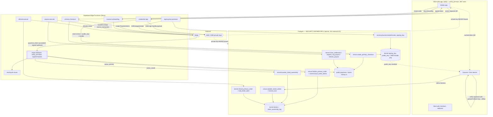

# Phase 2 — Edge Function / Service-Layer Specification

**Status:** BUILD-READY DESIGN SPEC. **Design-only — NO TypeScript, no Deno code, no function bodies.**
Every edge function below is specified so an implementing engineer can author it *without making an
architectural decision*. Where a decision stayed open it is flagged in §12 RECONCILIATION.

**Binding inputs (authority order):**
1. `scratchpad/SPEC_FOUNDATION.md` — **BINDING**: §2 integrate-never-rewrite; §4 C33 credential key model + C35
   acting-principal; §8 security invariants (deny-by-default, RPC-only money/custody, constant-time compare,
   **stripe-webhook keeps `verify_jwt=false`**); §7 market-bridge (no native object mutates a `public.*`
   money/custody row except by linking a `public.payments` id).
2. `PHASE_2_RPC_FUNCTION_CONTRACTS.md` — **primary input.** §13 fixes which transitions are Edge-fronted and the
   DB boundary each wraps; §0.6 the DB-RPC-vs-EDGE distinction. Edge functions **CALL** these atomic RPCs by
   their exact names; they NEVER re-implement a state transition.
3. `PHASE_2_PHYSICAL_POSTGRES_SCHEMA_SPEC.md` §1.7 (`kernel.signing_key` model) + `scratchpad/RECON_TARGETS_FROM_RN.md`
   #4 (cacheable signed token + version-bump invalidation).
4. The **existing live edge layer** (`supabase/functions/`): `stripe-webhook`, `create-payment-intent`,
   `confirm-payment`, `confirm-and-release`, `create-connect-account`, `_shared/{stripe,money,payouts,payout-logic,sentry}.ts`.
   New money edges **EXTEND this discipline, never duplicate it.**

**Golden rule (restated from RPC §0.6 / §0.7):** external I/O (Stripe / KMS / push) lives in an Edge Function;
the atomic state transition lives in a Postgres SECURITY DEFINER RPC. **The edge does the side-effect, then
calls the RPC. The RPC never does external I/O; the edge never writes a `kernel`/`venue`/`market` custody or
money row except through the RPC it wraps.** Money-in is *only* a `public.payments` row via the frozen webhook.

---

## 1. Existing edge layer — the discipline we extend (do not re-derive)

These live functions are the anchors. Every new function inherits their patterns; the specs below cite them
rather than re-describe them.

| Existing fn | Auth | Role in Phase 2 | Reused discipline (the pattern new edges MUST copy) |
|---|---|---|---|
| `stripe-webhook` | **`verify_jwt=false`** (Stripe-signed) | **EXTENDED** for native/primary events (§4) | HMAC-SHA256 signature verify with multi-`v1` rotation support; ±300s replay window; `claim_stripe_webhook_event`/`complete_*`/`fail_*` **lease** (migrations 064/069); fail-CLOSED on claim error; non-2xx ⇒ Stripe retries; `timingSafeEqual`; CORS whitelist + security headers |
| `create-payment-intent` | JWT (Bearer) | **Template** for `primary-checkout` (§3.1) | server-authoritative pricing (never client amount); `check_rate_limit` fail-closed (429/503); get-or-create Stripe Customer + ephemeral key; **deterministic PI idempotency key** salted by failed-attempt count + customer id; `stripe_livemode` recorded from Stripe's own field; structured stage logging, no secrets |
| `confirm-payment` | JWT | untouched (external rail) | synchronous confirm fallback; webhook remains authoritative |
| `confirm-and-release` | JWT | **Template** for `payout-execute` (§3.4) | payout via `_shared/payouts.ts` (capability pre-flight → funding-charge verify → `source_transaction` transfer) |
| `create-connect-account` | JWT | **Template/generalized** by `connect-onboarding` (§3.3) | Stripe Connect Express account create + onboarding link; capability-flag sync via `account.updated` |
| `_shared/stripe.ts` | — | **reuse as-is** | pinned `STRIPE_API_VERSION` / `STRIPE_MOBILE_API_VERSION`; `stripeFetch`/`stripeFetchRaw` |
| `_shared/payout-logic.ts` | — | **reuse as-is** | `buildPayoutIdempotencyKey(transferId, destination)` (deterministic, destination-salted); Stripe error classifier |
| `_shared/payouts.ts` | — | **reuse/extend** | `source_transaction` funding + deterministic idempotency payout shell |
| `_shared/sentry.ts` | — | **reuse as-is** | `captureException(fn, err, ctx)` |
| `send-push`, `notify-transfer`, `notify-report`, `delete-account`, `auto-finalize-auctions`, `enforce-transfer-expiry` | mixed | untouched | native rail reuses `send-push`; native auction MVP reuses `auto-finalize-auctions` (RPC §16.5) |

**Note on `config.toml`:** this tree carries no `supabase/config.toml`; `verify_jwt` is set per-function at
deploy time. Every new function's required `verify_jwt` value is stated in its spec. **Only Stripe/KMS-webhook
endpoints run `verify_jwt=false`; every user-facing edge runs `verify_jwt=true` and re-derives the actor.**

---

## 2. Placement decision table — challenge each candidate

For every candidate the verdict is one of: **RPC** (pure atomic DB transition → stays in Postgres, NOT an edge
fn) · **NEW EDGE** (external I/O / secrets / third-party) · **EXTEND WEBHOOK** (add a branch to the existing
`stripe-webhook`) · **DOOR-SIDE** (runs on the scanner device, no server round-trip) · **NODE/NEXT** (existing
web server). **Rejections are the high-value output — they keep atomic transitions in the DB where they belong.**

| Candidate | Verdict | Why | Wraps / lands in |
|---|---|---|---|
| Create PaymentIntent for a native **primary** order | **NEW EDGE** `primary-checkout` | needs `STRIPE_SECRET_KEY`, customer/ephemeral key, server price authority | calls `venue.create_primary_checkout` (RPC §6.1) for the total; mints PI |
| Confirm native primary payment → **issue atoms** | **EXTEND WEBHOOK** | authoritative money-in event; must ride the frozen signed+leased path (I-10) | `payment_intent.succeeded` branch → `venue.finalize_primary_order` (RPC §6.3) |
| Native **resale/market** payment → transfer custody | **EXTEND WEBHOOK** | same as above; one signed endpoint, one lease table | `payment_intent.succeeded` (rail=native_resale) → `kernel.transfer_ticket_ownership` path via `market` accept, or C25 sweep |
| **Credential signing** (QR token) | **NEW EDGE** `credential-sign` | KMS custody; private key must never touch DB/client (C33) | reads `kernel.tickets`/`kernel.signing_key`; KMS sign |
| **Signing-key provisioning / rotation** | **NEW EDGE** `signing-key-provision` | KMS keygen/rotate/revoke is external I/O | wraps `kernel.provision/rotate/revoke_signing_key` (RPC §13) |
| **Refund executor** (Stripe refund) | **NEW EDGE** `refund-execute` | `stripe.refunds.create` is external; DB only records intent + voids atoms | wraps `kernel.refund_primary_order` / `admin_refund` / `catalog.cancel_event` (RPC §11.4/§4.4) |
| **Payout executor** (Stripe Connect transfer) | **NEW EDGE** `payout-execute` | `stripe.transfers.create` w/ `source_transaction` is external | wraps `kernel.close_settlement` / `request_org_payout` / `release_payout` (RPC §10.2/§10.3/§11.3) |
| Org/venue **Stripe Connect onboarding** | **NEW EDGE** `connect-onboarding` (generalizes `create-connect-account`) | Stripe Account + AccountLink creation | writes `kernel.organization` connect ref via RPC; capability sync via webhook |
| **Online scan validate** (`scan-validate`) | **REJECTED → RPC + DOOR-SIDE** | no secret, no third-party. Liveness is a pure read; signature check uses the *public* key the door already caches | `venue.validate_ticket_online` (RPC §9.3) + door-side verify (§5.4) |
| **Offline scan reconcile** (`scan-reconcile`) | **REJECTED → RPC** | pure atomic batch DB write, no external I/O | `venue.reconcile_offline_scans` (RPC §9.5) — device calls it directly with its JWT/door principal |
| All custody transitions (issue/transfer/void/lock/scan) | **REJECTED → RPC** | atomic single-writer state machine; §5 SSCAS; no external I/O | the three kernel engines (RPC §7) |
| P2P start/accept/cancel, listing create, offer, order create | **REJECTED → RPC** | atomic DB transitions | `market.*` / `venue.*` RPCs |
| TTL & C25 **sweeps** (`sweep_expired_p2p_transfers`, `sweep_paid_pending_sales`) | **REJECTED → RPC via scheduler** | pure DB batch; invoked by `pg_cron`/scheduler, not an edge | RPC §12.2/§12.3 |
| Settlement-open, role grants, config edits, door-PIN issue | **REJECTED → RPC** | single-aggregate DB writes | `venue.*`/`kernel.*` RPCs |
| Push on native events | **REJECTED → reuse `send-push`** | already exists | webhook & RPCs fire `send-push` |
| Native web checkout surface | **NODE/NEXT (deferred)** | the `web/` Next app fronts browser checkout; still calls the same edges | out of MVP edge scope |

**Net new edge functions: 6** (`primary-checkout`, `credential-sign`, `signing-key-provision`,
`refund-execute`, `payout-execute`, `connect-onboarding`) **+ 1 extended** (`stripe-webhook`).

---

## 3. New / extended function specifications

Fields per §0 of the brief: name · method · auth · authz · request · response · DB-RPC · Stripe/KMS · secrets
(names only) · rate limit · idempotency · retries · logging · Sentry · abuse · failure · timeout.

### 3.1 `primary-checkout` — create the PaymentIntent for a native primary order — **NEW EDGE**

- **Method:** `POST` (+ `OPTIONS` preflight). **verify_jwt:** `true`.
- **Authentication:** Supabase JWT (Bearer), verified via `auth.getUser(token)` (copy `create-payment-intent`
  §getAuthenticatedUser). Actor = `user.id` (C35: server-derived, never a body field).
- **Authorization:** any `authenticated` fan (self-checkout) OR a door/staff principal buying on-behalf — the
  **on-behalf buyer id is set by the RPC from the door principal, never trusted from the body.** No role check
  here beyond authentication; authority for issuance lives in `finalize_primary_order`.
- **Request:** `{ session_id: uuid, items: [{ ticket_type_id: uuid, quantity: int }], hold_ids: [uuid],
  command_key: string, expected_total_cents?: int (optional client cross-check) }`.
- **Response:** `{ order_id, clientSecret, paymentIntentId, amount, buyer_fee, seller_fee, total,
  customerId, customerEphemeralKeySecret }` (shape mirrors `create-payment-intent`).
- **DB-RPC called:** `venue.create_primary_checkout(p_session_id, p_items, p_hold_ids, p_command_key)` (RPC
  §6.1) → returns `{ order_id, total_minor, currency }`. **The total is server-authoritative from this RPC;**
  the edge NEVER computes or trusts a client price. If `expected_total_cents` disagrees → `409` (copy the
  `totalMismatch` guard).
- **Stripe:** get-or-create Customer + ephemeral key (reuse `ensureStripeCustomerAndEphemeralKey`); create a
  PaymentIntent for `total_minor`, `currency='usd'`, `automatic_payment_methods`, metadata
  `{ rail:'native_primary', order_id, buyer_id, org_id, session_id }`. Records the `public.payments` row
  (frozen table) with the new `order_id` linkage column and `stripe_livemode` from Stripe's own field.
- **Secrets:** `STRIPE_SECRET_KEY`, `SUPABASE_URL`, `SUPABASE_SERVICE_ROLE_KEY` (env names only).
- **Rate limit:** `check_rate_limit(user, 'primary-checkout', 5, 60)`, **fail-closed** (503 on limiter error,
  429 on over-limit) — copy `create-payment-intent`.
- **Idempotency:** (a) RPC dedupes on `UNIQUE(buyer_id, command_key)` → replay returns the same `order_id`;
  (b) **deterministic PI idempotency key** `pi_native_${order_id}_${total}_c${customerId}` salted with a
  failed-attempt suffix `_r${n}` (copy the create-PI salting rule — a canceled PI must not replay). A double-tap
  returns the same PI + clientSecret.
- **Retries:** safe (both keys). A pending PI is retrieved and its clientSecret re-returned; a canceled PI is
  retired and a fresh salted PI minted (copy `create-payment-intent`).
- **Logging:** structured `{tag:'primary-checkout-stage', stage, order_id, pi_id, amount}` — **never** log
  client_secret, tokens, or PII. **Sentry:** `captureException('primary-checkout', err)` on non-auth 500s;
  auth errors log as 401 warnings (don't flood quota).
- **Abuse:** rate limit + per-user active-hold cap enforced in the RPC (C5); buyer-can't-buy-own via the RPC's
  listing/seller check; holds must belong to the buyer and be unexpired.
- **Failure:** RPC `precondition_failed` (stale/expired hold, session not on-sale) → 409; Stripe failure → 500
  + PI cancel of any orphan; DB-insert 23505 race → return the winner's clientSecret (copy the recovery path).
- **Timeout:** target < 8s wall; Stripe calls have no long polls here. On timeout the client retries with the
  same `command_key` → idempotent.

> **Confirmation is NOT synchronous here.** `primary-checkout` only creates the PI. Authoritative issuance
> happens when `payment_intent.succeeded` reaches the extended webhook (§4). This mirrors the external rail and
> satisfies §6.2 (`confirm_primary_payment_server_side` is realized as a webhook branch, not a separate confirm
> edge) — one signed, leased, replay-safe money-in path.

### 3.2 `credential-sign` — mint the cacheable signed ticket credential (C33) — **NEW EDGE**

Full C33 architecture is in §5. This is the request/response contract.

- **Method:** `POST`. **verify_jwt:** `true`.
- **Authentication:** Supabase JWT (Bearer). Actor = `user.id`.
- **Authorization:** actor **must be the atom's current owner** (`kernel.tickets.current_owner_id = auth.uid()`,
  re-read live inside the request — never a client claim). A non-owner → 403. (Door verification does NOT call
  this; the door verifies with the *public* key — §5.4.)
- **Request:** `{ ticket_atom_id: uuid }`. (No version or key id from the client — both are resolved
  server-side; a client-supplied version is ignored.)
- **Response:** `{ token: <compact signed token>, credential_version: int, signing_key_id: uuid,
  not_after: timestamptz, ttl_seconds: int }`. `token` is the only signed artifact; it embeds
  `{ atom_id, session_id, credential_version, key_id, issued_at, exp }` as signed claims.
- **DB-RPC / reads:** reads `kernel.tickets` (`current_owner_id, state, resale_state, credential_version,
  signing_key_id, event_session_id`) and `kernel.signing_key` (`key_id, kms_handle_ref, status, not_before,
  not_after`) for the atom's active signer. **No state write** — signing does not mutate custody. (A transfer
  bumped `credential_version` in the RPC layer already; this fn just signs the current head.)
- **KMS:** `KMS.sign(kms_handle_ref, canonical_payload)` — asymmetric sign (Ed25519 / ECDSA-P256). **The
  private key never leaves KMS; the edge holds only a handle.** See §5.
- **Secrets:** `KMS_SIGNER_ROLE_ARN` / `KMS_ENDPOINT` / provider creds (env names only — an IAM role/handle,
  never key material), `SUPABASE_URL`, `SUPABASE_SERVICE_ROLE_KEY`.
- **Rate limit:** `check_rate_limit(user, 'credential-sign', 30, 60)` — generous (wallet refresh, reconnect
  re-sign), fail-closed. Per-atom sign throughput target §5.7.
- **Idempotency:** **naturally idempotent** — same `(atom_id, credential_version)` ⇒ deterministic claims ⇒ the
  token is byte-reproducible if the signer is deterministic (Ed25519) or functionally equivalent (any valid
  signature verifies). No dedup row needed. A **version bump invalidates every previously issued token** for
  that atom (recon #4): old tokens carry a stale `credential_version` and fail the door's version check.
- **Retries:** safe/read-only; client may re-sign freely. On KMS transient error → 503 + `Retry-After`.
- **Logging:** `{tag:'credential-sign', atom_id, credential_version, key_id, outcome}` — **never** log the
  token, the payload, or any key material. **Sentry:** capture KMS failures + owner-mismatch spikes (fraud
  signal).
- **Abuse:** owner-only; rate-limited; a revoked/`voided`/`scanned` atom → 409 (no live credential for a dead
  ticket); a `listed`/`locked` atom still signs (the door rejects `listed/locked` at scan, RPC §9.3) — or,
  per policy, refuse to sign a listed atom to reduce screenshot-resale confusion (flagged §12.2).
- **Failure:** owner mismatch 403; atom terminal 409; no active signing key for scope 500 + Sentry (an
  ops-critical gap — an event with issued atoms but no active key); KMS down 503.
- **Timeout:** target < 2s; KMS sign is single-digit ms. Offline clients never call this — they use the cached
  token (§5.6).

### 3.3 `connect-onboarding` — org/venue Stripe Connect onboarding — **NEW EDGE (generalizes `create-connect-account`)**

- **Method:** `POST`. **verify_jwt:** `true`.
- **Authentication:** JWT. Actor = `user.id`.
- **Authorization:** `kernel.has_org_role(p_org_id, [org_owner, org_finance])` — re-checked in the wrapped RPC
  (edge passes the org id; the RPC decides). The **payee is the org (`kernel.organization`), not an individual**
  — this is the Phase 2 change from the per-seller `create-connect-account`.
- **Request:** `{ org_id: uuid, return_url: string, refresh_url: string, command_key: string }`.
- **Response:** `{ connect_account_id, onboarding_url, status }`.
- **DB-RPC:** a `kernel.set_org_connect_ref(p_org_id, p_connect_account_id, p_command_key)` writer records the
  Connect account id on `kernel.organization` (audited) — **reuses existing connect ids where an org already
  has one** (SPEC_FOUNDATION §2, "reuse existing connect ids"). Edge never writes the org row directly.
- **Stripe:** `Account` (Express) create if none; `AccountLink` create for onboarding (copy
  `create-connect-account`). Capability flags (`charges_enabled`/`payouts_enabled`/`details_submitted`) are
  synced by the **extended webhook** `account.updated` branch (§4), matched by `connect_account_id` → org.
- **Secrets:** `STRIPE_SECRET_KEY`, `SUPABASE_URL`, `SUPABASE_SERVICE_ROLE_KEY`.
- **Rate limit:** `check_rate_limit(user, 'connect-onboarding', 5, 60)`, fail-closed.
- **Idempotency:** Stripe `Account` create keyed `connect_org_${org_id}` (deterministic; one account per org);
  RPC dedupe on `command_key`.
- **Retries/Logging/Sentry/Timeout:** copy `create-connect-account`. **Abuse:** org-role-gated; a fan cannot
  onboard. **Failure:** role fail 403; Stripe fail 500. **Timeout:** < 8s.

### 3.4 `payout-execute` — Stripe Connect transfer executor — **NEW EDGE**

- **Method:** `POST` (invoked by an authenticated finance user OR by a scheduler/service principal for the
  settlement-close disbursement leg). **verify_jwt:** `true` (see abuse note for the service-principal path).
- **Authentication:** JWT. Actor = `user.id`.
- **Authorization:** the wrapped RPC enforces role: `has_org_role([org_finance, org_owner])` for
  `request_org_payout`; `is_platform([platform_risk, platform_admin])` (dual-control seam) for `release_payout`.
  The edge passes ids; the RPC decides — no role logic in the edge.
- **Request:** `{ action: 'close_settlement' | 'request_org_payout' | 'release_payout', settlement_id?, org_id?,
  payout_id?, command_key }`.
- **Response:** `{ status, payout_ids: [uuid], stripe_transfer_refs: [string] }`.
- **DB-RPC:** `kernel.close_settlement` (§10.2) → generates `kernel.payout` intents; `kernel.request_org_payout`
  (§10.3) → advances `pending→submitted`; `kernel.release_payout` (§11.3) → resumes a held payout. **The DB
  records the payout intent + advances state; the edge executes the Stripe transfer** and writes back the
  `stripe_transfer_ref` via the RPC's callback param. Order: **RPC-first to claim `submitted` under lock, THEN
  Stripe transfer, THEN RPC callback to record the ref** — so a crash after transfer is recovered by the
  deterministic idempotency key, never a double-pay.
- **Stripe:** reuse `_shared/payouts.ts` — capability pre-flight → funding-charge (`source_transaction`) verify
  → `stripe.transfers.create` under `buildPayoutIdempotencyKey(payout_id, destination)` (**deterministic,
  destination-salted** — a re-onboarded destination mints a new key, a retry replays ONE transfer). Honors the
  `payout_destination_locked_until` cool-down (checked in the RPC).
- **Secrets:** `STRIPE_SECRET_KEY`, `SUPABASE_URL`, `SUPABASE_SERVICE_ROLE_KEY`.
- **Rate limit:** `check_rate_limit(user, 'payout-execute', 10, 60)`, fail-closed.
- **Idempotency:** `kernel.payout.idempotency_key` (deterministic on `(cause, cause_ref, payee)`) + the Stripe
  key — a retry recovers the original payout, never a second transfer.
- **Retries:** safe. Stripe `insufficient_funds` before `source_transaction` funding is an expected operational
  state (classifier in `payout-logic.ts`), recorded as a payout decision, not a Sentry page.
  `idempotency_params` IS a code bug → page.
- **Logging:** structured payout-stage lines, no destination bank data. **Sentry:** unexpected Stripe classes
  + `idempotency_params`. **Abuse:** money-out is finance/platform-role-only via the RPC; the scheduler path
  uses a service principal whose JWT is a machine identity (never human authority — SPEC_FOUNDATION §8). **The
  DB never moves money itself.** **Failure:** destination locked / settlement not closed → 409; Stripe fail →
  500 + reclaimable state. **Timeout:** < 15s (Stripe transfer + callback).

### 3.5 `refund-execute` — Stripe refund executor — **NEW EDGE**

- **Method:** `POST`. **verify_jwt:** `true`.
- **Authentication:** JWT. Actor = `user.id`.
- **Authorization:** wrapped RPC enforces: buyer (own order, policy-capped) · `has_org_role([org_finance])` ·
  `is_platform([platform_support (capped), platform_admin, platform_risk])`. Edge passes ids; RPC decides.
- **Request:** `{ action: 'refund_primary_order' | 'admin_refund' | 'cancel_event', order_id?, event_id?,
  amount_minor?, reason_code, command_key }`.
- **Response:** `{ status, refund_id, atoms_voided, stripe_refund_id }`.
- **DB-RPC:** `kernel.refund_primary_order` (§11.4) / `kernel.admin_refund` / `catalog.cancel_event` (§4.4,
  batch). **The DB records `kernel.refund` intent + voids the covered atoms atomically (SSCAS #3) BEFORE the
  Stripe refund;** the edge then executes the Stripe refund and records `stripe_refund_id` via a callback param.
  Amount is re-validated in the RPC (`sum(refunds) ≤ payment.total` under `FOR UPDATE` on `public.payments`) —
  the edge never trusts a client amount.
- **Stripe:** `stripe.refunds.create({ payment_intent, amount })` under a **deterministic idempotency key**
  `refund_${refund_id}` (reconstructible from the `kernel.refund` row). Reuses `_shared/stripe.ts`.
- **Secrets:** `STRIPE_SECRET_KEY`, `SUPABASE_URL`, `SUPABASE_SERVICE_ROLE_KEY`.
- **Rate limit:** `check_rate_limit(user, 'refund-execute', 10, 60)`, fail-closed.
- **Idempotency:** `kernel.refund.idempotency_key` + the Stripe key → a retry replays ONE refund. The
  `charge.refunded` webhook branch (§4) reconciles state either way (a Dashboard refund and an app refund
  converge).
- **Retries:** safe (RPC re-entrant by cause key; atoms already voided are skipped). **Logging:** refund-stage
  lines. **Sentry:** over-refund attempts, Stripe failures. **Abuse:** a buyer refunding beyond policy cap /
  another buyer's order → 403 in the RPC; high-impact platform voids carry the dual-control seam (RPC §11.1).
- **Failure:** over-refund / window closed → 409; Stripe fail → 500, refund intent recorded → reclaimable.
  **Timeout:** < 12s.

---

## 4. `stripe-webhook` — extensions for native / primary events (EXTEND, do not fork)

**Decision: extend the existing endpoint, do NOT create a second webhook.** One signed endpoint = one
`verify_jwt=false` surface, one signature/replay guard, one `claim_stripe_webhook_event` lease table, one place
to reason about ordering. A second webhook would duplicate the linchpin discipline and double the attack surface.

**Inherited unchanged (frozen — I-10):** `verify_jwt=false`; multi-`v1` HMAC verify + ±300s replay window;
`claim → complete/fail` lease (migrations 064/069); fail-CLOSED on claim error; non-2xx ⇒ Stripe retries;
`timingSafeEqual`; CORS + security headers. **New branches only add handlers; they never touch the guard.**

New / modified branches, all keyed off `metadata.rail` (`external` = existing behavior, unchanged; `native_*` =
new). External-rail branches are **byte-for-byte untouched.**

| Event | `metadata.rail` | New handler action | DB-RPC |
|---|---|---|---|
| `payment_intent.succeeded` | `native_primary` | claim payment row (`.neq('status','succeeded')` idempotent claim), then finalize the order | `venue.finalize_primary_order(order_id, payment_id, command_key)` (§6.3) — re-verifies buyer==payment owner (C35) |
| `payment_intent.succeeded` | `native_resale` | mark `market_sale` `paid_pending_transfer`; the transfer is driven by `market.accept`/the C25 sweep, not the webhook | records `public.payments`; `market.get_market_sale_status` becomes pollable (recon #2) |
| `payment_intent.payment_failed` | `native_*` | release the inventory hold / cancel the pending order | `venue.release_inventory_hold` / order cancel RPC |
| `charge.refunded` | any | already handled; extend to also reconcile `kernel.refund` state when the PI is a native order | state sync only (no money move) |
| `charge.dispute.created` / `.closed` | native | freeze the affected atom (native equivalent of transfer-freeze) + upsert dispute | native dispute freeze RPC (mirrors `freeze_transfer_for_dispute`) |
| `account.updated` | (Connect account) | extend to match **org** connect ids → sync `kernel.organization` capability flags (in addition to existing `profiles` seller sync) | org connect capability writer RPC |
| `transfer.created` / `.reversed` / `payout.paid` / `payout.failed` | (Connect) | extend logging to also cover `kernel.payout` rows | `mark`-style state sync RPCs |

**Boundary invariants each native branch preserves (RPC §6.2):**
- money-in recorded **only** as a `public.payments` row via this frozen path — never re-implemented;
- the buyer principal is **re-verified** in `finalize_primary_order`: `public.payments.buyer_id ==
  order.buyer_id` before issuance (C35);
- issuance runs in one DB txn via `finalize_primary_order` → `kernel.issue_ticket_atoms`; webhook redelivery is
  safe (order `UNIQUE(buyer_id, command_key)` + ownership-log `UNIQUE(cause,cause_ref,atom)` → replay no-op);
- a native branch that can't finish authoritative work returns **non-2xx** so Stripe retries and the lease is
  released (`fail_stripe_webhook_event`) — identical to the external rail.

**Idempotency:** the shared lease dedupes at the event level; `finalize_primary_order` dedupes at the domain
level. Both must hold (a lease alone is not enough — a torn-down isolate mid-handler is recovered by the domain
key). **Sentry:** `captureException('stripe-webhook:native_primary', ...)` on finalize failures. **Timeout:**
handler budget stays under `LEASE_SECONDS=300`; native finalize is a single fast txn.

---

## 5. C33 — credential signing architecture (the security linchpin) — FULL SPEC

> **Non-exposure rule (absolute):** the **private signing key is NEVER** exposed to the mobile client, the
> scanner, the browser, any DB-readable table/column, or the offline manifest. It exists **only inside KMS/HSM**.
> Everything below is built so that constraint holds even under a compromised app, scanner, or database.

### 5.1 Key hierarchy
- **Root of trust:** a KMS/HSM-held **CMK** (customer master key) that never signs credentials directly; it
  only wraps/authorizes the per-scope **signer keys**. Root rotation is a rare, audited ops event.
- **Signer keys:** asymmetric key pairs (**Ed25519 preferred**, ECDSA-P256 acceptable), one active per scope
  target. The DB row `kernel.signing_key` holds `{ key_id, scope, event_id|venue_id, public_key,
  kms_handle_ref, status, not_before, not_after }` — **`kms_handle_ref` is an opaque KMS ARN/handle, not key
  material** (schema §1.7).
- **Credential token:** a compact signed object over `{ atom_id, session_id, credential_version, key_id,
  issued_at, exp }`, signed by the scope's active signer via `KMS.sign(kms_handle_ref, payload)`.

### 5.2 Key scope
- **Default `per_event`** (schema §1.7 default) — blast radius of a compromise = one event. This is the MVP
  default and the recommended production posture.
- `per_venue` allowed (fewer keys for a high-frequency venue); `global` allowed **but discouraged** (R3 — a
  global key is an existential single point; only for a controlled bootstrap).
- Exactly **one `active` key per scope target** at a time — enforced by the schema's partial
  `UNIQUE(event_id) WHERE status='active' AND scope='per_event'` (and per_venue/global analogues).
- The signer for an atom is resolved by `kernel.tickets.signing_key_id` (pinned at issue/transfer), NOT by a
  fresh lookup — so a mid-event rotation does not orphan already-issued credentials (they verify against the
  key they were pinned to, retained permanently).

### 5.3 KMS/HSM custody · key id · non-exposure enforcement
- **Custody:** private material lives in KMS/HSM (AWS KMS asymmetric, or GCP KMS, or CloudHSM). The
  `credential-sign` and `signing-key-provision` edges authenticate to KMS with an **IAM role** (env
  `KMS_SIGNER_ROLE_ARN`), scoped to `kms:Sign` on signer keys and `kms:CreateKey`/`ScheduleKeyDeletion` for the
  provisioning path only. **No env var ever holds key material.**
- **Key id:** `key_id` (uuid, DB PK) is the public reference embedded in every token; `kms_handle_ref` (the KMS
  ARN) is stored but readable only by money-custody RPCs / `is_platform` (schema §1.7 RLS) — it is a handle, so
  even its leak yields no signing ability without KMS IAM.
- **Enforcement of non-exposure:** (a) `public_key` is the *only* key column in any world-readable projection;
  (b) `kms_handle_ref` is column-scoped away from clients; (c) no RPC returns private material (Postgres has no
  access to it); (d) the signed *token* is returned to the owner, never the key; (e) the offline manifest
  (§5.5) contains public keys only.

### 5.4 Public-key manifest · distribution to doors · offline verify
- **Manifest:** a signed bundle of `{ key_id, scope, event_id|venue_id, public_key, not_before, not_after,
  status }` rows for the doors of one event/venue — sourced from the world-readable `kernel.signing_key`
  projection (schema §1.7 RLS: public_key + window are safe to distribute). The manifest itself is signed by a
  **manifest key** (also KMS) so a door can verify the bundle's integrity before trusting its public keys.
- **Distribution:** doors pull the manifest at check-in setup (online) and cache it on-device. `scan_device`
  tracks `manifest_version` / `last_sync_at` (schema). Manifest refresh on reconnect.
- **Offline door verify (no server round-trip):** the door verifies a presented token by (1) checking the
  token's `key_id` is in the cached manifest and within `[not_before, not_after]`; (2) verifying the signature
  with that **public key**; (3) checking `session_id` matches and `exp` is within the offline skew window
  (±2 time-buckets, RPC §9.3); (4) enforcing first-in-wins locally from its offline scan log. **No private key,
  no network, no DB.** The authoritative admit is reconciled later via `venue.reconcile_offline_scans` (§9.5).
- **Online door verify:** door still verifies the signature with the cached public key, THEN calls
  `venue.validate_ticket_online` (RPC §9.3) for liveness (`credential_version` current? not voided/listed/
  already-scanned?). `record_scan` (§9.4) is the authoritative admit. **This is why `scan-validate` is NOT an
  edge function** — no secret and no third-party is involved; the crypto is public-key + door-side, the
  liveness is a DB read.

### 5.5 Offline token behavior + version-bump invalidation (recon #4)
- `credential-sign` returns a **cacheable token + `credential_version` + `not_after` + `ttl_seconds`**. The
  client caches it for offline display (the QR the door scans).
- **TTL:** short enough to bound screenshot-resale (recommend `ttl_seconds` ≈ session-window-bounded, e.g. a
  few hours, with a rolling re-sign while online), long enough to survive a dead-zone at the door. The token's
  `exp` claim is enforced door-side within the ±2-bucket offline skew.
- **Invalidation by version bump:** every custody move (`transfer_ticket_ownership`, `void_ticket_atom`) **bumps
  `kernel.tickets.credential_version` (+1)** in the RPC layer. A cached token carries the *old* version;
  (a) an **online** door sees `version_stale` from `validate_ticket_online` and rejects; (b) an **offline** door
  admits on signature+window but the later `reconcile_offline_scans` flags the mismatch, and the **new owner's**
  re-signed token (bumped version) is the one that admits on any online door. On reconnect the client
  re-fetches from `credential-sign` and discards the stale cached token (recon #4). **The credential IS the
  delivery** — bumping the version is what makes a sold/transferred ticket's old QR fail closed.

### 5.6 Rotation · validity overlap · revocation · compromise runbook
- **Rotation (`kernel.rotate_signing_key`, wrapped by `signing-key-provision`):** in one DB txn, old key
  `active→rotating`, new key `active`, with **validity overlap** (`new.not_before ≤ old.not_after`) so
  in-flight credentials pinned to the old key keep verifying until their `exp`. New issuance/transfers pin the
  new `key_id`. KMS keygen happens in the edge; the DB stores only the new `public_key` + handle.
- **Revocation (`kernel.revoke_signing_key`):** `status→revoked`, `not_after:=now()`. Doors reject tokens whose
  `key_id` is revoked once the manifest refreshes; **offline doors within the skew window are the residual gap**
  — mitigated by short token TTL and the per-open-manifest door-freeze (recon #3) that disables new
  transfers/sells once a door's manifest opens.
- **Compromise runbook (private key suspected exposed — should be impossible given KMS, but):** (1)
  `revoke_signing_key` the affected `key_id` (immediate DB status); (2) `rotate_signing_key` to a fresh signer
  for the scope; (3) push a manifest refresh to all doors of the scope; (4) force a client re-sign (version bump
  is NOT required for revocation — the door's manifest revocation is sufficient, but a mass re-sign restores
  clean tokens); (5) for the offline-skew residual, tighten `record_scan` to online-only for the affected
  event until manifests are confirmed refreshed; (6) audit `kernel.admin_audit` for the rotation/revocation
  and Sentry-alert. KMS key deletion is scheduled (never immediate) so retained credentials stay auditable.

### 5.7 Signer availability (HA) · throughput · fallback
- **HA:** KMS is a managed multi-AZ service; `credential-sign` is a stateless edge (horizontally scaled by
  Supabase). No single-instance signer. The provisioning edge is the only stateful-ish path and is used rarely.
- **Throughput target:** credential signing is bursty at doors-open. Target **≥ 200 signs/s per event** sustained
  with p99 < 500ms end-to-end (KMS sign is single-digit ms; the budget is network + auth). Because tokens are
  **cacheable** and re-signed only on reconnect / version bump, steady-state load is low; the burst is the wallet
  refresh at doors-open, absorbed by edge autoscale + client-side jittered refresh.
- **Fallback policy:** if KMS is unreachable, `credential-sign` returns **503 + Retry-After** and the client
  **falls back to its last cached token** for offline display (which the door verifies with the public key). It
  does **NOT** fall back to any local/DB signing — there is no private key outside KMS, by design. A prolonged
  KMS outage degrades to "everyone uses cached tokens; doors verify offline; reconcile later" — the offline path
  is the fallback, not a secondary signer.

---

## 6. Architecture diagram

---

## 7. Cross-cutting requirements (apply to every new edge; stated once)

- **verify_jwt:** `true` for all six user-facing edges (JWT actor re-derived via `auth.getUser`, C35).
  `false` ONLY for `stripe-webhook` (Stripe-signed) and, if adopted, a KMS-signed provisioning callback.
- **CORS + security headers:** copy the whitelist (`snatchitapp.com`, `www.`) + `getSecurityHeaders()` from the
  existing functions on every response, including error and OPTIONS.
- **Secrets (names only, never values):** `STRIPE_SECRET_KEY`, `STRIPE_WEBHOOK_SECRET`, `SUPABASE_URL`,
  `SUPABASE_SERVICE_ROLE_KEY`, `KMS_SIGNER_ROLE_ARN`/`KMS_ENDPOINT`, `SENTRY_DSN`. **No key material in env.**
  Constant-time compare (`timingSafeEqual`) for any secret/signature check (I-9).
- **Rate limiting:** `check_rate_limit(user, action, max, window)` per function, **fail-closed** (503 on
  limiter error, 429 on over-limit, both with `Retry-After`). Never silently disable abuse protection.
- **Idempotency:** every money/KMS side-effect uses a **deterministic, reconstructible-from-audit** key
  (`buildPayoutIdempotencyKey`, `refund_${refund_id}`, `pi_native_${order_id}_...`, credential tokens are
  version-deterministic). The wrapped RPC additionally dedupes on its `command_key` / cause key. **Both layers
  must hold.**
- **Retries:** RPC-first for state, side-effect second, callback third — so a crash between steps is recovered
  by the deterministic key, never a double side-effect. Non-2xx = caller/Stripe retries safely.
- **Logging:** one structured JSON line per stage (`{tag, stage, ...ids}`); **never** log secrets, tokens,
  client_secrets, key material, card/bank data, or PII. **Sentry:** `captureException(fnName, err, ctx)` on
  unexpected 500s and money-critical gaps; route routine 401s to `console.warn` to protect quota.
- **Abuse protection:** rate limit + role/owner authority in the wrapped RPC + input validation. Money-out and
  key ops are role-gated in the RPC (finance/platform), not the edge.
- **Failure behavior:** deny-by-default; validation → 400; authz → 403; precondition/state → 409; limiter →
  429/503; external (Stripe/KMS) → 500/503 with reclaimable state. The DB txn either commits fully or not at
  all; the edge's side-effect is idempotent so re-drive is safe.
- **Timeout behavior:** each function states a wall-clock target (2–15s). On timeout the client re-invokes with
  the same `command_key`/idempotency key → no duplicate. Webhook handler budget stays under `LEASE_SECONDS`.

---

## 8. Summary matrix (all edge functions)

| Fn | Method | verify_jwt | Authz (in wrapped RPC) | Wraps DB-RPC | External | Idempotency key |
|---|---|---|---|---|---|---|
| `primary-checkout` | POST | true | authenticated buyer / on-behalf door | `venue.create_primary_checkout` | Stripe PI | `pi_native_${order_id}_${total}_c${cust}[_r${n}]` |
| `credential-sign` | POST | true | atom current owner | reads `kernel.tickets`/`signing_key` | KMS sign | version-deterministic (no dedup row) |
| `connect-onboarding` | POST | true | `has_org_role([org_owner,org_finance])` | `kernel.set_org_connect_ref` | Stripe Connect | `connect_org_${org_id}` |
| `payout-execute` | POST | true | `has_org_role([org_finance])` / `is_platform` | `close_settlement`/`request_org_payout`/`release_payout` | Stripe transfer | `payout_${payout_id}_${dest}_src` |
| `refund-execute` | POST | true | buyer(capped)/`org_finance`/`is_platform` | `refund_primary_order`/`admin_refund`/`cancel_event` | Stripe refund | `refund_${refund_id}` |
| `signing-key-provision` | POST | true | `is_platform([platform_admin])` | `provision/rotate/revoke_signing_key` | KMS keygen | `command_key` on RPC |
| `stripe-webhook` (extended) | POST | **false** | Stripe signature | `finalize_primary_order` + native branches | Stripe (inbound) | event lease + domain key |

---

## 9. RECONCILIATION — contracts not fully closeable from inputs (flagged)

1. **`public.payments` ↔ native order/sale linkage column.** `primary-checkout` and the webhook need
   `public.payments` to carry a native `order_id`/`market_sale_id` (today the frozen table keys on
   `listing_id`). SPEC_FOUNDATION §2 says native rows **link to** a `public.payments` id; the reverse pointer
   (or `kernel.payment_native` join) must be ratified by the schema/migration spec so the webhook can resolve
   `order_id` from a PaymentIntent's metadata + payments row. **Contract assumes `metadata.order_id` +
   `kernel.payment_native` linkage; schema must confirm the exact column.**
2. **Sign a `listed`/`locked` atom?** `credential-sign` can technically sign an atom that's currently listed for
   resale (the door rejects it at scan via `validate_ticket_online`). Policy question: refuse to sign a listed
   atom (reduces stale-QR confusion) vs sign-but-door-rejects (simpler). **Defaulted to sign-but-door-rejects;
   product/policy to confirm.**
3. **KMS provider + algorithm.** Ed25519 vs ECDSA-P256, and AWS KMS vs GCP KMS vs CloudHSM, are left to
   infra/ops (both satisfy the non-exposure rule). Token format (compact JWT-like vs custom COSE) to be pinned
   with the door SDK. **Flagged, not decided here.**
4. **Token TTL exact value + rolling re-sign cadence** (§5.5) — depends on the offline dead-zone tolerance at
   real venues and the acceptable screenshot-resale window; needs a product/ops number. **Bounded, not fixed.**
5. **Service-principal path for `payout-execute`'s scheduler leg.** The settlement-close disbursement may be
   driven by a scheduler rather than a finance user; that path uses a machine identity JWT (service_role never
   human authority, §8). **Confirm whether disbursement auto-fires on `close_settlement` or requires an
   explicit `request_org_payout` human step (mirrors RPC §16.4 authority-scope open item).**
6. **CLOSED (addenda A2/A3).** Door-freeze canonical = `catalog.event_session.door_open_at` (schema §2.3,
   migration 073) read ONLY via `kernel.is_transfer_frozen(atom_id)`. The edge layer never decides freeze
   independently — it (and the client, and every RPC recheck) targets that one helper; no stored
   `transfer_frozen` column exists (RPC §12.4/§16.2 updated).

---

*End of PHASE_2_EDGE_FUNCTION_SPEC.md. Design-only; no TypeScript/Deno, no function bodies. Picks up every
EDGE-FRONTED item flagged in RPC §13; companion to schema (#1), migration (#2), RLS (#3), RPC (#4), RN (#6),
per SPEC_FOUNDATION §10.*
