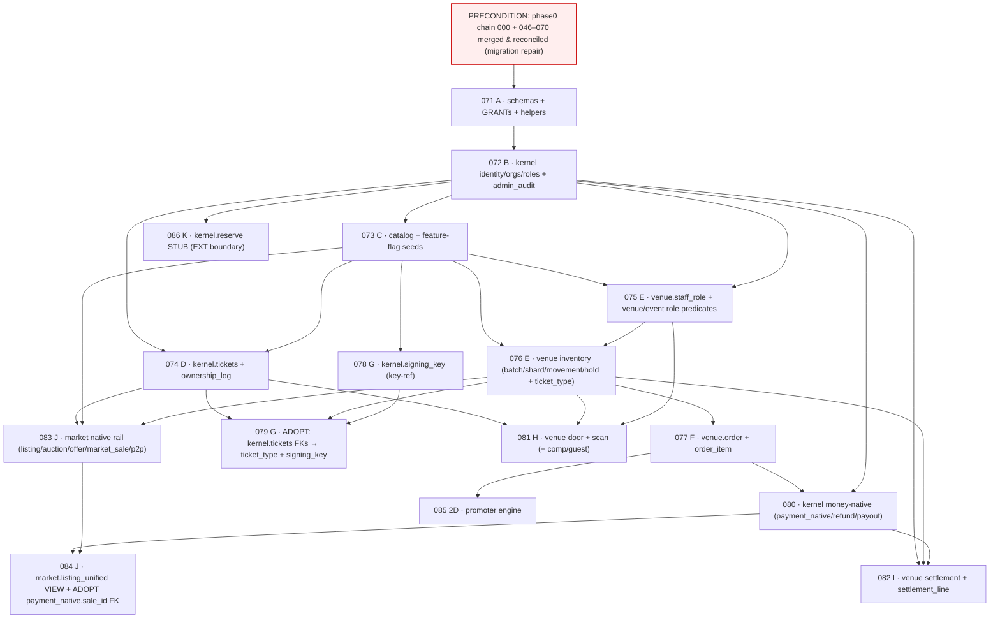

# Phase 2 — Supabase / Postgres Migration Plan

**Status:** BUILD-READY MIGRATION SPECIFICATION. **Design-only — NO SQL, NO migration files, no code.**
This is the ordered plan an implementing engineer follows to author the Phase-2 migration chain from
`PHASE_2_PHYSICAL_POSTGRES_SCHEMA_SPEC.md`. Every object, name, and decision is fixed here so the author
makes **no architectural decision** while writing DDL; where a real choice remained it is called out.

**Binding inputs (authority order):**
1. `scratchpad/SPEC_FOUNDATION.md` — BINDING (§3 numbering baseline, §1 schemas, §6 table inventory,
   §4 Gate-P decisions, §5 SSCAS/lock order, §8 Phase-0 security invariants, §2 integrate-never-rewrite).
2. `PHASE_2_PHYSICAL_POSTGRES_SCHEMA_SPEC.md` — the authoritative table/column set these migrations create.
3. `snatchit-phase0/SNATCH_IT_ENGINEERING_STANDARDS.md` §5/§6/§7/§8 + `SNATCH_IT_PHASE_0_COMPLETION_REPORT.md`
   §3 (Gate-2), §5 (staging), §12 (governance) — CI fresh-bootstrap gate, reproducibility lesson,
   Supabase auto-deploy governance, staging discipline.
4. `PHASE_2_IMPLEMENTATION_ROADMAP.md` — phase order; "marketplace never stops shipping / money core never
   reopened"; the 15.A hard-stop gate.

---

## 0. Preconditions, global rules, and the two decisions this plan makes

### 0.1 PRECONDITION — the phase0 chain must be merged first (NOT a Phase-2 migration)
Phase-2 migrations are authored **assuming the phase0 chain is already merged to the integration branch and
present as the applied baseline**. Specifically:

- The authoritative applied chain is `000_baseline_schema.sql` + `046_*` … `070_reconcile_rls_policies_and_triggers.sql`
  (plus the four timestamped website-form files), living on `phase0/lockdown`.
- **This working tree (`mobile/profile-rpc-compat`) physically contains only migrations up to `045`** — it is
  missing `000_baseline` and `046–070`. **You cannot author or replay Phase-2 migrations against this tree as-is.**
  Merge/rebase the phase0 chain into the integration branch first, verify the fresh-bootstrap replays `000→070`
  cleanly (the Gate-2 test), and only then add `071_`.
- Merging the phase0 baseline is a **prerequisite, not a Phase-2 migration** — it is not numbered in this plan.
- **History reconciliation is also a precondition:** production `schema_migrations` records **timestamp**
  versions for `040–068` while repo files use `NNN_`. Run `supabase migration repair --status applied` to
  reconcile repo↔production **before** any gated `db push`, and keep **Supabase "Deploy to production" OFF**
  (Standards §6, Completion Report §12). Phase-2 migrations apply only via the approved gated path
  (manual migration-by-migration, or a `workflow_dispatch` job behind a GitHub Environment reviewer) — never
  via auto-deploy.

### 0.2 Numbering — continue the zero-padded version-prefix scheme (NOT timestamps)
- True applied max across the phase0 chain = **070**. **Phase-2 migrations begin at `071_` and continue the
  zero-padded `NNN_` version-prefix scheme** (consistent with 066–070), NOT Supabase `YYYYMMDDHHMMSS`
  timestamp prefixes.
- **The version-prefix-vs-timestamp trap (surface explicitly):**
  1. Supabase CLI / `migrations-guard` order migrations **lexicographically by the version string**.
     `"071"` … `"099"` … `"100"` all sort **before** the existing timestamped files (`"20260714190445"` …)
     because `'0'` < `'1'` < `'2'`. That is harmless here — the four timestamped files are unrelated
     `public` website-form tables with **zero dependency** on any Phase-2 object — but the author must not
     assume the timestamped files run before `071+`. They run after. No Phase-2 object may depend on them.
  2. Do **not** switch Phase-2 to timestamp prefixes "to be safe." Mixing schemes is exactly what made
     Supabase auto-deploy unsafe (Standards §5/§6). Stay on `NNN_`, three-digit, zero-padded, strictly
     monotonic after `070` (the `migrations-guard` job enforces monotonic + append-only ordering).
  3. Never edit/rename/renumber an applied `071+` migration — fix forward with a new number (Standards §5).

### 0.3 DECISION 1 — enum wire-form: **text + CHECK constraint** (native Postgres `ENUM` rejected)
The schema spec (§12) left the enum wire-form to this plan. **Decision: every enum-like column is
`text NOT NULL` with a `CHECK (col IN (...))` constraint** — applied **consistently** to all status/kind/
role/cause/mode/state/direction/scope columns across `kernel`/`catalog`/`venue`/`market`. **Native
`CREATE TYPE ... AS ENUM` is NOT used anywhere in Phase 2.** Rationale:

| Factor | text + CHECK (**chosen**) | native `ENUM` (rejected) |
|---|---|---|
| **Consistency with frozen core** | The entire `public.*` money core uses `text + CHECK (x in (...))` — **zero** native enums; `040` even documents *deliberately* not locking an enum "to avoid a migration per new type." Phase 2 matches the house style. | Would introduce a second, divergent convention beside the frozen core. |
| **Evolution (C18 "new causes by amendment"; A10 modes turned on incrementally; role sets)** | Add/loosen a value = `DROP CONSTRAINT` + `ADD CONSTRAINT` in one idempotent migration. | `ALTER TYPE ... ADD VALUE` cannot be reordered/removed; removing a value requires a full type recreation + column rewrite. |
| **Rollback (Standards §5 requires a rollback per migration)** | Constraint drop/re-add is trivially reversible. | `ADD VALUE` is **effectively irreversible** — you cannot drop an enum value; rollback means recreating the type and rewriting every dependent column/function. Fatal for the per-migration rollback rule. |
| **Idempotent fresh-bootstrap replay (Gate-2)** | `ADD CONSTRAINT ... IF NOT EXISTS`-style guards replay cleanly; CHECK sits inline in `CREATE TABLE`. | `CREATE TYPE` is not idempotent without a `pg_type` guard; enum + function interdependencies complicate the replay. |
| **Disjoint scope-qualified roles (C36)** | Achieved structurally by **separate CHECK sets per column** (`org_member.role IN (org_*)`, `staff_role.role IN (venue_*)`, `platform_role.role IN (platform_*)`) — disjoint by construction, no shared type to confuse. | A shared enum type would *undermine* disjointness; three separate enum types = three `CREATE TYPE`s with the rollback problem above. |
| **Type safety** | Slightly weaker (a bad literal is caught by CHECK at write, not by the type system). Acceptable — all writes go through `SECURITY DEFINER` RPCs that validate inputs anyway (C35). | Marginally stronger, not worth the evolution/rollback cost. |

**Consistency mandate:** the migration author MUST NOT introduce a native enum "just for this one column."
Every enum-like value set in the schema spec becomes a named `CHECK`. Where the same value set repeats
(e.g. the D3 cause registry on `ticket_ownership_log`, `inventory_movement`, `payout`, `settlement_line`),
each column carries its **own** inline `CHECK (cause IN (<D3 set>))` — the D3 set is copied verbatim, not
shared via a type. (A future single-source-of-truth lookup table is a Gate-L normalization, not now — same
disposition as CONFLICTS #7 neighborhood duplication.)

### 0.4 DECISION 2 — every package is expand → verify → adopt → contract; **no big-bang**
- **Expand:** create new schemas/tables/columns/constraints **additively**, beside the live system. Never
  alter a `public.*` money/custody table's semantics (SPEC_FOUNDATION §2). The only `public.*` interaction
  is **outbound FK references to `public.payments`/`auth.users`** and a **read-only VIEW** over
  `public.listings` — neither mutates nor locks a hot production row.
- **Verify:** each package is validated on staging (fresh-bootstrap replay + adversarial RLS) before any
  production apply; production apply is per-package with pre/post catalog verification (Standards §5/§6).
- **Adopt:** forward-reference FKs that cannot exist at a table's birth (e.g. `kernel.tickets` →
  `venue.ticket_type`/`kernel.signing_key`, `kernel.payment_native` → `market.market_sale`) are added by a
  **dedicated late-binding constraint package** once the target exists — using `ADD CONSTRAINT ... NOT VALID`
  then `VALIDATE CONSTRAINT` as the standing discipline (trivial on empty tables; the pattern is in place for
  when data exists). This is what lets each phase ship independently without reordering the mandated phases.
- **Contract:** there is **nothing to contract in the MVP** (no dual-write, no data migration off an old
  shape) because Phase 2 is purely additive. The "contract" step is reserved and documented for future
  seat-enablement (populate `venue.inventory_unit`, drop the "unit_row_id NULL" assumption) and re-entry
  (relax the `venue.scan` partial unique) — both named future changes, neither in MVP.

### 0.5 Global properties asserted by EVERY package (stated once; referenced per-package)
- **Additive-only: YES** for all MVP packages (071–086). No `public.*` semantic change; no destructive edit.
- **Marketplace behavior change: NO** for all packages — the external-rail marketplace and frozen money core
  keep running untouched throughout (roadmap operating rule #1). The market bridge (084) is a read-only
  UNION view; it adds native rows to *discovery* only when the native-resale flag is ON (default OFF).
- **CI fresh-bootstrap (Gate-2) reproducibility:** every migration is **defensively idempotent**
  (`create schema/table/index if not exists`, `create or replace function`, `add column if not exists`,
  guarded `add constraint`, `drop ... if exists`) so the chain replays cleanly on a fresh DB. **No
  out-of-band objects** — every object a package needs is created *by a migration in the chain* (the exact
  Gate-2 lesson: base tables, `sync_listing_current_bid`, and 14 web RLS policies had to be vendored as
  `000/066a/070` because they existed only in production). The CI `db` job replays `000→latest` on every PR;
  a Phase-2 package that references an object it did not create (or that an earlier package did not create)
  fails the gate. **Per-package note below: "Gate-2: replays clean; creates all its own objects."**
- **Security invariants preserved (SPEC_FOUNDATION §8, Standards §7/§8/§9):** deny-by-default RLS (RLS ON at
  table birth); no `USING(true)` on sensitive tables; money/custody tables = deny-all (RLS on, zero policies)
  **plus** `REVOKE ALL FROM anon, authenticated` (survives an accidental RLS disable); column-scoped grants;
  live-table recheck for money-consequential writes (never a stale JWT); `SECURITY DEFINER` functions owned
  by `postgres`, `search_path` pinned (066), explicit `REVOKE FROM anon, authenticated, public` then `GRANT`
  to intended roles only (067), `FOR UPDATE` on state transitions, `auth.uid()`-derived principal (C35),
  idempotent; `stripe-webhook` keeps `verify_jwt=false`; constant-time secret compare (door PINs).
- **Rollback:** each package ships a paired `supabase/rollbacks/0NN_*.sql` that DROPs the package's objects
  in reverse dependency order. **Rollback is clean while the object is empty / flag-OFF** (the MVP state).
  Once a package's tables carry production custody/money rows (post flag-flip), rollback becomes
  **forward-fix only** (Standards §5) — the rollback script then serves only the pre-go-live window and is
  annotated as such in its header.
- **Lock risk (general):** `CREATE TABLE` / `CREATE INDEX` on a **brand-new** table takes `AccessExclusive`
  **only on that new table, which nothing else references yet** → zero impact on live traffic. **No package
  performs a table rewrite, a lock on a hot `public.*` table, or a non-`CONCURRENTLY` index build on a
  populated table.** Indexes are built at `CREATE TABLE` time on empty tables (instant). Late-binding
  `ADD CONSTRAINT` uses `NOT VALID` + `VALIDATE` (no long lock). GRANT/REVOKE touch catalog only.
- **Backfill (general):** **NONE** for the MVP — every table is born empty and filled by product traffic.
  The only near-backfill is `kernel.identity_ext`, which is **lazily created per-identity on first write**
  (no bulk backfill of existing `auth.users`). Stated per-package where relevant.
- **Expected runtime (general):** **seconds** per package (DDL on empty tables). No package is a long
  migration. Stated per-package only where it differs.
- **Header discipline (Standards §5):** every migration file carries a header stating purpose, forward
  behavior, backwards-compat, expected locks/runtime, rollback location, and a verification query.

---

## 1. Phase → package map (071–086)

| Phase (mandated) | Package(s) | Creates |
|---|---|---|
| **A** schema skeleton | `071` | 4 schemas + GRANT boundary + shared helper functions/triggers |
| **B** organizations + permissions | `072` | `kernel.identity_ext`, `organization`, `org_member`, `platform_role`, `admin_audit` + org/platform role predicates |
| **C** catalog | `073` | `catalog.venue`, `event`, `event_session`, `platform_config` (+ feature-flag seeds), `resale_policy` |
| **D** ticket kernel | `074` | `kernel.tickets` (atom), `kernel.ticket_ownership_log` (custody ledger, C26) |
| **E** inventory | `075`, `076` | `075`: `venue.staff_role` + venue/event role predicates · `076`: `ticket_type`, `inventory_batch`, `inventory_batch_shard`, `inventory_movement`, `inventory_hold` |
| **F** orders | `077` | `venue.order`, `venue.order_item` |
| **G** credential infrastructure | `078`, `079` | `078`: `kernel.signing_key` (key-ref, NO secret) · `079`: **adopt** — `kernel.tickets` late-binding FKs → `ticket_type` + `signing_key` |
| *(F/I bridge)* kernel money-native | `080` | `kernel.payment_native`, `kernel.refund`, `kernel.payout` |
| **H** scan infrastructure | `081` | `venue.door_pin`, `scan_device`, `scan` (C41 hedge), `comp_allocation`, `guest_list`, `guest_entry` |
| **I** settlement | `082` | `venue.settlement`, `venue.settlement_line` |
| **J** native marketplace bridge | `083`, `084` | `083`: `market.listing_native`, `auction`, `offer`, `market_sale` (C26 terminal SM), `p2p_transfer` · `084`: `market.listing_unified` VIEW + **adopt** `payment_native.sale_id` FK |
| *(2D)* promoter engine | `085` | `venue.promoter`, `promoter_link`, `attribution` (roadmap Phase 2D; modeled now, activated in the promoter phase) |
| **K** money-ledger extensions | `086` (stub only) + **documented-only** | `086`: `kernel.reserve` **stub** (empty shape, no writers). Full Gate-M double-entry ledger (`ledger_entry`/`clawback`/`receivable`), `market.bid`, and Gate-L `social`/`analytics`/`notify`/`adapter`/multi-currency are **documented extension points, NOT scheduled** (see §5). |

**Flag-gated OFF in production (§4):** `073` seeds `feature.native_issuance_enabled=false` and
`feature.native_resale_enabled=false` (and `feature.native_scanning_enabled=false`). The **issuance path**
(074/077/080 issue) stays inert until the **15.A gate** clears (end of Phase 2A); the **native resale path**
(083/084) and **native scanning** (081) stay inert until their gates clear (2B door gate; Gate-M reserve +
2C for resale). Tables exist and replay in CI; **no production traffic flows through them until the flag
flips**, and the flip is a separate, audited `catalog.set_platform_config` operation — not a migration.

---

## 2. Dependency DAG

Edges into `public.*` (FK to `public.payments`, `auth.users`; VIEW over `public.listings`) are implicit and
one-directional — the frozen core references nothing upward (SPEC_FOUNDATION §2, schema spec §0.1).

---

## 3. Rollout sequence table

Apply strictly in this order. "Gate" = a product/security gate that must clear before the flag is flipped ON
(the table can be *applied* regardless — it is inert while OFF).

| Seq | Pkg | Phase | Depends on | Additive | Mkt change | Lock risk | Backfill | Runtime | Flag on-ramp |
|----|-----|-------|-----------|:---:|:---:|---|---|---|---|
| 1 | 071 | A | precond | Y | N | none (schema/grant) | none | s | — |
| 2 | 072 | B | 071 | Y | N | new-table only | lazy `identity_ext` | s | — |
| 3 | 073 | C | 072 | Y | N | new-table only | seeds config+flags | s | seeds all flags **OFF** |
| 4 | 074 | D | 072,073 | Y | N | new-table only | none | s | issuance gated by 15.A |
| 5 | 075 | E | 072,073 | Y | N | new-table only | none | s | — |
| 6 | 076 | E | 073,075 | Y | N | new-table only | none | s | — |
| 7 | 077 | F | 076 | Y | N | new-table only | none | s | issuance gated by 15.A |
| 8 | 078 | G | 073 | Y | N | new-table only | none | s | — |
| 9 | 079 | G(adopt) | 074,076,078 | Y | N | ADD CONSTRAINT NOT VALID+VALIDATE (empty) | none | s | — |
| 10 | 080 | F/I | 072,077 | Y | N | new-table only | none | s | — |
| 11 | 081 | H | 074,075,076 | Y | N | new-table only | none | s | scanning gated (2B door gate) |
| 12 | 082 | I | 072,076,080 | Y | N | new-table only | none | s | — |
| 13 | 083 | J | 073,074,076 | Y | N | new-table only | none | s | **native resale gated** (Gate-M+2C) |
| 14 | 084 | J | 080,083 | Y | N | VIEW create + ADD CONSTRAINT (empty) | none | s | resale gated; VIEW inert until flag |
| 15 | 085 | 2D | 077 | Y | N | new-table only | none | s | promoter phase |
| 16 | 086 | K | 072 | Y | N | new-table only | none | s | **stub — no writers wired** |

**Per-package "does marketplace behavior change?" = NO for all 16.** **Additive-only = YES for all 16.**

---

## 4. Feature-flag gating — exactly where production stays OFF

Flags are **VALUES in `catalog.platform_config`** (A8: config is values, not code), seeded by `073`, read by
the engine RPCs (deliverable #4). The **tables ship inert**; the **RPCs refuse** while the flag is OFF.

| Flag key (seeded false by 073) | Guards | Stays OFF until | Flip mechanism |
|---|---|---|---|
| `feature.native_issuance_enabled` | `kernel.issue_ticket_atoms` (074/077/080 issue path); `venue.reserve_primary_inventory` (canonical name, A4 — alias `reserve_inventory`) real draws; `venue.create_inventory_hold` staff holds | **15.A gate** cleared (C1,C2,C3,C4,C5,C6-model,C9,C10) — end of Phase 2A | audited `catalog.set_platform_config` (dual-control seam, C11) — a runtime op, **never a migration** |
| `feature.native_scanning_enabled` | `venue.record_scan` (081) | Phase 2B door gate (C6 offline model adversarially tested) | same |
| `feature.native_resale_enabled` | `market.create_listing`/`transfer_ticket_ownership` via market (083/084); `market.listing_unified` native rows surfaced in discovery | **Gate-M** (reserve/double-entry ledger, §5) **+** Phase 2C conditions (O1/O3/O5) | same |

**Why flags, not "don't apply the migration":** applying the table additively (flag OFF) keeps the chain
monotonic and Gate-2-reproducible and lets staging exercise the full path with the flag ON, while production
stays safe. Deferring the *migration* instead would fork the chain. The migration is always applied; the
**behavior** is gated.

---

## 5. Migration packages (071–086) — full specification

Each block gives: **name · purpose · objects · dependencies · backwards-compat · lock risk · backfill ·
runtime · rollout · rollback/recovery · staging verify · production verify · additive? · marketplace change?**
Global properties from §0.5 are asserted once there and referenced as "per §0.5" rather than repeated.

---

### PHASE A — schema skeleton

#### `071_create_phase2_schemas_and_grants`
- **Purpose:** stand up the four MVP schemas and the modular-monolith GRANT boundary + shared helper
  objects, additively beside `public` (roadmap Phase 2.0). No product tables yet.
- **Objects created:**
  - `CREATE SCHEMA IF NOT EXISTS kernel · catalog · venue · market`.
  - **GRANT boundary:** `REVOKE ALL ON SCHEMA kernel, venue, market FROM PUBLIC, anon, authenticated`;
    `GRANT USAGE ON SCHEMA catalog TO anon, authenticated` (catalog is public-read reference data);
    `GRANT USAGE ON SCHEMA kernel, venue, market TO authenticated` **for function EXECUTE only** (table
    access is deny-all + per-RPC). `service_role` = machine identity (056b/063), never a human grant target.
  - **Shared helpers (SECURITY DEFINER, owner `postgres`, `search_path` pinned per 066):**
    `kernel.set_updated_at()` (reuse the existing `set_updated_at` pattern for `updated_at` maintenance) and
    `kernel.raise_append_only()` (the guard trigger function that raises on UPDATE/DELETE for AO tables).
    Created once here; every AO/MUT table attaches them.
  - Default-privileges hygiene: `ALTER DEFAULT PRIVILEGES` in the three private schemas to `REVOKE` table
    rights from `anon/authenticated` so future tables are deny-by-default even before their RLS lands.
- **Dependencies:** precondition (phase0 baseline present).
- **Backwards compatibility:** total — nothing references these yet.
- **Production lock risk:** none beyond catalog-level `CREATE SCHEMA`/`GRANT` (metadata only).
- **Data backfill:** none.
- **Expected runtime:** < 1s.
- **Rollout:** first Phase-2 apply on staging; then gated production apply. No flag.
- **Rollback (`rollbacks/071_*`):** `DROP SCHEMA ... CASCADE` on the three private schemas + drop helpers.
  Clean (empty). Safe pre-go-live only.
- **Staging verification:** fresh-bootstrap replay `000→071` green; `\dn` shows 4 schemas; `has_schema_privilege('anon','kernel','USAGE')` = false; `catalog` USAGE = true.
- **Production verification:** post-apply catalog check: schemas exist; anon/authenticated have no table-level
  default privileges in kernel/venue/market; helper functions owned by `postgres` with pinned `search_path`.
- **Additive-only:** YES. **Marketplace change:** NO. **Gate-2:** replays clean; creates all its own objects (per §0.5).

---

### PHASE B — organizations + permissions

#### `072_kernel_identity_orgs_and_roles`
- **Purpose:** the tenant + identity-extension + scope-qualified role substrate (C36) and the privileged
  audit backbone, so every later table can express org/platform authz and write audit rows in-txn.
- **Objects created** (schema spec §1.1–1.4, §1.12):
  - `kernel.identity_ext` (PK `identity_id`→auth.users, `residency_region` default `'us-east'`, `kyc_ref`).
  - `kernel.organization` (`org_id` PK; `status` CHECK in `applied/approved/active/suspended/closed`;
    `stripe_connect_account_ref` unique-when-not-null — **reuses** existing Connect ids, not a new integration).
  - `kernel.org_member` (PK `(org_id,identity_id)`; `role` CHECK in `org_owner/org_admin/org_finance/org_member`).
  - `kernel.platform_role` (PK `(identity_id,role)`; `role` CHECK in `platform_admin/platform_support/platform_risk`;
    **extends** `public.admin_users`, which is the bootstrap authority).
  - `kernel.admin_audit` (AO; `raise_append_only` trigger + `REVOKE UPDATE,DELETE`).
  - **`kernel.org_invite` (ADDENDUM A1 — schema §1.3b):** `invite_id` PK; `org_id` FK; `invitee_ref` +
    nullable `invitee_identity_id`; `role` CHECK in the org enum; `status` CHECK in
    `pending/accepted/declined/expired/revoked`; `invited_by` FK; `expires_at`; partial
    `UNIQUE(org_id, invitee_ref) WHERE status='pending'`; `UNIQUE(org_id, command_idempotency_key)`.
    RLS org-scoped (org_owner/org_admin) + addressed-invitee reads own; writes RPC-only
    (`invite_org_member`/`accept_org_invite`/revoke). Additive, no backfill.
  - **Role predicate helpers (SECURITY DEFINER, 066/067 discipline):** `kernel.has_org_role(org_id, role[])`,
    `kernel.is_platform(role[])`. (`has_venue_role`/`has_event_role` deferred to `075` — they need
    `venue.staff_role` + catalog.) All read the **live** membership table (never a JWT claim, C9), and
    **never permit a self-grant** (H-2 discipline).
  - RLS: `identity_ext` owner-scoped read; `organization`/`org_member` org-scoped; `platform_role`/`admin_audit`
    audit-only (`is_platform`). Money/authz writes RPC-only. Disjoint CHECK sets make cross-scope role
    confusion structurally impossible (C36).
- **Dependencies:** `071` (schemas/helpers). References `auth.users`, `public.admin_users` (read).
- **Backwards compatibility:** additive; `public.admin_users` unchanged (extended, not altered).
- **Lock risk:** new-table only.
- **Backfill:** none bulk. `identity_ext` rows are created **lazily on first write** per identity — no backfill
  of existing users.
- **Runtime:** seconds.
- **Rollout:** staging → gated prod. No flag (authz substrate is inert until orgs are created).
- **Rollback (`072_*`):** drop tables (reverse order: admin_audit, org_invite, platform_role, org_member,
  organization, identity_ext) + helpers. Clean while empty.
- **Staging verification:** replay green; adversarial RLS — anon/non-member cannot read an org row; a member
  can read own org; `has_org_role`/`is_platform` return correct booleans; a self-grant attempt via the (future)
  RPC is rejected; disjoint-role CHECK rejects an `org_*` label in `staff_role` and vice-versa.
- **Production verification:** tables + CHECKs + RLS enabled (0 policies on audit-only tables) + `REVOKE ALL`
  confirmed; helpers owned by `postgres`, `search_path` pinned.
- **Additive-only:** YES. **Marketplace change:** NO. **Gate-2:** per §0.5.

---

### PHASE C — catalog

#### `073_catalog_reference_data_and_flags`
- **Purpose:** kernel-owned, world-readable reference data (venues/events/sessions) + versioned config
  (fees/windows/policies) + the **feature-flag seeds** that gate native issuance/scanning/resale OFF.
- **Objects created** (schema spec §2.1–2.5):
  - `catalog.venue` (`venue_id` PK; `org_id` FK→kernel.organization; `approval_status` CHECK in
    `draft/pending/approved/archived`; `neighborhood` reuses the frozen `public.listings` check-set —
    duplicated by decision, CONFLICTS #7).
  - `catalog.event` (`event_id` PK; `venue_id`, `org_id` FKs; `status` CHECK in
    `draft/announced/on_sale/live/completed/cancelled`).
  - `catalog.event_session` (`session_id` PK; `event_id` FK; `status` CHECK in
    `scheduled/live/completed/cancelled`; `home_region` default `'us-east'`; **`door_open_at` timestamptz
    nullable — ADDENDUM A2/A3, schema §2.3: the canonical door-freeze signal**, set when the session's offline
    door manifest opens; distinct from informational `doors_at`) — **the toward-reference target
    for `kernel.tickets.event_session_id`** (A7/C7).
  - **`kernel.is_transfer_frozen(p_ticket_atom_id)` helper (ADDENDUM A3):** `STABLE` SECURITY DEFINER,
    `search_path` pinned — true iff the atom's session has `door_open_at IS NOT NULL AND now() >= door_open_at`
    (per-open-manifest-ticket scope, C43). The ONLY freeze read for RPC rechecks, the RN eligibility boolean,
    and the edge layer (which never decides freeze independently). *(Ships here in `073` with the column it
    reads; the atom-side recheck wiring lands with the kernel engines in `074`+ — the helper tolerates a
    not-yet-existing atom id by returning false until `074` exists, or equivalently `073` ships the column and
    `074` ships the helper; implementer picks one, both additive.)* No stored `transfer_frozen` column exists.
  - `catalog.platform_config` (composite PK `(key, version)` — see UNDER-SPECIFIED note; AO-per-version;
    public-read).
  - `catalog.resale_policy` (`policy_id` PK; `mode` CHECK in
    `off/transfers_only/fixed_cap/face_value_queue/buy_now/auction/offer`, **default `off`** per C11; versioned).
  - **Seed rows:** `platform_config` seeds for `feature.native_issuance_enabled=false`,
    `feature.native_scanning_enabled=false`, `feature.native_resale_enabled=false` (all **OFF**), plus any
    fee/window baseline VALUES. Seeds are idempotent (`insert ... on conflict do nothing`) so replay is safe.
  - RLS: all `catalog` tables public-read (approved/announced rows) with draft/pending org-scoped + platform;
    writes RPC-only (`catalog.*` definer functions).
- **Dependencies:** `072` (org FK).
- **Backwards compatibility:** additive; frozen `public.listings` neighborhood set is read/copied, not altered.
- **Lock risk:** new-table only.
- **Backfill:** seed flag + config rows only (idempotent).
- **Runtime:** seconds.
- **Rollout:** staging → gated prod. **Seeds all native flags OFF** (this is the production-OFF anchor, §4).
- **Rollback (`073_*`):** drop resale_policy, platform_config, event_session, event, venue. Clean while empty.
- **Staging verification:** replay green; anon can `SELECT` an approved venue/event but NOT a draft;
  `platform_config` returns the three flags = false; `resale_policy` default mode = `off`; write as anon fails.
- **Production verification:** tables/CHECKs/RLS; the three feature flags present and **false**; public-read
  policy present on approved rows only.
- **Additive-only:** YES. **Marketplace change:** NO. **Gate-2:** per §0.5.

---

### PHASE D — ticket kernel

#### `074_kernel_ticket_atom_and_ownership_log`
- **Purpose:** the custody core — the ticket atom (SoT) and its append-only ownership ledger with the **fixed
  C26 idempotency**. The single hardest-to-change objects; built correct from the start (roadmap H1).
- **Objects created** (schema spec §1.5, §1.6):
  - `kernel.tickets` (`ticket_atom_id` PK; `event_session_id` FK→catalog.event_session; `org_id` FK→
    kernel.organization; `serial_no`; `current_owner_id` FK→auth.users [PROJ head]; `state` CHECK in
    `issued/active/scanned/voided/expired` — **no `refunded`**, D2; `resale_state` CHECK in `none/listed/locked`;
    `credential_version` default 0; `home_region` default `'us-east'`; **nullable** `seat_ref`, `unit_row_id`,
    `external_seat_ref` (C42/C17)). **Columns `ticket_type_id` and `signing_key_id` are present now, but their
    FK constraints are NOT added here** (targets `venue.ticket_type`/`kernel.signing_key` don't exist yet) —
    added by `079` (adopt). `unit_row_id` FK is EXT (target never built in MVP) — column stays a bare uuid.
    Unique `(event_session_id, serial_no)`; `external_seat_ref` unique-per-session-when-not-null.
  - `kernel.ticket_ownership_log` (PK `(ticket_atom_id, sequence)`; all columns per schema spec §1.6 incl.
    `cause` CHECK in the **D3 closed set**, `cause_ref`, `actor_identity`, `command_idempotency_key`,
    `credential_version_after`, `state_transition` jsonb). **The C26 constraints:**
    `UNIQUE(cause, cause_ref, ticket_atom_id)` (the fixed key — replaces the broken `UNIQUE(cause,cause_ref)`),
    `UNIQUE(ticket_atom_id, command_idempotency_key)` (C16), plus the PK. AO: `raise_append_only` trigger +
    `REVOKE UPDATE,DELETE`. CHECK: `sequence>=1`; `from_identity IS NULL iff (cause='issue' AND sequence=1)`.
  - Indexes per spec §1.5/§1.6 (owner, session, type, cause_ref, to_identity, resale_state partial).
  - RLS: money-custody-RPC-only on the log; `kernel.tickets` owner-scoped + venue-scoped read; writes RPC-only.
  - **No issuance/transfer engine RPC bodies here** — those are deliverable #4 (RPC contracts). This package
    is the DDL substrate they write to. (If the team prefers to co-locate the engine functions with this
    migration, they are added as `create or replace function` in the same file; either way the flag in §4 keeps
    them inert.)
- **Dependencies:** `072` (org), `073` (event_session). **Forward FKs to `074`'s own siblings deferred to `079`.**
- **Backwards compatibility:** additive.
- **Lock risk:** new-table only (large index set, but all on an empty table → instant).
- **Backfill:** none.
- **Runtime:** seconds.
- **Rollout:** staging → gated prod. Issuance path stays behind `feature.native_issuance_enabled=false` (§4).
- **Rollback (`074_*`):** drop ownership_log then tickets. Clean while empty. **Post-go-live: forward-fix only**
  (custody ledger is permanent — never dropped once it holds real atoms).
- **Staging verification:** replay green; **C26 proof rig** (the schema spec §1.6.1 a/b/c/d exercised against
  the real constraints): (a) second insert of `(market_sale, sale_id, atom)` rejected; (b) N `(issue, order_id, atom_k)`
  all succeed; (c) N `(refund_void, refund_id, atom_k)` all succeed; (d) replayed `command_idempotency_key`
  rejected. AO guard: UPDATE/DELETE on the log raises. Adversarial RLS: non-owner cannot read an atom or its chain.
- **Production verification:** tables/CHECKs/uniques (esp. the three-column C26 unique) present; RLS enabled;
  `REVOKE` on the log confirmed; the `feature.native_issuance_enabled` flag still false.
- **Additive-only:** YES. **Marketplace change:** NO. **Gate-2:** per §0.5.

---

### PHASE E — inventory

#### `075_venue_staff_roles_and_predicates`
- **Purpose:** venue-scope roles (C36) + the remaining role predicates, so venue inventory/scan/settlement RLS
  can express `has_venue_role`/`has_event_role`.
- **Objects created** (schema spec §3.9):
  - `venue.staff_role` (PK `(venue_id, identity_id, role)`; `role` CHECK in
    `venue_manager/venue_finance/venue_door/venue_promoter` — **disjoint** from org/platform labels, C36;
    `venue_id` FK→catalog.venue, `identity_id` FK→auth.users).
  - **Predicates (SECURITY DEFINER, 066/067):** `kernel.has_venue_role(venue_id, role[])` and
    `kernel.has_event_role(event_id, role[])` (event→venue resolution via catalog). Live-table recheck (C9);
    never self-grant (H-2).
  - RLS: venue-scoped read; grant/revoke RPC-only.
- **Dependencies:** `072` (predicates live in `kernel`), `073` (catalog.venue/event).
- **Backwards compat:** additive. **Lock:** new-table only. **Backfill:** none. **Runtime:** seconds.
- **Rollout:** staging → gated prod. No flag.
- **Rollback (`075_*`):** drop predicates + `venue.staff_role`. Clean while empty.
- **Staging verification:** replay green; `has_venue_role`/`has_event_role` correct; disjoint CHECK rejects an
  `org_*`/`platform_*` label; non-staff cannot read the row.
- **Production verification:** table/CHECK/RLS; predicates owned by `postgres`, `search_path` pinned.
- **Additive-only:** YES. **Marketplace change:** NO. **Gate-2:** per §0.5.

#### `076_venue_inventory`
- **Purpose:** the priced product + the **authoritative capacity counter** (C27) with its sharding and audit
  ledger + holds — the oversell-safe substrate (C4/C5).
- **Objects created** (schema spec §3.1–3.5):
  - `venue.ticket_type` (`ticket_type_id` PK; `event_id` FK; `kind` CHECK in `admission/table`; `price_minor`
    server-authoritative snapshot; `currency` default `'USD'`; `visibility` CHECK in `hidden/public/door_only`).
  - `venue.inventory_batch` (`batch_id` PK; `ticket_type_id`,`event_session_id` FKs; `release_kind` CHECK in
    `public_sale/promoter_hold/comp/door/presale`; `capacity/held/sold`; `is_sharded`; **the oversell CHECK
    `held>=0 AND sold>=0 AND held+sold<=capacity`** — C4/C27, NOT a `sum=capacity` trigger). `remaining` is
    **computed** `capacity-held-sold` (generated-column or view expression), never a stored writable value.
  - `venue.inventory_batch_shard` (PK `(batch_id, shard_no)`; per-shard same oversell CHECK; `batch_id` FK
    **ON DELETE CASCADE** — shards are a decomposition, not independent facts).
  - `venue.inventory_movement` (AO audit ledger; `cause` CHECK in D3 set;
    `UNIQUE(cause, cause_ref, batch_id, movement_kind)` mirrors the C26 idempotency shape;
    `raise_append_only` + `REVOKE UPDATE,DELETE`).
  - `venue.inventory_hold` (`hold_id` PK; `expires_at` **server-max TTL**; `command_idempotency_key`;
    `UNIQUE(identity_id, command_idempotency_key)` C16; `status` CHECK in `active/converted/released/expired`).
  - **`venue.inventory_unit` is NOT created** (EXT / C42 — documented in §5).
  - Indexes per spec §3.2/§3.5 (availability `(event_session_id,ticket_type_id)`; hold-expiry partial;
    per-user `(identity_id,status)`). RLS: `remaining` public-read projection; counter writes
    money-custody-RPC-only; holds owner+venue scoped.
- **Dependencies:** `073` (event_session), `075` (has_venue_role for RLS). `ticket_type` unblocks `074`'s
  deferred FK (adopted in `079`).
- **Backwards compat:** additive. **Lock:** new-table only. **Backfill:** none. **Runtime:** seconds.
- **Rollout:** staging → gated prod. Real inventory draws gated by `feature.native_issuance_enabled` (§4).
- **Rollback (`076_*`):** drop hold, movement, shard, batch, ticket_type (reverse order; shard cascades with
  batch). Clean while empty.
- **Staging verification:** replay green; **oversell proof rig** (schema spec §3.3.1): concurrent decrements
  cannot drive `remaining<0` (CHECK + `FOR UPDATE` in the reserve RPC harness); sharded draw + last-unit
  single-shard fallback sells the final unit exactly once; movement ledger reconciles to the counter (the
  nightly-assert query returns `Σshards == batch`). AO guard on movement.
- **Production verification:** tables/CHECKs (esp. the oversell CHECK on batch and shard)/uniques/RLS;
  `remaining` computes correctly; `inventory_unit` absent (EXT).
- **Additive-only:** YES. **Marketplace change:** NO. **Gate-2:** per §0.5.

---

### PHASE F — orders

#### `077_venue_orders`
- **Purpose:** the primary-purchase container that, when paid, issues atoms atomically (SSCAS #1).
- **Objects created** (schema spec §3.7–3.8):
  - `venue.order` (`order_id` PK; `buyer_id`,`event_session_id`,`org_id` FKs; `status` CHECK in
    `pending/paid/partially_refunded/refunded/cancelled` — money-lifecycle on the *order*, distinct from the
    ticket's states, D2; `source` CHECK in `app/web/door/promoter_link`; `total_minor`,`currency`;
    `command_idempotency_key`; `UNIQUE(buyer_id, command_idempotency_key)` C16).
  - `venue.order_item` (`id` PK; `order_id`,`ticket_type_id` FKs; `quantity`,`unit_price_minor` snapshot;
    `UNIQUE(order_id, ticket_type_id)`; **IMM-after-issuance** guard trigger keyed on parent order = `paid`).
  - RLS: owner-scoped (buyer) + org/venue-scoped (issuer) + platform; money writes RPC-only.
- **Dependencies:** `076` (ticket_type), `073`, `072`. References `auth.users`.
- **Backwards compat:** additive. **Lock:** new-table only. **Backfill:** none. **Runtime:** seconds.
- **Rollout:** staging → gated prod. Issuance-on-paid gated by `feature.native_issuance_enabled` (§4).
- **Rollback (`077_*`):** drop order_item then order. Clean while empty.
- **Staging verification:** replay green; C16 replay (same buyer+key) rejected; `order_item` UPDATE after the
  order flips to `paid` raises (IMM guard); non-buyer cannot read the order.
- **Production verification:** tables/CHECKs/uniques/RLS; IMM trigger present.
- **Additive-only:** YES. **Marketplace change:** NO. **Gate-2:** per §0.5.

---

### PHASE G — credential infrastructure

#### `078_kernel_signing_key`
- **Purpose:** the DB-side **reference** to the asymmetric signing key — public key + KMS handle only,
  **NO private key material in any row** (C33/C1).
- **Objects created** (schema spec §1.7):
  - `kernel.signing_key` (`key_id` PK; `scope` CHECK in `per_event/per_venue/global` default `per_event`;
    nullable `event_id`/`venue_id` FKs→catalog; `public_key`; `kms_handle_ref` [opaque handle, **not** key
    material]; `status` CHECK in `active/rotating/revoked`; `not_before`/`not_after` validity window).
    **Partial uniques:** at most one `active` key per scope target (`UNIQUE(event_id) WHERE status='active'
    AND scope='per_event'`, and the per_venue/global analogues) — rotation flips old→`rotating`,
    new→`active` in one txn. CHECK: scope/target coherence; `not_after>not_before`.
  - RLS: `public_key` + validity window **world-readable projection** (safe — doors carry the verify key);
    `kms_handle_ref` + writes money-custody-RPC-only / `is_platform`.
  - **Signed tokens are NOT produced by Postgres** — the `credential-sign` Edge Function calls KMS
    (deliverable #5). This package only stores the reference metadata.
- **Dependencies:** `073` (catalog event/venue). Unblocks `074`'s deferred `signing_key_id` FK (adopted `079`).
- **Backwards compat:** additive. **Lock:** new-table only. **Backfill:** none. **Runtime:** seconds.
- **Rollout:** staging → gated prod. No flag (inert until a key is provisioned + issuance turns on).
- **Rollback (`078_*`):** drop `kernel.signing_key`. Clean while empty. Post-go-live: forward-fix only
  (revoked keys retained so old credentials remain verifiable).
- **Staging verification:** replay green; the active-per-scope partial unique rejects a second active
  per-event key; a rotation txn (old→rotating, new→active) succeeds; anon can read `public_key` but NOT
  `kms_handle_ref` (column-scoped); write as anon fails.
- **Production verification:** table/CHECKs/partial-uniques/RLS; `kms_handle_ref` not client-readable;
  confirm no column holds private-key material.
- **Additive-only:** YES. **Marketplace change:** NO. **Gate-2:** per §0.5.

#### `079_kernel_tickets_late_binding_fks` — **the ADOPT step for Phase D↔E↔G**
- **Purpose:** now that `venue.ticket_type` (076) and `kernel.signing_key` (078) exist, add the FK constraints
  that `kernel.tickets` (074) could not carry at birth — closing the forward-reference without reordering the
  mandated phases (§0.4 adopt).
- **Objects created:**
  - `ALTER TABLE kernel.tickets ADD CONSTRAINT fk_tickets_ticket_type FOREIGN KEY (ticket_type_id)
    REFERENCES venue.ticket_type(ticket_type_id) ON DELETE RESTRICT` — as `NOT VALID`, then
    `VALIDATE CONSTRAINT` (trivial on empty `kernel.tickets`; the pattern is the standing discipline for the
    populated case).
  - Same `NOT VALID`+`VALIDATE` pattern for `fk_tickets_signing_key (signing_key_id) → kernel.signing_key(key_id)`.
  - **`unit_row_id` FK is intentionally NOT added** (target `venue.inventory_unit` is EXT / not built — C42).
    A header note records that enabling seating later adds this FK as another adopt step.
- **Dependencies:** `074`, `076`, `078`.
- **Backwards compat:** additive constraint; no column/data change.
- **Lock risk:** `ADD CONSTRAINT ... NOT VALID` takes a brief `ShareRowExclusive` on `kernel.tickets`
  (empty → instant); `VALIDATE CONSTRAINT` takes only a `ShareUpdateExclusive` (non-blocking to reads/writes).
  No lock on `venue.ticket_type`/`kernel.signing_key` beyond a `RowShare` for the FK. Negligible on empty tables.
- **Backfill:** none. **Runtime:** < 1s.
- **Rollout:** staging → gated prod, immediately after `078`.
- **Rollback (`079_*`):** `ALTER TABLE kernel.tickets DROP CONSTRAINT` for both FKs. Fully reversible.
- **Staging verification:** replay green; both FKs present and `validated`; inserting a ticket with a bogus
  `ticket_type_id`/`signing_key_id` is rejected.
- **Production verification:** `pg_constraint` shows both FKs `convalidated=true`; `unit_row_id` has no FK.
- **Additive-only:** YES. **Marketplace change:** NO. **Gate-2:** per §0.5.

---

### (F/I bridge) kernel money-native

#### `080_kernel_money_native`
- **Purpose:** the additive money-native kernel tables that **link to** the frozen `public.payments`
  (never re-charge, C8/SPEC_FOUNDATION §2) and extend the service_role-only payout discipline.
- **Objects created** (schema spec §1.8–1.10):
  - `kernel.payment_native` (`id` PK; `payment_id` **FK→public.payments** unique [one native link per charge];
    `order_id` **FK→venue.order** [set now]; **`sale_id` column present, FK→market.market_sale DEFERRED to
    084** — target doesn't exist yet; CHECK **XOR(order_id, sale_id)**; `amount_minor>0`; `currency`).
  - `kernel.refund` (`refund_id` PK; `payment_id` FK→public.payments; `reason_code` CHECK in
    `buyer_request/event_cancelled/oversell_correction/dispute/admin_action/auto_compensation`; `status` CHECK
    in `pending/submitted/succeeded/failed`; `idempotency_key` unique).
  - `kernel.payout` (`payout_id` PK; `payee_kind` CHECK in `organization/identity`; nullable
    `payee_org_id`/`payee_identity_id` with a CHECK matching `payee_kind`; `cause` CHECK in the D3 set;
    `cause_ref` [soft ref — deliberately **not** a hard FK, so it can reference settlement_line/market_sale/
    attribution across schemas without an ordering cycle]; `status` CHECK in
    `pending/submitted/paid/failed/reversed`; `idempotency_key` **unique** [mirrors frozen payout
    idempotency]; `source_transaction_ref`).
  - All three: money-custody-RPC-only (deny-all RLS + `REVOKE ALL`); payee/buyer reads own via scoped RPC.
- **Dependencies:** `077` (order), `072` (org). References `public.payments` (FK — read/reference only, no
  lock on the hot table beyond the FK's `RowShare` at write time, which is inert now).
- **Backwards compat:** additive; `public.payments` unchanged. **Lock:** new-table only. **Backfill:** none.
- **Runtime:** seconds.
- **Rollout:** staging → gated prod. `sale_id` FK adopted in `084`.
- **Rollback (`080_*`):** drop payout, refund, payment_native. Clean while empty. Post-go-live: forward-fix
  (these are money ledgers).
- **Staging verification:** replay green; `payment_native` XOR CHECK rejects both-null and both-set;
  `payment_id` unique rejects a duplicate link; `payout`/`refund` idempotency_key uniques reject replays;
  anon cannot read any row.
- **Production verification:** tables/CHECKs/uniques/RLS + `REVOKE ALL` confirmed; FK to `public.payments`
  present; `payout.cause_ref` has no FK (by design).
- **Additive-only:** YES. **Marketplace change:** NO. **Gate-2:** per §0.5.

---

### PHASE H — scan infrastructure

#### `081_venue_door_and_scan`
- **Purpose:** offline-first door substrate (C6 model) + the append-only admission ledger with the C41
  re-entry hedge, + comp/guest admissions.
- **Objects created** (schema spec §3.10–3.12, §3.15–3.16):
  - `venue.door_pin` (`pin_id` PK; event/session-scoped; `pin_hash` [**hashed**, never plaintext;
    constant-time compare in the door path, Phase-0 §9]; `status` CHECK in `active/revoked`; `expires_at`).
  - `venue.scan_device` (`device_id` PK; `manifest_version`; `device_boot_id`; `status` CHECK in `active/retired`).
  - `venue.scan` (AO; `scan_id` PK; `ticket_atom_id` FK→kernel.tickets; `event_session_id` FK; `direction`
    CHECK in `in/out` **default `in`** (C41 hedge); `scan_type` CHECK in `admission/re_entry/pass_out`;
    `result` CHECK in `admitted/duplicate/invalid/frozen/fraud_review`; `offline_pending`; `device_boot_id`/
    `scan_sequence` (C23 offline ordering); `fraud_flag`; `manifest_version`; `server_receipt_at`/`occurred_at`).
    **MVP no-re-entry enforcement = partial `UNIQUE(ticket_atom_id, event_session_id) WHERE result='admitted'
    AND direction='in'`** — first-in-wins; a second `in` is recorded as `duplicate`. `raise_append_only` +
    `REVOKE UPDATE,DELETE`.
  - `venue.comp_allocation` (`status` CHECK in `allocated/issued/revoked`; draws real capacity via a comp batch).
  - `venue.guest_list` + `venue.guest_entry` (`guest_entry.status` CHECK in `pending/arrived/no_show`;
    `guest_list_id` FK **ON DELETE CASCADE**).
  - RLS: venue-scoped (door/manager); writes RPC-only (`venue.record_scan` + door_pin path).
- **Dependencies:** `074` (kernel.tickets), `075` (has_venue_role), `076` (comp draws a batch), `073`.
- **Backwards compat:** additive. **Lock:** new-table only. **Backfill:** none. **Runtime:** seconds.
- **Rollout:** staging → gated prod. Scanning gated by `feature.native_scanning_enabled=false` until the 2B
  door gate (§4).
- **Rollback (`081_*`):** drop guest_entry, guest_list, comp_allocation, scan, scan_device, door_pin. Clean
  while empty; scan ledger is forward-fix once it holds real admissions.
- **Staging verification:** replay green; **the C41 partial unique**: a second admitted `in` for the same
  atom/session is rejected by the unique → recorded as `duplicate` by the RPC (first-in-wins); `direction`/
  `scan_type` columns exist for the future re-entry relaxation; AO guard on `scan`; `pin_hash` never
  client-readable; non-staff cannot read scans.
- **Production verification:** tables/CHECKs/partial-unique/RLS; `pin_hash` column-restricted; scan AO trigger.
- **Additive-only:** YES. **Marketplace change:** NO. **Gate-2:** per §0.5.

---

### PHASE I — settlement

#### `082_venue_settlement`
- **Purpose:** per-event/period money rollup → `kernel.payout` (SSCAS #4); **never touches ticket history**.
- **Objects created** (schema spec §3.13–3.14):
  - `venue.settlement` (`settlement_id` PK; `org_id`/`venue_id`/`event_id` FKs; `status` CHECK in
    `open/closed/paid`; `gross/fees/refunds/net_minor`; `currency`).
  - `venue.settlement_line` (AO; `id` PK; `settlement_id` FK; `cause` CHECK in D3; `cause_ref`; `amount_minor`
    signed; **`is_rounding_bearer`** boolean [C31 — the line that absorbs rounding residual; full double-entry
    balancing is Gate-M]; `UNIQUE(settlement_id, cause, cause_ref)`; `raise_append_only` + `REVOKE UPDATE,DELETE`).
  - RLS: org-scoped (org finance) + platform; writes RPC-only. Close-engine writes payout via `080`.
- **Dependencies:** `072` (org), `076` (venue), `080` (payout target). References catalog.
- **Backwards compat:** additive. **Lock:** new-table only. **Backfill:** none. **Runtime:** seconds.
- **Rollout:** staging → gated prod. No separate flag (activates with issuance/settlement operations).
- **Rollback (`082_*`):** drop settlement_line then settlement. Clean while empty; forward-fix once used.
- **Staging verification:** replay green; `settlement_line` unique per `(settlement, cause, cause_ref)`;
  AO guard; non-org-finance cannot read; a close writes a `kernel.payout` row (harness).
- **Production verification:** tables/CHECKs/unique/RLS; `is_rounding_bearer` present.
- **Additive-only:** YES. **Marketplace change:** NO. **Gate-2:** per §0.5.

---

### PHASE J — native marketplace bridge

#### `083_market_native_rail`
- **Purpose:** the native resale rail — listings that **lock a ticket atom**, auction/offer price discovery,
  and the consummation fact with the **C26 compensate-XOR-complete terminal state machine**, plus native P2P.
- **Objects created** (schema spec §4.1–4.5):
  - `market.listing_native` (`listing_id` PK; `ticket_atom_id` FK→kernel.tickets; `seller_id` FK→auth.users;
    `inventory_kind` CHECK = `native` (discriminator vs external rail); `resale_policy_id`/`resale_policy_version`
    **snapshot** (O3/C11); `status` CHECK in `draft/active/sold/cancelled/expired`; `command_idempotency_key`;
    **partial `UNIQUE(ticket_atom_id) WHERE status='active'`** [an atom listed once at a time];
    `UNIQUE(seller_id, command_idempotency_key)`).
  - `market.auction` (`auction_id` PK; `listing_id` FK; `UNIQUE(listing_id)`; `reserve_minor`,
    `min_increment_minor`, `anti_snipe_seconds`, `deposit_mode`, `current_highest_bid_minor` [PROJ head];
    `status` CHECK in `active/ended/cancelled`). **Bid storage:** MVP **reuses the existing external auction
    engine** (`public.bids` + `auto-finalize-auctions`) where a native listing mirrors into discovery; a
    native `market.bid` ledger is an **EXT** (CONFLICTS #6, §5) — **not created here**.
  - `market.offer` (`offer_id` PK; `listing_id`/`buyer_id` FKs; `status` CHECK in
    `pending/accepted/declined/expired/withdrawn`; `UNIQUE(buyer_id, command_idempotency_key)`).
  - `market.market_sale` (SoT; `sale_id` PK — the `cause_ref` for the ownership-log `market_sale` entry;
    `listing_id`/`ticket_atom_id` FKs; `buyer_id` [**server-verified**, C35]/`seller_id` FKs; split columns
    `platform_fee/venue_royalty/seller_proceeds_minor`; `payment_id` FK→public.payments;
    **`terminal_state` CHECK in `pending/completed/compensated`** [C26]; `sale_state` CHECK in
    `initiated/paid_pending_transfer/settled` [C6/C25]; `paid_pending_since`;
    `UNIQUE(buyer_id, command_idempotency_key)`). **The compensate-XOR-complete guard** is a one-way state
    machine `pending → {completed|compensated}` enforced under `FOR UPDATE` in the transfer/sweep engines
    (deliverable #4), backed by a CHECK making a single terminal reachable once (schema spec §4.4/§1.6.1).
    Partial index on `sale_state='paid_pending_transfer'` (the C25 sweep hot-path). AO on the sale *fact*.
  - `market.p2p_transfer` (`transfer_id` PK; distinct from `public.transfers`; **`status` CHECK in
    `initiated/accepted/completed/declined/cancelled/expired` — ADDENDUM A5, schema §4.5: `completed` is
    first-class; conceptual `requested` maps to physical `initiated`; there is NO `failed` state — a failed
    accept resolves to `cancelled` + `reason_code`**; `reason_code` text nullable; **partial
    `UNIQUE(ticket_atom_id) WHERE status='initiated'`**; `UNIQUE(from_identity, command_idempotency_key)`;
    `expired` is driven by the TTL sweep, never client-set).
  - RLS: public-read for active listings/auctions (discovery), owner-scoped for offers/sales/transfers/seller
    views; money-custody-RPC-only writes. **No `market` object mutates a `public.*` money/custody row** — it
    only references `public.payments` by id (SPEC_FOUNDATION §7).
- **Dependencies:** `074` (kernel.tickets), `073` (resale_policy), `076` (venue context). References
  `public.payments`, `public.listings`/`public.bids` (read/reuse).
- **Backwards compat:** additive; frozen external rail untouched. **Lock:** new-table only. **Backfill:** none.
- **Runtime:** seconds.
- **Rollout:** staging → gated prod. **Native resale gated by `feature.native_resale_enabled=false`** until
  Gate-M (reserve/ledger) + Phase 2C (§4).
- **Rollback (`083_*`):** drop p2p_transfer, market_sale, offer, auction, listing_native. Clean while empty;
  `market_sale` is forward-fix once it holds real sales.
- **Staging verification:** replay green; the two partial uniques (one active listing / one open p2p per atom)
  enforce single-lock; C16 uniques reject replays; the `market_sale` terminal state machine (harness): a sale
  reaches exactly one of `completed`/`compensated`, never both; `paid_pending_transfer` sweep hot-path index
  present; discovery RLS shows active native listings to anon **only when the flag is ON** (flag OFF in staging
  gate test → not surfaced).
- **Production verification:** tables/CHECKs/partial-uniques/RLS; `feature.native_resale_enabled` still false;
  no write path into `public.*` custody.
- **Additive-only:** YES. **Marketplace change:** NO (external rail unchanged; native rows hidden while flag OFF).
- **Gate-2:** per §0.5.

#### `084_market_bridge_view_and_late_fk` — the ADOPT step for Phase J
- **Purpose:** the read bridge that unifies external + native discovery **without rewriting `public.listings`**
  (SPEC_FOUNDATION §7), and the late-binding FK from `kernel.payment_native` to `market.market_sale`.
- **Objects created** (schema spec §4.6):
  - `market.listing_unified` **VIEW** — a UNION of `public.listings` (discriminator `rail='external'`/
    `external_verified`) and `market.listing_native` (`rail='native'`), projecting the common discovery
    column set (id, rail, event/session, price, seller, status, cover). **Native rows are filtered by the
    `feature.native_resale_enabled` flag** so they surface in discovery only when resale is ON. Checkout
    **routes by rail** (native → `kernel.transfer_ticket_ownership`; external → existing path).
  - `ALTER TABLE kernel.payment_native ADD CONSTRAINT fk_payment_native_sale FOREIGN KEY (sale_id)
    REFERENCES market.market_sale(sale_id) ON DELETE RESTRICT` — `NOT VALID` then `VALIDATE` (empty → instant).
    This closes the `080` deferred FK now that `market.market_sale` exists.
- **Dependencies:** `083` (market_sale + listing_native), `080` (payment_native).
- **Backwards compat:** additive; the VIEW only `SELECT`s from `public.listings` (**no lock, no mutation** on
  the hot external-rail table). **Lock:** `CREATE VIEW` (metadata) + `ADD CONSTRAINT` on empty payment_native.
- **Backfill:** none. **Runtime:** < 1s.
- **Rollout:** staging → gated prod. VIEW is inert for native rows until the resale flag flips.
- **Rollback (`084_*`):** `DROP VIEW market.listing_unified`; `DROP CONSTRAINT fk_payment_native_sale`.
  Fully reversible (the external rail is untouched, so dropping the view removes only the native union).
- **Staging verification:** replay green; the view returns external rows unchanged (parity vs querying
  `public.listings` directly) and native rows **only when the flag is ON**; the payment_native→market_sale FK
  is `validated`; no write path exists through the view (it is read-only).
- **Production verification:** view definition present; external-rail discovery results are byte-identical to
  the pre-existing path (the marketplace sees no change); FK `convalidated=true`; native rows absent from
  discovery while flag OFF.
- **Additive-only:** YES. **Marketplace change:** NO (external discovery unchanged; the view is a superset
  gated by the flag). **Gate-2:** per §0.5.

---

### (Phase 2D) promoter engine

#### `085_venue_promoter_engine`
- **Purpose:** the commissioned-selling substrate (roadmap Phase 2D). Modeled now for chain completeness;
  commissions flow through `kernel.payout` cause `promoter_commission` (SSCAS #5). Activated in the promoter
  phase, after the 2B milestone.
- **Objects created** (schema spec §3.17):
  - `venue.promoter` (`promoter_id` PK; `identity_id`/`org_id`/`event_id` FKs; `commission_bps`;
    `terms_version`; `status` CHECK in `active/inactive`).
  - `venue.promoter_link` (`link_id` PK; `promoter_id` FK; `slug` **globally unique**; IMM once created).
  - `venue.attribution` (AO; `id` PK; `link_id` FK; `order_id` FK→venue.order; `credited_amount_minor`;
    `UNIQUE(order_id)` [one attribution per order]; `raise_append_only`).
  - RLS: promoter reads **own** links/attributions/commission only (CDM §8 — not the back office);
    org-scoped for the org; writes RPC-only.
- **Dependencies:** `077` (order), `072`, `073`.
- **Backwards compat:** additive. **Lock:** new-table only. **Backfill:** none. **Runtime:** seconds.
- **Rollout:** staging → gated prod (Phase 2D; may be applied with the MVP chain and simply left unused).
- **Rollback (`085_*`):** drop attribution, promoter_link, promoter. Clean while empty; attribution
  forward-fix once used.
- **Staging verification:** replay green; `slug` global unique; `attribution` `UNIQUE(order_id)`; AO guard;
  a promoter cannot read another promoter's attributions.
- **Production verification:** tables/CHECKs/uniques/RLS.
- **Additive-only:** YES. **Marketplace change:** NO. **Gate-2:** per §0.5.

---

### PHASE K — money-ledger extensions (mostly documented-only)

#### `086_kernel_reserve_stub` — the ONLY Gate-K object built in MVP (as a stub)
- **Purpose:** create `kernel.reserve` as an **empty-shaped stub** so the extension point exists in the chain
  and RLS/grants are correct from day one, **with no writers, no reserve math, no clawback, no double-entry
  ledger** (schema spec §1.11; C29/C30/C31 = Gate-M).
- **Objects created:**
  - `kernel.reserve` (`reserve_id` PK; `org_id` FK; `balance_minor` default 0; `currency` default `'USD'`;
    timestamps). Money-custody-RPC-only (deny-all RLS + `REVOKE ALL`). **No RPC writes it in MVP.**
- **Dependencies:** `072` (org).
- **Backwards compat:** additive. **Lock:** new-table only. **Backfill:** none. **Runtime:** seconds.
- **Rollout:** staging → gated prod. **No writers wired** — remains empty until Gate-M.
- **Rollback (`086_*`):** drop `kernel.reserve`. Clean (always empty in MVP).
- **Staging verification:** replay green; table is deny-all (anon/authenticated cannot read/write); no RPC
  references it.
- **Production verification:** table present + deny-all + `REVOKE ALL`; empty.
- **Additive-only:** YES. **Marketplace change:** NO. **Gate-2:** per §0.5.

#### Gate-M / Gate-L — DOCUMENTED-ONLY (NOT scheduled into MVP; no `0NN_` assigned)
These slot in additively **later**, each as its own `0NN_` package continuing the scheme, gated behind the
resale/instant-payout/international gates. They are **not built now** (schema spec §11):
- **Gate-M (before native resale + instant payout):** `kernel.ledger_entry` + `kernel.clawback` +
  `kernel.receivable` + full `kernel.reserve` — the **double-entry money-ledger** beside the frozen Stripe
  core (funds instant payout / cancellation refunds / C25 auto-refund; represents chargeback/clawback
  liability; balances the royalty/rounding split). `market.bid` (native-only bid ledger, if native auctions
  stop mirroring the external engine — CONFLICTS #6). p2p `locked` hard auto-unlock (C43). **`native_resale`
  flag must not flip ON until this gate's objects exist and are adversarially tested.**
- **Gate-L (before international / erasure / enterprise):** `venue.inventory_unit` (C42 seat enablement — the
  future "contract" step: populate unit-rows + `seat_ref`, add the deferred `kernel.tickets.unit_row_id` FK);
  `social`/`analytics`/`notify`/`adapter` schemas (adapter with **zero EXECUTE on kernel issue/transfer** +
  egress-allowlisted `validation_callback`, C10/C40); multi-currency/FX (the `currency` columns already
  exist, USD-only); erasure crypto-shred / PII vault (C15); DR (C47); region hand-off saga (C14); re-entry
  enablement (relax the `venue.scan` partial unique — the other future "contract" step).

---

## 6. Cross-cutting migration disciplines (apply to the whole chain)

- **Idempotent + fresh-bootstrap safe (Gate-2 lesson):** every DDL uses `IF NOT EXISTS`/`CREATE OR REPLACE`/
  guarded `ADD CONSTRAINT`; seeds use `ON CONFLICT DO NOTHING`. The CI `db` job replays `000→latest` on every
  PR — the whole Phase-2 chain must pass with **no out-of-band objects** (nothing referenced that a prior
  migration didn't create). The three Gate-2 defect classes (base tables outside the chain; a function created
  out-of-band that a later `REVOKE` depended on; RLS policies applied via a side workstream) must not recur:
  **if the engine RPCs / edge-provisioned objects are needed by a later migration's `REVOKE`/`GRANT`, they
  must be created by an earlier migration in the chain, not out-of-band.**
- **`migrations-guard` (append-only + monotonic):** never edit/rename an applied `071+`; new work = new higher
  number. Keep three-digit zero-padded prefixes; they stay lexicographically ahead of the timestamped
  website-form files (harmless, §0.2).
- **Staging-first (Standards §5/§6):** validate each package on the persistent staging branch/project
  (Stripe **TEST** mode only — never the live key; `payments.stripe_livemode` boundary assertion holds) with
  the fresh-bootstrap replay + adversarial RLS tests **before** any production apply. Production apply is the
  gated path (manual migration-by-migration with pre/post catalog capture, or `workflow_dispatch` behind a
  reviewer) — **Supabase auto-deploy stays OFF** until history is reconciled.
- **Rollbacks (Standards §5):** every `0NN_` ships a `rollbacks/0NN_*.sql`. The DROP-based rollbacks are valid
  only in the **empty / flag-OFF window**; each header states "forward-fix only once this table holds
  production custody/money rows."
- **Flag flips are runtime ops, not migrations:** turning `feature.native_*` ON is an audited
  `catalog.set_platform_config` call after the corresponding gate clears — **never** bundled into a migration.
- **No package reopens the money core or changes marketplace behavior** — the two roadmap invariants hold for
  every one of 071–086.

---

## 7. UNDER-SPECIFIED / assumptions made (flagged honestly)

- **`catalog.platform_config` PK shape** — this plan uses composite `(key, version)` (schema spec §12's
  primary option). A surrogate `config_id` uuid + `UNIQUE(key, version)` is an equivalent choice; either
  satisfies versioned config. Author's discretion, documented in the `073` header.
- **Engine RPC co-location** — this plan schedules the **table/constraint/RLS/grant DDL** and names where each
  SSCAS engine function is written (deliverable #4). Whether the engine function bodies live in the same
  `0NN_` file as their tables or in dedicated function-migrations is an author choice; either way they are
  created **by a migration in the chain** (Gate-2) and kept inert by the §4 flags. Assumption: functions are
  co-located with, or immediately follow, the tables they write.
- **`NOT VALID` + `VALIDATE` on empty tables** — technically a no-op distinction while tables are empty; used
  anyway as the standing discipline so the same migration text is safe if a table is ever pre-populated.
- **Precondition ownership** — this plan assumes a human/owner performs the phase0 merge, the `migration
  repair` reconciliation, and provisions persistent staging (Completion Report §12 owner actions) **before**
  `071` is applied. If the integration branch does not yet contain `000 + 046–070`, **stop** — `071` cannot
  be authored or replayed against this tree (`mobile/profile-rpc-compat`) as-is.

---

*End of PHASE_2_SUPABASE_MIGRATION_PLAN.md. Design-only — no SQL, no migration files. Companion deliverables
per SPEC_FOUNDATION §10: schema spec (#1, authored), RLS/permission spec (#3), RPC contracts (#4), edge
spec (#5), RN product spec (#6), implementation review (#7).*
