# Snatch It — Domain Architecture

**The architectural constitution for every future feature.**
Status: Phase 2A canonical design. Design-only — no code, SQL, migrations, or UI.
Supersedes ad-hoc modeling; every Phase 2+ feature must conform to this document or amend it explicitly.
Authored by a panel of specialist architects (ticketing domain, distributed systems, security, data, venue-ops, competitive) against the Phase 0 source-of-truth and the platform audit's entity model.

---

## How to read this document

This is **business system architecture**, not technical documentation. It defines every permanent business object, who owns it, how it lives and dies, what may never change about it, how the contexts fit together, and the principles that outlive any feature. It is written so that five engineers could implement it independently and arrive at essentially the same system.

Structure:
- **§0 Foundations** — the architecture anchor, the four invariants, and the ratified amendments (the design after adversarial stress-testing).
- **§1 Domain Core** — objects, ticket ownership, resale, lifecycles, immutability.
- **§2 Ownership & Data Integrity** — per-object ownership matrix, ledger/derived-head mechanics, invariants, ERD.
- **§3 Contexts, Events & Principles** — bounded contexts, the business-event catalog, the engineering constitution.
- **§4 Identity, Permissions & Admin** — one identity, the role model, the audited admin plane.
- **§5 Venue Operations, Social & Adapters** — venue-side depth, the social layer, the external-provider adapter model.
- **§6 Competitive Architecture** — what the field's domain models foreclose, and the position Snatch It uniquely holds.

Companion deliverables: `PHASE_2_ARCHITECTURE_REVIEW.md` (risks + multi-persona self-critique) and `PHASE_2_IMPLEMENTATION_ROADMAP.md` (additive build phases).

---

## §0 Foundations

### 0.1 Architecture anchor — additive modular monolith on Postgres schemas
One Postgres database; domain modules are schemas (`core`, `venue`, `market`, `social`, `analytics`). Cross-schema **writes** flow only through `core` `SECURITY DEFINER` functions; cross-schema **reads** only through defined views. Every schema boundary is a future service seam — extraction is deferred until real load pays for it, never assumed now. The existing marketplace **money core is frozen and preserved**; Phase 2 is strictly additive.

### 0.2 The four foundational invariants (Article I of the constitution)
1. **The ticket is the atom.** A ticket exists ⇔ a `core.tickets` row exists. Everything references tickets, never the reverse. External marketplace inventory is a *claim*, not a ticket — the system never asserts ownership of what it did not issue.
2. **Ownership is a logged state machine, not a column.** `current_owner_id` is the derived head of the append-only `core.ticket_ownership_log`, mutated only by `core.transfer_ticket_ownership()`, which in one transaction validates the transition, writes the log, updates the head, and invalidates outstanding credentials. Exactly one owner per ticket per instant.
3. **Payments never determine ownership** (native rail). Ownership changes only through the transfer engine — same transaction as the money event, or an explicit, bounded, alarmed `paid_pending_transfer` two-phase window with the ticket held `locked`. The external rail moves money with no ticket by design (a claim, not a ticket) — an intended asymmetry, not a violation. Settlement never modifies ticket history.
4. **Everything auditable, replayable, recoverable.** Every ownership change, money movement, and privileged admin action writes an append-only log row; any object's state is reconstructable from its logs. (Reconstructability-from-logs is the invariant; **substrate recoverability** — RPO/RTO, PITR/standby, drilled restores — is a *designed* Gate-L system, C47: replayable alone is not recoverable. See Principle 17.)

### 0.3 The two-rail marketplace (the differentiator)
- **External rail** (today, unchanged): seller holds the ticket in an outside account. `inventory_kind='external'`, `ticket_id` NULL. Proof-screenshot + off-platform coordination + evidence window + disputes. No ownership asserted.
- **Native rail** (new): the ticket is a `core.tickets` row Snatch It issued. `inventory_kind='native'`, `ticket_id` set. Listing **locks** the ticket; sale settles instantly via the transfer engine; the old credential invalidates automatically. The credential *is* the delivery — no evidence flow, no delivery disputes.

### 0.4 Ratified amendments (the design after adversarial stress-testing)
The specialist panel challenged the canonical core. These amendments are **ratified into the constitution**; the sections that follow are read subject to them.

| # | Amendment | Rationale (who raised it) |
|---|-----------|---------------------------|
| A1 | **`core.event_session` (occurrence) is first-class.** An `event` groups sessions; admission, capacity, door-count, and scans bind to a **session**. Single-night events auto-create one implicit session (free there). `core.tickets` carries `event_session_id`. | Recurring/residency/multi-day/double-headers cannot be modeled on a flat event (raised independently by the domain-core, venue-ops, and systems panels — strongest consensus). |
| A2 | **Credential is a named first-class concept** (physically fields on `core.tickets`), derived per C1's asymmetric scheme: `sig = Sign(privkey, ticket_id ‖ credential_version ‖ session_id ‖ time_bucket)`, invalidated by a monotonic `credential_version` bump inside the transfer transaction. *(A2's original symmetric-HMAC form was superseded by C1 before any credential was minted.)* | It is the linchpin that makes native transfer atomic, screenshot-proof, and delivery-dispute-free online (offline is the C6 reconcile window). |
| A3 | **Multi-session passes = one ticket per session** (canonical), not one ticket with a scan sub-ledger. | Keeps Invariant 2 (one-owner clarity) and the `scanned` terminal state simple; door scans are per-night. |
| A4 | **`comp_allocation`, `guest_list_entry`, `waitlist` are named objects**, not implied. | Daily nightlife reality; omitting them forces abuse of `orders`/`tickets`. |
| A5 | **Ticket terminal `refunded` collapses into `voided`** with `cause='refund_void'`. | A refund's ticket effect *is* a void; two terminals meaning "not admittable due to money reversal" is redundant. |
| A6 | **Invariant 3 is native-rail-scoped** (see §0.2). The `paid_pending_transfer` window MUST be bounded by a dwell SLO, hold the ticket `locked`, be swept by an idempotent/re-entrant job, and raise a max-age alarm. | The external rail moves money with no ticket; the two-phase gap otherwise decays into the implicit gap the invariant forbids (data + systems panels). |
| A7 | **`venues` and `events` are kernel-owned reference data** in `core`: written only via `core` functions, readable by all contexts. | They are conceptually venue aggregates but must live in the kernel for atomic ticket issuance; declaring them reference data prevents the first outward-kernel-dependency violation. |
| A8 | **Config = values, not application.** Fee/window/policy **values** move to `core.platform_config` + `venue.resale_policies`; the **frozen fee-application logic** in the money core is untouched. | Closes the live 20%-take constant-drift risk without reopening the frozen money core. |
| A9 | **Roles are always scope-qualified — structurally (C36).** Role labels form three **disjoint, scope-typed sets** (the org, venue, and platform planes share no label; physically three separate enums, `org_*` / `venue_*` / `platform_*`), so an org-vs-venue conflation is impossible by type, not by lint. Predicates use `has_org_role(...)` / `has_venue_role(...)`, never a bare `role='…'` comparison. | Prevents an org-vs-venue role conflation privilege-escalation footgun (security panel); C36 upgraded the rule from naming convention to structure. |
| A10 | **`resale_policy` supports policy *modes*, not just parameters:** `auction`, `buy_now`, `offer`, **`face_value_queue`** (DICE/RA-style waitlist), **`fixed_cap`** (AXS-style), `transfers_only`, `off`. | Lets the venue govern resale across the full competitive spectrum from one object (competitive panel). |
| A11 | **Group-buy has exactly one legal door into inventory:** a named `venue.reserve_group_claim()` hold function. Social never writes inventory or ownership. | Enforces the "social is read-only over the graph" boundary structurally (venue-ops panel). |

**Reconciliation (historical note — the body now reads correctly).** The six sections §1–§6 were drafted in parallel against the *pre-amendment* canonical core; the amendments and corrections were ratified afterward. The **2026-08-24 consolidation pass** folded every ratified amendment and correction (A1–A11, C1–C50, D1–D3) into the body, so no precedence algorithm is needed to read this document: **the body states the ratified design directly**, with corrections tagged inline (e.g. "(C26)"). The four reconciliations that pass applied, restated as plain facts of the design:
- **`event_session` lives in the kernel-owned reference-data context** (`catalog`, per A1/C7). `tickets.event_session_id → catalog` is a legal toward-reference FK; Principle 13 ("no FK from the kernel outward") is not violated.
- **The ticket has NO `refunded` terminal** (A5/D2). The one money-reversal terminal is `voided` (ownership-log cause `refund_void`), and §3.1's diagrams draw exactly that. Order- and payment-level `refunded` states are different objects and unaffected.
- **Multi-session passes = one ticket per session** (A3), authoritatively.
- **`dual-control` / step-up MFA are config-gated seams, not hard preconditions:** a single-operator org satisfies them via single-approver-with-mandatory-audit until a second admin identity exists (a 2-person team must never be deadlocked out of releasing its own funds); the dual-control threshold is itself under dual-control (C11).

**Open questions (tracked in `ARCHITECTURAL_RISK_REGISTER.md`):** **O2** offline first-admit-wins consensus under clock skew/partition (arbitration + fraud-queue design before offline at scale); **O3** resale-policy snapshot drift (decide before native resale — Gate M); **O4** per-event identity-verification strength (name-match vs custody-follows-credential); **O6** cross-region native-resale saga/escrow vs intra-region-only (C50 — a joint commercial + technical decision before multi-region resale). Two formerly-deferred items are resolved: cross-rail same-physical-seat dedup by **C17** (external-seat-reference, confirmed-enforced at Gate P for events with external inventory, per O5); cancellation refund liability + the reserve that funds it by **C29/C30/C31** (Gate M).

### 0.5 Post-review ratified corrections (BINDING — supersede any conflicting body text)

A five-persona adversarial review (Staff Engineer · Architect · Product · Security · Database — all unanimous **YES-IF**) corrected the design. These are ratified into the constitution; full rationale and the complete risk register are in `PHASE_2_ARCHITECTURE_REVIEW.md`. As of the 2026-08-24 consolidation pass they are **folded into the body below** (and refined where the final audit's C26–C50 sharpened them — refinements are tagged in place): the body states the corrected design directly.

| # | Correction | Supersedes | Why (must-fix class) |
|---|-----------|-----------|----------------------|
| **C1** | **The credential is an ASYMMETRIC signature.** `core` holds a private key and signs `sig = Sign(privkey, ticket_id ‖ credential_version ‖ session_id ‖ time_bucket)`; doors carry only the **public** key. No per-ticket secret is ever stored on a readable `tickets` row or shipped in a scan manifest. The signing key's full lifecycle — per-event default scope, KMS/HSM custody, rotation, compromise runbook, signer HA, door public-key distribution — is specified by **C33** (§10.4). | A2, §1.3, §10.4 (symmetric HMAC + secret-in-manifest) | **Must-fix before the first credential is minted.** Symmetric HMAC makes every offline scanner a forgery oracle and re-leaks a row secret. The scheme is baked in at issuance; changing it later forces re-issuing the whole population. |
| **C2** | **The transfer/issuance engines authorize the authenticated acting principal**, not merely `service_role`. `core.transfer_ticket_ownership()` takes and verifies the initiator (current owner, or accepted p2p recipient, or a dual-controlled admin) — state validation is necessary but NOT sufficient. `service_role` is a machine identity, never a person; admin actions never ride the raw key. | §2 single-writer, §9.4 engine signature | **Must-fix before the first transfer.** Authorizing only `service_role` diffuses ownership authority across every caller (the `p_user_id`-trust anti-pattern Phase 0 closed). |
| **C3** | **Double-transfer is made physically impossible by the per-ticket idempotency key `UNIQUE (cause, cause_ref, ticket_id)` on `core.ticket_ownership_log`** (partial, per money-causing cause) **plus a per-`market_sale` terminal state machine — `pending → completed XOR compensated`, advanced only under the sale-row lock (C26).** *The original two-column form of this key (cause + cause_ref only, without the ticket column) was provably wrong for one-cause→many-ticket flows (issuance mints K atoms, refund-void voids K tickets, under one `cause_ref`) and, scoped per-ticket alone, would not block re-void across two refund objects — the terminal machine closes that.* The `paid_pending_transfer` sweep, webhook, and p2p-accept are all idempotent *by these constraints*, not by code discipline. | §2 "idempotent sweep" (behavioral) | Database R4; key corrected by final-audit R1 (C26). Also: `locked` MUST block scans; the credential-version bump happens **inside** the transfer txn (single defined ordering), never at capture. |
| **C4** | **Oversell is prevented by `remaining ≥ 0` CHECK + a locked read-modify-write on the batch counter** (in-SQL decrement or `SELECT … FOR UPDATE`), NOT by the `sum=capacity` trigger (which is a tautology). For guaranteed instant sellouts the counter is **sharded or unit-row-materialized** (`SKIP LOCKED`), because a single counter row serializes the entire on-sale. **The locked counter is the single authoritative operational truth for `remaining`; the movement ledger is the audit stream, and a reconciliation job asserts their equality (C27).** | §1.5 / §2 sum-check as "oversell guard" | Database R3 — the single hottest contention point; authority pinned by final-audit R2 (C27). |
| **C5** | **Per-user purchase / active-listing caps use `SERIALIZABLE` or a `user_id` advisory lock or a locked materialized counter** — never a `COUNT(*) < limit` trigger (textbook write-skew). | §10.3 / §2 (trigger-enforced caps) | Database R2. |
| **C6** | **The offline door is a reconcile-after-the-fact, fraud-windowed state — NOT a construction-level guarantee.** Retract "screenshots die instantly even offline" and "true by construction." Add an **offline-transfer freeze**: once a session's offline manifest window opens, native resale/transfer is frozen so no mid-event version bump can strand or resurrect a credential at an offline door. *(Scope refined by C43: the freeze binds **per ticket present in an open offline manifest** — physically derived from the session's `door_open_at` via the single `is_transfer_frozen` helper — and cancelling a pending p2p back to self is exempt, since it strands no credential. Extended by C23 to cover refund-voids.)* First-admit-wins arbitration + a fraud-review queue cover the residual. | §10.4, §10.6 overstatements | Database R1 + Security R3 — a money-loss double-admit, not a consensus nicety. |
| **C7** | **`core` is split.** **`kernel`** = identity + money + custody (users, orgs, org_members, roles, tickets, ownership_log, payments, payouts, refunds, webhook_events, admin_audit_log) with the single-writer discipline. **`catalog`** = kernel-written / everyone-read reference data (venues, events, **event_session**, platform_config). Leaf services (notifications, push_tokens, reports, risk_scores) are **evicted** from the kernel into their own schema. `tickets.event_session_id → catalog` is a legal toward-reference FK. | A1, A7 ("in core"), §5.2.1 god-schema | Architect R3/R5. This is the clean resolution of the event_session placement contradiction. |
| **C8** | **The native-sale transaction boundary is pinned:** `market` writes the `market_sale` row, then calls `core.transfer_ticket_ownership()` **in the same DB transaction**; the kernel NEVER writes `market` tables (no dependency inversion). **At this seam the kernel authorizes the buyer principal itself (C35): a market-supplied buyer id is never trusted — the buyer is derived from the authenticated context and re-verified against the payment.** Native settlement is therefore the least-extractable seam — an accepted tradeoff while extraction is deferred. **The single-DB pin is the intra-region form; the cross-region form of the same money-safety window (`paid_pending_transfer`) is a saga/escrow, whose adoption vs. explicit intra-region-only scoping is the O6 open decision (C50) — the Miami single-region MVP builds neither.** The `venue.settlement`↔`market` royalty fact crosses contexts via a **named `core`/`catalog` function or outbox event**, never a cross-schema join. | §6.2 (core recording market_sale) | Architect R1; seam auth by final-audit R7 (C35); region form by R10 (C50/O6). |
| **C9** | **Extend the Phase-0 column-grant / no-self-grant discipline to ALL new authz + money-config tables** (`staff_roles`, `org_members`, `promoter_links`, `seller_onboarding`, `ticket_type.price`, `resale_policy`, `inventory_batch`): column-scoped, function-only writes, deny-by-default, and **live-table re-check (not stale JWT claim) for every money-consequential write**, including pricing/policy — not just payout/bank. Roles are always scope-qualified helpers (A9), enforced by making bare `role=` comparisons a review failure. | §7 (money-config outside live-recheck set) | Security R5 — re-opens H-2/H-3 across ~12 tables. |
| **C10** | **Cross-rail same-seat double-sell needs a shared external-reference/seat-identity dedup key** before native issuance; the adapter's "never writes `core`" is a hard **REVOKE** (zero EXECUTE on issue/transfer), not a convention; `validation_callback` egress is **allowlisted (SSRF)**; `attendance_visibility` defaults to **`only_me`** with a k≥3 floor on aggregate "friends going". | §13 (convention), §11 (default `friends`) | Security R6 + Architect R4. |
| **C11** | **Scope corrections:** seated/assigned inventory is out of scope for Miami GA+tables — **but the seat atom is hedged now (C42):** ticket atoms carry optional-nullable `seat_ref`/`unit_row` references (NULL for GA/tables), and the C4/C22 unit-rows **are** the future seat atoms (unit-rows ≡ seats), so reserved seating later is additive at the storage level and only the seat-map/selection **UX program** remains a future cost — the prior "known future NON-additive change" verdict (H6) holds *only if this hedge is skipped*. The "superset of Ticketmaster/AXS" claim is softened accordingly. Dual-control / step-up are **config-gated seams** a single-operator org satisfies via single-approver-with-mandatory-audit — **but the dual-control threshold is itself under dual-control** (Security R2). The 36-event catalog is trimmed to the ~10 invariant-bearing sync calls + ~6 real outbox events; `social`/`analytics` ship as **deferred** schemas, not Phase-2 build. | §16.4, §7.4, §6.1, §5 | Architect/Staff/PM over-build findings. |

**Net effect on the schema list (§0.1):** read `core` as **`kernel` + `catalog`** and move the four leaf tables out; everything else in §1–§6 stands as written, subject to C1–C11.

### 0.6 Final-audit ratified corrections (C26–C50, O6, D1–D3) — folded into the body

A six-reviewer final architecture audit (`PHASE_2_FINAL_ARCHITECTURE_AUDIT.md`, with companions `ARCHITECTURAL_RISK_REGISTER.md`, `IMPLEMENTATION_READINESS_SCORE.md`, `CTO_DECISION_MEMO.md`) ratified the architecture **READY WITH CONDITIONS** and produced the additive correction set **C26–C50**, the open decision **O6**, and the doc-fixes **D1–D3**. All were ratified 2026-08-24 by the pre-implementation consolidation session and are **integrated directly into the body of this document and of `SNATCH_IT_CANONICAL_DATA_MODEL.md`** (tagged inline, e.g. "(C26)"); there is no separate precedence stack to apply. The **Correction Index appendix** at the end of each document maps every ID to its section(s) and gate, and `PHASE_2_RATIFICATION_RECORD.md` is the one-row-per-correction ratification record.

**The three implementation gates (binding, per `CTO_DECISION_MEMO.md`):**
- **Gate P — pre-native-issuance.** Must be implemented before the FIRST native ticket is issued: **C26, C27, C28, C33, C35, C36, C41 (the decision), C42, D1–D3** — plus the standing 15.A items C1, C2, C5, C6-model, C9, C17.
- **Gate M — pre-money-rail.** Must be implemented before native resale + instant payout: **C29, C30, C31, C43, C50/O6** — plus resolving O3 and confirming O5/C17 enforcement.
- **Gate L — pre-legal-scale.** Must be implemented before international / erasure claims / enterprise: **C32, C34, C37, C38, C39, C40, C44, C45, C46, C47, C48, C49**.

Gate-M and Gate-L corrections appear in the body as **explicitly-gated extension requirements**: the body describes the extension point and its gate; it does NOT promise MVP implementation. The Miami-only MVP (the live external rail + the frozen money core + Gate-P-cleared GA primary issuance, no re-entry, native resale stubbed `off`) builds none of the gated extensions.

---


---

# §1 — Domain Core (Objects · Ticket Ownership · Resale · Lifecycles · Immutability)

# Snatch It — Domain Constitution: Core Objects, Lifecycle, Immutability & Ownership

*Specialist section for `SNATCH_IT_DOMAIN_ARCHITECTURE.md`. Grounded on `CANONICAL_CORE.md` (the spine — object names, schemas, and the four invariants are used as-is), the platform audit §3.6 / Deliverable 4, and the frozen Phase-0 money core. This section covers **Part 1 (Core Domain Objects)**, **Part 3 (Lifecycle)**, **Part 4 (Immutability)**, **Part 9 (Ticket Ownership)**, and **Part 10 (Resale Model)**. It defines the permanent business model, not the schema; column names are illustrative, not prescriptive.*

The reader should finish this section able to answer three questions for any object in the system without ambiguity: **what it is**, **how it changes**, and **who owns the ticket at the door**.

---

## PART 1 — Core Domain Objects

The domain has one atom and everything else is a relationship to it. This part defines every object in the canonical catalog, plus the objects the catalog implies but does not name. Definitions are **conceptual** (what the object *is* in the business and why it must exist as a distinct thing), not structural.

### 1.0 The organizing principle

Read the object graph as three concentric rings:

1. **Identity & the atom** (`core`) — who acts, and the one asset the platform actually issues: the **ticket**.
2. **Origination** (`venue`) — how a ticket comes into existence and how it is admitted at a door: the primary-ticketing machinery.
3. **Circulation** (`market`) — how a ticket, once issued, changes hands: resale, auction, gift, and the legacy external-claims rail.

A ticket is *born* in ring 2, *lives* in ring 1, and *travels* in ring 3. Money and audit flow through all three but are anchored in ring 1 so that no domain module can move an asset or a dollar without a `core` function witnessing it.

### 1.1 Identity & actor objects (`core`)

| Object | What it represents in the business | Key conceptual attributes | Relates to | Why it is a distinct object |
|---|---|---|---|---|
| **user / profile** | One human, one identity, for every context they ever act in — buyer, seller, promoter, door staff, org finance lead. | handle, contact identifiers, id-verification level, risk tier, credential/notification prefs. | Owns tickets; places orders; is a member of orgs; holds staff roles. | Capabilities must come from *relationships*, never a `user_type` flag. A single person can be all roles at once; collapsing that into a type column re-introduces the exact rigidity Phase 2 exists to remove. |
| **organization** | The legal business that signs up to sell primary tickets — a venue LLC, a promoter collective, a venue group. The **payee** for primary sales. | legal + display name, Stripe Connect account, onboarding status, default settlement schedule, tax registration. | Operates venues; promotes events; receives settlements/payouts; has members. | The org, not the user, is the financial and contractual counterparty for primary sales. A person is never a primary-sale merchant of record; an org is. |
| **org_member** | The typed link between a user and an organization. | org role (owner/admin/finance/member), invitation state. | user ↔ organization. | Org authority is a graded relationship (finance ≠ door ≠ owner), and one user belongs to several orgs. That is an edge with attributes, not a property of either endpoint. |
| **role (platform)** | The platform-operator allowlist — Snatch It's own staff. | platform_admin / support / risk_ops. | user ↔ platform; every use writes admin_audit_log. | Platform authority is categorically different from org authority (it can void any ticket, in any org). It must be a separate, tightly-audited allowlist, never conflated with org roles. |

### 1.2 The event graph (`core`)

The single most opinionated decision in this part is **event vs. event_session**. The canonical catalog lists only `event`. I am **adding `event_session` (a.k.a. occurrence)** as a justified object and recommend it be adopted into the spine.

| Object | What it represents | Key conceptual attributes | Relates to | Why distinct |
|---|---|---|---|---|
| **venue** | A physical place. Public, followable, the anchor of discovery and the event graph. | address, geo, neighborhood, capacity, floor-plan ref, default scan/curfew settings, operating org. | Hosts events; staffed by staff_roles; governed by resale defaults; followed by fans. | Venues outlive events, orgs, and even operators; they are the durable node the social graph and discovery hang on. Modeled once, referenced everywhere (the brief's double-listing is a listing error, not two objects). |
| **event** | The **canonical, marketable identity** of a show — "Bad Bunny at Club Space, NYE." The thing a fan follows, a listing points at, and analytics roll up to. | title, category, genre tags, age policy, cover media, visibility (public/unlisted/password), lifecycle status, promoter org, host venue. | Belongs to a venue + org; parents ticket_types and sessions; matched by external listings. | It is the unit of *demand and identity*. Marketing, follows, resale eligibility, and price signals attach here regardless of how many nights or rooms it spans. |
| **event_session (occurrence)** *(added)* | A **single admittable instance** — one date/time/room a credential actually grants entry to. For a one-night show, exactly one session (often implicit). For a 3-day festival, a weekend pass, a recurring weekly, or a multi-room venue: many. | starts/doors/ends, room/stage, per-session capacity, per-session status (can cancel Saturday without cancelling the festival). | Child of event; scans and admission bind to it; ticket_types may be session-scoped or event-spanning. | **A ticket admits to a *session*, not an abstract event.** Without this, recurring/multi-day/multi-room events force either fake duplicate events (breaking the follow/analytics identity) or overloaded date fields (breaking the door). The clean rule: *event = identity & marketing; session = the admission unit & capacity unit.* A single-night event still has one session so the door logic is uniform. |

**Opinion, stated plainly:** collapsing session into event is the most common ticketing data-model mistake and it is expensive to undo later. Adopt `event_session` now; let it be implicit (auto-created, hidden in UI) for the 95% single-night case so it costs nothing there, and let it carry its weight for festivals, residencies, and multi-room clubs.

### 1.3 Primary-ticketing objects (`venue`)

| Object | What it represents | Key conceptual attributes | Relates to | Why distinct |
|---|---|---|---|---|
| **ticket_type** | A *sellable definition* under an event — GA, VIP, Table 12, a bundle, an add-on. Not a ticket; the template a ticket is minted from. | price, fee mode (absorb/pass-through), capacity, per-order min/max, visibility, sale window, tier group/rank (sequential tiers), kind (admission/table/bundle/addon), table metadata. | Child of event (optionally session-scoped); released via inventory_batches; instantiates tickets. | Separates *what may be sold and for how much* from *the specific credentials sold*. Pricing, tiers, and visibility live here so tickets stay pure custody objects. |
| **inventory_batch** | A distinct *release* of a ticket_type — public on-sale, promoter hold, comp block, door allocation, presale. | quantity, released_at, reason, counters (sold/held/reserved/remaining). | Child of ticket_type; drawn down by orders/holds/comps/door. | Capacity is allocated in tranches with different rules and audiences. The batch's **locked counter is the authoritative operational truth**: oversell is prevented by `remaining ≥ 0` on a locked read-modify-write (C4); the accounting identity `sold + held + reserved + remaining = quantity` is a **reconciliation check** against the audit movement ledger, not the guard (C27). |
| **inventory_hold** | A time-boxed reservation of units before purchase — checkout hold, promoter set-aside, box-office pull. | holder (user/staff/promoter), quantity, expiry, release-on-expiry, **server-enforced max duration**. | Draws from a batch; may convert to an order. | Generalizes today's `reserve_buy_now`. The server-max-duration is a first-class attribute because unbounded holds are the classic capacity leak. |
| **order / order_item** | The **primary-purchase container** and its lines. The order is the buyer's transaction; each paid item *issues tickets atomically*. | buyer, event, totals (face/fees/tax/total), status, source (app/web/door/promoter_link), attribution, idempotency key; item snapshots unit price + qty per type. | Placed by a user; draws inventory; issues tickets; paid by payment; rolled into settlement. | The order is the money/commercial event; the ticket is the asset. Refunds, receipts, and attribution attach to the order; custody attaches to the ticket. Keeping them separate is what lets a partial refund void one ticket without disturbing the rest of the order. |
| **staff_role** | A user's operational authority at a venue or a single event. | role (owner/manager/finance/marketing/door/promoter_manager), per-event scan scopes. | user ↔ venue/event. | Door and back-office authority is scoped and revocable per event; it is neither org membership nor platform admin. |
| **door_pin** | A **loginless, event-scoped, expiring** scanner credential for a device, not a person. | event scope, expiry, revocable, device label ("Main door iPad"). | Belongs to an event; authors scans. | Doors are staffed by transient workers on shared hardware at 1 a.m. A device identity that needs no account, expires automatically, and revokes instantly is a genuinely different thing from a staff_role. |
| **scan** | An **append-only admission attempt** at a door. | result (admitted/duplicate/void/wrong_gate/offline_pending), direction (`in`/`out`, default `in` — the C41 re-entry hedge), device, gate, session, offline_batch, timestamp. | References a ticket + session; authored by staff_role or door_pin. | The door's ledger. First-admit-wins arbitration, duplicate detection, and offline reconciliation all read this immutable stream. MVP admits are `in`-only (no re-entry, C41); `direction` is the reserved extension point for future re-entry. |
| **settlement** | A **money rollup** for an org over an event or period that generates payouts. | gross, fees, refunds, chargebacks, resale royalties, adjustments, net; state (open→closed→paid); line-item source refs. | Belongs to an org; aggregates orders/sales/refunds; emits payouts. | The reconcilable boundary between many money events and one disbursement. It never touches ticket custody — a hard firewall (Invariant 3). |
| **resale_policy** | The **venue-authored rulebook** for whether/how a ticket may move after issuance. | transfers (on/off/after-delay/name-match), resale (off/face/capped/uncapped), auction eligibility, royalty share (of price or of above-face delta), resale-open window, per-user limits, waitlist mode. | Governs an event (defaulted from venue); **snapshotted onto every listing/transfer**. | Resale governance is the platform's core differentiator and must be *config*, tunable without code, per event, and frozen at listing time so mid-flight listings never retroactively break. |
| **promoter / promoter_link / attribution** | The commissioned-selling engine (Kickback-class). | commission terms (flat/%), unique link slug; attribution records order, commission, payout state. | promoter = user↔org/event; link → attributions; attribution → payout. | Revenue attribution is a durable, auditable ledger separate from the order — a promoter's commission is a claim on money that must survive refunds and disputes. |
| **affiliate** | The non-user version of the same mechanism (blogs, partners) via API-key/link. | party_kind discriminator, link/key attribution. | Same tables as promoter, different party kind. | One attribution engine, two party kinds; avoids a parallel system. |

**Objects I am adding to ring 2 with justification:**

- **credential (or credential derivation) — *added, conceptual*.** The audit treats the rotating QR as fields on the ticket. That is fine physically, but *conceptually the credential is a distinct thing*: it is the **presentable proof of the ticket**, derived per C1 as an **asymmetric signature** — `sig = Sign(kernel privkey, ticket_id ‖ credential_version ‖ session_id ‖ time_bucket)` — verified by doors with the **public** key only; no per-ticket secret exists on any row or in any manifest (C1). It matters as its own concept because (a) it has its own lifecycle — it is *invalidated and re-derived* on every ownership change via `credential_version` bump — and (b) Part 9 hinges on the fact that the credential is a **pure function of ticket identity + current owner's version**, which is *why* transfer is atomic and screenshots die. The signing key itself is a first-class managed object with a specified lifecycle — scope, custody, rotation, compromise, signer HA (C33, §10.4). I recommend documenting "credential" as a first-class concept even if it lives as columns on `tickets`.
- **comp_allocation — *added*.** A grant of tickets to no paying buyer (guest list beyond the door, artist comps, press). Distinct from an order because there is no payment, no buyer fee, and it draws from a `comp` batch under different capacity rules. It issues real tickets (with `origin='comp'`) so comps ride the identical custody/scan path — a comp is a ticket that skips the money rails, not a second kind of ticket.
- **guest_list_entry — *added*.** A named admission right that is *not yet a ticket* — a name on the door list, possibly with +N, resolved to a ticket (or a bare scan) at arrival. Distinct from comp_allocation: a comp mints a credential in advance; a guest_list_entry is a promise resolved at the door. Many nightlife venues run on this and it must be modeled to avoid abusing tickets for it.
- **ticket_group / lot — *added, already implied*.** The audit's `ticket_group_id` for multi-ticket native listings. A lot is *a set of tickets sold/moved as one unit* (a pair, a table's 10 seats). It exists so that "sell my 4 tickets together, all-or-nothing" is one listing and one atomic settlement, not four races. It is a grouping over tickets, never a substitute for them.
- **waitlist / waitlist_entry — *added, implied by resale_policy.waitlist_mode*.** The DICE-style face-value return-to-waitlist queue. It is the *constrained buyer-side of the resale engine* — when a venue prefers face-value returns to open resale, the waitlist is the ordered demand queue that a returned ticket is matched against. Modeled as its own object because it has queue-position semantics orders don't.

### 1.4 Circulation objects (`market`)

| Object | What it represents | Key conceptual attributes | Relates to | Why distinct |
|---|---|---|---|---|
| **listing** | A marketplace *offer* to sell — of a native ticket the platform issued, or of an external claim it did not. | inventory_kind (external\|native), ticket_id / ticket_group_id (native) or NULL (external), event/session ref, resale_policy_snapshot, price/caps, sale mode. | May run an auction; produces a market_sale; locks native tickets. | The offer is not the asset. One object with a discriminator keeps the two rails honestly separate while sharing discovery, search, and fee logic. |
| **auction** | An extracted, first-class auction attached to a listing. | starts/ends, starting bid, reserve, server-enforced min increment, anti-snipe extension, bid-deposit mode. | Child of a listing; receives bids; yields a market_sale on win. | Normalizing auction out of listing columns is what makes "buy-now below current bid" *structurally impossible* and makes anti-sniping a field instead of a missing feature. |
| **bid** | A single, **immutable**, trigger-validated offer in an auction. | amount, bidder, optional payment_method + auth intent (binding bids). | Appended to an auction. | The bid ledger. Immutability + a derived highest-bid head is the same ledger/head pattern as ownership. Card-auth on the bid is what finally makes bids binding. |
| **offer** | A buyer-initiated price proposal on a (usually buy-now/negotiable) listing. | amount, buyer, expiry, state (pending/accepted/declined/countered). | Against a listing; may consummate a market_sale. | Negotiation is a distinct interaction from auction bidding — mutable, counter-able, and not append-only. |
| **market_sale** | One **consummated** resale — an auction win or a buy-now. | listing, buyer, seller, price, buyer_fee, seller_fee, venue_royalty, payment ref, settlement linkage. | Consummates a listing; drives ownership transfer (native); paid by payment; feeds settlement. | The authoritative sale fact, replacing the fragile practice of deriving sales from payment metadata. Immutable once written. |
| **transfer (external)** | The **evidence-gated, off-platform** coordination flow for external tickets. Today's product, unchanged. | proof screenshot, seller-sent / buyer-confirmed steps, 24h/72h windows, dispute hooks. | Attached to an external listing/sale; **no `core.tickets` row**. | The platform asserts *no* ownership of external inventory. This flow makes an off-platform handoff trustworthy without ever claiming to hold the asset. |
| **p2p_transfer (native)** | The native **send-to-friend** request/accept wrapper over the transfer engine. | recipient (handle/phone), price (free or capped), request state, expiry. | Wraps `core.transfer_ticket_ownership`; references a ticket. | A gift/hand-off is a social act with its own request/accept UX, but the *actual custody change* delegates to the one ownership engine. It is a thin wrapper, deliberately. |
| **dispute** | A Stripe chargeback record. | reason, state, evidence bundle. | Against a payment/sale. | Chargebacks have their own external-driven lifecycle and liability rules; kept as a distinct object with its own state. |
| **seller onboarding** | A user's path to being paid as a marketplace seller (Connect KYC, risk gate). | Connect status, risk score, listing eligibility. | user ↔ market. | Selling for money is a capability gated by verification and risk, granted by a relationship — again, never a user type. |

### 1.5 Money, audit & config objects (`core`)

| Object | What it represents | Class preview | Why distinct |
|---|---|---|---|
| **payment** | The frozen Stripe charge record (integer-cents, deterministic idempotency, signed+replay-protected webhooks). | append-only-ish (state). | The money-in event. Frozen core; links to whatever business object caused it (order or market_sale), never to a ticket directly. |
| **refund** | First-class, partial-capable reversal that can void tickets downstream. | append-only (state). | Refunds are their own audited objects (not fields on payments) because they have reasons, partiality, and cascading effects on custody. |
| **payout** | The **unified** disbursement — org (primary/settlement), user (resale seller), or promoter (commission). | append-only (state). | One payout engine for every payee kind, with idempotency and a real failure state machine (fixing today's log-only failures). |
| **risk_score** | A live risk signal per user, fed by triggers (refunds, disputes, cancels, scan anomalies). | derived. | The head of a stream of risk events; gates listing/payout/bulk-transfer actions. |
| **notification / push_token** | Existing transport. | mutable. | Delivery, not domain — but load-bearing for transfer/auction/refund flows. |
| **report** | UGC moderation report. | mutable. | Trust & safety surface. |
| **admin_audit_log** | Append-only record of every privileged action. | append-only. | Invariant 4's backbone: no privileged action without a witness row. |
| **platform_config** | Fees, windows, policy values lifted out of code constants. | config. | Makes the money core tunable without deploys, in one governed place. |
| **webhook_events** | The idempotency/replay ledger for inbound Stripe events (claim-lease). | append-only. | The frozen guarantee that a webhook is processed exactly once even under retries. |
| **reserve / fan-liability / money-ledger entry** *(Gate-M extension — modeled, NOT built in the Phase-2 foundation; C29/C30/C31)* | The money-reversal envelope beside the frozen core: a reserve/receivable object + payout-timing policy that funds and gates clawbacks (C29); the ledger home for a fan-side chargeback/clawback debt (C30); and the additive double-entry ledger that makes splits, royalty, and rounding balance structurally (C31). | append-only (ledger). | Native resale + instant payout are blocked (Gate M) until these exist; the frozen payment core is untouched by all three. See §10.5. |
| **events_stream** *(analytics)* | Append-only behavioral stream feeding rollups. | append-only. | The owned analytics substrate; read-only, venue-scoped. |

---

## PART 3 — Lifecycle

Each major object below gets: its **states**, a **state diagram**, the **events** that trigger each transition, and the **illegal transitions** with the invariant each would violate. States are business states; guards are conceptual.

> **Reading rule for all diagrams:** a transition exists **only** if drawn. Anything not drawn is illegal by omission. The "Illegal transitions" tables call out the *tempting* illegal moves specifically because they are the bug classes this model exists to kill.

### 3.1 Ticket (`core.tickets`) — the atom's lifecycle

Ownership state (`current_owner_id`) and admission state (`state`) and resale state (`resale_state`) are **three orthogonal dimensions** of one row. Admission state is the master lifecycle; resale_state is a sub-state overlay; ownership changes are governed entirely by Part 9's engine and never appear as a `state` transition.

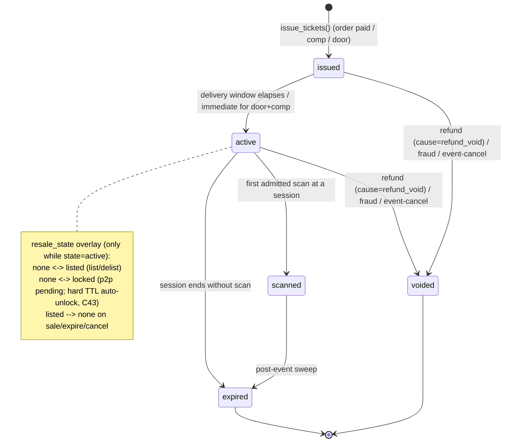
```mermaid
stateDiagram-v2
    [*] --> issued: issue_tickets() (order paid / comp / door)
    issued --> active: delivery window elapses / immediate for door+comp
    active --> scanned: first admitted scan at a session
    active --> expired: session ends without scan
    scanned --> expired: post-event sweep
    active --> voided: refund (cause=refund_void) / fraud / event-cancel
    issued --> voided: refund (cause=refund_void) / fraud / event-cancel
    note right of active
      resale_state overlay (only while state=active):
      none <-> listed (list/delist)
      none <-> locked (p2p pending; hard TTL auto-unlock, C43)
      listed --> none on sale/expire/cancel
    end note
    expired --> [*]
    voided --> [*]
```

**There is no `refunded` ticket terminal (A5/D2).** A money reversal's ticket effect is `voided` with ownership-log cause `refund_void`; the refund object (§3.11) carries the money reason, partiality, and reversal lifecycle. The `refunded` states on orders (§3.2), external transfers (§3.6), and payments are **different objects** and stand.

**Transition trigger events**

| From → To | Triggering event | Guard / invariant enforced |
|---|---|---|
| ∅ → issued | `core.issue_tickets` on order paid / comp grant / door sale | Draws batch inventory in the same tx; writes ownership_log `issue` row. |
| issued → active | delivery-window timer elapses (or immediate for door/comp) | Withhold window (anti-fraud) is the only thing between mint and usable. |
| active → scanned | first `admitted` scan for the current owner's credential at the session | Owner + credential_version + session must match; first-admit-wins. |
| active/scanned → expired | post-session sweep | Terminal; nothing but reporting reads it after. |
| active/issued → voided | refund (`refund_void`), fraud confirmation, or event cancellation | Cascades: delist any open listing, cancel any auction, notify buyers; writes ownership_log `refund_void` — this IS the money-reversal terminal (A5/D2); there is no separate `refunded` ticket state. A primary-order refund is refusable if the ticket was resold (the new owner holds it) — decided instantly from the ownership_log. |
| none ↔ listed | list / delist (resale_state overlay) | Only from `state=active`; locks the credential from transfer while listed. |
| none ↔ locked | p2p_transfer created / cancelled | Prevents concurrent list + gift. |

**Illegal transitions (and the invariant each would violate)**

| Illegal move | Why it's illegal — invariant violated |
|---|---|
| scanned → listed / scanned → transferred | Kills the **scan-then-sell scam**. A consumed admission is not an asset. Violates "ticket is the atom" (a used credential has no custody to move). |
| listed → scanned | Protects the buyer mid-sale; a listed ticket's holder must delist first. Violates the single-writer serialization on `resale_state`. |
| listed → transferred (without delisting) | The **double-sell** class. One `resale_state='listed'` constraint kills it. Violates Invariant 2 (one owner per instant) by racing a sale against a transfer. |
| owner change via UPDATE (not via engine) | Violates Invariant 2 — ownership is a logged state machine, not a column. Direct DML is REVOKE-blocked. |
| voided → active (any terminal re-animation) | Terminal states are terminal. Re-animating a voided ticket would let a refunded/fraudulent credential admit. Violates Invariant 4 (reconstructable, monotonic history). |
| issued/active → scanned by a *non-owner* credential | The old credential of a transferred ticket must fail closed. Violates Invariant 2 (only the current owner admits). |

**Re-entry (C41 — decided, Gate P).** `scanned` is terminal and the MVP venue scope is **no-re-entry GA**: one admitted scan consumes the session's admission, and no MVP surface may offer pass-outs. Re-entry is a **named, gated future change** (declared like the seat atom, so it is deliberate, not accidental): its reserved extension point is the scan ledger's `direction` attribute (`in`/`out`, default `in` — already carried on every scan row), under which future re-entry becomes additional `out`/`in` scan pairs adjudicated against a still-`scanned` atom — a *scan-model* extension, never a ticket-state change and never a resurrection of the terminal. Gate P closes on this decision; the re-entry implementation itself is deliberately deferred.

### 3.2 Order (`venue.orders`)

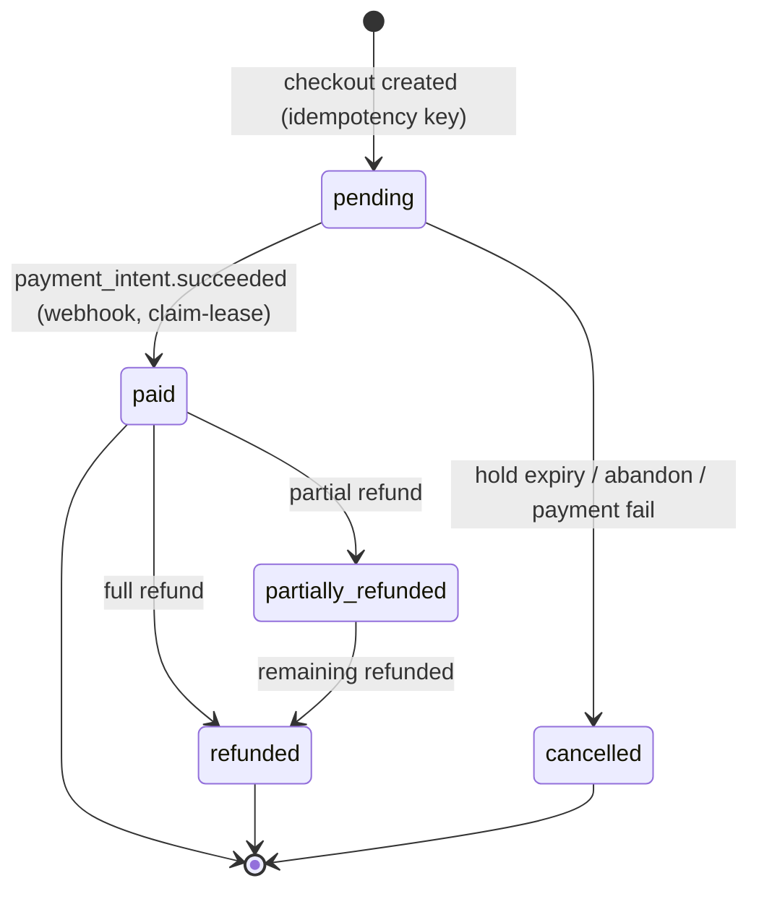
```mermaid
stateDiagram-v2
    [*] --> pending: checkout created (idempotency key)
    pending --> paid: payment_intent.succeeded (webhook, claim-lease)
    pending --> cancelled: hold expiry / abandon / payment fail
    paid --> partially_refunded: partial refund
    paid --> refunded: full refund
    partially_refunded --> refunded: remaining refunded
    paid --> [*]
    refunded --> [*]
    cancelled --> [*]
```

| From → To | Event | Guard |
|---|---|---|
| ∅ → pending | checkout with idempotency key + inventory hold | Hold drawn from batch. |
| pending → paid | Stripe `payment_intent.succeeded` via claim-leased webhook | Issues tickets atomically; accrues to settlement. |
| pending → cancelled | hold expiry / abandonment / payment failure | Releases held inventory. |
| paid → (partially_)refunded | refund created | Voids the specific tickets refunded, not the whole order. |

**Illegal:** paid → pending (money already moved; violates Invariant 3, payments-don't-reverse-implicitly); cancelled → paid (a released hold's inventory may be gone — oversell risk); issuing tickets before `paid` (violates atomicity: paid⇔issued in one tx).

### 3.3 inventory_hold

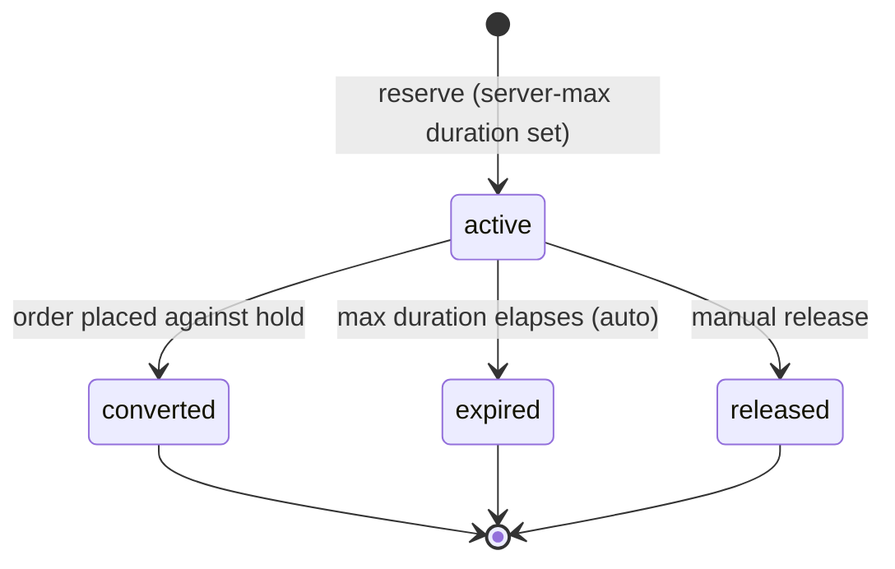
```mermaid
stateDiagram-v2
    [*] --> active: reserve (server-max duration set)
    active --> converted: order placed against hold
    active --> expired: max duration elapses (auto)
    active --> released: manual release
    converted --> [*]
    expired --> [*]
    released --> [*]
```

**Illegal:** expired → active (a lapsed hold cannot resurrect a claim on inventory that may be resold — capacity identity violation); active lifetime exceeding server max (the unbounded-reservation hole; guard is the max-duration attribute).

### 3.4 listing (`market.listings`)

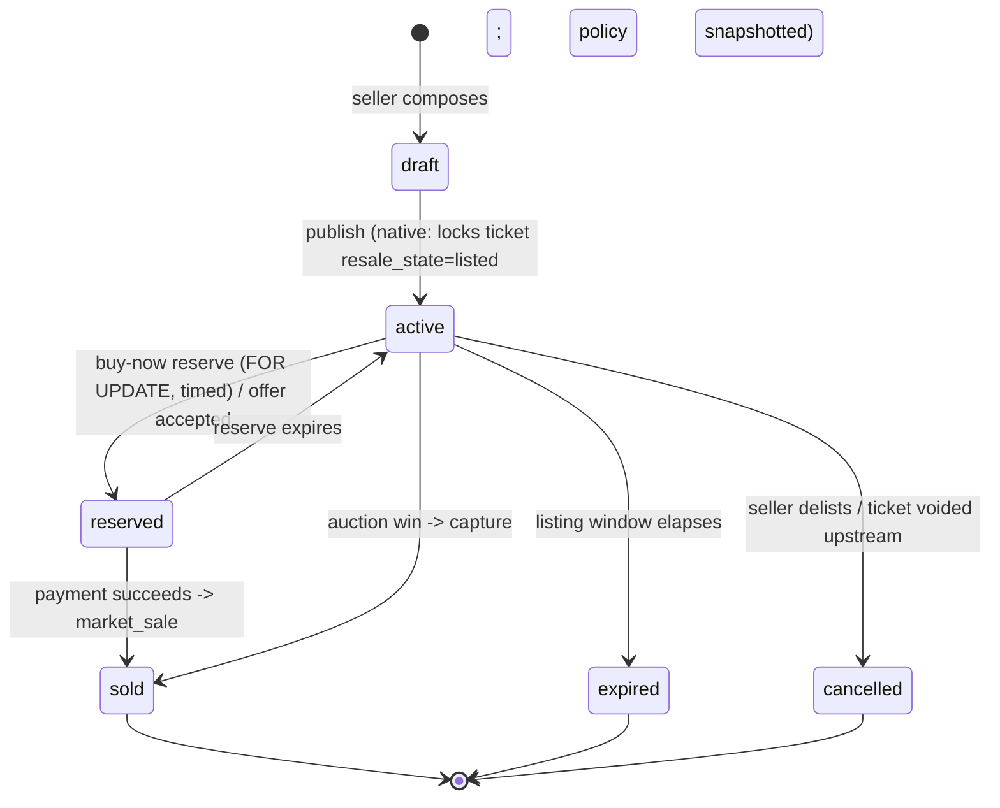
```mermaid
stateDiagram-v2
    [*] --> draft: seller composes
    draft --> active: publish (native: locks ticket resale_state=listed; policy snapshotted)
    active --> reserved: buy-now reserve (FOR UPDATE, timed) / offer accepted
    reserved --> sold: payment succeeds -> market_sale
    active --> sold: auction win -> capture
    reserved --> active: reserve expires
    active --> expired: listing window elapses
    active --> cancelled: seller delists / ticket voided upstream
    sold --> [*]
    expired --> [*]
    cancelled --> [*]
```

| From → To | Event | Guard (native rail) |
|---|---|---|
| draft → active | publish | Snapshots resale_policy; sets `ticket.resale_state='listed'`; validates event/session not cancelled in-tx. |
| active → reserved | buy-now reserve / offer accept | FOR UPDATE lock; timed reservation. |
| reserved/active → sold | payment captured | In one tx: `market_sale` + `core.transfer_ticket_ownership` + credential invalidation. |
| active → cancelled | delist, or upstream void/refund cascade | Frees `resale_state` back to none. |

**Illegal:** sold → active (a consummated sale can't be un-sold into a new offer; violates market_sale immutability); two listings `active` for the same native ticket (the `resale_state='listed'` lock forbids it — double-sell); active → sold without an ownership transfer on the native rail (violates Invariant 3, money-without-custody gap).

### 3.5 auction (`market.auctions`)

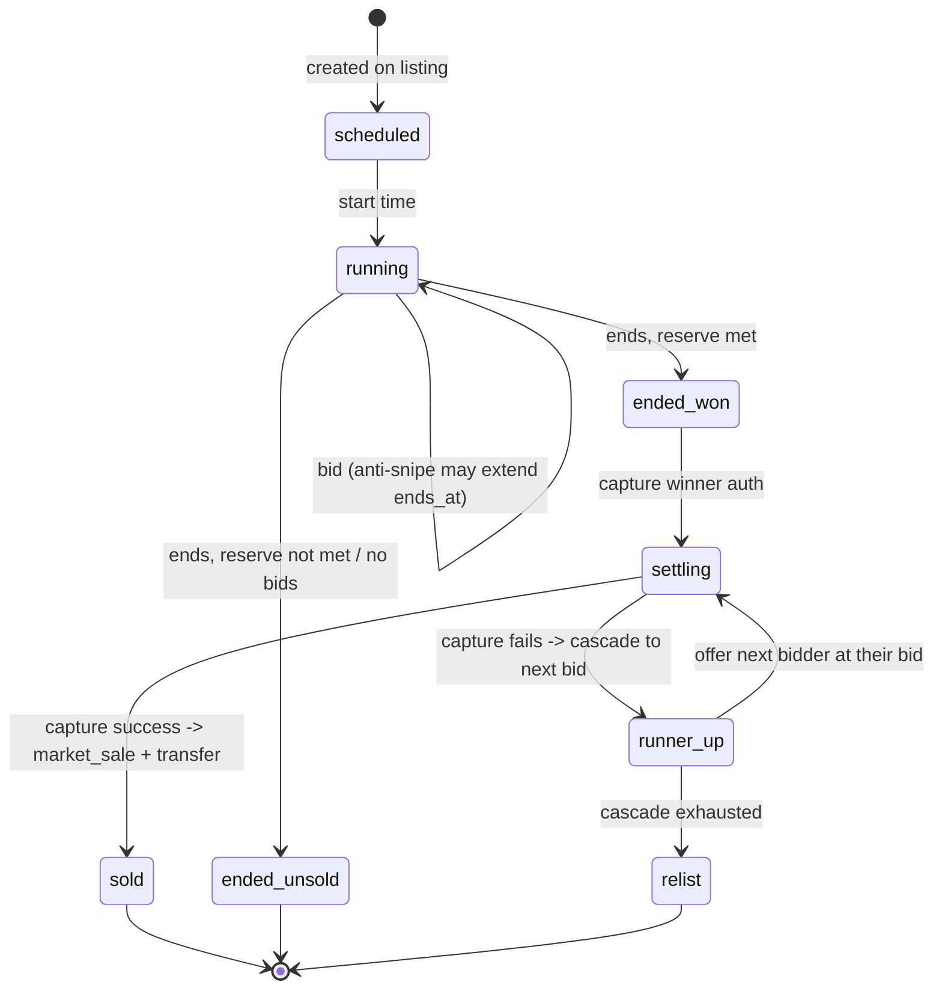
```mermaid
stateDiagram-v2
    [*] --> scheduled: created on listing
    scheduled --> running: start time
    running --> running: bid (anti-snipe may extend ends_at)
    running --> ended_unsold: ends, reserve not met / no bids
    running --> ended_won: ends, reserve met
    ended_won --> settling: capture winner auth
    settling --> sold: capture success -> market_sale + transfer
    settling --> runner_up: capture fails -> cascade to next bid
    runner_up --> settling: offer next bidder at their bid
    runner_up --> relist: cascade exhausted
    sold --> [*]
    ended_unsold --> [*]
    relist --> [*]
```

| Event | Effect |
|---|---|
| bid within anti-snipe window | extends `ends_at` (a column, not a feature-gap). |
| ends, reserve met | freeze highest bid as winner. |
| capture success | `market_sale` + ownership transfer, atomically. |
| capture fail | dunning (3 retries/24h) → runner-up at their bid → relist; strike on winner. |

**Illegal:** buy-now at a price below `current_bid` (structurally impossible — same function validates both; the deepest legacy bug); mutating a `bid` after placement (bids are immutable/append-only — the highest-bid head is derived, never edited); ended_won → running (re-opening a closed auction violates bid-ledger monotonicity).

### 3.6 external transfer (`market.transfers`) — Rail B

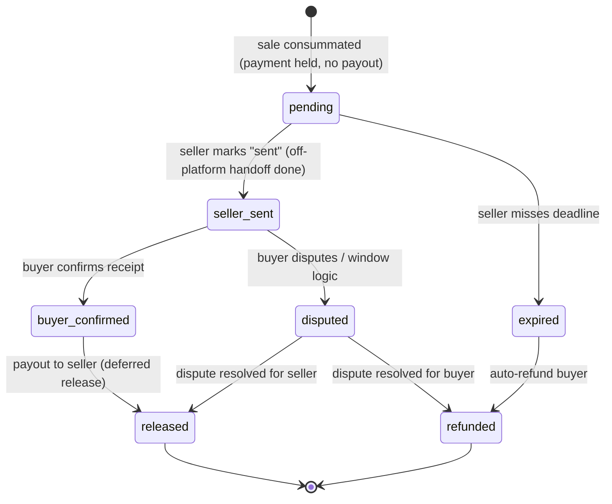
```mermaid
stateDiagram-v2
    [*] --> pending: sale consummated (payment held, no payout)
    pending --> seller_sent: seller marks "sent" (off-platform handoff done)
    seller_sent --> buyer_confirmed: buyer confirms receipt
    seller_sent --> disputed: buyer disputes / window logic
    pending --> expired: seller misses deadline
    buyer_confirmed --> released: payout to seller (deferred release)
    disputed --> refunded: dispute resolved for buyer
    disputed --> released: dispute resolved for seller
    expired --> refunded: auto-refund buyer
    released --> [*]
    refunded --> [*]
```

**Illegal:** any transition that writes `core.tickets` or `ticket_ownership_log` — **there is no ticket** (Invariant 1: the system never asserts ownership of external inventory); pending → released without buyer_confirmed or window expiry (the escrow guarantee; premature payout is the exact incident this flow was hardened against); seller_sent → released bypassing the protection window.

### 3.7 native p2p_transfer (`market.p2p_transfers`) — Rail A gift

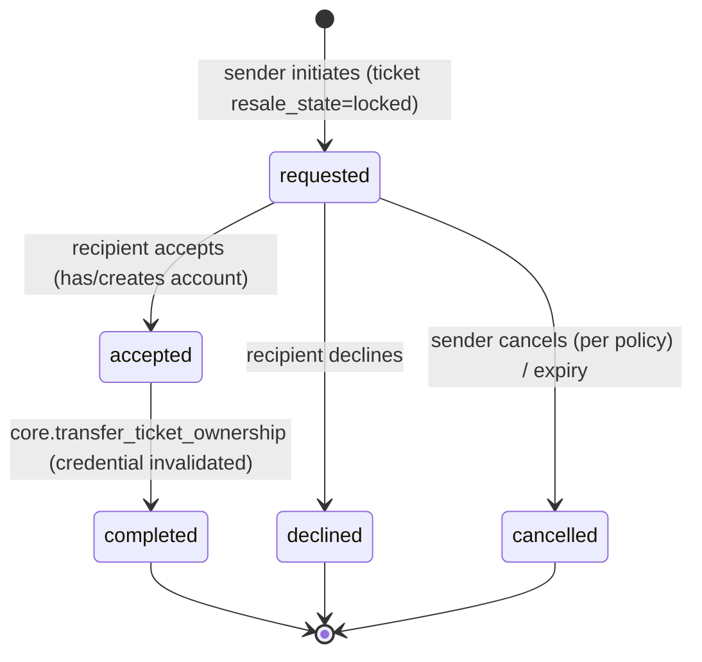
```mermaid
stateDiagram-v2
    [*] --> requested: sender initiates (ticket resale_state=locked)
    requested --> accepted: recipient accepts (has/creates account)
    requested --> declined: recipient declines
    requested --> cancelled: sender cancels (per policy) / expiry
    accepted --> completed: core.transfer_ticket_ownership (credential invalidated)
    completed --> [*]
    declined --> [*]
    cancelled --> [*]
```

**Illegal:** completed without invoking the ownership engine (the wrapper *must* delegate — Invariant 2); accepting a transfer of a `listed` or `scanned` ticket (custody isn't clean); two concurrent accepted transfers of the same ticket (the `locked` overlay + single-writer serialize it → one owner per instant).

**Physical-state mapping + hard expiry (C43 — Gate M).** The conceptual `requested` state above is physically named **`initiated`**; the physical terminal set is `initiated → accepted → completed | declined | cancelled | expired` (+ a `reason_code`). There is **no `failed` state** — a failure is `cancelled` + reason. `expired` is a distinct terminal driven by a **hard TTL**: when a pending transfer expires, the ticket's `locked` overlay **auto-unlocks** (a C25-style bound — never an unbounded lock), so an owner can never be locked out of their own valid ticket by a stale request, and the `locked`-overlay-meets-C6-freeze deadlock is structurally impossible. A sender **cancelling a pending transfer back to self is exempt from the C6 offline freeze** (owner and credential version do not change — nothing can strand at an offline door), and the freeze itself binds per ticket present in an open offline manifest, not session-wide (C43).

### 3.8 settlement (`venue.settlements`)

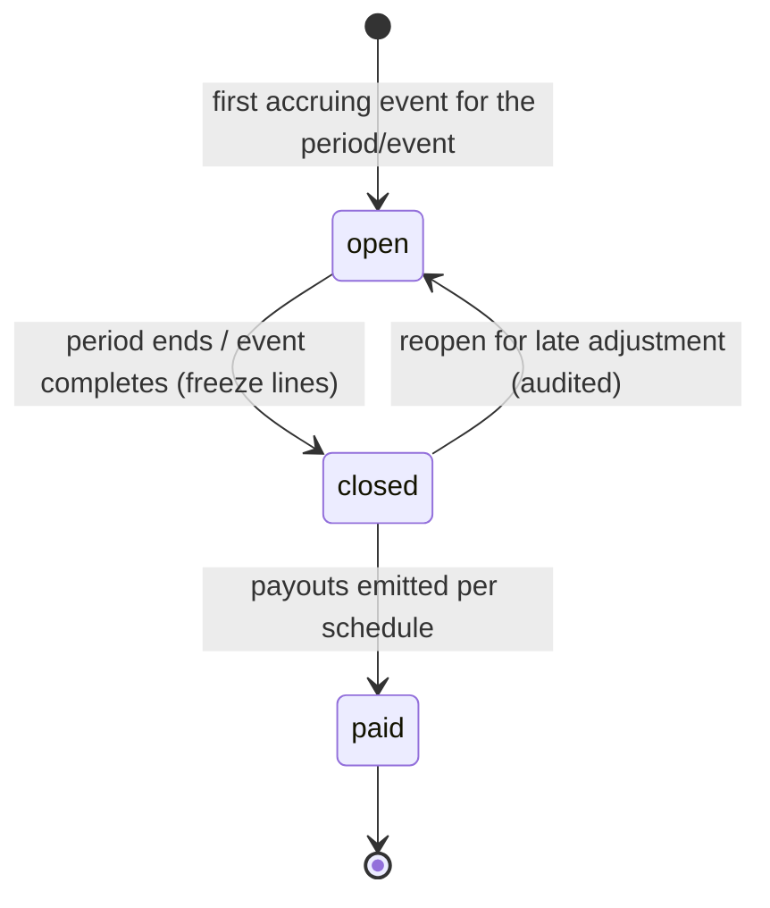
```mermaid
stateDiagram-v2
    [*] --> open: first accruing event for the period/event
    open --> closed: period ends / event completes (freeze lines)
    closed --> paid: payouts emitted per schedule
    closed --> open: reopen for late adjustment (audited)
    paid --> [*]
```

**Illegal:** paid → closed → editing historical lines silently (adjustments must append, not rewrite — Invariant 4); a settlement transition mutating a ticket (Invariant 3: settlement never modifies ticket history — a hard firewall). Negative balances from post-payout refunds carry to the *next* payout, never rewrite a paid settlement — and for a dormant org with no next payout, that "carry" is a receivable the Gate-M double-entry money ledger (C31) names as a first-class balance rather than an implicit stranded value.

### 3.9 payout (`core.payouts`)

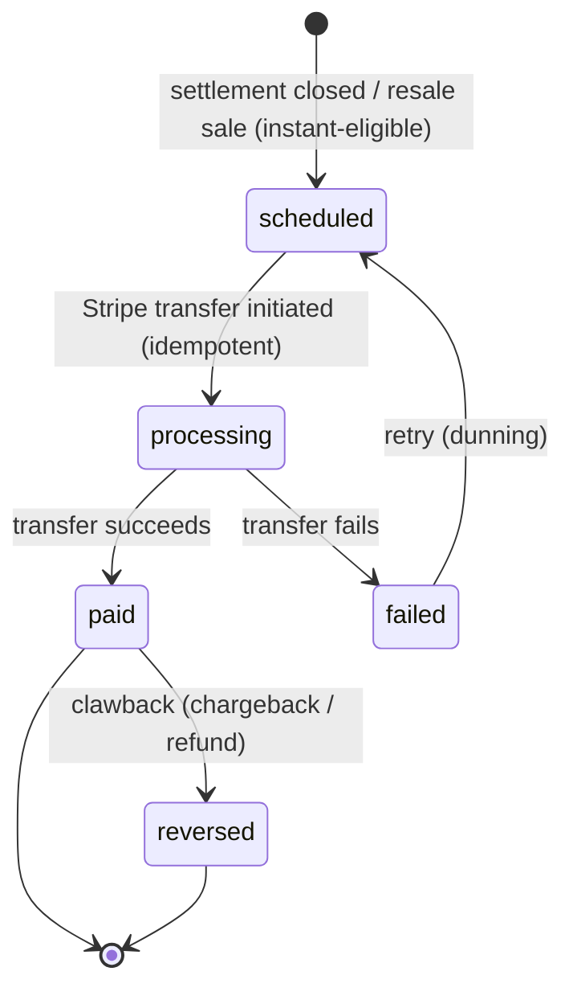
```mermaid
stateDiagram-v2
    [*] --> scheduled: settlement closed / resale sale (instant-eligible)
    scheduled --> processing: Stripe transfer initiated (idempotent)
    processing --> paid: transfer succeeds
    processing --> failed: transfer fails
    failed --> scheduled: retry (dunning)
    paid --> reversed: clawback (chargeback / refund)
    paid --> [*]
    reversed --> [*]
```

**Illegal:** double-disbursement for one idempotency key (frozen payout idempotency); native-resale seller payout held for a *delivery* window (nothing to deliver — no Rail-B evidence hold applies; actual payout **timing** is instead governed by the Gate-M reserve/payout-timing policy, C29 — instant is an *eligibility*, not a right); failed silently dropped (must enter a real failure state + notify — the specific gap this fixes).

### 3.10 event (`core.events`)

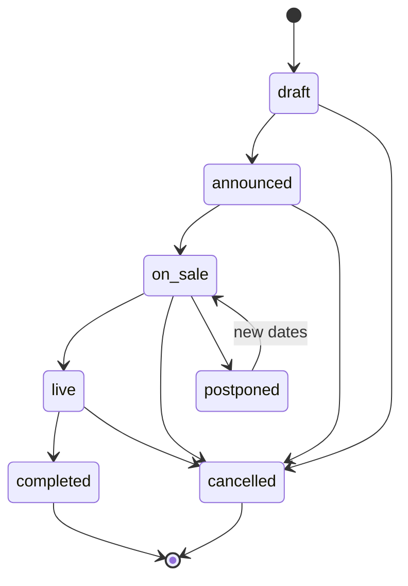
```mermaid
stateDiagram-v2
    [*] --> draft
    draft --> announced
    announced --> on_sale
    on_sale --> live
    live --> completed
    draft --> cancelled
    announced --> cancelled
    on_sale --> cancelled
    live --> cancelled
    on_sale --> postponed
    postponed --> on_sale: new dates
    completed --> [*]
    cancelled --> [*]
```

**Illegal:** completed → on_sale (a finished event can't reopen sales; make a new event); cancelled → live (cancellation cascades refunds/voids — irreversible for issued custody). The cancellation cascade (sessions + K× ticket void + listing/auction unwind + refund initiation) is itself a **named SSCAS member (C28)** with the full lock-order discipline — never an ad-hoc multi-aggregate write. **Postponed keeps tickets valid** (state unchanged, session dates move) — postpone ≠ cancel, and conflating them wrongly voids valid credentials.

### 3.11 refund (`core.refunds`)

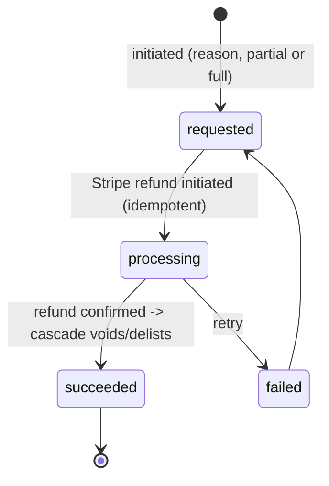
```mermaid
stateDiagram-v2
    [*] --> requested: initiated (reason, partial or full)
    requested --> processing: Stripe refund initiated (idempotent)
    processing --> succeeded: refund confirmed -> cascade voids/delists
    processing --> failed: retry
    succeeded --> [*]
    failed --> requested
```

**Illegal:** refunding a *resold* ticket to the original buyer (they no longer own it — the ownership log makes this decidable and refusable instantly); a refund that moves money without recording its downstream custody effect (Invariant 3+4).

---

## PART 4 — Immutability

Every object is classified **IMMUTABLE** / **APPEND-ONLY** / **MUTABLE** / **DERIVED** / **CONFIG**. The heart of this part is the **ledger → derived-head** pattern: two of the system's three most important facts (who owns a ticket, what the top bid is) are *never stored as an authoritative editable value* — they are the computed head of an append-only ledger, denormalized for speed and verified by trigger. The third (how much inventory remains) **deliberately inverts the pattern (C27):** the locked counter is the authoritative operational value — an on-sale's hot path cannot serialize on ledger folds — and the movement ledger is its audit stream, reconciled by job.

### 4.1 The ledger → derived-head pattern (why it is the spine)

| Ledger (APPEND-ONLY, the truth) | Derived head (DERIVED, the convenience) | Guarantee |
|---|---|---|
| `ticket_ownership_log` (every custody change, with cause) | `tickets.current_owner_id` | The head is a denormalization of the log's last row; writable only by the transfer engine; verified by trigger. Ownership can always be *reconstructed* from the log — the column is an optimization, not the source of truth. |
| `bids` (every bid, immutable) | `auctions.current_highest_bid` | Highest bid is `MAX` over the ledger; the column is cached and trigger-verified. You can never "edit" the top bid — you append a higher one. |
| inventory movements (issue/hold/release/void events) | `inventory_batches.remaining` counters | **Authority inverted vs. the rows above (C27):** the **locked counter is authoritative** (oversell = `remaining ≥ 0` on a locked decrement, C4); the movement stream is the **audit ledger**, and a reconciliation job asserts counter↔ledger equality. Counters change only inside issuance/hold functions that also record the movement. |

The payoff: **every dispute becomes a query, not an argument** (Invariant 4). "Who owned ticket X at time T and why" is a scan of one append-only log. A corrupted head is *recomputable*; a corrupted authoritative-value would be *lost*. This is why ownership and bids are modeled as ledgers even though a naive column would be simpler — and why inventory, whose authority is deliberately inverted (C27), still keeps its movement ledger: as the audit/reconciliation stream for the authoritative counter.

### 4.2 Full classification

| Object | Class | One-paragraph rationale |
|---|---|---|
| **ticket_ownership_log** | APPEND-ONLY | The custody ledger. Never updated or deleted; each row is a historical fact (from/to/cause/cause_ref/actor). Everything about ownership is reconstructable from it — it is the literal implementation of Invariant 4. |
| **tickets.current_owner_id** | DERIVED | Head of the ownership log. Denormalized for the door and UI; writable only inside `core.transfer_ticket_ownership`; trigger-verified against the log's tail. Not a source of truth — a cache of one. |
| **tickets (identity)** | IMMUTABLE | id, event/type, serial_no, origin, face_value are fixed at mint. The credential *derives* from immutable identity + mutable `credential_version`. |
| **tickets (state / resale_state / credential_version)** | MUTABLE (constrained) | The admission and resale sub-states change only along the drawn transitions, guarded by a transition-check trigger; `credential_version` is bump-only (monotonic). Mutable but never arbitrary. |
| **credential (derivation)** | DERIVED | A pure function — the asymmetric signature `Sign(kernel privkey, ticket_id ‖ credential_version ‖ session_id ‖ time_bucket)` (C1). Nothing stores "the current QR"; it is recomputed on demand and *invalidated* by bumping `credential_version`. Doors hold only the public verify key; the private key lives in KMS/HSM under the C33 lifecycle (§10.4). This is why transfer is atomic and screenshots die — the old derivation stops verifying the instant the version bumps. |
| **bids** | APPEND-ONLY (immutable rows) | Each bid is an immutable historical offer, trigger-validated at insert. Editing a bid would corrupt auction history and enable shill manipulation. |
| **auctions.current_highest_bid** | DERIVED | Head of the bid ledger; cached MAX, trigger-verified. |
| **auction (config fields)** | MUTABLE (pre-start) | Reserve, increment, anti-snipe, end time change only while `scheduled`/`running` per rules (anti-snipe extends `ends_at`); frozen once ended. |
| **inventory_batch (definition)** | MUTABLE | Quantity/reason are editable by staff pre/during sale within rules. |
| **inventory_batch (counters)** | MUTABLE (constrained, authoritative — C27) | sold/held/reserved/remaining are the **authoritative locked operational counters** (oversell guard = `remaining ≥ 0`, C4); only issuance/hold functions touch them, each mutation also appending the audit movement row; a reconciliation job asserts counter↔ledger equality (C27). |
| **inventory_hold** | MUTABLE | A live reservation with a server-max lifetime; transitions active→converted/expired/released. |
| **order** | MUTABLE (state) | The commercial container's status walks pending→paid→refunded; totals are snapshotted, status is the moving part. |
| **order_item** | IMMUTABLE (after issue) | Once an item issues tickets, its unit price/qty snapshot is frozen — the immutable financial record behind the issued credentials. |
| **market_sale** | IMMUTABLE (append) | One consummated sale, written once with the full split (buyer_fee/seller_fee/royalty). The authoritative sale fact; never edited. |
| **payment** | APPEND-ONLY-ish (state) | Frozen money core: integer-cents, deterministic idempotency, signed+replay-protected. The charge fact is immutable; a small state field tracks Stripe status. |
| **refund** | APPEND-ONLY (state) | First-class reversal rows; a new refund is appended (supports partial), never an edit of the payment. Carries reason + downstream void effects. |
| **payout** | APPEND-ONLY (state) | One row per disbursement attempt with idempotency; a real state machine (scheduled→processing→paid/failed→reversed). Failures are states, not dropped logs. |
| **settlement** | MUTABLE (open→closed→paid) | A rollup whose *lines reference immutable source rows*; the settlement's own state moves, but closing freezes lines and adjustments append rather than rewrite. |
| **scan** | APPEND-ONLY | The door ledger. Every admission attempt is an immutable fact; first-admit-wins and offline reconciliation read this stream. |
| **transfer (external)** | MUTABLE (state machine) | Rail B coordination state; **never touches any ticket** (there is none). |
| **p2p_transfer (native)** | MUTABLE (state machine) | Request/accept wrapper state; the *custody change itself* is delegated to the append-only ownership engine. |
| **listing** | MUTABLE (state) | The offer's state and price fields move; the `resale_policy_snapshot` on it is IMMUTABLE-after-publish (mid-flight listings never retroactively re-govern). |
| **offer** | MUTABLE | Negotiation object — counter-able, expirable. |
| **dispute** | MUTABLE (state) | Externally-driven chargeback lifecycle. |
| **resale_policy** | CONFIG | Venue-authored rulebook, admin-tunable per event/venue; *snapshotted* onto listings at publish so config changes are non-retroactive. |
| **platform_config** | CONFIG | Fees/windows/policy values out of code constants; the one governed place rates live. |
| **event** | MUTABLE (state + fields) | Marketable identity; walks the draft→completed/cancelled machine; postpone moves session dates without voiding tickets. |
| **event_session** | MUTABLE (state) | Per-occurrence capacity/status; can cancel one session without the event. |
| **venue / organization / user / org_member / staff_role** | MUTABLE | Durable actor/place records; fields evolve, identity persists. |
| **door_pin** | MUTABLE (revocable) | Loginless scanner credential; expiring + revocable is its whole point. |
| **promoter_link** | IMMUTABLE | A stable attribution slug; changing it would orphan attributions. |
| **attribution** | APPEND-ONLY | Each attributed order is an immutable commission fact surviving refunds/disputes. |
| **risk_score** | DERIVED | Live head of a stream of risk events (refunds/disputes/cancels/scan anomalies). |
| **admin_audit_log / webhook_events / events_stream** | APPEND-ONLY | The three witness ledgers — privileged actions, exactly-once webhook processing, behavioral analytics. |
| **comp_allocation** | MUTABLE→issues IMMUTABLE tickets | The grant record can be revoked before issue; once it mints tickets, those follow the normal immutable-identity ticket path. |
| **guest_list_entry** | MUTABLE | A promise resolved at the door; not yet an asset. |
| **ticket_group / lot** | IMMUTABLE (membership) | A fixed set moved/sold as one unit; membership fixed at creation to keep all-or-nothing settlement atomic. |
| **notification / push_token / report** | MUTABLE | Transport and moderation surfaces. |

---

## PART 9 — Ticket Ownership *(the most important section)*

Ownership is where nightlife ticketing platforms bleed money and trust. This part **disambiguates every ownership-flavored relationship**, states precisely how each maps onto `core.tickets` + `core.ticket_ownership_log`, and answers the one question a door only cares about: **who gets in.**

### 9.1 The eight relationships people call "owner"

The word "owner" is overloaded across at least eight distinct relationships. Only **one** controls entry. Here they are, each defined precisely and mapped to the data model.

| # | Relationship | Precise definition | Where it lives in the model | Controls entry? |
|---|---|---|---|---|
| 1 | **Legal owner** | The party with the legal right to the admission the ticket represents *right now*. In this system, legal ownership is *defined as* current custody — Snatch It recognizes exactly one owner and it is the head of the ownership log. | `tickets.current_owner_id` = head of `ticket_ownership_log`. | **YES — this is the one.** See 9.3. |
| 2 | **Current holder** | Whoever currently *possesses* the ticket in the platform. Identical to legal owner **by construction** — because the platform *is* the custodian, holding and owning cannot diverge (unlike physical or external tickets). | Same row: `current_owner_id`. | Same as #1 (they are the same fact). |
| 3 | **Original purchaser** | The user who paid the *primary* order that minted the ticket. A historical fact, frozen forever. | The `to_user_id` of the ownership_log's **first** (`cause='issue'`) row; also `orders.buyer`. | **No.** Purchasing once ≠ owning now. Refund eligibility keys off this, not entry. |
| 4 | **Attendee / name-on-ticket** | The person *intended* to attend — a name printed on a ticket or a `name-match-required` policy target. May differ from the owner (gift, corporate buy, comp). | An *attribute* (name field / policy check), **not** a custody edge. Never `current_owner_id` unless they also hold it. | **No — except** where a venue's `resale_policy.transfers='name-match-required'` makes name-match an *additional* door check layered on top of custody. Even then, custody is necessary; name-match is an extra gate, never a substitute. |
| 5 | **Marketplace seller** | The current owner who has *listed* the ticket for resale. | `current_owner_id` **while** `resale_state='listed'`. Still the owner until the sale consummates. | **No while listed** — a listed ticket cannot be scanned (protects the buyer). They own it but have suspended their own entry right by listing. |
| 6 | **Marketplace buyer** | The party who *will* own the ticket once a resale settles. Not yet the owner. | Becomes `current_owner_id` only at `market_sale` + `transfer_ticket_ownership`, atomically. | **No until settled** — then they *become* #1. |
| 7 | **Venue / issuer** | The org that issued the ticket and governs its resale. Owns the *rules*, never the custody. | `events.organization_id`, `resale_policy`; `tickets.origin`/event linkage. | **No.** The issuer governs (can void, sets policy, earns royalty) but is not the admittee. Voiding is an authority over the ticket, not ownership of the admission. |
| 8 | **Transfer recipient** | The friend receiving a native p2p gift; a marketplace buyer is a special case with money. | Becomes `current_owner_id` on `p2p_transfer` acceptance via the engine. | **No until accepted** — then becomes #1. |

### 9.2 How they map onto the two tables

There are really only **two** custody-bearing facts, and every relationship above is either one of them or a non-custody attribute:

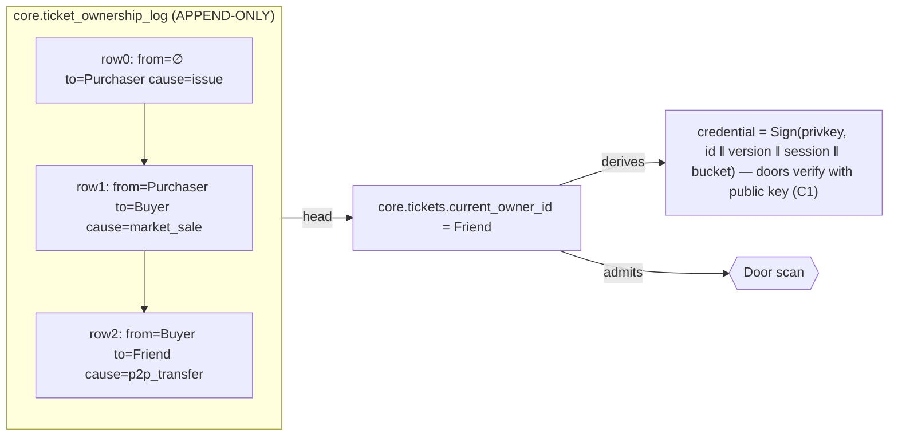
```mermaid
flowchart LR
    subgraph LEDGER["core.ticket_ownership_log (APPEND-ONLY)"]
      R0["row0: from=∅ to=Purchaser cause=issue"]
      R1["row1: from=Purchaser to=Buyer cause=market_sale"]
      R2["row2: from=Buyer to=Friend cause=p2p_transfer"]
      R0 --> R1 --> R2
    end
    LEDGER -->|head| HEAD["core.tickets.current_owner_id = Friend"]
    HEAD -->|derives| CRED["credential = Sign(privkey, id ‖ version ‖ session ‖ bucket) — doors verify with public key (C1)"]
    HEAD -->|admits| DOOR{{Door scan}}
```

- **Original purchaser** = `to_user_id` of **row 0** (`cause='issue'`) — permanent, historical.
- **Current / legal owner / holder** = `to_user_id` of the **last** row = `current_owner_id` (the DERIVED head).
- **Seller / buyer / recipient / issuer / attendee** = roles *around* a specific log transition or policy, **not** additional owner columns. A seller is "current owner with `resale_state='listed'`"; a buyer is "the `to_user_id` a pending `market_sale` will write"; an attendee is a name attribute; an issuer is the event's org. None of them is a second owner.

**The single rule this enforces:** there is exactly **one** owner per ticket per instant (Invariant 2), and it is always the head of the log. Every other "owner-ish" party is a *time-slice role* or an *attribute*, expressible as a query over the log, never as competing state.

### 9.3 Which one controls entry — and why the others do not

> **The door admits the ticket if and only if the presented credential verifies against `tickets.current_owner_id` (the ownership-log head) with the current `credential_version`, the ticket `state='active'`, and the scan targets the correct `event_session`. Nothing else grants entry.**

Why each *other* candidate does **not** control entry:

- **Original purchaser (#3):** entry follows the asset, not the receipt. Once they gift or sell, the credential re-derives (version bump) and *their* old QR fails closed. If purchase controlled entry, every resale would double-admit. It controls *refund eligibility*, not admission.
- **Attendee / name-on-ticket (#4):** a name is a policy attribute. In the default (transferable) world it is decorative; under `name-match-required` it is an *additional* check *layered on* custody — the current owner must also match the name. Name-match can *tighten* entry, never *grant* it without custody. This is the clean answer to "attendee ≠ owner": both must be satisfied where policy demands it, but custody is the necessary condition and the credential is bound to custody.
- **Seller (#5):** listing suspends the seller's own entry right (`listed` ⇒ not scannable). They still own it, but they have offered it; admitting them mid-listing would let them sell a ticket they just used.
- **Buyer / recipient (#6, #8):** they have no credential until the transfer engine writes the new head and bumps the version. Before that instant, their (nonexistent) credential cannot verify. After it, they *are* the current owner — same rule, no special case.
- **Issuer / venue (#7):** governs and can *void* (revoke the admission entirely) but is never the admittee. Authority over the ticket ≠ ownership of the admission.
- **Current holder (#2):** identical to the legal owner by construction — there is no gap between holding and owning because the platform is the sole custodian of native tickets. (This is precisely what Rail B does *not* have, which is why Rail B needs an evidence window and this rail does not.)

**Attendee ≠ owner, resolved concretely.** Three cases:

1. *Corporate/parent buys for someone else, transfers:* buyer becomes owner via the engine; the intended attendee's entry works because they now hold the credential. Custody moved; name is irrelevant unless policy requires match.
2. *Gift kept in buyer's account, buyer hands phone to friend at door:* owner is still the buyer; the credential verifies for the buyer's current version regardless of *who holds the phone*. The platform admits the credential, not the face — acceptable because the buyer chose to share. Name-match policy is the venue's tool if it wants to stop this.
3. *`name-match-required` event:* door checks credential-verifies-against-current-owner **AND** owner's verified identity matches the ticket name. Both required; custody still primary.

### 9.4 The transfer engine as the sole custody writer

Every ownership change — issue, market_sale, auction_sale, p2p_transfer, admin_action, refund_void (the ownership-log subset of the canonical cause registry, §5.2.1/D3) — flows through `core.transfer_ticket_ownership(ticket, to_user, cause, cause_ref)`, which in **one transaction**: (1) **verifies the authenticated acting principal** — the current owner, an accepted p2p recipient, or a dual-controlled admin (C2); state validation is necessary but NOT sufficient, and `service_role` is a machine identity, never a person; (2) validates the transition against `state`/`resale_state`; (3) appends the ownership_log row — idempotent under `UNIQUE(cause, cause_ref, ticket_id)` (C26); (4) updates the `current_owner_id` head; (5) bumps `credential_version` so outstanding credentials re-derive and old ones fail closed. **At the market→kernel seam the kernel additionally derives and authorizes the buyer principal itself (C35): a market-supplied buyer id is never trusted — the buyer is resolved from the authenticated context and re-verified against the payment.** This is the *only* code path that may change custody; direct DML is REVOKE-blocked from every other role. The atomicity of steps 3–5 is what makes native resale delivery-dispute-free online: the buyer becomes the owner and the seller's QR dies in the same instant money settles.

---

## PART 10 — Resale Model (two-rail)

Resale is the differentiator. This part fully designs the **native pipeline**, contrasts it precisely with the **external rail**, and shows the exact **state coupling** between `listing.resale_state` and `ticket.state` that makes native resale atomic and dispute-free.

### 10.1 The two rails, side by side

| Dimension | **Rail A — Native** (`inventory_kind='native'`, `ticket_id` set) | **Rail B — External** (`inventory_kind='external'`, `ticket_id` NULL) |
|---|---|---|
| What the platform holds | The **asset** — a `core.tickets` row + credential it issued. | A **claim** the seller describes; asset lives on Ticketmaster/AXS/etc. |
| Ownership assertion | Full — the ownership log is authoritative. | **None** — Invariant 1: the system never asserts ownership of what it didn't issue. |
| Delivery | The **credential IS the delivery** — instant, atomic. | Off-platform manual handoff (mobile transfer / email). |
| Evidence / windows | None — no screenshots, no 24h/72h window. | Proof screenshot + seller-sent/buyer-confirmed + protection window. |
| Settlement | **Instant-eligible** on sale (no delivery risk); actual payout timing is governed by the Gate-M reserve/payout-timing policy (C29). | **Deferred** until confirmation or auto-release (delivery risk real). |
| Fraud surface | Payment/account fraud only. | Delivery fraud **+** payment/account fraud. |
| Venue governance | **Full** — resale_policy applies (caps, royalty, windows). | **None** — venue is not a party. |
| Disputes | No *delivery*-dispute **flow** exists (the credential is the delivery); payment/account disputes remain, and the offline door is an explicit reconcile window, not a guarantee (C6/C37). | Delivery disputes are a first-class flow. |
| Trust story | "Guaranteed — the ticket moves the instant you pay." | "Protected — money held until you confirm receipt." |

Both rails share discovery, search, auction/offer mechanics, and the fee engine. They **never** share the custody path: Rail A settles through the ownership engine; Rail B settles through the external-transfer state machine and touches no ticket. Blurring them is the one thing the model forbids.

### 10.2 The native resale pipeline (Rail A)

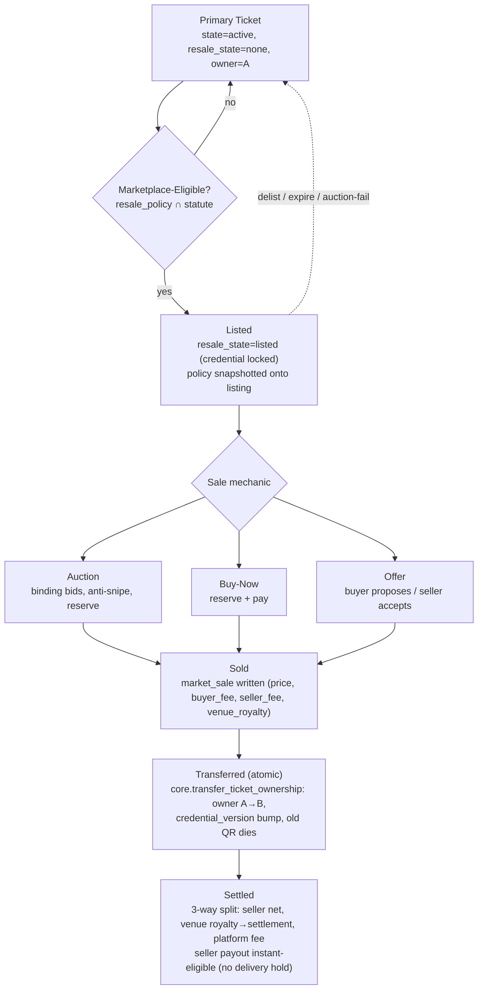
```mermaid
flowchart TD
    P["Primary Ticket<br/>state=active, resale_state=none, owner=A"]
    E{"Marketplace-Eligible?<br/>resale_policy ∩ statute"}
    L["Listed<br/>resale_state=listed (credential locked)<br/>policy snapshotted onto listing"]
    M{"Sale mechanic"}
    AUC["Auction<br/>binding bids, anti-snipe, reserve"]
    BN["Buy-Now<br/>reserve + pay"]
    OF["Offer<br/>buyer proposes / seller accepts"]
    SOLD["Sold<br/>market_sale written (price, buyer_fee, seller_fee, venue_royalty)"]
    XFER["Transferred (atomic)<br/>core.transfer_ticket_ownership: owner A→B,<br/>credential_version bump, old QR dies"]
    SET["Settled<br/>3-way split: seller net, venue royalty→settlement, platform fee<br/>seller payout instant-eligible (no delivery hold)"]
    P --> E
    E -->|no| P
    E -->|yes| L
    L --> M
    M --> AUC --> SOLD
    M --> BN --> SOLD
    M --> OF --> SOLD
    SOLD --> XFER --> SET
    L -.delist / expire / auction-fail.-> P
```

**Stage-by-stage:**

1. **Primary Ticket** — a native ticket, `state='active'`, `resale_state='none'`, owned by A.
2. **Marketplace-Eligible** — governed by `resale_policy` (see 10.3): is resale on? within the resale-open window? under the per-user active-listing limit? statute-permitted? Eligibility is *evaluated*, never stored on the ticket — it's a policy function of the ticket + event + jurisdiction at the moment of listing.
3. **Listed** — publishing sets `ticket.resale_state='listed'` (locking the credential from transfer/scan) and **snapshots the policy** onto the listing so later venue edits can't retroactively re-govern this listing.
4. **Auction / Buy-Now / Offer** — three consummation mechanics on the same listing. Auctions use binding (card-authorized) bids, server-enforced min-increment, reserve, and anti-snipe; if capped, auction max-bid = cap. Buy-Now reserves (FOR UPDATE) then charges. Offers are buyer-initiated negotiations.
5. **Sold** — a `market_sale` row is written with the full split: price, buyer_fee, seller_fee, `venue_royalty_cents`.
6. **Ownership Transferred** — **in the same transaction as the sale**, `core.transfer_ticket_ownership` moves custody A→B, appends the log row (`cause='market_sale'`), and bumps `credential_version`. A's QR dies; B's credential derives instantly. This atomicity is the whole game.
7. **Settled** — the money splits three ways: seller net (price − seller_fee − royalty), venue royalty (→ the event's settlement), platform fee. Because there is nothing to deliver, the **seller payout is instant-eligible** (no Rail-B delivery hold) — with actual payout *timing* governed by the Gate-M reserve/payout-timing policy (C29, §10.5): eligibility is structural, timing is policy.

### 10.3 How eligibility is governed by `resale_policy`

`resale_policy` is CONFIG, authored per venue and overridable per event, and **snapshotted onto every listing at publish**. Eligibility resolution is **`statute ∩ venue_policy`**, evaluated server-side at listing *and* transfer time:

| Policy lever | Effect on eligibility |
|---|---|
| `transfers` (on/off/after-delay/name-match) | Gates p2p *and* resale movement; `off` is unofferable where statute mandates transferability. |
| `resale` (off / face-only / capped / uncapped) | Whether a listing may exist and its max price; `capped` sets the price ceiling and the auction max-bid. |
| `auction_eligible` (yes/no/venue-run-only) | Whether the auction mechanic is available. |
| `royalty_share` (% of price **or** of above-face delta) | The venue's cut captured at settlement (10.5). Delta-share is recommended — it aligns the venue with fan-friendly face pricing. |
| `resale_open_window` | e.g., not before on-sale+24h (kills speculative flipping), not after doors+1h. |
| `per_user_purchase_limit` / `per_user_active_listing_limit` | Anti-scalping caps checked at list time. |
| `waitlist_mode` | If face-value-return is preferred over open resale, the ticket routes to the waitlist queue instead of a free-price listing. |
| **Jurisdiction overlay** | **Non-negotiable, platform-enforced.** Statute overrides venue policy (e.g., a mandated transferability or a statutory price cap). Resolution = `statute ∩ venue_policy`. |

Because the resolved policy is **snapshotted onto the listing**, a venue changing its rules mid-flight affects only *new* listings; open listings wind down at their original terms (except where statute forces otherwise). This non-retroactivity is a first-class correctness property, not a nicety.

### 10.4 Why credential invalidation makes native resale atomic — and what the door actually guarantees (C1/C33/C37)

The credential is a pure derivation — an **asymmetric signature (C1)**: `sig = Sign(kernel privkey, ticket_id ‖ credential_version ‖ session_id ‖ time_bucket)`. It stores nothing presentable; it is recomputed on demand and verified with the **public key only**. A door — online or offline — carries no signing secret and no per-ticket secret: a scanner can *verify* any credential but can *mint* none, so a compromised or offline scanner is never a forgery oracle, and no scan manifest ever ships key material. Therefore:

- **Atomicity:** the sale's money settlement and the custody change are **one transaction** (market_sale + transfer_ticket_ownership). At commit, `credential_version` bumps. There is no window where the buyer has paid but doesn't yet hold, and none where the seller has been paid but still holds a valid credential. Screenshots are inert: a captured QR encodes an old version and won't verify.
- **Online delivery is dispute-free as a *flow*:** there is no separate delivery step that could fail — **the credential IS the delivery** — so Rail B's evidence window, buyer-confirm, and delivery-dispute machinery simply do not exist on Rail A. An **online door performs a live, authoritative per-scan kernel read at the decision point (C37)** — owner + `credential_version` + `state` — so an invalidated credential fails closed the moment it is presented, with no cron-drain staleness window.
- **The offline door is honestly bounded, not guaranteed (C6/C37):** an offline scanner verifies signatures against its manifest's versions and rejects stale ones (±2 time-bucket tolerance for clock skew), which *shrinks* the replay window — it does not close it. Offline admission is an explicit **reconcile-after-the-fact, fraud-windowed state**: the per-open-manifest-ticket transfer freeze (C6/C43, extended to refund-voids by C23), first-admit-wins arbitration, and the fraud-review queue cover the residual. The claim this design makes is "delivery-dispute-free **online**, shrunk-and-reconciled **offline**" — never an unqualified "dispute-free by construction."
- **Contrast with Rail B:** the external rail has a genuine delivery step outside the platform's control, hence the evidence window, buyer-confirm, and delivery disputes. Rail A eliminates that entire failure class — which is exactly why its economics (no seller deadline, instant-eligible settlement) are strictly better and pull sellers and venues onto the native rail.

**The signing key is a first-class managed object (C33 — Gate P; the hardest-to-reverse decision in the system):**

- **Scope:** keys are **per-event by default** (per-venue allowed; a global key is permitted but discouraged — a global-key compromise forges the entire population while offline doors accept the forgeries, an existential single point, R3). Every ticket pins the key that signs it (a `signing_key` reference beside `credential_version`).
- **Custody:** private key material lives **only in a KMS/HSM**. The database stores a public key plus an opaque KMS handle — never key material; signing is performed by the signer service calling the KMS, never by the database.
- **Rotation & compromise:** rotation is a first-class, audited operation (old key → `rotating`, new key → `active` in one transaction; exactly one active signer per scope at a time), and a **compromise runbook** exists per scope: revoke the key, re-sign/re-issue only the affected scope's population, redistribute the new public key to doors. Revoked keys are retained so historical credentials remain verifiable and auditable.
- **Signer availability & throughput:** the signer sits on the credential hot path and is engineered for **HA and issuance-spike throughput** — it is the real single point the "single-writer" analysis would otherwise miss (the per-ticket transfer engine parallelizes; the signer must too).
- **Door key distribution:** doors receive the **public** keys (+ validity windows) through the manifest — safe to distribute, world-readable by design.

### 10.5 How venue royalty is captured at settlement

Royalty is decided by `resale_policy.royalty_share` (recommended: a share of the **above-face delta**), written onto the `market_sale` as `venue_royalty_cents` at the moment of sale, and **accrued to the event's `settlement`** — not paid ad hoc. The three-way split at settlement:

```
buyer pays:   price + buyer_fee
seller nets:  price − seller_fee − venue_royalty
venue gets:   venue_royalty        → event settlement → org payout on schedule
platform:     buyer_fee + seller_fee
```

The royalty rides the org's normal settlement/payout cadence, keeping resale revenue auditable in the same statements as primary sales.

**Cancellation, clawback, and the money-reversal envelope (C29/C30/C31 — Gate M; C32 — Gate L; modeled, NOT built in the Phase-2 foundation).** On event cancellation the policy is full-chain refund funded by clawback on the reseller's proceeds (their sale voids with the event), platform absorbing only its own fees — disclosed in resale terms and bounded by the resale-open window and event-health checks. That policy is only *collectible* with the following named extension architecture, which is a constitutional requirement of the native money rail and a hard blocker of Gate M (native resale + instant payout):

- **Reserve / Clawback (C29):** a first-class reserve/receivable object plus a **payout-timing policy that gates instant payout**. It is the funding source for cancellation refunds, C25 auto-compensations, and post-payout clawback. Instant payout with no reserve is an unrecoverable-loss design and may not ship. (This is what the old open question O1 actually was — a missing object, not a question.)
- **Fan-side liability (C30):** a withdrawn fan-seller's chargeback/clawback is representable — a receivable object or a Wallet-ledger negative balance, with a real ledger home — never a silent, unbookable loss.
- **Double-entry money-ledger schema (C31):** an **additive schema beside the frozen Stripe core** (the frozen core is untouched; the custody ownership log stays separate — custody is not a balance problem) that is the recommended home for C29/C30 and makes the 3-way split, the royalty (today a one-sided credit), and rounding residuals **balance structurally**: an unbalanced money movement becomes a constraint violation, not a silent leak.
- **First-class currency (C32 — Gate L):** every money object is currency-typed from birth (CDM C13); before any non-US market, the **frozen USD-integer-cents money-in boundary** gains a specified currency home — FX capture-vs-payout timing, per-country payout currency, and a **named rounding bearer** — as additive attributes beside the frozen core, never a reopening of it.

None of these ships in the Phase-2 foundation; the native-resale rail remains a `resale_policy='off'` stub until Gate M clears.

### 10.6 State coupling: `listing.resale_state` ↔ `ticket.state`

This is the mechanism that closes the double-sell/scan-then-sell bug classes. `resale_state` lives on the ticket (`none`/`listed`/`locked`); the listing's lifecycle *drives* it; and `ticket.state` constrains what the listing may do. They are two views of one serialized row.

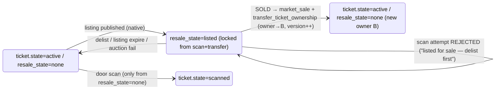
```mermaid
stateDiagram-v2
    direction LR
    state "ticket.state=active / resale_state=none" as A
    state "resale_state=listed (locked from scan+transfer)" as L
    state "ticket.state=active / resale_state=none (new owner B)" as A2
    state "ticket.state=scanned" as S
    A --> L: listing published (native)
    L --> A: delist / listing expire / auction fail
    L --> A2: SOLD → market_sale + transfer_ticket_ownership (owner→B, version++)
    A --> S: door scan (only from resale_state=none)
    L --> L: scan attempt REJECTED ("listed for sale — delist first")
```

**The coupling rules (each kills a bug class):**

| Coupling rule | Bug class it kills |
|---|---|
| Publishing a native listing **requires** `ticket.state='active'` and sets `resale_state='listed'`. | Listing a scanned/void ticket. |
| A ticket with `resale_state='listed'` **cannot be scanned** (scan fails closed: "delist first"). | **Scan-then-sell** (seller uses ticket, then sells the "still valid" QR). |
| A ticket with `resale_state='listed'` **cannot be transferred or listed again** (single constraint). | **Double-sell** (racing a p2p gift against a resale, or two listings). |
| `state='scanned'` **cannot go to `listed`**. | Selling an already-consumed admission. |
| Sale transitions `resale_state: listed→none` **and** owner A→B **and** `version++` **atomically**. | Paid-but-not-delivered / delivered-but-not-paid gaps (Invariant 3). |
| Delist/expire/auction-fail returns `resale_state: listed→none`, ticket stays `active`. | Tickets stranded in `listed` after a failed sale. |
| Upstream void/refund **cascades**: delist the listing, cancel the auction with bidder notices. | Selling a ticket the venue just refunded/voided. |

Because `resale_state` and `state` are columns on **one** ticket row mutated only by single-writer functions holding row locks, all of the above are *serialized by the database*, not coordinated across services. That serialization — one row, one writer, one transaction — is why "a ticket cannot be simultaneously sold at the door and on the marketplace" is true **by construction while online**. The offline door is the explicitly-bounded exception (C6): its manifest window is covered by the per-open-manifest-ticket transfer freeze (C43, extended to refund-voids by C23) and reconcile-with-fraud-queue arbitration — a shrunk-and-reconciled window, never an unstated one.

---

## Appendix — CHALLENGES to the canonical core

Flagged per the spine's instruction; none silently deviated from.

1. **`event` needs `event_session` (occurrence).** The catalog models only `event`. Recurring/multi-day/multi-room admission cannot be expressed cleanly without a session object *that scans bind to*. Recommend adopting `event_session` into `core` (implicit/auto-created for single-night events so it's free there). This is my strongest challenge.
2. **`credential` deserves first-class conceptual status.** Treating rotating-QR purely as columns on `tickets` obscures that the credential has its *own* invalidate-and-re-derive lifecycle, which is the linchpin of atomic transfer (Part 9/10). Recommend documenting it as a named concept even if physically stored on the ticket.
3. **`comp_allocation`, `guest_list_entry`, and `waitlist` are load-bearing for nightlife, not optional.** Comps and door-list admissions are the daily reality of clubs; without them, teams will abuse `orders`/`tickets` to fake comps. Recommend promoting them from "implied" to named catalog objects.
4. **`ticket.state` naming: `issued` vs `active` vs `refunded`.** The catalog's `state (issued → active → scanned → expired | voided | refunded)` puts `refunded` as a peer terminal of `voided`, but a refund's *ticket effect* is a void (`cause='refund_void'` in the log). Recommend collapsing ticket-level `refunded` into `voided` (the refund object records the money reason; the ticket is simply voided) to avoid two terminal states meaning "not admittable due to money reversal." *(Adopted as A5; §3.1's state machine draws it, and D2 confirmed the diagrams match.)*

## Appendix — The three hardest open questions (status after the final audit)

1. **Cross-rail identity of "the same seat." — RESOLVED (C17).** When a formerly-external venue goes native, or a ticket exists on both rails, the same physical seat must not be simultaneously a native `core.tickets` row and a live external claim. C17 closes this with the canonical **external-seat-reference** dedup key (provider + normalized provider-seat/barcode identity) carried by both rails and checked at listing *and* issuance; per O5, its enforcement is confirmed at Gate P for events with external inventory.
2. **Name-match under custody-follows-credential. — STILL OPEN (O4).** Part 9 makes custody primary and admits "the credential, not the face." Under `name-match-required`, where exactly identity binds, how strong the verification must be per ticket/event, and what happens when a verified name legitimately differs (marriage, legal change, corporate holder) remain open — tracked as O4 in the risk register.
3. **Event-cancellation refund funding when the reseller has withdrawn. — RESOLVED AT THE MODEL LEVEL (C29/C30/C31, Gate M).** Instant-eligible native payouts make the withdrawn-reseller exposure *faster*, and the answer is the Gate-M money-reversal envelope (§10.5): the **Reserve/Clawback object + payout-timing policy that gates instant payout** (C29), the **fan-side liability home** for the residual debt (C30), and the **double-entry money ledger** that books the gap instead of silently absorbing it (C31). Native resale does not ship before they exist.


---

# §2 — Ownership & Data Integrity

# Ownership, Ledgers & Data Integrity

*Data-architecture section for `SNATCH_IT_DOMAIN_ARCHITECTURE.md`. Builds on the Phase 2A Canonical Core (four foundational invariants, canonical object catalog, two-rail marketplace) and audit §3.6 (entity model, ownership contract §3.6.3). Design only — constraint/trigger/function concepts are named, no DDL is written. Honors the Phase-0 discipline confirmed in `PHASE_0_EXECUTION.md`: RLS deny-all on financial tables, cross-schema writes only through `core` SECURITY DEFINER functions gated by `request_is_service_role()`, append-only money and ownership ledgers, `FOR UPDATE` locks on head mutations.*

---

## Principals (the actors ownership is defined against)

Ownership statements below reference a fixed vocabulary of principals. Capabilities come from **relationships**, never a `user_type` column (Canonical Core §3, audit §3.6.2) — the same human is a fan, a promoter, and a doorman depending on which relationship row is in play.

| Principal | Backing relationship | What it authorizes |
|---|---|---|
| **platform_admin / support / risk_ops** | `core.roles` allowlist | Force-cancel, force-refund, delist, void, freeze — every action writes `core.admin_audit_log` |
| **org_owner / org_admin / org_finance / org_member** | `core.org_members` | Control the organization, its venues, events, settlements, payouts-in |
| **venue staff** (`manager` / `finance` / `marketing` / `door` / `promoter_manager`) | `venue.staff_roles` (venue- or event-scoped) | Operate events, inventory, scans within `scan_scopes` |
| **door device** | `venue.door_pins` (loginless, expiring) | Append scans only; no user identity, carries a device label |
| **current_owner** | head of `core.ticket_ownership_log` | The one principal a ticket credential admits; the sellable/transferable party |
| **buyer** | `venue.orders.buyer_id` / `market_sales.buyer_id` | Places order, becomes current_owner on issuance/settlement |
| **seller** | `market.listings.seller_id` | Lists a ticket (native) or a claim (external); receives resale payout |
| **promoter / affiliate** | `venue.promoters` / `promoter_links` / `affiliates` | Owns the link; earns attributed commission |
| **system / transfer-engine** | `core.transfer_ticket_ownership()` and sibling single-writer fns | The only writer of derived heads and ownership log |

### Data ownership vs. custody/entry control — the load-bearing distinction

Two different questions hide inside the word "owns," and conflating them is the single most common source of ticketing bugs:

- **Data ownership** = *who the row is fundamentally about and who controls its lifecycle* — the principal whose consent or authority is required to change or retire it.
- **Custody / entry control** = *who is operationally allowed to create, populate, or move the row on the platform* at a given instant.

A ticket is the canonical split: the **venue/org issues it and governs its resale** (custody + policy authority), but the **current_owner is who the credential is about** (data ownership of the admission right). A promoter_link splits the same way: the **promoter owns the link** (the attributions accrued through it are the promoter's earned data), but the **org owns the terms** (commission rate, active window) — the promoter cannot rewrite their own commission. Every hard case in Part 2 is resolved by asking these two questions separately.

---

## Part 2 — Ownership Model

For every major object in the canonical catalog: who **owns** it (principal responsible), who may **modify** it, who may **archive** it (soft-retire; nothing here is hard-deleted — Foundational Invariant 4), who may **transfer** ownership, who may **view** it, whether ownership is **permanent**, and how ownership can **change**.

> Legend — VIEW scopes: *owner* = the owning principal only; *counterparties* = the other named parties on the row; *venue* = staff of the governing venue/org; *platform* = admin/support/risk_ops; *public* = anyone. All rows are additionally visible to `platform_admin` (audit authority) and to `service_role` internally — omitted from each row for brevity.

### core — identity & the atom

| Object | OWNS | MODIFY | ARCHIVE | TRANSFER ownership | VIEW | Permanent? | How ownership changes |
|---|---|---|---|---|---|---|---|
| **user / profile** | the user | user (own profile); admin (moderation/risk fields) | user (deactivate) → admin (ban); PII erased per the provable-erasure spec (C34 — Gate L: per-identity DEK lifecycle incl. backups, PII-sink purge, retention reconciliation), id retained for ledger integrity | **Never** — identity is not transferable | owner; limited public projection via `get_my_profile`-style RPC | Yes (identity permanent) | Cannot change. Merge is admin-only and **dual-controlled at the decision itself (C38)**, logged, and re-points relationships under **defined grant-reconciliation rules** (never a silent union into escalation; conflicts fail closed to the narrower capability) — never reassigns the id |
| **organization** | org_owner (via `org_members`) | org_owner/org_admin | org_owner (close) → admin | Owner-member **succession**: owner grants owner role to another member, then steps down (never a silent reassignment) | members; venue-public projection | While active | Only through membership change: promote new owner → demote old. Sole-owner exit requires admin-assisted succession |
| **org_member** | the organization | org_owner/org_admin | org_owner (revoke) | n/a (it *is* the membership edge) | org members | No | Role changes by owner/admin; revocation ends it |
| **venue** | the operating organization | org_admin+ ; venue `manager` (ops fields) | org_owner → admin | Follows the org — a venue moves only if the whole org relationship moves (admin-brokered) | public (discovery) | While org active | Re-parent to another org is an admin action, logged |
| **event** | the promoting organization | org staff / venue `manager` while `draft`→`on_sale`; narrows after tickets exist | org (cancel → `cancelled`); **platform can force-cancel** | Not transferable independently of its org | public (respecting visibility) | Bound to org | Never reassigned; only cancelled. Platform force-cancel triggers refund cascade |
| **ticket** | **current_owner** (data) / issuing venue-org (custody + policy) | *nobody edits `current_owner` by hand*; state moves only via issuance/scan/transfer/void engines; venue edits non-ownership metadata pre-issue | issuing org (void → `voided`); refund engine (`refund_void`); admin | **Only** `core.transfer_ticket_ownership()` — validates, appends log, moves head, bumps `credential_version` in one tx | owner; issuing venue; scan devices (credential check) | Identity IMMUTABLE; ownership MUTABLE via engine | p2p_transfer, market_sale, auction_sale, admin_action, refund_void — each an ownership-log cause. **Never** while `resale_state='listed'` |
| **ticket_ownership_log** | the system (audit record) | **No one** — APPEND-ONLY; corrections are new compensating rows | Never (retained forever) | n/a | ticket owner (own history); venue; platform | Permanent | Immutable by construction |
| **current_owner** (derived head) | the system | only `transfer_ticket_ownership()` | n/a | see ticket | as ticket | Derived | Recomputable from log at any time |
| **refund** | the platform (money record) | refund engine only (state machine) | Never (append-only state) | n/a | buyer; venue; platform | Permanent | Ledger row — never reassigned |
| **payout** | payee (org for primary/settlement; user for resale seller) | payout engine only | Never | n/a | payee; platform | Permanent | Ledger row |
| **risk_score** | the system (about a user/org) | trigger-fed only (refunds/disputes/cancels/scan anomalies) | superseded, not deleted | n/a | risk_ops; platform | Derived, rolling | Recomputed from source events |
| **notification / push_token** | the recipient user | system (create); user (read-state, revoke token) | user/system | n/a | recipient | No | n/a |
| **report (UGC)** | reporter (submission) / platform (adjudication) | reporter (before triage); moderator after | moderator (resolve) | n/a | reporter; moderators | No | n/a |
| **admin_audit_log** | the platform | **No one** — APPEND-ONLY | Never | n/a | platform only | Permanent | Immutable |
| **platform_config** | the platform | platform_admin only (logged to audit) | versioned, not deleted | n/a | platform; effective values surface in snapshots | CONFIG | Superseded by new effective row |

### venue — primary ticketing ops

| Object | OWNS | MODIFY | ARCHIVE | TRANSFER ownership | VIEW | Permanent? | How ownership changes |
|---|---|---|---|---|---|---|---|
| **ticket_type** | the event's org | venue `manager`; price/visibility guarded once on sale | org (archive when unsold) | Belongs to event/org | public (respecting visibility) | Bound to event | Not transferable |
| **inventory_batch** | the event's org | issuance/hold engines (counters DERIVED); staff for release metadata | org | n/a | venue | Bound to ticket_type | Counters move only inside issuance/hold fns |
| **inventory_hold** | the staff/promoter who placed it (custody); org (authority) | placer or `manager`; **server-enforced max duration** | auto-release on expiry; manual release | Reassignable by `manager` | venue; hold placer | No (time-boxed) | Released → capacity returns to batch |
| **order / order_item** | **buyer** (data) / venue-org (fulfillment custody) | order: buyer pre-pay (cart), then locked; **venue can refund**; order_item IMMUTABLE after issue | venue (cancel unpaid); refund engine | Not transferable (the issued *tickets* transfer, not the order) | buyer; venue | order MUTABLE→terminal; item IMMUTABLE | Order never changes hands; state advances pending→paid→refunded |
| **scan** | the venue (admission record) | **No one** — APPEND-ONLY | Never | n/a | venue; ticket owner (own scans) | Permanent | Immutable |
| **scan_device / door_pin** | the venue | `manager` (issue/revoke); event-scoped, expiring | revoke; auto-expire | n/a | venue | No (revocable) | n/a |
| **staff_role** | the venue/org | org_admin / venue `manager` | revoke | n/a | venue; the staff user (own role) | No | Granted/revoked by manager+ |
| **settlement** | the org (money rollup) | settlement engine (open→closed→paid); finance triggers close | Never (closed retained) | n/a | org_finance; platform | Permanent once closed | State machine only |
| **promoter_link** | **the promoter** (the link + its attributions) / org (the terms) | promoter: cannot edit terms; org: sets rate/window; link slug IMMUTABLE | org (deactivate — history preserved) | Link not reassignable; a new promoter gets a new link | promoter (own perf); org; buyer sees only attribution | Link IMMUTABLE; terms CONFIG | Promoter identity on a link never changes |
| **attribution** | the system (earned-commission record) | **No one** — APPEND-ONLY | Never | n/a | promoter (own); org; platform | Permanent | Immutable |
| **resale_policy** | the event's venue/org | org_admin / venue `manager` | versioned per event | n/a | venue; **snapshotted onto listings at list time** | CONFIG | New version governs future listings only |
| **guest_list / comp_allocation** | the event's org | `manager` / `marketing` | archive post-event | n/a | venue | Bound to event | n/a |

### market — the two-rail marketplace

| Object | OWNS | MODIFY | ARCHIVE | TRANSFER ownership | VIEW | Permanent? | How ownership changes |
|---|---|---|---|---|---|---|---|
| **listing** | **seller** (data) / venue resale_policy (governs) / platform (may delist) | seller (price/terms while `active`); **native listing locks the ticket** | seller (cancel → unlock ticket); **platform can delist**; auto-close on sale | Not transferable — a listing is one seller's offer | public; buyer; venue; seller | MUTABLE→terminal | Seller identity fixed; state active→sold/cancelled/expired |
| **auction** | the seller (via listing) | seller (reserve/increment pre-first-bid); engine after | closes on end/finalize | n/a | public | Bound to listing | Finalized by cron/engine |
| **bid** | the bidder | **No one** — IMMUTABLE, trigger-validated on insert | Never | n/a | bidder (own); seller (anonymized); engine | Permanent | Immutable append |
| **current_highest_bid** (derived head) | the system | only the bid-validation single-writer | n/a | n/a | public (current price) | Derived | Recomputed from bids |
| **offer** | the offering buyer | buyer (withdraw); seller (accept/reject) | withdraw/expire | n/a | buyer; seller | No | n/a |
| **market_sale** | the platform (consummated-sale record) | **No one** — IMMUTABLE append | Never | n/a | buyer; seller; venue (royalty); platform | Permanent | Immutable; may hold `paid_pending_transfer` swept by cron |
| **transfer (external)** | the two coordinating parties (custody claim only — system asserts **no ownership**) | state-machine transitions by buyer/seller with evidence | terminal state | n/a (off-platform handoff) | buyer; seller; support | State machine | Evidence-gated; **never touches `core.tickets`** |
| **p2p_transfer (native)** | sender (until accept) → recipient | request by sender; accept/decline by recipient | expire/decline | wraps `transfer_ticket_ownership()` on accept | sender; recipient | State machine | Ownership moves only on accept, through the engine |
| **payment** | the platform (Stripe charge record) | webhook/payment engine only (frozen core) | Never | n/a | payer; venue/seller; platform | Permanent (append-ish state) | Ledger row |
| **dispute** | the platform (chargeback record) | Stripe/webhook engine; risk_ops annotate | Never | n/a | affected parties; risk_ops | Permanent | State machine |

### Hard cases, resolved explicitly

- **A ticket.** Issued by the venue, owned (as data) by the current_owner, governed by the event's `resale_policy`. Custody-to-issue belongs to the venue; the admission right belongs to the holder; the *rules of exit* (can it be transferred? resold? at what price cap? with what royalty?) belong to the venue policy snapshotted at list time. Three principals, three non-overlapping authorities — never collapsed into one "owner."
- **An order.** The buyer owns it as data (it is about their purchase), but the venue holds refund authority because the venue is the merchant of record for primary sales. The order itself never changes hands; only the *tickets it issued* move, through the engine. This prevents "refund the order but the ticket already sold on the marketplace" incoherence — the refund engine must check ticket `resale_state` before voiding.
- **An event.** The org owns it, but the platform retains force-cancel as a safety valve (fraud, legal, venue insolvency). Force-cancel is an admin action that cascades: refunds fan orders, voids issued tickets (`refund_void`), and unwinds open listings for those tickets — one privileged path, fully logged.
- **A listing.** The seller owns the offer; the venue's resale_policy governs whether it may exist and its price ceiling; the platform can delist for fraud/policy. A native listing additionally *locks* its ticket, so listing custody and ticket custody are deliberately coupled: you cannot own-and-list a ticket you no longer own.
- **An organization.** Owned by its owner-member(s). There is no free-floating "org owner" column — ownership is an `org_members` role, so succession is a membership operation (promote then demote), which keeps it inside RLS and the audit log rather than a raw `UPDATE`.
- **A promoter_link.** The promoter owns the link and everything earned through it (attributions are the promoter's data, append-only and un-revisable). The org owns the terms. Deactivating a link preserves its history — the promoter's earned commission survives the relationship ending.
- **External vs. native ticket ownership.** The system **never asserts ownership of an external ticket.** External listings describe a *claim*; `transfers (external)` coordinate an off-platform handoff and touch no `core.tickets` row. Only native tickets have a `current_owner` the platform will vouch for. This two-rail honesty is what keeps the legacy flow legally coherent (Canonical Core §4).

---

## Part 4 (Data-Engineering Depth) — Ledgers & Derived Heads

Every fast-read value in the system that *could* drift from its source is defined as a **derived head of an append-only ledger**, never as an independently-writable column. The pattern is uniform with one ratified inversion — the inventory counter (C27), where the locked counter is authoritative and the movement ledger is the audit stream; the instances below carry the platform.

| Derived head | Append-only source | Single-writer function | Verification |
|---|---|---|---|
| `tickets.current_owner_id` (+ `credential_version`) | `ticket_ownership_log` | `core.transfer_ticket_ownership()` | head-equals-log-tail trigger |
| `auctions.current_bid` / `current_highest_bid` | `bids` | bid-validation writer (existing `validate_and_apply_bid`) | recompute-and-compare trigger |
| `inventory_batch` counters (`sold/held/reserved/remaining`) | issuance + hold movements (**audit stream — the locked counter is authoritative, C27**) | issuance/hold engines | `remaining ≥ 0` on the locked counter (C4); reconciliation job asserts counter↔movement equality (C27) |
| `tickets.resale_state` | listing lifecycle events | listing lock/unlock writer | state-consistency-with-listing trigger |
| `risk_scores` | refund/dispute/cancel/scan-anomaly events | risk refresh fn (trigger-fed) | rolling recompute |
| `settlements` line totals | payments/refunds/royalties/attributions | settlement engine | reconciliation at close |

### The single-writer-function discipline

For each derived head there is **exactly one function permitted to mutate it**, and that function is the *only* code that also appends the source ledger row — the two writes happen in one transaction under a `FOR UPDATE` lock on the head row. Consequences:

1. **No client write path.** The head columns and the ledger tables are RLS deny-all (Phase-0: 13 deny-all tables today — payments/dispute/webhook/risk); the only EXECUTE-able entry is the single-writer function, `SECURITY DEFINER`, gated by `request_is_service_role()` — **and the function then verifies the authenticated acting principal itself (C2), deriving the buyer at the market seam rather than trusting a supplied id (C35): the service-role gate is transport, not authorization.** A client literally cannot issue an `UPDATE tickets SET current_owner_id = …`.
2. **Append-then-head, atomically.** The function validates the transition, appends the immutable ledger row, then moves the head — commit-or-rollback together. There is never a window where the log and the head disagree (Foundational Invariant 2).
3. **One reviewable choke point.** "Who can change ownership?" has exactly one answer to code-review, grep, and pen-test — `transfer_ticket_ownership()`. This is the security property the modular-monolith architecture was chosen to preserve (audit §3.3).

### The "derived head verified by trigger" pattern

Because a bug (or a future refactor) could still write a head incorrectly, each head carries a **defense-in-depth verification trigger** whose only job is to recompute the head from the ledger tail on write and reject the transaction if they disagree. The trigger is not the writer — it is the auditor of the writer. This converts "the denormalized value silently rotted" (a class of bug that is invisible until a dispute) into an immediate, loud, transaction-aborting failure at the moment of the bad write. The head is thus *always* reconstructable from the log (Foundational Invariant 4) **and** proven equal to that reconstruction on every mutation.

### Invariants and the failure each prevents

| Invariant | Concept | Failure it prevents |
|---|---|---|
| **Exactly-one-owner** — one live owner per ticket per instant; head = ownership_log tail | single-writer fn + verify trigger + partial-unique on live custody | Double-ownership / "who really holds this ticket" disputes; sell-what-you-don't-own |
| **Oversell-impossible: `remaining ≥ 0` on the locked authoritative counter (C4/C27)** | counters mutated only inside issuance/hold fns under a locked read-modify-write; the identity `sold + held + reserved + remaining = capacity` is asserted by a reconciliation job against the audit movement ledger | **Oversell** — issuing more admissions than the room holds |
| **One-succeeded-payment-per-listing** | partial-unique on `(listing_id) where payment succeeded`; buy-now checks `current_bid` in the same fn | Double-charge; **Buy-Now-below-current-bid** voiding higher bids (live fairness bug, audit §1) |
| **Unique-admitted-scan-per-ticket** | partial-unique on `(ticket_id) where result='admitted'`; offline first-admit-wins arbitration | Ticket cloning / same QR admitting twice at the door |
| **No-transfer-while-listed** | `transfer_ticket_ownership()` refuses when `resale_state='listed'`; must delist first | **Double-sell** — transferring or re-listing a ticket already under sale |
| **Resale eligibility derives from ownership + policy** | eligibility computed from `current_owner` + `resale_policy` snapshot, never a free-set flag | Listing a ticket you don't own; bypassing a venue's resale-off / price-cap rule |
| **Money-never-determines-ownership** | ownership moves only via engine, in-tx with the money event or via swept `paid_pending_transfer` — never implicit gap | "Paid but never received" and "received but never paid" divergence |

---

## Data-Integrity & ERD

### Refined conceptual ER diagram

Refines audit §3.6.1 to match the canonical core exactly: schema-tagged entities, ledgers and their derived heads shown explicitly, the two marketplace rails distinguished (`ticket_id` nullable + `inventory_kind`), and the single-writer engine drawn as the sole path into the ownership log.

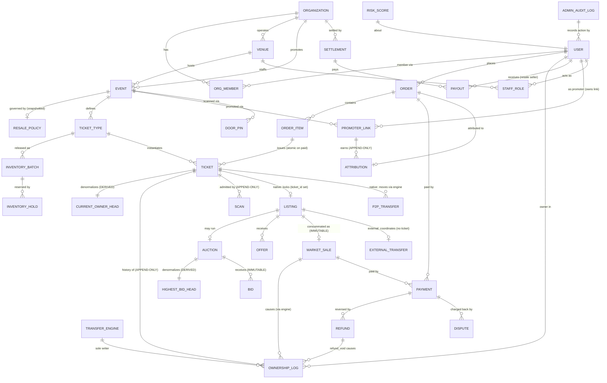
```mermaid
erDiagram
    %% ---- core: identity ----
    USER ||--o{ ORG_MEMBER : "member via"
    ORGANIZATION ||--o{ ORG_MEMBER : has
    ORGANIZATION ||--o{ VENUE : operates
    ORGANIZATION ||--o{ EVENT : promotes
    VENUE ||--o{ EVENT : hosts
    EVENT ||--o| RESALE_POLICY : "governed by (snapshotted)"

    %% ---- venue: primary issuance ----
    EVENT ||--o{ TICKET_TYPE : defines
    TICKET_TYPE ||--o{ INVENTORY_BATCH : "released as"
    INVENTORY_BATCH ||--o{ INVENTORY_HOLD : "reserved by"
    TICKET_TYPE ||--o{ TICKET : instantiates
    USER ||--o{ ORDER : places
    ORDER ||--o{ ORDER_ITEM : contains
    ORDER_ITEM ||--o{ TICKET : "issues (atomic on paid)"

    %% ---- core: the atom + its ledger and derived head ----
    TICKET ||--|| CURRENT_OWNER_HEAD : "denormalizes (DERIVED)"
    TICKET ||--o{ OWNERSHIP_LOG : "history of (APPEND-ONLY)"
    USER ||--o{ OWNERSHIP_LOG : "owner in"
    TRANSFER_ENGINE ||--o{ OWNERSHIP_LOG : "sole writer"
    TICKET ||--o{ SCAN : "admitted by (APPEND-ONLY)"

    %% ---- market: two rails ----
    TICKET ||--o| LISTING : "native: locks (ticket_id set)"
    LISTING ||--o| AUCTION : "may run"
    AUCTION ||--|| HIGHEST_BID_HEAD : "denormalizes (DERIVED)"
    AUCTION ||--o{ BID : "receives (IMMUTABLE)"
    LISTING ||--o{ OFFER : "receives"
    LISTING ||--o| MARKET_SALE : "consummated as (IMMUTABLE)"
    MARKET_SALE ||--o{ OWNERSHIP_LOG : "causes (via engine)"
    LISTING ||--o| EXTERNAL_TRANSFER : "external: coordinates (no ticket)"
    TICKET ||--o{ P2P_TRANSFER : "native: moves via engine"

    %% ---- money (frozen core) ----
    ORDER ||--o{ PAYMENT : "paid by"
    MARKET_SALE ||--o{ PAYMENT : "paid by"
    PAYMENT ||--o{ REFUND : "reversed by"
    REFUND ||--o{ OWNERSHIP_LOG : "refund_void causes"
    ORGANIZATION ||--o{ SETTLEMENT : "settled by"
    SETTLEMENT ||--o{ PAYOUT : "pays"
    USER ||--o{ PAYOUT : "receives (resale seller)"
    PAYMENT ||--o{ DISPUTE : "charged back by"

    %% ---- attribution & staffing ----
    EVENT ||--o{ PROMOTER_LINK : "promoted via"
    USER ||--o{ PROMOTER_LINK : "as promoter (owns link)"
    PROMOTER_LINK ||--o{ ATTRIBUTION : "earns (APPEND-ONLY)"
    ORDER ||--o| ATTRIBUTION : "attributed to"
    VENUE ||--o{ STAFF_ROLE : staffs
    USER ||--o{ STAFF_ROLE : "acts as"
    EVENT ||--o{ DOOR_PIN : "scanned via"

    %% ---- governance ----
    RISK_SCORE ||--|| USER : "about"
    ADMIN_AUDIT_LOG ||--o{ USER : "records action by"
```

Key deltas from audit §3.6.1: (1) derived heads (`CURRENT_OWNER_HEAD`, `HIGHEST_BID_HEAD`) drawn as explicit `||--||` denormalizations of their ledgers; (2) `TRANSFER_ENGINE` shown as the *sole writer* of `OWNERSHIP_LOG`, with `MARKET_SALE`, `P2P_TRANSFER`, and `REFUND` routing *through* it rather than writing ownership directly; (3) the two rails made visible — `LISTING→TICKET` (native, locks) vs. `LISTING→EXTERNAL_TRANSFER` (external, no ticket); (4) `RESALE_POLICY` marked snapshotted-onto-listing; (5) `ATTRIBUTION` linked to `ORDER` as the append-only earning record.

### The ~15 most important DB-enforced invariants, ranked by blast radius

Ranked by what breaks if the invariant fails — money loss and double-spend at the top, cosmetic drift at the bottom.

| # | Invariant | Enforcement concept | Class of bug it kills |
|---|---|---|---|
| 1 | **Ownership head = ownership_log tail; head writable only by the engine** | single-writer `transfer_ticket_ownership()` + verify trigger + `FOR UPDATE` | Double-ownership; silent ticket theft; unauditable "who owned X at T" |
| 2 | **No ownership change while `resale_state='listed'`** | engine precondition check | Double-sell (transfer + resell the same ticket) |
| 3 | **Exactly one succeeded payment per listing; buy-now validates `current_bid` in the same fn** | partial-unique + in-transaction price check | Double-charge; Buy-Now voiding higher bids (audit-confirmed fairness bug) |
| 4 | **`remaining ≥ 0` on the locked authoritative counter; the capacity identity is reconciliation (C4/C27)** | counter mutation only inside issuance/hold fns under lock; reconciliation job asserts counter↔movement-ledger equality | Oversell (more admissions than seats) |
| 5 | **One admitted scan per ticket; offline first-admit-wins** | partial-unique on admitted scans + reconciliation arbitration | Ticket cloning / duplicate entry at the door |
| 6 | **Money never determines ownership; transfer is in-tx with money or a swept two-phase state** | engine + cron sweep of `paid_pending_transfer`; no implicit gap | Paid-but-not-received / received-but-not-paid divergence |
| 7 | **Ledgers are append-only; heads are recomputable** | INSERT-only privileges; no UPDATE/DELETE grant on log tables | Tampered history; irrecoverable state after incident |
| 8 | **Cross-schema writes to `core` only via SECURITY DEFINER fns gated by `request_is_service_role()`** | schema GRANTs + `SECURITY DEFINER` + service-role gate | Privilege escalation; client bypassing invariants with raw DML |
| 9 | **Financial tables are RLS deny-all (service-role only)** | RLS enabled, zero policy on payments/refunds/payouts/disputes/webhooks | Money-row exfiltration or client-side mutation |
| 10 | **Bids are immutable and trigger-validated (increment, reserve, anti-snipe, monotonic)** | insert-only + `validate_and_apply_bid` trigger | Retroactive bid edits; sub-increment/below-reserve bids; sniping |
| 11 | **Native listing must reference a ticket the seller currently owns; external listing has `ticket_id` NULL** | inventory_kind discriminator + ownership check at list time | Selling a ticket you don't own; blurring the two rails |
| 12 | **Resale eligibility = f(current_owner, resale_policy snapshot)**; policy snapshotted at list time | derived at list, snapshot stored on listing | Bypassing venue resale-off / price-cap / royalty rules; policy-drift disputes |
| 13 | **Refund voids downstream tickets and unwinds open listings (`refund_void` in ownership log)** | refund engine cascade + ownership-log cause | "Refunded but ticket still valid / still listed" |
| 14 | **Every privileged/admin action writes `admin_audit_log`** | write-in-same-tx as the privileged fn | Untraceable force-cancel/refund/delist; no accountability |
| 15 | **Inventory hold has a server-enforced max duration** | duration clamp inside hold fn + expiry sweep | Indefinite inventory locking (audit-confirmed unbounded-reservation hole) |

---

## CHALLENGE to the canonical core

One substantive challenge, one clarification request.

- **CHALLENGE — Invariant 2 ("ownership changes only through the transfer engine, in the same transaction as the money event") is not always literally satisfiable for the *external* rail, and the core should say so.** External-rail sales move no `core.tickets` row at all (the system asserts no ownership), yet money *does* move. So "money movement links to the business object that caused it" holds, but "ownership changes only through the transfer engine in the same tx as money" is vacuously true for external (no ownership to change) and could be misread as requiring a transfer-engine call the external flow never makes. Recommend the core explicitly scope Invariant 3's same-transaction clause to the **native rail**, and state that the external rail's money-without-ownership is the *intended* asymmetry, not a violation.

- **Clarification the head-consistency model needs — the `market_sales.paid_pending_transfer` two-phase gap.** Canonical Core §3 and audit §3.6.3 allow ownership to lag the money event via a cron-swept two-phase state. During that window the buyer has paid but is *not yet* current_owner. The design must pin: (a) the ticket is `resale_state='locked'` (not `listed`, not freely `none`) for the whole window so nothing else can grab it; (b) the sweep is idempotent and re-entrant (Phase-0 webhook-lease discipline) so a crashed sweep cannot double-transfer; (c) a max age on the pending state that escalates to alarms, since a stuck `paid_pending_transfer` is a paid-but-not-delivered incident. I have designed to these assumptions; **they are now ratified into the core:** A6 (bounded, locked, swept, alarmed), C25 (at the hard max-age the window **auto-compensates** — refund + unlock — rather than only alarming), and C43 (the p2p `locked` overlay carries the same hard-expiry auto-unlock discipline).


---

# §3 — Bounded Contexts, Business Events & Architectural Principles

# Snatch It — Domain Architecture: Boundaries, Events & Constitution

*Sections authored against `CANONICAL_CORE.md` and audit §3.2–3.6 (the modular-monolith-on-schemas decision). This section does not restate the canonical object catalog; it defines the boundaries between contexts, the events that cross them, and the durable principles that govern all of it. Design only — no SQL, no code.*

---

## PART 5 — Bounded Contexts

### 5.0 Framing: schemas are contexts, contexts are future services

The audit's chosen architecture (Option 2, §3.5) makes each Postgres **schema** a domain module. This section elevates that from a storage decision to a **Domain-Driven Design decision**: each schema is a *bounded context* — a self-consistent model with its own language, its own invariants, and a hard, reviewable boundary. Today they share one Postgres transaction domain; every boundary is drawn so that it can later become a network boundary *without a semantic rewrite*. That is the whole point of drawing them now, before load forces the question.

Two rules govern every boundary, and everything below is an elaboration of them:

- **Writes cross a boundary only through a published function** owned by the context that owns the data (today: a `core` SECURITY DEFINER function; tomorrow: that same function fronted by an RPC/API). Never direct DML.
- **Reads cross a boundary only through a published, versioned view** (the read contract), never by reaching into another context's base tables.

Everything a context exposes — its write functions and its read views — is its **published language**. Everything else is private and may change without notice. This is the anti-corruption discipline that makes extraction a swap of transport, not a re-modeling.

### 5.1 The five contexts at a glance

| Context (schema) | Responsibility (one line) | Trust domain | Latency class | Extraction priority |
|---|---|---|---|---|
| **core** | Identity, the money primitives, and the **ticket as single source of truth**. The kernel every other context depends on. | Mixed (identity + money); most-privileged | Hot on the ownership path; otherwise mixed | **Last** — the kernel; extracting it means extracting everyone |
| **venue** | Primary-ticketing operations: inventory, orders, staff, doors, settlement, promoters. | Venue-staff privilege world | Hot on scan + checkout | Medium — `scan` sub-module extracts first (regional door service) |
| **market** | The two-rail marketplace: listings, auctions, bids, offers, sales, transfers, disputes. The existing, frozen money machine lives here + core. | Consumer privilege world | Hot on bid placement | Medium |
| **social** | Follows, venue pages, groups, friend-attendance, referrals. (Later.) | Consumer, low-trust | Cold | **First** — cleanest cut, no money, no ownership |
| **analytics** | Append-only behavioural stream + venue-scoped rollups. Read-only to everyone. | Read-only, venue-scoped | Cold (seconds-to-minutes) | Early — read replica, then own store |

### 5.2 Context definitions

#### 5.2.1 `core` — the kernel (identity + money + the ticket)

**Responsibility.** Own the three things no other context is permitted to own: *who someone is* (identity), *the movement of money* (payments/payouts/refunds), and *the ticket and its custody* (`tickets`, `ticket_ownership_log`). `core` is the only context that may assert that a ticket exists and who owns it. It is the **only writer of ownership** in the entire platform.

**Objects it owns.** users/profiles, organizations, org_members, venues, events, `tickets`, `ticket_ownership_log`, payouts, refunds, payments (the frozen Stripe records), webhook_events, platform_config, roles (platform-admin allowlist), admin_audit_log, notifications, push_tokens, reports, risk_scores. *(Per canonical §1; venues and events live in `core` because they anchor the cross-context graph — both venue ops and marketplace discovery reference them, and neither may own them.)*

**What it is allowed to KNOW about other contexts.** *Almost nothing.* `core` knows the **cause vocabulary** — the finite, canonical cause-code registry (D3: this is THE one list, verbatim identical to Canonical Data Model §11; no other cause list exists): `issue · primary_sale · comp · door_sale · p2p_transfer · market_sale · auction_sale · admin_action · refund_void · import · promoter_commission · settlement · chargeback` — and a **`cause_ref`** (an opaque id of the originating object). `core` never dereferences a `cause_ref`; it stores it as an audit pointer. It does not know what a "listing" or an "auction" is; it knows only that *some* market object caused a transfer and recorded its id. This is deliberate: the kernel must not depend on the leaves.

**What it must NEVER depend on.** `core` must never read from, join to, or import a type from `venue`, `market`, `social`, or `analytics`. A foreign key from `core.tickets` to `market.listings` would be an inversion of the dependency graph and is prohibited. If `core` appears to "need" a marketplace concept, the concept belongs on the boundary (as a cause code), not inside the kernel.

**The FROZEN money core lives here.** Integer-cents math, deterministic Stripe idempotency keys, webhook signature+replay+claim-lease, payout idempotency, SECURITY DEFINER financial transitions, `FOR UPDATE` locks, constant-time secret compare, deferred payouts, fail-closed rate limiting — all of it (canonical §0). Phase 2 is **additive**: new contexts call *into* this frozen core through its published functions; they never modify it, never add columns to its tables to suit themselves, and never open a second write path to money. (See §5.6 for exactly how.)

#### 5.2.2 `venue` — primary-ticketing operations

**Responsibility.** Everything a venue does to sell and honour admission: define sellable inventory, hold and reserve it, take primary orders, staff the door, scan tickets, settle the money, and run the promoter/affiliate engine.

**Objects it owns.** ticket_types, inventory_batches, inventory_holds, orders, order_items, staff_roles, door_pins, scans, scan_devices, settlements, resale_policies, guest_lists, comp_allocations, promoters, promoter_links, attributions, affiliates.

**What it is allowed to KNOW about `core`.** It reads canonical `events`, `venues`, `organizations`, and user identity through core's read views. It knows a `ticket` exists and may read its **state and current owner** through a core view — but it treats that as *core's fact*, not its own. To bring a ticket into being, it **calls `core.issue_tickets(order_item, …)`**; it never inserts a `core.tickets` row. To scan, it reads the credential-verification contract core exposes and records the *scan attempt* in `venue.scans` — the scan does not mutate the ticket except through core's `mark_scanned` transition.

**What it must NEVER do.** `venue` must **never DML `core.tickets` or `core.ticket_ownership_log` directly.** Settlement (`venue.settlements`) computes money owed and *requests* payouts via `core.request_payout`; it **never modifies ticket history** and never writes `core.payouts` rows itself. `venue` must not read `market`'s private tables — if a native ticket is listed, `venue` learns this only via the `resale_state` flag on core's ticket view, never by joining to `market.listings`.

**Anti-corruption seam.** `venue` is the largest context and the one most likely to extract in pieces. The `scan` sub-module (`scans`, `scan_devices`, `door_pins`, offline manifest) is deliberately built against a **narrow credential-verification contract** from core (verify `owner + credential_version + state=active`) so it can become an offline-first regional service that syncs scan results back — the audit's stated first extraction candidate.

#### 5.2.3 `market` — the two-rail marketplace

**Responsibility.** Price discovery and resale. Own listings, auctions, bids, offers, sales, and the two transfer flows. This context holds the *existing, frozen* marketplace money machinery and must keep behaving exactly as it does today for external tickets.

**Objects it owns.** listings, auctions, bids, offers, market_sales, transfers (external only), p2p_transfers (native), disputes, seller-onboarding state.

**The two rails, restated as a boundary rule (canonical §4).**
- **External rail:** `inventory_kind='external'`, `ticket_id` NULL. `market` owns the *entire* lifecycle — proof, off-platform coordination, evidence window, disputes. It **asserts no ownership** because there is no `core.tickets` row. `core` does not know these claims exist.
- **Native rail:** `inventory_kind='native'`, `ticket_id` set. `market` owns the *trade* (list → bid/offer → sold) but **delegates the settlement of ownership to `core`**. On sale it calls `core.transfer_ticket_ownership(ticket, buyer, cause='market_sale', cause_ref=market_sale.id)` — and the kernel does not take the buyer on faith: it **authorizes the buyer principal itself at this seam (C35)**, deriving the buyer from the authenticated context and re-verifying it against the payment, never trusting a market-supplied id. The credential invalidates automatically because it derives from ticket identity + owner + `credential_version` — `market` does not "deliver" anything; **the credential IS the delivery.**

**What it is allowed to KNOW about `core`.** It reads user identity, canonical `events` (to attach a listing), and — for native listings — a ticket's `state`/`resale_state`/`current_owner` through core's view (to verify the seller actually owns what they're listing). It writes ownership **only** through core's transfer function.

**What it must NEVER do.** `market` must **never invent a ticket** — it cannot insert `core.tickets`; only primary issuance (`venue` → `core.issue_tickets`) mints admission credentials. `market` must never DML `core.tickets`/`ownership_log`. It must never read `venue`'s private inventory tables; the **resale policy in force** reaches `market` only as a `resale_policy_snapshot` captured at listing time (a value copied across the boundary, not a live join into `venue.resale_policies`).

**Anti-corruption seam.** The **auction** is extracted into its own entity (not listing columns) precisely so the bidding engine — the one genuinely latency-sensitive, high-contention component — can later run as its own service with its own store, emitting a single `AuctionWon` event that the rest of the system consumes. `market_sales` is the durable, append-only fact that survives any such extraction.

#### 5.2.4 `social` — the community graph (later)

**Responsibility.** Follows, venue followers, groups, feed, friend-attendance, referrals. Pure engagement; touches no money and no ownership.

**What it may KNOW.** Reads public identity, public `venues`, public `events`, and *derived, permissioned* attendance facts (e.g. "this friend has an active ticket to this event") exposed as a **core/venue read view with its own privacy rules** — never by joining to `core.tickets`. Referrals that pay out do so by **emitting a `ReferralCompleted` event** that `venue`/`core` consume to issue a credit; `social` never writes money.

**What it must NEVER do.** Never read a ticket's owner directly; never write any ownership, money, or inventory. `social` is the **first extraction candidate** exactly because it has no invariant to protect — a clean, safe cut.

#### 5.2.5 `analytics` — read-only behavioural stream

**Responsibility.** An append-only `events_stream` plus rollup materialized views. Consumes the business events of §6 and instrumentation; produces venue-scoped aggregates.

**What it may KNOW.** It may reference ids from any context (as opaque keys) but stores **no PII beyond user ids** and exposes only **venue-scoped aggregate views**. It is a *pure consumer*: nothing in the platform reads back from `analytics` on a transactional path, so a slow or absent analytics store can never affect a sale, a scan, or a transfer.

**What it must NEVER do.** Never be written synchronously on a hot path; never be a source of truth for anything (a rollup disagreeing with `core` means the rollup is wrong); never be in the transaction of a payment, transfer, or scan.

### 5.3 Dependency rules (precise)

| Rule | Statement |
|---|---|
| **R1 — one writer of ownership** | `core.tickets` and `core.ticket_ownership_log` are mutated by exactly one family of `core` functions (`issue_tickets`, `transfer_ticket_ownership`, `void_ticket`, `mark_scanned`). Direct DML is REVOKEd from every other role. |
| **R2 — who may issue** | Only `venue` (primary sale / comp / door sale) and admin (`core.roles`) may call `core.issue_tickets`. `market` may **never** issue. |
| **R3 — who may transfer** | `market` (native sale, p2p) and admin may call `core.transfer_ticket_ownership`. `venue` transfers only via the same function (e.g. reissue at door). Nobody writes the head column directly. |
| **R4 — read boundary** | Cross-context reads go through published views only (`core.v_ticket_state`, `core.v_identity`, `core.v_event`, `venue.v_attendance`). Ad-hoc cross-schema joins in application queries are a review/lint failure. |
| **R5 — no upward FKs** | No foreign key may point from `core` into any other schema. Dependencies point **toward** the kernel, never away from it. |
| **R6 — value-copy at boundaries** | Policy and pricing facts that another context needs are **snapshotted** at the moment of the decision (e.g. `resale_policy_snapshot`, `face_value_cents` on the ticket), never live-joined across the boundary. |
| **R7 — money single-path** | `core.payouts`/`refunds`/`payments` are written only by `core` money functions. `venue.settlements` and `market.market_sales` *request*; they never write money rows. |
| **R8 — scan isolation** | The scan-validation path has its own edge-function group and DB role with a minimal GRANT surface, so door traffic cannot be affected by (or affect) marketplace permissions. |

### 5.4 Context map (allowed dependencies only)

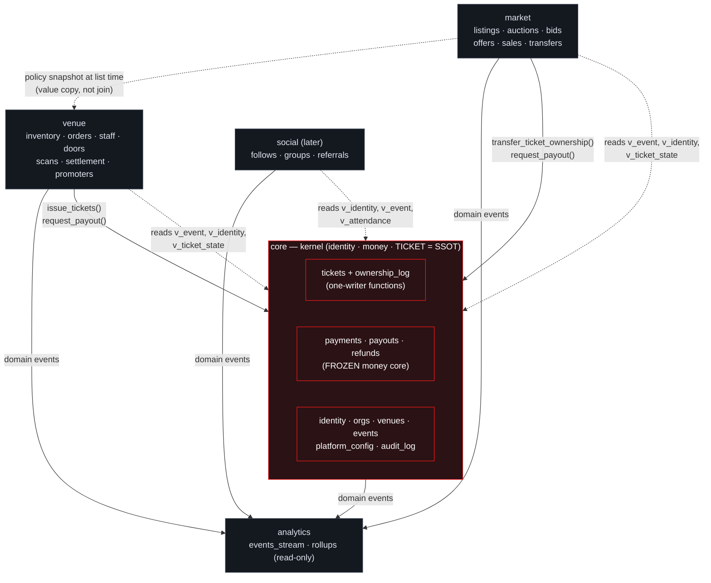
```mermaid
flowchart TB
    subgraph KERNEL["core — kernel (identity · money · TICKET = SSOT)"]
        C1["tickets + ownership_log<br/>(one-writer functions)"]
        C2["payments · payouts · refunds<br/>(FROZEN money core)"]
        C3["identity · orgs · venues · events<br/>platform_config · audit_log"]
    end

    VEN["venue<br/>inventory · orders · staff · doors<br/>scans · settlement · promoters"]
    MKT["market<br/>listings · auctions · bids<br/>offers · sales · transfers"]
    SOC["social (later)<br/>follows · groups · referrals"]
    ANA["analytics<br/>events_stream · rollups (read-only)"]

    %% Write dependencies (call core's published functions)
    VEN -->|"issue_tickets()<br/>request_payout()"| KERNEL
    MKT -->|"transfer_ticket_ownership()<br/>request_payout()"| KERNEL

    %% Read dependencies (published views only)
    VEN -.->|"reads v_event, v_identity,<br/>v_ticket_state"| KERNEL
    MKT -.->|"reads v_event, v_identity,<br/>v_ticket_state"| KERNEL
    SOC -.->|"reads v_identity, v_event,<br/>v_attendance"| KERNEL
    MKT -.->|"policy snapshot at list time<br/>(value copy, not join)"| VEN

    %% Analytics is a pure consumer of events
    KERNEL -->|domain events| ANA
    VEN -->|domain events| ANA
    MKT -->|domain events| ANA
    SOC -->|domain events| ANA

    classDef kernel fill:#2a1215,stroke:#ff1a1a,color:#fff;
    classDef ctx fill:#14181f,stroke:#3a4658,color:#dfe6ef;
    class KERNEL,C1,C2,C3 kernel;
    class VEN,MKT,SOC,ANA ctx;
```

*Solid arrows = write dependencies (calls into a published function). Dashed arrows = read dependencies (published views / value snapshots). Every arrow points toward the kernel or toward analytics; there are **no arrows out of `core`** except the event stream, and **no arrows between `venue`↔`market` except the one policy value-copy**. The absence of a `venue`↔`market` write edge is the design: they coordinate only through `core` (ownership) and through events (§6).*

### 5.5 Anti-corruption seams (what makes each context extractable)

| Context | The seam that makes it a future service | What crosses it |
|---|---|---|
| **core** | Its published function + view surface **is** the API. Extracting core means fronting `issue_tickets` / `transfer_ticket_ownership` / `request_payout` and the `v_*` views with an RPC layer; callers change transport, not logic. | Function calls in; views + events out. |
| **venue → scan** | The offline door module reads only a **signed credential manifest** (ticket ids + verification keys + revocation list) and emits scan results. No live DB dependency during a shift. | Manifest download; scan-result upload/reconcile. |
| **market → auction** | The auction engine depends only on `market_sales` (fact) and core's transfer function. Extract it and it emits `AuctionWon`; nothing joins into its live bid table. | Bid stream in; `AuctionWon` event + `market_sale` fact out. |
| **social** | No invariant to protect; depends only on public read views and emits/consumes events. Safe first cut. | Read views + events. |
| **analytics** | Pure consumer; already logically separate. Extract to a read replica, then its own store. | Event stream in; aggregate views out. |

### 5.6 How new contexts touch the frozen money core WITHOUT modifying it

The frozen core is preserved by making every interaction **additive and inward**:

1. **Call, don't touch.** New contexts call existing `core` functions (`issue_tickets`, `transfer_ticket_ownership`, `request_payout`, `record_refund`). They pass a `cause` + `cause_ref`; the frozen functions are unchanged.
2. **Extend by wrapper, not by edit.** Where a new capability needs orchestration (e.g. native-resale settlement), it is a **new** `core` function that *composes* the frozen primitives in one transaction — it does not alter them. The frozen bodies (Stripe idempotency, claim-lease, constant-time compare) are never reopened.
3. **New money reasons are enum additions, not path changes.** The `promoter_commission` and `settlement` causes (drawn from the canonical cause registry, D3/§5.2.1) and the `venue_royalty` settlement-line/payout type flow through the *same* single payout path — additive to the vocabulary, identical in mechanism (R7).
4. **The ticket is the join point, not a new coupling.** Because ownership is a logged state machine in `core`, `venue` and `market` attach to money *through the ticket's cause_ref*, never by writing money rows. The frozen core keeps its single write path; the new contexts are just new *callers* with new *reasons*.

> **Net:** every Phase-2 context is a **caller and a reader** of the kernel. None is a co-author of money or ownership. That is what "additive, not destructive" means at the boundary level.

---

## PART 6 — Business Event Model

### 6.0 Why events, and why *carefully*, now

Event-driven architecture is the natural end-state for a system with five contexts — but adopting a broker today would be premature (audit §3.4: distributed infrastructure this team cannot yet operate). The move that gets the *benefit* without the *tax* is to **name the domain events now** and route them through the mechanism the modular monolith already affords, so that the *semantics* are stable even though the *transport* is humble. Two transport tiers, chosen per event:

- **Transactional (same-tx, in-process).** The event's effect must commit or roll back **with** the state change that produced it. Implemented today as a function call inside the same Postgres transaction (the "event" is a synchronous consequence). These are the invariant-bearing events: ownership, money, credential validity. They are *not* eventually consistent — ever.
- **Eventual (outbox → async).** The event records a fact others *react* to (notify, roll up, attribute, re-rank). Implemented today by writing an **outbox row in the same transaction** as the state change, then draining it via the existing 2-minute `pg_cron` heartbeat into in-process handlers (notifications, analytics, social). The outbox guarantees *at-least-once* delivery without a broker; consumers are **idempotent** on the event's idempotency key. When real load arrives, the drainer's target swaps from in-process handlers to a real bus (SNS/Kafka/PGMQ) — **the event catalog and idempotency keys do not change.** That stability is the entire reason to define them now.

**The rule that keeps this from over-engineering:** an event is **transactional only if a money or ownership invariant depends on it**; everything else is eventual via the outbox. Do not build a broker, do not build sagas, do not make analytics synchronous. Build one outbox table and drain it on the heartbeat that already runs.

### 6.1 Canonical business-event catalog

*Payloads are conceptual (the facts a consumer needs), not schemas. "Sync" = transactional/same-tx; "Async" = outbox/eventual. Idempotency key is what a consumer dedupes on (and what a future bus would use as message key).*

| # | Event | Producing context | Payload (conceptual) | Consuming contexts | Sync / Async | Idempotency key |
|---|---|---|---|---|---|---|
| 1 | **OrganizationCreated** | core | org id, legal+display name, connect status | analytics, (social) | Async | `org_id` |
| 2 | **ConnectOnboardingCompleted** | core | org/user id, connect id, capability flags | venue, market, analytics | Async | `connect_account_id + capabilities_hash` |
| 3 | **VenueApproved** | core | venue id, org id, geo, capacity | venue, social, analytics | Async | `venue_id` (state=approved) |
| 4 | **EventPublished** | core | event id, venue, org, schedule, visibility | venue, market, social, analytics | Async | `event_id + version` |
| 5 | **TicketTypeOpened / TierUnlocked** | venue | ticket_type id, tier rank, price, capacity | market (eligibility), analytics | Async | `ticket_type_id + tier_rank` |
| 6 | **InventoryHeldExpired** | venue | hold id, batch id, qty released | venue (counters), analytics | Async | `hold_id` |
| 7 | **OrderPlaced (pending)** | venue | order id, buyer, items, totals, promoter_link | core (payment intent), analytics | **Sync** (order+intent same tx) | `order_id` |
| 8 | **PaymentAuthorized** | core | payment id, order/sale ref, amount, PI id | venue/market (the causer) | **Sync** on native paths; webhook-idempotent | `stripe_payment_intent_id` |
| 9 | **PaymentCaptured** | core | payment id, ref, amount captured | venue, market, analytics | **Sync** with issuance/transfer | `stripe_payment_intent_id + 'captured'` |
| 10 | **TicketIssued** | core | ticket id, event, type, owner, order_item, serial | venue, market (eligibility), social, analytics | **Sync** (same tx as capture on primary) | `order_item_id + serial_no` |
| 11 | **TicketReserved** | venue | ticket_type, hold id, buyer, expires_at | venue, analytics | Async | `hold_id` |
| 12 | **ListingCreated** | market | listing id, kind(ext/native), ticket_id?, event, policy snapshot | core (lock, native only), analytics, social | **Sync** for native (locks ticket); Async ext | `listing_id` |
| 13 | **BidPlaced** | market | bid id, auction, bidder, amount, auth_intent? | market (engine), analytics | **Sync** (trigger-validated under lock) | `bid_id` |
| 14 | **OfferMade / OfferAccepted** | market | offer id, listing, buyer, amount, state | market, core (on accept), analytics | Sync on accept | `offer_id + state` |
| 15 | **AuctionWon** | market | auction, listing, winner, price, market_sale id | core (transfer+payout), analytics | **Sync** with settlement tx | `market_sale_id` |
| 16 | **ListingSold (buy-now)** | market | listing, buyer, price, market_sale id | core (transfer+payout), analytics | **Sync** | `market_sale_id` |
| 17 | **OwnershipTransferred** | **core** | ticket id, from, to, cause, cause_ref, new credential_version | venue (credentials), market, social, analytics | **Sync** (the transfer itself) | `ownership_log_id` |
| 18 | **TransferStarted (p2p / external)** | market | transfer id, ticket/claim, sender, recipient, expiry | core (native lock), notifications, analytics | Sync (native lock); Async notify | `transfer_id` |
| 19 | **TransferAccepted** | market | transfer id, recipient | core (transfer_ownership), analytics | **Sync** (native → ownership) | `transfer_id + 'accepted'` |
| 20 | **TransferExpired** | market (cron) | transfer id, reason | core (unlock), notifications | Async (swept by cron) | `transfer_id + 'expired'` |
| 21 | **CredentialInvalidated** | core | ticket id, old/new credential_version | venue (scan manifests), analytics | **Sync** (rides on OwnershipTransferred) | `ticket_id + credential_version` |
| 22 | **ScanAdmitted** | venue | scan id, ticket, device, gate, offline_batch? | core (mark_scanned), analytics, risk | **Sync** online; **outbox-reconciled** offline | `ticket_id` (partial-unique on admitted) |
| 23 | **ScanRejected** | venue | scan id, ticket, reason(dup/void/wrong_gate) | risk, analytics | Async | `scan_id` |
| 24 | **SettlementClosed** | venue | settlement id, event/period, net breakdown | core (payout generation), analytics | Sync (close→request payouts, same tx) | `settlement_id` |
| 25 | **PayoutReleased** | core | payout id, payee, amount, schedule, method | venue, market, notifications, analytics | Async (deferred by design) | `payout_id` |
| 26 | **PayoutFailed** | core | payout id, payee, failure reason | venue/market, notifications, risk | Async | `payout_id + attempt` |
| 27 | **RefundIssued** | core | refund id, payment ref, amount, reason, partial? | venue/market, notifications, risk, analytics | **Sync** with ticket void (if full) | `stripe_refund_id` |
| 28 | **TicketVoided** | core | ticket id, cause(refund/admin), ownership_log `refund_void` | venue (manifests), market (delist), analytics | **Sync** with refund | `ticket_id + cause_ref` |
| 29 | **DisputeOpened (chargeback)** | market | dispute id, payment, amount, evidence window | core (freeze payout), risk, notifications | **Sync** freeze; Async notify | `stripe_dispute_id` |
| 30 | **DisputeResolved** | market | dispute id, outcome(won/lost) | core (release/settle), risk, analytics | Sync on money effect | `stripe_dispute_id + outcome` |
| 31 | **AttributionRecorded** | venue | attribution id, promoter_link, order, commission | core (commission payout), analytics | Sync (same tx as OrderPaid) | `order_id + promoter_link_id` |
| 32 | **PromoterCommissionAccrued** | core | payout id (type=commission), promoter, amount | venue, notifications, analytics | Async | `attribution_id` |
| 33 | **FriendJoinedEvent** | social/venue | user, event, friend visibility scope | social (feed), notifications | Async | `user_id + event_id` |
| 34 | **ReferralCompleted** | social | referral id, referrer, referee, qualifying action | venue/core (credit), analytics | Async | `referral_id` |
| 35 | **RiskFlagRaised** | core (risk) | subject (user/listing/order), signal, score delta | market/venue (gating), admin, notifications | Async | `subject_id + signal + window` |
| 36 | **AdminActionPerformed** | core | actor, action, target, before/after ref | analytics, (audit is the source) | Async | `admin_audit_log_id` |

### 6.2 The transactional spine (the events that must NOT be eventual)

Three lifecycles carry money-or-ownership invariants and are therefore **same-transaction** end to end. Everything else may lag.

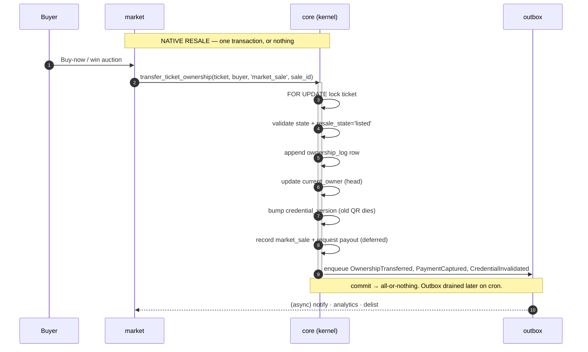
```mermaid
sequenceDiagram
    autonumber
    participant B as Buyer
    participant MKT as market
    participant CORE as core (kernel)
    participant OUT as outbox
    Note over MKT,CORE: NATIVE RESALE — one transaction, or nothing
    B->>MKT: Buy-now / win auction
    MKT->>CORE: transfer_ticket_ownership(ticket, buyer, 'market_sale', sale_id)
    activate CORE
    CORE->>CORE: FOR UPDATE lock ticket
    CORE->>CORE: validate state + resale_state='listed'
    CORE->>CORE: append ownership_log row
    CORE->>CORE: update current_owner (head)
    CORE->>CORE: bump credential_version (old QR dies)
    CORE->>CORE: record market_sale + request payout (deferred)
    CORE->>OUT: enqueue OwnershipTransferred, PaymentCaptured, CredentialInvalidated
    deactivate CORE
    Note over CORE,OUT: commit → all-or-nothing. Outbox drained later on cron.
    OUT-->>MKT: (async) notify · analytics · delist
```

**Same-tx (transactional) set:** OrderPlaced→PaymentAuthorized→PaymentCaptured→**TicketIssued** (primary); AuctionWon/ListingSold→**OwnershipTransferred**→CredentialInvalidated→market_sale→payout-request (native resale); TransferAccepted→OwnershipTransferred (native p2p); RefundIssued→TicketVoided; SettlementClosed→payout generation; DisputeOpened→payout freeze; BidPlaced (validated under row lock). **The two-phase exception** the canonical core allows: where a captured payment and an ownership transfer genuinely cannot share one transaction, the sale holds an **explicit** `paid_pending_transfer` state that the cron sweeps — a *named, observable* gap, never an implicit one (canonical §2.3 / §3.6.3).

**Eventual (outbox) set:** every notification, every analytics rollup, every social feed update, promoter-commission accrual, payout *release* (deferred by design), risk-flag propagation, transfer *expiry* (cron-swept). None of these can corrupt an invariant if delayed or replayed, because consumers are idempotent on the keys in §6.1. (Risk *propagation* is eventual, but any money/admit decision that *consults* risk reads the authoritative aggregate synchronously and fails closed — CDM C24; a lagging projection never gates money.)

**The transactional spine is the SSCAS, and it is closed (C28).** Every same-transaction multi-aggregate flow above is a named member of the **Sanctioned Synchronous Cross-Aggregate Set** (CDM C12) — a closed, enumerated set that C28 completed with the members the first enumeration missed: the **event-cancellation cascade**, **dispute-resolution reversal**, **C25 auto-compensation**, **auction deposit-release**, **group-buy claim** (A11's one legal door), and **wallet checkout** (modeled; wallet is later-phase). No new synchronous multi-aggregate flow may ship without amending the set. All members acquire row locks in the **single global lock order** — `Event/Session → Inventory (ascending batch id, then sub-counter/shard ascending) → Order → Listing → Ticket Atom (ascending id for multi-atom lots/passes) → money-plane rows (Payment / Payout / Reserve / Settlement)` — which places **every locked class** (settlement, attribution, dispute, refund, reserve/wallet, auction, inventory sub-counters included), so deadlock-freedom is provable over the whole set rather than asserted for a subset (C28). **Cross-region:** an SSCAS member is intra-region by definition; the one member with a specified cross-region future form is the native sale, whose saga/escrow variant vs. explicit intra-region-only scoping is the O6 open decision (C50) — the Miami single-region MVP builds neither.

### 6.3 Today's mechanism vs. tomorrow's — without changing the catalog

| Concern | TODAY (modular monolith) | LATER (if load pays for it) | What stays identical |
|---|---|---|---|
| Transactional events | In-process function call, same Postgres tx | Same — transactional events never leave the DB tx; a bus is for *notifications of committed facts*, not for enforcing invariants | Event names, payloads, sync classification |
| Eventual events | Outbox row (same tx) → drained by existing 2-min `pg_cron` → in-process handlers | Outbox → CDC/PGMQ/SNS → independent consumers | Idempotency keys, at-least-once contract, consumer idempotency |
| Ordering | Per-aggregate order via `cause_ref` + monotonic log ids | Partition by aggregate id (ticket/order/org) | Aggregate id as partition key |
| Failure | Outbox row unacked → retried next heartbeat | DLQ + redrive | "At-least-once + idempotent consumer," never "exactly-once" |

> **Anti-over-engineering guarantee:** the only new infrastructure Phase 2 introduces is **one outbox table and a drainer on the cron that already runs**. No broker, no queue service, no saga framework ships until real load justifies it. The catalog above is the durable artifact; the transport is replaceable underneath it.

**Outbox hardening + rebuildability floors (C48/C49 — Gate L, modeled-not-built in MVP).** The single outbox + cron drainer is acceptable for MVP and is explicitly *not* the end-state. Before scale: (a) **poison messages quarantine** instead of blocking the stream, and the drainer becomes **partitioned (per-aggregate) / multi-drainer**, so one stuck aggregate cannot head-of-line-block every consumer (C49); (b) any future **region hand-off** of an aggregate's event stream is a specified protocol, never an implicit two-phase commit (C49); (c) outbox **compaction respects a retention floor for canonical inputs** — a projection whose only inputs are ephemeral events (risk, notify, social) is either rebuildable from retained canonical inputs or explicitly **marked non-rebuildable** and excluded from the "projections are disposable" claim (C48).

---

## PART 14 — Architectural Principles (the engineering constitution)

*Durable principles, ordered kernel-outward. Each: statement · rationale · what violating it breaks. These bind every future context, migration, and feature. They are additive to — and consistent with — the Four Foundational Invariants of the canonical core, which they generalize.*

1. **The ticket is the atom.** A ticket exists iff a `core.tickets` row exists; everything else references it, never the reverse. *Rationale:* one asset, one identity, one lifecycle. *Violation breaks:* the single source of truth — two places could claim a ticket, and no query could say which is real.

2. **Single source of truth, per fact.** Every fact has exactly one authoritative home; all other appearances are derived (views, caches, rollups) and are wrong-by-definition if they disagree. *Rationale:* disagreement between stores is unresolvable without an authority. *Violation breaks:* reconciliation — you cannot answer "which number is correct?"

3. **Never duplicate ticket ownership.** Ownership lives only in `core` (`current_owner_id` as the head of `ticket_ownership_log`); no other context stores or caches an owner as truth. *Rationale:* two owner columns will drift. *Violation breaks:* the double-sell / double-admit class of bugs.

4. **Ownership changes only through the transfer engine.** `current_owner_id` is writable only by `core.transfer_ticket_ownership()`; direct DML is REVOKEd everywhere. *Rationale:* one choke point can validate, log, and invalidate credentials atomically. *Violation breaks:* auditability and credential invalidation — a raw UPDATE leaves a valid old QR alive.

5. **Ownership is a logged state machine, not a column.** Every transition appends an immutable log row in the same transaction as the head update. *Rationale:* the column is a convenience; the log is the truth. *Violation breaks:* "who owned ticket X at time T and why" — the answer to every dispute.

6. **The marketplace cannot invent tickets.** Only primary issuance (`venue` → `core.issue_tickets`) mints credentials; `market` may only trade existing ones. *Rationale:* resale is a transfer of an issued asset, not a source of assets. *Violation breaks:* supply integrity — the platform could admit more people than were sold.

7. **Payments never determine ownership.** Money movement links to the business object that caused it; ownership moves only through the transfer engine. *Rationale:* a captured charge is evidence, not custody. *Violation breaks:* the two-phase honesty — a payment succeeding would silently imply an owner nobody transferred.

8. **Money has a single write path.** `payments`/`payouts`/`refunds` are written only by `core` money functions; other contexts *request*, never write. *Rationale:* one path can carry idempotency, locking, and Stripe-key determinism. *Violation breaks:* the frozen money core's guarantees — a second path means double-pays and lost idempotency.

9. **Settlement never modifies ticket history.** `venue.settlements` reads facts and requests payouts; it touches no ticket, no ownership log. *Rationale:* accounting is downstream of custody, never upstream. *Violation breaks:* the immutability of the custody ledger — settlement bugs would corrupt admission truth.

10. **The money core is frozen; extend by wrapper, never by edit.** New capability composes the existing primitives in new `core` functions; it never reopens the frozen bodies. *Rationale:* the battle-tested code is the company's lowest-risk asset. *Violation breaks:* every reason the money machine currently works (idempotency, replay defense, constant-time compare).

11. **Additive, not destructive.** Phase 2 adds schemas, functions, enum values, and columns beside what exists; it does not rewrite or remove working machinery. *Rationale:* the working system moves real money today. *Violation breaks:* the migration's core promise — re-namespacing, not rewriting (audit §3.5).

12. **Boundaries are enforced by the database, not by discipline.** Schema GRANTs and REVOKEs are the outer wall; RLS is the inner wall; cross-schema writes go through published functions only. *Rationale:* a boundary that depends on people remembering is already broken. *Violation breaks:* Option-1 rot — silent cross-domain entanglement discovered too late.

13. **Dependencies point toward the kernel.** No FK, join, or import goes from `core` outward; contexts depend on `core`, never the reverse. *Rationale:* the kernel must be stable while leaves churn. *Violation breaks:* extractability — an outward dependency pins the kernel to a leaf's schedule.

14. **Read the boundary through views; write it through functions.** Cross-context reads use published, versioned views; cross-context writes use published functions. Ad-hoc cross-schema joins are a review failure. *Rationale:* a stable contract survives internal refactors and future extraction. *Violation breaks:* the service seam — a leaked join turns extraction into a re-modeling.

15. **Value-copy at boundaries; don't live-join across them.** Facts one context needs from another are snapshotted at decision time (policy snapshot, face value on the ticket). *Rationale:* a live cross-boundary join is a hidden coupling and a future network round-trip. *Violation breaks:* auditability of "what rule was in force then" and clean extraction.

16. **Two rails, never blurred.** External claims (`inventory_kind='external'`, no `ticket_id`) and native tickets (`native`, `ticket_id` set) are honestly distinct; the system asserts ownership only of what it issued. *Rationale:* claiming custody of an off-platform ticket is a lie the platform cannot honour. *Violation breaks:* legal and technical coherence of the legacy flow.

17. **Everything auditable, replayable — and recoverable by design, not by assertion (C47).** Every ownership change, money movement, and privileged action appends to a log from which current state is reconstructable. But **"replayable" ≠ "recoverable"**: replay is intra-database integrity; recovery from substrate loss is a *designed system* — stated RPO/RTO targets, PITR/standby, periodically-drilled restores, and snapshot-based projection-rebuild budgets (a 500M-row full-history replay blows any real RTO) — with the ledger and its derived heads never treated as one indivisible failure domain, and projection-replay distinguished from substrate DR. C47 (Gate L) is the definition of done; until it is implemented the system is not called "recoverable." *Rationale:* logs are the recovery and dispute substrate — but only a drilled restore proves it. *Violation breaks:* disaster recovery — a restore can't be certified consistent without the ledgers, and an undrilled restore is a hope, not a property.

18. **Idempotent money.** Every money operation carries a deterministic idempotency key; retries are safe by construction (Stripe keys, webhook claim-lease, payout idempotency). *Rationale:* networks and webhooks retry; charging twice is unrecoverable trust damage. *Violation breaks:* financial correctness under the ordinary condition of retries.

19. **Idempotent consumers, at-least-once delivery.** Every event consumer dedupes on the event's idempotency key; the platform guarantees at-least-once, never exactly-once. *Rationale:* exactly-once is a distributed-systems fiction; idempotent + at-least-once is achievable. *Violation breaks:* correctness the day transport moves from in-process to a bus.

20. **Transactional only where an invariant demands it.** An event is same-tx iff a money/ownership invariant depends on it; everything else is eventual via the outbox. The same-tx set is the **closed, enumerated SSCAS** (CDM C12, completed by C28) — a synchronous multi-aggregate flow that is not a named member may not ship. *Rationale:* over-synchronizing kills throughput and couples contexts; under-synchronizing corrupts invariants. *Violation breaks:* either scalability (too much sync) or integrity (too little).

21. **No implicit gaps between money and ownership.** Where the two can't share one transaction, an **explicit, observable** two-phase state (`paid_pending_transfer`) is swept by cron — never a silent window — and at its hard max-age it **auto-compensates** (refund + unlock, CDM C25), never merely alarms. *Rationale:* an unnamed gap is an invisible inconsistency; an unbounded named one is a hostage situation. *Violation breaks:* the guarantee that every paid resale has a defined, monitorable, self-terminating custody state.

22. **Fail closed.** On ambiguity, error, or exhausted rate limit, deny — no admission, no payout, no transfer. *Rationale:* in a money-and-access system, the safe default is "no." *Violation breaks:* the security posture — a fail-open scan admits fraud; a fail-open payout leaks money.

23. **Config, not constants.** Fees, windows, caps, and policy values live in `core.platform_config` / `venue.resale_policies`, never in code constants — and never duplicated between client and server. *Rationale:* the live 20%-take drift between two hard-coded constants is the cautionary tale. *Violation breaks:* client/server fee parity and the ability to tune policy without a deploy.

24. **Server-authoritative pricing and state.** The server computes prices, validates transitions, and owns state; the client proposes, never decides. *Rationale:* clients are untrusted. *Violation breaks:* every financial invariant the current codebase already protects (bid validity, fee math, transfer authority).

25. **Adapters, not special cases.** External providers (Ticketmaster/AXS/DICE/Posh/…) enter through adapters at the edge; they never shape core schemas or leak vendor concepts inward. *Rationale:* integrations must be *possible* without becoming *load-bearing* (canonical §0). *Violation breaks:* the clean domain model — vendor quirks would metastasize into the kernel.

26. **One identity, capabilities from relationships.** A single user account; being a promoter, doorman, or seller is a *relationship* (staff role, org membership, onboarding), never a `user_type` column. *Rationale:* the same person is a fan and an operator. *Violation breaks:* the promoter-is-also-a-fan graph and forces a second user table.

27. **Least privilege, per role and per path.** Each role and each hot path (esp. scan validation) gets the minimal GRANT surface it needs and no more. *Rationale:* blast radius is a design variable. *Violation breaks:* isolation — a marketplace query regression must never be able to degrade door scanning.

28. **Analytics is a consumer, never a source of truth.** Rollups are derived and disposable; nothing transactional reads back from `analytics`. *Rationale:* a rollup disagreeing with `core` means the rollup is wrong, always. *Violation breaks:* the authority hierarchy and puts a cold path in a hot transaction.

29. **The schema is the architecture diagram.** Code layout mirrors the DB layout (one owning directory per schema); the boundary is grep-able and review-enforceable. *Rationale:* a boundary you can't see, you can't defend. *Violation breaks:* onboarding and mechanical enforcement of every rule above.

30. **Every boundary is a future service seam — defer, don't foreclose.** Draw each boundary as if it will one day be a network call; extract only when real load pays for it. *Rationale:* premature microservices drown a small team (audit §3.4); foreclosed seams trap a large one. *Violation breaks:* the strategic option value that makes the modular monolith the right call *today* without being the wrong call *forever*.

---

## CHALLENGES to the canonical core

1. **`venues` and `events` placed in `core` deserve an explicit caveat, not silent acceptance.** The canonical catalog puts `venues`/`events` in `core` (they anchor the cross-context graph), yet they are conceptually *venue-context* aggregates that `core` must not depend on (Principle 13). This is coherent only if they are treated as **kernel-owned reference data written through `core` functions and read by all** — not as venue-owned tables that happen to sit in `core`. Recommend the canonical core state this explicitly, or the `core`↔`venue` boundary will be the first one violated (venue code will "just update the event row"). *Not a contradiction of the invariants — a sharpening needed to keep Principle 13 true.*

2. **"Payments never determine ownership" + the two-phase `paid_pending_transfer` state is a genuine, principled seam, but it is the one place the invariant is *relaxed in practice*.** The canonical core allows a cron-swept gap; §6.2 names it. The challenge: this gap must be **bounded and alarmed** (max dwell time, monitored count), or it silently becomes the implicit gap Invariant 3 forbids. Recommend the canonical core commit to an explicit SLO on `paid_pending_transfer` dwell, elevating it from "allowed" to "allowed, bounded, and observable."

3. **The frozen money core and "config, not constants" are in mild tension for the *existing* 20% take.** Principle 23 says move fees to config; canonical §0 freezes the money core. Fee *values* moving to `platform_config` is additive and safe, but the *fee-application code* is frozen. Recommend the canonical core clarify that Phase 2 may relocate the fee **values** to config while leaving the frozen **application** untouched — otherwise the two constants stay hard-coded forever and the drift risk the audit flagged is never actually closed.
```


---

# §4 — Identity, Permissions & Admin Plane

# Identity, Permissions & Administration

*Specialist section for SNATCH_IT_DOMAIN_ARCHITECTURE.md. Grounded in the Phase 2A Canonical Core
(§1 modular monolith, §2 four invariants, §3 object catalog) and the Security Master Audit
(Deliverables 1.6–1.10, 6, 7). Design only — prose, tables, and diagrams; no SQL, no code.*

This section designs three tightly-coupled planes and, deliberately, in this order:

- **Part 8 — Identity:** *who* and *what* exist as principals. Designed first, because permissions are
  meaningless until the subjects, resources, and the relationships between them are named precisely.
- **Part 7 — Permissions:** *what a principal may do*, derived from relationships plus roles, enforced at
  the RLS/`SECURITY DEFINER` boundary.
- **Part 12 — Admin model:** *how the platform operator intervenes* — the internal administration plane
  that replaces today's raw-SQL operations with authenticated, role-gated, dual-controlled, audited actions.

The organizing thesis, carried through all three parts:

> **One identity. Capability comes from relationships, never from a `user_type` column. Every privileged
> mutation is server-side, role-gated, and written to an append-only audit log.**

This is the direct application of Canonical Invariant 4 (*everything auditable, replayable, recoverable*)
and the object-catalog rule that *"one identity for all contexts; capabilities come from relationships,
never a user_type"* to the identity and control planes.

---

## Part 8 — Identity

### 8.1 The core principle: one identity, many contexts

Snatch It has **exactly one kind of login identity: the `core.users`/`core.profiles` person.** There is no
`user_type`, no `is_seller` boolean that grants a role, no separate "venue account" or "promoter account"
with its own credentials. A single human authenticates once and is, simultaneously and without switching
accounts, whatever their **relationships** make them.

Everything that today's ticketing platforms model as an *account type* — seller, venue staffer, promoter,
box-office clerk, doorman — Snatch It models as a **row in a relationship table** that grants a **capability
in a scope**. The person is constant; the relationships accrete around them.

This is a security decision before it is a modelling convenience. A `user_type` column is a single mutable
field an attacker (or a buggy client) can flip to escalate privilege — precisely the class of bug the audit
flagged as **H-2** (`profiles` UPDATE lets a user self-grant `is_verified_seller`). By deriving *all*
capability from separately-governed relationship rows — each with its own RLS, its own write path, its own
audit trail — there is no single flag whose mutation grants power. Privilege escalation requires forging a
*relationship* that a `SECURITY DEFINER` grant function refused to create.

### 8.2 Principal taxonomy: login identities vs. principals-acted-upon

The audit and competitor scans (Platform Audit §3.6, Deliverable 7) use "user", "organization", "venue",
"staff", "promoter", "attendee" loosely and sometimes as if each were an account. They are not. Precisely:

| Concept | What it *is* | Login identity? | How it is represented | Immutability class |
|---|---|---|---|---|
| **User** | A single authenticated human. The only credential-holding principal. | **Yes** — the only one | `core.users` + `core.profiles` | MUTABLE (identity fields IMMUTABLE) |
| **Organization** | A business entity (venue group, promoter collective, single-venue LLC) that signs up for the platform, holds the Stripe Connect account, and is the payee for primary sales. | **No** — it is *acted-for*, never *logs in* | `core.organizations` | MUTABLE |
| **Venue** | A physical place. Public, followable; anchors discovery and the event graph. Operated by an Organization. | **No** — a resource and a scope | `core.venues` (FK `organization_id`) | MUTABLE |
| **Staff Account** | *Not an account.* A **relationship**: this User has this role at this Venue/Event. | **No** — it is a User + a grant | `venue.staff_roles` | MUTABLE |
| **Promoter** | *Not an account.* A User (or Org) in a **commissioned-selling relationship** with a Venue/Event, plus their attributable links. | **No** — a relationship + links | `venue.promoters` / `promoter_links` / `attributions` | link IMMUTABLE / attribution APPEND-ONLY |
| **Attendee** | A **contextual role**, not a stored type: any User who holds a ticket to an event, or who is scanned in. "Attendee" is *"owns a `core.tickets` row for event E"*. | **No** — derived from ticket custody | derived from `core.tickets.current_owner_id` | DERIVED |
| **Door (scanner) device** | A **loginless device identity** — a physical scanning station bound to an event by a PIN, not a human. | **No** — a *device* principal, not a user | `venue.door_pins` | MUTABLE (revocable) |

The critical distinctions:

- **Users are the only login identities.** Everything else is either a principal that gets *acted for*
  (Organization, Venue) or a *relationship/role* a User carries (Staff, Promoter, Attendee) or a
  *non-human device principal* (Door PIN).
- **Organizations and Venues are principals, but not identities.** They are *acted-upon* (a Venue is
  approved, followed, scoped-to) and *acted-for* (an Org is the payee; a payout is issued *to* an Org; a
  refund debits *its* balance). No one "logs in as" an Organization — a User with an `org_member` row of
  sufficient role *acts on the Organization's behalf*, and the audit log records **both** the acting User
  and the Organization principal. This is the agency distinction: the *principal* on whose behalf an action
  is taken is separate from the *actor* who performed it.
- **"Attendee" and "Seller" are not stored roles at all** — they are *derived predicates*. A User "is a
  seller" iff they have completed marketplace seller onboarding (`market.seller_onboarding`) **and** hold a
  listable ticket; a User "is an attendee of event E" iff they are `current_owner_id` of a `core.tickets`
  row for E. Nothing is written to make someone a seller or attendee beyond the underlying facts.

### 8.3 The multi-hat person (the design's proof of correctness)

The whole model is validated by one scenario the audit's competitor scan shows every incumbent fumbles
(separate promoter portals, separate co-host logins, shared door logins):

> **Maya** buys a ticket to a Friday show as a fan. The venue she frequents asks her to sell tickets for
> next month's event on commission. That same night, short-staffed, the venue lead hands her an iPad to scan
> people in at the door.

Maya is, at the same instant, a **fan/attendee**, a **promoter**, and a **doorman** — with **one account and
one login**. In the Snatch It model this is not a special case; it is three ordinary relationship rows around
one `core.users` id:

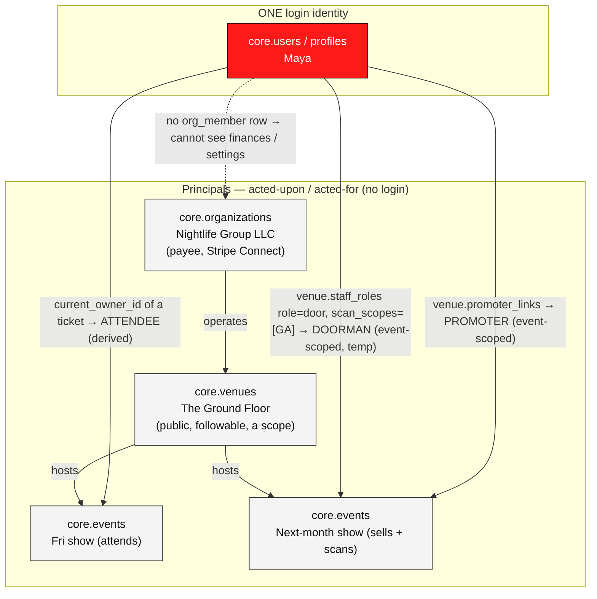
```mermaid
graph TD
    subgraph identity["ONE login identity"]
        U["core.users / profiles<br/>Maya"]
    end

    subgraph principals["Principals — acted-upon / acted-for (no login)"]
        ORG["core.organizations<br/>Nightlife Group LLC<br/>(payee, Stripe Connect)"]
        V["core.venues<br/>The Ground Floor<br/>(public, followable, a scope)"]
        E1["core.events<br/>Fri show (attends)"]
        E2["core.events<br/>Next-month show (sells + scans)"]
    end

    U -- "current_owner_id of a ticket → ATTENDEE (derived)" --> E1
    U -- "venue.promoter_links → PROMOTER (event-scoped)" --> E2
    U -- "venue.staff_roles role=door, scan_scopes=[GA] → DOORMAN (event-scoped, temp)" --> E2
    U -. "no org_member row → cannot see finances / settings" .-> ORG
    ORG -- operates --> V
    V -- hosts --> E1
    V -- hosts --> E2

    classDef id fill:#FF1A1A,color:#fff,stroke:#000;
    classDef pr fill:#f4f4f4,color:#111,stroke:#333;
    class U id;
    class ORG,V,E1,E2 pr;
```

Note what the model *prevents* for free: Maya's door role is **event-scoped and scan-scope-limited** (GA
only), so scanning it in gives her no visibility into the Org's payouts, no ability to edit ticket prices,
and no access to other events. When the event ends, the temp grant expires and every capability evaporates —
no orphaned "staff account" to deprovision. Her promoter link is a *different* relationship with a *different*
scope. Her attendance is not a grant at all. **Three hats, one head, zero account sprawl, least privilege by
construction.**

### 8.4 Loginless door PINs: a device identity, not a user

The door scanner is the one place a *non-human* principal is first-class. `venue.door_pins` (Canonical
Catalog; Platform Audit §3.6.2) are Posh-style **loginless, event-scoped, expiring, revocable** PINs, each
carrying a device label ("Main door iPad").

A door PIN is deliberately **a device identity, not a user identity**:

- **It authenticates a *station*, not a person.** Whoever holds the iPad and the PIN can scan; the trust
  boundary is physical possession of the device at the door plus the short-lived PIN, not a credentialed
  human. This matches the operational reality (staff rotate, phones get handed around) and avoids the
  incumbents' **shared-login** anti-pattern where a single human account's credentials are passed hand to
  hand (audit competitor scan: several rivals do exactly this).
- **Its capability is intentionally minimal and non-transitive.** A door PIN can do *one thing* —
  submit scans for its bound event, within its `scan_scopes` — and read nothing else. It cannot see PII
  beyond what a scan result requires, cannot list, cannot touch money. It is the narrowest principal in the
  system.
- **Scans attribute to the device, not a fake user.** `venue.scans.device` references either a
  `staff_role_id` (a human's grant) **or** a `door_pin_id`. The append-only scan ledger therefore records
  *"admitted at Main door iPad at 21:04"* honestly, without inventing a phantom user account. Attribution is
  to a real device principal.
- **It is bounded in time and revocable.** Event-scoped + expiring + revocable means a leaked PIN has a
  small blast radius (one event, scan-only) and an immediate kill switch. Contrast a leaked human staff
  login, which is broad and slow to rotate.

A door PIN is thus a **principal** (it can act — it can submit a scan) but neither a **user** (no login, no
PII, no session) nor an **identity** in the account sense. It sits in the taxonomy exactly where a physical
turnstile would: an authenticated instrument of the venue, not a member of it.

### 8.5 Organizations and Venues as principals (agency, not login)

Because Organizations and Venues never log in, every action "by" them is really an action **by a User acting
for them**, and the model must record both ends of that agency:

- **Acted-for (agency):** A payout is issued *to* an Organization; a settlement closes *for* an Organization;
  a resale royalty accrues *to* a Venue's Org. The Org/Venue is the **principal on whose behalf** value moves.
  A User with an `org_member` row of role `finance`/`owner` is the **actor** who initiates it. The audit log
  captures `(actor_user_id, on_behalf_of_org_id, action, target, before/after)` — never just the human.
- **Acted-upon (resource + scope):** A Venue is *approved* by a platform admin; *followed* by fans;
  *scoped-to* by staff roles. It is the object of admin actions and the anchor of the discovery graph, not a
  subject that initiates.

This separation is what lets the permission model (Part 7) reason cleanly: **authorization always asks
"does this *User* have a *relationship* to this *Organization/Venue/Event* that grants this *capability* in
this *scope*?"** — a question with a definite, RLS-checkable answer, rather than "is this account of the
right type?"

### 8.6 The identity/relationship model (diagram)

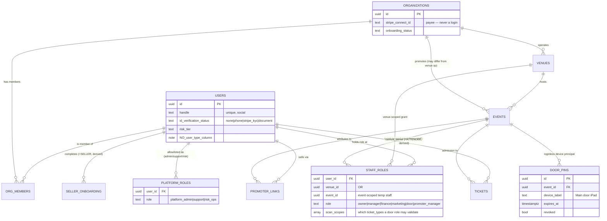
```mermaid
erDiagram
    USERS ||--o{ ORG_MEMBERS : "is member of"
    ORGANIZATIONS ||--o{ ORG_MEMBERS : "has members"
    ORGANIZATIONS ||--o{ VENUES : operates
    VENUES ||--o{ EVENTS : hosts
    ORGANIZATIONS ||--o{ EVENTS : "promotes (may differ from venue op)"
    USERS ||--o{ STAFF_ROLES : "holds role at"
    VENUES ||--o{ STAFF_ROLES : "venue-scoped grant"
    EVENTS ||--o{ STAFF_ROLES : "event-scoped grant (temp staff)"
    EVENTS ||--o{ DOOR_PINS : "loginless device principal"
    USERS ||--o{ PROMOTER_LINKS : "sells via"
    EVENTS ||--o{ PROMOTER_LINKS : "attributes to"
    USERS ||--o{ TICKETS : "current_owner (=ATTENDEE, derived)"
    EVENTS ||--o{ TICKETS : "admission to"
    USERS ||--o{ SELLER_ONBOARDING : "completes (=SELLER, derived)"
    USERS ||--o{ PLATFORM_ROLES : "allowlisted as (admin/support/risk)"

    USERS {
        uuid id PK
        text handle "unique, social"
        text id_verification_status "none|phone|stripe_kyc|document"
        text risk_tier
        note NO_user_type_column
    }
    ORGANIZATIONS {
        uuid id PK
        text stripe_connect_id "payee — never a login"
        text onboarding_status
    }
    STAFF_ROLES {
        uuid user_id FK
        uuid venue_id "OR"
        uuid event_id "event-scoped temp staff"
        text role "owner|manager|finance|marketing|door|promoter_manager"
        array scan_scopes "which ticket_types a door role may validate"
    }
    DOOR_PINS {
        uuid id PK
        uuid event_id FK
        text device_label "Main door iPad"
        timestamptz expires_at
        bool revoked
    }
    PLATFORM_ROLES {
        uuid user_id FK
        text role "platform_admin|support|risk_ops"
    }
```

Every capability in Part 7 is a traversal of exactly one of these relationship edges. **Capability is a graph
query, not a column read.**

### 8.7 Erasure and identity-merge — designed, gated systems (C34 / C38)

**Provable erasure (C34 — Gate L; specified before any erasure claim is made).** "Anonymize the PII, retain the
id" (the ledger-integrity rule) is the *shape* of erasure, not its proof. Before the platform claims GDPR/CCPA
erasure, erasure is a designed system with four mandatory parts:

- **Per-identity DEK lifecycle.** Each identity's PII is encrypted under its own data-encryption key; erasure
  destroys the key. The lifecycle explicitly covers **backups** — a backup that retains a decryptable copy
  defeats the shred, so key destruction must reach (or outlive) every backup generation.
- **PII-sink inventory + purge.** Every place PII escapes the vault is enumerated and covered: search indexes,
  notification payloads, name-on-ticket attributes, ID-verification media, and processor-side (Stripe) records.
- **Retained-graph mitigation.** The retained event/ledger graph is assessed for re-identification — a
  "shredded" identity trivially re-identifiable from its retained edges is not erased.
- **Retention reconciliation.** Erasure is reconciled with the 7-year financial-retention obligation:
  money/custody ledger *structure* is retained; PII *content* becomes unreadable.

A bare "crypto-shred solves GDPR" claim is retired; C34 is the definition of done.

**Identity merge (C38 — Gate L).** Merging two identities is a privilege- and custody-bearing operation, so:

- **Grant reconciliation is defined, not implicit.** The survivor's capability set follows explicit union rules
  per grant class (org memberships, staff roles, platform roles, seller onboarding). A merge may never
  manufacture an escalation that neither identity held; conflicting grants resolve to the **narrower**
  capability pending review (fail closed).
- **The merge trigger is dual-controlled.** Because the "same human" determination is attacker-influenceable
  (support-channel social engineering), the *decision* to merge — not only its execution — requires two
  distinct operators; execution rides the standard audited admin plane (Part 12). Merge is irreversible,
  append-only, never re-attaches erased PII, and never moves ticket custody by itself.

---

## Part 7 — Permissions / Role Hierarchy

### 7.1 The model decision: hybrid RBAC + ReBAC, keyed to the RLS reality

The audit poses the question explicitly (Deliverable 2.4 Authorization Cheat Sheet: *"prefer ABAC/ReBAC for
venue multi-tenancy"*; Platform Audit line 377 warns that flat per-policy RBAC *"becomes hundreds of policy
clauses"*). The decision:

> **Hybrid: relationship-based scoping (ReBAC) as the spine, role-based capability (RBAC) as the vocabulary,
> with a small attribute (ABAC) layer for step-up and risk.** Named-role checks answer *"what can this kind
> of grant do?"*; relationship checks answer *"does this user have that grant on THIS venue/event?"*; and
> attributes (`aal2`, risk_tier, time-boxing) gate the highest-risk actions.**

Why this specific hybrid, and not pure RBAC or pure ABAC:

| Option | Why not (alone) | What we keep from it |
|---|---|---|
| **Pure RBAC** (global roles) | A global "manager" role is meaningless — manager *of which venue?* Multi-tenancy makes the *scope* the whole point. Encoding scope into flat RLS predicates produces the "hundreds of policy clauses / drift risk" the Platform Audit already observes at smaller scale. | The **role vocabulary** — a fixed, auditable set of named capability bundles is far easier to reason about and certify than free-form permissions. |
| **Pure ABAC** (attribute rules) | Too much expressive rope: policy becomes scattered boolean logic that is hard to audit, hard to prove "deny by default", and easy to get subtly wrong on a payments platform. Over-flexible authorization *is* an audit finding. | The **attribute gates** for cross-cutting conditions — `aal2` (MFA), `risk_tier`, JIT time-boxing — layered *on top of*, never replacing, role+relationship. |
| **Pure ReBAC** (relationships only) | Relationships tell you *connection*, not *what the connection permits*. "Maya is linked to Event E" doesn't say whether she may refund or only scan. | The **scoping spine** — every check starts from *"is there a relationship row?"*, which is exactly what an RLS `EXISTS` against a `staff_roles`/`org_members` table evaluates efficiently. |

**How it lands on the modular monolith + RLS (Canonical §1):**

- **Relationship rows live where the scope lives.** Platform-level allowlist in `core.roles`
  (`platform_admin`/`support`/`risk_ops`); org membership in `core.org_members`
  (`owner`/`admin`/`finance`/`member`); venue/event grants in `venue.staff_roles`; commissioned selling in
  `venue.promoters`/`promoter_links`; marketplace seller status in `market.seller_onboarding`. Each schema
  owns its own authz surface — no cross-schema role table to drift.
- **Role labels are structurally scope-typed (C36).** The three planes use **disjoint label sets** — no label
  exists in more than one plane (physically: three separate enums with scope-prefixed labels, `org_*` /
  `venue_*` / `platform_*`, e.g. `org_finance` vs `venue_finance`) — so an org-vs-venue conflation is a *type
  error*, not a lint finding. The scope-specific helpers (`has_org_role`, `has_venue_role`,
  `is_platform_role`) are the only legal role tests; a bare `role='…'` comparison cannot even name a valid
  cross-scope role. (The role names in §7.2's catalog are display names; the stored labels are the disjoint
  scope-prefixed sets.)
- **Capability is resolved by `SECURITY DEFINER` helper functions, not inline predicates.** Following the
  audit's Deliverable 7 pattern: `has_org_role(org_id, role)`, `has_venue_role(venue_id, role)`,
  `can_scan(event_id, ticket_type_id)`, `is_platform_role(role)` — each `SECURITY DEFINER`, each pinned
  `search_path=''`, each least-privileged on EXECUTE. RLS policies call these helpers; they do **not**
  re-implement the join. This centralizes the "hundreds of clauses" into a handful of certifiable functions
  and is the standing repo policy (search_path-pinned SECURITY DEFINER, security_invoker views).
- **Read-path performance via a Custom Access Token auth hook.** Org/role/venue claims are injected into
  `app_metadata` at token mint for cheap read-side filtering — **but** high-sensitivity actions (payout, bank
  change, refund, ownership override) re-check the **live table**, never the stale JWT claim (audit
  Deliverable 1.7 / 7.1). A claim can lag a revocation by up to a token TTL; money actions cannot tolerate
  that window.
- **Deny by default, one policy per operation.** No `FOR ALL` policies; column-scoped grants prevent
  mass-assignment of `price`/`status`/`role` (audit fix for H-2/H-3). Authorization *fails closed*.

### 7.2 The full role catalog

Roles are grouped by the **plane** they act in. Scope column: `platform` / `org` / `venue` / `event`.
"Inherits" means the role is a strict superset of the named role's capabilities *within the same scope*.

#### Platform plane (Snatch It operator — governed by `core.roles` allowlist)

| Role | Scope | Can | Cannot (explicitly) | Inherits |
|---|---|---|---|---|
| **Platform Admin** | platform | Full internal admin plane: approve venues/orgs, resolve disputes/refunds (within dual-control), manage feature flags, hold/release payouts (dual-control), moderate users/content, configure `platform_config`. Every action audited. | **Cannot** unilaterally move money above threshold (needs the *second* approver — SoD); cannot change a payout *destination* **and** approve a payout to it; cannot edit or delete `admin_audit_log`; cannot bypass MFA on step-up actions. | Support, Risk Ops (read paths) |
| **Support** | platform | Read customer records for assistance; **propose** refunds/dispute resolutions; issue account messages; view (not edit) audit trail; toggle non-financial user flags per runbook. | **Cannot** approve/execute payouts, refunds above micro-threshold, or venue approvals — *propose only*; cannot view full PAN/bank/KYC docs; cannot change roles. | — |
| **Risk / Trust Ops** | platform | Review fraud/risk queues, risk scores, cluster/link-analysis; freeze/unfreeze accounts and payouts; force step-up; place holds and reserves; open investigations. | **Cannot** *release* held funds it froze (SoD — release is Admin/Finance with a second approver); cannot resolve the underlying dispute financially alone; cannot edit audit log. | Support (read) |
| **Read-only Analyst** | platform (or org) | Read `analytics` rollups and aggregate/venue-scoped reporting. | **Cannot** read raw PII, cannot see individual payment/bank details, cannot mutate anything, cannot export beyond policy. | — |

#### Organization plane (`core.org_members`) — a User acting *for* an Org

| Role | Scope | Can | Cannot (explicitly) | Inherits |
|---|---|---|---|---|
| **Organization Owner** | org | Everything within the org: manage members/roles, all venues/events, initiate finance actions (with dual-control), accept platform terms for the org, manage Stripe Connect onboarding. The org's ultimate human authority. | **Cannot** self-approve a payout **and** change the payout bank account in one act (SoD, even as owner); cannot act outside their org; cannot see platform-plane data. | Org Admin, Org Finance |
| **Org Admin** | org | Manage venues, events, ticket types, staff roles, promoters; run day-to-day operations across the org's venues. | **Cannot** view or initiate payouts/bank changes (that's Finance/Owner); cannot manage the Owner's role. | Venue Manager (all venues) |
| **Org Finance** | org | View settlements/payouts/finance across the org; initiate payout and bank-account changes **subject to dual-control + step-up**; download financial reports. | **Cannot** edit events/inventory or manage staff; cannot *both* initiate and approve the same high-value payout; cannot approve a payout to an account they just changed. | — |

#### Venue / Event plane (`venue.staff_roles`) — scoped grants

| Role | Scope | Can | Cannot (explicitly) | Inherits |
|---|---|---|---|---|
| **Venue Manager** | venue (all its events) | Build/edit events, ticket types, inventory batches, holds, comps; view venue orders and operational reporting; manage venue-scoped staff and door PINs; run box office. | **Cannot** view org-wide finances or initiate payouts; cannot change resale policy beyond delegated fields; cannot act on other venues. | Venue Staff, Door |
| **Venue Staff — Box Office** | venue or event | Sell/comp at the door, issue tickets, process in-person orders, manage guest lists, look up an order/attendee for service. | **Cannot** see aggregate finance/payouts; cannot edit prices/policy; cannot manage staff or door PINs. | Door |
| **Venue Staff — Marketing** | venue or event | Manage event public pages, media, descriptions, promo codes; view marketing analytics. | **Cannot** touch inventory pricing, orders, PII beyond aggregates, finance, or scanning. | — |
| **Door (scanner)** | **event** (+ `scan_scopes`) | Submit scans for the bound event, within allowed ticket types; see the minimal attendee-verification result (name/ticket validity), guest-list check-in. **May be a human staff grant or a loginless `door_pin`.** | **Cannot** list attendees in bulk, see contact/PII beyond scan verification, see prices/finance, or scan ticket types outside `scan_scopes`, or scan other events. | — |
| **Promoter Manager** | venue or event | Create/manage promoters and their `promoter_links`; view attribution/commission reporting for their venue/events; set commission terms within policy. | **Cannot** change ticket prices/inventory, initiate payouts (commission payouts run through settlement), or see full buyer PII. | Promoter (view own) |
| **Promoter** | **event** (via `promoter_links`) | Generate/share own tracking links; view **own** attributed sales, stats, and commission owed; sub-links where allowed. | **Cannot** see other promoters' or the venue's aggregate finances, edit inventory, access back-office, or see buyer PII beyond own attributed aggregate counts. | — |

#### Consumer & growth plane (derived predicates, not stored account types)

| Role | Scope | Can | Cannot (explicitly) | Basis |
|---|---|---|---|---|
| **Buyer** | self | Browse, buy primary tickets, buy/bid on resale, hold tickets, transfer (p2p) per policy, request refunds, dispute. The default capability of *every* user. | **Cannot** act on any other user's rows (RLS `= auth.uid()`); cannot list for resale until seller-onboarded. | every `core.users` |
| **Seller** | self | List native/external tickets, run auctions/offers, receive resale payouts. | **Cannot** self-grant seller status (H-2 fix): requires completed `market.seller_onboarding` (+ Stripe Connect/Identity KYC per risk); cannot list a ticket they don't own or that is `resale_state='locked'`. | `seller_onboarding` complete (derived) |
| **Attendee** | self / event | Present a credential (rotating QR), be scanned, receive event comms. | Not a grant — cannot be "assigned"; derives purely from `current_owner_id` of a `core.tickets` row. | ticket custody (derived) |
| **Ambassador** | self | Referral/affiliate links, view own referral stats and staged referral payouts. | **Cannot** see referred users' PII, cannot see platform/venue finances; referral rewards gated by device-fingerprint + verified-identity (anti-Sybil, audit Deliverable 6 §16). | affiliate relationship (derived) |

### 7.3 Scoping: venue-scoped vs. event-scoped, and temp door staff

Scope is a first-class field on the grant, not an afterthought (`venue.staff_roles` carries **either**
`venue_id` **or** `event_id`; Platform Audit §3.6.2):

- **Venue-scoped grant** (`venue_id` set): applies to *all current and future events* at that venue —
  appropriate for standing staff (a Venue Manager, a permanent box-office lead). Convenient, broader blast
  radius; used for trusted, long-lived relationships.
- **Event-scoped grant** (`event_id` set): applies to *one event only* and is the default for **temporary
  staff** — the freelance doorman hired for Friday, the guest promoter for one show. When the event completes,
  the grant is inert; a sweep expires it. This is how Maya (§8.3) scans one night without becoming permanent
  staff.
- **`scan_scopes` narrows door grants further** to specific ticket types (a GA doorman cannot validate VIP).
  Least privilege within least privilege.
- **Door PINs are the most ephemeral scope of all** — event-bound, expiring, revocable, device-labelled,
  loginless (§8.4). Temp door staff who shouldn't get an account at all get a PIN, not a `staff_role`.

**Rule:** prefer the *narrowest* scope that makes the person's job possible. New/untrusted/temporary → event-
scoped or PIN. Standing/trusted → venue-scoped. Org-wide operational authority is `org_member`, not a venue
role sprayed across every venue.

### 7.4 Separation of Duties (SoD)

The non-negotiable SoD constraints (audit Deliverables 1.9/1.10, 6 §15, 7.3), stated as invariants the
permission model must make *structurally impossible* to violate — not merely discourage:

1. **No single principal both changes a payout destination and approves/executes a payout to it.** The
   canonical fraud primitive is "redirect the bank account, then release funds to it." Bank-change and
   payout-approval are split across two grants (or two humans under dual-control), and a payout is *frozen for
   a cool-down after any bank change* (audit Deliverable 6 §10).
2. **No single principal both initiates and approves a high-value payout/refund.** Above a configurable
   `platform_config` threshold, initiation and approval are distinct acts by distinct principals (**dual
   control** — Part 12).
3. **Whoever freezes funds does not unilaterally release them.** Risk Ops can *hold*; releasing held funds is
   an Admin/Finance action with a second approver. Prevents a single compromised risk account from both
   trapping and exfiltrating.
4. **Propose vs. approve is a real boundary.** Support/Risk Ops *propose* refunds and resolutions; Admin/
   Finance *approve* and *execute*. The proposer and approver are never the same identity on the same item.
5. **Role management is itself SoD-governed.** Granting oneself or a confederate a powerful role is an audited
   action; role escalation above a threshold requires a second approver (audit 7.3).

### 7.5 Step-up / MFA for high-risk actions (ABAC gate)

MFA is mandatory (`aal2`) for **all staff and admin principals** and for **sellers** (audit Deliverable 1.6,
6 §10). Beyond baseline session MFA, the following actions require **fresh step-up re-authentication** (a
recent `aal2` assertion, not merely a session that once passed MFA), enforced server-side at the action
boundary against the **live** grant (never a stale JWT claim):

| High-risk action | Requirement |
|---|---|
| Change payout/bank account | Step-up (fresh `aal2`) **+ SoD** (separate from approver) **+ payout cool-down freeze** |
| Initiate/approve payout above threshold | Step-up **+ dual control** (two distinct approvers) |
| Issue refund above micro-threshold | Step-up **+ dual control** + reason code |
| Approve a venue/org (grant platform access) | Step-up + reason code + audit |
| Ownership override / manual ticket custody change | Step-up + dual control + reason code (Invariant 2 — never a raw write) |
| Resolve dispute affecting escrow | Step-up + dual control + evidence link |
| Grant/escalate a powerful role | Step-up + second approver |
| Seller: first listing / KYC-gated threshold crossing | Step-up + completed KYC (Stripe Identity) |
| Comp / guest-list issuance beyond a per-staff threshold | Step-up + C9 live-table grant re-check + reason code (C39 — comps are money-adjacent inventory; un-stepped-up bulk comping is the insider-fraud primitive) |

Attributes that additionally *raise friction dynamically* (audit Deliverable 6 §6): elevated `risk_tier`,
recent bank change, impossible-travel/device-velocity anomalies, high-value or hot-event context → forced
step-up, longer holds, or manual review even below the fixed thresholds.

### 7.6 Permission matrix — roles × key privileged actions

Legend: **✔** allowed · **✔ᴰ** allowed only under dual-control (two approvers) · **✔ᴾ** propose-only ·
**◐** scoped/limited (own or aggregate) · **✱** requires step-up (fresh `aal2`) · blank = denied.

| Privileged action | Plat Admin | Support | Risk Ops | Org Owner | Org Admin | Org Finance | Venue Mgr | Box Office | Marketing | Door | Promoter Mgr | Promoter | Seller | Buyer | Ambassador |
|---|:--:|:--:|:--:|:--:|:--:|:--:|:--:|:--:|:--:|:--:|:--:|:--:|:--:|:--:|:--:|
| Approve venue/org onboarding | ✔✱ | ✔ᴾ | | | | | | | | | | | | | |
| Configure feature flags / `platform_config` | ✔✱ | | | | | | | | | | | | | | |
| Manage platform user moderation / bans | ✔ | ✔ᴾ | ✔ | | | | | | | | | | | | |
| Freeze account / payouts (risk) | ✔ | | ✔ | | | | | | | | | | | | |
| Release held funds | ✔ᴰ✱ | | | | | ✔ᴰ✱ | | | | | | | | | |
| Initiate payout (≤ threshold) | | | | ✔✱ | | ✔✱ | | | | | | | | | |
| Initiate/approve payout (> threshold) | ✔ᴰ✱ | | | ✔ᴰ✱ | | ✔ᴰ✱ | | | | | | | | | |
| Change payout/bank account | | | | ✔✱ | | ✔✱ | | | | | | | | | |
| Issue refund (> micro) | ✔ᴰ✱ | ✔ᴾ | ✔ᴾ | ✔ᴰ✱ | | ✔ᴰ✱ | | | | | | | | ◐(own request) | |
| Resolve dispute (escrow) | ✔ᴰ✱ | ✔ᴾ | ✔ᴾ | | | | | | | | | | | | |
| Ownership override (manual custody) | ✔ᴰ✱ | | | | | | | | | | | | | | |
| Build/edit events & ticket types | | | | ✔ | ✔ | | ✔ | | ◐(pages) | | | | | | |
| Manage inventory / holds / comps | | | | ✔ | ✔ | | ✔ | ◐(door sell) | | | | | | | |
| Set/edit resale policy | ✔(platform) | | | ✔ | ✔ | | ◐(delegated) | | | | | | | | |
| Manage staff roles & door PINs | | | | ✔ | ✔ | | ◐(venue) | | | | | | | | |
| Create/manage promoter links | | | | ✔ | ✔ | | ✔ | | | | ✔ | ◐(sub-links) | | | |
| Scan / validate entry | | | | | | | ✔ | ✔ | | ✔(scoped) | | | | | |
| View buyer PII | ◐ | ◐ | ◐ | ◐ | ◐ | ◐(limited) | ◐(limited) | ◐(service) | | ◐(scan-only) | | | | (self) | |
| Create listing / run auction | | | | | | | | | | | | | ✔ | | |
| Buy / bid / hold / p2p transfer | | | | | | | | | | | | | ✔ | ✔ | |
| View org/venue finance reports | ◐ | | ◐(risk) | ✔ | | ✔ | ◐(venue ops) | | | | ◐(commission) | ◐(own) | ◐(own) | | ◐(own) |
| Referral/affiliate program | | | | | | | | | | | | | | | ✔ |

*The matrix is illustrative of the design intent; the authoritative source is the relationship rows +
`SECURITY DEFINER` helpers, re-checked live for every ✔ᴰ/✱ cell.*

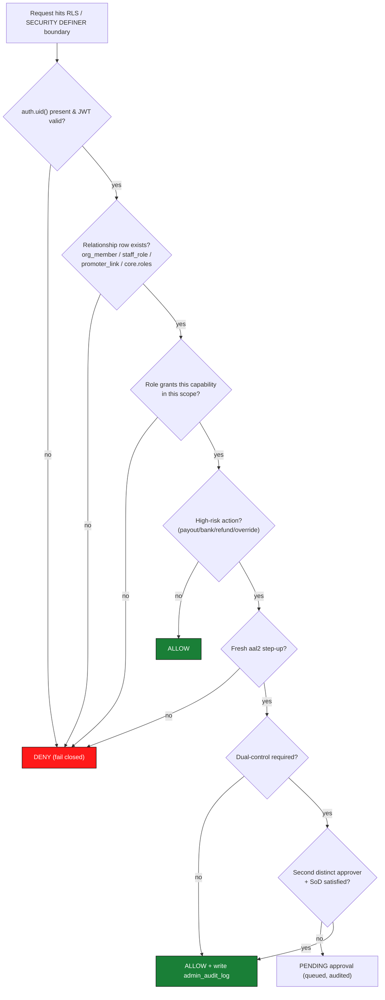
```mermaid
graph TD
    A["Request hits RLS / SECURITY DEFINER boundary"] --> B{"auth.uid() present & JWT valid?"}
    B -- no --> D1["DENY (fail closed)"]
    B -- yes --> C{"Relationship row exists?<br/>org_member / staff_role /<br/>promoter_link / core.roles"}
    C -- no --> D1
    C -- yes --> E{"Role grants this capability<br/>in this scope?"}
    E -- no --> D1
    E -- yes --> F{"High-risk action?<br/>(payout/bank/refund/override)"}
    F -- no --> G["ALLOW"]
    F -- yes --> H{"Fresh aal2 step-up?"}
    H -- no --> D1
    H -- yes --> I{"Dual-control required?"}
    I -- no --> J["ALLOW + write admin_audit_log"]
    I -- yes --> K{"Second distinct approver<br/>+ SoD satisfied?"}
    K -- no --> L["PENDING approval (queued, audited)"]
    K -- yes --> J

    classDef deny fill:#FF1A1A,color:#fff,stroke:#000;
    classDef ok fill:#1a7f37,color:#fff,stroke:#000;
    class D1 deny;
    class G,J ok;
```

---

## Part 12 — Admin Model

### 12.1 Purpose: an administration *plane*, not a SQL console

Today, privileged operations happen partly through **raw SQL run by hand against production** (Platform Audit;
audit Deliverables 1.9/1.10 name "SQL packs run manually … operational risk", and the Canonical Catalog notes
`core.roles`/`admin_audit_log` exist expressly *"replacing raw SQL-editor operations"*). That is the single
largest un-modelled risk in the operator plane: unauthenticated-by-design (a human with DB creds),
unaudited-by-default (no before/after, no reason), and unconstrained (no SoD, no threshold, no dual-control).

The admin model's founding principle:

> **Every privileged mutation is an *audited admin action*, never a manual query. Admin actions retire manual
> SQL.** If an operator needs to change production state, there is an admin function for it — authenticated,
> role-gated, server-side, reason-coded, and written to `core.admin_audit_log` — and if there isn't one yet,
> the answer is to *build the action*, not to open a SQL editor.

This is the operational expression of Canonical Invariant 4 (*everything auditable, replayable, recoverable*):
the platform state must be reconstructable from logs, which is impossible if an operator can silently
`UPDATE` a row.

### 12.2 The five gates every privileged admin mutation passes

Every admin action — no exceptions — is gated by all five:

1. **Authenticated admin identity.** A real `core.users` id with an active, MFA-satisfied (`aal2`) session on
   the IP-restricted admin plane. No shared logins, no service-role-key-as-a-person.
2. **Appropriate platform role.** The actor holds the required `core.roles` grant
   (`platform_admin`/`support`/`risk_ops`), checked **live** against the table — never inferred from a stale
   JWT claim (audit 1.7). Deny by default.
3. **Server-side execution.** The mutation runs inside a `SECURITY DEFINER` admin function
   (`search_path=''`, least-privilege EXECUTE), which performs the validation and the state change **in one
   transaction**. The client never writes the target row directly; the client *requests an action*.
4. **Audited: actor / timestamp / reason / before-after.** The function writes an append-only
   `core.admin_audit_log` row capturing `actor_user_id`, `on_behalf_of` principal (for org-scoped acts),
   `action`, `target` (schema.table + id), `reason_code` + free-text justification, **full before/after
   snapshot**, source IP, device, and correlation id. The audit write is *in the same transaction* as the
   mutation — you cannot succeed at the change and fail to log it.
5. **Constraint satisfaction (SoD / dual-control / step-up / threshold).** For high-risk actions the function
   enforces the Part 7.4/7.5 constraints structurally: it *refuses* to execute a > threshold payout without a
   distinct second approver, *refuses* a release by the same identity that froze, *refuses* a bank-change +
   payout by one actor.

```mermaid
sequenceDiagram
    participant Op as Admin operator (aal2, IP-restricted)
    participant Fn as SECURITY DEFINER admin fn
    participant Chk as Role + SoD + step-up checks
    participant Tgt as Target row (core/venue/market)
    participant Log as core.admin_audit_log (append-only)
    participant Q as Dual-control queue

    Op->>Fn: request action(target, reason_code, justification)
    Fn->>Chk: live role check + constraints
    Chk-->>Fn: OK / needs 2nd approver / DENY
    alt DENY
        Fn-->>Op: rejected (fail closed) + logged attempt
        Fn->>Log: append(actor, action, DENIED, reason)
    else needs 2nd approver
        Fn->>Q: enqueue pending action (immutable)
        Fn->>Log: append(actor, action, PROPOSED, before-state)
        Note over Q: distinct approver, SoD-checked, must step-up
        Q->>Fn: approve(second actor)
        Fn->>Tgt: apply change (one txn)
        Fn->>Log: append(approver, action, EXECUTED, before/after)
    else single-control allowed
        Fn->>Tgt: apply change (one txn)
        Fn->>Log: append(actor, action, EXECUTED, before/after)
    end
```

### 12.3 The administration surfaces

Each surface is a set of audited admin actions replacing a class of manual intervention:

| Surface | Actions (all audited) | Roles | High-risk controls |
|---|---|---|---|
| **User moderation** | warn / suspend / ban / unban; force password reset; force step-up; merge/close account (via `delete_account_cleanup`, service-role-locked). | Admin, Risk (Support proposes) | Reason-coded; ban of a seller with open escrow requires payout-hold review. |
| **Venue / Org approvals** | approve/reject onboarding; suspend a venue/org; adjust plan/limits. | Platform Admin | Step-up + reason; grants platform access → treated as privilege grant. |
| **Fraud & risk review** | open/close investigation; place/lift account & payout freeze; set `risk_tier`; add to reserve; force KYC. | Risk Ops | Freezer ≠ releaser (SoD); cluster actions apply at the link-analysis *cluster* level (Deliverable 6 §12). |
| **Refunds** | full/partial refund; event-cancellation batch refund; void tickets downstream (Invariant: refund voids tickets via the engine, never a manual `state` edit). | Admin/Finance (Support/Risk propose) | Dual-control > micro-threshold; step-up; reason code; representment-safe. |
| **Disputes** | record evidence; resolve for buyer/seller; trigger transfer-reversal; assemble representment package. | Admin/Risk | Dual-control on escrow-affecting resolutions; evidence link mandatory. |
| **Held payouts** | view hold queue; extend/release hold; apply/adjust reserve. | Admin/Finance | Release is dual-control + step-up; releaser ≠ the risk actor who held it. |
| **Reports / content** | action UGC `reports`; take down listing/media; resolve report. | Admin/Support | Reason-coded; takedown reversible + logged. |
| **Feature flags** | toggle `platform_config` flags, fee/window/policy values. | Platform Admin | Step-up on money-affecting flags (fees, payout windows); before/after captured. |
| **Ownership override** | *last-resort* manual `core.tickets` custody correction — **only** via `core.transfer_ticket_ownership` with `cause='admin_action'`, never a raw head write (Invariant 2). | Platform Admin | Dual-control + step-up + reason; writes ownership_log like any transfer — fully replayable. |

### 12.4 Dual control on high-value escrow / refund actions

For escrow releases, refunds, transfer-reversals, and payouts **above configurable `platform_config`
thresholds**, a single admin identity is *structurally incapable* of completing the action alone:

- **Two-phase, two-identity.** Actor A *proposes* (writes a `PROPOSED` audit row + enqueues an immutable
  pending action carrying the exact before-state and intended after-state). Actor B — a **distinct** identity
  satisfying SoD (not the proposer, not the one who changed the related bank account, not the one who froze
  the funds) — *approves* with their own fresh `aal2` step-up. Only then does the function apply the change.
- **The pending action is immutable and expiring.** It cannot be edited between propose and approve (approver
  approves *exactly* what was proposed), and it expires if not approved, forcing a fresh proposal rather than
  a stale rubber-stamp.
- **Both identities and the reason are in the ledger.** The `EXECUTED` audit row names proposer, approver,
  reason code, and full before/after — so post-hoc review (audit 7.5: override-volume-per-admin,
  overrides-favoring-one-seller, off-hours access) has complete data.

### 12.5 Reason-coded overrides & the automation baseline

Consistent with the risk-payout design already deployed (Memory: migration 039 — blanket 72h release
removed, risk-based holds):

- **Automated is the default; override is the exception.** Payout release, hold duration, and settlement run
  automatically on the risk-scored schedule. A human *override* (release early, extend a hold, force a
  refund) is a **reason-coded, sampled-for-review exception**, not the normal path. This keeps the operator
  out of the money loop except where judgment is genuinely required, shrinking insider-abuse surface.
- **Reason codes are a closed vocabulary.** Overrides pick from an enumerated reason set
  (`fraud_confirmed`, `venue_request`, `event_cancelled`, `duplicate_charge`, `goodwill`, `chargeback_repr`,
  …) plus free-text. Closed codes make anomaly detection tractable (a spike in `goodwill` from one admin is a
  signal) and make every override defensible in a partner/regulator review.
- **The audit log is append-only and tamper-evident.** `core.admin_audit_log` is insert-only, drained to a
  SIEM, independently reviewed, with anomaly alerting on override volume, seller-favoring patterns, and
  off-hours access (audit 7.5). No admin — including Platform Admin — can edit or delete it.

### 12.6 What this replaces (the before/after)

| Before (today) | After (this model) |
|---|---|
| Operator opens SQL editor, runs an `UPDATE`/`INSERT` against prod. | Operator invokes an audited admin action; direct DML on privileged tables is closed to humans. |
| No record of *who*, *why*, or *what the row was before*. | Every mutation: actor + on-behalf-of + reason code + before/after + IP/device, in `admin_audit_log`, same txn. |
| One person can change a bank account and release funds to it. | SoD makes that structurally impossible; dual-control + cool-down on the pair. |
| High-value refund/release is one keystroke by one person. | Two distinct identities, both stepped-up, above threshold. |
| "SQL packs run manually against prod without change control." | Actions are versioned functions; the *capability* is code-reviewed, the *use* is audited. |
| Ownership fixed by editing `tickets.current_owner_id`. | Ownership override routes through `transfer_ticket_ownership` (`cause='admin_action'`), fully logged & replayable (Invariant 2). |

---

## CHALLENGE to the Canonical Core

**One challenge, scoped and minor — the Canonical Core is otherwise adopted verbatim.**

The Catalog defines `core.org_members` role as `owner/admin/finance/member` while `venue.staff_roles` uses
`owner/manager/finance/marketing/door/promoter_manager`. Having a role named **`owner`** *and* **`finance`**
in **both** the org table and the venue table invites a real authorization bug: a `SECURITY DEFINER` helper
or an RLS predicate that checks "role = 'finance'" without also pinning *which relationship table and which
scope* will conflate an **org-level** finance grant (can initiate payouts for the whole Org) with a
**venue-level** one (should not). This is exactly the scope-confusion the model is designed to prevent, and
the shared role *names* across two scopes are a footgun.

**Recommendation (naming only — no structural change to the Core):** keep the two tables and their
capabilities exactly as specified, but treat every role as **scope-qualified in code** — resolve capability
only through the scope-specific helpers (`has_org_role(org_id,'finance')` vs.
`has_venue_role(venue_id,'finance')`), never a bare `role = 'finance'` comparison, and consider distinct
labels (e.g. org `finance` vs. venue `box_office`/`settlement`) to make the distinction impossible to miss in
a policy review. I did **not** rename anything in the design above; I flag this as the one place where the
Core's naming, taken literally into RLS, could produce a privilege-escalation defect.

**Resolution (C36 — ratified).** The flag was accepted and upgraded from convention to structure: role labels
are now three **disjoint, scope-typed sets** (scope-prefixed labels per plane; no shared `owner`/`finance`
strings across planes), making the conflation structurally impossible rather than review-discouraged. See
§0.4 A9 and §7.1.

*(Documentation note, not a Core challenge: the task cited `SNATCH_IT_ENGINEERING_STANDARDS.md §7-8` and
`PHASE_1_FOUNDATION.md`, which are not present in the repo. The RLS + `SECURITY DEFINER` policy they would
carry — `search_path=''`, `security_invoker` views, deny-by-default, live-table checks for high-sensitivity
actions, Custom Access Token hook — is fully specified in Security Audit Deliverables 1.6/1.7/3/7 and has
been applied throughout this section.)*


---

# §5 — Venue Operations, Social Layer & External Adapters

# Venue-Ops Object Depth · Social Model · Future Adapter Model

> Slots into `SNATCH_IT_DOMAIN_ARCHITECTURE.md`. Builds on the Phase-2A **Canonical Core** — same object
> names, same four invariants, same two-rail honesty. Design only: prose, tables, diagrams. No SQL/code/UI.
> Where this section proposes anything that stresses a canonical invariant, it is flagged as a **CHALLENGE**
> at the end; nothing here silently deviates.

---

## Part 1 — Venue-Ops Object Depth (the primary-ticketing operating model)

The venue schema is not a CRUD catalog. It is a model of how a nightclub actually sells and admits people:
inventory that is oversubscribed on purpose, staff who are hired at 9 p.m. and gone by 3 a.m., promoters paid
in cash flow, tables sold on minimum spend, and a door that must keep moving with no bars of signal. Every
object below earns its place against one of those operational truths, not against a data-modeling instinct.

The governing principle: **`core` owns identity, money, and the ticket; `venue` owns everything about how a
ticket comes to exist and get admitted.** The venue schema never writes ownership — it *requests* issuance and
transfer through `core` SECURITY DEFINER functions (Invariant 2). An order does not "create a ticket"; a paid
order *asks* `core.issue_ticket()` to mint one, atomically, drawing down an `inventory_batch` counter.

### 1.1 The venue-side object graph

```mermaid
erDiagram
    organization ||--o{ venue : operates
    organization ||--o{ org_member : has
    venue ||--o{ event : hosts
    event ||--o{ event_session : "occurs as"
    event ||--o{ ticket_type : "sells"
    ticket_type ||--o{ inventory_batch : "released in"
    inventory_batch ||--o{ inventory_hold : "reserves from"
    ticket_type ||--o{ ticket_type_bundle : "composes"
    ticket_type ||--o{ order_item : "sold as"
    event ||--o{ order : "captures"
    order ||--o{ order_item : contains
    order_item ||..o{ TICKET : "issues (core fn)"
    event ||--o{ guest_list : "curates"
    guest_list ||--o{ guest_entry : lists
    guest_entry ||..o{ comp_allocation : "draws"
    comp_allocation }o--|| inventory_batch : "from comp batch"
    venue ||--o{ staff_role : "grants"
    event ||--o{ door_pin : "issues"
    event ||--o{ scan_device : "registers"
    organization ||--o{ promoter : "engages"
    promoter ||--o{ promoter_link : "owns"
    promoter_link ||--o{ attribution : "credits"
    order }o--o| promoter_link : "attributed to"
    organization ||--o{ affiliate : "partners"
    event ||--|| resale_policy : "governs (snapshot)"
    event ||--o{ settlement : "rolls up"
    TICKET ||--o{ scan : "validated by"
    note "TICKET, ticket_ownership_log, payouts, refunds live in core; venue references, never writes them"
```

### 1.2 Organizations, venues, and the operator/promoter split

| Object | Why it exists operationally |
|---|---|
| **organization** (`core`) | The legal payee. A club's LLC, a promoter collective, or a venue group. It holds the Stripe Connect account, the settlement schedule, and tax registration. Money is paid to an org, never to a "venue" — because the room and the business that runs it are different things, and the same LLC often runs three rooms. |
| **venue** (`core`) | The physical room: address, geo, neighborhood, capacity, curfew, floor-plan reference, default scan settings. Public and followable — it anchors discovery and the event graph. A venue is *operated by* one org but may host events booked by *other* orgs (the touring-promoter-rents-the-room case, §1.3). |
| **org_member** (`core`) | user ↔ org with role (`owner`/`admin`/`finance`/`member`). Capabilities come from this relationship, never a `user_type` column — the same human is a fan on Friday and a finance admin on Monday. |

**Operational truth modeled:** the booking party ≠ the room. `event.organization_id` (who gets paid, who set
the resale policy) is distinct from `event.venue_id` (where it physically happens, whose curfew and capacity
apply). This one split is what lets a promoter collective run a night at a room they don't own, settle to
*their* Connect account, while the venue's capacity and door rules still govern.

### 1.3 Events and event_sessions — residencies, multi-day, recurring

An `event` is the marketing/sales object (title, lineup, media, on-sale schedule, visibility). But nightlife is
full of things that are *one event conceptually, many admissions operationally*: a Friday residency, a two-day
festival, a brunch-then-night double-header, a weekly. The Canonical Core lists `event` but not the recurrence
grain; this section deepens it with **`event_session`**.

| Object | Definition | Class |
|---|---|---|
| **event** | Canonical bookable event: venue, org, lineup, category, visibility, on-sale schedule, resale policy. The thing a fan follows and a promoter links to. | MUTABLE |
| **event_session** | A single admittable occurrence under an event: `starts_at`, `doors_at`, `ends_at`, `session_capacity`, `curfew_override`. Scans and door counts are always against a *session*, not the parent event. | MUTABLE |

Why the split matters — four real patterns, one object:

| Pattern | event | event_session |
|---|---|---|
| Standard one-night party | 1 | 1 (degenerate; created implicitly) |
| **Residency** ("Every Friday at Nebula") | 1 event, series metadata | N sessions, one per date, per-date lineup/capacity overrides |
| **Multi-day festival** | 1 event | one session per day; a 2-day pass is a ticket_type spanning both sessions (§1.4 bundles) |
| **Brunch → night double-header** | 1 event | 2 sessions same calendar day, different doors/curfew, different capacity |

Rules that keep this honest:
- **Capacity lives on the session, not the event.** Oversell is checked per session. A weekly residency does
  not share a capacity pool across dates.
- **Sold capacity ≠ legal occupancy (C46 — gated extension, Gate L / phase 2B).** Sold capacity is a sales
  number; **fire-code occupancy** is a distinct legal attribute of the room/session, compared against a door
  count that includes non-ticket entries (staff, guest-list walk-ins). MVP tracks sold capacity + admitted
  count only; the occupancy attribute is the named extension point, not an MVP promise.
- **A ticket is bound to a session** (`ticket.event_session_id`), even for multi-session passes, via the
  bundle mechanism — a 2-day pass issues *two* credentials, one per session, or one credential with a
  per-session scan ledger (venue-configurable; default two credentials, because the door scans per night).
- **Scans reference the session.** "Who is in the room right now" is a session-scoped count. This is the
  difference between a correct door count and a meaningless one on a residency.
- A single-session event auto-creates its lone session so downstream code never special-cases "eventless
  admission." The session is the admission grain, always.

### 1.4 Ticket types — the real inventory strategy of a club

`ticket_type` is the sellable definition. Nightlife needs far more expressive power here than a price and a
quantity, and each capability maps to a concrete selling behavior:

| Capability | Fields / mechanism | Operational reason |
|---|---|---|
| **Tier ladders** | `tier_group` + `tier_rank`; advance mode = `sell_out_unlocks_next` (DICE) or `timed` | Early-bird → Tier 2 → Tier 3 pricing is how demand is monetized without dynamic pricing's bad press. Selling out a tier *unlocks* the next; it is a state transition, not a manual price edit. |
| **Hidden / password / segment** | `visibility ∈ {public, hidden_link, password, segment}`; `segment_ref` → a CRM segment | VIP hosts get a hidden link; a presale password gates a drop; "table buyers from last quarter" get a segment-restricted early window. Visibility is an access-control property of the type, evaluated server-side at add-to-cart. |
| **Tables with minimums** | `kind='table'`, `seats_min/seats_max`, `minimum_spend_cents`, `deposit_cents`, `map_ref` | Bottle service is the top-tier Miami revenue line. A table is inventory with a *spend commitment*, not a per-head admission. It sells as a unit, admits a party, and its minimum flows to settlement (deposit now, balance at the room). |
| **Bundles** | `kind='bundle'`, `bundle_components[]` → (ticket_type_id, qty) | A 2-day pass, a "ticket + coat check," a "table + 4 GA." One purchasable line that, on payment, issues *multiple* credentials across possibly multiple sessions. The bundle is a composition rule, not a ticket. |
| **Add-ons** | `kind='addon'`, `requires_parent_kind` | Coat check, drink token, parking, meet-and-greet. Cannot be bought alone; attaches to an admission in the same order. May or may not issue a scannable credential (`is_scannable` flag). |
| **Fee mode** | `fee_mode ∈ {absorb, pass_through}` | "Fan pays $33.90 / you net $30" transparency (audit 4.3.5). Server-authoritative fee math (frozen money core) computes both sides; the type only chooses who eats the fee. |
| **Per-order limits** | `min_per_order`, `max_per_order` | Anti-scalping at the type level; also "tables sell 1 per order." |

`kind ∈ {admission, table, bundle, addon}` is the discriminator. The four kinds share the row but diverge in
issuance: `admission` → one credential; `table` → one credential for the party + a spend obligation;
`bundle` → fan-out to component credentials; `addon` → optional credential.

**The table's money truth is scoped honestly (C45 — gated extension, Gate M / the 2A-tables gate).** In MVP a
`table` sale records the **deposit** (through the frozen money core) and the **minimum-spend commitment** as a
number; the running **minimum-spend balance and its at-the-room settlement are NOT modeled** — that revenue
settles off-platform, an *explicit concession*, not a silent gap. Bringing it on-platform (a balance object +
at-the-room settlement causes) is the named extension that must land before Snatch It claims to be the
bottle-service system of record; until then, no surface may imply the platform tracks table spend.

**Seat/unit hedge (C42 — Gate P).** `admission` and `table` sell on **scalar capacity** in MVP, but the seat
layer is reserved *now*: ticket atoms carry **optional-nullable** `seat_ref`/`unit_row` references (NULL for
GA/tables), and the C4/C22 unit-row mechanism **is** the future seat atom — materialized unit-rows are seats.
Turning on reserved seating later is therefore additive at the storage level (populate unit-rows, set the
references; atom, log, and credential are unchanged); only the seat-map/selection UX remains a future
program. A `table` remains a party-admission on scalar capacity — it is not assigned seating.

### 1.5 Inventory batches & holds — oversubscription done safely

This is the operational heart of the venue schema and the place bad ticketing systems break. A ticket_type's
capacity is not a single number — it is **carved into batches by purpose**, and some of that capacity is
*promised to people who haven't paid yet*. The counter discipline governs (C4/C27): the **locked batch counter
is the authoritative operational truth** — `remaining ≥ 0` enforced on a locked read-modify-write, sharded or
unit-row-materialized for guaranteed instant sellouts (C4/C22) — counters mutated only inside issuance/hold
functions, each mutation also appending the audit movement row; `sold + held + reserved + remaining =
batch_quantity` is the **reconciliation identity** a job asserts against the movement ledger, not the guard.

**inventory_batch** — a purposeful release of capacity within a ticket_type:

| batch `reason` | Who draws from it | Operational truth |
|---|---|---|
| `public_sale` | Anyone, subject to visibility | The open allocation; the default. |
| `promoter_hold` | A specific promoter's link | Promoters are *given inventory to sell*, not just a code. Their hold is theirs until a release deadline, then it reverts to public (§1.7). This is how a promoter "has 60 tickets." |
| `comp` | Guest-list / comp allocations | Free entry for industry, press, friends-of-house. Draws down real capacity — comps are not infinite, and the door count must include them. |
| `door` | Box-office / door-sale flow | Stock deliberately *withheld from online sale* so there is inventory to sell at the door at 1 a.m. (Universe BoxOffice pattern). Selling out online should not mean the door has nothing. |
| `presale` | Password/segment-gated early window | Announced-but-not-public inventory; the Verified-Fan-lite pool. |

**inventory_hold** — a time-boxed, server-enforced reservation carved from a batch:

| Field | Purpose |
|---|---|
| `holder_kind` + `holder_ref` | Who holds it: a checkout session, a promoter, a group-buy claim (§Part 11), a table deposit. |
| `expires_at` | **Server-enforced maximum duration** — the fix for today's unbounded-reservation hole. A checkout hold is minutes; a promoter hold is until a release date; a group-buy claim is 30 min. |
| `release_on_expiry` | Whether expiry returns quantity to the source batch (checkout) or to `public_sale` (promoter revert). |
| `reason` | `checkout`, `promoter_allocation`, `group_claim`, `table_deposit_pending`. |

The critical discipline: **a hold decrements `remaining` and increments `held` at creation; expiry reverses
it; issuance converts `held → sold`.** No path mutates counters outside these functions (mirrors the frozen
`current_bid` trigger discipline). Oversell is impossible because every draw is a locked decrement guarded by
`remaining ≥ 0` (C4) — the sum identity is the reconciliation check on top (C27) — and every gate is per
*session* (§1.3).

**Competitive on-sales (C44 — gated extension, Gate L).** The locked/sharded counter makes an instant sellout
*correct*; it does not make it *fair* against bots. A **virtual-queue / waiting-room + bot-defense primitive**
is the named extension required before Snatch It runs competitive high-demand on-sales. MVP nightlife drops do
not include it, and no MVP surface may claim bot-resistance.

```mermaid
stateDiagram-v2
    [*] --> Remaining: batch released
    Remaining --> Held: hold created (checkout / promoter / group / table)
    Held --> Remaining: hold expires (release_on_expiry)
    Held --> Sold: order paid → core.issue_ticket()
    Remaining --> Sold: instant purchase (hold+issue same txn)
    Sold --> [*]
    note right of Held : expires_at is server-capped; \n promoter holds revert to public_sale
```

### 1.6 Guest lists, comps, and orders (the four sources of a sale)

**guest_list / guest_entry / comp_allocation.** A guest list is a curated set of names attached to an event
(often to a *promoter's* list — "Maya's list"). A `guest_entry` is a name + optional `plus_n` + a status
(`pending`, `checked_in`). A `comp_allocation` is the moment a guest entry becomes a real free ticket: it
draws from a `comp` batch and issues a credential via the same `core.issue_ticket()` path, with
`ticket.origin='comp'`. Why separate from a $0 order? Because comps have *governance* — a promoter has a comp
cap, comps count against capacity, and "who comped whom" is auditable. A comp is not a discount; it is
allocated inventory with an approver — and beyond a per-staff threshold, comp/guest-list issuance requires
**step-up + a live-table grant re-check** (C39, §7.5): free tickets are money-adjacent, and bulk comping is
the insider-fraud primitive.

**orders — the primary-purchase container, tagged by source.** An order captures money and, on payment,
requests issuance. Its `source` is load-bearing:

| `order.source` | Real-world moment |
|---|---|
| `app` | Fan buys in the consumer app. |
| `web` | Fan buys on the web event page. |
| `door` | Box office / Tap-to-Pay at 1 a.m., sold + admitted in one flow, drawing from the `door` batch. |
| `promoter_link` | Attributed to a `promoter_link` (`order.promoter_link_id` set) → drives commission (§1.7). |

Order lifecycle mirrors the Canonical Core (`pending → paid → partially_refunded → refunded → cancelled`).
`order_item` snapshots unit price + fee mode at purchase (IMMUTABLE after issue) so later price/policy changes
never rewrite history. **Payment never determines ownership** (Invariant 3): the order is *why* money moved;
`core.issue_ticket()` is *how* the credential comes to exist; they run in one transaction (or an explicit
two-phase state a sweep completes), never an implicit gap.

**Cash at the door + gratuity (C46 — gated extension, Gate L / phase 2B).** MVP door sales are card/Tap-to-Pay
through the frozen money core. **Cash box-office** (a settlement cause with no processor event) and
**auto-gratuity / tip-out** settlement causes are named extension points, modeled before any cash-handling
venue onboards — so cash never becomes an off-ledger flow. Not an MVP capability.

### 1.7 Promoters, links, attributions — the Kickback-class engine

Nightlife tickets are sold by *people*, not algorithms (audit Theme 2). This is a P0 subsystem, and its shape
is dictated by two operational truths: **promoters run on cash flow**, and **promoters are also fans**.

| Object | Definition | Class |
|---|---|---|
| **promoter** | A user (or off-platform party) engaged by an org/event with commission terms: flat-per-ticket or %, `tier ∈ {professional_invited, public_ambassador}`. A promoter is a *relationship*, not a user type — same identity, new capability. | MUTABLE |
| **promoter_link** | A unique-slug tracking link, scoped to (promoter, event\|org), optionally backed by a `promoter_hold` batch. IMMUTABLE once minted (the slug is a permanent attribution key). | IMMUTABLE |
| **attribution** | Append-only credit row: (order, promoter_link, commission_cents, state). Written when an attributed order is paid; never mutated, only superseded. | APPEND-ONLY |

Because promoters are also fans, a promoter's link and their own fan account are the same identity — which is
exactly why **self-dealing detection** is required: commission attribution excludes self-purchases and
same-payment-instrument purchases, flagged to the venue rather than silently blocked (audit edge case 10 — a
promoter legitimately buying for guests). Commissions flow through `core.payouts` with a `promoter_commission`
type, and — the cash-flow truth — are **instant-eligible** where risk allows, because "when do I get paid"
decides which platform a promoter uses.

**Two-tier separation (Shotgun pattern):** a `promoter` sees a portal-lite view — their link, their sales,
their commission, their payout — and *nothing of the venue back office*. `staff_role='promoter_manager'` is
the internal counterpart who recruits and sets rates. The wall between external seller and internal staff is
structural, not a permission toggle.

**affiliate** generalizes the same machinery for non-user channels — a blog, a hotel concierge, a partner app
— attributed by API key or link instead of a personal account. Same `attribution` ledger, a `party_kind`
discriminator (`promoter` | `affiliate`). This is also the seam where a future *external* distribution partner
(Part 13) plugs in: an adapter is, commercially, an affiliate that happens to be a software system.

### 1.8 Staff roles & door pins — the 9 p.m. temp-staff reality

The defining door fact: **the person scanning tickets tonight was hired three hours ago and has no account and
no reason to make one.** Two objects answer this:

| Object | Definition |
|---|---|
| **staff_role** | user ↔ venue (or ↔ *event*, for temp staff) with role ∈ `owner`/`manager`/`finance`/`marketing`/`door`/`promoter_manager`, plus per-event `scan_scopes` (which ticket_types this door role may validate — e.g., "VIP door only"). Event-scoped roles auto-expire, so temp staff access evaporates when the night ends. |
| **door_pin** | A **loginless, event-scoped, expiring, revocable** scanner credential (Posh mechanic). Carries a device `label` ("Main door iPad") so scans attribute to a device identity with no user account behind them. Two taps to generate, one tap to revoke. |
| **scan_device** | The registered device a PIN or staff scanner runs on; anchors the offline manifest and the scan attribution. |

The door_pin is the object that makes real club staffing work: no onboarding, no app-store install of an
identity, no lingering access after the event. It is deliberately *weaker* than a login — event-scoped and
short-lived — because that weakness is the security model (blast radius = one event, one night).

Two ratified boundaries at the door: **(1) No re-entry in MVP (C41).** An admitted scan is terminal for its
session; scan rows carry the `in`/`out` `direction` hedge for the future re-entry extension, and door UIs must
not offer pass-outs. **(2) A door_pin can never authorize a refund (C46).** Refund-at-door is a money action
requiring an authenticated staff principal with refund authority (org/finance plane, §7); the loginless device
principal appends scans and nothing else. Any "door refund" product flow routes to an authenticated role —
resolving the refund-authz-vs-loginless contradiction in favor of the money rule.

### 1.9 Resale policy & settlements (the venue-governance surface)

**resale_policy** is CONFIG, defaulted from venue settings and **snapshotted onto every listing at creation**
so a mid-flight listing is never retroactively changed (audit 5.3). It is the object through which the venue
*governs its own secondary market* — the platform's unclaimed position. It carries: transfers on/off/delayed,
resale off/face/capped/uncapped, royalty share (recommend delta-share), auction eligibility, resale-open
window, per-user limits, waitlist mode. Critically, its effective value is `statute ∩ venue_policy` — the
jurisdiction overlay is platform-enforced and cannot be configured away (audit 5.3). The `social` and `market`
schemas *read* resale_policy; only the venue (through a `core` config path with an audit row) writes it.

**settlement** is the per-event / per-period money rollup for an org (`open → closed → paid`): gross, fees,
refunds, chargebacks, **resale royalties**, promoter commissions, adjustments, net. Every line references its
source rows, and settlement **generates `core.payouts` but never touches `ticket_ownership_log`** (Invariant
3: settlement never modifies ticket history). It is the object that makes "your sold-out event keeps earning"
a legible number the venue can reconcile to its bank.

### 1.10 Why each venue object exists — one-line operational justification

| Object | Exists because… |
|---|---|
| organization / org_member | someone must be the legal payee and the booking party is not always the room. |
| venue | the physical room has capacity, curfew, and a public identity independent of who books it. |
| event / event_session | a residency/festival/double-header is one marketing object but many admissions with their own capacity and door count. |
| ticket_type | a club sells tiers, hidden VIP, tables-with-minimums, bundles, and add-ons — not "a ticket." |
| inventory_batch | capacity is deliberately carved by purpose (public/promoter/comp/door/presale), not one pool. |
| inventory_hold | reservations must be time-boxed and server-capped, or checkout and promoter holds leak capacity forever. |
| guest_list / comp_allocation | free entry is governed, capped, and counts against the room — not an infinite discount. |
| order / order_item | money capture and issuance-request must be one auditable container tagged by where the sale happened. |
| promoter / promoter_link / attribution | nightlife is sold by commissioned people on cash flow; attribution and instant payout decide platform choice. |
| affiliate | non-user channels (and, later, external systems) sell too, through the same ledger. |
| staff_role / door_pin / scan_device | door staff are hired at 9 p.m., have no account, and must lose access by 3 a.m. |
| resale_policy | the venue must govern and earn from its own secondary market, bounded by jurisdiction. |
| settlement | the org must reconcile gross → net → bank, line by line, including royalties and commissions. |

---

## Part 11 — Social Model (design; do not build in this phase)

Social is a **separate bounded context** (`social` schema) that **reads the event/ticket graph and never
writes ownership.** It exists to make ticket-buying better (utility graph), not to host content — a feed is a
graveyard when empty and a liability when populated (audit 6.1, 6.2 #10). The rule that makes it safe:

> **Social may read `core.events`, `venue.ticket_types` (public visibility only), and *derived attendance
> facts*. It may never write `core.tickets`, `ticket_ownership_log`, orders, or money. Its only writes are to
> its own graph objects (follows, groups, referrals) and its own visibility flags.**

### 11.1 Objects

| Object | Definition | Class |
|---|---|---|
| **follow** | Directed edge from a user to a *followable* (`target_kind ∈ {venue, promoter, organization}`). One-directional, no consent needed — following a venue is public-square behavior (Luma calendar pattern). | MUTABLE |
| **venue_follower** | A materialized read of `follow` where target_kind=venue — powers the venue's "your followers, your reach" CRM growth loop and the fan's followed-calendar. (A view, not a second source of truth.) | DERIVED |
| **friendship** | Undirected, **mutual-consent** edge between two users (request → accept). Distinct from `follow`: you *follow* a venue, you *befriend* a person. No public follower lists for individuals. | MUTABLE |
| **group** | A named squad with an owner and an optional target event/session ("Miami Music Week crew"). The container for group planning and group-buy claim-links. | MUTABLE |
| **group_member** | user ↔ group with role (`owner`/`member`) and invite state. | MUTABLE |
| **friend_attendance** | The **derived, opt-in** fact that a friend is attending a session — computed from ticket ownership *filtered through mutual friendship and the attendee's per-event visibility flag*. Never a raw exposure of ticket rows. | DERIVED |
| **referral / ambassador** | An invite edge (referrer → referred) with a reward state. The *social* growth loop, kept distinct from the *commercial* promoter engine (§1.7): a referral rewards bringing a friend to the platform; a promoter_link sells a specific event for commission. | MUTABLE |
| **attendance_visibility** | Per-(user, event\|global) flag: `only_me` (default — C10) / `friends` / `off_for_this_event`. The privacy primitive that must exist in schema *before* any social feature ships. | CONFIG |

```mermaid
flowchart LR
    subgraph core_venue["core + venue (source of truth)"]
        T[core.tickets<br/>ownership_log]
        E[core.events / sessions]
        TT[venue.ticket_types<br/>public only]
    end
    subgraph social["social (bounded context — reads only)"]
        F[follow] --> VF[venue_follower view]
        FR[friendship mutual-consent]
        G[group] --> GM[group_member]
        AV[attendance_visibility]
        FA[friend_attendance DERIVED]
    end
    T -. "read + filter by\nfriendship ∩ visibility" .-> FA
    FR -. gates .-> FA
    AV -. gates .-> FA
    E -. read .-> F
    TT -. read public .-> G
    social -. "NEVER writes" .-x T
    classDef ro fill:#eef,stroke:#557;
    class social ro;
```

### 11.2 The privacy boundaries (the non-negotiable part)

These are the design's spine, not settings. Retrofitting privacy is how platforms end up in the news
(audit 6.2 #10).

1. **Attendance visibility is opt-in and defaults to `only_me` (C10)** — a user must actively choose even friends-visibility, and aggregate "friends going" surfaces carry a k≥3 floor (C10). `friend_attendance` is *computed*, never
   stored as a raw exposure. The pipeline is: `ticket.current_owner attends session` **∩** `viewer is a
   mutual friend of owner` **∩** `owner's attendance_visibility for this event ≠ off`. Fail any clause → the
   viewer sees nothing. A one-tap "hide me for this one" at purchase sets the per-event override.
2. **A venue never sees a user's cross-venue activity.** The venue CRM (audit 4.3.7) sees customers who
   transacted with *that venue* or opted in by following it — never a fan's activity at other venues, never
   P2P marketplace history beyond aggregate risk flags. This is both a trust commitment and the platform's
   data-network defensibility (only Snatch It holds the cross-venue graph; it does not resell it).
3. **Friend-attendance is mutual-consent.** "3 friends going" requires *mutual* friendship on both ends. A
   one-directional follow of a person does not exist; you cannot silently watch an individual's nightlife.
4. **No individual has a public follower list.** Follows apply to venues/promoters/orgs (public entities).
   People have friendships (private, mutual).
5. **Ghost mode.** A user can use every social utility while being socially invisible — buy, group-plan, and
   attend with `attendance_visibility=only_me` globally.
6. **Social never sells or shares location/attendance data**, and inherits the existing 18+ gate and
   block/report tables before any social surface ships.

### 11.3 How social reads the graph without owning it

The highest-value features are pure reads of the event/ticket graph, projected through the privacy gates:

| Feature | Reads | Writes | Gate |
|---|---|---|---|
| "3 friends are going" | ticket ownership per session | nothing | friendship ∩ visibility |
| "Your friend Maya is selling 2" | `market.listings` (native) + friendship | nothing (the marketplace still owns the sale) | mutual friendship |
| Follow a venue → on-sale push | `core.events` state | `follow` only | none (public entity) |
| Group-buy claim-links | creates `inventory_hold` via a **`core`/`venue` function**, not a social write | the *hold* is written by venue, the *group* by social | 30-min server-capped hold (§1.5) |
| Trending events | `analytics` rollups (velocity + resale premium) | nothing | show heat, never resale prices (no advertising scalper margin) |

The group-buy case is the one place social *causes* a venue write — and it does so exactly like everything
else: by calling a `venue` hold function, never by touching inventory directly. Social proposes; `core`/`venue`
disposes. This preserves the bounded-context boundary even for the most write-adjacent social feature.

### 11.4 Sequencing (mirrors audit Deliverable 5/6)

- **Phase 2:** privacy foundation (`attendance_visibility` in schema) + venue/promoter **follows**. Privacy
  before features, always.
- **Phase 3:** friendships + friends-attending + friends-selling + trending + claim-links (P2P-machinery
  precursor to group buying).
- **Phase 4+:** groups/group-planning, collections, a "what's happening" *notifications-as-feed* (no
  free-form posts — 70% of the value, 20% of the moderation surface), social discovery from co-attendance.
- **Content feeds:** only if density metrics prove the graph is alive (median friends/active user > ~5).

---

## Part 13 — Future API / Adapter Model (possible, deferred, must not shape the initial build)

External providers (Ticketmaster, DICE, Posh, SpeakeasyGo, AXS, Eventbrite) must remain **possible via
adapters** and must **not shape the initial architecture** (Phase-0 ground rule; Canonical Core §0). The good
news the two-rail model already delivers: **the hard architectural question is answered.** External inventory
is *a claim, not a ticket* (Invariant 1). An adapter is nothing more exotic than **a typed source of external
tickets** — the same category `market.listings` with `inventory_kind='external'` already models by hand today.
Adding a provider therefore = implementing an adapter + mapping a `resale_policy`, touching **no core
invariant**.

### 13.1 The one idea: an adapter is a typed external source; the anti-corruption layer keeps `core.tickets` pure

```mermaid
flowchart TB
    subgraph ext["External providers (their world, their truth)"]
        TM[Ticketmaster / SafeTix]
        DICE[DICE]
        AXS[AXS]
        EB[Eventbrite]
    end
    subgraph acl["Anti-Corruption Layer (adapter boundary)"]
        AD["Adapter interface<br/>(5 capabilities)"]
        MAP["provider ↔ event/type<br/>+ resale_policy mapping"]
    end
    subgraph snatch["Snatch It core (unchanged invariants)"]
        L["market.listings<br/>inventory_kind='external'<br/>ticket_id NULL"]
        T["core.tickets<br/>(NATIVE ONLY — never written by an adapter)"]
    end
    TM & DICE & AXS & EB --> AD
    AD --> MAP --> L
    L -. "claims, never ownership" .-> T
    AD -. "may NEVER write" .-x T
    classDef pure fill:#efe,stroke:#575;
    class T pure;
```

The anti-corruption layer's single job: **translate a provider's model into a Snatch It *claim* (a listing),
and never let a provider's concept of a ticket become a `core.tickets` row.** A `core.tickets` row means "Snatch
It issued this credential and asserts its ownership." No adapter can ever assert that, because the system does
not own what it did not issue (Invariant 1). This is why the two-rail honesty is what makes external
integration *safe* rather than *corrupting*: the boundary already exists.

### 13.2 The adapter interface — five conceptual capabilities

An adapter is defined by which of five capabilities it implements. A provider need not implement all five;
absent capabilities degrade to today's manual Rail-B flow. **Reach honesty (final audit):** against
rotating-credential incumbents (Ticketmaster SafeTix, AXS Mobile ID) the transfer/delivery and validation
ports structurally degrade to exactly that manual flow — adapter value concentrates on **open-credential
providers**, and the narrative must not oversell reach behind rotating-barcode walls.

| Capability | What it does | If absent |
|---|---|---|
| **inventory_sync** | Pull the provider's available/announced inventory into Snatch It as external listings or event mirrors (read-only projections). | No discovery of provider inventory; provider events entered manually. |
| **issuance** | Provider issues/allocates a ticket on *their* rail in response to a Snatch It sale (rare — most providers won't delegate issuance). | Snatch It never mints on the provider's behalf (the common, safe case). |
| **transfer/delivery** | Move a claim to a buyer through the provider's own transfer rail (e.g., Ticketmaster account-to-account), reporting delivery state back. | Falls back to today's evidence-gated manual handoff + 24h/72h window. |
| **validation_callback** | Answer "is this claim still valid / already scanned on your side?" at scan or pre-sale time. **Egress is restricted to a static, platform-controlled allowlist (C40): allowlist entries are shipped platform configuration, never provider- or venue-supplied at runtime (SSRF), and CI asserts the adapter's kernel REVOKE (zero EXECUTE on issue/transfer) on every build.** | Snatch It cannot verify provider-side scan state; relies on manual/evidence trust. |
| **settlement** | Report money owed/received on the provider's side to reconcile against Snatch It settlements. | Settlement stays Snatch-It-internal; provider money handled off-platform. |

Each capability is a **port**; each provider is an **adapter** implementing the ports it can. The core calls
ports; it never imports a provider SDK. A provider outage degrades one adapter, never the ledger.

### 13.3 Adding a provider = adapter + resale_policy mapping (nothing else)

The claim that must hold for the deferral to be honest: **onboarding a new provider changes no core object and
no invariant.** The full checklist:

1. **Implement the adapter** — the subset of the five ports the provider supports, behind the ACL.
2. **Map a `resale_policy`** — how the provider's transferability/caps/jurisdiction translate into the venue
   governance surface (audit 2.9: Face Value Exchange proves resale policy is per-jurisdiction *config*, not
   code — the overlay already exists in §1.9).
3. **That's it.** External inventory still lands as `listing.inventory_kind='external'`, `ticket_id=NULL`. The
   ownership engine, the ledger, the payout state machine, the door scanner, and the native rail are all
   untouched — they never knew a new provider appeared.

| What changes | What must NOT change |
|---|---|
| A new adapter module (its own repo dir / future service seam) | `core.tickets` shape or invariants |
| A `provider ↔ event/ticket_type` mapping table | `transfer_ticket_ownership()` |
| A `resale_policy` mapping for the provider | The ownership log / payout state machine |
| Optionally, provider-specific `market.transfers` sub-states | The two-rail distinction (external stays a claim) |

### 13.4 Why this is kept *possible but deferred*

- **It must not shape the initial build** (ground rule): no port is implemented in Phase 2/3; the *only*
  present-tense obligation is to keep `core.tickets` pure and external inventory a claim — which the frozen
  two-rail model already does. The adapter interface is documented, not coded.
- **The seam is free.** Because every schema boundary is already a future service seam (Canonical Core §1),
  the adapter layer is *another module beside* `market`, extracted when a real integration pays for it — not a
  refactor.
- **The trap to avoid:** letting a hypothetical Ticketmaster integration add a `provider_id` to `core.tickets`
  or a special case to `transfer_ticket_ownership()`. That would make external providers *special cases*
  instead of *adapters*, and it is exactly the corruption the ACL exists to prevent. The rule: **if a proposed
  provider integration requires editing a `core` object, the design is wrong — the ACL absorbed too little.**

---

## CHALLENGES to the Canonical Core

1. **`event_session` is missing from the canonical object catalog (§3).** The core lists `event` but names no
   recurrence grain, and §1.3 shows residencies/festivals/double-headers cannot be modeled correctly without a
   session object: capacity, door counts, and scans must be *session*-scoped, not event-scoped, or a weekly
   residency shares one capacity pool and one meaningless door count across all its dates. **Proposed
   amendment:** add `event_session` (`venue` schema, MUTABLE) as the admission grain; `core.tickets` gains
   `event_session_id`; single-session events auto-create a degenerate session so nothing special-cases
   "eventless admission." This is additive and violates no invariant.

2. **Multi-session passes force a credential-cardinality decision the core leaves open.** A 2-day festival pass
   is one purchase but potentially two admissions. Either it issues *two* `core.tickets` (one per session,
   clean but doubles ticket count) or *one* ticket with a per-session scan sub-ledger (fewer rows, but "one
   ticket, many admissions" complicates the "scanned" terminal state and Invariant 2's one-owner-per-ticket
   clarity). **Recommendation:** default to **two credentials** (one ticket per session) because the door
   scans per night and the state machine stays simple; make single-credential multi-scan a venue opt-in. The
   core should state which is canonical rather than leave it to implementers.

3. **Group-buy claim-links create a social→venue write path that needs an explicit named function.** Part 11's
   group buying is the one social feature that *causes* inventory to move (a 30-min hold per claimed ticket).
   The bounded-context rule holds only if that write goes through a named `venue`/`core` hold function that
   social *calls*, never a direct social write to `inventory_holds`. The canonical core should name this
   function (e.g., `venue.reserve_group_claim()`) in the same breath as `transfer_ticket_ownership()`, so the
   "social never writes ownership/inventory" boundary is enforced by there being exactly one legal door.


---

# §6 — Competitive Architecture

# Part 16 — Competitive Analysis (Architecture-Focused)

> This section reads the competitive field as a set of **domain models**, not feature lists. For each platform the question is not "what can it do" but "what does its data model force to be true" — how it represents a ticket, where ownership lives, and whether primary issuance and secondary trading are one system or two. Feature parity is a roadmap concern (Deliverables 3–4); the *shape* of each competitor's core is what tells Snatch It which structural bets are safe and which one is unclaimed. Names and invariants follow the Canonical Core: the ticket-atom, the append-only `ticket_ownership_log`, the two-rail marketplace, `resale_policy`, and venue royalty.

A useful lens up front. Every ticketing system answers three modeling questions, and its architecture is essentially the cross-product of the answers:

1. **What is a ticket?** A *bearer artifact* (a PDF/barcode that whoever holds is admitted), an *account-bound credential* (admission derived from an identity + a rotating secret), or a *claim about an artifact held elsewhere* (a marketplace listing that references inventory the platform never issued).
2. **Where does ownership live?** In possession of the artifact, in a mutable `owner_id` column, or in an append-only custody ledger.
3. **Are primary and secondary one system or two?** *Integrated* (one source of truth, resale is a state transition), *walled* (resale allowed but only inside a face-value channel the issuer controls), *conflicted* (issuer runs both primary and an open resale business and profits from the tension between them), or *absent* (no first-class resale product at all).

The four archetype buckets from Deliverable 1 (curated-discovery, promoter-growth, self-serve-utility, enterprise-incumbent) map cleanly onto these answers, and the mapping is what exposes the gap Snatch It occupies.

---

## 16.1 Platform-by-platform architectural read

### Ticketmaster (TM1 · SafeTix · Face Value Exchange)

**(a) Ticket & ownership model.** The most sophisticated credential model in the field: **SafeTix** is an account-bound rotating barcode (refreshes every few minutes, bound to a verified account and device), so the ticket is not a transferable artifact but a *derived* credential — admission is a function of identity plus a server secret. Ownership is effectively a mutable binding between an account and an entitlement, re-issued on transfer (the old credential dies, a new one derives for the new account). This is architecturally the same shape as the Canonical Core's credential-versioning invariant — invalidate-on-transfer — but implemented as a proprietary account graph rather than an auditable ownership ledger.

**(b) Primary vs secondary stance — *conflicted*.** TM issues the primary ticket *and* operates the resale marketplace on the same inventory, plus **Face Value Exchange** (resale capped at face, cancel-and-reissue, organizer-enabled, disabled in states whose transfer-rights laws forbid it). The FTC's "triple-dip" complaint is precisely an architectural critique: one entity monetizing issuance, resale spread, and fees on both sides, with no governance boundary separating the roles. Face Value Exchange proves resale-as-controlled-reissue works at scale; the conflict is that the *issuer*, not the *venue*, sets and profits from the rules.

**(c) Best idea to extract.** Two. First, **cancel-and-reissue as the atomic transfer primitive** — resale that voids the old credential and derives a new one is exactly `core.transfer_ticket_ownership()` bumping `credential_version`. Second, and more strategically: **resale policy is per-jurisdiction configuration, not global code** — FVE's CT/CO/IL/NY/UT/VA carve-outs are a live proof that `resale_policy` must carry a jurisdiction overlay from day one.

**(d) Where it gets rigid at scale.** The credential is bound to a *closed identity graph TM owns*; the venue is a tenant, not the governor. There is no seam at which a venue could take its inventory, its resale rules, and its fan data to another system — the model is architecturally designed to prevent that seam (which is why the DOJ settlement had to *legislate* a 4-year exclusivity cap and multi-homing rights rather than the architecture permitting it). The conflicted double-position is not a bug they can patch; it is what the schema is for.

### DICE

**(a) Ticket & ownership model.** App-only, account-bound tickets with no PDF; the barcode activates ~2h before doors (delayed credential delivery as an anti-fraud primitive). Ownership is a binding inside DICE's account graph; there is no exposed ledger and no bearer artifact to leak.

**(b) Primary vs secondary stance — *walled (suppressed)*.** DICE's signature is **return-to-waitlist**: a holder of a sold-out ticket lists it *back*, DICE re-offers it sequentially to the queue at face value, seller is refunded in full on claim. This is resale modeled as a **FIFO queue, not a market** — deliberately no price discovery, organizer-toggleable per event. Architecturally it is the cleanest anti-scalping model in the set because it never lets a secondary *price* exist.

**(c) Best idea to extract.** **All-in pricing as a modeling default** (the displayed price is the settled price) and **delayed credential activation** — both are cheap, expected in nightlife, and map directly onto the native rail. The deeper lesson: a queue is a degenerate special case of a market with the price pinned to face. Snatch It's auction engine can *offer the queue as one `resale_policy` mode* (face-value-return) while retaining true price discovery as another — DICE can only do the former.

**(d) Where it gets rigid at scale.** The queue has no concept of a *price the venue could govern or earn from* — it structurally forecloses venue royalty on secondary demand. And the venue owns neither the fan relationship nor the checkout surface (organizers bolt on Audience Republic to exfiltrate buyer data every ~90 min — direct evidence the data model keeps the audience as DICE's asset). The suppression stance leaves real willingness-to-pay uncaptured; it protects fans from scalpers by also denying the venue the upside.

### Posh (Kickback)

**(a) Ticket & ownership model.** Standard account-bound tickets; the modeling center of gravity is not the ticket but the **attribution graph**. Posh's real entity is the *tracking link*: every buyer can flip post-checkout into an affiliate with a personal link, offers configured per-order or per-ticket, public or invited. Ownership of a *ticket* is unremarkable; ownership of a *sale's attribution* is first-class.

**(b) Primary vs secondary stance — *absent*.** Posh has no resale product at all ("resell elsewhere at your own risk"). Its architecture simply has no secondary object; a sold-out event's continued demand is unmodeled and unmonetized.

**(c) Best idea to extract.** **Kickback is the correct model for how nightlife tickets actually sell — by people, through commissioned links** — and it is a domain object (`promoter` / `promoter_link` / `attribution` in the venue schema), not a marketing feature. The architectural insight worth internalizing: attribution is an **append-only ledger** parallel to the ownership ledger — a sale carries an immutable attribution chain the same way a ticket carries an immutable custody chain. Also worth stealing: **instant payouts** as a settlement-cadence primitive (promoters front deposits and cannot wait for post-event settlement).

**(d) Where it gets rigid at scale.** No ticket-as-asset means no native resale, no controlled secondary, no venue royalty — the entire right-hand side of the Canonical Core is missing. Posh has the distribution layer and no inventory intelligence; a sold-out Posh event is a dead end. It is the mirror image of Snatch It's starting position (a marketplace with no promoter engine), which is exactly why the *combination* is unclaimed.

### SpeakeasyGo

**(a) Ticket & ownership model.** The ticket is one row inside a **fused operational record** — ticketing + reservations + table/bottle service + POS + CRM unified around a single guest profile with cross-touchpoint LTV. Ownership is subordinate to the *guest relationship*; the modeling ambition is the venue's operational graph, not the ticket's custody.

**(b) Primary vs secondary stance — *absent*.** No marketplace, no resale, no consumer demand side. It models venue *operations* superbly and demand not at all.

**(c) Best idea to extract.** **Venue-ops fusion is real and defensible** — the top Miami rooms (TAO, E11EVEN, Fontainebleau) buy the *consolidated operator view*, and the `venue` schema should treat tables/reservations/comps/guest-lists as first-class alongside `ticket_types`, not bolt-ons. Also: **the flat/capped fee mode** ($1/ticket) is an architectural acknowledgment that percentage takes are wrong for high-priced table inventory — `platform_config` fee logic must support flat-and-capped per ticket_type tier, not one global rate.

**(d) Where it gets rigid at scale.** No demand side and no ticket-as-tradeable-asset means the operational graph is a closed loop — it optimizes a venue's existing patrons but generates no cross-venue discovery and captures nothing from secondary demand. Enterprise-only sales motion structurally excludes the entire mid-market. The unencrypted-at-rest disclosure hints the fused record was modeled for operational convenience before it was modeled for custody/audit rigor — the opposite of ledger-first.

### Eventbrite

**(a) Ticket & ownership model.** Bearer-ish: transferable, PDF/QR-friendly, account-light. The ticket is a row with a barcode; ownership is a mutable `owner`/attendee field with basic transfer. Minimal cryptographic identity, minimal lifecycle.

**(b) Primary vs secondary stance — *absent*.** Basic transfer exists; there is no resale *product* and no controlled secondary. Risk is managed *financially* (a 20% rolling reserve, post-event payout) rather than through any secondary-market model.

**(c) Best idea to extract.** **Refund minimums as a policy floor** (mandatory cancellation/postponement/misrepresentation refunds) — a sensible baseline for `resale_policy` and refund config. And the **open-API / app-marketplace posture** is the eventual integration north star (~70 apps, public REST) — worth emulating once the core is stable.

**(d) Where it gets rigid at scale.** The generic bearer model plus financially-managed risk (the 20% reserve) is precisely what has no answer for scalping, no native resale, and cash-flow that strangles promoters. Out-generic-ing Eventbrite is a trap; nightlife already left it for exactly the reasons its flat, feature-thin model can't fix. The absence of per-ticket cryptographic identity means fraud is priced in via reserves rather than prevented in the model.

### Universe

**(a) Ticket & ownership model.** Live-Nation-owned self-serve; standard account-bound tickets with buyer self-service transfer/date-change. Ownership is a mutable binding; the interesting modeling detail is strong **timed-entry/timeslot** inventory (bulk slot creation, per-slot inventory and pricing) inherited from its attractions base.

**(b) Primary vs secondary stance — *absent (funnels to TM)*.** No native resale product; strategically it is a funnel into Live Nation/Ticketmaster distribution ("exclusive TM distribution" as the Pro carrot). Secondary is somebody else's system.

**(c) Best idea to extract.** **On-site sales on the same app that scans** (BoxOffice: sell-at-door + scan in one tool) is the right scope for the door app — the `scan` device and the point-of-sale device are the same physical station and should share a session. And **timeslot inventory as a first-class `inventory_batch` shape** matters for any venue running sessions.

**(d) Where it gets rigid at scale.** Universe is architecturally a *lead-gen tier*, not a system of record — its neglect inside LN (undocumented roles, CRM, settlement, API) shows what happens when a product is modeled as a funnel rather than a business. There is no seam to own a venue's data or resale because the model was never meant to; the audience and the eventual secondary both belong upstream.

### SeatGeek

**(a) Ticket & ownership model.** Two models bolted together. As an **aggregator/secondary marketplace**, a "ticket" is a *claim/listing* referencing inventory held on other systems (mobile-transfer, AXS-delivered, etc.) — SeatGeek does not issue it and cannot represent it as an asset; it brokers a reference. As **SeatGeek Enterprise / "Open" (primary)**, it issues real credentials (MLS and mid-large venues). These are two different atoms living under one brand.

**(b) Primary vs secondary stance — *conflicted-lite / bridged*.** Primary (Open) and secondary (aggregation) coexist but are not *one governed system* — the secondary is an open aggregation of externally-held inventory, not a venue-governed market over the primary it issued. **Deal Score** (transparent value scoring) and all-in pricing are consumer-trust primitives layered on top.

**(c) Best idea to extract.** **All-in pricing + a transparency score (Deal Score) as a first-class consumer primitive** — surfacing "is this a fair price" is a demand-side asset, and Snatch It's auction data *is* a live fair-value signal it can display natively. Also, SeatGeek's dual existence is a cautionary *and* instructive proof that primary + secondary under one brand is viable — the lesson is to do with **one atom and one source of truth** what SeatGeek does with two.

**(d) Where it gets rigid at scale.** Because secondary inventory is *claims about tickets held elsewhere*, SeatGeek inherits the AXS/SafeTix rotating-barcode wall — rotating-credential tickets from non-integrated issuers **cannot be resold** through it. Its secondary model is at the mercy of each issuer's credential system; it has no source of truth and therefore no ability to *govern* resale, only to *list* it. Primary and secondary never fuse into a venue-governed whole.

### StubHub

**(a) Ticket & ownership model.** The purest **claim-model** in the field: a listing is an assertion that a seller holds a ticket somewhere else; StubHub issues nothing, holds no ticket asset, and settles delivery via PDF/barcode/mobile-transfer plus a **FanProtect** guarantee that backstops the claim financially. This is *architecturally identical to Snatch It's external rail today* — the system never asserts ownership of what it did not issue, and disputes/guarantees paper over the gap. (Direct primary sales are ~1% of GMS — a margin experiment, not a model shift.)

**(b) Primary vs secondary stance — *secondary-only (open resale)*.** Effectively no primary; the entire business is the open secondary market. Speculative-listing controversies are a direct consequence of the claim-model: you can list a claim to a ticket you don't yet hold, because there is no asset to check against.

**(c) Best idea to extract.** StubHub is the **reference implementation of the external rail done at scale** — FanProtect-style guarantees, evidence flows, and delivery-window mechanics are exactly what Snatch It's `transfer (external)` state machine already encodes. The lesson is *validation*, not novelty: the two-rail design is right to keep the external rail honest (claims, not assets) rather than pretend it owns inventory it doesn't.

**(d) Where it gets rigid at scale.** With no source of truth, StubHub cannot prevent speculative or duplicate listings structurally — only insure against them. It cannot offer instant, dispute-free delivery, cannot invalidate a resold credential, and cannot ever earn a *venue royalty* because it has no relationship to issuance. The claim-model has a hard ceiling: it can broker trust but never *guarantee state*. This is precisely the ceiling Snatch It's **native rail** is designed to break through.

### AXS (Mobile ID · Flash Seats · Official Resale)

**(a) Ticket & ownership model.** The strongest **account-bound / identity-bound** lineage in the set. Legacy **Flash Seats** pioneered paperless, identity-bound tickets (admission tied to ID/credit card, no artifact). **AXS Mobile ID** is a single rotating QR (refreshes ~every 59s, works fully offline) that *contains all of an account's tickets* — the credential is derived from account + rotating secret, not a per-ticket artifact. Ownership is a binding inside AEG's account graph; transfer re-derives.

**(b) Primary vs secondary stance — *walled (issuer/venue-controlled)*.** AEG-owned vertical integration: AXS issues the primary and runs **AXS Official Resale**, capped at ≤10% above face, inside its own credential wall. Rotating barcodes mean tickets *cannot be resold off-platform at all* — the wall is enforced by the credential system, not by policy alone. This is the closest competitor to "issuer-governed secondary," but the governor is AEG the promoter, not the individual venue, and the cap is fixed, not a venue-tunable market.

**(c) Best idea to extract.** **Offline-first rotating credentials that survive dead connectivity** (Mobile ID at 59s, no signal) is the exact bar for the native-rail door experience — proof the Canonical Core's credential-version + offline-manifest approach is not gold-plating but table stakes. And AXS validates the whole thesis that **a resold credential should be reissued, not handed over** — the rotating secret makes off-platform resale structurally impossible, which is what makes an official channel enforceable.

**(d) Where it gets rigid at scale.** The wall is **fixed policy inside a closed graph**: a flat ≤10% cap, AEG as governor, no price discovery, no per-event/per-venue resale market, no jurisdiction overlay exposed to the venue. It proves credential-enforced resale control works — and then hard-codes a single rule for it. A venue on AXS cannot set its own resale policy, cannot run an auction, and cannot see or shape its own secondary market; it inherits AEG's.

### Resident Advisor (RA Pro)

**(a) Ticket & ownership model.** Account-bound tickets with **barcode withheld until 24h pre-event** (delayed-delivery anti-fraud). Ownership is a standard binding; the notable modeling constraints are editorial (events can't self-edit date/venue post-submission — a rigid immutability rule imposed for curation, not integrity).

**(b) Primary vs secondary stance — *walled (face-value)*.** RA runs a **face-value-capped, RA-operated resale marketplace**, framed to promoters as revenue *recapture* (~4% average uplift claimed) and lower no-shows. Barcode-withholding blocks duplicate-ticket fraud. Same family as DICE/AXS: resale allowed only inside an issuer-controlled, price-capped channel.

**(c) Best idea to extract.** **Settlement clarity as a published, modeled invariant** (payout the Tuesday after the event, promoter keeps 100% of face, buyer pays fees) — RA proves predictable settlement is a competitive weapon that costs nothing to model. And **resale-as-recapture framing with a number the venue sees** is the right way to sell governed secondary — except Snatch It's auction engine can report a *larger* recapture figure than a face-value cap can generate.

**(d) Where it gets rigid at scale.** Face-value cap = the same foreclosed upside as DICE's queue: no price discovery, no venue royalty on real willingness-to-pay, editorial gatekeeping that treats immutability as curation rather than audit. The audience is RA's, not the promoter's. It is a *better-governed* wall than most — but still a wall with the price pinned, and still an issuer (RA) that owns the fan.

---

## 16.2 The pattern across the field

Lay the ten side by side and a single structural fact emerges: **no one models primary issuance and secondary trading as one venue-governed system over a single ticket source of truth with real price discovery.** Every platform lands in exactly one of four postures, and each posture forecloses something the Canonical Core keeps open:

- **Conflicted** (Ticketmaster; SeatGeek-lite): runs both sides but as an *issuer* profiting from the tension, with the venue as tenant and no governance boundary. Forecloses: venue as governor, clean fee separation.
- **Walled / face-value** (DICE, AXS, RA): resale allowed only inside an issuer-controlled, price-capped channel — often credential-enforced (rotating barcodes). Forecloses: price discovery, venue-tunable policy, venue royalty on true demand.
- **Open claim-market** (StubHub; SeatGeek's secondary): real price discovery but over *claims about externally-held tickets*, with no source of truth. Forecloses: state guarantees, instant dispute-free delivery, any issuance relationship (no royalty possible).
- **Absent** (Posh, SpeakeasyGo, Eventbrite, Universe): no first-class secondary object at all — a sold-out event's residual demand is unmodeled. Forecloses: the entire right-hand side of the domain.

The walled camp *governs* but kills the market; the open camp *has a market* but governs nothing and knows nothing (no source of truth); the conflicted camp does both but for itself, not the venue; the absent camp does neither. **These are not four points on a spectrum Snatch It should pick from — they are four different unsolved halves of one problem.**

---

## 16.3 The architectural lessons Snatch It should internalize

Eight principles, each drawn from a competitor's *model* rather than its feature set:

1. **The ticket must be an atom with a source of truth (TM/AXS, by contrast).** The credible players bind admission to identity + a rotating secret and reissue on transfer; the claim-players (StubHub, SeatGeek-secondary) can never guarantee state. The Canonical Core's `core.tickets` + `ticket_ownership_log` is the *auditable* version of what TM/AXS do inside closed proprietary graphs — same credential-versioning invariant, but reconstructable from a ledger rather than trapped in a vendor's account system.

2. **Transfer is cancel-and-reissue, never hand-off (TM, AXS).** Off-platform resale is made structurally impossible by voiding the old credential and deriving a new one. This is exactly `core.transfer_ticket_ownership()` bumping `credential_version` in one transaction. It is the single mechanism that makes an official resale channel *enforceable* rather than merely preferred.

3. **Resale policy is per-jurisdiction configuration, not code (Ticketmaster FVE).** The state-law carve-outs (CT/CO/IL/NY/UT/VA) are proof that `resale_policy` needs a jurisdiction overlay from day one — law is config, not a code branch.

4. **Fee logic must support flat-and-capped, not one global rate (SpeakeasyGo, Universe).** Percentage takes are wrong for high-priced table inventory; `platform_config` fees must vary per `ticket_type` tier, including flat-per-ticket and capped modes.

5. **Attribution is an append-only ledger, parallel to custody (Posh Kickback).** How nightlife actually sells — commissioned links, per-sale attribution chains — is a first-class immutable domain object, not marketing. Model `promoter` / `promoter_link` / `attribution` with the same ledger discipline as ownership.

6. **Settlement clarity and cadence are architectural, not operational (RA, Posh, Eventbrite-as-anti-pattern).** Published payout timing (RA), instant payouts (Posh), and *avoiding* the 20%-reserve cash-flow trap (Eventbrite) are decided in the settlement/payout model. Cash flow beats features for supply-side acquisition.

7. **Offline-first credentials are table stakes, not gold-plating (AXS Mobile ID, DICE, RA).** 59-second rotation with zero connectivity, delayed activation, barcode-withholding — the door must never fail. The offline manifest + versioned-credential design is validated by the strongest incumbents, not speculative.

8. **The venue must own its fan data and its market; the platform owns the discovery graph (Posh/Tixr/SpeakeasyGo vs. DICE/RA/TM).** The deciding criterion venues use is data ownership. The `analytics` schema is venue-scoped and exportable by contract, while Snatch It retains the cross-venue discovery graph — a tension that must be resolved in the schema (visibility flags) before it is resolved in a sales deck.

---

## 16.4 The one structural position none of them hold

> **Primary and secondary as one venue-governed system, over a single ticket source of truth, with auction price discovery.**

Every competitor holds *at most three* of the four properties this sentence requires — and structurally cannot hold the fourth without rebuilding their core:

| Property | Who has it | Who structurally cannot |
|---|---|---|
| Single ticket source of truth | TM, AXS (closed graphs) | StubHub, SeatGeek-secondary (claim-model — no source of truth) |
| Secondary market with real price discovery | StubHub, SeatGeek (open aggregation) | DICE, AXS, RA (price-capped walls); Posh, Eventbrite (no secondary) |
| **Venue** governs the resale rules | — (issuer/AEG/RA/TM governs, never the venue) | everyone |
| Venue earns a royalty on secondary | — (queues/caps forbid it; claim-markets have no issuance tie) | everyone |

The third and fourth rows are empty. **No platform lets the individual venue set its own resale policy, run a real market under it, and earn from that market — because none of them has a single source of truth *and* a price-discovery engine *and* a governance boundary that seats the venue (not the issuer) as governor.** The walled players have a source of truth and governance but pin the price; the open players have price discovery but no source of truth and no governance; the conflicted incumbent has all the machinery but points the governance at itself.

This is exactly the intersection the Canonical Core is built to occupy, and why it is a stronger decade-long foundation than any single competitor's model:

- **The ticket-atom + ownership-log** gives Snatch It what StubHub and SeatGeek's secondary can never have — a real source of truth, so a native resale is an atomic ownership transition (`core.transfer_ticket_ownership()`) with instant, delivery-dispute-free settlement online (the offline door is an explicit, bounded reconcile window — C6/C37) and automatic credential invalidation, not an evidence-gated claim backstopped by a guarantee fund.
- **The two-rail model** is the honest bridge no one else draws: it keeps StubHub's claim-model as the *external rail* (system asserts no ownership — validated as the right shape by StubHub operating it at $9B scale) while adding the *native rail* that breaks the claim-model's hard ceiling (state guarantees, royalty, instant settlement). Snatch It doesn't have to choose between the open-market and source-of-truth camps — it runs both, cleanly separated by `inventory_kind`.
- **`resale_policy` + venue royalty** puts the venue in the governor's seat that TM, AXS, RA, and DICE all reserve for the *issuer*. The venue tunes transfers, caps, auction eligibility, and jurisdiction overlay, and takes a royalty on the *market-cleared* price — a strictly larger recapture number than any face-value cap (DICE/AXS/RA) or tier-reprice can generate, and one the venue *defends* because it shares in it.
- **Auction price discovery** is the property the entire walled camp deliberately forecloses. A queue (DICE) and a fixed cap (AXS 10%, RA face value) are degenerate special cases of a governed market with the price pinned — Snatch It can *offer them as `resale_policy` modes* while retaining true discovery as the default. It is architecturally a superset of every walled competitor's resale model.

The competitive field has spent a decade proving each half of this in isolation: TM/AXS proved credential-enforced governance works, StubHub proved a price-discovery secondary is a real business, RA/DICE proved venues will adopt governed resale when it is framed as recapture, and Posh proved the promoter graph is the distribution layer. **None assembled the halves into one system because each is architecturally committed to a core that forecloses one of them.** Snatch It, adding a venue business *beside* a working marketplace over a single source of truth, is the only entrant whose foundation permits all four at once — and the timing window (TM's 4-year exclusivity cap and multi-homing rights, DICE absorbed into Fever, Shotgun/SpeakeasyGo racing for Miami's anchors) makes assembling them now the once-a-decade move.

---

## 16.5 Summary table

| Platform | Ticket model | Primary / Secondary stance | Key idea to steal | Structural limit |
|---|---|---|---|---|
| **Ticketmaster** | Account-bound rotating credential (SafeTix) | **Conflicted** — issues primary + runs resale (FVE) on same inventory | Cancel-and-reissue transfer; resale policy per-jurisdiction | Venue is a tenant, not governor; conflict is the schema, not a bug |
| **DICE** | App-only, delayed-activation account credential | **Walled (suppressed)** — return-to-waitlist queue, no price | All-in pricing; delayed credential activation | Queue forecloses price discovery + venue royalty; DICE owns the fan |
| **Posh** | Standard credential; attribution is the real atom | **Absent** — no resale product | Kickback = attribution as append-only ledger; instant payouts | No ticket-as-asset → no native resale, no royalty; sold-out = dead end |
| **SpeakeasyGo** | Ticket subordinate to a fused guest/ops record | **Absent** — ops-only, no demand side | Venue-ops fusion as first-class; flat/capped fee mode | Closed operational loop; no cross-venue discovery, no secondary capture |
| **Eventbrite** | Bearer-ish PDF/QR, mutable owner field | **Absent** — basic transfer; risk managed by 20% reserve | Refund minimums as policy floor; open-API posture | No crypto identity → fraud priced in, not prevented; no secondary model |
| **Universe** | Account-bound; strong timeslot inventory | **Absent** — funnels to TM distribution | Sell-at-door + scan on one device; timeslot as `inventory_batch` | Modeled as a lead-gen funnel, not a system of record |
| **SeatGeek** | Two atoms: primary credentials (Open) + secondary *claims* | **Conflicted-lite / bridged** — primary + open aggregation, not fused | All-in pricing + Deal Score (transparency as a primitive) | Secondary is claims over others' inventory; blocked by rotating-barcode walls |
| **StubHub** | Pure claim-model — lists tickets held elsewhere | **Secondary-only (open resale)** | Reference external-rail: FanProtect guarantee, evidence/delivery flows | No source of truth → can insure trust but never guarantee state or earn royalty |
| **AXS** | Identity-bound rotating Mobile ID (offline, 59s) | **Walled** — AEG-governed Official Resale, ≤10% cap | Offline-first rotating credentials; reissue-not-handoff enforcement | Fixed cap, AEG as governor; venue can't set policy, run auction, or see its market |
| **Resident Advisor** | Account credential, barcode withheld 24h | **Walled (face-value)** — RA-operated capped resale | Published settlement cadence; resale-as-recapture framing | Price-capped wall; editorial gatekeeping; audience is RA's, not the venue's |

---

**CHALLENGE to the Canonical Core:** None. This competitive read *strengthens* the four foundational invariants — the claim-model players (StubHub, SeatGeek-secondary) are a live demonstration of what the external rail's "assert no ownership" honesty buys, and the walled players (AXS, DICE, RA, TM-FVE) are independent proof that credential-versioning on transfer (Invariant 2) and payments-never-determine-ownership (Invariant 3) are the correct load-bearing choices. The only design note worth flagging forward: the `resale_policy` object should explicitly enumerate **queue (face-value-return)** and **fixed-cap** as first-class modes beside **auction** and **buy-now**, so Snatch It can present the *same* governance surface a DICE/AXS venue expects while retaining price discovery as the default — i.e., model the walls as special cases, not as competitors.


---

# Appendix — Correction Index (C1–C50, D1–D3)

Every ratified correction, mapped to where the body now states it. Gates: **P** pre-native-issuance · **M** pre-money-rail (native resale + instant payout) · **L** pre-legal-scale · **—** doc/ongoing (definitions in §0.6; per-correction ratification detail in `PHASE_2_RATIFICATION_RECORD.md`). "DA" = this document; "CDM" = `SNATCH_IT_CANONICAL_DATA_MODEL.md`. Statuses: **Ratified·MVP** (Gate-P; implemented before the first native ticket) · **Ratified·gated-ext** (modeled in the constitution; built at its gate, not in MVP) · **Doc-fix applied** · **Open-gated**.

| ID | Correction (one line) | Integrated at | Gate | Status |
|---|---|---|---|---|
| C1 | Asymmetric credential; no secret on rows/manifests | DA §0.5, §1.3, §4.2, §9.2, §10.4 · CDM §1.1 | P | Ratified·MVP |
| C2 | Engine verifies the authenticated acting principal | DA §0.5, §2 (single-writer), §9.4 | P | Ratified·MVP |
| C3 | Double-transfer physically impossible — key as corrected by C26 | DA §0.5, §9.4 · CDM §1.1/§1.4 | P | Ratified·MVP (corrected by C26) |
| C4 | Oversell = `remaining ≥ 0` on locked (sharded/unit-row) counter | DA §0.5, §1.3, §4, §2, §5 ¶1.5 · CDM §1.3 | P | Ratified·MVP |
| C5 | Caps via SERIALIZABLE / advisory lock / locked counter — never COUNT(*) | DA §0.5 | P | Ratified·MVP |
| C6 | Offline door = reconcile-after-the-fact + transfer freeze | DA §0.5, §10.4, §10.6 · CDM §1.1, C23 | P (model) | Ratified·MVP (scope refined by C43) |
| C7 | `core` split into `kernel` + `catalog`; leaves evicted | DA §0.5 · CDM header/§11 | P | Ratified·MVP |
| C8 | Native-sale txn boundary pinned; kernel never writes `market` | DA §0.5, §5.2.3, §6.2 · CDM §2, C12 #2 | P | Ratified·MVP (region form → C50/O6) |
| C9 | Column-grant / live-recheck discipline on all authz + money-config tables | DA §0.5, §7 | P | Ratified·MVP |
| C10 | Cross-rail dedup key; adapter REVOKE; SSRF allowlist; privacy defaults | DA §0.5, §13 · CDM §1.4/§9 | P/L | Ratified (dedup → C17; allowlist → C40) |
| C11 | Scope corrections (seat hedge per C42; dual-control seams; trimmed catalog) | DA §0.5 | P | Ratified·MVP |
| C12 | SSCAS + lock-order constitution + event envelope | CDM §15 C12 (as completed by C28) · DA §6.2 | P | Ratified·MVP |
| C13 | Money is currency-typed `(amount, currency, minor_unit)` | CDM §15 C13 · DA §10.5 (C32 item) | P (attribute) | Ratified·MVP |
| C14 | Home region on Ticket & Identity; single authoritative region | CDM §15 C14 | P (attribute) | Ratified·MVP |
| C15 | Crypto-shred erasure + hardened merge | CDM §15 C15 (extended by C34/C38) · DA §8.7 | L (claim) | Ratified (superseded-in-part by C34) |
| C16 | First-class command idempotency keys | CDM §15 C16 | P | Ratified·MVP |
| C17 | Cross-rail external-seat-reference dedup key (resolves O5) | CDM §15 C17 · DA §1-appendix Q1 | P (confirm) | Ratified·MVP |
| C18 | Versioned, registry-governed vocabularies | CDM §15 C18 | P (governance) | Ratified·MVP |
| C19 | Tax as first-class settlement concept | CDM §15 C19 | L (build) | Ratified·gated-ext |
| C20 | Fingerprint + risk-signal ledger substrate | CDM §15 C20 | M/L | Ratified·gated-ext |
| C21 | Bounded projection rebuild (snapshots + checkpoints) | CDM §15 C21 (floors → C48) | P (model) | Ratified·MVP |
| C22 | Counter as shardable aggregate (sub-counters / unit-rows) | CDM §15 C22 · DA §5 ¶1.5 | P | Ratified·MVP |
| C23 | Ordered offline reconciliation; freeze covers refund-voids | CDM §15 C23 · DA §10.4/§10.6 | P (model) | Ratified·MVP |
| C24 | Risk gates read authoritative, fail closed | CDM §15 C24 · DA §6.2 | P | Ratified·MVP |
| C25 | `paid_pending_transfer` auto-compensates at max-age | CDM §15 C25 · DA Principle 21, §2 challenge | P (model) | Ratified·MVP |
| **C26** | Idempotency key `UNIQUE(cause, cause_ref, ticket_id)` + per-sale complete-XOR-compensate terminal machine | DA §0.5 C3, §9.4 · CDM §1.1, §1.4, §3, §15 | **P** | Ratified·MVP |
| **C27** | `remaining`: locked counter authoritative; movement ledger = audit; reconciliation job; `credential_version` pinned to the log | DA §1.3, §4.1/4.2, §2, §5 ¶1.5 · CDM §1.1, §1.3, §15 | **P** | Ratified·MVP |
| **C28** | SSCAS closed (six members added); lock order places every locked class incl. ascending-batch-id; §12 prose reconciled | DA §6.2, §3.10 · CDM §2, §12, §15 C12/C28 | **P** | Ratified·MVP |
| **C29** | Reserve/Clawback object + payout-timing policy gating instant payout | DA §10.5, §3.9, §1.5 · CDM §1.1, §15 | **M** | Ratified·gated-ext (modeled only) |
| **C30** | Fan-side chargeback/clawback liability has a ledger home | DA §10.5, §1.5 · CDM §1.1, §15 | **M** | Ratified·gated-ext (modeled only) |
| **C31** | Additive double-entry money-ledger schema beside the frozen core | DA §10.5, §3.8, §1.5 · CDM §1.1, §15 | **M** | Ratified·gated-ext (modeled only) |
| **C32** | First-class currency at the frozen money-in boundary (FX timing, payout currency, rounding bearer) | DA §10.5 · CDM §15 | **L** | Ratified·gated-ext (modeled only) |
| **C33** | Signing-key lifecycle: per-event scope, KMS/HSM, rotation, compromise runbook, signer HA, door key distribution | DA §10.4, §0.5 C1 · CDM §1.1, §5 | **P** | Ratified·MVP |
| **C34** | Provable erasure: DEK lifecycle incl. backups, PII-sink inventory, retained-graph, 7-yr reconciliation | DA §8.7, §2 matrix · CDM §4, §15 | **L** (spec at P) | Ratified·gated-ext (spec ratified) |
| **C35** | Kernel authorizes the buyer principal itself at the C8 seam | DA §9.4, §5.2.3, §0.5 C8 · CDM §1.4, §15 | **P** | Ratified·MVP |
| **C36** | Scope-qualified roles are structural: disjoint per-plane label sets | DA §0.4 A9, §7.1, §4 challenge · CDM §1.3, §8, §15 | **P** | Ratified·MVP |
| **C37** | Online door = live authoritative per-scan read; no unqualified "dispute-free by construction" | DA §10.4, §10.1 · CDM §6, §12, §15 | **L** | Ratified·gated-ext (claim fixed now) |
| **C38** | Merge grant-reconciliation rules + dual-controlled merge trigger | DA §8.7, §2 matrix · CDM §4, §15 | **L** | Ratified·gated-ext |
| **C39** | Comp/guest-list issuance step-up + live re-check | DA §7.5, §5 ¶1.6 · CDM §15 | **L** | Ratified·gated-ext |
| **C40** | Static platform-controlled `validation_callback` allowlist + CI-asserted adapter REVOKE | DA §13.2 · CDM §9, §15 | **L** | Ratified·gated-ext |
| **C41** | MVP = no re-entry; terminal `scanned` stands; scan `direction` is the named hedge | DA §3.1, §1.3 scan, §5 ¶1.8 · CDM §1.1, §1.3, §15 | **P** (decision) | Ratified·MVP (decision + hedge) |
| **C42** | Optional-nullable seat/unit-row hedge now; unit-rows ≡ seats; seat-map UX out of scope | DA §0.5 C11, §5 ¶1.4 · CDM §1.3, §13.5, §14, §15 | **P** | Ratified·MVP (hedge) |
| **C43** | p2p `locked` hard TTL auto-unlock; cancel-to-self exempt; freeze per-open-manifest-ticket | DA §3.7, §0.5 C6, §10.6 · CDM §1.4, §15 | **M** | Ratified·gated-ext (states already spec-canon) |
| **C44** | Virtual queue / bot-defense primitive before competitive on-sales | DA §5 ¶1.5 · CDM §15 | **L** | Ratified·gated-ext |
| **C45** | Table minimum-spend balance + at-the-room settlement, or explicit concession | DA §5 ¶1.4 · CDM §15 | **L** (2A-tables if tables ship) | Ratified·gated-ext (concession explicit) |
| **C46** | Fire-code occupancy; cash box-office + gratuity causes; door-refund authz to authenticated staff | DA §5 ¶1.3/¶1.6/¶1.8 · CDM §15 | **L** (2B) | Ratified·gated-ext |
| **C47** | DR is designed: RPO/RTO, PITR/standby, restore drills, snapshot rebuild budgets | DA Principle 17 · CDM §5, §15 | **L** | Ratified·gated-ext |
| **C48** | Projection-rebuild retention floors; non-rebuildable projections marked | DA §6.3 · CDM §7, §15 | **L** | Ratified·gated-ext |
| **C49** | Outbox poison-quarantine, partitioned drainer, specified region hand-off | DA §6.3 · CDM §15 C12/C49 | **L** | Ratified·gated-ext |
| **C50** | Cross-region native resale: saga/escrow vs intra-region-only — the O6 decision | DA §0.5 C8, §6.2 · CDM §12, §15 | **M**/region | Open-gated (O6) |
| **D1** | CDM §2's line-262 single-transaction wording → "an SSCAS member (#2)"; no one-seam/single-exception phrasing survives as current design | CDM §2 (Market-Sale row), §0.10/§12/§13 sweeps | — | Doc-fix applied |
| **D2** | Ticket state diagrams: no `refunded` terminal — `voided (refund_void)` | DA §3.1 (diagram, transition + illegal tables), §0.4 note | — | Doc-fix applied |
| **D3** | One canonical cause-code registry | DA §5.2.1 ≡ CDM §11 (verbatim); partial lists tagged as subsets | — | Doc-fix applied |
| **O6** | Cross-region native-resale form (saga/escrow vs intra-region-only) | DA §0.4 open questions, §6.2 · CDM §15 C50 | **M**/region | Open-gated decision (with C50) |
