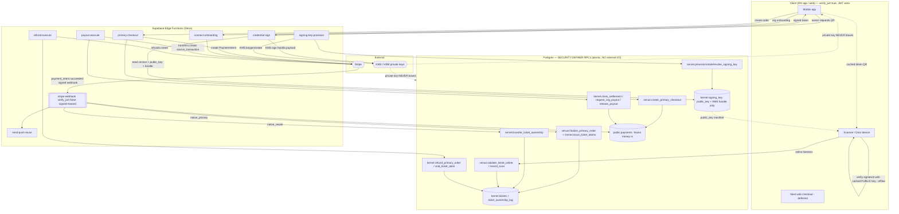

# Phase 2 — Edge Function / Service-Layer Specification

**Status:** BUILD-READY DESIGN SPEC. **Design-only — NO TypeScript, no Deno code, no function bodies.**
Every edge function below is specified so an implementing engineer can author it *without making an
architectural decision*. Where a decision stayed open it is flagged in §9 RECONCILIATION.

**Binding inputs (authority order):**
1. `docs/architecture/PHASE_2_SPEC_FOUNDATION.md` (committed copy of the session SPEC_FOUNDATION) — **BINDING**: §2 integrate-never-rewrite; §4 C33 credential key model + C35
   acting-principal; §8 security invariants (deny-by-default, RPC-only money/custody, constant-time compare,
   **stripe-webhook keeps `verify_jwt=false`**); §7 market-bridge (no native object mutates a `public.*`
   money/custody row except by linking a `public.payments` id).
2. `docs/architecture/PHASE_2_RPC_FUNCTION_CONTRACTS.md` — **primary input.** §13 fixes which transitions are Edge-fronted and the
   DB boundary each wraps; §0.6 the DB-RPC-vs-EDGE distinction. Edge functions **CALL** these atomic RPCs by
   their exact names; they NEVER re-implement a state transition.
3. `docs/architecture/PHASE_2_PHYSICAL_POSTGRES_SCHEMA_SPEC.md` §1.7 (`kernel.signing_key` model) + the five RN reconciliation targets (session working file; all five CONSUMED and CLOSED — see `docs/architecture/_superseded/PHASE_2_IMPLEMENTATION_SPEC_REVIEW.md` §2.2/§5)
   #4 (cacheable signed token + version-bump invalidation).
4. The **existing live edge layer** (`supabase/functions/`): `stripe-webhook`, `create-payment-intent`,
   `confirm-payment`, `confirm-and-release`, `create-connect-account`, `_shared/{stripe,money,payouts,payout-logic,sentry}.ts`.
   New money edges **EXTEND this discipline, never duplicate it.**
5. **The eight delta specs** (door lifecycle, money authority, role model, demographics, promoter codes,
   notifications, CRM export, Apple Wallet) — integrated here as of the Phase-2 consolidation. They contribute
   §0 (the C35 edge rule, from money §8.3(c)), the §5.4 offline-verify correction (from Wallet §11.9 and door
   §9.1/§10.3), and ten new edge functions in §3.6–§3.15, each traced to its source spec and section.
6. `docs/architecture/PHASE_2_PACKAGE_REGISTRY.md` — **canonical** migration numbering. Phase-2 packages are
   `076`–`091`; `071`–`075` are applied production security migrations and are **not** Phase-2 packages. Every
   package number in this file is on that scale. Do not decode a number by arithmetic from an older scale.

**Role labels used in this file are the canonical fifteen (role model §3, ratified O-2).** Venue plane:
`venue_manager` · `venue_finance` · `venue_box_office` · `venue_marketing` · `venue_promoter_manager` ·
`venue_scanner`. **`venue_door` → `venue_scanner` (renamed); `venue_promoter` is removed.** Any `venue_door`
in a cited passage is quoted, not endorsed.

**Golden rule (restated from RPC §0.6 / §0.7):** external I/O (Stripe / KMS / push) lives in an Edge Function;
the atomic state transition lives in a Postgres SECURITY DEFINER RPC. **The edge does the side-effect, then
calls the RPC. The RPC never does external I/O; the edge never writes a `kernel`/`venue`/`market` custody or
money row except through the RPC it wraps.** Money-in is *only* a `public.payments` row via the frozen webhook.

---

## 0. Which client an edge function may use — the C35 edge rule (BINDING, TESTABLE)

> **This section is normative and supersedes any contrary statement elsewhere in this file.** Every function in
> §3, §4 and §8 is classified under it, and no new edge function may be added to this spec without a
> classification. It closes the defect the money-authority spec calls **the single highest-severity correction
> in its document** (`PHASE_2_MONEY_AUTHORITY_SPEC.md` §8.3(c), `SPEC CORRECTION` #9), which observes that the
> requirement was *"currently unstated anywhere in the edge spec."*

### 0.1 The defect, stated once

An edge function holds `SUPABASE_SERVICE_ROLE_KEY`. If it builds its Supabase client from that key and then
invokes a DB-RPC on a human's behalf, then **inside that RPC**:

- `auth.uid()` is **NULL** — so `venue.order.buyer_id = auth.uid()`, `kernel.tickets.current_owner_id =
  auth.uid()`, `auth.uid() <> request.requested_by` (SoD) and every other owner test is false or vacuous;
- `auth.jwt()` is the **service token** — it carries no `uid`, no `aal`, no `amr`, so the step-up predicate
  (money spec §8.3a) cannot fire and dual-control cannot distinguish two approvers;
- every `kernel.has_org_role` / `has_venue_role` / `is_platform` check **silently degrades** — it does not
  raise, it returns false, or (worse) the RPC is written to skip it because "the edge already checked";
- the only way the RPC can then learn who acted is for the **edge to attest the actor as a parameter** — which
  is exactly the client-supplied-authority pattern **ratified row C35 forbids**.

The failure mode is silent. Nothing errors. The call succeeds with no authority behind it.

### 0.2 The rule

Every edge function is exactly one of two classes, and its class is stated in its own spec section.

> **EA-1 (Class A — caller-authorized).** An edge function that invokes **any** DB-RPC which derives authority
> from the caller's identity — `auth.uid()`, `auth.jwt()`, or any `has_org_role` / `has_venue_role` /
> `has_event_role` / `is_platform` / `has_org_role_over_venue` / `has_org_role_over_event` predicate — **MUST
> construct the Supabase client it uses for that call from the caller's own `Authorization` header**, so that
> `auth.uid()` and `auth.jwt()` resolve to the human *inside the transaction*.
>
> **EA-2.** The service-role key **MAY** be used in the same function for work that takes no authority from the
> caller: Stripe and KMS calls, object-storage writes, `kernel.record_money_denial`, outbox drains, structured
> logging, and Sentry. It **MUST NOT** be used to invoke a money, custody, or role-authorizing RPC on a human's
> behalf — **ever**, and not "temporarily", and not "because the edge already checked the role."
>
> **EA-3 (Class B — service-authorized).** A function may use a service-role client for its RPC calls **only**
> when the RPC takes **no** authority from `auth.uid()`. Three shapes qualify and no others:
> **(B-i)** the caller is not a human — Stripe (`stripe-webhook`), Apple (`wallet-pass-webservice`), APNs, a
> scheduler, or the outbox; **(B-ii)** the RPC is `REVOKE EXECUTE FROM anon, authenticated, public` and
> definer/`service_role`-only by contract; **(B-iii)** the function's authorization is a **non-JWT bearer
> credential** verified constant-time in the function itself (a Stripe signature, a per-pass
> `authenticationToken`, a door session). In (B-iii) the function's own check **is** the authority and must be
> specified as such — see EA-5.
>
> **EA-4.** `verify_jwt` is **not** the classification. `verify_jwt: true` proves a JWT was present; it does not
> prove the RPC saw it. A function may be `verify_jwt: true` and still be broken under EA-1 if it then calls the
> RPC with the service client. **This is precisely the `wallet-pass-issue` defect (§3.10).**
>
> **EA-5.** A Class B (B-iii) function MUST state (a) what credential authorizes it, (b) that the comparison is
> constant-time (`timingSafeEqual`, I-9), (c) the exact scope that credential grants — one serial, one session,
> one device — and (d) that an unknown subject and a wrong credential return the **same** status with the same
> timing budget (no enumeration oracle).
>
> **EA-6.** No edge function passes an actor id, a role, an org id's *authority*, or any "the caller is allowed"
> assertion into an RPC as a parameter. Scope **ids** are passed and are untrusted; the RPC re-checks them
> in-body against live tables (RPC §0.1). Actor is derived, never supplied (C35).
>
> **EA-7.** A Class A function that cannot obtain a caller `Authorization` header **fails closed** with `401`.
> It does not fall back to the service client. There is no degraded mode.

### 0.3 How it is tested (this is why the rule is written this way)

Each is a build-time or CI check, not a code-review convention:

| # | Test | Passes when |
|---|---|---|
| **T-1** | Static: grep each function for a service-role client reaching an RPC named in the Class-A column of §8 | zero hits |
| **T-2** | Integration: invoke each Class-A function with a **valid JWT for a user who lacks the role**, service-role key present in env | RPC raises `insufficient_privilege` (42501). A `200` proves the service client was used |
| **T-3** | Integration: invoke each Class-A function with **no** `Authorization` header | `401`, no RPC call, no side-effect (EA-7) |
| **T-4** | Integration: assert `auth.uid()` observed inside the RPC equals the JWT's `sub` | equal for every Class-A function |
| **T-5** | Static: no RPC parameter in any function is named `p_actor*`, `p_caller*`, `p_user_id`, `p_role*`, or equivalent | zero hits (EA-6) |
| **T-6** | Integration, Class B (B-iii): wrong credential and unknown subject | identical status, identical timing budget (EA-5d) |

`INFERENCE:` the tests are this spec's; the money spec states the rule but names no test.

### 0.4 Classification of every edge function

**Class A — caller-authorized. MUST build the RPC client from the caller's `Authorization` header.**

| Fn | § | Why Class A — the caller-identity predicate that would silently degrade |
|---|---|---|
| `primary-checkout` | §3.1 | `venue.create_primary_checkout` binds the hold and the order to `auth.uid()`; the on-behalf door path resolves the buyer from the *principal*, not the body |
| `credential-sign` | §3.2 | `kernel.tickets.current_owner_id = auth.uid()` is the entire authorization |
| `connect-onboarding` | §3.3 | `has_org_role([org_owner, org_finance])` |
| `payout-execute` | §3.4 | `has_org_role([org_finance, org_owner])`; `is_platform`; SoD `auth.uid() = payout_destination_set_by` refusal; step-up `aal`/`amr` — **named explicitly by money §8.3(c)** |
| `refund-execute` | §3.5 | buyer-own-order, `has_org_role([org_finance])`, `is_platform` capped, second-approver SoD — **named explicitly by money §8.3(c)** |
| `signing-key-provision` | §3.6 | `is_platform([platform_admin])` |
| `wallet-pass-issue` | §3.10 | `kernel.mint_wallet_pass` authorizes atom current owner via `auth.uid()` — **was self-contradictory; resolved here** |
| `pass-cert-provision` | §3.13 | `is_platform([platform_admin])` |
| `crm-export` | §3.7 | export allow-list by `has_venue_role` / `has_org_role`, **re-authorized live at download** |
| `promoter-code-preview` | §3.8 | rate-limited per `auth.uid()`; eligibility is caller-scoped |
| `door-manifest` | §3.9 | authorizes a `venue_scanner`/`venue_manager` **staff JWT** on this route (the PIN route is §3.9's Class-B sibling) |

**Class B — service-authorized. The caller is not a human, or the credential is not a JWT.**

| Fn | § | Sub-class | What actually authorizes it |
|---|---|---|---|
| `stripe-webhook` | §4 | B-i + B-iii | Stripe HMAC-SHA256 `v1` signature, `timingSafeEqual`, ±300s replay window, `claim_stripe_webhook_event` lease. `verify_jwt=false` (frozen, I-10) |
| `wallet-pass-webservice` | §3.11 | B-i + B-iii | Apple devices present `Authorization: ApplePass <token>`; per-pass `authenticationToken` compared constant-time against `auth_token_hash`; authorizes **one serial only**. `verify_jwt=false` — the **second and last** such surface in the system |
| `wallet-pass-push` | §3.12 | B-i | outbox drain / scheduler; wraps `record_wallet_push_result`, a definer-only writer. Its `is_platform` *manual* re-drive route is **Class A** (§3.12) |
| `notify-dispatch` | §3.14 | B-i | scheduler/outbox drain; no human caller exists |
| `notify-receipts` | §3.15 | B-i | provider (Expo/APNs) receipt poll; no human caller exists |
| `door-session` | §3.9 | B-iii | a `venue.door_pin` — a **loginless device credential with no `auth.uid()`** (role model §7.2). `kernel.assert_door_session(device, session)` is the authority; RM-5 forbids a door session from ever being an RLS predicate |

**Consequence for the door plane (role model §7.2/§7.3, RM-5):** a door session carries no `auth.uid()`, so
**no** door-session route may invoke a caller-identity RPC. Everything the door does reaches the DB through
definer RPCs whose authority is `kernel.assert_door_session`. This is not an EA-2 exemption — it is EA-3
(B-iii): the door PIN *is* the credential, and it is deliberately weaker than a JWT, which is why O-4 denies the
door principal the manifest-open authority (§3.9).

### 0.5 What this does NOT change

The RPC still re-checks its predicate in-body against live tables. EA-1 does not move authority into the edge —
it makes the edge stop *destroying* the authority the RPC was written to check. It is what makes §3.4/§3.5's
promise — *"the edge passes ids; the RPC decides — no role logic in the edge"* — true rather than aspirational.

---

## 1. Existing edge layer — the discipline we extend (do not re-derive)

These live functions are the anchors. Every new function inherits their patterns; the specs below cite them
rather than re-describe them.

| Existing fn | Auth | Role in Phase 2 | Reused discipline (the pattern new edges MUST copy) |
|---|---|---|---|
| `stripe-webhook` | **`verify_jwt=false`** (Stripe-signed) | **EXTENDED** for native/primary events (§4) | HMAC-SHA256 signature verify with multi-`v1` rotation support; ±300s replay window; `claim_stripe_webhook_event`/`complete_*`/`fail_*` **lease** (migrations 064/069); fail-CLOSED on claim error; non-2xx ⇒ Stripe retries; `timingSafeEqual`; CORS whitelist + security headers |
| `create-payment-intent` | JWT (Bearer) | **Template** for `primary-checkout` (§3.1) | server-authoritative pricing (never client amount); `check_rate_limit` fail-closed (429/503); get-or-create Stripe Customer + ephemeral key; **deterministic PI idempotency key** salted by failed-attempt count + customer id; `stripe_livemode` recorded from Stripe's own field; structured stage logging, no secrets |
| `confirm-payment` | JWT | untouched (external rail) | synchronous confirm fallback; webhook remains authoritative |
| `confirm-and-release` | JWT | **Template** for `payout-execute` (§3.4) | payout via `_shared/payouts.ts` (capability pre-flight → funding-charge verify → `source_transaction` transfer) |
| `create-connect-account` | JWT | **Template/generalized** by `connect-onboarding` (§3.3) | Stripe Connect Express account create + onboarding link; capability-flag sync via `account.updated` |
| `_shared/stripe.ts` | — | **reuse as-is** | pinned `STRIPE_API_VERSION` / `STRIPE_MOBILE_API_VERSION`; `stripeFetch`/`stripeFetchRaw` |
| `_shared/payout-logic.ts` | — | **reuse as-is** | `buildPayoutIdempotencyKey(transferId, destination)` (deterministic, destination-salted); Stripe error classifier |
| `_shared/payouts.ts` | — | **reuse/extend** | `source_transaction` funding + deterministic idempotency payout shell |
| `_shared/sentry.ts` | — | **reuse as-is** | `captureException(fn, err, ctx)` |
| `send-push`, `notify-transfer`, `notify-report`, `delete-account`, `auto-finalize-auctions`, `enforce-transfer-expiry` | mixed | untouched | native rail reuses `send-push`; native auction MVP reuses `auto-finalize-auctions` (RPC §16.5) |

**Note on `config.toml`:** this tree carries no `supabase/config.toml`; `verify_jwt` is set per-function at
deploy time. Every new function's required `verify_jwt` value is stated in its spec. **Only Stripe/KMS-webhook
endpoints run `verify_jwt=false`; every user-facing edge runs `verify_jwt=true` and re-derives the actor.**

---

## 2. Placement decision table — challenge each candidate

For every candidate the verdict is one of: **RPC** (pure atomic DB transition → stays in Postgres, NOT an edge
fn) · **NEW EDGE** (external I/O / secrets / third-party) · **EXTEND WEBHOOK** (add a branch to the existing
`stripe-webhook`) · **DOOR-SIDE** (runs on the scanner device, no server round-trip) · **NODE/NEXT** (existing
web server). **Rejections are the high-value output — they keep atomic transitions in the DB where they belong.**

| Candidate | Verdict | Why | Wraps / lands in |
|---|---|---|---|
| Create PaymentIntent for a native **primary** order | **NEW EDGE** `primary-checkout` | needs `STRIPE_SECRET_KEY`, customer/ephemeral key, server price authority | calls `venue.create_primary_checkout` (RPC §6.1) for the total; mints PI |
| Confirm native primary payment → **issue atoms** | **EXTEND WEBHOOK** | authoritative money-in event; must ride the frozen signed+leased path (I-10) | `payment_intent.succeeded` branch → `venue.finalize_primary_order` (RPC §6.3) |
| Native **resale/market** payment → transfer custody | **EXTEND WEBHOOK** | same as above; one signed endpoint, one lease table | `payment_intent.succeeded` (rail=native_resale) → `kernel.transfer_ticket_ownership` path via `market` accept, or C25 sweep |
| **Credential signing** (QR token) | **NEW EDGE** `credential-sign` | KMS custody; private key must never touch DB/client (C33) | reads `kernel.tickets`/`kernel.signing_key`; KMS sign |
| **Signing-key provisioning / rotation** | **NEW EDGE** `signing-key-provision` | KMS keygen/rotate/revoke is external I/O | wraps `kernel.provision/rotate/revoke_signing_key` (RPC §13) |
| **Refund executor** (Stripe refund) | **NEW EDGE** `refund-execute` | `stripe.refunds.create` is external; DB only records intent + voids atoms | wraps `kernel.refund_primary_order` / `admin_refund` / `catalog.cancel_event` (RPC §11.4/§4.4) |
| **Payout executor** (Stripe Connect transfer) | **NEW EDGE** `payout-execute` | `stripe.transfers.create` w/ `source_transaction` is external | wraps `kernel.close_settlement` / `request_org_payout` / `release_payout` (RPC §10.2/§10.3/§11.3) |
| Org/venue **Stripe Connect onboarding** | **NEW EDGE** `connect-onboarding` (generalizes `create-connect-account`) | Stripe Account + AccountLink creation | writes `kernel.organization` connect ref via RPC; capability sync via webhook |
| **Online scan validate** (`scan-validate`) | **REJECTED → RPC + DOOR-SIDE** | no secret, no third-party. Liveness is a pure read; signature check uses the *public* key the door already caches | `venue.validate_ticket_online` (RPC §9.3) + door-side verify (§5.4) |
| **Offline scan reconcile** (`scan-reconcile`) | **REJECTED → RPC** | pure atomic batch DB write, no external I/O | `venue.reconcile_offline_scans` (RPC §9.5) — device calls it directly with its JWT/door principal |
| All custody transitions (issue/transfer/void/lock/scan) | **REJECTED → RPC** | atomic single-writer state machine; §5 SSCAS; no external I/O | the three kernel engines (RPC §7) |
| P2P start/accept/cancel, listing create, offer, order create | **REJECTED → RPC** | atomic DB transitions | `market.*` / `venue.*` RPCs |
| TTL & C25 **sweeps** (`sweep_expired_p2p_transfers`, `sweep_paid_pending_sales`) | **REJECTED → RPC via scheduler** | pure DB batch; invoked by `pg_cron`/scheduler, not an edge | RPC §12.2/§12.3 |
| Settlement-open, role grants, config edits, door-PIN issue | **REJECTED → RPC** | single-aggregate DB writes | `venue.*`/`kernel.*` RPCs |
| Push on native events | **REJECTED → reuse `send-push`** | already exists | webhook & RPCs fire `send-push` |
| Native web checkout surface | **NODE/NEXT (deferred)** | the `web/` Next app fronts browser checkout; still calls the same edges | out of MVP edge scope |

**Delta-spec candidates (added by the eight delta specs; each traced to its source in §3).**

| Candidate | Verdict | Why | Source spec |
|---|---|---|---|
| Build + sign the `.pkpass` | **NEW EDGE** `wallet-pass-issue` (§3.10) | KMS sign with the Apple Pass Type ID key; object-storage write | Wallet §11.8 |
| Apple PassKit device web service | **NEW EDGE** `wallet-pass-webservice` (§3.11) | iOS presents `Authorization: ApplePass`, not a JWT; **second and last `verify_jwt=false` surface** | Wallet §6.1 |
| APNs pass-update push | **NEW EDGE** `wallet-pass-push` (§3.12) | APNs is external I/O; outbox-driven | Wallet §6.3 |
| Apple pass-type certificate provisioning / rotation | **NEW EDGE** `pass-cert-provision` (§3.13) | KMS import/keygen, out-of-band Apple step | Wallet §8.4 |
| Sign the **ticket** manifest (M2) for parity with M1 | **NEW EDGE (optional)** `door-manifest` (§3.9) | KMS sign; deterministic over the digest, so re-signing is free | Door §16 OQ-7 |
| Mint + validate the loginless door session | **NEW EDGE** `door-session` (§3.9) | the door PIN is a non-JWT credential; the scan/sync/offline-batch relay needs `service_role` because a door session has **no `auth.uid()`** | Role model §12 rows 21–22 |
| Notification dispatch (claim → render → Expo/Resend → record) | **NEW EDGE** `notify-dispatch` (§3.14) | third-party push/email transport, batching, retry, receipts | Notifications §4.6, §6.4 |
| Provider receipt poll + dead-token revocation | **NEW EDGE** `notify-receipts` (§3.15) | polls Expo's receipts endpoint on a cron | Notifications §4.6 |
| CRM export build + signed download | **NEW EDGE** `crm-export` (§3.7) | CSV serialization + private-bucket streaming + `createSignedUrl` are Storage I/O | CRM §11.5 |
| Promoter-code preview at checkout | **NEW EDGE** `promoter-code-preview` (§3.8) | `public.check_rate_limit` is `GRANT EXECUTE … TO service_role` only, so a rate-limited preview **cannot** be a plain PostgREST RPC | Promoter §7.10 |
| Demographic capture / holder-mix aggregation | **REJECTED → RPC** | deliberately no edge function: *"the demographic value never crosses a process boundary — no HTTP body, no function log, no error breadcrumb"* | Demographics §5.4 |
| `crm-export-deliver` (email the CSV) · CDP/webhook sync | **REJECTED — never build** | EX-6 / X-5 / C40 — a third-party destination with extra steps, in an inbox that outlives every control | CRM §11.5, Demographics §9 X-5 |
| Synchronous `GET /attendees.csv` | **REJECTED** | EX-2: an export is an audited, revocable, re-authorized job, not a download | CRM §11.5 |
| Export sweep / expiry | **REJECTED → RPC via `pg_cron`** | pure DB batch + one Storage delete, which rides the existing worker route | CRM §11.5 |
| Row selection for the export in TypeScript | **REJECTED → RPC** | a query assembled in the edge is invisible to catalog assertions and pgTAP; the SQL must be one named catalog object | CRM §11.5 |
| A second push function for the 40 new notification types | **REJECTED → `notify-dispatch`, NOT `send-push`** | §2's original *"reuse `send-push`"* verdict is right about **transport** and wrong about **pipeline**: `send-push` has no batching, no receipt loop, no retry, no idempotency and no preference check. `send-push` stays for the 15 legacy types and is **not extended** | Notifications §6.4 (`SPEC CORRECTION` to this table) |

**Net new edge functions: 16** — the original 6 (`primary-checkout`, `credential-sign`,
`signing-key-provision`, `refund-execute`, `payout-execute`, `connect-onboarding`) **+ 10 from the delta specs**
(`crm-export`, `promoter-code-preview`, `door-session`, `door-manifest` *(optional)*, `wallet-pass-issue`,
`wallet-pass-webservice`, `wallet-pass-push`, `pass-cert-provision`, `notify-dispatch`, `notify-receipts`)
**+ 1 extended** (`stripe-webhook`). Every one is classified under §0.4.

---

## 3. New / extended function specifications

Fields per §0 of the brief: name · method · auth · authz · request · response · DB-RPC · Stripe/KMS · secrets
(names only) · rate limit · idempotency · retries · logging · Sentry · abuse · failure · timeout.

### 3.1 `primary-checkout` — create the PaymentIntent for a native primary order — **NEW EDGE**

- **Method:** `POST` (+ `OPTIONS` preflight). **verify_jwt:** `true`.
- **Authentication:** Supabase JWT (Bearer), verified via `auth.getUser(token)` (copy `create-payment-intent`
  §getAuthenticatedUser). Actor = `user.id` (C35: server-derived, never a body field).
- **Authorization:** any `authenticated` fan (self-checkout) OR a door/staff principal buying on-behalf — the
  **on-behalf buyer id is set by the RPC from the door principal, never trusted from the body.** No role check
  here beyond authentication; authority for issuance lives in `finalize_primary_order`.
- **Request:** `{ session_id: uuid, items: [{ ticket_type_id: uuid, quantity: int }], hold_ids: [uuid],
  command_key: string, expected_total_cents?: int (optional client cross-check) }`.
- **Response:** `{ order_id, clientSecret, paymentIntentId, amount, buyer_fee, seller_fee, total,
  customerId, customerEphemeralKeySecret }` (shape mirrors `create-payment-intent`).
- **DB-RPC called:** `venue.create_primary_checkout(p_session_id, p_items, p_hold_ids, p_command_key)` (RPC
  §6.1) → returns `{ order_id, total_minor, currency }`. **The total is server-authoritative from this RPC;**
  the edge NEVER computes or trusts a client price. If `expected_total_cents` disagrees → `409` (copy the
  `totalMismatch` guard).
- **Stripe:** get-or-create Customer + ephemeral key (reuse `ensureStripeCustomerAndEphemeralKey`); create a
  PaymentIntent for `total_minor`, `currency='usd'`, `automatic_payment_methods`, metadata
  `{ rail:'native_primary', order_id, buyer_id, org_id, session_id }`. Records the `public.payments` row
  (frozen table) with the new `order_id` linkage column and `stripe_livemode` from Stripe's own field.
- **Secrets:** `STRIPE_SECRET_KEY`, `SUPABASE_URL`, `SUPABASE_SERVICE_ROLE_KEY` (env names only).
- **Rate limit:** `check_rate_limit(user, 'primary-checkout', 5, 60)`, **fail-closed** (503 on limiter error,
  429 on over-limit) — copy `create-payment-intent`.
- **Idempotency:** (a) RPC dedupes on `UNIQUE(buyer_id, command_key)` → replay returns the same `order_id`;
  (b) **deterministic PI idempotency key** `pi_native_${order_id}_${total}_c${customerId}` salted with a
  failed-attempt suffix `_r${n}` (copy the create-PI salting rule — a canceled PI must not replay). A double-tap
  returns the same PI + clientSecret.
- **Retries:** safe (both keys). A pending PI is retrieved and its clientSecret re-returned; a canceled PI is
  retired and a fresh salted PI minted (copy `create-payment-intent`).
- **Logging:** structured `{tag:'primary-checkout-stage', stage, order_id, pi_id, amount}` — **never** log
  client_secret, tokens, or PII. **Sentry:** `captureException('primary-checkout', err)` on non-auth 500s;
  auth errors log as 401 warnings (don't flood quota).
- **Abuse:** rate limit + per-user active-hold cap enforced in the RPC (C5); buyer-can't-buy-own via the RPC's
  listing/seller check; holds must belong to the buyer and be unexpired.
- **Failure:** RPC `precondition_failed` (stale/expired hold, session not on-sale) → 409; Stripe failure → 500
  + PI cancel of any orphan; DB-insert 23505 race → return the winner's clientSecret (copy the recovery path).
- **Timeout:** target < 8s wall; Stripe calls have no long polls here. On timeout the client retries with the
  same `command_key` → idempotent.

> **Confirmation is NOT synchronous here.** `primary-checkout` only creates the PI. Authoritative issuance
> happens when `payment_intent.succeeded` reaches the extended webhook (§4). This mirrors the external rail and
> satisfies §6.2 (`confirm_primary_payment_server_side` is realized as a webhook branch, not a separate confirm
> edge) — one signed, leased, replay-safe money-in path.

### 3.2 `credential-sign` — mint the cacheable signed ticket credential (C33) — **NEW EDGE**

Full C33 architecture is in §5. This is the request/response contract.

- **Method:** `POST`. **verify_jwt:** `true`.
- **Authentication:** Supabase JWT (Bearer). Actor = `user.id`.
- **Authorization:** actor **must be the atom's current owner** (`kernel.tickets.current_owner_id = auth.uid()`,
  re-read live inside the request — never a client claim). A non-owner → 403. (Door verification does NOT call
  this; the door verifies with the *public* key — §5.4.)
- **Request:** `{ ticket_atom_id: uuid }`. (No version or key id from the client — both are resolved
  server-side; a client-supplied version is ignored.)
- **Response:** `{ token: <compact signed token>, credential_version: int, signing_key_id: uuid,
  not_after: timestamptz, ttl_seconds: int }`. `token` is the only signed artifact; it embeds
  `{ atom_id, session_id, credential_version, key_id, issued_at, exp }` as signed claims.
- **DB-RPC / reads:** reads `kernel.tickets` (`current_owner_id, state, resale_state, credential_version,
  signing_key_id, event_session_id`) and `kernel.signing_key` (`key_id, kms_handle_ref, status, not_before,
  not_after`) for the atom's active signer. **No state write** — signing does not mutate custody. (A transfer
  bumped `credential_version` in the RPC layer already; this fn just signs the current head.)
- **KMS:** `KMS.sign(kms_handle_ref, canonical_payload)` — asymmetric sign (Ed25519 / ECDSA-P256). **The
  private key never leaves KMS; the edge holds only a handle.** See §5.
- **Secrets:** `KMS_SIGNER_ROLE_ARN` / `KMS_ENDPOINT` / provider creds (env names only — an IAM role/handle,
  never key material), `SUPABASE_URL`, `SUPABASE_SERVICE_ROLE_KEY`.
- **Rate limit:** `check_rate_limit(user, 'credential-sign', 30, 60)` — generous (wallet refresh, reconnect
  re-sign), fail-closed. Per-atom sign throughput target §5.7.
- **Idempotency:** **naturally idempotent** — same `(atom_id, credential_version)` ⇒ deterministic claims ⇒ the
  token is byte-reproducible if the signer is deterministic (Ed25519) or functionally equivalent (any valid
  signature verifies). No dedup row needed. A **version bump invalidates every previously issued token** for
  that atom (recon #4): old tokens carry a stale `credential_version` and fail the door's version check.
- **Retries:** safe/read-only; client may re-sign freely. On KMS transient error → 503 + `Retry-After`.
- **Logging:** `{tag:'credential-sign', atom_id, credential_version, key_id, outcome}` — **never** log the
  token, the payload, or any key material. **Sentry:** capture KMS failures + owner-mismatch spikes (fraud
  signal).
- **Abuse:** owner-only; rate-limited; a revoked/`voided`/`scanned` atom → 409 (no live credential for a dead
  ticket); a `listed`/`locked` atom still signs (the door rejects `listed/locked` at scan, RPC §9.3) — or,
  per policy, refuse to sign a listed atom to reduce screenshot-resale confusion (flagged §9.2).
- **Failure:** owner mismatch 403; atom terminal 409; no active signing key for scope 500 + Sentry (an
  ops-critical gap — an event with issued atoms but no active key); KMS down 503.
- **Timeout:** target < 2s; KMS sign is single-digit ms. Offline clients never call this — they use the cached
  token (§5.6).

### 3.3 `connect-onboarding` — org/venue Stripe Connect onboarding — **NEW EDGE (generalizes `create-connect-account`)**

- **Method:** `POST`. **verify_jwt:** `true`.
- **Authentication:** JWT. Actor = `user.id`.
- **Authorization:** `kernel.has_org_role(p_org_id, [org_owner, org_finance])` — re-checked in the wrapped RPC
  (edge passes the org id; the RPC decides). The **payee is the org (`kernel.organization`), not an individual**
  — this is the Phase 2 change from the per-seller `create-connect-account`.
- **Request:** `{ org_id: uuid, return_url: string, refresh_url: string, command_key: string }`.
- **Response:** `{ connect_account_id, onboarding_url, status }`.
- **DB-RPC:** a `kernel.set_org_connect_ref(p_org_id, p_connect_account_id, p_command_key)` writer records the
  Connect account id on `kernel.organization` (audited) — **reuses existing connect ids where an org already
  has one** (SPEC_FOUNDATION §2, "reuse existing connect ids"). Edge never writes the org row directly.
- **Stripe:** `Account` (Express) create if none; `AccountLink` create for onboarding (copy
  `create-connect-account`). Capability flags (`charges_enabled`/`payouts_enabled`/`details_submitted`) are
  synced by the **extended webhook** `account.updated` branch (§4), matched by `connect_account_id` → org.
- **Secrets:** `STRIPE_SECRET_KEY`, `SUPABASE_URL`, `SUPABASE_SERVICE_ROLE_KEY`.
- **Rate limit:** `check_rate_limit(user, 'connect-onboarding', 5, 60)`, fail-closed.
- **Idempotency:** Stripe `Account` create keyed `connect_org_${org_id}` (deterministic; one account per org);
  RPC dedupe on `command_key`.
- **Retries/Logging/Sentry/Timeout:** copy `create-connect-account`. **Abuse:** org-role-gated; a fan cannot
  onboard. **Failure:** role fail 403; Stripe fail 500. **Timeout:** < 8s.

### 3.4 `payout-execute` — Stripe Connect transfer executor — **NEW EDGE**

- **Method:** `POST` (invoked by an authenticated finance user OR by a scheduler/service principal for the
  settlement-close disbursement leg). **verify_jwt:** `true` (see abuse note for the service-principal path).
- **Authentication:** JWT. Actor = `user.id`.
- **Authorization:** the wrapped RPC enforces role: `has_org_role([org_finance, org_owner])` for
  `request_org_payout`; `is_platform([platform_risk, platform_admin])` (dual-control seam) for `release_payout`.
  The edge passes ids; the RPC decides — no role logic in the edge.
- **Request:** `{ action: 'close_settlement' | 'request_org_payout' | 'release_payout', settlement_id?, org_id?,
  payout_id?, command_key }`.
- **Response:** `{ status, payout_ids: [uuid], stripe_transfer_refs: [string] }`.
- **DB-RPC:** `kernel.close_settlement` (§10.2) → generates `kernel.payout` intents; `kernel.request_org_payout`
  (§10.3) → advances `pending→submitted`; `kernel.release_payout` (§11.3) → resumes a held payout. **The DB
  records the payout intent + advances state; the edge executes the Stripe transfer** and writes back the
  `stripe_transfer_ref` via the RPC's callback param. Order: **RPC-first to claim `submitted` under lock, THEN
  Stripe transfer, THEN RPC callback to record the ref** — so a crash after transfer is recovered by the
  deterministic idempotency key, never a double-pay.
- **Stripe:** reuse `_shared/payouts.ts` — capability pre-flight → funding-charge (`source_transaction`) verify
  → `stripe.transfers.create` under `buildPayoutIdempotencyKey(payout_id, destination)` (**deterministic,
  destination-salted** — a re-onboarded destination mints a new key, a retry replays ONE transfer). Honors the
  `payout_destination_locked_until` cool-down (checked in the RPC).
- **Secrets:** `STRIPE_SECRET_KEY`, `SUPABASE_URL`, `SUPABASE_SERVICE_ROLE_KEY`.
- **Rate limit:** `check_rate_limit(user, 'payout-execute', 10, 60)`, fail-closed.
- **Idempotency:** `kernel.payout.idempotency_key` (deterministic on `(cause, cause_ref, payee)`) + the Stripe
  key — a retry recovers the original payout, never a second transfer.
- **Retries:** safe. Stripe `insufficient_funds` before `source_transaction` funding is an expected operational
  state (classifier in `payout-logic.ts`), recorded as a payout decision, not a Sentry page.
  `idempotency_params` IS a code bug → page.
- **Logging:** structured payout-stage lines, no destination bank data. **Sentry:** unexpected Stripe classes
  + `idempotency_params`. **Abuse:** money-out is finance/platform-role-only via the RPC; the scheduler path
  uses a service principal whose JWT is a machine identity (never human authority — SPEC_FOUNDATION §8). **The
  DB never moves money itself.** **Failure:** destination locked / settlement not closed → 409; Stripe fail →
  500 + reclaimable state. **Timeout:** < 15s (Stripe transfer + callback).

### 3.5 `refund-execute` — Stripe refund executor — **NEW EDGE**

- **Method:** `POST`. **verify_jwt:** `true`.
- **Authentication:** JWT. Actor = `user.id`.
- **Authorization:** wrapped RPC enforces: buyer (own order, policy-capped) · `has_org_role([org_finance])` ·
  `is_platform([platform_support (capped), platform_admin, platform_risk])`. Edge passes ids; RPC decides.
- **Request:** `{ action: 'refund_primary_order' | 'admin_refund' | 'cancel_event', order_id?, event_id?,
  amount_minor?, reason_code, command_key }`.
- **Response:** `{ status, refund_id, atoms_voided, stripe_refund_id }`.
- **DB-RPC:** `kernel.refund_primary_order` (§11.4) / `kernel.admin_refund` / `catalog.cancel_event` (§4.4,
  batch). **The DB records `kernel.refund` intent + voids the covered atoms atomically (SSCAS #3) BEFORE the
  Stripe refund;** the edge then executes the Stripe refund and records `stripe_refund_id` via a callback param.
  Amount is re-validated in the RPC (`sum(refunds) ≤ payment.total` under `FOR UPDATE` on `public.payments`) —
  the edge never trusts a client amount.
- **Stripe:** `stripe.refunds.create({ payment_intent, amount })` under a **deterministic idempotency key**
  `refund_${refund_id}` (reconstructible from the `kernel.refund` row). Reuses `_shared/stripe.ts`.
- **Secrets:** `STRIPE_SECRET_KEY`, `SUPABASE_URL`, `SUPABASE_SERVICE_ROLE_KEY`.
- **Rate limit:** `check_rate_limit(user, 'refund-execute', 10, 60)`, fail-closed.
- **Idempotency:** `kernel.refund.idempotency_key` + the Stripe key → a retry replays ONE refund. The
  `charge.refunded` webhook branch (§4) reconciles state either way (a Dashboard refund and an app refund
  converge).
- **Retries:** safe (RPC re-entrant by cause key; atoms already voided are skipped). **Logging:** refund-stage
  lines. **Sentry:** over-refund attempts, Stripe failures. **Abuse:** a buyer refunding beyond policy cap /
  another buyer's order → 403 in the RPC; high-impact platform voids carry the dual-control seam (RPC §11.1).
- **Failure:** over-refund / window closed → 409; Stripe fail → 500, refund intent recorded → reclaimable.
  **Timeout:** < 12s.

### 3.6 `signing-key-provision` — KMS keygen / rotate / revoke — **NEW EDGE**

- **Method:** `POST`. **verify_jwt:** `true`. **Auth model: Class A (EA-1)** — `kernel.provision/rotate/
  revoke_signing_key` authorize on `is_platform([platform_admin])`, which reads `auth.uid()`.
- **Authorization:** `is_platform([platform_admin])`, decided in the RPC. Dual-control seam per RLS §11.
- **Request:** `{ action: 'provision' | 'rotate' | 'revoke', scope, event_id?, venue_id?, key_id?, command_key }`.
  **Response:** `{ key_id, public_key, status, not_before, not_after }`.
- **KMS:** keygen / schedule-deletion under `KMS_SIGNER_ROLE_ARN`, scoped to `kms:CreateKey` /
  `kms:ScheduleKeyDeletion` for this path only. **The DB stores `public_key` + `kms_handle_ref`, never material.**
- **Secrets:** `KMS_SIGNER_ROLE_ARN` / `KMS_ENDPOINT`, `SUPABASE_URL`, `SUPABASE_SERVICE_ROLE_KEY` (the latter
  for KMS-side bookkeeping only — EA-2 forbids using it for the RPC call).
- **Idempotency:** RPC `command_key`. **Rate limit:** 5/60, fail-closed. **Timeout:** < 10s.
- **Package:** `083` (`kernel.signing_key`). Rotation runbook: §5.6.

### 3.7 `crm-export` — attendee export build + signed download — **NEW EDGE** (CRM §11.5)

**Two routes, one function.** They have **different auth models** and the split is the point.

| | `POST /build` (worker) | `POST /download` (actor) |
|---|---|---|
| **verify_jwt** | `false` — invoked by `pg_cron` via `net.http_post` with a service-role bearer, **constant-time compared** (I-9) | **`true`** — actor re-derived via `auth.getUser` (C35) |
| **Auth model (§0)** | **Class B (B-i + B-iii)** — no human caller exists; `venue.build_export_rows` is `REVOKE EXECUTE FROM anon, authenticated` and re-derives authority **from the job row's recorded actor and scope**, not from the caller | **Class A (EA-1)** — `venue.authorize_export_download` **re-checks the caller's authority live against the grant tables at this instant** (EX-4). With a service client that re-check is vacuous, so this route is Class A without exception |
| **Wraps** | `venue.build_export_rows` (paged) → `venue.finalize_export` | `venue.authorize_export_download` → `{ object_path, ttl_seconds: 300 }` |
| **External I/O** | Storage upload to the private `crm-exports` bucket | Storage `createSignedUrl(path, 300)` |
| **Secrets (names only)** | `SUPABASE_URL`, `SUPABASE_SERVICE_ROLE_KEY`, `CRM_EXPORT_WORKER_SECRET`, `SENTRY_DSN` | same |
| **Rate limit** | n/a (cron-paced + per-org concurrency cap of 2 running jobs) | `check_rate_limit` fail-closed: 3 per actor per job, 10 per actor / 24 h |
| **Idempotency** | claim lease + `UNIQUE(requested_by, command_key)`; a re-drive overwrites the same `{org_id}/{job_id}.csv` | none needed — a signed URL is not a side effect |
| **Timeout** | 15s per page-batch; the **lease outlives the timeout**, so a crashed worker is reclaimed, never double-run to a second artifact | 3s |

- **Authorized (CRM K-2, role-model V-5):** `audience_v1` template — `org_owner`, `org_admin`, `org_marketing`
  *(org grain)*, `venue_manager`, `venue_marketing` *(venue grain)*. `operations_v1` (adds MONEY columns) —
  `org_owner`, `org_admin`, `venue_manager` **only**.
  **Denied:** `venue_box_office`, `venue_scanner`, `venue_promoter_manager`, `org_promoter_manager`,
  `venue_finance`, `org_finance`, `org_member`, promoters, `platform_support`, `platform_risk`,
  `platform_admin`, a door session, `fan`, `anon`. **Platform roles read the roster; they do not use the venue
  CRM export** (CRM K-3) — platform bulk extraction is not built in Phase 2.
- **Logging: counts, ids and durations only. Never a row, never a cell, never an email, never a
  `customer_ref`, never a signed URL.** The edge writes no audit row; the wrapped RPCs write
  `crm_export.generate` / `crm_export.download` to `kernel.admin_audit` **in the same transaction**, the
  download row **before** the URL is returned (an honest over-report: the audit records that a URL was issued,
  not that bytes arrived).
- **Honesty note to carry into any review:** *a 300-second signed URL bounds the window in which the **link** is
  redeemable and buys nothing about the **data**.* The controls that matter are the 24-hour artifact sweep, the
  32 MB object cap, the per-actor daily cap, and revoke.
- **Sentry:** unexpected 500s and any storage failure. **Failure:** 400 / 403 / 409 / 429 / 503, job left
  reclaimable by the lease. **Package:** `087` (Phase I).

### 3.8 `promoter-code-preview` — checkout code preview — **NEW EDGE** (Promoter §7.10)

- **Method:** `POST` (+ `OPTIONS`). **verify_jwt:** `false` — **a buyer may type a code before signing in.**
- **Auth model: Class A (EA-1) when a caller JWT is present; otherwise an unauthenticated public preview.**
  `venue.preview_promoter_code` is read-only and advisory, and grants nothing — but when the caller *is*
  authenticated the RPC MUST still be invoked on the caller's client so the rate-limit principal and any
  caller-scoped eligibility resolve to the human. **The service-role client is used for one thing only:
  `public.check_rate_limit`**, which is `GRANT EXECUTE … TO service_role` only
  (`supabase/migrations/005_rate_limits.sql`) — **this is the entire reason this is an edge function** and it is
  a textbook EA-2 use.
- **Request:** `{ code: string, session_id: uuid }`. **Response:** `{ status: 'eligible',
  promoter_display_name, method_hint: 'code' }` **or** `{ status: 'not_applicable' }` — and **nothing else**.
- **Enumeration defence (EA-5d applies even though this route is public):**
  - authenticated: `check_rate_limit(user.id, 'promoter-code-preview', 10, 60)`;
  - anonymous: `check_rate_limit(uuidv5(NS_PROMOCODE, ip || ':' || sha256(user_agent)),
    'promoter-code-preview-anon', 5, 60)` — the limiter's first parameter is `uuid`, so an anonymous principal
    must be *derived* as one;
  - **fail-closed** (503 limiter error, 429 over-limit);
  - **single-response oracle:** unknown, deactivated, out-of-scope, out-of-window and malformed all return the
    identical `not_applicable` with the same timing budget;
  - **burst audit:** ≥ 30 `not_applicable` from one principal in 5 minutes writes
    `kernel.admin_audit('promoter_code.enumeration_suspected')` and disables code entry for that session.
- **Secrets:** `SUPABASE_URL`, `SUPABASE_SERVICE_ROLE_KEY`, `SENTRY_DSN`. `INFERENCE:` the promoter spec
  specifies no env list for this function; these are the minimum its own rate-limit requirement implies.
  → §9 recon #8.
- **Logging: never log the submitted code string at info level** — log the outcome class only.
- **Binding cross-cutting rule (Promoter §7.11):** *no attribution condition — unknown code, deactivated code,
  out-of-scope code, malformed input, missing promoter, rate-limited preview, or resolver error — may abort a
  checkout, refuse a payment, or roll back an issuance.* A 503 from this function is cosmetic.
- **`SPEC CORRECTION` to §3.1:** `primary-checkout`'s request gains optional `code` and `link_slug`; binding is
  `venue.bind_order_attribution` while the order is `pending`, and resolution is
  `venue.resolve_order_attribution` **inside** `venue.finalize_primary_order`'s paid transaction.
- **Package:** `090` (function deploy, not a migration).

### 3.9 `door-session` and `door-manifest` — the door plane

The door is the one place in the system where **the caller has no `auth.uid()`**. Both functions below are
specified against that fact, and it is why §0.4 puts them on opposite sides of the classification.

#### 3.9a `door-session` — mint + validate the loginless door session — **NEW EDGE** (role model §12 rows 21–22)

- **Method:** `POST`. **verify_jwt:** `false`. **Auth model: Class B (B-iii)** — the credential is a
  `venue.door_pin`, a deliberately weak, expiring, revocable, **loginless device credential**. There is no JWT
  and no `auth.uid()` to preserve, so EA-1 has nothing to attach to; the function's own PIN check **is** the
  authority, and `kernel.assert_door_session(p_device_id, p_session_id)` is the DB-side predicate.
- **Routes (same function, separate paths):** mint a session from a PIN + device; validate/refresh it; and
  relay scan / manifest-sync / offline-batch calls to the definer RPCs (`venue.get_door_manifest`,
  `venue.record_scan`, `venue.reconcile_offline_scans`).
- **EA-5 obligations, all mandatory:** PIN compared **constant-time** (`timingSafeEqual`, I-9); the session
  authorizes **one device bound to one session** — never an account, never another session, never a venue;
  `check_rate_limit` on the PIN attempt keyed by device, fail-closed; **an unknown device and a wrong PIN
  return the same status with the same timing budget**; a revoked PIN fails on the **next** call (this is the
  property a JWT would destroy — role model §7.3 rejects a door JWT for exactly this reason).
- **RM-5 (binding, role model §6.6): a door session is never an RLS predicate.** Everything the door reaches,
  it reaches through a definer RPC gated on `assert_door_session`.
- **What the door session may NOT do (O-4, role model §5 F1–F4, §8.2):** open or close the door manifest, move
  the door-freeze time, disable the freeze, or change event security configuration. **The scanner may not
  create the security boundary it scans against.** There is **no Open control in the scanner** — absent, not
  disabled (door §11.2). It also holds **no** consumer capability of any kind: no `auth.uid()` ⇒ no owned rows.
- **Secrets:** `SUPABASE_URL`, `SUPABASE_SERVICE_ROLE_KEY`, `SENTRY_DSN`. **Package:** `086` (scan package).

#### 3.9b `door-manifest` — sign the M2 ticket manifest — **NEW EDGE (OPTIONAL)** (Door §16 OQ-7)

- **Purpose:** parity with §5.4.2 — M1 is KMS-signed, so M2 should be too. KMS-signs
  `{ manifest_id, manifest_version, session_id, not_after, manifest_digest }` and returns the artifact. The
  signature is **deterministic over the digest**, so re-signing is free: no stored signature, no unsigned window.
- **Two routes, two auth models — and this is the whole design note:**
  - **staff route — Class A (EA-1), `verify_jwt: true`.** A `venue_scanner` / `venue_manager` **staff JWT**;
    `venue.get_door_manifest` authorizes on `has_venue_role(venue,[venue_scanner, venue_manager])`, a
    caller-identity predicate, so the RPC call rides the caller's `Authorization` header.
  - **PIN route — Class B (B-iii), `verify_jwt: false`.** A door session, per §3.9a. `get_door_manifest` also
    accepts *"a valid non-expired `venue.door_pin` bound to the session"*, and that path has no `auth.uid()`.
- **`INFERENCE`, flagged:** door §16 OQ-7 specifies this function's behaviour but states **no** `verify_jwt`
  value, no env list, and no JWT-vs-PIN handling. The two-route split above is this spec's resolution under
  §0 and is the minimum that makes the function specifiable. → §9 recon #9.
- **Secrets:** `KMS_SIGNER_ROLE_ARN` / `KMS_ENDPOINT`, `SUPABASE_URL`, `SUPABASE_SERVICE_ROLE_KEY`, `SENTRY_DSN`.
- **Recommendation:** build it. **The TLS-only fallback is acceptable for MVP if KMS budget is constrained** —
  but note that M2's *integrity* then rests on transport alone while M1's does not. **Package:** `086`.

### 3.10 `wallet-pass-issue` — build + sign the `.pkpass` — **NEW EDGE** (Wallet §11.8)

> **`SPEC CORRECTION` — the credential model was self-contradictory.** As written, this function carried
> `verify_jwt: true` with an `auth.uid()`-based RPC **and** `SUPABASE_SERVICE_ROLE_KEY` in its env list, with
> nothing saying which client reaches the RPC. Under **EA-4** that combination is not a contradiction the
> reader resolves — it is the exact shape of the defect: `verify_jwt: true` proves a JWT arrived, not that the
> RPC saw it. **Resolved: Class A.**

- **Method:** `POST`. **verify_jwt:** `true`. **Auth model: Class A (EA-1)** —
  `kernel.mint_wallet_pass` authorizes **atom current owner** via `auth.uid()` (C35). The RPC call MUST be made
  on a client built from the caller's `Authorization` header. `SUPABASE_SERVICE_ROLE_KEY` **stays in the env
  list** and is legitimate under **EA-2** for the KMS sign and the object-storage write **only**.
- **Wraps:** `kernel.mint_wallet_pass` → returns build context to the edge (`serial`, `generation`,
  `credential_version`, `signing_key_id`, `pass_type_cert_id`, plaintext auth token **once, never stored in
  plaintext, never re-returned**).
- **Preconditions (in the RPC):** atom `state='active'`; `resale_state='none'`; `config('wallet.apple.enabled')`.
  Locks `kernel.tickets` PK `FOR SHARE` (rank 5). **SSCAS: n/a — no custody move, no ownership-log row, and
  no `credential_version` bump.**
- **External:** KMS sign with the Apple Pass Type ID key; object storage for the `.pkpass`.
- **Secrets:** `APPLE_PASS_KMS_HANDLE`, `APPLE_TEAM_ID`, `APPLE_PASS_TYPE_ID`, `KMS_ENDPOINT`, `SUPABASE_URL`,
  `SUPABASE_SERVICE_ROLE_KEY`, `SENTRY_DSN` — **no key material in env.**
- **Idempotency:** RPC `command_key`; a re-issue for the same owner+atom returns the **same serial**.
- **Errors:** `insufficient_privilege(42501)` · `precondition_failed(atom_not_active | atom_listed_locked |
  wallet_disabled)` · `not_found`. **Failure:** 503 — and **the in-app Entry Pass is never gated on this.**
- **Logging: never** the token, the pass bytes, the `authenticationToken`, a push token, or key material.
- **Package:** `084`. **Hard sequencing gate:** Wallet may not ship before M2 and §5.4.3 step 3b exist.

### 3.11 `wallet-pass-webservice` — Apple PassKit device web service — **NEW EDGE** (Wallet §6.1)

- **Method:** `GET`/`POST`/`DELETE` on Apple's five fixed paths. **verify_jwt:** **`false`** — iOS presents
  `Authorization: ApplePass <token>`, not a Supabase JWT. **This is the second function in the entire system
  with `verify_jwt=false`, after `stripe-webhook`, and it is the last one this spec admits.**
- **Auth model: Class B (B-i + B-iii).** The caller is an Apple device. The per-pass `authenticationToken`
  is the credential. All DB access is through definer RPCs using `service_role`; **the function never issues
  raw SQL and never reads a table directly.** This is a correct EA-3 classification, not an EA-1 exemption:
  no RPC on this path takes authority from `auth.uid()`.
- **EA-5 obligations, all mandatory (Wallet §6.1, compensating controls):** constant-time compare against
  `auth_token_hash` (I-9); **the token authorizes one serial only — never a session, never an account, never
  another pass**; `check_rate_limit` keyed on `(serial_no_opaque, deviceLibraryIdentifier)`, fail-closed;
  **no enumeration — an unknown serial and a wrong token return the same status with the same timing budget**;
  no PII beyond what is already inside the pass the caller authenticated for.
- **Wraps:** `get_wallet_pass_build_context` · `register/unregister_wallet_pass_device` ·
  `list_updated_wallet_passes`. Honours `If-Modified-Since` → 304; 201 new / 200 already registered.
- **Requires a security review sign-off for its `verify_jwt=false` posture** (Wallet §13 item 12, OQ-W6). This
  spec records that as a **gate, not a formality** — §0's whole point is that `verify_jwt=false` must be
  argued, never inherited. **Package:** `084`.

### 3.12 `wallet-pass-push` — APNs pass-update push — **NEW EDGE** (Wallet §6.3)

- **Method:** `POST`. **verify_jwt:** `true`. **Auth model: Class B (B-i)** on its normal route — a scheduler
  or the outbox drains it, and it wraps `record_wallet_push_result`, a definer-only writer. **Its manual
  `is_platform` re-drive route is Class A (EA-1)** and must build its client from the operator's
  `Authorization` header; the two routes must not share a client.
- **Drained from the existing outbox** (C12 envelope: per-aggregate monotonic `sequence`, `causation_id`,
  `correlation_id`, at-least-once, consumer idempotent by dedup key).
  **Dedup key:** `(wallet_pass_id, trigger_kind, cause_ref, registration_id)`.
- **Triggers:** `credential_version` bump (custody move, void) — **always, unconditionally**; session
  time/venue/status change and `catalog.cancel_event` — **always**; atom → `scanned`, `resale_state` change,
  `DoorManifestDrained`, cert rotation — best-effort/batch.
  **The freeze is a load-reduction observation, not a licence to skip a push.**
- **Secrets:** `APNS_KEY_KMS_HANDLE`, `KMS_ENDPOINT`, `SUPABASE_URL`, `SUPABASE_SERVICE_ROLE_KEY`, `SENTRY_DSN`.
  **The APNs auth key lives in KMS/HSM or the platform secret store — never in env, never in the DB.**
- **Package:** `084`.

### 3.13 `pass-cert-provision` — Apple Pass Type ID certificate lifecycle — **NEW EDGE** (Wallet §8.4)

- **Method:** `POST`. **verify_jwt:** `true`. **Auth model: Class A (EA-1)** — wraps
  `kernel.provision/rotate/revoke_pass_type_cert`, authorized `is_platform([platform_admin])`, dual-controlled.
- **Rotation:** new cert obtained from Apple out-of-band and imported to KMS; one DB transaction flips
  `active→rotating` and the new row to `active` under the partial unique; new passes sign with the new cert
  immediately; the old row → `revoked`/`expired` at its `not_after`.
- **Idempotency:** RPC `command_key`. **Secrets:** `APPLE_PASS_KMS_HANDLE`, `APPLE_TEAM_ID`,
  `APPLE_PASS_TYPE_ID`, `KMS_ENDPOINT`, `SUPABASE_URL`, `SUPABASE_SERVICE_ROLE_KEY`. **Package:** `083`.

### 3.14 `notify-dispatch` — the notification delivery pipeline — **NEW EDGE** (Notifications §4.6, §6.4)

- **Method:** `POST`. **verify_jwt:** `true`, **plus** a constant-time bearer check accepting **either**
  `INTERNAL_CRON_SECRET` **or** the service-role key. **Auth model: Class B (B-i)** — cron-invoked; there is no
  human caller and no `auth.uid()` to preserve. `notify.claim_deliveries` / `notify.record_delivery_result` are
  `REVOKE EXECUTE FROM PUBLIC, anon, authenticated` then `GRANT … TO service_role`.
- **`SPEC CORRECTION` (Notifications §6.4):** `send-push` accepts **only** the service-role key while both its
  callers accept both — the inconsistency that killed the outbid path (D-7). **Every new internal function
  accepts both secrets, compared constant-time.**
- **Schedule:** `pg_cron * * * * *`. **Pipeline:** claim `pending` deliveries with `next_attempt_at <= now()`
  under a lease → render → Expo (**chunked at 100 messages per request** — there is no chunking today) or
  Resend → `notify.record_delivery_result`. Honours `429` + `Retry-After` by setting `next_attempt_at`, **never
  by spinning**. **Persists every Expo ticket id into `provider_receipt_id`** — today the response is echoed
  into a 200 and discarded.
- **Idempotency: both layers must hold** — `UNIQUE(notification_id, channel)` on `notify.delivery`, plus the
  `claimed_until` lease claimed as `UPDATE … WHERE state='pending' AND (claimed_until IS NULL OR claimed_until
  < now()) RETURNING`. **Honest limit, stated:** a dispatcher that dies between Expo's 200 and the `sent_at`
  write **can** re-post.
- **Retry:** +1 m, +5 m, +25 m, +2 h, +12 h; five attempts then `dead` with `last_error`. **There is no
  separate DLQ table — the delivery row is the dead letter**, which keeps the failure attached to the
  notification a support agent is already looking at.
- **Secrets:** `INTERNAL_CRON_SECRET`, `SUPABASE_SERVICE_ROLE_KEY`, `SUPABASE_URL`, `EXPO_PUSH_URL`,
  `RESEND_API_KEY`, `EMAIL_ENABLED`, `SENTRY_DSN`.
- **Logging: never** `rendered_body` for a `security_*` type, an announcement body, or any counterparty name.
- **Uses `_shared/notify-auth.ts`** (NEW) — one `constantTimeEqual` + dual-secret check replacing **five**
  copy-pasted implementations. **`send-push` stays for the 15 legacy push types and is NOT extended.**
- **Package:** `076+`; the notifications spec assigns no package number — see §9 recon #10.

### 3.15 `notify-receipts` — provider receipt poll + dead-token revocation — **NEW EDGE** (Notifications §4.6)

- **Method:** `POST`. **verify_jwt:** `true` + the same dual-secret constant-time bearer check.
  **Auth model: Class B (B-i)** — cron-invoked provider poll, no human caller.
- **Schedule:** `pg_cron */15 * * * *`. Polls Expo's receipts endpoint for `provider_receipt_id` values older
  than 15 minutes:
  - `DeviceNotRegistered` → `push_tokens.revoked_at = now()`, `revoked_reason = 'device_not_registered'`.
    **This is the first code in the system's history that would ever mark a token inactive.**
  - `MessageTooBig` / `InvalidCredentials` → `dead` + Sentry. Transient → back to `pending` with backoff.
- **Secrets:** as §3.14. **Package:** `076+` — see §9 recon #10.

---

## 4. `stripe-webhook` — extensions for native / primary events (EXTEND, do not fork)

**Decision: extend the existing endpoint, do NOT create a second webhook.** One signed endpoint = one
`verify_jwt=false` surface, one signature/replay guard, one `claim_stripe_webhook_event` lease table, one place
to reason about ordering. A second webhook would duplicate the linchpin discipline and double the attack surface.

**Inherited unchanged (frozen — I-10):** `verify_jwt=false`; multi-`v1` HMAC verify + ±300s replay window;
`claim → complete/fail` lease (migrations 064/069); fail-CLOSED on claim error; non-2xx ⇒ Stripe retries;
`timingSafeEqual`; CORS + security headers. **New branches only add handlers; they never touch the guard.**

New / modified branches, all keyed off `metadata.rail` (`external` = existing behavior, unchanged; `native_*` =
new). External-rail branches are **byte-for-byte untouched.**

| Event | `metadata.rail` | New handler action | DB-RPC |
|---|---|---|---|
| `payment_intent.succeeded` | `native_primary` | claim payment row (`.neq('status','succeeded')` idempotent claim), then finalize the order | `venue.finalize_primary_order(order_id, payment_id, command_key)` (§6.3) — re-verifies buyer==payment owner (C35) |
| `payment_intent.succeeded` | `native_resale` | mark `market_sale` `paid_pending_transfer`; the transfer is driven by `market.accept`/the C25 sweep, not the webhook | records `public.payments`; `market.get_market_sale_status` becomes pollable (recon #2) |
| `payment_intent.payment_failed` | `native_*` | release the inventory hold / cancel the pending order | `venue.release_inventory_hold` / order cancel RPC |
| `charge.refunded` | any | already handled; extend to also reconcile `kernel.refund` state when the PI is a native order | state sync only (no money move) |
| `charge.dispute.created` / `.closed` | native | freeze the affected atom (native equivalent of transfer-freeze) + upsert dispute | native dispute freeze RPC (mirrors `freeze_transfer_for_dispute`) |
| `account.updated` | (Connect account) | extend to match **org** connect ids → sync `kernel.organization` capability flags (in addition to existing `profiles` seller sync) | org connect capability writer RPC |
| `transfer.created` / `.reversed` / `payout.paid` / `payout.failed` | (Connect) | extend logging to also cover `kernel.payout` rows | `mark`-style state sync RPCs |

**Boundary invariants each native branch preserves (RPC §6.2):**
- money-in recorded **only** as a `public.payments` row via this frozen path — never re-implemented;
- the buyer principal is **re-verified** in `finalize_primary_order`: `public.payments.buyer_id ==
  order.buyer_id` before issuance (C35);
- issuance runs in one DB txn via `finalize_primary_order` → `kernel.issue_ticket_atoms`; webhook redelivery is
  safe (order `UNIQUE(buyer_id, command_key)` + ownership-log `UNIQUE(cause,cause_ref,atom)` → replay no-op);
- a native branch that can't finish authoritative work returns **non-2xx** so Stripe retries and the lease is
  released (`fail_stripe_webhook_event`) — identical to the external rail.

**Idempotency:** the shared lease dedupes at the event level; `finalize_primary_order` dedupes at the domain
level. Both must hold (a lease alone is not enough — a torn-down isolate mid-handler is recovered by the domain
key). **Sentry:** `captureException('stripe-webhook:native_primary', ...)` on finalize failures. **Timeout:**
handler budget stays under `LEASE_SECONDS=300`; native finalize is a single fast txn.

---

## 5. C33 — credential signing architecture (the security linchpin) — FULL SPEC

> **Non-exposure rule (absolute):** the **private signing key is NEVER** exposed to the mobile client, the
> scanner, the browser, any DB-readable table/column, or the offline manifest. It exists **only inside KMS/HSM**.
> Everything below is built so that constraint holds even under a compromised app, scanner, or database.

### 5.1 Key hierarchy
- **Root of trust:** a KMS/HSM-held **CMK** (customer master key) that never signs credentials directly; it
  only wraps/authorizes the per-scope **signer keys**. Root rotation is a rare, audited ops event.
- **Signer keys:** asymmetric key pairs (**Ed25519 preferred**, ECDSA-P256 acceptable), one active per scope
  target. The DB row `kernel.signing_key` holds `{ key_id, scope, event_id|venue_id, public_key,
  kms_handle_ref, status, not_before, not_after }` — **`kms_handle_ref` is an opaque KMS ARN/handle, not key
  material** (schema §1.7).
- **Credential token:** a compact signed object over `{ atom_id, session_id, credential_version, key_id,
  issued_at, exp }`, signed by the scope's active signer via `KMS.sign(kms_handle_ref, payload)`.

### 5.2 Key scope
- **Default `per_event`** (schema §1.7 default) — blast radius of a compromise = one event. This is the MVP
  default and the recommended production posture.
- `per_venue` allowed (fewer keys for a high-frequency venue); `global` allowed **but discouraged** (R3 — a
  global key is an existential single point; only for a controlled bootstrap).
- Exactly **one `active` key per scope target** at a time — enforced by the schema's partial
  `UNIQUE(event_id) WHERE status='active' AND scope='per_event'` (and per_venue/global analogues).
- The signer for an atom is resolved by `kernel.tickets.signing_key_id` (pinned at issue/transfer), NOT by a
  fresh lookup — so a mid-event rotation does not orphan already-issued credentials (they verify against the
  key they were pinned to, retained permanently).

### 5.3 KMS/HSM custody · key id · non-exposure enforcement
- **Custody:** private material lives in KMS/HSM (AWS KMS asymmetric, or GCP KMS, or CloudHSM). The
  `credential-sign` and `signing-key-provision` edges authenticate to KMS with an **IAM role** (env
  `KMS_SIGNER_ROLE_ARN`), scoped to `kms:Sign` on signer keys and `kms:CreateKey`/`ScheduleKeyDeletion` for the
  provisioning path only. **No env var ever holds key material.**
- **Key id:** `key_id` (uuid, DB PK) is the public reference embedded in every token; `kms_handle_ref` (the KMS
  ARN) is stored but readable only by money-custody RPCs / `is_platform` (schema §1.7 RLS) — it is a handle, so
  even its leak yields no signing ability without KMS IAM.
- **Enforcement of non-exposure:** (a) `public_key` is the *only* key column in any world-readable projection;
  (b) `kms_handle_ref` is column-scoped away from clients; (c) no RPC returns private material (Postgres has no
  access to it); (d) the signed *token* is returned to the owner, never the key; (e) the offline manifest
  (§5.5) contains public keys only.

### 5.4 The two manifests (M1 · M2) · distribution to doors · offline verify

> **`SPEC CORRECTION` — defect W-3.** This section previously specified an offline verify with **no
> `credential_version` comparison**, and the only manifest it defined was a *public-key* manifest. As written,
> **an offline door could verify that a token was validly signed but never that it was current** — the previous
> owner's QR and the new owner's QR verify identically. The replacement text below is the drop-in from
> `PHASE_2_APPLE_WALLET_SPEC.md` §11.9; the two conflated artifacts are named per
> `PHASE_2_DOOR_LIFECYCLE_SPEC.md` §9.1 and M2's physical home is that spec's §10.3.
> **This is the mechanism the Apple Wallet non-negotiable depends on. Wallet may not ship before it.**

#### 5.4.1 M1 and M2 are two different artifacts. Neither substitutes for the other.

**§5.4's manifest is M1, the public-key manifest. It is a distinct artifact from M2, the per-session
door/ticket manifest (door-lifecycle §9.1). Both are required for offline verification and neither substitutes
for the other.**

| | **M1 — key manifest** | **M2 — door (ticket) manifest** |
|---|---|---|
| Defined in | **this section** (edge §5.4) | door-lifecycle §9.1, §10.1/§10.3/§10.3a |
| Contents | `{ key_id, scope, event_id\|venue_id, public_key, not_before, not_after, status }` | per-session admissible atoms + their **pinned `credential_version`**, `signing_key_id`, `ticket_state`, `resale_state` |
| Scope | per event / per venue | **per session, per episode** |
| Opened by | nothing — a projection of the world-readable `kernel.signing_key` columns, always available | `venue.open_door_manifest` — **this is what `door_open_at` refers to** |
| Purpose | verify a token's **signature** | verify a token's **currency** |
| Physical home | `kernel.signing_key` (schema §1.7) | `venue.door_manifest` / `venue.door_manifest_entry` / `venue.door_manifest_delta` (door §10.1/§10.3/§10.3a, package `086`) |

**Which half comes from where** (Wallet §2.4, restated because implementers get this backwards):
the **credential supplies the claim** — `credential_version` is a signed claim inside the token, and without it
a barcode is just an atom identifier that the old and new owner share byte-for-byte; the **manifest supplies
the reference value** — M2 pins, per atom, the `credential_version` live at the instant the freeze engaged.
**Online, the live kernel read (C37) substitutes for M2.** Neither half alone is sufficient. This spec shipped
the first half (`credential_version` is already a signed claim, §3.2) and omitted the second. That asymmetry
*was* W-3.

**`venue.scan_device.manifest_version` (schema §3.11) and `venue.scan.manifest_version` (schema §3.12) are
integer columns that version nothing** — there was no ticket-manifest table for them to reference. Door §10.5
adds `manifest_id uuid` FK → `venue.door_manifest` on both and keeps the integers for device-reported
diagnostics only. **No edge function may treat `manifest_version` as an authority signal.**

#### 5.4.2 M1 — contents, signing, distribution

- **Manifest:** a signed bundle of `{ key_id, scope, event_id|venue_id, public_key, not_before, not_after,
  status }` rows for the doors of one event/venue — sourced from the world-readable `kernel.signing_key`
  projection (schema §1.7 RLS: public_key + window are safe to distribute). The manifest itself is signed by a
  **manifest key** (also KMS) so a door can verify the bundle's integrity before trusting its public keys.
- **Distribution:** doors pull M1 at check-in setup (online) and cache it on-device. Manifest refresh on
  reconnect. M2 is fetched separately via `venue.get_door_manifest` (door §7.5) and re-synced by delta
  (`last_synced_seq`, door §7.7).
- **Signing M2 for parity** is the optional `door-manifest` edge function (§3.9); the TLS-only fallback is
  acceptable for MVP.

#### 5.4.3 Offline door verify — the corrected algorithm (BINDING · NORMATIVE · SINGLE SOURCE)

> **`SPEC CORRECTION` — H-2, a regression this section introduced.** The text that previously stood here
> carried **two** conjuncts at step 3b — `credential_version` equality and `ticket_state = 'active'`. The
> door-lifecycle spec §9.2 had **already** corrected the predicate to **five**, and states why: a
> `paid_pending_transfer` atom is `state='active', resale_state='locked'` (RPC §12.3) and is deliberately
> excluded from the door-open drain (door §7.3), so without the `resale_state` conjunct *"the offline door
> would have admitted an atom the online door refuses with `listed_locked`."* The same gap admitted a
> `refund_hold` atom. This section adopted the older Wallet §11.9 wording **after** the door spec had corrected
> it — inside the very section that claims the two cannot drift. Consequence while it stood: **the offline door
> was strictly more permissive than the online one.** A seller already paid under `paid_pending_transfer` was
> admitted offline and the buyer then refused `duplicate`. Restated below at full strength; the drift mechanism
> itself is closed by the single-source rule that follows.

**The block below is the single normative statement of the offline admission predicate for the entire
specification set.** It is tagged `OFFLINE-VERIFY-v1`. The scanner SDK implements *this* text.

```text
OFFLINE-VERIFY-v1 — offline door admission predicate (NORMATIVE)
Single source: PHASE_2_EDGE_FUNCTION_SPEC.md §5.4.3. Mirrors must be byte-identical.

Applied set:  M2 := base_snapshot(manifest_id) ⊕ deltas[1 .. last_synced_seq]   (door §7.7)
              The device MUST evaluate against the APPLIED set. Evaluating the base
              snapshot alone silently ignores every revocation and every supplement
              the device has already downloaded.

ADMIT(token) requires ALL of:

  1    token.key_id ∈ M1  ∧  M1[token.key_id].status ≠ 'revoked'
                         ∧  now() ∈ [M1[token.key_id].not_before, not_after]
  2    Verify(M1[token.key_id].public_key, token.claims, token.sig)
  3    token.session_id == the device's bound scanning session
  3a   now() <= token.exp, ± 2 time-buckets                                     (RPC §9.3)
  3b   FIVE conjuncts, ALL required — this is the W-3 fix:
         i    atom ∈ M2
         ii   M2[atom] carries no applied `revoke` delta
         iii  token.credential_version == M2[atom].credential_version
         iv   M2[atom].ticket_state  == 'active'
         v    M2[atom].resale_state  == 'none'
  3c   token.key_id == M2[atom].signing_key_id                                  (Wallet §8.3)
  4    first-in-wins against the device's local admitted set

  No M2, an M2 past its downloaded not_after, or an M2 for another session
  ⇒ the door has NO offline authority and MUST NOT admit.                       (door §3.1)

Conjunct 3b.v is load-bearing, not defence in depth: a `paid_pending_transfer` atom is
`state='active', resale_state='locked'` and is excluded from the door-open drain, and a
`refund_hold` atom is `state='active'` too. Without 3b.v the offline door admits both —
atoms the ONLINE door refuses. Online and offline must reject for the same reasons, or the
offline door is not a shrunk version of the online one; it is a different one.

Reject reasons: door §9.2's map. No private key, no network, no DB.
```

> **Single-source rule — `OFFLINE-VERIFY-v1` (BINDING). This is the fix for the *mechanism* of H-2, not just
> its instance.** Four documents each held their own copy of this predicate (this §5.4.3, Wallet §2.3, Wallet
> §11.9, door §9.2). One of them was corrected and the others were not, and the one that stayed wrong was the
> one labelled BINDING. From this point:
>
> 1. **Normative home:** the block above. A change to the predicate is made **here first**. A change made
>    anywhere else is not a change to the predicate — it is a defect in that document.
> 2. **Mirrors are reproduced verbatim, never paraphrased.** A document that needs its reader to see the checks
>    reproduces the block **byte-for-byte** inside a fence whose first line is the `OFFLINE-VERIFY-v1` tag.
>    The three sanctioned mirrors are **door §9.2**, **Wallet §2.3** and **Wallet §11.9**.
> 3. **CI gate (`SPEC CORRECTION` to the gate set):** a docs job extracts every fenced block under
>    `docs/architecture/**` whose first line begins `OFFLINE-VERIFY-v1` and **fails the build unless every one
>    is byte-identical** to this one. The gate can be added green today. A prose restatement of the predicate
>    outside a tagged block is a review reject.
> 4. **Presentation forms are non-normative.** The row-form check table below and Wallet §2.3's table are
>    reading aids. Where a table and the block disagree, **the block governs and the table is the defect**.

The authoritative admit is reconciled later via `venue.reconcile_offline_scans` (RPC §9.5).

**Check table — NON-NORMATIVE presentation of `OFFLINE-VERIFY-v1`** (the row form, kept as a reading aid;
Wallet §2.3 carries the same table. **The fenced block governs; a disagreement is a defect in this table.**):

| # | Check | Reference value | Online | Offline |
|:-:|---|---|:-:|:-:|
| 1 | `token.key_id` present, `status ≠ revoked`, `now() ∈ [not_before, not_after]` | **M1** | ✔ | ✔ |
| 2 | `Verify(pub_key[token.key_id], claims, sig)` | M1 public key | ✔ | ✔ |
| 3 | `token.session_id == scanning_session_id` | device's session binding | ✔ | ✔ |
| 3a | `now() <= token.exp` ± 2 time-buckets | device clock | ✔ | ✔ |
| **3b** | **all five conjuncts of `OFFLINE-VERIFY-v1` 3b:** atom ∈ M2 · no applied `revoke` delta · `token.credential_version == M2[atom].credential_version` · `M2[atom].ticket_state = 'active'` · **`M2[atom].resale_state = 'none'`** | **M2, applied set** | n/a | **✔ — the W-3 fix** |
| **3c** | `token.key_id == M2[atom].signing_key_id` — **REQUIRED** (was *"recommended"*; promoted with an online counterpart in row 4 and a structural guard, Wallet §8.3) | M2 entry | n/a | **✔** |
| 4 | `venue.validate_ticket_online(atom, session)` → `admittable` **and** returned `credential_version == token.credential_version` **and** returned `signing_key_id == token.key_id` *(the online counterpart of 3c)* | `kernel.tickets`, live (C37) | **✔** | n/a |
| 5 | first-in-wins | local admitted set (offline) / `venue.record_scan` partial unique (online) | ✔ | ✔ |
| 6 | authoritative admit | `venue.record_scan` → `kernel.mark_ticket_scanned` | ✔ | deferred to `reconcile_offline_scans` |

**Obtaining a reference value and not comparing it is the whole of defect W-3 reproduced at the client**
(Wallet §10.2). The scanner build MUST carry a unit/integration regression test covering **every conjunct
separately** — one failing case per conjunct, each asserting a refusal:

| Case | Fixture | Required outcome |
|---|---|---|
| 3b.i | atom not in M2 | reject `wrong_session` |
| 3b.ii | atom in the base snapshot, `revoke` delta applied | reject `voided` |
| 3b.iii | `token.credential_version = M2[atom].credential_version − 1` | reject `version_stale` |
| 3b.iv | `M2[atom].ticket_state = 'scanned'` | reject `duplicate` |
| **3b.v (a)** | `M2[atom].resale_state = 'locked'` (the `paid_pending_transfer` shape) | reject `listed_locked` |
| **3b.v (b)** | `M2[atom].resale_state = 'refund_hold'` | reject `refund_hold` (door §9.2) |
| 3c | `token.key_id ≠ M2[atom].signing_key_id`, both in M1 and in-window | reject `version_stale` |
| applied-set | a `revoke` delta present in `deltas[1..last_synced_seq]` but **not applied** by the verifier | **test fails** — evaluating the base snapshot alone is the defect |
| no-M2 | M2 absent / past its downloaded `not_after` / for another session | **refuse to admit** (Wallet §12 W-14) |

A door that admits with no M2 is not degraded — it is unauthenticated. **Two conjuncts short of the online
door is not a degraded door either: it is a more permissive one, which is the H-2 failure shape.**

- **Online door verify:** door still verifies the signature against M1, THEN calls
  `venue.validate_ticket_online` (RPC §9.3) for liveness — and **compares the returned `credential_version`
  to the token's** (row 4 above; the live read is the online substitute for M2). `record_scan` (§9.4) is the
  authoritative admit. **This is why `scan-validate` is NOT an edge function** — no secret and no third-party
  is involved; the crypto is public-key + door-side, the liveness is a DB read.
- **Reject vocabulary:** a 3b mismatch surfaces as `version_stale`, reusing the existing operator copy
  *"This pass is out of date. Ask them to open the Snatch It app."* (door §11.2). **No new vocabulary.**

### 5.5 Offline token behavior + version-bump invalidation (recon #4)
- `credential-sign` returns a **cacheable token + `credential_version` + `not_after` + `ttl_seconds`**. The
  client caches it for offline display (the QR the door scans).
- **TTL — `SPEC CORRECTION` (Wallet §11.9, §5.3).** The previous sentence claimed the TTL was "short enough to
  bound screenshot-resale." It is not, and it never was. **Screenshot resale is bounded by first-in-wins (C41)
  and by the `credential_version` check (online C37, offline step 3b, §5.4.3), not by the TTL; the TTL bounds
  only the residual of a verifier that cannot check currency.** The short TTL was compensating for W-3. With
  3b in place the TTL is chosen for operational reasons only: long enough to survive a dead-zone at the door,
  short enough to bound a verifier running an M2 older than its `not_after`. The token's `exp` claim is
  enforced door-side within the ±2-bucket offline skew.
- **Invalidation by version bump:** every custody move (`transfer_ticket_ownership`, `void_ticket_atom`) **bumps
  `kernel.tickets.credential_version` (+1)** in the RPC layer. A cached token carries the *old* version;
  (a) an **online** door sees `version_stale` from `validate_ticket_online` and rejects; (b) an **offline** door
  admits on signature+window but the later `reconcile_offline_scans` flags the mismatch, and the **new owner's**
  re-signed token (bumped version) is the one that admits on any online door. On reconnect the client
  re-fetches from `credential-sign` and discards the stale cached token (recon #4). **The credential IS the
  delivery** — bumping the version is what makes a sold/transferred ticket's old QR fail closed.

### 5.6 Rotation · validity overlap · revocation · compromise runbook
- **Rotation (`kernel.rotate_signing_key`, wrapped by `signing-key-provision`):** in one DB txn, old key
  `active→rotating`, new key `active`, with **validity overlap** (`new.not_before ≤ old.not_after`) so
  in-flight credentials pinned to the old key keep verifying until their `exp`. New issuance/transfers pin the
  new `key_id`. KMS keygen happens in the edge; the DB stores only the new `public_key` + handle.
- **Revocation (`kernel.revoke_signing_key`):** `status→revoked`, `not_after:=now()`. Doors reject tokens whose
  `key_id` is revoked once **M1** refreshes; **offline doors within the skew window are the residual gap** —
  mitigated by the offline `credential_version` check against M2 (§5.4.3 step 3b), by bounded token TTL, and by
  the door freeze (below).
- **The door freeze — say what the mechanism does (`SPEC CORRECTION`).** This section previously described a
  *"per-open-manifest door-freeze (recon #3)"*. Two errors: the cross-reference was wrong (the door freeze is
  §9 recon **#6**, not #3), and **the narrowing it names does not exist.** The specified predicate is
  **session-wide**:

  > `kernel.is_transfer_frozen(p_ticket_atom_id)` is true when
  > `now() >= catalog.effective_freeze_at(session_of(atom))`, where `effective_freeze_at` is
  > `LEAST(door_open_at, COALESCE(doors_at, starts_at) + config('door.implicit_freeze_offset_interval'))`
  > (door §3), and no active unexpired `kernel.door_freeze_override` covers the atom.

  It is **monotone and terminal for the whole session**: once the first manifest episode opens at `T₁`,
  every atom of that session is frozen from `T₁` onward, and closing an episode does **not** clear it
  (door §7.2 req 9; Wallet §4.3a). It is **not** narrowed to the tickets in an open manifest.
  **C43's per-open-manifest-ticket narrowing is `RATIFIED-MODELED-ONLY(GATE-M)` — not MVP** (ratification
  record C43 row). Door §16 OQ-4 states it plainly: *"the four documents currently describe a narrowing
  nothing implements."* Its Gate-M form is a pure additive conjunct over `venue.door_manifest_entry`
  membership; no signature change, no caller change. **This spec's MVP statement is: session-wide.**
  → owner confirmation requested, §9 recon #7.
- **Compromise runbook (private key suspected exposed — should be impossible given KMS, but):** (1)
  `revoke_signing_key` the affected `key_id` (immediate DB status); (2) `rotate_signing_key` to a fresh signer
  for the scope; (3) push a manifest refresh to all doors of the scope; (4) force a client re-sign (version bump
  is NOT required for revocation — the door's manifest revocation is sufficient, but a mass re-sign restores
  clean tokens); (5) for the offline-skew residual, tighten `record_scan` to online-only for the affected
  event until manifests are confirmed refreshed; (6) audit `kernel.admin_audit` for the rotation/revocation
  and Sentry-alert. KMS key deletion is scheduled (never immediate) so retained credentials stay auditable.

### 5.7 Signer availability (HA) · throughput · fallback
- **HA:** KMS is a managed multi-AZ service; `credential-sign` is a stateless edge (horizontally scaled by
  Supabase). No single-instance signer. The provisioning edge is the only stateful-ish path and is used rarely.
- **Throughput target:** credential signing is bursty at doors-open. Target **≥ 200 signs/s per event** sustained
  with p99 < 500ms end-to-end (KMS sign is single-digit ms; the budget is network + auth). Because tokens are
  **cacheable** and re-signed only on reconnect / version bump, steady-state load is low; the burst is the wallet
  refresh at doors-open, absorbed by edge autoscale + client-side jittered refresh.
- **Fallback policy:** if KMS is unreachable, `credential-sign` returns **503 + Retry-After** and the client
  **falls back to its last cached token** for offline display (which the door verifies with the public key). It
  does **NOT** fall back to any local/DB signing — there is no private key outside KMS, by design. A prolonged
  KMS outage degrades to "everyone uses cached tokens; doors verify offline; reconcile later" — the offline path
  is the fallback, not a secondary signer.

---

## 6. Architecture diagram



---

## 7. Cross-cutting requirements (apply to every new edge; stated once)

- **Auth model (§0) — state it, or the function is not specified.** Every function declares **Class A** or
  **Class B** and, for Class B, its sub-class and its credential. **Class A functions build the client they use
  for the RPC from the caller's `Authorization` header** (EA-1); the service-role key is for external I/O only
  (EA-2). No function passes an actor, a role, or an authority assertion as an RPC parameter (EA-6). Tests
  T-1…T-6 (§0.3) are CI gates, not review conventions.
- **verify_jwt:** `true` for every user-facing edge (JWT actor re-derived via `auth.getUser`, C35).
  **`false` for exactly four surfaces, each argued rather than inherited:** `stripe-webhook` (Stripe-signed,
  frozen I-10), `wallet-pass-webservice` (Apple presents `ApplePass`, not a JWT — §3.11, requires a security
  sign-off), `door-session` (the PIN is the credential; there is no `auth.uid()` to verify — §3.9a), and
  `crm-export`'s `/build` route (cron-invoked with a constant-time bearer — §3.7). `promoter-code-preview`
  runs `false` because an unauthenticated buyer may type a code, and grants nothing (§3.8).
  **`verify_jwt: false` is never a default and never inherited from a neighbouring function.**
- **CORS + security headers:** copy the whitelist (`snatchitapp.com`, `www.`) + `getSecurityHeaders()` from the
  existing functions on every response, including error and OPTIONS.
- **Secrets (names only, never values):** `STRIPE_SECRET_KEY`, `STRIPE_WEBHOOK_SECRET`, `SUPABASE_URL`,
  `SUPABASE_SERVICE_ROLE_KEY`, `KMS_SIGNER_ROLE_ARN`/`KMS_ENDPOINT`, `SENTRY_DSN`. **No key material in env.**
  Constant-time compare (`timingSafeEqual`) for any secret/signature check (I-9).
- **Rate limiting:** `check_rate_limit(user, action, max, window)` per function, **fail-closed** (503 on
  limiter error, 429 on over-limit, both with `Retry-After`). Never silently disable abuse protection.
- **Idempotency:** every money/KMS side-effect uses a **deterministic, reconstructible-from-audit** key
  (`buildPayoutIdempotencyKey`, `refund_${refund_id}`, `pi_native_${order_id}_...`, credential tokens are
  version-deterministic). The wrapped RPC additionally dedupes on its `command_key` / cause key. **Both layers
  must hold.**
- **Retries:** RPC-first for state, side-effect second, callback third — so a crash between steps is recovered
  by the deterministic key, never a double side-effect. Non-2xx = caller/Stripe retries safely.
- **Logging:** one structured JSON line per stage (`{tag, stage, ...ids}`); **never** log secrets, tokens,
  client_secrets, key material, card/bank data, or PII. **Sentry:** `captureException(fnName, err, ctx)` on
  unexpected 500s and money-critical gaps; route routine 401s to `console.warn` to protect quota.
- **Abuse protection:** rate limit + role/owner authority in the wrapped RPC + input validation. Money-out and
  key ops are role-gated in the RPC (finance/platform), not the edge.
- **Failure behavior:** deny-by-default; validation → 400; authz → 403; precondition/state → 409; limiter →
  429/503; external (Stripe/KMS) → 500/503 with reclaimable state. The DB txn either commits fully or not at
  all; the edge's side-effect is idempotent so re-drive is safe.
- **Timeout behavior:** each function states a wall-clock target (2–15s). On timeout the client re-invokes with
  the same `command_key`/idempotency key → no duplicate. Webhook handler budget stays under `LEASE_SECONDS`.

---

## 8. Summary matrix (all edge functions)

**Auth model is a first-class column. A row without one is not a specification.** `A` = Class A
(caller-`Authorization` client for the RPC, EA-1) · `B-i` / `B-iii` = Class B sub-class (EA-3).

| Fn | Method | verify_jwt | **Auth model (§0)** | Authz (in wrapped RPC) | Wraps DB-RPC | External | Idempotency key | Pkg |
|---|---|---|:--:|---|---|---|---|:--:|
| `primary-checkout` | POST | true | **A** | authenticated buyer / on-behalf door | `venue.create_primary_checkout` | Stripe PI | `pi_native_${order_id}_${total}_c${cust}[_r${n}]` | `082` |
| `credential-sign` | POST | true | **A** | atom current owner (`auth.uid()`) | reads `kernel.tickets`/`signing_key` | KMS sign | version-deterministic (no dedup row) | `083` |
| `connect-onboarding` | POST | true | **A** | `has_org_role([org_owner,org_finance])` | `kernel.set_org_connect_ref` | Stripe Connect | `connect_org_${org_id}` | `077` |
| `payout-execute` | POST | true | **A** | `has_org_role([org_finance,org_owner])` / `is_platform`; SoD; step-up | `close_settlement`/`request_org_payout`/`release_payout` | Stripe transfer | `payout_${payout_id}_${dest}_src` | `085` |
| `refund-execute` | POST | true | **A** | buyer(capped)/`org_owner`/`org_finance`/`is_platform`; second-approver SoD | `request_order_refund`/`approve_refund_request`/`refund_primary_order`/`admin_refund`/`cancel_event` | Stripe refund | `refund_${refund_id}` | `085` |
| `signing-key-provision` | POST | true | **A** | `is_platform([platform_admin])` | `provision/rotate/revoke_signing_key` | KMS keygen | `command_key` on RPC | `083` |
| `crm-export` `/download` | POST | true | **A** | live re-check of the export allow-list at download time (EX-4) | `venue.authorize_export_download` | Storage signed URL (300s) | n/a | `087` |
| `crm-export` `/build` | POST | **false** | **B-i/B-iii** | `service_role` only; authority re-derived from the **job row's** actor + scope | `venue.build_export_rows` → `venue.finalize_export` | Storage upload | claim lease + `UNIQUE(requested_by, command_key)` | `087` |
| `promoter-code-preview` | POST | **false** | **A** *(when a JWT is present)* | none — read-only advisory; grants nothing | `venue.preview_promoter_code` | — | n/a (idempotent read) | `090` |
| `door-session` | POST | **false** | **B-iii** | `kernel.assert_door_session(device, session)`; **no `auth.uid()` exists** | `get_door_manifest`/`record_scan`/`reconcile_offline_scans` | — | scan dedup key | `086` |
| `door-manifest` *(optional)* | POST | true / **false** | **A** *(staff JWT route)* · **B-iii** *(PIN route)* | `has_venue_role([venue_scanner,venue_manager])` **or** a valid `door_pin` | `venue.get_door_manifest` | KMS sign | deterministic over the digest | `086` |
| `wallet-pass-issue` | POST | true | **A** | atom current owner (`auth.uid()`, C35) | `kernel.mint_wallet_pass` | KMS sign + storage | RPC `command_key`; re-issue returns the same serial | `084` |
| `wallet-pass-webservice` | GET/POST/DELETE | **false** | **B-i/B-iii** | per-pass `authenticationToken`, constant-time, **one serial only** | `get_wallet_pass_build_context` · `register/unregister_wallet_pass_device` · `list_updated_wallet_passes` | KMS sign (rebuild) | natural (reads/upserts) | `084` |
| `wallet-pass-push` | POST | true | **B-i** *(outbox)* · **A** *(manual `is_platform` re-drive)* | scheduler / `is_platform` | `record_wallet_push_result` | **APNs** | `(wallet_pass_id, trigger_kind, cause_ref, registration_id)` | `084` |
| `pass-cert-provision` | POST | true | **A** | `is_platform([platform_admin])`, dual control | `provision/rotate/revoke_pass_type_cert` | KMS import/keygen | RPC `command_key` | `083` |
| `notify-dispatch` | POST | true + dual bearer | **B-i** | `INTERNAL_CRON_SECRET` **or** service-role, constant-time; no human caller | `claim_deliveries` → `record_delivery_result` | Expo / Resend | `UNIQUE(notification_id, channel)` + `claimed_until` lease | `076+`ᵃ |
| `notify-receipts` | POST | true + dual bearer | **B-i** | as above | `record_delivery_result`; revokes dead tokens | Expo receipts | `provider_receipt_id` | `076+`ᵃ |
| `stripe-webhook` (extended) | POST | **false** | **B-i/B-iii** | Stripe HMAC signature + `claim_stripe_webhook_event` lease | `finalize_primary_order` + native branches | Stripe (inbound) | event lease + domain key | frozen |

ᵃ the notifications spec states only *"these land at `076`+"* and assigns no package — §9 recon #10.

**Every function above is classified. `send-push`, `notify-transfer`, `notify-report`, `confirm-payment`,
`confirm-and-release`, `create-payment-intent`, `create-connect-account`, `delete-account`,
`auto-finalize-auctions` and `enforce-transfer-expiry` are untouched by this spec; each keeps its current
posture and none is extended.** Any future work on them inherits §0 the moment it touches an RPC.

---

## 9. RECONCILIATION — contracts not fully closeable from inputs (flagged)

1. **`public.payments` ↔ native order/sale linkage — RESOLVED (spec-review R6; security-review obs-1).**
   **No column is added to the frozen `public.payments` table — ever.** The webhook resolves the native
   order/sale from the PaymentIntent's `metadata.order_id`/`metadata.sale_id`, and the forward link lives
   exclusively in `kernel.payment_native` (`payment_id → order_id XOR sale_id`). Any reverse lookup is a
   JOIN through `kernel.payment_native`, never a frozen-table change. (Earlier phrasing that
   `public.payments` might "carry" a native id is superseded by this resolution.)
2. **Sign a `listed`/`locked` atom?** `credential-sign` can technically sign an atom that's currently listed for
   resale (the door rejects it at scan via `validate_ticket_online`). Policy question: refuse to sign a listed
   atom (reduces stale-QR confusion) vs sign-but-door-rejects (simpler). **Defaulted to sign-but-door-rejects;
   product/policy to confirm.**
3. **KMS provider + algorithm.** Ed25519 vs ECDSA-P256, and AWS KMS vs GCP KMS vs CloudHSM, are left to
   infra/ops (both satisfy the non-exposure rule). Token format (compact JWT-like vs custom COSE) to be pinned
   with the door SDK. **Flagged, not decided here.**
4. **Token TTL exact value + rolling re-sign cadence** (§5.5) — depends on the offline dead-zone tolerance at
   real venues and the acceptable screenshot-resale window; needs a product/ops number. **Bounded, not fixed.**
5. **Service-principal path for `payout-execute`'s scheduler leg.** The settlement-close disbursement may be
   driven by a scheduler rather than a finance user; that path uses a machine identity JWT (service_role never
   human authority, §8). **Confirm whether disbursement auto-fires on `close_settlement` or requires an
   explicit `request_org_payout` human step (mirrors RPC §16.4 authority-scope open item).**
6. **CLOSED (addenda A2/A3).** Door-freeze canonical = `catalog.event_session.door_open_at` (schema §2.3,
   migration 078 — package C, catalog) read ONLY via `kernel.is_transfer_frozen(atom_id)`. The edge layer never decides freeze
   independently — it (and the client, and every RPC recheck) targets that one helper; no stored
   `transfer_frozen` column exists (RPC §12.4/§16.2 updated).
7. **Freeze scope — owner confirmation requested.** §5.6 now states the MVP predicate as **session-wide**, per
   door §16 OQ-4 and C43's `RATIFIED-MODELED-ONLY(GATE-M)` status. Four documents (this one, the RN spec, the
   physical schema spec §643, the RPC contracts §748; also RLS §1150 and the migration plan §414) described a
   *"narrowed per-open-manifest-ticket"* freeze that **nothing implements**. This spec and the RN spec are
   corrected. **Owner should confirm the MVP predicate is session-wide** — the Gate-M narrowing is a pure
   additive conjunct with no signature change.
8. **`promoter-code-preview` env list.** Promoter §7.10 specifies the function, its rate limits and its
   enumeration defences but **no env/secrets list**, despite requiring a service-role client for
   `public.check_rate_limit`. §3.8's list is this spec's `INFERENCE`. **Promoter-spec owner to confirm.**
9. **`door-manifest` auth model.** Door §16 OQ-7 specifies the function's behaviour and payload but states no
   `verify_jwt` value, no env list, and no JWT-vs-`door_pin` handling — while
   `venue.get_door_manifest` accepts **both** a staff role and a door PIN. §3.9b resolves it as two routes with
   two auth models under §0. **Door-spec owner to confirm**, or collapse the function to the PIN route only.
10. **Notification package numbers.** The notifications spec assigns no package to `notify.*`,
    `notify-dispatch` or `notify-receipts` — only *"these land at `076`+"*. The nine `notify.*` tables, 23 RPCs
    and 2 cron jobs need a package in `076`–`091`, or a ratified amendment extending the registry.
    **Schema/plan owner to assign.**
11. **Two package-map conflicts between sibling delta specs, neither of which this spec can settle.**
    (a) `venue.settlement` / `settlement_line`: the promoter spec §0.3 maps it to **`086`**, the demographics
    spec §10.1 and the CRM spec §11.1 to **`087`**. The **canonical registry says `087`** — the promoter spec
    is stale. (b) The wallet spec's plan-node table maps door+scan to `086` and the CRM spec puts
    `venue.list_attendees` in `087`, which is consistent; but the CRM spec's own numbering note says it uses a
    "+3 map" rather than citing `PHASE_2_PACKAGE_REGISTRY.md`. **Every delta spec should cite the registry,
    not re-derive a shift.**
12. **`kernel.set_org_connect_ref` is not in the RPC contracts.** §3.3 wraps it; it appears in neither
    `PHASE_2_RPC_FUNCTION_CONTRACTS.md` nor RLS §11's EXEC table. **RPC-spec owner to contract it** (role:
    `has_org_role([org_owner, org_finance])`), or §3.3 has no write path.

---

*End of docs/architecture/PHASE_2_EDGE_FUNCTION_SPEC.md. Design-only; no TypeScript/Deno, no function bodies. Picks up every
EDGE-FRONTED item flagged in RPC §13; companion to schema (#1), migration (#2), RLS (#3), RPC (#4), RN (#6),
per SPEC_FOUNDATION §10.*
