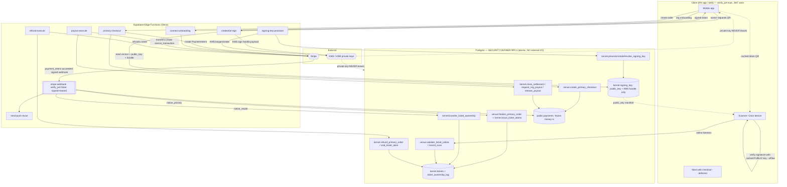

# Phase 2 — Edge Function / Service-Layer Specification

**Status:** BUILD-READY DESIGN SPEC. **Design-only — NO TypeScript, no Deno code, no function bodies.**
Every edge function below is specified so an implementing engineer can author it *without making an
architectural decision*. Where a decision stayed open it is flagged in §9 RECONCILIATION.

**Binding inputs (authority order):**
1. `docs/architecture/PHASE_2_SPEC_FOUNDATION.md` (committed copy of the session SPEC_FOUNDATION) — **BINDING**: §2 integrate-never-rewrite; §4 C33 credential key model + C35
   acting-principal; §8 security invariants (deny-by-default, RPC-only money/custody, constant-time compare,
   **stripe-webhook keeps `verify_jwt=false`**); §7 market-bridge (no native object mutates a `public.*`
   money/custody row except by linking a `public.payments` id).
2. `docs/architecture/PHASE_2_RPC_FUNCTION_CONTRACTS.md` — **primary input.** §13 fixes which transitions are Edge-fronted and the
   DB boundary each wraps; §0.6 the DB-RPC-vs-EDGE distinction. Edge functions **CALL** these atomic RPCs by
   their exact names; they NEVER re-implement a state transition.
3. `docs/architecture/PHASE_2_PHYSICAL_POSTGRES_SCHEMA_SPEC.md` §1.7 (`kernel.signing_key` model) + the five RN reconciliation targets (session working file; all five CONSUMED and CLOSED — see `docs/architecture/_superseded/PHASE_2_IMPLEMENTATION_SPEC_REVIEW.md` §2.2/§5)
   #4 (cacheable signed token + version-bump invalidation).
4. The **existing live edge layer** (`supabase/functions/`): `stripe-webhook`, `create-payment-intent`,
   `confirm-payment`, `confirm-and-release`, `create-connect-account`, `_shared/{stripe,money,payouts,payout-logic,sentry}.ts`.
   New money edges **EXTEND this discipline, never duplicate it.**
5. **The eight delta specs** (door lifecycle, money authority, role model, demographics, promoter codes,
   notifications, CRM export, Apple Wallet) — integrated here as of the Phase-2 consolidation. They contribute
   §0 (the C35 edge rule, from money §8.3(c)), the §5.4 offline-verify correction (from Wallet §11.9 and door
   §9.1/§10.3), and ten new edge functions in §3.6–§3.15, each traced to its source spec and section.
6. `docs/architecture/PHASE_2_PACKAGE_REGISTRY.md` — **canonical** migration numbering. Phase-2 packages are
   `076`–`091`; `071`–`075` are applied production security migrations and are **not** Phase-2 packages. Every
   package number in this file is on that scale. Do not decode a number by arithmetic from an older scale.

**Role labels used in this file are the canonical fifteen (role model §3, ratified O-2).** Venue plane:
`venue_manager` · `venue_finance` · `venue_box_office` · `venue_marketing` · `venue_promoter_manager` ·
`venue_scanner`. **`venue_door` → `venue_scanner` (renamed); `venue_promoter` is removed.** Any `venue_door`
in a cited passage is quoted, not endorsed.

**Golden rule (restated from RPC §0.6 / §0.7):** external I/O (Stripe / KMS / push) lives in an Edge Function;
the atomic state transition lives in a Postgres SECURITY DEFINER RPC. **The edge does the side-effect, then
calls the RPC. The RPC never does external I/O; the edge never writes a `kernel`/`venue`/`market` custody or
money row except through the RPC it wraps.** Money-in is *only* a `public.payments` row via the frozen webhook.

---

## 0. Which client an edge function may use — the C35 edge rule (BINDING, TESTABLE)

> **This section is normative and supersedes any contrary statement elsewhere in this file.** Every function in
> §3, §4 and §8 is classified under it, and no new edge function may be added to this spec without a
> classification. It closes the defect the money-authority spec calls **the single highest-severity correction
> in its document** (`PHASE_2_MONEY_AUTHORITY_SPEC.md` §8.3(c), `SPEC CORRECTION` #9), which observes that the
> requirement was *"currently unstated anywhere in the edge spec."*

### 0.1 The defect, stated once

An edge function holds `SUPABASE_SERVICE_ROLE_KEY`. If it builds its Supabase client from that key and then
invokes a DB-RPC on a human's behalf, then **inside that RPC**:

- `auth.uid()` is **NULL** — so `venue.order.buyer_id = auth.uid()`, `kernel.tickets.current_owner_id =
  auth.uid()`, `auth.uid() <> request.requested_by` (SoD) and every other owner test is false or vacuous;
- `auth.jwt()` is the **service token** — it carries no `uid`, no `aal`, no `amr`, so the step-up predicate
  (money spec §8.3a) cannot fire and dual-control cannot distinguish two approvers;
- every `kernel.has_org_role` / `has_venue_role` / `is_platform` check **silently degrades** — it does not
  raise, it returns false, or (worse) the RPC is written to skip it because "the edge already checked";
- the only way the RPC can then learn who acted is for the **edge to attest the actor as a parameter** — which
  is exactly the client-supplied-authority pattern **ratified row C35 forbids**.

The failure mode is silent. Nothing errors. The call succeeds with no authority behind it.

### 0.2 The rule

Every edge function is exactly one of two classes, and its class is stated in its own spec section.

> **EA-1 (Class A — caller-authorized).** An edge function that invokes **any** DB-RPC which derives authority
> from the caller's identity — `auth.uid()`, `auth.jwt()`, or any `has_org_role` / `has_venue_role` /
> `has_event_role` / `is_platform` / `has_org_role_over_venue` / `has_org_role_over_event` predicate — **MUST
> construct the Supabase client it uses for that call from the caller's own `Authorization` header**, so that
> `auth.uid()` and `auth.jwt()` resolve to the human *inside the transaction*.
>
> **EA-2.** The service-role key **MAY** be used in the same function for work that takes no authority from the
> caller: Stripe and KMS calls, object-storage writes, outbox drains, structured
> logging, and Sentry. It **MUST NOT** be used to invoke a money, custody, or role-authorizing RPC on a human's
> behalf — **ever**, and not "temporarily", and not "because the edge already checked the role."
>
> > **`SPEC CORRECTION` (`S-17`; schema §1.12.1, RPC §17.9; ratification `C106`) — `kernel.record_money_denial`
> > IS REMOVED FROM THIS LIST AND IS AN EA-1 CALL.** It was listed here as service-role work *"that takes no
> > authority from the caller"*, and **its entire purpose is to name the human who was just refused.** On a
> > service-role connection `auth.uid()` is NULL, `kernel.admin_audit.actor_identity` is
> > `NOT NULL FK→auth.users`, and the FK forbids an invented sentinel — **so the call fails on its first
> > attempt, in production, on the fraud path.** *"Repeated failed attempts by ONE PRINCIPAL"* is precisely
> > the fact the row could not carry.
> >
> > **The denial log is the SAME call's second transaction, on the SAME caller-`Authorization` client** the
> > function already built for the RPC that was denied. The database derives the actor itself
> > (`actor_identity := auth.uid()`); **no actor parameter is added**, so EA-6 is honoured rather than
> > excepted. **This EXTENDS EA-1's scope by one function; it weakens nothing**, and it is the one item on
> > the pre-fix EA-2 list that was never external I/O.
>
> **EA-3 (Class B — service-authorized).** A function may use a service-role client for its RPC calls **only**
> when the RPC takes **no** authority from `auth.uid()`. Three shapes qualify and no others:
> **(B-i)** the caller is not a human — Stripe (`stripe-webhook`), Apple (`wallet-pass-webservice`), APNs, a
> scheduler, or the outbox; **(B-ii)** the RPC is `REVOKE EXECUTE FROM anon, authenticated, public` and
> definer/`service_role`-only by contract; **(B-iii)** the function's authorization is a **non-JWT bearer
> credential** verified constant-time in the function itself (a Stripe signature, a per-pass
> `authenticationToken`, a door session). In (B-iii) the function's own check **is** the authority and must be
> specified as such — see EA-5.
>
> > **`S-17` — `kernel.record_money_denial` is NOT a member of (B-ii), and reading it as one is what broke
> > it.** (B-ii) is about RPCs that take **no** authority from `auth.uid()`. This one **derives its only
> > meaningful column from `auth.uid()`** and **RAISES when it is NULL** (RPC §17.9), so a service-role
> > client makes it fail rather than succeed silently — the fail-closed direction, but a failure on the fraud
> > path all the same. **The genuine money members of (B-ii) are the state-sync RPCs and the sweeps**:
> > `kernel.mark_payout_transfer_state` (RPC §20.7.6), `kernel.mark_refund_state` (§20.7.7),
> > `kernel.sweep_expired_ticket_atoms` (§12.5) and the four other sweeps — all of which really do have no
> > human actor and are served by the `SN-SYSTEM` sentinel (schema §1.16).
>
> **EA-4.** `verify_jwt` is **not** the classification. `verify_jwt: true` proves a JWT was present; it does not
> prove the RPC saw it. A function may be `verify_jwt: true` and still be broken under EA-1 if it then calls the
> RPC with the service client. **This is precisely the `wallet-pass-issue` defect (§3.10).**
>
> **EA-5.** A Class B (B-iii) function MUST state (a) what credential authorizes it, (b) that the comparison is
> constant-time (`timingSafeEqual`, I-9), (c) the exact scope that credential grants — one serial, one session,
> one device — and (d) that an unknown subject and a wrong credential return the **same** status with the same
> timing budget (no enumeration oracle).
>
> **EA-6.** No edge function passes an actor id, a role, an org id's *authority*, or any "the caller is allowed"
> assertion into an RPC as a parameter. Scope **ids** are passed and are untrusted; the RPC re-checks them
> in-body against live tables (RPC §0.1). Actor is derived, never supplied (C35).
>
> **EA-7.** A Class A function that cannot obtain a caller `Authorization` header **fails closed** with `401`.
> It does not fall back to the service client. There is no degraded mode.
>
> **EA-8 (`verify_jwt` is a property of the DEPLOYMENT UNIT, never of a route). `SPEC CORRECTION` —
> `EDGE-2`.** A Supabase edge function carries **one** `verify_jwt` setting for the whole function; it is set
> per function at deploy time (§1's `config.toml` note). A specification that gives two routes of one function
> two different `verify_jwt` values is therefore **not a specification** — it is unimplementable, and the way
> an unimplementable spec gets implemented is that somebody picks the permissive value and writes a comment.
> This document did that twice (`crm-export` §3.7, `door-manifest` §3.9b). Binding, from here:
>
> 1. **One value per function.** A function's spec states **exactly one** `verify_jwt` value. Two values ⇒
>    **two deployed functions**, or one route deleted. There is no third outcome.
> 2. **A route whose authority is a human JWT MUST NOT share a deployment with a route reachable without
>    one.** This is the only combination the rule exists to prevent, and it is not a code-review matter: the
>    permissive resolution leaves the human route **one forgotten `getUser()` away from an unauthenticated
>    version of whatever that route returns**. For `crm-export` `/download` that is the venue's entire
>    attendee contact list.
> 3. **Routes may differ in auth *model* within one function** — Class B on one path, Class A on another —
>    **only** where clause 2 is satisfied and the two routes **do not share a Supabase client**. The spec must
>    then name which route is which class. `wallet-pass-push` (§3.12) is the sanctioned instance.
> 4. **A machine credential checked in-function travels in a dedicated header, never in `Authorization`.**
>    Under `verify_jwt: true` the gateway claims `Authorization`; under `verify_jwt: false` reusing it invites
>    the same confusion in the other direction. One header, one meaning.
> 5. **Prefer `verify_jwt: true`, and *"the caller is a machine"* is not an argument for `false`.** A
>    `pg_cron` / `pg_net` caller presenting the project's **JWT-format** service-role key satisfies the
>    gateway — `VERIFIED:` migrations `014_frequent_cron_schedules.sql` and `032_pre_testflight_blocker_fixes.sql`
>    send exactly that bearer today, and §3.14/§3.15 already specify cron-invoked functions at
>    `verify_jwt: true`. §7's `verify_jwt=false` enumeration is a **security budget**, not a convenience;
>    every member is argued or it is not a member.
>
> **Why `verify_jwt: true` is a structural control and not a decorative one.** It moves the anonymous-request
> rejection **out of the function and into the platform gateway**, before any handler code runs. That does not
> make the function's own authorization optional — EA-4 still holds, and a JWT arriving is still not the RPC
> seeing it — but it does mean that the *specific* catastrophe in clause 2 is no longer reachable by omission.
> A missing check inside a `verify_jwt: true` function yields an **under-authorized** call by an identified
> principal; the same omission inside a `verify_jwt: false` function yields an **unauthenticated** one. Those
> are not the same severity and the spec must stop treating the choice as a deployment detail.

### 0.3 How it is tested (this is why the rule is written this way)

Each is a build-time or CI check, not a code-review convention:

| # | Test | Passes when |
|---|---|---|
| **T-1** | Static: grep each function for a service-role client reaching an RPC named in the Class-A column of §8 | zero hits |
| **T-2** | Integration: invoke each Class-A function with a **valid JWT for a user who lacks the role**, service-role key present in env | RPC raises `insufficient_privilege` (42501). A `200` proves the service client was used |
| **T-3** | Integration: invoke each Class-A function with **no** `Authorization` header | `401`, no RPC call, no side-effect (EA-7) |
| **T-4** | Integration: assert `auth.uid()` observed inside the RPC equals the JWT's `sub` | equal for every Class-A function |
| **T-5** | Static: no RPC parameter in any function is named `p_actor*`, `p_caller*`, `p_user_id`, `p_role*`, or equivalent | zero hits (EA-6) |
| **T-6** | Integration, Class B (B-iii): wrong credential and unknown subject | identical status, identical timing budget (EA-5d) |
| **T-7** | Static, **EA-8 clause 1**: parse every function's spec section for `verify_jwt` values | exactly **one** value per function. Two values in one section is a build failure, not a review comment |
| **T-8** | Static, **EA-8 clause 2**: for each deployed function, intersect *(routes whose authority is a caller JWT)* with *(routes reachable without one)* | empty for every function |
| **T-9** | Static, **the split's structural half — an absence, not a behaviour**: `CRM_EXPORT_WORKER_SECRET` in the `crm-export` (actor) deploy manifest, env list, or source | **zero hits.** The actor deployment has no worker credential to succeed with, so a worker-path coding error there cannot authorize itself |
| **T-10** | Static, the split's other half: `createSignedUrl`, `/download`, or `authorize_export_download` in the `crm-export-worker` bundle | **zero hits.** Reaching a signed URL from the worker is not an omission bug; it requires adding code |
| **T-11** | Integration: `crm-export` (actor) invoked with the **worker credential and no user JWT**; `crm-export-worker` invoked with a **valid exporter's JWT and no worker header** | both **403**, no job claimed, no URL minted. Neither deployment serves the other's caller |
| **T-12** | Integration, both: **no `Authorization` header at all** | **401 emitted by the platform gateway before any handler runs** — asserted by the *absence* of a function log line, which is what distinguishes a gateway rejection from an in-function one and is the entire reason EA-8 clause 5 prefers `verify_jwt: true` |

`INFERENCE:` the tests are this spec's; the money spec states the rule but names no test.

### 0.4 Classification of every edge function

**Class A — caller-authorized. MUST build the RPC client from the caller's `Authorization` header.**

| Fn | § | Why Class A — the caller-identity predicate that would silently degrade |
|---|---|---|
| `primary-checkout` | §3.1 | `venue.create_primary_checkout` binds the hold and the order to `auth.uid()`; the on-behalf door path resolves the buyer from the *principal*, not the body |
| `credential-sign` | §3.2 | `kernel.tickets.current_owner_id = auth.uid()` is the entire authorization |
| `connect-onboarding` | §3.3 | `has_org_role([org_owner, org_finance])` |
| `payout-execute` | §3.4 | `has_org_role([org_finance, org_owner])`; `is_platform`; SoD `auth.uid() = payout_destination_set_by` refusal; step-up `aal`/`amr` — **named explicitly by money §8.3(c)** |
| `refund-execute` | §3.5 | buyer-own-order, `has_org_role([org_finance])`, `is_platform` capped, second-approver SoD — **named explicitly by money §8.3(c)** |
| `signing-key-provision` | §3.6 | `is_platform([platform_admin])` |
| `wallet-pass-issue` | §3.10 | `kernel.mint_wallet_pass` authorizes atom current owner via `auth.uid()` — **was self-contradictory; resolved here** |
| `pass-cert-provision` | §3.13 | `is_platform([platform_admin])` |
| `crm-export` | §3.7 | **one route, `/download`.** Export allow-list by `has_venue_role` / `has_org_role`, **re-authorized live at download** (EX-4). The worker routes are no longer in this deployment — see `crm-export-worker` below (EA-8) |
| `promoter-code-preview` | §3.8 | rate-limited per `auth.uid()`; eligibility is caller-scoped |
| `door-manifest` | §3.9b | `has_venue_role([venue_scanner, venue_manager])` on a **staff JWT**. **Single-route function** — the former PIN route is deleted and served by `door-session` `/manifest/sync` (EA-8, §3.9b) |

**Class B — service-authorized. The caller is not a human, or the credential is not a JWT.**

| Fn | § | Sub-class | What actually authorizes it |
|---|---|---|---|
| `stripe-webhook` | §4 | B-i + B-iii | Stripe HMAC-SHA256 `v1` signature, `timingSafeEqual`, ±300s replay window, `claim_stripe_webhook_event` lease. `verify_jwt=false` (frozen, I-10) |
| `wallet-pass-webservice` | §3.11 | B-i + B-iii | Apple devices present `Authorization: ApplePass <token>`; per-pass `authenticationToken` compared constant-time against `auth_token_hash`; authorizes **one serial only**. `verify_jwt=false` — **a member of §7's enumeration, which is the only place that set is characterized. This cell states no count** (it previously said *"one of five"*, which went stale the moment `EDGE-2` took the count to four — the precise failure mode the no-count-outside-§7 rule exists to prevent) |
| `wallet-pass-push` | §3.12 | B-i | outbox drain / scheduler; wraps `record_wallet_push_result`, a definer-only writer. Its `is_platform` *manual* re-drive route is **Class A** (§3.12) |
| `notify-dispatch` | §3.14 | B-i | scheduler/outbox drain; no human caller exists |
| `notify-receipts` | §3.15 | B-i | provider (Expo/APNs) receipt poll; no human caller exists |
| **`crm-export-worker`** | §3.7 | B-i | **NEW deployment (EA-8).** `pg_cron` drains `/build` and `/purge`; no human caller exists and none may. `verify_jwt: true` (the cron bearer is a project-signed JWT) **plus** a constant-time `CRM_EXPORT_WORKER_SECRET` in a **dedicated header**. Both wrapped RPC sets are definer / `service_role` only. **Carries no download handler and cannot mint a signed URL** |
| `door-session` | §3.9a | B-iii | **two credentials in sequence.** A `venue.door_pin` — a loginless device credential with no `auth.uid()` (role model §7.2) — **provisions**; the **door session token** (§3.9a: `door_session_id` + 256-bit secret, stored as a hash, presented on every subsequent call) **authorizes**. `kernel.assert_door_session(p_device_id, p_session_id, p_door_session_id, p_session_token)` is the authority and is called on **every relay call**; the device id comes from its **return value**, never the request. RM-5 forbids a door session from ever being an RLS predicate |

**Consequence for the door plane (role model §7.2/§7.3, RM-5):** a door session carries no `auth.uid()`, so
**no** door-session route may invoke a caller-identity RPC. Everything the door does reaches the DB through
definer RPCs whose authority is `kernel.assert_door_session`. This is not an EA-2 exemption — it is EA-3
(B-iii): the door PIN provisions and the **door session token** is the credential, deliberately weaker than a
JWT, which is why O-4 denies the door principal the manifest-open authority (§3.9). **`assert_door_session` is
the only gate on this plane — RLS is bypassed entirely behind it — which is why §3.9a specifies what the device
actually holds and what every relay call must re-check. A predicate that verifies provisioning rather than
possession is not a gate (H-3).**

### 0.5 What this does NOT change

The RPC still re-checks its predicate in-body against live tables. EA-1 does not move authority into the edge —
it makes the edge stop *destroying* the authority the RPC was written to check. It is what makes §3.4/§3.5's
promise — *"the edge passes ids; the RPC decides — no role logic in the edge"* — true rather than aspirational.

---

## 1. Existing edge layer — the discipline we extend (do not re-derive)

These live functions are the anchors. Every new function inherits their patterns; the specs below cite them
rather than re-describe them.

| Existing fn | Auth | Role in Phase 2 | Reused discipline (the pattern new edges MUST copy) |
|---|---|---|---|
| `stripe-webhook` | **`verify_jwt=false`** (Stripe-signed) | **EXTENDED** for native/primary events (§4) | HMAC-SHA256 signature verify with multi-`v1` rotation support; ±300s replay window; `claim_stripe_webhook_event`/`complete_*`/`fail_*` **lease** (migrations 064/069); fail-CLOSED on claim error; non-2xx ⇒ Stripe retries; `timingSafeEqual`; CORS whitelist + security headers |
| `create-payment-intent` | JWT (Bearer) | **Template** for `primary-checkout` (§3.1) | server-authoritative pricing (never client amount); `check_rate_limit` fail-closed (429/503); get-or-create Stripe Customer + ephemeral key; **deterministic PI idempotency key** salted by failed-attempt count + customer id; `stripe_livemode` recorded from Stripe's own field; structured stage logging, no secrets |
| `confirm-payment` | JWT | untouched (external rail) | synchronous confirm fallback; webhook remains authoritative |
| `confirm-and-release` | JWT | **Template** for `payout-execute` (§3.4) | payout via `_shared/payouts.ts` (capability pre-flight → funding-charge verify → `source_transaction` transfer) |
| `create-connect-account` | JWT | **Template/generalized** by `connect-onboarding` (§3.3) | Stripe Connect Express account create + onboarding link; capability-flag sync via `account.updated` |
| `_shared/stripe.ts` | — | **reuse as-is** | pinned `STRIPE_API_VERSION` / `STRIPE_MOBILE_API_VERSION`; `stripeFetch`/`stripeFetchRaw` |
| `_shared/payout-logic.ts` | — | **reuse as-is** | `buildPayoutIdempotencyKey(transferId, destination)` (deterministic, destination-salted); Stripe error classifier |
| `_shared/payouts.ts` | — | **reuse/extend** | `source_transaction` funding + deterministic idempotency payout shell |
| `_shared/sentry.ts` | — | **reuse as-is** | `captureException(fn, err, ctx)` |
| `send-push`, `notify-transfer`, `notify-report`, `delete-account`, `auto-finalize-auctions`, `enforce-transfer-expiry` | mixed | untouched | native rail reuses `send-push`; native auction MVP reuses `auto-finalize-auctions` (RPC §16.5) |

**Note on `config.toml`:** this tree carries no `supabase/config.toml`; `verify_jwt` is set per-function at
deploy time. Every new function's required `verify_jwt` value is stated in its spec. **Every user-facing edge
runs `verify_jwt=true` and re-derives the actor (C35).** The `verify_jwt=false` surfaces are enumerated in
**§7, and only in §7** — this note states no count.

> **`SPEC CORRECTION` (`EDGE-1`).** This note previously read *"Only Stripe/KMS-webhook endpoints run
> `verify_jwt=false`"*. That was false against §7's own enumeration the moment it was written: only
> `stripe-webhook` is a Stripe/KMS webhook, while `wallet-pass-webservice` (Apple), `door-session` (a
> loginless door) and `promoter-code-preview` (an anonymous buyer) are none of those things. The sentence was
> the same defect §7 records in a different grammar — a **category assertion** made far from the enumeration,
> which is exactly how *"second and last"* survived in four documents.
> **No section outside §7 may characterize the set, by count or by category** — and this correction notice
> now obeys its own rule: it names members to show the category claim was false, and states no total.
> (`crm-export`'s worker routes were members when this notice was written; `EDGE-2` removed them by moving
> both to `verify_jwt: true`. **A historical notice that restates a live count becomes a stale count**, which
> is the same defect one layer up.)

---

## 2. Placement decision table — challenge each candidate

For every candidate the verdict is one of: **RPC** (pure atomic DB transition → stays in Postgres, NOT an edge
fn) · **NEW EDGE** (external I/O / secrets / third-party) · **EXTEND WEBHOOK** (add a branch to the existing
`stripe-webhook`) · **DOOR-SIDE** (runs on the scanner device, no server round-trip) · **NODE/NEXT** (existing
web server). **Rejections are the high-value output — they keep atomic transitions in the DB where they belong.**

| Candidate | Verdict | Why | Wraps / lands in |
|---|---|---|---|
| Create PaymentIntent for a native **primary** order | **NEW EDGE** `primary-checkout` | needs `STRIPE_SECRET_KEY`, customer/ephemeral key, server price authority | calls `venue.create_primary_checkout` (RPC §6.1) for the total; mints PI |
| Confirm native primary payment → **issue atoms** | **EXTEND WEBHOOK** | authoritative money-in event; must ride the frozen signed+leased path (I-10) | `payment_intent.succeeded` branch → `venue.finalize_primary_order` (RPC §6.3) |
| Native **resale/market** payment → transfer custody | **EXTEND WEBHOOK** | same as above; one signed endpoint, one lease table | `payment_intent.succeeded` (rail=native_resale) → `kernel.transfer_ticket_ownership` path via `market` accept, or C25 sweep |
| **Credential signing** (QR token) | **NEW EDGE** `credential-sign` | KMS custody; private key must never touch DB/client (C33) | reads `kernel.tickets`/`kernel.signing_key`; KMS sign |
| **Signing-key provisioning / rotation** | **NEW EDGE** `signing-key-provision` | KMS keygen/rotate/revoke is external I/O | wraps `kernel.provision/rotate/revoke_signing_key` (RPC §13) |
| **Refund executor** (Stripe refund) | **NEW EDGE** `refund-execute` | `stripe.refunds.create` is external; DB only records intent + voids atoms | wraps `kernel.refund_primary_order` / `admin_refund` / `catalog.cancel_event` (RPC §11.4/§4.4) |
| **Payout executor** (Stripe Connect transfer) | **NEW EDGE** `payout-execute` | `stripe.transfers.create` w/ `source_transaction` is external | wraps `kernel.close_settlement` / `request_org_payout` / `release_payout` (RPC §10.2/§10.3/§11.3) |
| Org/venue **Stripe Connect onboarding** | **NEW EDGE** `connect-onboarding` (generalizes `create-connect-account`) | Stripe Account + AccountLink creation | writes `kernel.organization` connect ref via RPC; capability sync via webhook |
| **Online scan validate** (`scan-validate`) | **REJECTED → RPC + DOOR-SIDE** | no secret, no third-party. Liveness is a pure read; signature check uses the *public* key the door already caches | `venue.validate_ticket_online` (RPC §9.3) + door-side verify (§5.4) |
| **Offline scan reconcile** (`scan-reconcile`) | **REJECTED → RPC** | pure atomic batch DB write, no external I/O | `venue.reconcile_offline_scans` (RPC §9.5) — device calls it directly with its JWT/door principal |
| All custody transitions (issue/transfer/void/lock/scan) | **REJECTED → RPC** | atomic single-writer state machine; §5 SSCAS; no external I/O | the three kernel engines (RPC §7) |
| P2P start/accept/cancel, listing create, offer, order create | **REJECTED → RPC** | atomic DB transitions | `market.*` / `venue.*` RPCs |
| TTL & C25 **sweeps** (`sweep_expired_p2p_transfers`, `sweep_paid_pending_sales`) | **REJECTED → RPC via scheduler** | pure DB batch; invoked by `pg_cron`/scheduler, not an edge | RPC §12.2/§12.3 |
| Settlement-open, role grants, config edits, door-PIN issue | **REJECTED → RPC** | single-aggregate DB writes | `venue.*`/`kernel.*` RPCs |
| Push on native events | **REJECTED → reuse `send-push`** | already exists | webhook & RPCs fire `send-push` |
| Native web checkout surface | **NODE/NEXT (deferred)** | the `web/` Next app fronts browser checkout; still calls the same edges | out of MVP edge scope |

**Delta-spec candidates (added by the eight delta specs; each traced to its source in §3).**

| Candidate | Verdict | Why | Source spec |
|---|---|---|---|
| Build + sign the `.pkpass` | **NEW EDGE** `wallet-pass-issue` (§3.10) | KMS sign with the Apple Pass Type ID key; object-storage write | Wallet §11.8 |
| Apple PassKit device web service | **NEW EDGE** `wallet-pass-webservice` (§3.11) | iOS presents `Authorization: ApplePass`, not a JWT; a `verify_jwt=false` surface — **§7 holds the enumeration** | Wallet §6.1 |
| APNs pass-update push | **NEW EDGE** `wallet-pass-push` (§3.12) | APNs is external I/O; outbox-driven | Wallet §6.3 |
| Apple pass-type certificate provisioning / rotation | **NEW EDGE** `pass-cert-provision` (§3.13) | KMS import/keygen, out-of-band Apple step | Wallet §8.4 |
| Sign the **ticket** manifest (M2) for parity with M1 | **NEW EDGE (optional)** `door-manifest` (§3.9) | KMS sign; deterministic over the digest, so re-signing is free | Door §16 OQ-7 |
| Mint + validate the loginless door session | **NEW EDGE** `door-session` (§3.9) | the door PIN is a non-JWT credential; the scan/sync/offline-batch relay needs `service_role` because a door session has **no `auth.uid()`** | Role model §12 rows 21–22 |
| Notification dispatch (claim → render → Expo/Resend → record) | **NEW EDGE** `notify-dispatch` (§3.14) | third-party push/email transport, batching, retry, receipts | Notifications §4.6, §6.4 |
| Provider receipt poll + dead-token revocation | **NEW EDGE** `notify-receipts` (§3.15) | polls Expo's receipts endpoint on a cron | Notifications §4.6 |
| CRM export build + signed download | **NEW EDGE** `crm-export` (§3.7) | CSV serialization + private-bucket streaming + `createSignedUrl` are Storage I/O | CRM §11.5 |
| **Delete the export artifact from Storage** (retention sweep · revoke · orphan reconciliation) | **NEW ROUTE** `crm-export` `POST /purge` (§3.7) | **A `SECURITY DEFINER` Postgres function cannot call the Storage API**, and `DELETE FROM storage.objects` orphans the bytes. The *state transitions* stay RPCs on `pg_cron`; **only the byte delete is an edge route** | CRM §6.6, §11.5 |
| Promoter-code preview at checkout | **NEW EDGE** `promoter-code-preview` (§3.8) | `public.check_rate_limit` is `GRANT EXECUTE … TO service_role` only, so a rate-limited preview **cannot** be a plain PostgREST RPC | Promoter §7.10 |
| Demographic capture / holder-mix aggregation | **REJECTED → RPC** | deliberately no edge function: *"the demographic value never crosses a process boundary — no HTTP body, no function log, no error breadcrumb"* | Demographics §5.4 |
| `crm-export-deliver` (email the CSV) · CDP/webhook sync | **REJECTED — never build** | EX-6 / X-5 / C40 — a third-party destination with extra steps, in an inbox that outlives every control | CRM §11.5, Demographics §9 X-5 |
| Synchronous `GET /attendees.csv` | **REJECTED** | EX-2: an export is an audited, revocable, re-authorized job, not a download | CRM §11.5 |
| Export sweep / expiry | **REJECTED → RPC via `pg_cron`** | pure DB batch + one Storage delete, which rides the existing worker route | CRM §11.5 |
| Row selection for the export in TypeScript | **REJECTED → RPC** | a query assembled in the edge is invisible to catalog assertions and pgTAP; the SQL must be one named catalog object | CRM §11.5 |
| A second push function for the 40 new notification types | **REJECTED → `notify-dispatch`, NOT `send-push`** | §2's original *"reuse `send-push`"* verdict is right about **transport** and wrong about **pipeline**: `send-push` has no batching, no receipt loop, no retry, no idempotency and no preference check. `send-push` stays for the 15 legacy types and is **not extended** | Notifications §6.4 (`SPEC CORRECTION` to this table) |

**Net new edge functions: 17** — the original 6 (`primary-checkout`, `credential-sign`,
`signing-key-provision`, `refund-execute`, `payout-execute`, `connect-onboarding`) **+ 11 from the delta specs**
(`crm-export`, **`crm-export-worker`**, `promoter-code-preview`, `door-session`, `door-manifest` *(optional)*,
`wallet-pass-issue`, `wallet-pass-webservice`, `wallet-pass-push`, `pass-cert-provision`, `notify-dispatch`,
`notify-receipts`) **+ 1 extended** (`stripe-webhook`). Every one is classified under §0.4.
**16 → 17 by `EDGE-2`**: `crm-export` split into an actor function and a worker function, because one
deployed function cannot carry two `verify_jwt` values (EA-8). **A count of deployed functions is a count of
`verify_jwt` settings** — that is the whole reason this total moved.

---

## 3. New / extended function specifications

Fields per §0 of the brief: name · method · auth · authz · request · response · DB-RPC · Stripe/KMS · secrets
(names only) · rate limit · idempotency · retries · logging · Sentry · abuse · failure · timeout.

### 3.1 `primary-checkout` — create the PaymentIntent for a native primary order — **NEW EDGE**

- **Method:** `POST` (+ `OPTIONS` preflight). **verify_jwt:** `true`.
- **Authentication:** Supabase JWT (Bearer), verified via `auth.getUser(token)` (copy `create-payment-intent`
  §getAuthenticatedUser). Actor = `user.id` (C35: server-derived, never a body field).
- **Authorization:** any `authenticated` fan (self-checkout) OR a door/staff principal buying on-behalf — the
  **on-behalf buyer id is set by the RPC from the door principal, never trusted from the body.** No role check
  here beyond authentication; authority for issuance lives in `finalize_primary_order`.
- **Request:** `{ session_id: uuid, items: [{ ticket_type_id: uuid, quantity: int }], hold_ids: [uuid],
  command_key: string, expected_total_cents?: int (optional client cross-check) }`.
- **Response:** `{ order_id, clientSecret, paymentIntentId, amount, buyer_fee, seller_fee, total,
  customerId, customerEphemeralKeySecret }` (shape mirrors `create-payment-intent`).
- **DB-RPC called:** `venue.create_primary_checkout(p_session_id, p_items, p_hold_ids, p_command_key)` (RPC
  §6.1) → returns `{ order_id, total_minor, currency }`. **The total is server-authoritative from this RPC;**
  the edge NEVER computes or trusts a client price. If `expected_total_cents` disagrees → `409` (copy the
  `totalMismatch` guard).
- **Stripe:** get-or-create Customer + ephemeral key (reuse `ensureStripeCustomerAndEphemeralKey`); create a
  PaymentIntent for `total_minor`, `currency='usd'`, `automatic_payment_methods`, metadata
  `{ rail:'native_primary', order_id, buyer_id, org_id, session_id }`. Records the `public.payments` row
  (frozen table) with the new `order_id` linkage column and `stripe_livemode` from Stripe's own field.
- **Secrets:** `STRIPE_SECRET_KEY`, `SUPABASE_URL`, `SUPABASE_SERVICE_ROLE_KEY` (env names only).
- **Rate limit:** `check_rate_limit(user, 'primary-checkout', 5, 60)`, **fail-closed** (503 on limiter error,
  429 on over-limit) — copy `create-payment-intent`.
- **Idempotency:** (a) RPC dedupes on `UNIQUE(buyer_id, command_key)` → replay returns the same `order_id`;
  (b) **deterministic PI idempotency key** `pi_native_${order_id}_${total}_c${customerId}` salted with a
  failed-attempt suffix `_r${n}` (copy the create-PI salting rule — a canceled PI must not replay). A double-tap
  returns the same PI + clientSecret.
- **Retries:** safe (both keys). A pending PI is retrieved and its clientSecret re-returned; a canceled PI is
  retired and a fresh salted PI minted (copy `create-payment-intent`).
- **Logging:** structured `{tag:'primary-checkout-stage', stage, order_id, pi_id, amount}` — **never** log
  client_secret, tokens, or PII. **Sentry:** `captureException('primary-checkout', err)` on non-auth 500s;
  auth errors log as 401 warnings (don't flood quota).
- **Abuse:** rate limit + per-user active-hold cap enforced in the RPC (C5); buyer-can't-buy-own via the RPC's
  listing/seller check; holds must belong to the buyer and be unexpired.
- **Failure:** RPC `precondition_failed` (stale/expired hold, session not on-sale) → 409; Stripe failure → 500
  + PI cancel of any orphan; DB-insert 23505 race → return the winner's clientSecret (copy the recovery path).
- **Timeout:** target < 8s wall; Stripe calls have no long polls here. On timeout the client retries with the
  same `command_key` → idempotent.

> **Confirmation is NOT synchronous here.** `primary-checkout` only creates the PI. Authoritative issuance
> happens when `payment_intent.succeeded` reaches the extended webhook (§4). This mirrors the external rail and
> satisfies §6.2 (`confirm_primary_payment_server_side` is realized as a webhook branch, not a separate confirm
> edge) — one signed, leased, replay-safe money-in path.

### 3.2 `credential-sign` — mint the cacheable signed ticket credential (C33) — **NEW EDGE**

Full C33 architecture is in §5. This is the request/response contract.

- **Method:** `POST`. **verify_jwt:** `true`.
- **Authentication:** Supabase JWT (Bearer). Actor = `user.id`.
- **Authorization:** actor **must be the atom's current owner** (`kernel.tickets.current_owner_id = auth.uid()`,
  re-read live inside the request — never a client claim). A non-owner → 403. (Door verification does NOT call
  this; the door verifies with the *public* key — §5.4.)
- **Request:** `{ ticket_atom_id: uuid }`. (No version or key id from the client — both are resolved
  server-side; a client-supplied version is ignored.)
- **Response:** `{ token: <compact signed token>, credential_version: int, signing_key_id: uuid,
  not_after: timestamptz, ttl_seconds: int }`. `token` is the only signed artifact; it embeds
  `{ atom_id, session_id, credential_version, key_id, issued_at, exp }` as signed claims.
- **DB-RPC / reads:** reads `kernel.tickets` (`current_owner_id, state, resale_state, credential_version,
  signing_key_id, event_session_id`) and `kernel.signing_key` (`key_id, kms_handle_ref, status, not_before,
  not_after`) for the atom's active signer. **No state write** — signing does not mutate custody. (A transfer
  bumped `credential_version` in the RPC layer already; this fn just signs the current head.)
- **KMS:** `KMS.sign(kms_handle_ref, canonical_payload)` — asymmetric sign (Ed25519 / ECDSA-P256). **The
  private key never leaves KMS; the edge holds only a handle.** See §5.
- **Secrets:** `KMS_SIGNER_ROLE_ARN` / `KMS_ENDPOINT` / provider creds (env names only — an IAM role/handle,
  never key material), `SUPABASE_URL`, `SUPABASE_SERVICE_ROLE_KEY`.
- **Rate limit:** `check_rate_limit(user, 'credential-sign', 30, 60)` — generous (wallet refresh, reconnect
  re-sign), fail-closed. Per-atom sign throughput target §5.7.
- **Idempotency:** **naturally idempotent** — same `(atom_id, credential_version)` ⇒ deterministic claims ⇒ the
  token is byte-reproducible if the signer is deterministic (Ed25519) or functionally equivalent (any valid
  signature verifies). No dedup row needed. A **version bump invalidates every previously issued token** for
  that atom (recon #4): old tokens carry a stale `credential_version` and fail the door's version check.
- **Retries:** safe/read-only; client may re-sign freely. On KMS transient error → 503 + `Retry-After`.
- **Logging:** `{tag:'credential-sign', atom_id, credential_version, key_id, outcome}` — **never** log the
  token, the payload, or any key material. **Sentry:** capture KMS failures + owner-mismatch spikes (fraud
  signal).
- **Abuse:** owner-only; rate-limited; a revoked/`voided`/`scanned` atom → 409 (no live credential for a dead
  ticket); a `listed`/`locked` atom still signs (the door rejects `listed/locked` at scan, RPC §9.3) — or,
  per policy, refuse to sign a listed atom to reduce screenshot-resale confusion (flagged §9.2).
- **Failure:** owner mismatch 403; atom terminal 409; no active signing key for scope 500 + Sentry (an
  ops-critical gap — an event with issued atoms but no active key); KMS down 503.
- **Timeout:** target < 2s; KMS sign is single-digit ms. Offline clients never call this — they use the cached
  token (§5.6).

### 3.3 `connect-onboarding` — org/venue Stripe Connect onboarding — **NEW EDGE (generalizes `create-connect-account`)**

- **Method:** `POST`. **verify_jwt:** `true`.
- **Authentication:** JWT. Actor = `user.id`.
- **Authorization:** `kernel.has_org_role(p_org_id, [org_owner, org_finance])` — re-checked in the wrapped RPC
  (edge passes the org id; the RPC decides). The **payee is the org (`kernel.organization`), not an individual**
  — this is the Phase 2 change from the per-seller `create-connect-account`.
- **Request:** `{ org_id: uuid, return_url: string, refresh_url: string, command_key: string }`.
- **Response:** `{ connect_account_id, onboarding_url, status }`.
- **DB-RPC:** a `kernel.set_org_connect_ref(p_org_id, p_connect_account_id, p_command_key)` writer records the
  Connect account id on `kernel.organization` (audited) — **reuses existing connect ids where an org already
  has one** (SPEC_FOUNDATION §2, "reuse existing connect ids"). Edge never writes the org row directly.
- **Stripe:** `Account` (Express) create if none; `AccountLink` create for onboarding (copy
  `create-connect-account`). Capability flags (`charges_enabled`/`payouts_enabled`/`details_submitted`) are
  synced by the **extended webhook** `account.updated` branch (§4), matched by `connect_account_id` → org.
- **Secrets:** `STRIPE_SECRET_KEY`, `SUPABASE_URL`, `SUPABASE_SERVICE_ROLE_KEY`.
- **Rate limit:** `check_rate_limit(user, 'connect-onboarding', 5, 60)`, fail-closed.
- **Idempotency:** Stripe `Account` create keyed `connect_org_${org_id}` (deterministic; one account per org);
  RPC dedupe on `command_key`.
- **Retries/Logging/Sentry/Timeout:** copy `create-connect-account`. **Abuse:** org-role-gated; a fan cannot
  onboard. **Failure:** role fail 403; Stripe fail 500. **Timeout:** < 8s.

### 3.4 `payout-execute` — Stripe Connect transfer executor — **NEW EDGE**

- **Method:** `POST` (invoked by an authenticated finance user OR by a scheduler/service principal for the
  settlement-close disbursement leg). **verify_jwt:** `true` (see abuse note for the service-principal path).
- **Authentication:** JWT. Actor = `user.id`.
- **Authorization:** the wrapped RPC enforces role: `has_org_role([org_finance, org_owner])` for
  `request_org_payout`; `is_platform([platform_risk, platform_admin])` (dual-control seam) for `release_payout`.
  The edge passes ids; the RPC decides — no role logic in the edge.
- **Request:** `{ action: 'close_settlement' | 'request_org_payout' | 'release_payout', settlement_id?, org_id?,
  payout_id?, command_key }`.
- **Response:** `{ status, payout_ids: [uuid], stripe_transfer_refs: [string] }`.
- **DB-RPC:** `kernel.close_settlement` (§10.2) → generates `kernel.payout` intents; `kernel.request_org_payout`
  (§10.3) → advances `pending→submitted`; `kernel.release_payout` (§11.3) → resumes a held payout. **The DB
  records the payout intent + advances state; the edge executes the Stripe transfer** and writes back the
  `stripe_transfer_ref` **through `kernel.mark_payout_transfer_state`** (RPC §20.7.6). Order: **RPC-first to
  claim `submitted` under lock, THEN Stripe transfer, THEN the state-sync RPC to record the ref** — so a
  crash after transfer is recovered by the deterministic idempotency key, never a double-pay.
  - **THIS FUNCTION IS THE WRITER OF `failed`, and that is a correction to §4 (`S-16`; ratification
    `C104`).** A transfer that cannot be created fails as a **synchronous Stripe API error** — there is no
    `transfer.failed` event — so the failure is known **here**, in the request that caught it, and nowhere
    else. The edge calls
    `kernel.mark_payout_transfer_state(payout_id, 'failed', tr_…, failure_code, command_key)` with the class
    `payout-logic.ts` already produces. §4 routed `failed` to a webhook that will never fire, which is why a
    failed transfer read `submitted` forever and dashboard §14.5's pinned *Failed payout* banner could never
    fire. **`insufficient_funds` before `source_transaction` funding stays an operational state, not a
    `failed` payout** — it is retried, not terminal, and the existing classifier already separates the two.
  - **`paid` under `O16` form (a)** — *"the transfer succeeded and was not reversed"* — is written here too,
    synchronously, on the `transfers.create` return. **`O16` is an OWNER DECISION and is not taken by this
    spec**; under form (b) the same RPC is called from a `payout.paid` fan-out instead and this bullet moves.
    Recorded so the choice sits in one place rather than being implied by whichever handler someone writes
    first.
  - **Class B (`EA-3` B-ii) for the state-sync call only.** `mark_payout_transfer_state` is
    `service_role`-only with **no human path**, so the service client is correct for it; the
    caller-`Authorization` client remains mandatory for `close_settlement` / `request_org_payout` /
    `release_payout` (EA-1), where every predicate reads `auth.uid()`.
  - **It never clears a hold.** The RPC **refuses** to advance a payout whose `hold_state <> 'none'` and the
    edge must surface that refusal rather than retrying it: **a held payout Stripe reports as paid is a
    reconciliation incident for `platform_risk`, not a state transition.** Clearing a hold by webhook would
    defeat §17.7 Control 4 with no role at all.
  - **On a money-RPC denial, call `kernel.record_money_denial` — see the denial-log bullet below.**
- **Stripe:** reuse `_shared/payouts.ts` — capability pre-flight → funding-charge (`source_transaction`) verify
  → `stripe.transfers.create` under `buildPayoutIdempotencyKey(payout_id, destination)` (**deterministic,
  destination-salted** — a re-onboarded destination mints a new key, a retry replays ONE transfer). Honors the
  `payout_destination_locked_until` cool-down (checked in the RPC).
- **Secrets:** `STRIPE_SECRET_KEY`, `SUPABASE_URL`, `SUPABASE_SERVICE_ROLE_KEY`.
- **Rate limit:** `check_rate_limit(user, 'payout-execute', 10, 60)`, fail-closed.
- **Denial log — `kernel.record_money_denial`, and it is an EA-1 CALL (`S-17`; RPC §17.9; ratification
  `C106`).** On `insufficient_privilege` / `sod_violation` / `step_up_required` / **`step_up_unavailable`**
  (`AUTHZ-M4`, surfaced distinctly) from a money RPC, this function calls `record_money_denial(p_action,
  p_subject_kind, p_subject_id, p_error_code)` **in a separate transaction** — because the denied call
  `RAISE`d, which rolled back its audit row with it, and Postgres has no autonomous transactions.
  **It MUST be invoked on the caller's own `Authorization` client, NOT the service client.** The RPC derives
  `actor_identity := auth.uid()` and **raises when it is NULL**, so a service-role invocation writes nothing
  — and *"repeated failed attempts by one principal"* is the entire signal. §0.2's EA-2 list previously named
  this function as legitimate service-role work; **it was the one item on that list that was never external
  I/O**, and it is removed there. **No actor is passed** (EA-6 holds).
- **Idempotency:** `kernel.payout.idempotency_key` (deterministic on `(cause, cause_ref, payee)`) + the Stripe
  key — a retry recovers the original payout, never a second transfer.
- **Retries:** safe. Stripe `insufficient_funds` before `source_transaction` funding is an expected operational
  state (classifier in `payout-logic.ts`), recorded as a payout decision, not a Sentry page.
  `idempotency_params` IS a code bug → page.
- **Logging:** structured payout-stage lines, no destination bank data. **Sentry:** unexpected Stripe classes
  + `idempotency_params`. **Abuse:** money-out is finance/platform-role-only via the RPC; the scheduler path
  uses a service principal whose JWT is a machine identity (never human authority — SPEC_FOUNDATION §8). **The
  DB never moves money itself.** **Failure:** destination locked / settlement not closed → 409; Stripe fail →
  500 + reclaimable state. **Timeout:** < 15s (Stripe transfer + callback).

### 3.5 `refund-execute` — Stripe refund executor — **NEW EDGE**

- **Method:** `POST`. **verify_jwt:** `true`.
- **Authentication:** JWT. Actor = `user.id`.
- **Authorization:** wrapped RPC enforces: buyer (own order, policy-capped) · `has_org_role([org_finance])` ·
  `is_platform([platform_support (capped), platform_admin, platform_risk])`. Edge passes ids; RPC decides.
- **Request:** `{ action: 'refund_primary_order' | 'admin_refund' | 'cancel_event', order_id?, event_id?,
  amount_minor?, reason_code, command_key }`.
- **Response:** `{ status, refund_id, atoms_voided, stripe_refund_id }`.
- **DB-RPC:** `kernel.refund_primary_order` (§11.4) / `kernel.admin_refund` / `catalog.cancel_event` (§4.4,
  batch). **The DB records `kernel.refund` intent + voids the covered atoms atomically (SSCAS #3) BEFORE the
  Stripe refund;** the edge then executes the Stripe refund and **records the outcome through
  `kernel.mark_refund_state(refund_id, 'submitted', re_…, null, command_key)`** (RPC §20.7.7, schema §1.10.1).
  Amount is re-validated in the RPC (`sum(refunds) ≤ payment.total` under `FOR UPDATE` on `public.payments`) —
  the edge never trusts a client amount.
  - **`SPEC CORRECTION` (`R1-1`) — this bullet said *"records `stripe_refund_id` via a callback param"*, and
    named no function.** There was none: `kernel.refund`'s only writers all INSERT at the `pending` DEFAULT,
    so `submitted`/`succeeded`/`failed` were unreachable and `stripe_refund_ref` had **zero** writers and
    **zero** readers corpus-wide. A prose promise is not a writer — the `MB-2b` failure shape, on the refund
    table. **The callback is now a named RPC and it is `kernel.mark_refund_state`.**
  - **The `create`-error rule, because this is the branch that decides whether a retry is safe.** If
    `stripe.refunds.create` **itself** errors there is **no `re_…`** — nothing left for Stripe — so the edge
    **does not call `mark_refund_state` at all**: the row stays `pending` and the retry replays the same
    deterministic `refund_${refund_id}` key. **`failed` is reserved for a refund Stripe accepted and then
    could not settle**, which arrives as a webhook (§4), not as a create error. Schema §1.10.1's
    `CHECK (status = 'pending' OR stripe_refund_ref IS NOT NULL)` makes the wrong version unstorable.
  - **Class B (`EA-3` B-ii) for this one call only.** `mark_refund_state` is `service_role`-only by contract
    with **no human path**, so the service client is correct here and the caller-`Authorization` client
    remains mandatory for `refund_primary_order` / `admin_refund` / `cancel_event` (EA-1). **The two clients
    in one function is the ordinary shape, not an exemption** — see §3.4's identical note for payouts.
  - **On a money-RPC denial, call `kernel.record_money_denial` — see the denial-log bullet below.**
- **Stripe:** `stripe.refunds.create({ payment_intent, amount })` under a **deterministic idempotency key**
  `refund_${refund_id}` (reconstructible from the `kernel.refund` row). Reuses `_shared/stripe.ts`.
- **Secrets:** `STRIPE_SECRET_KEY`, `SUPABASE_URL`, `SUPABASE_SERVICE_ROLE_KEY`.
- **Rate limit:** `check_rate_limit(user, 'refund-execute', 10, 60)`, fail-closed. **This is a throughput
  limit, not a value limit** — 600 calls an hour moves any amount; the value control is §17.1a's cumulative
  tier operand, and naming the limiter here is how a reviewer stops reaching for it as the missing control.
- **Denial log — `kernel.record_money_denial`, and it is an EA-1 CALL (`S-17`; RPC §17.9; ratification
  `C106`).** Identical to §3.4's bullet and for the identical reason: on `insufficient_privilege` /
  `sod_violation` / `step_up_required` / **`step_up_unavailable`**, call it **in a separate transaction**, on
  the **caller's own `Authorization` client**. The RPC derives the actor from `auth.uid()` and **raises when
  it is NULL**; a service-role invocation writes nothing, on the highest-value fraud signal in the system.
- **Idempotency:** `kernel.refund.idempotency_key` + the Stripe key → a retry replays ONE refund. The
  `charge.refunded` webhook branch (§4) reconciles state either way (a Dashboard refund and an app refund
  converge).
- **Retries:** safe (RPC re-entrant by cause key; atoms already voided are skipped). **Logging:** refund-stage
  lines. **Sentry:** over-refund attempts, Stripe failures. **Abuse:** a buyer refunding beyond policy cap /
  another buyer's order → 403 in the RPC; high-impact platform voids carry the dual-control seam (RPC §11.1).
- **Failure:** over-refund / window closed → 409; Stripe fail → 500, refund intent recorded → reclaimable.
  **Timeout:** < 12s.

### 3.6 `signing-key-provision` — KMS keygen / rotate / revoke — **NEW EDGE**

- **Method:** `POST`. **verify_jwt:** `true`. **Auth model: Class A (EA-1)** — `kernel.provision/rotate/
  revoke_signing_key` authorize on `is_platform([platform_admin])`, which reads `auth.uid()`.
- **Authorization:** `is_platform([platform_admin])`, decided in the RPC. Dual-control seam per RLS §11.
- **Request:** `{ action: 'provision' | 'rotate' | 'revoke', scope, event_id?, venue_id?, key_id?, command_key }`.
  **Response:** `{ key_id, public_key, status, not_before, not_after }`.
- **KMS:** keygen / schedule-deletion under `KMS_SIGNER_ROLE_ARN`, scoped to `kms:CreateKey` /
  `kms:ScheduleKeyDeletion` for this path only. **The DB stores `public_key` + `kms_handle_ref`, never material.**
- **Secrets:** `KMS_SIGNER_ROLE_ARN` / `KMS_ENDPOINT`, `SUPABASE_URL`, `SUPABASE_SERVICE_ROLE_KEY` (the latter
  for KMS-side bookkeeping only — EA-2 forbids using it for the RPC call).
- **Idempotency:** RPC `command_key`. **Rate limit:** 5/60, fail-closed. **Timeout:** < 10s.
- **Package:** `083` (`kernel.signing_key`). Rotation runbook: §5.6.

### 3.7 `crm-export` + `crm-export-worker` — attendee export build + signed download + artifact purge — **TWO NEW EDGES** (CRM §11.5, §6.6)

**THREE routes across TWO deployed functions** (`SPEC CORRECTION` — CRM §6.6 made it three routes; **`EDGE-2`**
makes it two functions). They have **different auth models**, and the split is the point.

> **`SPEC CORRECTION` — `EDGE-2`. THIS FUNCTION WAS SPECIFIED WITH TWO `verify_jwt` VALUES AND WAS THEREFORE
> NOT IMPLEMENTABLE.** As written, §3.7 gave `/build` `false`, `/download` `true` and `/purge` `false` — while
> §1's own `config.toml` note states that **`verify_jwt` is set per function at deploy time**. One function
> cannot hold two values. §9 recon #17 recorded the conflict and left the resolution open; leaving it open was
> the defect, because the resolution an implementer reaches for is the permissive one — deploy the whole
> function at `verify_jwt: false` and check the JWT inside `/download` — and **that resolution puts the
> venue's entire attendee contact list one forgotten `getUser()` away from an unauthenticated endpoint.**
> Not a hypothetical class: §3.10 records this exact shape (`wallet-pass-issue` was `verify_jwt: true` holding
> a service-role key with nothing saying which client reached the RPC), and §3.11 records a `verify_jwt=false`
> surface where *"a former owner unzips their own `.pkpass` … and polls this endpoint with no device."*
>
> **Resolved: split into two deployed functions, both `verify_jwt: true`.**
>
> | | chosen | rejected |
> |---|---|---|
> | **(c) split, both `verify_jwt: true`** | **✔** | — |
> | **(b) one function, `verify_jwt: true`, in-function bearer discrimination** | — | The gateway rejection is right, but the **class stays a per-request property**: one deployment, one env holding both credentials, and the Class A / Class B decision made by a `switch` on a path string. §0 requires a class **per function**; a function whose class depends on the path is not classified, it is two functions sharing a bundle. And the worker secret sits in the same env as `/download`, waiting for a routing bug |
> | **(a) one function, `verify_jwt: false`, in-function discrimination** | — | Requires §7's enumeration to grow, and **the argument cannot be made**. `/download`'s entire authority *is* a human JWT (EX-4 re-checks the caller live against the grant tables); a `verify_jwt: false` posture for it exists only to accommodate its siblings. EDGE-1 forbids exactly this: *"a `verify_jwt=false` posture must be argued in its own section"*, and "my neighbour needed it" is not an argument |
>
> **What the split buys, and why each item is structural rather than conventional.** The distinction matters —
> §0's whole complaint is about controls that are described as structural and are actually prose.
>
> 1. **Gateway.** Both functions are `verify_jwt: true`, so an anonymous request never reaches either
>    function's code. The catastrophe in EA-8 clause 2 is not merely unlikely; it is **not reachable by
>    omission**. Enforced by Supabase, not by this document.
> 2. **Env inventory — an absence, not a behaviour.** `crm-export` (actor) **does not carry
>    `CRM_EXPORT_WORKER_SECRET`**. A worker-path coding error inside the actor function has **no credential to
>    succeed with**. Statically checkable against the deploy manifest (**T-9**), and an absence cannot be
>    forgotten the way a check can.
> 3. **Bundle contents.** `crm-export-worker` **contains no download handler, no `createSignedUrl` call and no
>    reference to `venue.authorize_export_download`**. Minting a signed URL from the worker is not a bug
>    reachable by forgetting something — it requires *adding code* (**T-10**).
> 4. **§7's budget shrinks 5 → 4.** The worker routes leave the `verify_jwt=false` enumeration entirely,
>    rather than `/download` joining it. Under EDGE-1 that count is security-relevant, so this is a real
>    reduction in unauthenticated surface, not a relabelling.
>
> **Costs, stated honestly rather than buried:** two deploys instead of one; the row-builder, storage and
> Sentry helpers move to `_shared/crm-export.ts` so the split does not become two divergent copies (the C53
> failure mode, one layer down); and **CRM §11.5's *"one function"* framing is now wrong** — `REPORTED, NOT
> MADE HERE`, §9 recon #17.
>
> **The cron bearer is a JWT — this is why `verify_jwt: true` costs nothing here.** `pg_cron` invokes edge
> functions via `net.http_post` with `Authorization: Bearer <service_role_key>` (`VERIFIED:` migrations
> `014_frequent_cron_schedules.sql`, `032_pre_testflight_blocker_fixes.sql`), and the JWT-format service-role
> key satisfies the gateway. The worker secret is therefore a **second, independent factor in its own header**
> (EA-8 clause 4) — it is what distinguishes cron from *any other holder of a project JWT*, which the gateway
> alone cannot do.
>
> **`SPEC CORRECTION` — `EDGE-3`, and it invalidates a comparison this spec asked for twice.** §3.7's original
> `/build` cell said the cron caller is authenticated by *"a service-role bearer, **constant-time compared**"*.
> **On this project that comparison cannot succeed.** Under Supabase's newer signing-key system the runtime
> `SUPABASE_SERVICE_ROLE_KEY` env value is a **41-character opaque secret**, while the value `pg_cron` sends is
> the **219-character JWT-format key** from the dashboard — they are different strings, so
> `constantTimeEqual(bearer, SUPABASE_SERVICE_ROLE_KEY)` is **always false**. `VERIFIED:` this is recorded in
> the repository's own shipped code, `supabase/functions/enforce-transfer-expiry/index.ts`, which is why
> `INTERNAL_CRON_SECRET` exists at all. **Consequences, applied throughout this spec:** every internal
> function's machine credential must be a **dedicated secret** (`CRM_EXPORT_WORKER_SECRET`,
> `INTERNAL_CRON_SECRET`) compared constant-time in a dedicated header — never the service-role key; and
> §3.14/§3.15's *"accepting **either** `INTERNAL_CRON_SECRET` **or** the service-role key"* is corrected in
> those sections, because the service-role half is **dead code** on this project and a dual-secret check with
> one dead half is a single-secret check that reads like a fallback.

> **Why the third route exists, and why its absence was a hole rather than an omission.** `venue.revoke_export`
> and `venue.sweep_expired_exports` are `SECURITY DEFINER` **Postgres** functions, and **a Postgres function
> cannot call the Storage API.** Its only in-database option is `DELETE FROM storage.objects`, which removes
> the metadata row and **orphans the bytes in the backing store** — strictly worse than doing nothing, because
> the object survives while every accounting says it is gone. With only `/build` and `/download`, **neither of
> which is a delete**, retention, sweep and revoke had **no agent at all**: the *"the lake is bounded by a
> 24-hour sweep"* defence was unimplementable as specified, and revoke could not remove the file it claimed to
> remove. **`POST /purge` is the only Storage delete agent in the entire design.**

| | `POST /build` — **`crm-export-worker`** | `POST /download` — **`crm-export`** | `POST /purge` — **`crm-export-worker`** |
|---|---|---|---|
| **Deployed function** | **`crm-export-worker`** | **`crm-export`** | **`crm-export-worker`** |
| **verify_jwt** | **`true`** — `pg_cron` invokes it via `net.http_post` with the project's JWT-format service-role bearer, which satisfies the gateway (`VERIFIED:` migrations 014/032). **Second factor:** `CRM_EXPORT_WORKER_SECRET` in the dedicated header `X-Crm-Export-Worker`, **constant-time compared** (I-9), fail-closed. **Never compared against `SUPABASE_SERVICE_ROLE_KEY`** — see `EDGE-3` above | **`true`** — actor re-derived via `auth.getUser` (C35) | **`true`** — **the identical cron + `X-Crm-Export-Worker` path as `/build`**, same constant-time compare |
| **Auth model (§0)** | **Class B (B-i + B-iii)** — no human caller exists; `venue.build_export_rows` is `REVOKE EXECUTE FROM anon, authenticated` and re-derives authority **from the job row's recorded actor and scope**, not from the caller. **A valid user JWT with no worker header is refused `403`** (T-11) — a human never reaches a worker route | **Class A (EA-1)** — `venue.authorize_export_download` **re-checks the caller's authority live against the grant tables at this instant** (EX-4), **including the job's `template_id`**. With a service client that re-check is vacuous, so this route is Class A without exception. **This deployment holds no worker secret** (T-9) | **Class B (B-i + B-iii)** — no human caller exists and none may. Both wrapped RPCs are definer / `service_role` only |
| **Wraps** | `venue.build_export_rows` (paged) → `venue.finalize_export` | `venue.authorize_export_download` → `{ object_path, ttl_seconds: 300 }` | `venue.claim_artifacts_for_purge(p_limit)` → Storage `remove()` → `venue.confirm_artifact_purged(p_job_id, p_outcome)`; **once per day** also `venue.reconcile_export_orphans` |
| **External I/O** | Storage upload to the private `crm-exports` bucket | Storage `createSignedUrl(path, 300)` — **and this call appears in no other deployment** (T-10) | **Storage `remove()` and `list()` — the only delete agent in this design** |
| **Secrets (names only)** | `SUPABASE_URL`, `SUPABASE_SERVICE_ROLE_KEY`, **`CRM_EXPORT_WORKER_SECRET`**, `SENTRY_DSN` | `SUPABASE_URL`, `SUPABASE_SERVICE_ROLE_KEY`, `SENTRY_DSN` — **`CRM_EXPORT_WORKER_SECRET` is deliberately ABSENT, and its absence is the control** (T-9). The service-role key stays, legitimate under **EA-2**, for the Storage `createSignedUrl` call only | as `/build` |
| **Rate limit** | n/a (cron-paced + per-org concurrency cap of 2 running jobs) | `check_rate_limit` fail-closed: 3 per actor per job, 10 per actor / 24 h | n/a (cron-paced) |
| **Idempotency** | claim lease + `UNIQUE(requested_by, command_key)`; a re-drive overwrites the same `{org_id}/{job_id}.csv` | none needed — a signed URL is not a side effect | the `purge_lease_until` claim lease (the 064 pattern, **distinct from the build's `lease_until`**); **a 404 from `remove()` is SUCCESS, not an error** — the object is gone, which is the goal — so a repeat is a no-op |
| **Failure** | 400 / 403 / 409 / 429 / 503; job left reclaimable by the lease | same | leaves the row `delete_pending` with the lease expired so the next cycle retries; **> 3 failed cycles raises a `platform_risk` signal.** A delete that never succeeds is an alarm, not a silent gap |
| **Timeout** | 15s per page-batch; the **lease outlives the timeout**, so a crashed worker is reclaimed, never double-run to a second artifact | 3s | 15s per claimed page; lease longer than the timeout |
| **Cadence** | one-minute cron drain of `queued` | on demand | **15-minute `pg_cron` + `pg_net`**, the same in-database HTTP pattern `VERIFIED:` migrations 014/032/034 already use; **orphan reconciliation once per day** |

- **The daily orphan reconciliation is two-directional, and that is the point.** A mark-then-delete design has
  exactly one new failure mode — **the mark is lost while the object is not** — and its symptom is *a customer
  list nobody knows about*. The pass lists `crm-exports` objects under each `{org_id}/` prefix and compares
  them against `venue.export_job` **in both directions**:

  | Condition | Action |
  |---|---|
  | Object exists, **no job row** (job purged, or the row was never written) | **Delete the object.** `crm_export.purge` with `reason_code = 'orphan_no_job'` |
  | Object exists, job row says `artifact_state ∈ {deleted, absent}` | **Delete the object.** `reason_code = 'orphan_state_mismatch'` — the accounting said gone and it was not |
  | Object exists, job row `ready` and inside retention | Leave it. The normal case |
  | **Job row says the artifact is present, no object** | Set `artifact_state = 'deleted'`; **alarm if the job is `ready`** — a `ready` job with no bytes will fail a download |

  **This pass is the only reason the 24-hour bound is a statement about the bucket rather than about the job
  table.** Without it the retention claim is a claim about rows, and rows are not what leaks.
- **What revoke can and cannot do (carry this into the operator copy).** Revoke is `ready → revoked` in the
  same transaction, so **no further download is authorized from that instant** — that half is immediate and is
  the half that matters. The **object** goes within one purge cycle (≤ 15 min), not instantly, and an
  already-minted signed URL **stays redeemable until the object is actually deleted**, for at most its
  300-second life. The honest bound on the revocation race is **`min(300 s, time-to-purge)`, not zero**, and
  **the surface must not say "effective immediately" about the file.**

- **Authorized (CRM K-2, role-model V-5):** `audience_v1` template — `org_owner`, `org_admin`, `org_marketing`
  *(org grain)*, `venue_manager`, `venue_marketing` *(venue grain)*. `operations_v1` (adds MONEY columns) —
  `org_owner`, `org_admin`, `venue_manager` **only**.
  **Denied:** `venue_box_office`, `venue_scanner`, `venue_promoter_manager`, `org_promoter_manager`,
  `venue_finance`, `org_finance`, `org_member`, promoters, `platform_support`, `platform_risk`,
  `platform_admin`, a door session, `fan`, `anon`. **Platform roles read the roster; they do not use the venue
  CRM export** (CRM K-3) — platform bulk extraction is not built in Phase 2.
- **Logging: counts, ids and durations only. Never a row, never a cell, never an email, never a
  `customer_ref`, never a signed URL.** The edge writes no audit row; the wrapped RPCs write
  `crm_export.generate` / `crm_export.download` to `kernel.admin_audit` **in the same transaction**, the
  download row **before** the URL is returned (an honest over-report: the audit records that a URL was issued,
  not that bytes arrived).
- **Honesty note to carry into any review:** *a 300-second signed URL bounds the window in which the **link** is
  redeemable and buys nothing about the **data**.* The controls that matter are the 24-hour artifact sweep, the
  32 MB object cap, the per-actor daily cap, and revoke.
- **Sentry:** unexpected 500s and any storage failure. **Failure:** 400 / 403 / 409 / 429 / 503, job left
  reclaimable by the lease. **Package:** `087` (Phase I) — **now two deployed functions in that package,
  `crm-export` and `crm-export-worker`** (`EDGE-2`; registry/migration-plan change `REPORTED` at §9 recon #17).
  Shared row-building, Storage and Sentry helpers live in **`_shared/crm-export.ts`** so the split is one
  implementation deployed twice, not two implementations that will diverge.

### 3.8 `promoter-code-preview` — checkout code preview — **NEW EDGE** (Promoter §7.10)

- **Method:** `POST` (+ `OPTIONS`). **verify_jwt:** `false` — **a buyer may type a code before signing in.**
- **Auth model: Class A (EA-1) when a caller JWT is present; otherwise an unauthenticated public preview.**
  `venue.preview_promoter_code` is read-only and advisory, and grants nothing — but when the caller *is*
  authenticated the RPC MUST still be invoked on the caller's client so the rate-limit principal and any
  caller-scoped eligibility resolve to the human. **The service-role client is used for one thing only:
  `public.check_rate_limit`**, which is `GRANT EXECUTE … TO service_role` only
  (`supabase/migrations/005_rate_limits.sql`) — **this is the entire reason this is an edge function** and it is
  a textbook EA-2 use.
- **Request:** `{ code: string, session_id: uuid }`. **Response:** `{ status: 'eligible',
  promoter_display_name, method_hint: 'code' }` **or** `{ status: 'not_applicable' }` — and **nothing else**.
- **Enumeration defence (EA-5d applies even though this route is public):**
  - authenticated: `check_rate_limit(user.id, 'promoter-code-preview', 10, 60)`;
  - anonymous: `check_rate_limit(uuidv5(NS_PROMOCODE, ip || ':' || sha256(user_agent)),
    'promoter-code-preview-anon', 5, 60)` — the limiter's first parameter is `uuid`, so an anonymous principal
    must be *derived* as one;
  - **fail-closed** (503 limiter error, 429 over-limit);
  - **single-response oracle:** unknown, deactivated, out-of-scope, out-of-window and malformed all return the
    identical `not_applicable` with the same timing budget;
  - **burst audit:** ≥ 30 `not_applicable` from one principal in 5 minutes writes
    `kernel.admin_audit('promoter_code.enumeration_suspected')` and disables code entry for that session.
- **Secrets:** `SUPABASE_URL`, `SUPABASE_SERVICE_ROLE_KEY`, `SENTRY_DSN`. `INFERENCE:` the promoter spec
  specifies no env list for this function; these are the minimum its own rate-limit requirement implies.
  → §9 recon #8.
- **Logging: never log the submitted code string at info level** — log the outcome class only.
- **Binding cross-cutting rule (Promoter §7.11):** *no attribution condition — unknown code, deactivated code,
  out-of-scope code, malformed input, missing promoter, rate-limited preview, or resolver error — may abort a
  checkout, refuse a payment, or roll back an issuance.* A 503 from this function is cosmetic.
- **`SPEC CORRECTION` to §3.1:** `primary-checkout`'s request gains optional `code` and `link_slug`; binding is
  `venue.bind_order_attribution` while the order is `pending`, and resolution is
  `venue.resolve_order_attribution` **inside** `venue.finalize_primary_order`'s paid transaction.
- **Package:** `090` (function deploy, not a migration).

### 3.9 `door-session` and `door-manifest` — the door plane

The door is the one place in the system where **the caller has no `auth.uid()`**. Both functions below are
specified against that fact, and it is why §0.4 puts them on opposite sides of the classification.

#### 3.9a `door-session` — mint + validate the loginless door session — **NEW EDGE** (role model §12 rows 21–22)

> **`SPEC CORRECTION` — H-3. The door session proved provisioning, not possession.** As specified, the session
> "credential" was **nothing the device held**. `kernel.assert_door_session(p_device_id, p_session_id)` read
> `venue.scan_device` and `venue.door_pin` and took **no PIN, no token, no nonce**; the role model posits a
> *"door session token — the bearer artifact the device actually holds"* and **no `door_session` object existed
> anywhere** in the schema spec, the migration plan or the package registry. So the device id arrived as an
> **untrusted parameter** on a `verify_jwt: false` function holding the service-role key, and every
> anti-enumeration obligation was attached to the **PIN attempt** — none to a relay call. Consequences:
> **anyone knowing one live `(device_id, event_session_id)` pair reached admission unauthenticated**, and a
> session could not be revoked independently of the PIN because nothing consulted a token. This is the path the
> RPC spec itself describes as *"RLS is bypassed entirely and this function is the only gate."*
> **§3.9a below is that gate, specified.**

- **Method:** `POST`. **verify_jwt:** `false`. **Auth model: Class B (B-iii)** — two credentials, in sequence,
  and they are not interchangeable. The `venue.door_pin` is a deliberately weak, expiring, revocable,
  **loginless provisioning credential**: it is presented **once**, to mint. Everything afterwards is
  authorized by the **door session token** — the bearer artifact the device actually holds. There is no JWT
  and no `auth.uid()` to preserve, so EA-1 has nothing to attach to; the DB-side predicate is
  `kernel.assert_door_session(p_device_id, p_session_id, p_door_session_id, p_session_token)` and **it is the
  only gate**.
- **Routes (same function, separate paths):** `/mint` (PIN + device → token); `/refresh` (**re-mints**, see
  below — it is not a distinct contract); and the relay routes `/manifest/sync`, `/scan`, `/offline-batch` to
  the definer RPCs (`venue.get_door_manifest`, `venue.record_scan`, `venue.reconcile_offline_scans`).

> **`SPEC CORRECTION` — `EDGE-4`. TWO RULINGS ADOPTED FROM THE RPC/SCHEMA PASS (RPC §1.1d `AUTHZ-H3a`,
> filed here as `R-19`). This section lost both conflicts, and it lost them correctly.**
>
> **(a) The selector is `door_session_id`, not a `session_ref` column.** This section built its whole token
> format on `session_ref text UNIQUE` — **a column the schema spec defines nowhere.** Schema §3.10a.1, which
> **owns the table**, makes the uuid primary key `door_session_id` *"the non-secret selector, returned to the
> client alongside the secret"*, and the RPC contract is already
> `assert_door_session(p_device_id, p_session_id, p_door_session_id, p_session_token)`. **Resolved in favour
> of the pass that owns the table: a parameter that selects rows by a column that does not exist is
> unimplementable.** The two designs were otherwise identical — a non-secret selector plus a high-entropy
> verifier, digest-bound to each other — so **nothing but the spelling changes**, and the security properties
> are unaffected. Adopted below throughout: wire format, digest construction, limiter principal, revoke
> signature, log-safety rule.
>
> **(b) There is no `/refresh` contract. `/refresh` re-mints.** This section specified a route that extended
> `expires_at` **without re-presenting the PIN**. Schema §3.10a.4 declines to add one, by name, as *"a path
> that outlives the PIN — precisely the property ROLE_MODEL §7.3 refuses"*, and the RPC pass authored no
> `venue.refresh_door_session`. **Resolved in favour of the schema pass.** `/refresh` is served by calling
> **`venue.mint_door_session` again** (RPC §9.6), which **re-runs the rate limit and re-reads every liveness
> fact**, and whose re-mint semantics revoke the prior row for that `(device, session)` in the same
> transaction and return a fresh secret. **The functional cost is one PIN re-entry when a session ages out.**
> That cost is the point: the alternative is a bearer credential whose lifetime is decoupled from the
> credential it was minted against, which is the entire class of defect `AUTHZ-H3` closed. **This section's
> earlier `/refresh` reasoning — *"rotating the secret would strand a device that is about to go offline"* —
> was an availability argument used to justify an authority property, and it is withdrawn.**

##### The door session token — bearer format, issuance, verification

- **Format.** `Authorization: DoorSession <door_session_id>.<secret>`.
  - `door_session_id` — the row's **uuid primary key** (schema §3.10a.1). A **lookup handle, not a secret**;
    it is the PK, so the lookup is an index probe; may appear in logs and traces.
  - `secret` — **256 bits of CSPRNG**, base64url. Returned **once**, at mint, and never re-returned by any
    route.
  - **Stored:** `token_hash = sha256(door_session_id::text || ':' || secret)` only — never the plaintext,
    never reversibly encrypted, with `UNIQUE(token_hash)`. Binding the selector into the digest means a
    secret harvested from one row cannot be replayed against another id.
  - **Deliberately a plain digest, not a slow KDF** (RPC §1.1d): the verifier is ≥ 256 bits of
    server-generated CSPRNG that no human types, and a deliberately expensive function **on the scan hot
    path** is the one place in this system that cost is unaffordable. **The opposite substitution is the
    standard catastrophe** — `door_pin.pin_hash` is low-entropy and keeps its slow KDF.
  - **Never in a URL, query string, or redirect.** Never logged, never in Sentry context, never in a scan
    payload. On the device it lives in the OS secure store (Keychain / Keystore — RN `SecureStore`, the H-5
    posture), never in `AsyncStorage`.
- **Issuance (`/mint`).** Body `{ venue_id, event_session_id, device_id_claim, pin }` — **all untrusted**.
  The function rate-limits the attempt (below), compares the PIN **constant-time** (`timingSafeEqual`, I-9),
  and calls the definer RPC `venue.mint_door_session(...)`, which re-validates PIN ↔ device ↔ session
  **server-side** and returns `{ status, door_session_id, secret, expires_at, bound_device_id,
  bound_session_id }` (RPC §9.6). The edge asserts nothing on its own and derives no authority from the body.
- **Verification (every other route).** Split the header on the last `.`, pass the two halves to
  `kernel.assert_door_session` as `p_door_session_id` and `p_session_token`, and let it look the row up **by
  primary key** and compare digests **constant-time**. When the id does not resolve, the function performs a
  **dummy compare against a fixed decoy digest** so the absent-id and wrong-secret paths cost the same.
  Verification happens **inside `kernel.assert_door_session`**, not in the edge, so no second implementation
  can drift from it and no plaintext leaves the DB boundary.
- **Binding.** One token ⇔ **one `(device_id, event_session_id)` pair**. Never an account, never a venue,
  never a second session, never a role. Presenting a valid token with a different `p_session_id` is a hard
  refusal, not a fallback.
- **TTL.** `expires_at := LEAST( now() + config('door.session_ttl_interval'), pin.expires_at,
  session_end + config('door.session_post_session_grace') )`, computed **server-side by
  `venue.mint_door_session`; never client-set** (schema §3.10a.1).
- **`/refresh` — re-mint, not extend (`EDGE-4b`).** `/refresh` takes the **PIN again** and calls
  `venue.mint_door_session` a second time. There is no `venue.refresh_door_session` and none is contracted.
  What that buys, and why it is not merely a naming change:
  - the **rate limit re-runs** on the PIN principal, so refresh cannot be a limiter-free path to unlimited
    session life;
  - **every liveness fact is re-read at that moment** — `scan_device.status`, `door_pin.status`,
    `door_pin.expires_at`, the session window, DS-1's PIN↔session binding and DS-2's venue binding;
  - the re-mint **revokes the prior row for that `(device, session)` in the same transaction** and returns a
    **fresh secret** (RPC §9.6). The old token stops working immediately; the partial
    `UNIQUE(device_id, event_session_id) WHERE status='active'` makes "exactly one live session per device
    per session" a **database guarantee**, not an RPC convention — which is what makes revocation *total*.
  - no session outlives its PIN, so `door.session_absolute_max_interval` is not needed as a separate cap:
    `pin.expires_at` inside the `LEAST` already is one. **A cap that duplicates an existing bound is a second
    thing to keep in sync**, and this one is deleted rather than restated.

  **This is a deliberate loss of convenience.** The device must re-enter a PIN when a session ages out. The
  earlier design avoided that by extending `expires_at` **without re-presenting the PIN** and justified not
  rotating the secret on the ground that *"rotating it would strand a device that is about to go offline"* —
  **an availability argument doing an authority argument's job**, which is withdrawn. A credential whose
  lifetime is decoupled from the credential it was minted against is the whole of `AUTHZ-H3`.
- **Revocation — three paths, all effective on the *next* call.**
  1. `venue.revoke_door_pin` **MUST cascade**: every `door_session` minted from that PIN is revoked in the
     same transaction. **Without the cascade, revoking a PIN leaves live bearer tokens behind** — which is
     H-3 reproduced one level up, and it is the single most important line in this subsection.
  2. `venue.revoke_door_session(p_door_session_id, p_reason_code, p_command_key)` (RPC §9.7) — a lost or
     stolen device, without disturbing the PIN every other door is using.
  3. `venue.close_door_manifest(..., 'device_recall')` **should** revoke the session's tokens (recommended).
  Revocation lands on the next relay call because **every** relay call re-reads the row (below). This is the
  property a JWT would destroy — role model §7.3 rejects a door JWT for exactly this reason, and it is only
  actually true once something the device holds is checked on every call.

##### Per-relay-call obligations (BINDING — a relay call is not a lesser call than a PIN attempt)

Every call to `/manifest/sync`, `/scan` and `/offline-batch` MUST:

1. **Present the token.** No `Authorization: DoorSession` header ⇒ refuse before any DB work beyond the
   limiter. There is no unauthenticated relay route.
2. **Call `kernel.assert_door_session(p_device_id, p_session_id, p_door_session_id, p_session_token)` on
   every call** — never cache the result across calls, never across the items of an offline batch. Caching is
   what converts "revoked on the next call" into "revoked eventually", and **an offline batch is precisely
   the call that arrives after the longest gap** (RPC §9.5).
3. **The assert's RETURN VALUE is the only device id the edge may pass on. `SPEC CORRECTION` — `EDGE-4c`.**
   `assert_door_session` returns the **bound `(device_id, event_session_id)` pair, not a boolean** (RPC
   §1.1d), and that is the half of `AUTHZ-H3` that is not cosmetic: *a boolean leaves the edge free to
   fabricate a device id for the very next call.* The edge passes the **returned** `device_id` to
   `venue.record_scan` / `venue.reconcile_offline_scans` as **`p_actor_device_id`**, and has **no other
   licensed source for that value** — not the request body, not the token, not a local cache, not its own
   previous call.
   - `p_device_id` is sent **only as a cross-check** that must equal the bound value. A mismatch is a **hard
     refusal plus a Sentry event** — that shape is an attack, not a client bug.
   - **`p_scan_meta.device_id` is REJECTED, not deprecated.** This section previously said a body `device_id`
     is *"ignored"*. That is now wrong and was too weak: RPC §9.4 **removes the key from the accepted shape**,
     and a `p_scan_meta` carrying it raises `invalid_input`. **A stale client must fail loudly rather than
     succeed while its identity claim is silently discarded** — *"a field that looks like identity and is not
     is worse than no field"* (schema §3.10a.3). Ignoring is what let the value keep arriving; rejecting is
     what stops it. `p_scan_meta` is **telemetry only, no identity**: direction, scan_type, `device_boot_id`,
     `scan_sequence`, `occurred_at`.
   - **(EA-6: no function passes an actor, a role, or an authority assertion as an RPC parameter — the device
     id was exactly such an assertion, and this is how it stops being one.)**
4. **Match the session.** `p_session_id` must equal the token's bound session; otherwise refuse.
5. **Be rate-limited fail-closed, per route**, on the derived principal (§7's derived-principal rule):
   `check_rate_limit(uuidv5(NS_DOOR_SESSION, door_session_id), '<route>', …)`. The PIN attempt uses a
   **different** principal, `uuidv5(NS_DOOR_PIN, venue_id || ':' || device_id_claim)`, so PIN grinding and
   relay abuse have separate budgets and neither can exhaust the other. **`/refresh` re-mints, so it is rate
   limited on the PIN principal, not the session principal** (`EDGE-4b`) — that is what stops refresh from
   being a limiter-free path to unbounded session life.
6. **Leak nothing by shape or by clock.** Unknown id · wrong secret · expired · revoked · session mismatch ·
   unknown device return the **same status, the same body, and the same timing budget**. The obligation that
   previously sat only on the PIN attempt now sits on every route.
7. **Touch `last_seen_at`** — **inside `assert_door_session`, throttled** to at most once per
   `config('door.session_touch_interval')` (RPC §1.1d): a write on every scan would put a row update inside
   the admission transaction. Emit a per-`door_session_id` and per-device 401 counter to Sentry — a device
   whose token starts failing is either recalled or being replayed, and both are worth seeing.
8. **Never log the token.** The `door_session_id` may be logged (it is the non-secret selector); the secret
   and the full header may not, in any stage line, error path, or Sentry context.

**Structural gate.** Every relay handler's **first** DB call is `assert_door_session`. Asserted the way §0.3's
T-1…T-6 are asserted — a handler that reaches `record_scan` without it fails CI, because on this function
there is no RLS behind the mistake.
- **RM-5 (binding, role model §6.6): a door session is never an RLS predicate.** Everything the door reaches,
  it reaches through a definer RPC gated on `assert_door_session`.
- **What the door session may NOT do (O-4, role model §5 F1–F4, §8.2):** open or close the door manifest, move
  the door-freeze time, disable the freeze, or change event security configuration. **The scanner may not
  create the security boundary it scans against.** There is **no Open control in the scanner** — absent, not
  disabled (door §11.2). It also holds **no** consumer capability of any kind: no `auth.uid()` ⇒ no owned rows.
- **Secrets:** `SUPABASE_URL`, `SUPABASE_SERVICE_ROLE_KEY`, `SENTRY_DSN`. **Package:** `086` (scan package).
  **No token material in env** — the token is minted per device, per session, and lives only in
  `venue.door_session.token_hash`.

##### What §3.9a needed from the schema / RLS / RPC specs — **ALL FIVE ANSWERED; two came back as rulings against this section**

This spec owns the edge contract; it does not own the tables or the RPC signatures. All five requests below
have been **answered by their owners**, so the table is now a **citation of landed contracts** rather than a
list of asks — and rows 1 and 4 came back as **rulings against this section**, which §3.9a has adopted
(`EDGE-4a`, `EDGE-4b`). **Where this section and an owning document disagree, the owning document governs**;
that is not deference, it is the only rule under which a five-way spec set converges at all. The two
divergences were not stylistic: **this section selected rows by a column that does not exist, and specified a
route the table owner had refused by name.** An implementer following the previous text would have written a
`session_ref` that nothing stores and a `/refresh` that nothing contracts.

| # | Owner document | Change |
|:-:|---|---|
| 1 | `PHASE_2_PHYSICAL_POSTGRES_SCHEMA_SPEC.md` §3.10a.1 (+ migration plan pkg **`086`**, package registry) | **ANSWERED — table authored by the schema owner, and this row is now a citation, not a request.** `venue.door_session`: `door_session_id` uuid PK — **the non-secret selector; there is no `session_ref` column and this section's request for one is withdrawn (`EDGE-4a`)**; `token_hash` text not null with `UNIQUE(token_hash)`; `device_id`, `event_session_id`, `venue_id`, `pin_id` (the RV-1 cascade key), all FK on delete restrict; `issued_at`, `expires_at`, `last_seen_at`, `status` ∈ (`active`·`revoked`·`expired`), `revoked_at`, `revoked_reason`. **Partial `UNIQUE(device_id, event_session_id) WHERE status='active'`** — at most one live session per device per session, **enforced by the database rather than by the mint RPC**, which is what makes revocation total. RLS **deny-all + `REVOKE ALL`**; `token_hash` never client-readable on any path, for any role, including `platform_admin`. |
| 2 | `PHASE_2_RPC_FUNCTION_CONTRACTS.md` §1.1d | **ANSWERED — `kernel.assert_door_session(p_device_id, p_session_id, p_door_session_id, p_session_token)`**, returning the bound `(device_id, event_session_id)` rather than a boolean. `p_device_id` is retained **only** as a cross-check that must equal the bound value. Four clauses live on every call: row `active` + unexpired + device/session match · constant-time `token_hash` compare · `scan_device.status='active'` · the row's `door_pin` still `active` and unexpired. Dummy compare on an unresolved id; **one opaque error class, never `not_found`**. |
| 3 | `PHASE_2_RPC_FUNCTION_CONTRACTS.md` §9.4 / §9.5 | **ANSWERED, and §9.5 changed SHAPE — adopted here (`EDGE-4d`).** Both gain a distinct **`p_actor_device_id`**, server-derived from the assert's return value. **`venue.reconcile_offline_scans(p_session_id, p_actor_device_id, p_batch, p_command_key)` gains the session id**, because *the assert binds one `(device, session)` pair and a batch spanning sessions cannot bind to one* — **a batch row naming a different session raises, rather than being attributed to the asserted one.** `p_scan_meta.device_id` is **removed from the accepted shape** and raises `invalid_input` (matrix **X-5**). |
| 4 | `PHASE_2_RPC_FUNCTION_CONTRACTS.md` §9.6 / §9.7 | **ANSWERED.** `venue.mint_door_session(p_venue_id, p_session_id, p_device_id_claim, p_pin, p_command_key)` — **the only writer that creates a row**, and **a re-mint for a `(device, session)` that already holds a live session revokes the prior row in the same transaction and returns a fresh secret**, which is how `/refresh` is served (`EDGE-4b`). `venue.revoke_door_session(p_door_session_id, p_reason_code, p_command_key)`. **`venue.revoke_door_pin` cascades** (RV-1). **No `venue.refresh_door_session` exists and none is contracted** — this section's request for one is withdrawn. |
| 5 | `PHASE_2_RLS_PERMISSION_SPEC.md` §11 | EXEC rows for `mint_door_session` / `revoke_door_session` (`service_role` / `venue_manager` respectively), and **`venue.door_session` as an audit-only matrix** — RLS on, zero policies, `REVOKE ALL FROM anon, authenticated`. **RM-5 still holds: `assert_door_session` appears in no `pg_policy`.** |

**Not requested, deliberately:** no change to the ticket atom, the ownership log, the transfer engine, the
payment core, SSCAS membership, or the lock order. `venue.door_session` is a new leaf table on the door plane
and joins no custody sequence.

#### 3.9b `door-manifest` — sign the M2 ticket manifest — **NEW EDGE (OPTIONAL)** (Door §16 OQ-7)

- **Purpose:** parity with §5.4.2 — M1 is KMS-signed, so M2 should be too. KMS-signs
  `{ manifest_id, manifest_version, session_id, not_after, manifest_digest }` and returns the artifact. The
  signature is **deterministic over the digest**, so re-signing is free: no stored signature, no unsigned window.
- **ONE route, one auth model, one `verify_jwt` value — `SPEC CORRECTION` (`EDGE-2`).**
  **staff route only — Class A (EA-1), `verify_jwt: true`.** A `venue_scanner` / `venue_manager` **staff
  JWT**; `venue.get_door_manifest` authorizes on `has_venue_role(venue,[venue_scanner, venue_manager])`, a
  caller-identity predicate, so the RPC call rides the caller's `Authorization` header.

> **`SPEC CORRECTION` — `EDGE-2`. THE PIN ROUTE IS DELETED, NOT SPLIT — AND DELETING IT CLOSES AN `H-3`
> RELAPSE.** This section previously specified a second route, *"PIN route — Class B (B-iii),
> `verify_jwt: false`,"* giving one function two `verify_jwt` values. Under **EA-8 clause 1** that is
> unimplementable, and clause 2 forbids the permissive resolution outright: the staff route's authority **is**
> a human JWT.
>
> **Splitting was not necessary, because the second route was already redundant.** §3.9a's `door-session`
> function *already* exposes `/manifest/sync` as a relay route wrapping `venue.get_door_manifest`, already at
> `verify_jwt: false`, already Class B (B-iii), and already gated on `kernel.assert_door_session` on **every**
> call. The door's manifest fetch therefore has a home; this section's PIN route was a **second, weaker door
> to the same room**.
>
> **Weaker in the specific way `AUTHZ-H3` was raised about.** The deleted route authorized on *"a valid
> non-expired `venue.door_pin` bound to the session"* — a **provisioning** fact. That is precisely the
> predicate `AUTHZ-H3` condemned: `venue.door_pin` carries no device column (schema §3.10), so the check was
> satisfied by *any* live PIN for that session, including one issued to a different device — and it consulted
> nothing the requesting device actually **holds**. §3.9a fixed exactly this for `/scan`, `/offline-batch` and
> `/manifest/sync` by requiring possession of the door session token. Leaving the PIN route here would have
> **reintroduced the provisioning-not-possession gate on the manifest**, one section after closing it, on the
> artifact that tells the door which tickets to admit. **A route deleted is a route that cannot drift back.**
>
> **Net effect on §7's budget: zero.** The door's `verify_jwt=false` traffic moves onto `door-session`, which
> is already enumerated; no surface is added, and one ungated predicate is removed.
- **`INFERENCE`, flagged:** door §16 OQ-7 specifies this function's behaviour but states **no** `verify_jwt`
  value and no env list. The single-route resolution above is this spec's, under §0 and EA-8. → §9 recon #9.
- **Secrets:** `KMS_SIGNER_ROLE_ARN` / `KMS_ENDPOINT`, `SUPABASE_URL`, `SUPABASE_SERVICE_ROLE_KEY`, `SENTRY_DSN`.
- **Recommendation:** build it. **The TLS-only fallback is acceptable for MVP if KMS budget is constrained** —
  but note that M2's *integrity* then rests on transport alone while M1's does not. **Package:** `086`.

### 3.10 `wallet-pass-issue` — build + sign the `.pkpass` — **NEW EDGE** (Wallet §11.8)

> **`SPEC CORRECTION` — the credential model was self-contradictory.** As written, this function carried
> `verify_jwt: true` with an `auth.uid()`-based RPC **and** `SUPABASE_SERVICE_ROLE_KEY` in its env list, with
> nothing saying which client reaches the RPC. Under **EA-4** that combination is not a contradiction the
> reader resolves — it is the exact shape of the defect: `verify_jwt: true` proves a JWT arrived, not that the
> RPC saw it. **Resolved: Class A.**

- **Method:** `POST`. **verify_jwt:** `true`. **Auth model: Class A (EA-1)** —
  `kernel.mint_wallet_pass` authorizes **atom current owner** via `auth.uid()` (C35). The RPC call MUST be made
  on a client built from the caller's `Authorization` header. `SUPABASE_SERVICE_ROLE_KEY` **stays in the env
  list** and is legitimate under **EA-2** for the KMS sign and the object-storage write **only**.
- **Wraps:** `kernel.mint_wallet_pass` → returns build context to the edge (`serial`, `generation`,
  `credential_version`, `signing_key_id`, `pass_type_cert_id`, plaintext auth token **once, never stored in
  plaintext, never re-returned**).
- **Preconditions (in the RPC):** atom `state='active'`; `resale_state='none'`; `config('wallet.apple.enabled')`.
  Locks `kernel.tickets` PK `FOR SHARE` (rank 5). **SSCAS: n/a — no custody move, no ownership-log row, and
  no `credential_version` bump.**
- **External:** KMS sign with the Apple Pass Type ID key; object storage for the `.pkpass`.
- **Secrets:** `APPLE_PASS_KMS_HANDLE`, `APPLE_TEAM_ID`, `APPLE_PASS_TYPE_ID`, `KMS_ENDPOINT`, `SUPABASE_URL`,
  `SUPABASE_SERVICE_ROLE_KEY`, `SENTRY_DSN` — **no key material in env.**
- **Idempotency:** RPC `command_key`; a re-issue for the same owner+atom returns the **same serial**.
- **Errors:** `insufficient_privilege(42501)` · `precondition_failed(atom_not_active | atom_listed_locked |
  wallet_disabled)` · `not_found`. **Failure:** 503 — and **the in-app Entry Pass is never gated on this.**
- **Logging: never** the token, the pass bytes, the `authenticationToken`, a push token, or key material.
- **Package:** `084`. **Hard sequencing gate:** Wallet may not ship before M2 and §5.4.3 step 3b exist.

### 3.11 `wallet-pass-webservice` — Apple PassKit device web service — **NEW EDGE** (Wallet §6.1)

- **Method:** `GET`/`POST`/`DELETE` on Apple's five fixed paths. **verify_jwt:** **`false`** — iOS presents
  `Authorization: ApplePass <token>`, not a Supabase JWT.
  > **`SPEC CORRECTION` — the count was wrong and had been copied.** This section, §0.4, §2 and Wallet §6.1 all
  > called this *"the second and last"* `verify_jwt=false` surface. **It is not** — §7 enumerates others,
  > **`door-session`** among them, and that is the one that matters here: it relays scan and offline-batch
  > calls while holding the service-role key (§3.9a). Three documents asserting "second and last" is how a
  > third unauthenticated surface arrives without anyone counting it. **The set is characterized in exactly one
  > place, §7. No other section states a count; they cite §7 — including this notice, which is why it now
  > names a member instead of a total** (its earlier text said "five", and `EDGE-2` has since made it four:
  > a corrected count copied out of §7 goes stale exactly like the wrong one did).
  > A `verify_jwt=false` posture must be argued in
  > its own section and enumerated in §7, in the same change.
- **Auth model: Class B (B-i + B-iii).** The caller is an Apple device. The per-pass `authenticationToken`
  is the credential. All DB access is through definer RPCs using `service_role`; **the function never issues
  raw SQL and never reads a table directly.** This is a correct EA-3 classification, not an EA-1 exemption:
  no RPC on this path takes authority from `auth.uid()`.
- **EA-5 obligations, all mandatory (Wallet §6.1, compensating controls):** constant-time compare against
  `auth_token_hash` (I-9); **the token authorizes one serial only — never a session, never an account, never
  another pass**; `check_rate_limit` on the **derived principal** `uuidv5(NS_WALLET_PASS, serial_no_opaque ||
  ':' || deviceLibraryIdentifier)` (§7 — the limiter's first parameter is a `uuid`), fail-closed;
  **no enumeration — an unknown serial and a wrong token return the same status with the same timing budget**;
  no PII beyond what is already inside the pass the caller authenticated for.
- **Liveness preconditions — `SPEC CORRECTION` (H-4).** The auth-token compare is **not** the whole authority.
  `kernel.get_wallet_pass_build_context` additionally requires **`status='issued'`** and
  **`holder_identity_id = kernel.tickets.current_owner_id`, read live** (Wallet §11.6a), and returns the
  identical shape/status/timing when either fails. Without them a **former owner** unzips their own `.pkpass`,
  reads `serialNumber` + `authenticationToken`, and polls this `verify_jwt=false` endpoint with no device for
  the live state of a ticket they no longer own — supersession was the only guard and it runs **outside the
  custody transaction**. **A rebuild re-signs at `credential_version_at_build`, never at the live
  `credential_version`** — otherwise this function is a credential-refresh endpoint for whoever holds the auth
  token.
- **`list_updated_wallet_passes` is the one route that returns *multiple* serials** and must therefore be the
  most tightly bound, not the least: see Wallet §11.6b. It takes the auth token, verifies it constant-time
  against a pass **registered to the presenting device**, and returns serials **only** from that device's live
  registrations.
- **Wraps:** `get_wallet_pass_build_context` · `register/unregister_wallet_pass_device` ·
  `list_updated_wallet_passes`. Honours `If-Modified-Since` → 304; 201 new / 200 already registered.
- **Requires a security review sign-off for its `verify_jwt=false` posture** (Wallet §13 item 12, OQ-W6). This
  spec records that as a **gate, not a formality** — §0's whole point is that `verify_jwt=false` must be
  argued, never inherited. **Package:** `084`.

### 3.12 `wallet-pass-push` — APNs pass-update push — **NEW EDGE** (Wallet §6.3)

- **Method:** `POST`. **verify_jwt:** `true` — **one value, for both routes.** **Auth model: Class B (B-i)**
  on its normal route — a scheduler or the outbox drains it, and it wraps `record_wallet_push_result`, a
  definer-only writer. **Its manual `is_platform` re-drive route is Class A (EA-1)** and must build its client
  from the operator's `Authorization` header; the two routes must not share a client.
  > **This is EA-8 clause 3's sanctioned instance, and it is worth saying why it is allowed where §3.7 and
  > §3.9b were not.** Two routes here differ in **auth model**, not in `verify_jwt`: both are `true`, so
  > **neither route is reachable without a project-signed JWT** and clause 2 is satisfied with room to spare.
  > Nothing here is one omission away from an unauthenticated endpoint — the worst an omission yields is a
  > push re-driven by an identified principal who should not have. Obligations that make it hold rather than
  > merely read well: the routes are **distinct paths**; the scheduler path requires `INTERNAL_CRON_SECRET` in
  > a **dedicated header** (EA-8 clause 4, and **never** a comparison against `SUPABASE_SERVICE_ROLE_KEY` —
  > `EDGE-3`); the `is_platform` path **refuses** a request carrying that header, and the scheduler path
  > **refuses** one carrying a user JWT. Two routes that accept each other's callers are one route with two
  > names.
- **Drained from the existing outbox** (C12 envelope: per-aggregate monotonic `sequence`, `causation_id`,
  `correlation_id`, at-least-once, consumer idempotent by dedup key).
  **Dedup key:** `(wallet_pass_id, trigger_kind, cause_ref, registration_id)`.
- **Triggers:** `credential_version` bump (custody move, void) — **always, unconditionally**; session
  time/venue/status change and `catalog.cancel_event` — **always**; atom → `scanned`, `resale_state` change,
  `DoorManifestDrained`, cert rotation — best-effort/batch.
  **The freeze is a load-reduction observation, not a licence to skip a push.**
- **Secrets:** `APNS_KEY_KMS_HANDLE`, `KMS_ENDPOINT`, `SUPABASE_URL`, `SUPABASE_SERVICE_ROLE_KEY`, `SENTRY_DSN`.
  **The APNs auth key lives in KMS/HSM or the platform secret store — never in env, never in the DB.**
- **Package:** `084`.

### 3.13 `pass-cert-provision` — Apple Pass Type ID certificate lifecycle — **NEW EDGE** (Wallet §8.4)

- **Method:** `POST`. **verify_jwt:** `true`. **Auth model: Class A (EA-1)** — wraps
  `kernel.provision/rotate/revoke_pass_type_cert`, authorized `is_platform([platform_admin])`, dual-controlled.
- **Rotation:** new cert obtained from Apple out-of-band and imported to KMS; one DB transaction flips
  `active→rotating` and the new row to `active` under the partial unique; new passes sign with the new cert
  immediately; the old row → `revoked`/`expired` at its `not_after`.
- **Idempotency:** RPC `command_key`. **Secrets:** `APPLE_PASS_KMS_HANDLE`, `APPLE_TEAM_ID`,
  `APPLE_PASS_TYPE_ID`, `KMS_ENDPOINT`, `SUPABASE_URL`, `SUPABASE_SERVICE_ROLE_KEY`. **Package:** `083`.

### 3.14 `notify-dispatch` — the notification delivery pipeline — **NEW EDGE** (Notifications §4.6, §6.4)

- **Method:** `POST`. **verify_jwt:** `true`, **plus** a constant-time check of `INTERNAL_CRON_SECRET`
  presented in a **dedicated header** (EA-8 clause 4). **Auth model: Class B (B-i)** — cron-invoked; there is
  no human caller and no `auth.uid()` to preserve. `notify.claim_deliveries` /
  `notify.record_delivery_result` are `REVOKE EXECUTE FROM PUBLIC, anon, authenticated` then
  `GRANT … TO service_role`.
- **`SPEC CORRECTION` — `EDGE-3`. The "dual-secret" check had one dead half, and this section specified it.**
  This section previously required *"a constant-time bearer check accepting **either** `INTERNAL_CRON_SECRET`
  **or** the service-role key."* **The service-role half cannot match on this project.** Under Supabase's
  newer signing-key system the runtime `SUPABASE_SERVICE_ROLE_KEY` env value is a **41-character opaque
  secret**, while `pg_cron` sends the **219-character JWT-format** key — `constantTimeEqual` of the two is
  **always false**. `VERIFIED:` recorded in the repository's shipped
  `supabase/functions/enforce-transfer-expiry/index.ts`, which is the reason `INTERNAL_CRON_SECRET` exists.
  **A dual-secret check with one dead half is a single-secret check that reads like a fallback** — and a
  reader who trusts the fallback will delete the working half. The requirement is now **one** dedicated
  secret, in its own header, compared constant-time. The service-role key's only remaining job on this path
  is what EA-8 clause 5 gives it: satisfying the `verify_jwt: true` gateway as the `Authorization` bearer.
- **`SPEC CORRECTION` (Notifications §6.4) — unchanged in substance:** `send-push` accepts **only** the
  service-role key while both its callers accept both; that inconsistency killed the outbid path (D-7). The
  fix is that every new internal function uses **the same one dedicated secret**, not that it accepts more.
- **Schedule:** `pg_cron * * * * *`. **Pipeline:** claim `pending` deliveries with `next_attempt_at <= now()`
  under a lease → render → Expo (**chunked at 100 messages per request** — there is no chunking today) or
  Resend → `notify.record_delivery_result`. Honours `429` + `Retry-After` by setting `next_attempt_at`, **never
  by spinning**. **Persists every Expo ticket id into `provider_receipt_id`** — today the response is echoed
  into a 200 and discarded.
- **Idempotency: both layers must hold** — `UNIQUE(notification_id, channel)` on `notify.delivery`, plus the
  `claimed_until` lease claimed as `UPDATE … WHERE state='pending' AND (claimed_until IS NULL OR claimed_until
  < now()) RETURNING`. **Honest limit, stated:** a dispatcher that dies between Expo's 200 and the `sent_at`
  write **can** re-post.
- **Retry:** +1 m, +5 m, +25 m, +2 h, +12 h; five attempts then `dead` with `last_error`. **There is no
  separate DLQ table — the delivery row is the dead letter**, which keeps the failure attached to the
  notification a support agent is already looking at.
- **Secrets:** `INTERNAL_CRON_SECRET`, `SUPABASE_SERVICE_ROLE_KEY`, `SUPABASE_URL`, `EXPO_PUSH_URL`,
  `RESEND_API_KEY`, `EMAIL_ENABLED`, `SENTRY_DSN`.
- **Logging: never** `rendered_body` for a `security_*` type, an announcement body, or any counterparty name.
- **Uses `_shared/notify-auth.ts`** (NEW) — one `constantTimeEqual` + **single dedicated-secret** header check
  (`EDGE-3`; it was specified as a dual-secret check, and the service-role half is dead on this project)
  replacing **five** copy-pasted implementations. **`send-push` stays for the 15 legacy push types and is NOT
  extended.**
- **Package:** `076+`; the notifications spec assigns no package number — see §9 recon #10.

### 3.15 `notify-receipts` — provider receipt poll + dead-token revocation — **NEW EDGE** (Notifications §4.6)

- **Method:** `POST`. **verify_jwt:** `true` + the same **single** dedicated-header `INTERNAL_CRON_SECRET`
  constant-time check (`EDGE-3`, §3.14). **Auth model: Class B (B-i)** — cron-invoked provider poll, no human
  caller.
- **Schedule:** `pg_cron */15 * * * *`. Polls Expo's receipts endpoint for `provider_receipt_id` values older
  than 15 minutes:
  - `DeviceNotRegistered` → `push_tokens.revoked_at = now()`, `revoked_reason = 'device_not_registered'`.
    **This is the first code in the system's history that would ever mark a token inactive.**
  - `MessageTooBig` / `InvalidCredentials` → `dead` + Sentry. Transient → back to `pending` with backoff.
- **Secrets:** as §3.14. **Package:** `076+` — see §9 recon #10.

---

## 4. `stripe-webhook` — extensions for native / primary events (EXTEND, do not fork)

**Decision: extend the existing endpoint, do NOT create a second webhook.** One signed endpoint = one
`verify_jwt=false` surface, one signature/replay guard, one `claim_stripe_webhook_event` lease table, one place
to reason about ordering. A second webhook would duplicate the linchpin discipline and double the attack surface.

**Inherited unchanged (frozen — I-10):** `verify_jwt=false`; multi-`v1` HMAC verify + ±300s replay window;
`claim → complete/fail` lease (migrations 064/069); fail-CLOSED on claim error; non-2xx ⇒ Stripe retries;
`timingSafeEqual`; CORS + security headers. **New branches only add handlers; they never touch the guard.**

New / modified branches, all keyed off `metadata.rail` (`external` = existing behavior, unchanged; `native_*` =
new). External-rail branches are **byte-for-byte untouched.**

| Event | `metadata.rail` | New handler action | DB-RPC |
|---|---|---|---|
| `payment_intent.succeeded` | `native_primary` | claim payment row (`.neq('status','succeeded')` idempotent claim), then finalize the order | `venue.finalize_primary_order(order_id, payment_id, command_key, instrument_fingerprint)` (§6.3) — **before calling finalize, retrieve the succeeded PI's `latest_charge` (one authenticated GET; the pinned post-2022 Stripe API version means the event payload carries only the charge ID, not the expanded charge) and extract `payment_method_details[<type>].fingerprint ?? null`, passed as the fourth argument. A fetch failure passes NULL and STILL finalizes — per RPC §17.14's cross-cutting rule no attribution input may delay or fail issuance. Never log the fingerprint.** *(Added 2026-08-29 — the only admissible dataflow for the self-deal detector's input; RPC §6.3.)* — re-verifies buyer==payment owner (C35) |
| `payment_intent.succeeded` | `native_resale` | mark `market_sale` `paid_pending_transfer` via **`market.mark_sale_paid_state(sale_id, payment_id, key)` (RPC §20.8.7, named 2026-08-29)**; the transfer is driven by `market.accept`/the C25 sweep, not the webhook | records `public.payments`; `market.get_market_sale_status` becomes pollable (recon #2) |
| `payment_intent.payment_failed` | `native_*` | cancel the pending order — **ONLY on a TERMINAL PaymentIntent** (a per-attempt decline cancels nothing: §3.1's retry contract; capacity returns via the §20.3.3 sweep at hold TTL — no order→hold linkage exists to release directly; S-16-style correction 2026-08-29) | **`venue.cancel_pending_order` (RPC §20.7.9)** |
| `charge.refunded` · `refund.updated` | any | already handled; extend to reconcile `kernel.refund` when the PI is a native order — **joined on the `re_…` the executor stored, never on the PI**, and `→ succeeded` | **`kernel.mark_refund_state(refund_id, 'succeeded', re_…, null, key)`** (RPC §20.7.7). `SPEC CORRECTION` (`R1-1`): this row said *"state sync only"* and named no function — **there was none**; `submitted`/`succeeded`/`failed` were unreachable |
| `refund.failed` · `charge.refund.updated → failed` | any | a refund Stripe **accepted and then could not settle** → `failed` with a cause | **`kernel.mark_refund_state(refund_id, 'failed', re_…, failure_code, key)`**. **A `refunds.create` that errors synchronously is NOT this row** — no `re_…` exists, nothing left for Stripe, and the row stays `pending` for the executor's retry (§3.5) |
| `charge.dispute.created` / `.closed` | native | freeze the affected atom (native equivalent of transfer-freeze) + upsert dispute | native dispute freeze RPC (mirrors `freeze_transfer_for_dispute`) |
| `account.updated` | (Connect account) | extend to match **org** connect ids → sync `kernel.organization` capability flags (in addition to existing `profiles` seller sync) | org connect capability writer RPC |
| `transfer.created` | (Connect) | confirm the `submitted` row and **record the `tr_…`** — **the only event that supplies the join key to a `kernel.payout` row** | **`kernel.mark_payout_transfer_state(payout_id, …, tr_…, …)`** (RPC §20.7.6) |
| `transfer.reversed` | (Connect) | `→ reversed`, joined on the stored `tr_…` | **`kernel.mark_payout_transfer_state(payout_id, 'reversed', tr_…, …)`** |
| `payout.paid` / `payout.failed` | (Connect) | **logging only. These describe the connected account's OWN BANK PAYOUT (`po_…`), which aggregates many transfers and is NOT attributable to one `kernel.payout` row.** No handler here may write one | **NONE — and this is the correction.** `T-RPC-MONEY-29` asserts structurally that no branch keyed on these events derives a payout id from a `po_…` |

> **`SPEC CORRECTION` (`S-16`; ratification `C104`) — the four Connect events were ONE row routed at a
> placeholder, and the placeholder named no function.** The row read *"`transfer.created` / `.reversed` /
> `payout.paid` / `payout.failed` … extend logging to also cover `kernel.payout` rows | `mark`-style state
> sync RPCs"*. Three consequences, all of them live:
>
> 1. **The named function did not exist in any contract.** `kernel.mark_payout_transfer_state` sits in the
>    schema spec, the migration plan and the package registry, and had **no RPC contract and no RLS EXEC
>    row**. §8's own preamble blames this construction for nine of twelve surviving gaps: *a placeholder
>    naming no function is how they were created.*
> 2. **`payout.paid` / `payout.failed` are the wrong events, not merely under-specified.** They report the
>    **connected account's own bank payout** (`po_…`), which **aggregates many transfers**. There is no join
>    from a `po_…` to one `kernel.payout` row, so a handler built from this row marks *some* payouts paid —
>    the mis-join is invisible from any single-row test, which is why `T-RPC-MONEY-29` is structural.
> 3. **`failed` has no event at all.** A transfer that cannot be created fails as a **synchronous Stripe API
>    error**; Stripe emits no `transfer.failed`. So the **`payout-execute` edge function is the writer of
>    `failed`** (§3.4), in the request that caught the error. Routing it here is why *"a failed transfer
>    reads `submitted` forever"* and why dashboard §14.5's pinned *Failed payout* banner could never fire.
>
> **What `paid` should assert is OWNER DECISION `O16`, recorded and NOT taken here** — (a) *the transfer
> succeeded and was not reversed*, written synchronously by the executor, or (b) *the funds reached the
> payee's bank*, which needs a `balance_transaction` fan-out from `payout.paid` to recover which transfers
> that bank payout covered. **Both are served by the same RPC; only the caller and the trigger change.**
> Until `O16` is answered the executor writes form (a), which has no unbuilt dependency, and this is the one
> place the choice is visible.

**Boundary invariants each native branch preserves (RPC §6.2):**
- money-in recorded **only** as a `public.payments` row via this frozen path — never re-implemented;
- the buyer principal is **re-verified** in `finalize_primary_order`: `public.payments.buyer_id ==
  order.buyer_id` before issuance (C35);
- issuance runs in one DB txn via `finalize_primary_order` → `kernel.issue_ticket_atoms`; webhook redelivery is
  safe (order `UNIQUE(buyer_id, command_key)` + ownership-log `UNIQUE(cause,cause_ref,atom)` → replay no-op);
- a native branch that can't finish authoritative work returns **non-2xx** so Stripe retries and the lease is
  released (`fail_stripe_webhook_event`) — identical to the external rail.

**Idempotency:** the shared lease dedupes at the event level; `finalize_primary_order` dedupes at the domain
level. Both must hold (a lease alone is not enough — a torn-down isolate mid-handler is recovered by the domain
key). **Sentry:** `captureException('stripe-webhook:native_primary', ...)` on finalize failures. **Timeout:**
handler budget stays under `LEASE_SECONDS=300`; native finalize is a single fast txn.

---

## 5. C33 — credential signing architecture (the security linchpin) — FULL SPEC

> **Non-exposure rule (absolute):** the **private signing key is NEVER** exposed to the mobile client, the
> scanner, the browser, any DB-readable table/column, or the offline manifest. It exists **only inside KMS/HSM**.
> Everything below is built so that constraint holds even under a compromised app, scanner, or database.

### 5.1 Key hierarchy
- **Root of trust:** a KMS/HSM-held **CMK** (customer master key) that never signs credentials directly; it
  only wraps/authorizes the per-scope **signer keys**. Root rotation is a rare, audited ops event.
- **Signer keys:** asymmetric key pairs (**Ed25519 preferred**, ECDSA-P256 acceptable), one active per scope
  target. The DB row `kernel.signing_key` holds `{ key_id, scope, event_id|venue_id, public_key,
  kms_handle_ref, status, not_before, not_after }` — **`kms_handle_ref` is an opaque KMS ARN/handle, not key
  material** (schema §1.7).
- **Credential token:** a compact signed object over `{ atom_id, session_id, credential_version, key_id,
  issued_at, exp }`, signed by the scope's active signer via `KMS.sign(kms_handle_ref, payload)`.

### 5.2 Key scope
- **Default `per_event`** (schema §1.7 default) — blast radius of a compromise = one event. This is the MVP
  default and the recommended production posture.
- `per_venue` allowed (fewer keys for a high-frequency venue); `global` allowed **but discouraged** (R3 — a
  global key is an existential single point; only for a controlled bootstrap).
- Exactly **one `active` key per scope target** at a time — enforced by the schema's partial
  `UNIQUE(event_id) WHERE status='active' AND scope='per_event'` (and per_venue/global analogues).
- The signer for an atom is resolved by `kernel.tickets.signing_key_id` (pinned at issue/transfer), NOT by a
  fresh lookup — so a mid-event rotation does not orphan already-issued credentials (they verify against the
  key they were pinned to, retained permanently).

### 5.3 KMS/HSM custody · key id · non-exposure enforcement
- **Custody:** private material lives in KMS/HSM (AWS KMS asymmetric, or GCP KMS, or CloudHSM). The
  `credential-sign` and `signing-key-provision` edges authenticate to KMS with an **IAM role** (env
  `KMS_SIGNER_ROLE_ARN`), scoped to `kms:Sign` on signer keys and `kms:CreateKey`/`ScheduleKeyDeletion` for the
  provisioning path only. **No env var ever holds key material.**
- **Key id:** `key_id` (uuid, DB PK) is the public reference embedded in every token; `kms_handle_ref` (the KMS
  ARN) is stored but readable only by money-custody RPCs / `is_platform` (schema §1.7 RLS) — it is a handle, so
  even its leak yields no signing ability without KMS IAM.
- **Enforcement of non-exposure:** (a) `public_key` is the *only* key column in any world-readable projection;
  (b) `kms_handle_ref` is column-scoped away from clients; (c) no RPC returns private material (Postgres has no
  access to it); (d) the signed *token* is returned to the owner, never the key; (e) the offline manifest
  (§5.5) contains public keys only.

### 5.4 The two manifests (M1 · M2) · distribution to doors · offline verify

> **`SPEC CORRECTION` — defect W-3.** This section previously specified an offline verify with **no
> `credential_version` comparison**, and the only manifest it defined was a *public-key* manifest. As written,
> **an offline door could verify that a token was validly signed but never that it was current** — the previous
> owner's QR and the new owner's QR verify identically. The replacement text below is the drop-in from
> `PHASE_2_APPLE_WALLET_SPEC.md` §11.9; the two conflated artifacts are named per
> `PHASE_2_DOOR_LIFECYCLE_SPEC.md` §9.1 and M2's physical home is that spec's §10.3.
> **This is the mechanism the Apple Wallet non-negotiable depends on. Wallet may not ship before it.**

#### 5.4.1 M1 and M2 are two different artifacts. Neither substitutes for the other.

**§5.4's manifest is M1, the public-key manifest. It is a distinct artifact from M2, the per-session
door/ticket manifest (door-lifecycle §9.1). Both are required for offline verification and neither substitutes
for the other.**

| | **M1 — key manifest** | **M2 — door (ticket) manifest** |
|---|---|---|
| Defined in | **this section** (edge §5.4) | door-lifecycle §9.1, §10.1/§10.3/§10.3a |
| Contents | `{ key_id, scope, event_id\|venue_id, public_key, not_before, not_after, status }` | per-session admissible atoms + their **pinned `credential_version`**, `signing_key_id`, `ticket_state`, `resale_state` |
| Scope | per event / per venue | **per session, per episode** |
| Opened by | nothing — a projection of the world-readable `kernel.signing_key` columns, always available | `venue.open_door_manifest` — **this is what `door_open_at` refers to** |
| Purpose | verify a token's **signature** | verify a token's **currency** |
| Physical home | `kernel.signing_key` (schema §1.7) | `venue.door_manifest` / `venue.door_manifest_entry` / `venue.door_manifest_delta` (door §10.1/§10.3/§10.3a, package `086`) |

**Which half comes from where** (Wallet §2.4, restated because implementers get this backwards):
the **credential supplies the claim** — `credential_version` is a signed claim inside the token, and without it
a barcode is just an atom identifier that the old and new owner share byte-for-byte; the **manifest supplies
the reference value** — M2 pins, per atom, the `credential_version` live at the instant the freeze engaged.
**Online, the live kernel read (C37) substitutes for M2.** Neither half alone is sufficient. This spec shipped
the first half (`credential_version` is already a signed claim, §3.2) and omitted the second. That asymmetry
*was* W-3.

**`venue.scan_device.manifest_version` (schema §3.11) and `venue.scan.manifest_version` (schema §3.12) are
integer columns that version nothing** — there was no ticket-manifest table for them to reference. Door §10.5
adds `manifest_id uuid` FK → `venue.door_manifest` on both and keeps the integers for device-reported
diagnostics only. **No edge function may treat `manifest_version` as an authority signal.**

#### 5.4.2 M1 — contents, signing, distribution

- **Manifest:** a signed bundle of `{ key_id, scope, event_id|venue_id, public_key, not_before, not_after,
  status }` rows for the doors of one event/venue — sourced from the world-readable `kernel.signing_key`
  projection (schema §1.7 RLS: public_key + window are safe to distribute). The manifest itself is signed by a
  **manifest key** (also KMS) so a door can verify the bundle's integrity before trusting its public keys.
- **Distribution:** doors pull M1 at check-in setup (online) and cache it on-device. Manifest refresh on
  reconnect. M2 is fetched separately via `venue.get_door_manifest(p_session_id, p_since_delta_seq)` and
  re-synced by delta (`last_synced_seq`, door §7.7).
- **M2's contents are contracted in door §7.5 / RPC §20.6.1, not here — and §5.4.3 depends on them.**
  `OFFLINE-VERIFY-v1` is only evaluable if the manifest actually carries what it reads, and for a period it
  did not (`MP-1`): the two documents that state M2's wire shape stated **two different shapes**, and each was
  missing a different conjunct's input. Door **§7.5a** now carries the binding superset rule — *every field
  the predicate reads appears in the entry projection and in the `op='add'` delta projection* — with the read
  set derived from the block below rather than transcribed beside it. **An edge author wrapping this read
  must not narrow the projection**: `door-manifest` (§3.9) and `door-session` `/manifest/sync` (§3.9a) relay
  the RPC result, and dropping a field in the relay is the same defect one layer out.
- **Signing M2 for parity** is the optional `door-manifest` edge function (§3.9); the TLS-only fallback is
  acceptable for MVP.

#### 5.4.3 Offline door verify — the corrected algorithm (BINDING · NORMATIVE · SINGLE SOURCE)

> **`SPEC CORRECTION` — H-2, a regression this section introduced.** The text that previously stood here
> carried **two** conjuncts at step 3b — `credential_version` equality and `ticket_state = 'active'`. The
> door-lifecycle spec §9.2 had **already** corrected the predicate to **five**, and states why: a
> `paid_pending_transfer` atom is `state='active', resale_state='locked'` (RPC §12.3) and is deliberately
> excluded from the door-open drain (door §7.3), so without the `resale_state` conjunct *"the offline door
> would have admitted an atom the online door refuses with `listed_locked`."* The same gap admitted a
> `refund_hold` atom. This section adopted the older Wallet §11.9 wording **after** the door spec had corrected
> it — inside the very section that claims the two cannot drift. Consequence while it stood: **the offline door
> was strictly more permissive than the online one.** A seller already paid under `paid_pending_transfer` was
> admitted offline and the buyer then refused `duplicate`. Restated below at full strength; the drift mechanism
> itself is closed by the single-source rule that follows.

**The block below is the single normative statement of the offline admission predicate for the entire
specification set.** It is tagged `OFFLINE-VERIFY-v1`. The scanner SDK implements *this* text.

```text
OFFLINE-VERIFY-v1 — offline door admission predicate (NORMATIVE)
Single source: PHASE_2_EDGE_FUNCTION_SPEC.md §5.4.3. Mirrors must be byte-identical.

Applied set:  M2 := base_snapshot(manifest_id) ⊕ deltas[1 .. last_synced_seq]   (door §7.7)
              The device MUST evaluate against the APPLIED set. Evaluating the base
              snapshot alone silently ignores every revocation and every supplement
              the device has already downloaded.

ADMIT(token) requires ALL of:

  1    token.key_id ∈ M1  ∧  M1[token.key_id].status ≠ 'revoked'
                         ∧  now() ∈ [M1[token.key_id].not_before, not_after]
  2    Verify(M1[token.key_id].public_key, token.claims, token.sig)
  3    token.session_id == the device's bound scanning session
  3a   now() <= token.exp, ± 2 time-buckets                                     (RPC §9.3)
  3b   FIVE conjuncts, ALL required — this is the W-3 fix:
         i    atom ∈ M2
         ii   M2[atom] carries no applied `revoke` delta
         iii  token.credential_version == M2[atom].credential_version
         iv   M2[atom].ticket_state  == 'active'
         v    M2[atom].resale_state  == 'none'
  3c   token.key_id == M2[atom].signing_key_id                                  (Wallet §8.3)
  4    first-in-wins against the device's local admitted set

  No M2, an M2 past its downloaded not_after, or an M2 for another session
  ⇒ the door has NO offline authority and MUST NOT admit.                       (door §3.1)

Conjunct 3b.v is load-bearing, not defence in depth: a `paid_pending_transfer` atom is
`state='active', resale_state='locked'` and is excluded from the door-open drain, and a
`refund_hold` atom is `state='active'` too. Without 3b.v the offline door admits both —
atoms the ONLINE door refuses. Online and offline must reject for the same reasons, or the
offline door is not a shrunk version of the online one; it is a different one.

Reject reasons: door §9.2's map. No private key, no network, no DB.
```

> **Single-source rule — `OFFLINE-VERIFY-v1` (BINDING). This is the fix for the *mechanism* of H-2, not just
> its instance.** Four documents each held their own copy of this predicate (this §5.4.3, Wallet §2.3, Wallet
> §11.9, door §9.2). One of them was corrected and the others were not, and the one that stayed wrong was the
> one labelled BINDING. From this point:
>
> 1. **Normative home:** the block above. A change to the predicate is made **here first**. A change made
>    anywhere else is not a change to the predicate — it is a defect in that document.
> 2. **Mirrors are reproduced verbatim, never paraphrased.** A document that needs its reader to see the checks
>    reproduces the block **byte-for-byte** inside a fence whose first line is the `OFFLINE-VERIFY-v1` tag.
>    The three sanctioned mirrors are **door §9.2**, **Wallet §2.3** and **Wallet §11.9**.
> 3. **CI gate (`SPEC CORRECTION` to the gate set):** a docs job extracts every fenced block under
>    `docs/architecture/**` whose first line begins `OFFLINE-VERIFY-v1` and **fails the build unless every one
>    is byte-identical** to this one. The gate can be added green today. A prose restatement of the predicate
>    outside a tagged block is a review reject.
> 4. **Presentation forms are non-normative.** The row-form check table below and Wallet §2.3's table are
>    reading aids. Where a table and the block disagree, **the block governs and the table is the defect**.

The authoritative admit is reconciled later via `venue.reconcile_offline_scans` (RPC §9.5).

**Check table — NON-NORMATIVE presentation of `OFFLINE-VERIFY-v1`** (the row form, kept as a reading aid;
Wallet §2.3 carries the same table. **The fenced block governs; a disagreement is a defect in this table.**):

| # | Check | Reference value | Online | Offline |
|:-:|---|---|:-:|:-:|
| 1 | `token.key_id` present, `status ≠ revoked`, `now() ∈ [not_before, not_after]` | **M1** | ✔ | ✔ |
| 2 | `Verify(pub_key[token.key_id], claims, sig)` | M1 public key | ✔ | ✔ |
| 3 | `token.session_id == scanning_session_id` | device's session binding | ✔ | ✔ |
| 3a | `now() <= token.exp` ± 2 time-buckets | device clock | ✔ | ✔ |
| **3b** | **all five conjuncts of `OFFLINE-VERIFY-v1` 3b:** atom ∈ M2 · no applied `revoke` delta · `token.credential_version == M2[atom].credential_version` · `M2[atom].ticket_state = 'active'` · **`M2[atom].resale_state = 'none'`** | **M2, applied set** | n/a | **✔ — the W-3 fix** |
| **3c** | `token.key_id == M2[atom].signing_key_id` — **REQUIRED** (was *"recommended"*; promoted with an online counterpart in row 4 and a structural guard, Wallet §8.3) | M2 entry | n/a | **✔** |
| 4 | `venue.validate_ticket_online(atom, session)` → `admittable` **and** returned `credential_version == token.credential_version` **and** returned `signing_key_id == token.key_id` *(the online counterpart of 3c)* | `kernel.tickets`, live (C37) | **✔** | n/a |
| 5 | first-in-wins | local admitted set (offline) / `venue.record_scan` partial unique (online) | ✔ | ✔ |
| 6 | authoritative admit | `venue.record_scan` → `kernel.mark_ticket_scanned` | ✔ | deferred to `reconcile_offline_scans` |

**Obtaining a reference value and not comparing it is the whole of defect W-3 reproduced at the client**
(Wallet §10.2). The scanner build MUST carry a unit/integration regression test covering **every conjunct
separately** — one failing case per conjunct, each asserting a refusal:

| Case | Fixture | Required outcome |
|---|---|---|
| 3b.i | atom not in M2 | reject `wrong_session` |
| 3b.ii | atom in the base snapshot, `revoke` delta applied | reject `voided` |
| 3b.iii | `token.credential_version = M2[atom].credential_version − 1` | reject `version_stale` |
| 3b.iv | `M2[atom].ticket_state = 'scanned'` | reject `duplicate` |
| **3b.v (a)** | `M2[atom].resale_state = 'locked'` (the `paid_pending_transfer` shape) | reject `listed_locked` |
| **3b.v (b)** | `M2[atom].resale_state = 'refund_hold'` | reject `refund_hold` (door §9.2) |
| 3c | `token.key_id ≠ M2[atom].signing_key_id`, both in M1 and in-window | reject `version_stale` |
| applied-set | a `revoke` delta present in `deltas[1..last_synced_seq]` but **not applied** by the verifier | **test fails** — evaluating the base snapshot alone is the defect |
| no-M2 | M2 absent / past its downloaded `not_after` / for another session | **refuse to admit** (Wallet §12 W-14) |

A door that admits with no M2 is not degraded — it is unauthenticated. **Two conjuncts short of the online
door is not a degraded door either: it is a more permissive one, which is the H-2 failure shape.**

- **Online door verify:** door still verifies the signature against M1, THEN calls
  `venue.validate_ticket_online` (RPC §9.3) for liveness — and **compares the returned `credential_version`
  to the token's** (row 4 above; the live read is the online substitute for M2). `record_scan` (§9.4) is the
  authoritative admit. **This is why `scan-validate` is NOT an edge function** — no secret and no third-party
  is involved; the crypto is public-key + door-side, the liveness is a DB read.
- **Reject vocabulary:** door §9.2's map is normative for reasons. A **3b.iii** or **3c** mismatch surfaces as
  `version_stale`, reusing the existing operator copy *"This pass is out of date. Ask them to open the Snatch
  It app."* (door §11.2). **3b.v** splits by label: `{listed, locked}` → `listed_locked`, and
  **`refund_hold` → `refund_hold`**, the one reason added by this correction — because it is the one refusal
  with a remedy the holder can act on (`kernel.cancel_refund_request`, RPC §17.3), and folding it into
  `listed_locked` tells a paying customer something false.

### 5.5 Offline token behavior + version-bump invalidation (recon #4)
- `credential-sign` returns a **cacheable token + `credential_version` + `not_after` + `ttl_seconds`**. The
  client caches it for offline display (the QR the door scans).
- **TTL — `SPEC CORRECTION` (Wallet §11.9, §5.3).** The previous sentence claimed the TTL was "short enough to
  bound screenshot-resale." It is not, and it never was. **Screenshot resale is bounded by first-in-wins (C41)
  and by the `credential_version` check (online C37, offline step 3b, §5.4.3), not by the TTL; the TTL bounds
  only the residual of a verifier that cannot check currency.** The short TTL was compensating for W-3. With
  3b in place the TTL is chosen for operational reasons only: long enough to survive a dead-zone at the door,
  short enough to bound a verifier running an M2 older than its `not_after`. The token's `exp` claim is
  enforced door-side within the ±2-bucket offline skew.
- **Two token profiles — `SPEC CORRECTION` (Wallet §5.2, §11.9).** `credential-sign` takes an **`aud`
  (audience) claim** selecting a TTL profile. `NO SCHEMA CHANGE`; the door **ignores `aud` entirely** and must
  never branch on it (Wallet §10.1 — a branch on delivery surface is a security bug, because the camera cannot
  verify the branch condition).

  | Profile | `aud` | `exp` | Consumer | Refresh path |
  |---|---|---|---|---|
  | **app** (default) | `app` | `now() + config('credential.app_ttl_interval')` | RN in-app Entry Pass | client re-calls `credential-sign` on foreground/reconnect |
  | **wallet** | `wallet` | the clamped session-bounded value — **Wallet §5.2a**, not a raw `LEAST` over constants | the `.pkpass` barcode | pass update web service + APNs, best-effort |

- **Invalidation by version bump — `SPEC CORRECTION`, this bullet narrated the pre-fix world.** Every custody
  move (`transfer_ticket_ownership`, `void_ticket_atom`) **bumps `kernel.tickets.credential_version` (+1)** in
  the RPC layer, and a cached token carries the *old* version. **What each door does with that, as of §5.4.3:**
  - **online** — `validate_ticket_online` returns the live version, the door compares, rejects `version_stale`;
  - **offline** — the door rejects it too, at conjunct **3b.iii**, against `M2[atom].credential_version`.
    The sentence that stood here — *"an offline door admits on signature+window but the later
    `reconcile_offline_scans` flags the mismatch"* — **described the behaviour this document's own §5.4.3
    fixes**, in the same document as the fix, and it is exactly the text an implementer would have coded to.
    Reconciliation is now the **evidence trail**, not the control: the control is 3b, at the door, before the
    person walks in. Whether the door was online or offline, the stale token does not admit.
  - **the residual, stated honestly:** a device holding an M2 from before a **break-glass** custody move still
    carries the old reference value and will admit the pre-override owner — door §8.2.1's residual, bounded by
    the manifest `not_after` the device already downloaded. That is the only case in which the old narration is
    still true, and it is not a routine path.

  On reconnect the client re-fetches from `credential-sign` and discards the stale cached token (recon #4).
  **The credential IS the delivery** — bumping the version is what makes a sold/transferred ticket's old QR
  fail closed, **at both doors**.

### 5.6 Rotation · validity overlap · revocation · compromise runbook
- **Rotation (`kernel.rotate_signing_key`, wrapped by `signing-key-provision`):** in one DB txn, old key
  `active→rotating`, new key `active`, with **validity overlap** (`new.not_before ≤ old.not_after`) so
  in-flight credentials pinned to the old key keep verifying until their `exp`. New issuance/transfers pin the
  new `key_id`. KMS keygen happens in the edge; the DB stores only the new `public_key` + handle.
- **Revocation (`kernel.revoke_signing_key`):** `status→revoked`, `not_after:=now()`. Doors reject tokens whose
  `key_id` is revoked once **M1** refreshes; **offline doors within the skew window are the residual gap** —
  mitigated by the offline `credential_version` check against M2 (§5.4.3 step 3b), by bounded token TTL, and by
  the door freeze (below).
- **Revocation MUST force-close open door-manifest episodes — `SPEC CORRECTION`, and it is a condition of a
  granted ruling that nothing implemented.** Door §16 OQ-5's ruling granted the session-bounded Wallet token
  profile on **two** conditions, and stated of the second: *"Revoking a signing key for a scope with an open
  episode MUST force-close and invalidate it… **Without this I would reject DL-4**, because item 1 alone leaves
  a 12-hour token against a revoked key."* **The mechanism it points at (door §8.2.1, `reason='key_revoked'`,
  envelope #44) existed; the caller did not.** `kernel.revoke_signing_key` was specified here and in RPC §13 as
  a key-table update and nothing else, so the condition the grant rested on was satisfied by no code path — the
  exact "a correct thing that nothing called" failure class door §8.4 names.

  **Normative.** In the **same transaction** as the revocation, `kernel.revoke_signing_key(p_key_id, …)` MUST,
  for every session in the revoked key's scope (event or venue) that has an episode with `status='open'`:
  1. `venue.close_door_manifest(session_id, 'key_revoked')`;
  2. set `not_after := now()` on every episode of that session, so a device that reconnects before its
     downloaded horizon still refuses;
  3. emit `DoorManifestInvalidated` (door §12.2 #44) with `reason='key_revoked'` — the enum already carries
     the label;
  4. write the `kernel.admin_audit` row naming the key and the sessions closed.

  This collapses the revocation window from *the token's remaining life* to *the device's offline duration*,
  which is what makes the OQ-5 grant's arithmetic true. **The residual is unchanged and still honest:** a
  device offline across the revocation keeps admitting until its downloaded `not_after`, bounded by
  `door.manifest_ttl_interval` (door §8.2.1 clause 4).

  **Reported, not made here** — `PHASE_2_RPC_FUNCTION_CONTRACTS.md` §13's `kernel.revoke_signing_key` contract
  needs the write set, the lock order (`catalog.event_session` **FOR UPDATE**, rank 1, before the key row, per
  door §7.2) and the audit row above. **This is a batch over sessions in one transaction: the scope's session
  count is the blast radius, and the contract owner should say so.** Until it lands, the OQ-5 grant's second
  condition is unmet and Wallet's session-bounded profile is not safe to enable — **§13 item 10 in the Wallet
  spec is extended to cover it.**
- **The door freeze — say what the mechanism does (`SPEC CORRECTION`).** This section previously described a
  *"per-open-manifest door-freeze (recon #3)"*. Two errors: the cross-reference was wrong (the door freeze is
  §9 recon **#6**, not #3), and **the narrowing it names does not exist.** The specified predicate is
  **session-wide**:

  > `kernel.is_transfer_frozen(p_ticket_atom_id)` is true when
  > `now() >= catalog.effective_freeze_at(session_of(atom))`, where `effective_freeze_at` is
  > `LEAST(door_open_at, COALESCE(doors_at, starts_at) + config('door.implicit_freeze_offset_interval'))`
  > (door §3), and no active unexpired `kernel.door_freeze_override` covers the atom.

  It is **monotone and terminal for the whole session**: once the first manifest episode opens at `T₁`,
  every atom of that session is frozen from `T₁` onward, and closing an episode does **not** clear it
  (door §7.2 req 9; Wallet §4.3a). It is **not** narrowed to the tickets in an open manifest.
  **C43's per-open-manifest-ticket narrowing is `RATIFIED-MODELED-ONLY(GATE-M)` — not MVP** (ratification
  record C43 row). Door §16 OQ-4 states it plainly: *"the four documents currently describe a narrowing
  nothing implements."* Its Gate-M form is a pure additive conjunct over `venue.door_manifest_entry`
  membership; no signature change, no caller change. **This spec's MVP statement is: session-wide.**
  → owner confirmation requested, §9 recon #7.
- **Compromise runbook (private key suspected exposed — should be impossible given KMS, but):** (1)
  `revoke_signing_key` the affected `key_id` (immediate DB status); (2) `rotate_signing_key` to a fresh signer
  for the scope; (3) push a manifest refresh to all doors of the scope; (4) force a client re-sign (version bump
  is NOT required for revocation — the door's manifest revocation is sufficient, but a mass re-sign restores
  clean tokens); (5) for the offline-skew residual, tighten `record_scan` to online-only for the affected
  event until manifests are confirmed refreshed; (6) audit `kernel.admin_audit` for the rotation/revocation
  and Sentry-alert. KMS key deletion is scheduled (never immediate) so retained credentials stay auditable.

### 5.7 Signer availability (HA) · throughput · fallback
- **HA:** KMS is a managed multi-AZ service; `credential-sign` is a stateless edge (horizontally scaled by
  Supabase). No single-instance signer. The provisioning edge is the only stateful-ish path and is used rarely.
- **Throughput target:** credential signing is bursty at doors-open. Target **≥ 200 signs/s per event** sustained
  with p99 < 500ms end-to-end (KMS sign is single-digit ms; the budget is network + auth). Because tokens are
  **cacheable** and re-signed only on reconnect / version bump, steady-state load is low; the burst is the wallet
  refresh at doors-open, absorbed by edge autoscale + client-side jittered refresh.
- **Fallback policy:** if KMS is unreachable, `credential-sign` returns **503 + Retry-After** and the client
  **falls back to its last cached token** for offline display (which the door verifies with the public key). It
  does **NOT** fall back to any local/DB signing — there is no private key outside KMS, by design. A prolonged
  KMS outage degrades to "everyone uses cached tokens; doors verify offline; reconcile later" — the offline path
  is the fallback, not a secondary signer.

---

## 6. Architecture diagram



---

## 7. Cross-cutting requirements (apply to every new edge; stated once)

- **Auth model (§0) — state it, or the function is not specified.** Every function declares **Class A** or
  **Class B** and, for Class B, its sub-class and its credential. **Class A functions build the client they use
  for the RPC from the caller's `Authorization` header** (EA-1); the service-role key is for external I/O only
  (EA-2). No function passes an actor, a role, or an authority assertion as an RPC parameter (EA-6). Tests
  T-1…T-6 (§0.3) are CI gates, not review conventions.
- **verify_jwt:** `true` for every user-facing edge (JWT actor re-derived via `auth.getUser`, C35) — **and
  for every machine-invoked edge too, per EA-8 clause 5.**
  **`false` for exactly FOUR surfaces — this list is the single authoritative enumeration, and no other
  section may state a count** (`SPEC CORRECTION`: §0.4, §2, §3.11 and Wallet §6.1 each said *"second and
  last"*, which was wrong and had been copied between them; a third unauthenticated surface arrived while
  three documents asserted there could not be one). Each is argued rather than inherited:

  > **`SPEC CORRECTION` — `EDGE-2`: the count moved FIVE → FOUR, and it moved DOWN.** `crm-export`'s worker
  > routes left this list. They did not leave by being re-argued; they left because §3.7 split into two
  > deployed functions, **both `verify_jwt: true`** — the cron caller's project-signed service-role bearer
  > satisfies the gateway, so *"the caller is a machine"* never needed this budget in the first place. The
  > only two edits this list has ever taken are a correction upward (a surface that was always there and had
  > not been counted) and this one downward. **A change to this number is a change to the system's
  > unauthenticated attack surface and is reviewed as one.**
  1. `stripe-webhook` — Stripe-signed, frozen I-10.
  2. `wallet-pass-webservice` — Apple presents `ApplePass`, not a JWT (§3.11); **requires a security
     sign-off**, and carries §11.6a's liveness preconditions.
  3. **`door-session`** — no `auth.uid()` exists at a door. The PIN is the **provisioning** credential; the
     **door session token** is what every subsequent call presents (§3.9a). **This is the highest-risk member
     of the set**: it relays admission while holding the service-role key, and RLS is bypassed entirely behind
     it. Its security sign-off is owed alongside `wallet-pass-webservice`'s, not after it.
  4. `promoter-code-preview` — an unauthenticated buyer may type a code; grants nothing (§3.8).

  **Explicitly NOT members, recorded so they are not re-added by inheritance:**
  **`crm-export` / `crm-export-worker`** — both `verify_jwt: true` since `EDGE-2`; the worker's credential is
  a dedicated header, not a `verify_jwt` posture. **`door-manifest`** — single staff-JWT route since
  `EDGE-2`; its deleted PIN route's traffic lives on `door-session` `/manifest/sync`, already member 3.
  **`notify-dispatch` / `notify-receipts`** — cron-invoked at `verify_jwt: true`, which is the precedent
  EA-8 clause 5 generalizes.

  **The unit of enumeration is the *surface*, and the count is FOUR.** A surface is one
  function-plus-credential posture. Since `EDGE-2` every member is a whole function rather than a subset of
  one's routes, so **surface count and function count now coincide at four** — which is the shape this list
  should always have had, because a *route*-level `verify_jwt` was never implementable (EA-8).

  **`verify_jwt: false` is never a default and never inherited from a neighbouring function *or from a
  neighbouring route*.** Adding a fifth surface requires an argued section **and** an edit to this list in the
  same change; a function or route whose section claims the posture but is absent here is a defect, not a new
  member. **A new function may not join this list on the ground that its caller is a machine** — EA-8
  clause 5 settles that case, and settling it is what took the count from five to four.
- **CORS + security headers:** copy the whitelist (`snatchitapp.com`, `www.`) + `getSecurityHeaders()` from the
  existing functions on every response, including error and OPTIONS.
- **Secrets (names only, never values):** `STRIPE_SECRET_KEY`, `STRIPE_WEBHOOK_SECRET`, `SUPABASE_URL`,
  `SUPABASE_SERVICE_ROLE_KEY`, `KMS_SIGNER_ROLE_ARN`/`KMS_ENDPOINT`, `SENTRY_DSN`. **No key material in env.**
  Constant-time compare (`timingSafeEqual`) for any secret/signature check (I-9).
- **Rate limiting:** `check_rate_limit(user, action, max, window)` per function, **fail-closed** (503 on
  limiter error, 429 on over-limit, both with `Retry-After`). Never silently disable abuse protection.
- **Derived principals — `SPEC CORRECTION`, stated once, binding for every surface.**
  `public.check_rate_limit`'s first parameter is a **`uuid`**. Every `verify_jwt=false` surface has **no
  `auth.uid()`**, and its natural principal is not a uuid — a `(serial, deviceLibraryIdentifier)` pair, a door
  a door session id, an ip + user-agent. **A mandatory limiter that cannot be called as written is not a
  mitigation, it is a comment**, and this spec wrote the adaptation for exactly one surface
  (`promoter-code-preview`, §3.8) while predicting the recurrence and not writing it. It is written here now,
  once:

  > **Rule.** A surface without an `auth.uid()` maps its principal into the limiter's uuid domain as
  > `uuidv5(<per-surface namespace uuid>, <stable principal string>)`. The namespace is a compile-time constant
  > per surface — never shared, so budgets cannot collide or be exhausted across surfaces — and the principal
  > string is built **only** from values the surface has already authenticated or that the caller cannot choose
  > freely. **A surface whose spec names a limiter MUST name its namespace and its principal string, or the
  > limiter is unspecified.**

  | Surface | Namespace | Principal string |
  |---|---|---|
  | `wallet-pass-webservice` | `NS_WALLET_PASS` | `serial_no_opaque \|\| ':' \|\| deviceLibraryIdentifier` |
  | `door-session` `/mint` (PIN attempt) | `NS_DOOR_PIN` | `venue_id \|\| ':' \|\| device_id_claim` |
  | `door-session` relay routes | `NS_DOOR_SESSION` | `door_session_id` (authenticated; **not** the claimed device id). `/refresh` is **not** here — it re-mints, so it is limited on the `NS_DOOR_PIN` principal (`EDGE-4b`) |
  | `promoter-code-preview` (anon) | `NS_PROMOCODE` | `ip \|\| ':' \|\| sha256(user_agent)` (§3.8, already written) |
  | `crm-export-worker` `/build` | `NS_EXPORT_JOB` | the job row's `export_job_id` |
| `crm-export-worker` `/purge` | — | **cron-paced; no limiter.** The only caller is `pg_cron`, and a limiter on the sole delete agent would be a control that stops deletions |

  **The PIN attempt and the relay routes must use different namespaces**, so PIN grinding cannot consume the
  scanning budget of a legitimately provisioned door, and a busy door cannot mask a PIN-grinding attack.
- **Idempotency:** every money/KMS side-effect uses a **deterministic, reconstructible-from-audit** key
  (`buildPayoutIdempotencyKey`, `refund_${refund_id}`, `pi_native_${order_id}_...`, credential tokens are
  version-deterministic). The wrapped RPC additionally dedupes on its `command_key` / cause key. **Both layers
  must hold.**
- **Retries:** RPC-first for state, side-effect second, callback third — so a crash between steps is recovered
  by the deterministic key, never a double side-effect. Non-2xx = caller/Stripe retries safely.
- **Logging:** one structured JSON line per stage (`{tag, stage, ...ids}`); **never** log secrets, tokens,
  client_secrets, key material, card/bank data, or PII. **Sentry:** `captureException(fnName, err, ctx)` on
  unexpected 500s and money-critical gaps; route routine 401s to `console.warn` to protect quota.
- **Abuse protection:** rate limit + role/owner authority in the wrapped RPC + input validation. Money-out and
  key ops are role-gated in the RPC (finance/platform), not the edge.
- **Failure behavior:** deny-by-default; validation → 400; authz → 403; precondition/state → 409; limiter →
  429/503; external (Stripe/KMS) → 500/503 with reclaimable state. The DB txn either commits fully or not at
  all; the edge's side-effect is idempotent so re-drive is safe.
- **Timeout behavior:** each function states a wall-clock target (2–15s). On timeout the client re-invokes with
  the same `command_key`/idempotency key → no duplicate. Webhook handler budget stays under `LEASE_SECONDS`.

---

## 8. Summary matrix (all edge functions)

**Auth model is a first-class column. A row without one is not a specification.** `A` = Class A
(caller-`Authorization` client for the RPC, EA-1) · `B-i` / `B-iii` = Class B sub-class (EA-3).

| Fn | Method | verify_jwt | **Auth model (§0)** | Authz (in wrapped RPC) | Wraps DB-RPC | External | Idempotency key | Pkg |
|---|---|---|:--:|---|---|---|---|:--:|
| `primary-checkout` | POST | true | **A** | authenticated buyer / on-behalf door | `venue.create_primary_checkout` | Stripe PI | `pi_native_${order_id}_${total}_c${cust}[_r${n}]` | `082` |
| `credential-sign` | POST | true | **A** | atom current owner (`auth.uid()`) | reads `kernel.tickets`/`signing_key` | KMS sign | version-deterministic (no dedup row) | `083` |
| `connect-onboarding` | POST | true | **A** | `has_org_role([org_owner,org_finance])` | `kernel.set_org_connect_ref` | Stripe Connect | `connect_org_${org_id}` | `077` |
| `payout-execute` | POST | true | **A** | `has_org_role([org_finance,org_owner])` / `is_platform`; SoD; step-up | `close_settlement`/`request_org_payout`/`release_payout` | Stripe transfer | `payout_${payout_id}_${dest}_src` | `085` |
| `refund-execute` | POST | true | **A** | buyer(capped)/`org_owner`/`org_finance`/`is_platform`; second-approver SoD | `request_order_refund`/`approve_refund_request`/`refund_primary_order`/`admin_refund`/`cancel_event` | Stripe refund | `refund_${refund_id}` | `085` |
| `signing-key-provision` | POST | true | **A** | `is_platform([platform_admin])` | `provision/rotate/revoke_signing_key` | KMS keygen | `command_key` on RPC | `083` |
| **`crm-export`** `/download` | POST | true | **A** | live re-check of the export allow-list at download time (EX-4). **Deployment holds no worker secret** (T-9) | `venue.authorize_export_download` | Storage signed URL (300s) | n/a | `087` |
| **`crm-export-worker`** `/build` | POST | **true** ᵇ | **B-i/B-iii** | `service_role` only; authority re-derived from the **job row's** actor + scope; a user JWT without the worker header is **403** | `venue.build_export_rows` → `venue.finalize_export` | Storage upload | claim lease + `UNIQUE(requested_by, command_key)` | `087` |
| **`crm-export-worker`** `/purge` | POST | **true** ᵇ | **B-i/B-iii** | `service_role` only; **no human caller exists or may** | `venue.claim_artifacts_for_purge` → `venue.confirm_artifact_purged`; daily `venue.reconcile_export_orphans` | **Storage `remove()` + `list()` — the only delete agent in the design** | `purge_lease_until` lease; **404 from `remove()` = success** | `087` |
| `promoter-code-preview` | POST | **false** | **A** *(when a JWT is present)* | none — read-only advisory; grants nothing | `venue.preview_promoter_code` | — | n/a (idempotent read) | `090` |
| `door-session` | POST | **false** | **B-iii** | `kernel.assert_door_session(p_device_id, p_session_id, **p_door_session_id, p_session_token**)` on **every** relay call; **no `auth.uid()` exists**; device id **derived from the assert's return value**, never from the request (`p_actor_device_id`), and `p_scan_meta.device_id` **raises** | `get_door_manifest`/`record_scan`/`reconcile_offline_scans(**p_session_id**, p_actor_device_id, p_batch, p_command_key)` | — | scan dedup key | `086` |
| `door-manifest` *(optional)* | POST | true | **A** | `has_venue_role([venue_scanner,venue_manager])`. **Single staff route** — the PIN route is deleted (`EDGE-2`); the door fetches its manifest via `door-session` `/manifest/sync`, gated on `assert_door_session` | `venue.get_door_manifest` | KMS sign | deterministic over the digest | `086` |
| `wallet-pass-issue` | POST | true | **A** | atom current owner (`auth.uid()`, C35) | `kernel.mint_wallet_pass` | KMS sign + storage | RPC `command_key`; re-issue returns the same serial | `084` |
| `wallet-pass-webservice` | GET/POST/DELETE | **false** | **B-i/B-iii** | per-pass `authenticationToken`, constant-time, **one serial only** | `get_wallet_pass_build_context` · `register/unregister_wallet_pass_device` · `list_updated_wallet_passes` | KMS sign (rebuild) | natural (reads/upserts) | `084` |
| `wallet-pass-push` | POST | true | **B-i** *(outbox)* · **A** *(manual `is_platform` re-drive)* | scheduler / `is_platform` | `record_wallet_push_result` | **APNs** | `(wallet_pass_id, trigger_kind, cause_ref, registration_id)` | `084` |
| `pass-cert-provision` | POST | true | **A** | `is_platform([platform_admin])`, dual control | `provision/rotate/revoke_pass_type_cert` | KMS import/keygen | RPC `command_key` | `083` |
| `notify-dispatch` | POST | true + header secret | **B-i** | `INTERNAL_CRON_SECRET` in a dedicated header, constant-time; **not** the service-role key (`EDGE-3`); no human caller | `claim_deliveries` → `record_delivery_result` | Expo / Resend | `UNIQUE(notification_id, channel)` + `claimed_until` lease | `076+`ᵃ |
| `notify-receipts` | POST | true + header secret | **B-i** | as above | `record_delivery_result`; revokes dead tokens | Expo receipts | `provider_receipt_id` | `076+`ᵃ |
| `stripe-webhook` (extended) | POST | **false** | **B-i/B-iii** | Stripe HMAC signature + `claim_stripe_webhook_event` lease | `finalize_primary_order` + native branches | Stripe (inbound) | event lease + domain key | frozen |

ᵃ the notifications spec states only *"these land at `076`+"* and assigns no package — §9 recon #10.
ᵇ `verify_jwt: true` **plus** a constant-time `CRM_EXPORT_WORKER_SECRET` in the dedicated header
`X-Crm-Export-Worker`. The gateway proves a project-signed JWT arrived; the header proves it was *cron*.
Neither alone is sufficient and the spec says so, because EA-4's warning applies here in full: a JWT arriving
is not the RPC seeing it, and a header arriving is not the caller being cron unless the compare is
constant-time and fail-closed (`EDGE-2`, `EDGE-3`).

**Every function above is classified. `send-push`, `notify-transfer`, `notify-report`, `confirm-payment`,
`confirm-and-release`, `create-payment-intent`, `create-connect-account`, `delete-account`,
`auto-finalize-auctions` and `enforce-transfer-expiry` are untouched by this spec; each keeps its current
posture and none is extended.** Any future work on them inherits §0 the moment it touches an RPC.

---

## 9. RECONCILIATION — contracts not fully closeable from inputs (flagged)

1. **`public.payments` ↔ native order/sale linkage — RESOLVED (spec-review R6; security-review obs-1).**
   **No column is added to the frozen `public.payments` table — ever.** The webhook resolves the native
   order/sale from the PaymentIntent's `metadata.order_id`/`metadata.sale_id`, and the forward link lives
   exclusively in `kernel.payment_native` (`payment_id → order_id XOR sale_id`). Any reverse lookup is a
   JOIN through `kernel.payment_native`, never a frozen-table change. (Earlier phrasing that
   `public.payments` might "carry" a native id is superseded by this resolution.)
2. **Sign a `listed`/`locked` atom?** `credential-sign` can technically sign an atom that's currently listed for
   resale (the door rejects it at scan via `validate_ticket_online`). Policy question: refuse to sign a listed
   atom (reduces stale-QR confusion) vs sign-but-door-rejects (simpler). **Defaulted to sign-but-door-rejects;
   product/policy to confirm.**
3. **KMS provider + algorithm.** Ed25519 vs ECDSA-P256, and AWS KMS vs GCP KMS vs CloudHSM, are left to
   infra/ops (both satisfy the non-exposure rule). Token format (compact JWT-like vs custom COSE) to be pinned
   with the door SDK. **Flagged, not decided here.**
4. **Token TTL exact value + rolling re-sign cadence** (§5.5) — depends on the offline dead-zone tolerance at
   real venues and the acceptable screenshot-resale window; needs a product/ops number. **Bounded, not fixed.**
5. **Service-principal path for `payout-execute`'s scheduler leg.** The settlement-close disbursement may be
   driven by a scheduler rather than a finance user; that path uses a machine identity JWT (service_role never
   human authority, §8). **Confirm whether disbursement auto-fires on `close_settlement` or requires an
   explicit `request_org_payout` human step (mirrors RPC §16.4 authority-scope open item).**
6. **CLOSED (addenda A2/A3).** Door-freeze canonical = `catalog.event_session.door_open_at` (schema §2.3,
   migration 078 — package C, catalog) read ONLY via `kernel.is_transfer_frozen(atom_id)`. The edge layer never decides freeze
   independently — it (and the client, and every RPC recheck) targets that one helper; no stored
   `transfer_frozen` column exists (RPC §12.4/§16.2 updated).
7. **Freeze scope — owner confirmation requested.** §5.6 now states the MVP predicate as **session-wide**, per
   door §16 OQ-4 and C43's `RATIFIED-MODELED-ONLY(GATE-M)` status. Four documents (this one, the RN spec, the
   physical schema spec §643, the RPC contracts §748; also RLS §1150 and the migration plan §414) described a
   *"narrowed per-open-manifest-ticket"* freeze that **nothing implements**. This spec and the RN spec are
   corrected. **Owner should confirm the MVP predicate is session-wide** — the Gate-M narrowing is a pure
   additive conjunct with no signature change.
8. **`promoter-code-preview` env list.** Promoter §7.10 specifies the function, its rate limits and its
   enumeration defences but **no env/secrets list**, despite requiring a service-role client for
   `public.check_rate_limit`. §3.8's list is this spec's `INFERENCE`. **Promoter-spec owner to confirm.**
9. **`door-manifest` auth model — RESOLVED (`EDGE-2`), one item REPORTED.** Door §16 OQ-7 specifies the
   function's behaviour and payload but states no `verify_jwt` value and no env list — while
   `venue.get_door_manifest` accepts **both** a staff role and a door PIN. §3.9b previously resolved this as
   **two routes with two `verify_jwt` values**, which EA-8 clause 1 makes unimplementable.
   **Resolved: the function is a single staff-JWT route at `verify_jwt: true`, and the PIN route is DELETED
   rather than split into a second function.** It was redundant — `door-session` `/manifest/sync` (§3.9a)
   already serves the door's manifest fetch — and it was **weaker in the specific way `AUTHZ-H3` was raised
   about**: it authorized on a live `venue.door_pin`, a *provisioning* fact, on a table with no device column,
   so any live PIN for the session satisfied it. Keeping it would have reintroduced the
   provisioning-not-possession gate on the very artifact that tells the door which tickets to admit.
   **`REPORTED, NOT MADE HERE` — `PHASE_2_DOOR_LIFECYCLE_SPEC.md` §16 OQ-7:** OQ-7's *"or a valid non-expired
   `door_pin` bound to the session"* branch of `venue.get_door_manifest` is now reachable **only** through
   `door-session` `/manifest/sync` behind `kernel.assert_door_session`. The RPC keeps the branch; no edge
   exposes it on a PIN alone. **Door-spec owner to confirm.**
10. **Notification package numbers.** The notifications spec assigns no package to `notify.*`,
    `notify-dispatch` or `notify-receipts` — only *"these land at `076`+"*. The nine `notify.*` tables, 23 RPCs
    and 2 cron jobs need a package in `076`–`091`, or a ratified amendment extending the registry.
    **Schema/plan owner to assign.**
11. **Two package-map conflicts between sibling delta specs, neither of which this spec can settle.**
    (a) `venue.settlement` / `settlement_line`: the promoter spec §0.3 maps it to **`086`**, the demographics
    spec §10.1 and the CRM spec §11.1 to **`087`**. The **canonical registry says `087`** — the promoter spec
    is stale. (b) The wallet spec's plan-node table maps door+scan to `086` and the CRM spec puts
    `venue.list_attendees` in `087`, which is consistent; but the CRM spec's own numbering note says it uses a
    "+3 map" rather than citing `PHASE_2_PACKAGE_REGISTRY.md`. **Every delta spec should cite the registry,
    not re-derive a shift.**
12. **`kernel.set_org_connect_ref` is not in the RPC contracts.** §3.3 wraps it; it appears in neither
    `PHASE_2_RPC_FUNCTION_CONTRACTS.md` nor RLS §11's EXEC table. **RPC-spec owner to contract it** (role:
    `has_org_role([org_owner, org_finance])`), or §3.3 has no write path.
13. **`venue.door_session` — H-3's blocking dependency, now CLOSED. All five requests answered, two as
    rulings against this spec (`EDGE-4`).** `venue.door_session` is authored by the schema owner
    (§3.10a.1); `kernel.assert_door_session(p_device_id, p_session_id, p_door_session_id, p_session_token)`
    returns the **bound** `(device_id, event_session_id)` (RPC §1.1d); `p_actor_device_id` lands on
    `record_scan`/`reconcile_offline_scans` (RPC §9.4/§9.5); `mint_door_session`/`revoke_door_session` and the
    `revoke_door_pin` cascade are contracted (RPC §9.6/§9.7); the audit-only RLS matrix is filed (RLS §11).
    **The door plane now authenticates possession, not provisioning.**
    **Two rulings went against §3.9a, and §3.9a has adopted both rather than re-litigating them:**
    **(a)** the selector is the uuid PK **`door_session_id`**, not a `session_ref text UNIQUE` column — that
    column exists in no schema, so §3.9a was *"selecting rows by a column that doesn't exist"*; the ruling
    went *"in favour of the pass that owns the table"*. **(b)** there is **no `/refresh` contract**; the route
    **re-mints** through `mint_door_session`, re-running the rate limit and every liveness read, because a
    refresh that extends a session without re-presenting the PIN is *"a path that outlives the PIN"*.
    **Two consequences filed by the RPC pass, also adopted:** the assert's **return value is the only device
    id the edge may pass on**, and **`p_scan_meta.device_id` is REJECTED, not deprecated** — §3.9a's earlier
    *"ignored"* was too weak; **`reconcile_offline_scans` changed shape**, gaining `p_session_id`, because the
    assert binds one `(device, session)` pair and a batch spanning sessions cannot bind to one.
    Full detail in §3.9a. **Nothing further is owed by other owners on this item.**
14. **`venue.validate_ticket_online` must return `signing_key_id`** (RPC §9.3 result shape) and its `reason`
    enum must gain **`refund_hold`** (door §9.2's new arm). Without the first, offline check 3c has no online
    counterpart and the "blast radius = the atoms pinned to that key" claim is unachieved; without the second,
    the **online** door refuses a `refund_hold` atom with no reason to render. **RPC-spec owner.**
15. **`kernel.revoke_signing_key` must force-close open door-manifest episodes** in its own transaction
    (§5.6, door §16 OQ-5 grant condition 2). Its RPC §13 contract needs the write set, the lock order
    (`catalog.event_session` FOR UPDATE, rank 1, before the key row) and the audit row. **RPC-spec owner.
    Until it lands, a granted ruling rests on a condition nothing satisfies.**
16. **Dual-control namespaces.** RLS §11's `catalog.set_platform_config` row makes dual control mandatory for
    `refund.*` / `payout.*` / `authn.*` only. **`wallet.*`, `credential.*` and `door.session_*` must be added**
    (Wallet §11.5b) — they gate a feature-enable and the lifetime of bearer credentials. Direction asymmetry
    applies: two approvers to loosen, one to tighten. **RLS-spec owner.**
17. **`verify_jwt` is per-FUNCTION, but `crm-export` was specified with per-ROUTE values — RESOLVED
    (`EDGE-2`), with two items REPORTED to other owners.** §1's deployment note states that this tree carries
    no `supabase/config.toml` and that **`verify_jwt` is set per-function at deploy time**. §3.7 and CRM §11.5
    both specified `crm-export` with `/build` = `false`, `/purge` = `false` and **`/download` = `true`** —
    three routes of *one deployed function* carrying two different values, which the stated deployment model
    **cannot express**. This item previously listed options (a) and (b) and declined to choose. **Declining
    was the defect**, because the option an implementer reaches for unprompted is (a) — deploy permissive,
    check inside — and under (a) `/download` is one forgotten `getUser()` away from being an unauthenticated
    endpoint handing out the venue's entire attendee contact list.
    **Chosen: (b), with both halves at `verify_jwt: true`** — `crm-export` (Class A, `/download` only) and
    `crm-export-worker` (Class B, `/build` + `/purge`, `CRM_EXPORT_WORKER_SECRET` in a dedicated header).
    (a) was rejected because EDGE-1 requires a `verify_jwt=false` posture to be argued in its own section and
    `/download`'s cannot be; the plain (b) variant with a `verify_jwt=false` worker was rejected because EA-8
    clause 5 makes it unnecessary — cron's project-signed bearer satisfies the gateway (`VERIFIED:` migrations
    014/032). Full reasoning, the rejected-options table and the four structural consequences: **§3.7**.
    The generalized rule is **EA-8** (§0.2); the second instance it caught is `door-manifest` §3.9b, whose PIN
    route is deleted rather than split. §7's enumeration goes **5 → 4**.
    **`REPORTED, NOT MADE HERE` — two items for other owners:**
    | Owner document | Change |
    |---|---|
    | `PHASE_2_CRM_EXPORT_SPEC.md` §11.5, §6.6 | Its **"one function, three routes"** framing is now wrong: **two deployed functions**. `/download` is `crm-export`; `/build` and `/purge` are `crm-export-worker`. The worker credential is a **dedicated header**, not a bearer, and **not** the service-role key (`EDGE-3`) |
    | `PHASE_2_PACKAGE_REGISTRY.md` / `PHASE_2_SUPABASE_MIGRATION_PLAN.md` pkg `087` | The `087` function list gains **`crm-export-worker`** as a second deployed function. The `pg_cron` schedules for `/build` (1 min) and `/purge` (15 min) retarget to the worker's URL and must send the `X-Crm-Export-Worker` header |

---

## 10. Correction index — the `R1` unapplied-filings pass (2026-08-28)

**Authority:** ratification rows **`C104`**, **`C106`**, **`C101`/`C102`** and **`D22`**, filed in
`docs/architecture/_governance/PHASE_2_RATIFICATION_RECORD.md` by this pass. Companion indexes:
RPC §22, schema §13.7a.

| § | Before | After | Ratified by |
|---|---|---|---|
| **§0.2 `EA-2`** | `kernel.record_money_denial` listed as legitimate service-role work *"that takes no authority from the caller"* | **removed from the list.** Its entire purpose is to name the human who was just refused; on a service-role connection `auth.uid()` is NULL, `admin_audit.actor_identity` is `NOT NULL FK→auth.users`, and **the call fails on its first attempt, in production, on the fraud path.** It is the one item on that list that was never external I/O | `C106` (`S-17`) |
| **§0.2 `EA-3`** | `(B-ii)` read as covering it | **excluded explicitly**, and the genuine money members of `(B-ii)` are named — `mark_payout_transfer_state`, `mark_refund_state`, `sweep_expired_ticket_atoms` and the four other sweeps, which really do have no human actor | `C106` (`S-17`) |
| **§3.4** | *"writes back the `stripe_transfer_ref` via the RPC's callback param"*; `failed` implicitly the webhook's | names **`kernel.mark_payout_transfer_state`** (RPC §20.7.6); **this function is the writer of `failed`**, because a transfer that cannot be created fails as a **synchronous API error** and Stripe emits no `transfer.failed`. Adds the EA-1 denial-log bullet and the never-clear-a-hold rule | `C104`, `C106` |
| **§3.5** | *"records `stripe_refund_id` via a callback param"* — **naming no function, and there was none** | names **`kernel.mark_refund_state`** (RPC §20.7.7) and states the `create`-error rule: **no `re_…` ⇒ the row stays `pending`**; `failed` means Stripe accepted and could not settle. Adds the EA-1 denial-log bullet | `C101`, `C102`, `C106` |
| **§4** | **one row** for `transfer.created` / `.reversed` / `payout.paid` / `payout.failed` → *"`mark`-style state sync RPCs"* | **three rows and a named function.** Only `transfer.created` supplies the `tr_…` **join key**; `payout.paid`/`payout.failed` are the **connected account's own bank payout**, which **aggregates many transfers** and is **not attributable to one `kernel.payout` row** — logging only, with `T-RPC-MONEY-29` asserting structurally that no branch derives a payout id from a `po_…`. **`failed` moves to the executor.** `charge.refunded`/`refund.updated`/`refund.failed` gain their own rows and the named refund writer | `C104`, `C101` |

**OWNER DECISION `O16` IS RECORDED AND NOT TAKEN.** What `kernel.payout.status='paid'` asserts — (a) *the
transfer succeeded and was not reversed*, written synchronously by the executor, or (b) *the funds reached the
payee's bank*, requiring a `balance_transaction` fan-out from `payout.paid` — **differs in what the venue is
being told, and one of them is a promise about a bank we do not observe.** Both are served by the same RPC;
only the caller and the trigger change, so answering it costs no contract change. **Until it is answered the
executor writes form (a)**, which has no unbuilt dependency, and §3.4 and §4 are the two places the choice is
visible.

**What this pass did NOT change in this file.** No `verify_jwt` value, no auth **class** (the two new calls are
`EA-3` (B-ii) service-role calls **inside** functions that stay Class A for every human-authorized RPC), no
route, no deployment unit, no secret name, no rate limit, no `config.toml` implication, and **no
`OFFLINE-VERIFY-v1` fenced block** — §5.4.3's copy was not edited, and the four copies were extracted and
hashed after every commit: **4 blocks, 1 distinct body, 2017 bytes, 34 lines,
`sha256 afb5184d58b62da5cb03cb8c4c7923953b4206c52f8afa23dee6403069fe6344`.** §7's `verify_jwt: false`
enumeration stays at **four** and no function moved into or out of it.

**`REPORTED, NOT MADE HERE`:** RPC §20.14 `R-28` (RLS §3.1/§11 and MONEY §8.4 still say
`record_money_denial` is `service_role`-only — the half of `S-17` this file cannot write) and `R-31` (the three
state-sync RPCs still have no RLS EXEC row).

---

*End of docs/architecture/PHASE_2_EDGE_FUNCTION_SPEC.md. Design-only; no TypeScript/Deno, no function bodies. Picks up every
EDGE-FRONTED item flagged in RPC §13; companion to schema (#1), migration (#2), RLS (#3), RPC (#4), RN (#6),
per SPEC_FOUNDATION §10.*
