# Phase 2 — Physical PostgreSQL Schema Specification

**Status:** BUILD-READY DESIGN SPEC. Design-only — no DDL, no migrations, no code. Data types are stated
as **concepts** ("uuid", "integer cents", "enum(...)", "timestamptz"), never as SQL. An implementing
engineer must be able to author migrations from this file **without making an architectural decision**;
where a real decision remained, it is called out explicitly under CONFLICTS SURFACED or UNDER-SPECIFIED.

**Binding inputs (authority order):**
1. `docs/architecture/PHASE_2_SPEC_FOUNDATION.md` (committed copy of the session SPEC_FOUNDATION) — **BINDING**. Exact context names, table inventory (§6), resolved
   Gate-P decisions (§4), SSCAS (§5), cause-code registry (§4 D3), role model (§4 C36), integration
   rules (§2), migration baseline (§3). Nothing it resolves is re-decided here.
2. `docs/architecture/SNATCH_IT_CANONICAL_DATA_MODEL.md` — §11 naming constitution (binds), §5 storage categories,
   §6 read models, §7 projections, §10 evolution rules, C12–C25.
3. `docs/architecture/SNATCH_IT_DOMAIN_ARCHITECTURE.md` — four invariants, A1–A11, C1–C11.
4. `docs/architecture/_governance/ARCHITECTURAL_RISK_REGISTER.md` + `docs/architecture/_governance/CTO_DECISION_MEMO.md` — Gate-P blockers physically represented
   here (C26, C27, C33, C35, C36, C41, C42, D1/D2/D3); Gate-M/L items left as EXTENSION POINTS only.
5. `docs/architecture/PHASE_1_FOUNDATION.md` + `docs/architecture/SNATCH_IT_ENGINEERING_STANDARDS.md` — Phase-0 baseline and
   the security/migration standards every table below preserves.

**Scope:** Miami-only, approved-venues, small team. Additive modular monolith on schemas
`kernel` · `catalog` · `venue` · `market`. `social` · `analytics` · `notify` · `adapter` and the
money-ledger objects (`reserve` beyond a stub, `clawback/receivable`, double-entry `ledger`) are
**documented as extension points, NOT built in MVP**.

---

## 0. Global conventions (apply to every table unless overridden)

### 0.1 Contexts = schemas, dependency direction
Four MVP schemas: `kernel`, `catalog`, `venue`, `market`. Dependency direction is strictly **down or
sideways-with-a-published-contract**, never up into the kernel (CDM §2 "no circular ownership"):

```
kernel   ← referenced by everything; depends on nothing downstream (only auth.users, public.*-frozen)
catalog  → references kernel/auth only; referenced by venue, market, kernel.tickets (legal toward-ref, A7/C7)
venue    → references catalog + kernel + auth; never referenced by kernel/catalog
market   → references kernel + catalog + venue + public.* (bridge); never referenced upward
public.* → FROZEN. kernel/venue/market reference it (auth.users, payments); it references none of them.
```

Cross-schema **writes** happen only through `kernel`/`venue` `SECURITY DEFINER` functions (the
single-writer discipline). No aggregate reaches into another's tables ad hoc (CDM §2).

### 0.2 Canonical identifiers (CDM §4, Principle 2)
- Every table's PK is an **opaque uuid** minted by the database (`gen_random_uuid()` default) unless it
  is a natural composite key of already-canonical ids (association/ledger tables). No business meaning in
  any id; ids are never reused, never re-pointed (CDM §10.5).
- Identity is **not** minted here: the canonical Identity = `auth.users.id` (uuid). All person references
  are FKs to `auth.users(id)` (SPEC_FOUNDATION §2). No new identities table exists.
- External ids (Stripe, provider) are **attributes in a mapping**, never a PK (CDM §4, Principle 6).

### 0.3 Money representation (C13 additive; C32/multi-currency = Gate L)
Every monetary column is **integer minor units** (cents) — inheriting the frozen money core's integer-cents
math (Phase-0 protected list) — **plus** a sibling `currency` column, enum-like, **default `'USD'`**, and an
implied `minor_unit = 2`. This satisfies C13 ("currency-typed from day one, USD-only now") **cheaply and
additively**: FX-rate snapshots, per-country payout, and rounding-bearer math (C32/R14) are **Gate L**
extension points and are NOT built now. Native money objects **link** to `public.payments` (integer cents,
USD) for money-in; they never re-charge and never redefine the cents math.

### 0.4 Time
All timestamps are `timestamptz`, UTC. Creation columns are `created_at` (default `now()`, not null).
Mutable rows carry `updated_at` (maintained by the existing `set_updated_at` helper trigger pattern).
Ledger/append-only rows carry `occurred_at` (the business event time) distinct from `created_at`
(the row-insert time) where reconciliation needs both.

### 0.5 Cause-code registry (D3 — the ONE closed set)
Ownership-log `cause` and every money-ledger cause draw from **exactly** this closed enum
(SPEC_FOUNDATION §4 D3 / CDM §11):

```
issue · primary_sale · comp · door_sale · p2p_transfer · market_sale ·
auction_sale · admin_action · refund_void · import · promoter_commission ·
settlement · chargeback
```

New causes are added **only by amendment** (C18). No spec compares against a cause outside this list.
**D1:** the language is **"SSCAS" / "closed set"** — never "the one cross-aggregate transaction".
**D2:** there is **NO `refunded` ticket terminal** — money reversal is state `voided` with cause `refund_void`.

### 0.6 Scope-qualified role labels (C36 — structural, DISJOINT, plane-prefixed)

> **CORRECTED — this section previously stated the OLD 4/4/3 sets** (`venue_door`, `venue_promoter`, and
> no marketing / box-office / promoter-manager labels). Two documents stated different "canonical" C36
> sets. **`PHASE_2_ROLE_MODEL_SPEC.md` §3.1–§3.4 is canonical and is reproduced below verbatim.**

Roles are scope-typed, never bare strings. The three label sets are **disjoint** so cross-scope confusion is
structurally impossible (no RLS/RPC may ever compare a bare `role='finance'`). **Fifteen labels total.**

| Plane | Column | Labels (canonical — ROLE_MODEL §3.1–§3.3) | n |
|---|---|---|---|
| org | `kernel.org_member.role` | `org_owner` · `org_admin` · `org_finance` · **`org_marketing`** · **`org_promoter_manager`** · `org_member` | 6 |
| venue | `venue.staff_role.role` | `venue_manager` · `venue_finance` · **`venue_box_office`** · **`venue_marketing`** · **`venue_promoter_manager`** · **`venue_scanner`** | 6 |
| platform | `kernel.platform_role.role` | `platform_admin` · `platform_support` · `platform_risk` | 3 |

**Changes against the superseded set, stated so no reader carries the old one forward:**
- `venue_door` → **renamed `venue_scanner`** (ROLE_MODEL §4.5).
- `venue_promoter` → **REMOVED** (ROLE_MODEL §9.1). A promoter is a **relationship** (`venue.promoter`),
  not a staff grant. The internal counterpart is `venue_promoter_manager` / `org_promoter_manager`.
- Added: `org_marketing`, `org_promoter_manager`, `venue_box_office`, `venue_marketing`,
  `venue_promoter_manager`.

**RM-1 (binding):** every role label begins with its plane token (`org_` / `platform_` / `venue_`). A
proposed label that does not is rejected at review. A bare label (`box_office`, `marketing`,
`promoter_manager`) is **never** a stored value and is **never** legal in a predicate argument.

**RM-6:** affiliation (`kernel.is_org_affiliate`) is a **scoping** input, never an **authorizing** one.

Predicate helpers (contracted in the RPC/RLS specs; the only sanctioned way to test a role — ROLE_MODEL
§6.2). The package column is this integration's placement, derived from the tables each helper reads:

| Helper | Reads | Package |
|---|---|---|
| `kernel.has_org_role(org_id, role[])` | `kernel.org_member` | `077` |
| `kernel.is_platform(role[])` | `kernel.platform_role` + `public.admin_users` | `077` |
| `kernel.has_venue_role(venue_id, role[])` | `venue.staff_role` **only** (the door-PIN branch is REMOVED — ROLE_MODEL §7.5) | `080` |
| `kernel.has_event_role(event_id, role[])` | `catalog.event` → `venue.staff_role` | `080` |
| `kernel.has_org_role_over_venue(venue_id, role[])` **NEW** | `catalog.venue` → `kernel.org_member` | `080` |
| `kernel.has_org_role_over_event(event_id, role[])` **NEW** | `catalog.event` → `kernel.org_member` | `080` |
| `kernel.is_org_affiliate(org_id)` **NEW** | `kernel.org_member` | `077` |
| `kernel.assert_door_session(device_id, session_id, door_session_id, session_token)` **NEW** | **`venue.door_session`** (the possession fact — §3.10a), `venue.scan_device`, `venue.door_pin` (both re-read **live**, which is why the session token does not reintroduce the door-JWT problem ROLE_MODEL §7.3 rejects) | **`086`** |
| `kernel.is_promoter_for_event(event_id)` **NEW** | `venue.promoter_link` | **`090`** |

**Why `has_venue_role` losing its door-PIN branch matters to packaging.** As contracted in RPC §1.1 the
helper also read `venue.door_pin` — a table created in `086` — while the helper itself ships in `080`.
That was a **forward reference `080 → 086`** (§13.2, FR-1). ROLE_MODEL §7.5 removes the branch and
replaces it with the separate `kernel.assert_door_session`, which is **never an RLS predicate** (RM-5) and
lands in `086` with the tables it reads. The forward reference is closed by the role-model delta, not by
this integration; RPC §1.1's text is now **stale** and must be corrected by the RLS/RPC integrator.

**INV-NOFORCE (binding invariant — ROLE_MODEL §6.5).** `kernel.org_member`, `venue.staff_role` and
`kernel.platform_role` **MUST NOT** carry `FORCE ROW LEVEL SECURITY`. The predicate helpers depend on
owner-bypass to terminate; a naive policy on `venue.staff_role` that calls `has_venue_role` re-enters the
policy — **infinite recursion, reported by Postgres at query time, not at migration time.** These three
tables are the only ones in the model with this exemption. It must be **asserted positively** in the
staging verification of each package that creates them — `pg_class.relforcerowsecurity = false` — because
a documented rule nothing checks lasts until the first hardening sprint. The three tables span **two**
packages (`077` for `org_member`/`platform_role`, `080` for `staff_role`), so the assertion is split
across both, not written once.

### 0.6.1 Physical form of the three role columns — `text` + `CHECK`, never a native enum

**RESOLVED (ROLE_MODEL §3.5 / OD-6).** All three role columns are `text NOT NULL` with a per-column
`CHECK (role IN (...))`. This is not merely consistent with §12.3's global decision — for these columns it
is the point: the stated risk in the ruling request was *"an applied-migration commitment that cannot be
edited afterwards."* **A CHECK constraint makes that statement false.** A label can be added, renamed or
removed by `DROP CONSTRAINT` + `ADD CONSTRAINT` while the tables are empty, and corrected while nearly
empty; `ALTER TYPE … ADD VALUE` is permanent and removing an enum value requires recreating the type and
rewriting every dependent column and function. At fifteen labels on three tiny tables the performance
argument for a native enum is nil.

**Two frozen specs currently contradict each other on this exact column:** this spec's §3.9 said `role`
**enum**(…); `PHASE_2_SUPABASE_MIGRATION_PLAN.md` §5 said `role` **CHECK** in (…). The CHECK reading wins
and both are now aligned. Disjointness is achieved by **three separate CHECK sets**, which is stronger
than a shared type would be — there is no shared type to confuse.

> **The alignment was incomplete until the M-5 fix, and the gap is worth recording.** At `aa78a47` only
> §3.9 (`venue.staff_role`) had actually been rewritten to `text` + `CHECK`. §1.3, §1.3b and §1.4 still
> read `enum(…)` — so a DDL author working from the kernel sections would have written **three native
> Postgres enums** while §0.6.1 asserted, in the same document, that none exist. §1.3/§1.3b additionally
> carried the **superseded four-label org set** (§1.3.1). All three are now `text` + `CHECK`, and the
> label sets are 6/6/3. **`T-RLS-ROLE-01` is the assertion that makes this stay true**, and it must be
> read as covering all three columns, not the one that was fixed first.

### 0.7 RLS classification vocabulary (every table is tagged one of these)
- **public-read** — world-readable reference data (discovery); writes RPC-only.
- **owner-scoped** — readable/writable only by the `auth.uid()` owner via policy.
- **org-scoped** — visible to members of the owning org (via `has_org_role`), fail-closed.
- **venue-scoped** — visible to staff of the owning venue (via `has_venue_role`), fail-closed.
- **money-custody-RPC-only** — deny-all RLS (RLS on, zero policies) + `REVOKE ALL` from
  `anon`/`authenticated`; **only** `SECURITY DEFINER` RPCs owned by `postgres` (running as
  `service_role`/definer) write; reads via scoped RPC or scoped policy. This is the Phase-0 deny-all
  pattern (Standards §7) applied to all money/custody ledgers.
- **audit-only** — append-only, deny-all to clients; readable only by `is_platform` RPC.

Deny-by-default is the rule (Standards §7, CDM Principle 12): absence of a policy = no access.

### 0.8 Immutability & append-only patterns
- **Append-only ledger (AO):** INSERT-only. No UPDATE, no DELETE — enforced by (a) money-custody-RPC-only
  write authority, (b) a `REVOKE UPDATE, DELETE` posture, and (c) a guard trigger that raises on
  UPDATE/DELETE. Corrections are new compensating rows (CDM §10.1–10.3).
- **Immutable-after-event (IMM):** row is mutable until a named lifecycle event, then frozen (e.g.
  `venue.order_item` immutable after issuance). Enforced by a guard trigger keyed on the parent state.
- **Mutable-state (MUT):** current-state row guarded by single-writer functions + CHECK constraints +
  `FOR UPDATE` on transition (Standards §8).

### 0.9 Global lock order (SSCAS deadlock-freedom — SPEC_FOUNDATION §5, C28)
Every synchronous multi-aggregate write is a named SSCAS member and acquires row locks in this **single
ascending order**, releasing in reverse:

```
Event/Session → Inventory(batch, then shard ascending shard_no) → Order → Listing
  → Ticket Atom (ascending ticket_atom_id for multi-atom lots/passes)
  → Approval/Request                                          ← ADDED (MONEY §7.5)
  → Payment / Payout / Reserve / Settlement
```

**`Approval/Request` placement (MONEY §7.5).** `kernel.approval_request` (§1.13) is acquired **after** the
custody rows it holds and **before** the money rows it authorizes, so no inversion is introducible. This
is a placement in the existing order, not a new rank class competing with one.

**Does it create a sixteenth SSCAS member? — OPEN, owner decision D-1.** C28 closes the set at fifteen; no
sixteenth without an amendment. MONEY §7.4 argues **no**: the parked refund branch takes `FOR UPDATE` on
exactly one pre-existing aggregate class (Ticket Atom), and the approval row is a **fresh INSERT** that
contends on nothing — its only serialization is the trailing unique index on the command key, acquired
last. **This integration does not decide it.** It is lock-ordered either way, so if a reviewer judges the
approval object an aggregate class, the amendment is a one-line ratification and not a redesign.

**One ordering fact recorded here because it is the only one §20 introduces (RPC §20.12).**
**`market.on_atom_voided` takes rank 4 (Sale/Listing) inside SSCAS member #3, and must therefore be
invoked BEFORE the rank-5 atom lock, not after.** The hook's neutral `085` body is a no-op and its `088`
body sets `market_sale.terminal_state := 'compensated'` — a **rank-4 write**. Called after the atom lock,
as its position in a naïve reading of `kernel.void_ticket_atom` suggests, it is an ascending-order
**violation** (5 → 4) in the one path where a lower rank is naturally reached for late. This is
consistent with §14.2's NB, which already pins **Inventory-before-Atom** in every void path for the
identical reason: **the void path is where the model walks backwards, so both of its lower ranks must be
taken up front.** Member #3's full sequence is therefore
**Inventory(2) → Sale(4, via `on_atom_voided`) → Ticket Atom(5, ascending id) → Refund/Payment(6)**.
**No member is added and no proof is amended** — this is where an existing member's existing ranks are
acquired, not a new rank class.

Index and PK design below is chosen so each of these `FOR UPDATE` acquisitions hits a single b-tree row.

### 0.10 Migration baseline (SPEC_FOUNDATION §3)
Phase 2 migrations begin at **`076_`** and continue the zero-padded version-prefix scheme (076, 077, …),
NOT Supabase timestamp prefixes. Numbers `071`–`075` are **applied production security migrations**
(DB-1, H-1, SEC-3, SEC-1, SEC-4+D-5; applied 2026-08-27), **not** Phase-2 packages — Phase-2 packages are
`076`–`091` (canonical map: `docs/architecture/PHASE_2_PACKAGE_REGISTRY.md`).
Precondition (stated, not a Phase-2 migration): the phase0 chain
(`000_baseline` + 046–070) is merged to the integration branch first. This tree
(`mobile/profile-rpc-compat`) physically contains only up to ~045; the authoritative chain is on
`phase0/lockdown`.

---

## 1. Schema `kernel` — identity extensions · custody · money-native

The trusted core. Every table here is `money-custody-RPC-only` or `audit-only` unless noted. Kernel
depends on nothing downstream; it references only `auth.users` and the frozen `public.*` money core.

### 1.1 `kernel.identity_ext`
- **Purpose:** additive per-identity Phase-2 attributes that must NOT mutate `public.profiles` (frozen)
  or `auth.users`. Home for residency/region + KYC reference (C14).
- **Authoritative owner:** the identity itself (self) + platform (KYC/region overrides, audited).
- **PK:** `identity_id` uuid — **also FK → `auth.users(id)`** (1:1). No surrogate id (identity is already canonical).
- **Columns:**
  - `identity_id` uuid — PK, FK→auth.users(id) **on delete restrict** (never orphan custody; deletion =
    anonymization per CDM §4, not cascade).
  - `residency_region` text/enum-like — not null, **default `'us-east'`** (C14 single current region).
  - `kyc_ref` text — nullable (opaque handle to an out-of-band KYC record; no PII stored here).
  - `locale` text — **nullable** (**ADDED — NOTIFICATIONS Δ-N2 / §5.4**). The identity's preferred
    render locale. Resolution chain: `kernel.identity_ext.locale` → device locale captured at
    push-token registration → `'en-US'`. Nullable is correct: NULL means "not stated", which is the
    third link, not a default written into every row. `notify.notification.locale_resolved` stores the
    resolved answer at fan-out so a re-render is reproducible. **Package `077`.**
  - `created_at` timestamptz, `updated_at` timestamptz.
- **FKs:** `identity_id`→auth.users on delete restrict.
- **Unique:** PK only (1:1 with identity).
- **Check:** `residency_region` ∈ allowed-region set (MVP: single value; enum stays open for C14).
- **Immutability:** MUT (region/kyc change is audited via `kernel.admin_audit`).
- **Index:** PK suffices (point-lookup by identity).
- **RLS:** owner-scoped read of own row; region/kyc writes RPC-only + `is_platform`.
- **Write authority:** `kernel.upsert_identity_ext(...)` (self for benign fields; `is_platform` for region/kyc).
- **Read authority:** owner + `is_platform`.
- **SoT/PROJ:** SoT for region/kyc. Additive to `profiles` (SPEC_FOUNDATION §2).

### 1.2 `kernel.organization`
- **Purpose:** the business (payee + tenant boundary) that operates venues and receives primary-sale money.
- **Owner:** its org_owner members; platform approves/suspends.
- **PK:** `org_id` uuid.
- **Columns:**
  - `org_id` uuid — PK.
  - `legal_name` text — not null.
  - `display_name` text — not null.
  - `status` enum(`applied` · `approved` · `active` · `suspended` · `closed`) — not null default `applied`
    (CDM §1.1 lifecycle).
  - `stripe_connect_account_ref` text — nullable; **reuses the existing Connect account id** (Phase-0 payout
    discipline, SPEC_FOUNDATION §2); NOT a new Connect integration.
  - `payout_destination_locked_until` timestamptz — nullable (cool-down seam for payout-destination changes,
    CDM §1.1 dual-control seam; enforced in RPC, not a hard constraint here).
  - `payout_destination_set_by` uuid — **nullable**, FK→auth.users(id) on delete restrict
    (**ADDED — MONEY §12 ADDITIVE-3, §8.2**). Records **who** last changed the payout destination.
    Column-scoped exactly like `payout_destination_locked_until` (`org_owner`/`org_finance`/platform).
    This column is what makes **SoD-1** enforceable: the identity that set the destination is excluded
    from requesting the first payout to it — the named fraud primitive is "redirect the bank, then
    withdraw", and without this column the exclusion cannot be evaluated at all.
    **Package:** `077` (its own table's package; no later dependency).
  - `home_region` text — not null default `'us-east'`.
  - `created_at`, `updated_at`.
- **FKs:** `payout_destination_set_by`→auth.users(id) on delete restrict. Otherwise none upward
  (person↔org membership is expressed by `org_member`, not here).
- **Unique:** `stripe_connect_account_ref` unique when not null (one Connect payee per org).
- **Check:** `status` enum; non-empty names.
- **Immutability:** MUT; status + payout-destination changes audited (dual-control seam per C11).
- **Index:** PK; partial index on `status` where `status='active'` (dashboard list hot-path).
- **RLS:** org-scoped (members read own org); `status`/payout writes RPC-only + platform for approval.
- **Write authority:** `kernel.create_organization`, `kernel.set_org_status` (platform), `kernel.set_org_payout_destination` (dual-control seam).
- **Read authority:** org members (`has_org_role`) + platform.
- **SoT/PROJ:** SoT.

### 1.3 `kernel.org_member`
- **Purpose:** M:N identity↔org membership with a **scope-qualified org role** (C36). Invariant: an org has
  ≥1 `org_owner` at all times (CDM §1.1).
- **Owner:** org owners/admins (grant/revoke); platform (audited override).
- **PK:** composite `(org_id, identity_id)`.
- **Columns:**
  - `org_id` uuid — FK→kernel.organization(org_id) on delete restrict.
  - `identity_id` uuid — FK→auth.users(id) on delete restrict.
  - **`role` text + CHECK** (`org_owner` · `org_admin` · `org_finance` · **`org_marketing`** ·
    **`org_promoter_manager`** · `org_member`) — not null. **CORRECTED to the canonical six (§0.6 /
    ROLE_MODEL §3.1) — defect M-5.** This column enumerated **four** labels: the role-model edit was
    applied to `venue.staff_role` (§3.9, which says so in its own text) and **not here**. See §1.3.1.
    **`text` + `CHECK`, never a native enum** (§0.6.1 / ROLE_MODEL OD-6).
  - `granted_by` uuid — FK→auth.users(id) (audit of who granted; on delete restrict).
  - **`granted_at` timestamptz — not null, default `now()`. ADDED — defect C-1c (§1.13.4); name and
    write rule RECONCILED to RLS §17 X-11 / RPC §20.14 R-17.** The timestamp of **the current role**,
    written by **`kernel.accept_org_invite`** (not at invite — otherwise the attack is the same attack
    with a scheduler) and **reset by `kernel.change_org_role` whenever the new role is a money role**.
    A promotion into `org_finance` starts a fresh maturity clock; a lateral move to a non-money role
    does not. It is the input to the `authn.money_role_maturity_hours` floor.
    **`created_at` cannot serve.** Because `role` is single-valued and a role change is an UPDATE
    (below), `created_at` records when the person joined the org — so a two-year member promoted to
    `org_finance` this morning passes any `created_at` test trivially, and the maturity control that
    exists to bound the mint-a-counterparty attack would be **vacuous against the one path that does
    not require minting an account at all.** `updated_at` cannot serve either: it moves for any column.
    **And the reset-on-promotion rule is what closes the second evasion:** without it an attacker parks
    a benign `org_member` for the window and promotes it the moment it is needed.
  - `created_at`, `updated_at`.
- **Unique:** PK `(org_id, identity_id)` — one role row per person per org (role is single-valued; changing
  role is an UPDATE, audited).
- **Check:** `role` ∈ **the canonical six** org labels only (disjoint from venue/platform labels).
- **Immutability:** MUT; the "≥1 owner" invariant enforced in the revoke RPC (cannot remove the last owner),
  NOT by a table constraint.
- **INV-NOFORCE:** this table must **not** carry `FORCE ROW LEVEL SECURITY` (§0.6) — `077`'s staging
  verification asserts `relforcerowsecurity = false` positively.
- **Index:** PK (by org); secondary index on `identity_id` (list "my orgs" hot-path).
- **RLS:** org-scoped read; writes RPC-only via `kernel.grant_org_role` / `kernel.revoke_org_role`
  (require `has_org_role(org_id, [org_owner, org_admin])`; live-table recheck per C9).
- **Write authority:** the grant/revoke RPCs. **Never** a self-grant (Phase-0 H-2 discipline, C9).
- **Read authority:** org members + platform.
- **SoT/PROJ:** SoT (this is the capability row; capability derives from it — CDM Principle 12).

#### 1.3.1 DEFECT M-5 — the org label set was corrected in one place and not in the other two

**The defect.** §0.6 is emphatic and correct: it opens with *"CORRECTED — this section previously stated
the OLD 4/4/3 sets"*, reproduces ROLE_MODEL §3.1–§3.3 verbatim at **6/6/3**, and names the five added
labels including **`org_marketing`** and **`org_promoter_manager`**. §3.9 applied that correction to
`venue.staff_role` and **documents having done so** (*"CORRECTED to the canonical six (ROLE_MODEL §3.2 /
edit S-1)"*).

**`kernel.org_member.role` and `kernel.org_invite.role` were not touched.** Both still enumerated the
superseded four — `org_owner · org_admin · org_finance · org_member` — and both still said `enum(...)`
rather than `text` + `CHECK`, three sections after §0.6.1 resolved that globally.

**What that costs, concretely.** The label set of `org_member` **is** what an org grant may be. A CHECK
admitting four labels makes the other two **unstorable**:

- `kernel.grant_org_role(org_id, identity, 'org_marketing')` raises `23514` — a check-constraint
  violation, at write time, in production, for a grant the role model ratified.
- `kernel.invite_org_member(..., 'org_promoter_manager')` raises the same, so the invite path is closed
  as well — the two columns fail **identically**, which is why neither would be caught by the other.
- Every org-grain marketing or promoter-manager grant therefore **fails closed, forever**, with no
  workaround short of a migration. There is no degraded mode and no partial function.

**Why it survives review so easily, stated so the class is recognised next time.** The failure is
**not** a silent wrong answer — it is a loud raise. But it is a raise that can only occur once someone
tries to *use* a role that no MVP surface exercises yet, and §0.6's own table reads as authoritative and
correct. **A reviewer checking "does the spec state the six labels?" gets YES from §0.6 and stops.** The
question that finds it is *"does every column that stores a role label enumerate the same set?"* — and
that question has three answers in three sections, two of which disagreed with the one that declares
itself canonical.

**Fix.** Both columns carry the canonical six, as `text` + `CHECK`. **This is a correction to an
unapplied package, not a schema alteration** — `077` has not been authored.

**Test (`T-RLS-ROLE-01`, already contracted, and it is the test that would have caught this).** *"The
three columns admit **exactly** the fifteen labels and reject every `org_*` label on the venue enum and
vice-versa."* Asserted over **all three** role columns, it fails against the pre-fix text: the org
column admits four of six. **`077`'s Tests row already claims to assert "the full 15-label enumeration
matches ROLE_MODEL §3.4 exactly" — against a `077` that could only ever have stored thirteen.** The
assertion was right; the table it was written against was not.

### 1.3b `kernel.org_invite` (ADDED — deliverable #7 R2: closes the RPC↔schema gap)
- **Purpose:** a pending invitation for an identity to join an org at a scoped role. Required by
  `kernel.invite_org_member` / `kernel.accept_org_invite` (RPC §2.2/§2.3), which referenced a table the
  schema had not defined (the RPC's `org_member` pending-marker fallback is superseded by this dedicated table).
- **Owner:** the inviting org (owners/admins); the invitee accepts.
- **PK:** `invite_id` uuid.
- **Columns:**
  - `invite_id` uuid — PK.
  - `org_id` uuid — not null, FK→kernel.organization(org_id) on delete restrict.
  - `invitee_ref` text — not null (email/handle/phone as supplied; opaque until resolved).
  - `invitee_identity_id` uuid — nullable, FK→auth.users(id) (set when the ref resolves to an account).
  - **`role` text + CHECK** (`org_owner` · `org_admin` · `org_finance` · **`org_marketing`** ·
    **`org_promoter_manager`** · `org_member`) — not null. **CORRECTED to the canonical six — defect
    M-5 (§1.3.1); this column enumerated the superseded four.** Tier-guarded in the RPC so an
    `org_admin` cannot invite at `org_owner`. **`text` + `CHECK`, never a native enum** (§0.6.1).
  - `status` enum(`pending` · `accepted` · `declined` · `expired` · `revoked`) — not null default `pending`.
  - `invited_by` uuid — not null, FK→auth.users(id) (audit of the inviter).
  - `expires_at` timestamptz — not null (bounded invite window).
  - `command_idempotency_key` text — not null (C16).
  - `created_at`, `updated_at`.
- **FKs:** as above (on delete restrict).
- **Unique:** partial `UNIQUE(org_id, invitee_ref) WHERE status='pending'` (one open invite per invitee per
  org); `UNIQUE(org_id, command_idempotency_key)`.
- **Check:** `role` ∈ **the canonical six** org labels; `status` label set; `expires_at > created_at`.
- **Immutability:** MUT (status transitions only; accept creates the `kernel.org_member` row in the same txn).
- **Index:** PK; the partial unique; index on `(invitee_identity_id, status)` ("my invites").
- **RLS:** org-scoped read (org owners/admins see their org's invites) + the addressed invitee reads own;
  writes RPC-only via `kernel.invite_org_member` / `kernel.accept_org_invite` / a revoke RPC.
- **Write authority:** those RPCs only (never a client write; never a self-invite to a higher tier, C9/I-11).
- **Read authority:** org owners/admins + the addressed invitee + platform.
- **SoT/PROJ:** SoT (the pending-invite fact). **Migration:** Phase B (package `077`, with org/role tables).

### 1.4 `kernel.platform_role`
- **Purpose:** platform-scope roles (C36), extending the existing `public.admin_users`.
- **PK:** composite `(identity_id, role)`.
- **Columns:**
  - `identity_id` uuid — FK→auth.users(id) on delete restrict.
  - **`role` text + CHECK** (`platform_admin` · `platform_support` · `platform_risk`) — part of PK.
    **`text` + `CHECK`, never a native enum** (§0.6.1) — the third role column, aligned with the other
    two so the §0.6.1 ruling has no exception left in the physical model.
  - `granted_by` uuid — FK→auth.users(id).
  - `created_at`.
- **Unique:** PK `(identity_id, role)` (a person may hold several platform roles).
- **Check:** `role` ∈ the platform label set only (disjoint from org/venue labels).
- **INV-NOFORCE:** this table must **not** carry `FORCE ROW LEVEL SECURITY` (§0.6) — `077`'s staging
  verification asserts `relforcerowsecurity = false` positively.
- **Immutability:** MUT (grant/revoke), each write audited.
- **Index:** PK; secondary on `role` (enumerate all admins).
- **RLS:** audit-only to clients; managed by `kernel.grant_platform_role` gated on existing
  `public.admin_users`/`is_platform([platform_admin])` (bootstrap authority) + dual-control seam (C11).
- **Write authority:** platform-admin RPC only.
- **Read authority:** `is_platform`.
- **SoT/PROJ:** SoT.

### 1.5 `kernel.tickets` — THE ticket atom (SoT)
- **Purpose:** one row of custody truth per admission right (CDM §1.1 Ticket Atom). Everything references
  the atom; the atom references only catalog + identity (never downstream).
- **Owner:** `current_owner_id` is a **derived head** of the ownership log (a projection cached on the row,
  written only by the transfer engine — NOT a client-writable FK). The venue is issuer, never owner.
- **PK:** `ticket_atom_id` uuid.
- **Columns:**
  - `ticket_atom_id` uuid — PK.
  - `event_session_id` uuid — not null, **FK→catalog.event_session(session_id)** on delete restrict
    (legal toward-reference to reference data, A7/C7). The admission grain (A1).
  - `org_id` uuid — not null, FK→kernel.organization(org_id) on delete restrict (issuer/tenant).
  - `ticket_type_id` uuid — not null, FK→venue.ticket_type(ticket_type_id) on delete restrict (what was sold).
  - `serial_no` integer — not null; unique **within session** (see Unique). Human-facing serial.
  - `current_owner_id` uuid — not null, FK→auth.users(id) on delete restrict. **PROJ (derived head of the
    ownership log).** Written ONLY inside the transfer engine, same txn as the log append.
  - `state` enum(`issued` · `active` · `scanned`(terminal) · `voided`(terminal) · `expired`(terminal))
    — not null default `issued`. **NO `refunded` terminal** (A5/D2): refund → `voided` cause `refund_void`.
  - `resale_state` enum(`none` · `listed` · `locked` · `refund_hold`) — not null default `none` (CDM §1.1;
    R34 notes this is a market fact physically on the kernel atom — accepted with dependency-smell flag, see
    CONFLICTS). **`refund_hold` ADDED — MONEY §12 ADDITIVE-2:** the parked-refund overlay set by
    `kernel.request_order_refund`'s parked branch so an atom under a pending refund approval cannot be
    listed, transferred or scanned out from under the approver, and released by
    `kernel.sweep_expired_refund_requests` when the request expires. The transfer/lock/scan precondition
    sets in RPC §7.2/§7.4/§7.5 all narrow accordingly (`resale_state='none'` required to lock or scan).
    **Because §12.3 chooses `text` + `CHECK` over a native enum, adding this label is a
    `DROP CONSTRAINT` + `ADD CONSTRAINT` in `079` — not the irreversible `ALTER TYPE … ADD VALUE` the
    money spec assumed.** See §12.3.
  - `credential_version` integer — not null default 0. **Monotonic; pinned to the ownership-log head**
    (C28/R28): bumped by exactly +1 inside every transfer txn. NOT an independent counter.
  - `signing_key_id` uuid — not null, FK→kernel.signing_key(key_id) on delete restrict (which key signs the
    current credential; C33).
  - `home_region` text — not null default `'us-east'`, **immutable after issuance** (C14 single authoritative
    region per ticket; cross-region movement is an explicit hand-off, never concurrent).
  - `seat_ref` text — **nullable** (C42 seat hedge; NULL for GA/table MVP).
  - `unit_row_id` uuid — **nullable**, FK→venue.inventory_unit(unit_row_id) on delete restrict (C42; NULL in MVP).
  - `external_seat_ref` text — **nullable** (C17 cross-rail dedup key; NULL for purely-native GA).
  - `issued_at` timestamptz — not null default now().
  - `created_at`, `updated_at`.
- **FKs:** as above (all on delete restrict — a ticket never orphans; deletion is state `voided/expired`,
  never row removal, CDM §10.9).
- **Unique:** `(event_session_id, serial_no)` (CDM §1.1 "TicketAtomID + (EventSessionID, serial_no) unique");
  `external_seat_ref` unique per session where not null (C17 same-physical-seat dedup across rails).
- **Check:** `credential_version >= 0`; `state`/`resale_state` enums; a `voided`/`scanned`/`expired` atom is
  terminal (enforced in the transfer engine state machine, see §7.5).
- **Immutability:** identity columns (`ticket_atom_id`, `event_session_id`, `org_id`, `ticket_type_id`,
  `serial_no`, `home_region`, `issued_at`) IMM after issuance. `state`, `resale_state`,
  `current_owner_id`, `credential_version`, `signing_key_id`, `seat_ref`/`unit_row_id` (seating enable)
  are MUT via engines only.
- **Index:** PK; index on `current_owner_id` (Buyer Dashboard "my tickets" — strong-consistency read,
  CDM §6); index on `event_session_id` (door manifest + venue ops); index on `ticket_type_id`; partial
  index on `resale_state` where `resale_state <> 'none'` (marketplace lock lookups). `home_region`
  included for future cross-region scatter (C14).
- **Hot-path:** `current_owner_id` and `event_session_id` are the two hottest reads (wallet + door manifest).
  The transfer engine locks a single atom row via PK `FOR UPDATE` (never a table-level lock).
- **Archival:** completed-event atoms age to cold storage after the session's retention window; the atom row
  itself is permanent (ledger references it). Never deleted.
- **RLS:** owner-scoped read (current owner sees own atom, full) + venue-scoped read (issuing venue, for
  ops/scan) + platform (audit). Writes money-custody-RPC-only.
- **Write authority:** `kernel.issue_ticket_atoms` (mint), `kernel.transfer_ticket_ownership` (custody),
  `kernel.void_ticket_atom` (refund-void), the scan RPC (state→`scanned`). No client write path.
- **Read authority:** current owner + issuing venue staff + platform (CDM §8 isolation).
- **SoT/PROJ:** SoT for state/identity; `current_owner_id` and `credential_version` are heads pinned to the log.

#### 1.5.1 DISPOSITION `MN-4` — `state='expired'` had no writer. **Name the writer; do not remove the value.**

`kernel.tickets.state` CHECKs `issued · active · scanned · voided · expired`, §7.6 specifies the transition
(*"`active → expired` (terminal, session passed)"*), and **no function in any of the sixteen packages writes
it.** The write authorities on `kernel.tickets` are the issuance/transfer/void engines and the scan RPC; none
of them observes a session ending. **A fifth instance of the `MB-2b` class**, after `door_open_at`,
`scan_device.retired`, `market.offer.expired` and `required_approver_class`.

**How load-bearing is it? — the question §4.3.1 makes the corpus ask, and the answer here is *not very*, which
changes the disposition.** One might expect the security consequence to be *a ticket to a past show can still
be listed or transferred*. **It cannot**: `kernel.is_transfer_frozen` freezes **every atom of a session**
once `now() >= catalog.effective_freeze_at(session)` (`079`), and that boundary is at **doors**, strictly
before the session ends. So the load-bearing guard is already arithmetic and already stronger than the label.
**`expired` is presentational** — it is what makes *My Tickets* render a past ticket as spent rather than
live, and what keeps a venue's own atom counts honest after the night.

**Which means the sweep must not become the enforcement** — the same rule §4.3.1 states for `market.offer`:
no path may trust `state <> 'expired'` because a tick was *supposed* to have run. Nothing does today, and
nothing may start.

**The writer.** `kernel.sweep_expired_ticket_atoms(p_limit)` — `service_role`/scheduler only, no human path,
re-entrant, bounded batch. It advances `active → expired` for atoms whose `catalog.event_session` has ended
by more than `config('ticket.expiry_grace')`, leaves `scanned`/`voided`/`expired` atoms untouched (they are
terminal, §7.6), **appends no ownership-log row and bumps no `credential_version`** — an expiry is a
lifecycle fact, not a custody move, and the atom's owner does not change. **`kernel.tg_custody_head_is_ledger_tail`
(§1.6.2) therefore does not fire on it**, which is exactly why `state` was kept outside that trigger's clause
set.

**SEAM-1: it reads `catalog.event_session` (`078`) and writes `kernel.tickets` (`079`) →
`max(078, 079) = 079`.** The edge `078 → 079` is already declared; **no edge is added, and no package is
added, renamed or renumbered.** **Scheduled** on the **2-minute `pg_cron` heartbeat that already runs** —
the same one `081`'s `venue.sweep_expired_inventory_holds` uses — so there is **no new cron entry** and it is
not blocked on the `COND-A` outbox ruling. Filed to the RPC owner as §13.7 **`S-22`** for its contract and
EXEC row. Ratification **C98**.

**Tests.** `T-SCHEMA-EXPIRY-01`: an `active` atom of an ended session becomes `expired`; **no ownership-log
row is appended and `credential_version` is unchanged** — both halves, because the first passes even if the
sweep went through the transfer engine, which would be the wrong construction and would trip §1.6.2 at
COMMIT. A `scanned` or `voided` atom is left alone; the sweep is re-entrant (a second run is a no-op).

### 1.6 `kernel.ticket_ownership_log` — the custody ledger (SoT / AO) — **DEEP SECTION**
- **Purpose:** the complete, ordered, append-only history of who held each atom and why. The atom's
  `current_owner_id` is the head of this log. Written ONLY by the transfer/issuance engines (CDM §1.1).
- **Owner:** the kernel transfer engine (single writer). No human, no `service_role` raw key.
- **PK:** composite `(ticket_atom_id, sequence)` — per-atom monotonic sequence (CDM §1.1 identity).
- **Columns (specified exactly, per SPEC_FOUNDATION mandate):**
  - `ticket_atom_id` uuid — FK→kernel.tickets(ticket_atom_id) on delete restrict.
  - `sequence` integer — not null; per-atom monotonic, starts at 1 (issuance). Part of PK.
  - `from_identity` uuid — **nullable** (NULL only for the issuance entry, `sequence=1`, "minted from ∅");
    FK→auth.users(id) on delete restrict otherwise.
  - `to_identity` uuid — not null, FK→auth.users(id) on delete restrict (the new holder; for `refund_void`
    this is the **platform void sentinel** — a single, seeded, platform-level identity, **`SN-VOID`**, §1.16.
    **Not "the issuer":** the slash in the previous wording *"void-sentinel / issuer"* was the ambiguity, and
    it is resolved against `issuer` — this column FKs `auth.users`, and an issuer is a `kernel.organization`,
    which is not an `auth.users` row. A per-issuer void sink would additionally make
    `kernel.create_organization` a writer of `auth.users`, §1.16.)
  - `cause` enum — not null, from the **D3 closed set** only.
  - `cause_ref` uuid — not null; the id of the causing aggregate (order_id, market_sale sale_id,
    p2p_transfer transfer_id, refund_id, comp_allocation id, attribution id, import batch id, etc.). This is
    the "one cause" grouping key.
  - `actor_identity` uuid — not null, FK→auth.users(id); the **server-derived** acting principal
    (`auth.uid()`, C35), NEVER a client-passed id. For **scheduler-initiated** writes this is the seeded
    system-actor sentinel **`SN-SYSTEM`** (§1.16) — a *different* identity from `SN-VOID`, and neither is the
    production anonymization sentinel.
  - `command_idempotency_key` text — not null (C16 first-class command idempotency; the client/edge command
    key that produced this write; a replayed command with the same key is a no-op).
  - `occurred_at` timestamptz — not null default now() (business event time).
  - `credential_version_after` integer — not null; the atom's `credential_version` **after** this entry
    (pins the head to the log — C28/R28; equals `sequence - 1` bumped by the engine, recorded for
    tamper-evidence and offline manifest reconciliation).
  - `state_transition` jsonb-concept — not null; structured `{from_state, to_state, from_resale_state,
    to_resale_state}` metadata capturing the atom's state machine move this entry caused (audit/replay).
  - `created_at` timestamptz — row-insert time (distinct from `occurred_at`).
- **FKs:** as above; all on delete restrict (ledger is eternally dereferenceable, CDM §4).
- **Uniqueness constraints (THE C26 idempotency rule):**
  - **`UNIQUE(cause, cause_ref, ticket_atom_id)`** — the fixed C26 key (replaces the broken
    `UNIQUE(cause, cause_ref)` from C3/CDM §1.1).
  - `UNIQUE(ticket_atom_id, sequence)` = PK (per-atom ordering).
  - `UNIQUE(ticket_atom_id, command_idempotency_key)` — command-level replay guard (C16), complementary to
    the cause key.
- **Check:** `sequence >= 1`; `from_identity IS NULL` **iff** `cause='issue'` and `sequence=1`;
  `cause` ∈ D3 set; `credential_version_after >= 0`.
- **Immutability:** **AO** — INSERT-only. `REVOKE UPDATE, DELETE`; guard trigger raises on any UPDATE/DELETE.
  Corrections are new compensating entries (never edits) — CDM §10.1–10.3.
- **Verify trigger (ADDED — defect `MB-4`, §1.6.2):** **`kernel.tg_custody_head_is_ledger_tail`**, a
  **`DEFERRABLE INITIALLY DEFERRED` constraint trigger on `kernel.tickets`**, created in `079`. This is the
  object the constitution names three times as *"head-equals-log-tail trigger"* / *"single-writer fn +
  **verify trigger** + partial-unique on live custody"* and that no package built.
- **Index:** PK `(ticket_atom_id, sequence)` (custody timeline read, Transfer View, strong); the three
  UNIQUE indexes double as lookup indexes; index on `cause_ref` (reconcile a sale/refund to its N atoms);
  index on `to_identity` (rebuild "tickets owned by X" projection).
- **Hot-path:** append is per-atom (never a global hotspot, CDM §12). The head read is served by the cached
  `kernel.tickets.current_owner_id`; the full chain is read only for Transfer View / disputes.
- **Archival:** **permanent** (Immutable Ledger, CDM §5). Partitioned by time (old partitions cold, CDM §12).
  Never anonymized-by-deletion; PII is only the identity uuid (crypto-shred via the PII vault, C15/Gate L).
- **RLS:** money-custody-RPC-only (deny-all to clients). Reads via `kernel.get_ticket_custody_chain` scoped
  to current owner / issuing venue / platform.
- **Write authority:** `kernel.issue_ticket_atoms`, `kernel.transfer_ticket_ownership`,
  `kernel.void_ticket_atom` — the SSCAS choke-point functions only. **`public.delete_account_cleanup`
  (migrations `019`/`020`, live) is NOT a writer of this table or of the atom head, and must never become
  one — `CUSTODY-DEL-1`, §5.1.**
- **Read authority:** current owner + issuing venue + platform.
- **SoT/PROJ:** **SoT** (the custody truth). `kernel.tickets.current_owner_id` is its projection.

#### 1.6.1 PROOF (prose, per C26) — the four properties

Setup: the transfer engine, for every custody move, (i) `SELECT … FOR UPDATE` on the atom row(s) by
ascending `ticket_atom_id` (§0.9 lock order), (ii) validates the atom's current `state`/`resale_state`,
(iii) INSERTs one ownership-log row per atom, (iv) updates the atom head (`current_owner_id`,
`state`, `credential_version += 1`, `signing_key_id`) in the **same transaction**. It is the single writer.

**(a) One sale cannot transfer the same ticket twice.**
A native sale carries `cause='market_sale'`, `cause_ref = <sale_id>`. The engine attempts to INSERT one log
row with `(cause='market_sale', cause_ref=<sale_id>, ticket_atom_id=<atom>)`. The
`UNIQUE(cause, cause_ref, ticket_atom_id)` constraint permits that triple **exactly once**. A second attempt
to transfer the *same atom* under the *same sale* (retry, double-click, webhook redelivery) violates the
unique index and aborts — the transfer is a no-op. Combined with the `FOR UPDATE` atom lock and the
single-writer engine, no two concurrent transactions can both append for `(market_sale, sale_id, atom)`:
one wins the unique insert, the other sees the conflict. **Double-transfer within one sale is physically
impossible.**

**(b) One issuance CAN mint N tickets under one `cause_ref`.**
Primary issuance carries `cause='issue'`, `cause_ref = <order_id>`, and mints N atoms. Each atom gets its own
log row: `(issue, order_id, atom_1)`, `(issue, order_id, atom_2)`, …, `(issue, order_id, atom_N)`. Because
`ticket_atom_id` is **part of the unique key**, all N rows are distinct triples and all N inserts succeed.
The old `UNIQUE(cause, cause_ref)` would have rejected atoms 2..N (same order → same cause+cause_ref) — the
exact R1 defect C26 fixes. **Multiplicity under one cause is allowed.**

**(c) One refund CAN void N tickets under one `cause_ref`.**
Symmetric to (b): refund-void carries `cause='refund_void'`, `cause_ref = <refund_id>`, and voids the K
atoms the refund covers. Each atom appends `(refund_void, refund_id, atom_k)` — K distinct triples, all
succeed. The atom moves to terminal `voided` (D2: no `refunded` terminal). **N-atom void under one refund
works.**

**(d) Replayed commands do not double-transfer.**
Two independent guards, either sufficient:
1. **Cause key:** a replayed command re-attempts the identical `(cause, cause_ref, ticket_atom_id)` triple,
   which the unique index rejects → no-op (this is *why* the sweep/webhook/p2p-accept are idempotent *by
   constraint*, not by code discipline — C3/C26).
2. **Command key:** `UNIQUE(ticket_atom_id, command_idempotency_key)` (C16) rejects a replay of the same
   command envelope even before the cause key is reached, and the calling RPC returns the original outcome.

**Terminal state machine — compensate-XOR-complete (C26, on `market.market_sale`, NOT on the log's
uniqueness).** A `market_sale` row carries `terminal_state` enum(`pending` · `completed` · `compensated`)
with `UNIQUE` enforcement of a single terminal (see §4.4). A sale is EITHER forward-completed — the engine
appends `cause='market_sale'` and sets `terminal_state='completed'` under the sale-row lock — OR
auto-compensated (C25) — the engine appends `cause='refund_void'` and sets `terminal_state='compensated'`.
A CHECK/partial-unique on the sale row makes `completed` and `compensated` mutually exclusive and each
reachable once. So the log can never hold both a `market_sale` forward transfer and its `refund_void`
reversal *as competing terminals* for the same sale: the sale-row state machine gates which branch the
engine is even allowed to run, under the same lock. The log's job is idempotency (a,b,c,d); the sale row's
job is compensate-XOR-complete.

**Re-void across two different refunds is blocked by the atom's current state**, not by log uniqueness
(two different `refund_id`s are different triples). Under the `FOR UPDATE` atom lock the engine reads the
atom's `state`; a `voided` atom **rejects any further terminal transition** (state machine in §7.5), so a
second refund object cannot re-void it. (C26 note in SPEC_FOUNDATION §4.)

#### 1.6.2 DEFECT `MB-4` — *"bypass is structurally impossible"* rested on a trigger no package built

**The claim.** Door §7.6: *"`kernel.transfer_ticket_ownership` … **rechecks (the enforcement point)** | sole
custody engine; enforcing here makes bypass **structurally impossible**"*. Its enforcement is named **three
times** in the frozen constitution `SNATCH_IT_DOMAIN_ARCHITECTURE.md` — *"head-equals-log-tail **trigger**"*
(§ mutation table), *"single-writer fn + **verify trigger** + partial-unique on live custody"* (invariant
table), and invariant #1 *"Ownership head = ownership_log tail; head writable only by the engine | …
+ verify trigger + `FOR UPDATE`"*.

**No such trigger existed in any of the sixteen packages.** Enumerate every Triggers row in plan §8:
`076` none · `077` `raise_append_only`+`set_updated_at` · `078` `set_updated_at` · **`079`
`raise_append_only` on the ownership log and `door_freeze_override`, and nothing else** · `080` none ·
`081` `raise_append_only`+`set_updated_at` · `082` order-item IMM guard + `set_updated_at` +
`raise_append_only` · `083` IMM/forward-only guards · `084` none · `085` `set_updated_at` · `086`
`raise_append_only` ×3 + the manifest open→closed guard + **`catalog.tg_door_open_at_is_ledger_head`** ·
`087` `raise_append_only`+`set_updated_at` · `088` `set_updated_at` · `089` none · `090`
`raise_append_only` ×2 + two immutability guards · `091` `set_updated_at`. **The corpus built exactly this
trigger for `door_open_at` (`086`) after ruling O-5 found that column unwritten, and did not build it for the
column the head-of-ledger pattern is named after.**

By the corpus's own standard — `AUTHZ-M1`, *"a control that depends on writers remembering **is** a
convention"* — custody-head integrity was a convention. **The one column on the atom that survives that
standard is `signing_key_id`, and only because Wallet §12 assertion 31 puts a `pg_get_functiondef`
structural assertion behind it. That is the shape of the fix.**

**The object.** `kernel.tg_custody_head_is_ledger_tail` — **a `CONSTRAINT TRIGGER … DEFERRABLE INITIALLY
DEFERRED`, `AFTER INSERT OR UPDATE FOR EACH ROW` on `kernel.tickets`**, created in **`079`**.
**SEAM-1: it reads `kernel.ticket_ownership_log` (`079`) and `kernel.tickets` (`079`) → `max(079, 079) =
079`. No dependency edge is created; no package is added, renamed or renumbered.**

**It asserts, at COMMIT:** for the atom row, let `T` be the log row with the greatest `sequence` for
`NEW.ticket_atom_id`. Then

1. `T` **exists** (an atom with no custody entry is not a custody fact);
2. `T.to_identity = NEW.current_owner_id`;
3. `T.credential_version_after = NEW.credential_version`.

**`state` is deliberately NOT a clause, and the omission is reasoned rather than an oversight.** The
invariant the constitution names is *ownership* head = log tail; `kernel.tickets.state` is a lifecycle fact
that moves without a custody move — `active → scanned` at the door (`mark_ticket_scanned`, an overlay
writer) and `active → expired` when a session passes (§1.5.1) both leave `current_owner_id` untouched and
append no log row, correctly. A fourth clause over `state_transition->>'to_state'` would make the trigger
raise on every admission and on every expiry sweep, i.e. it would brick the door to enforce a property the
door does not violate. **The three clauses above are exactly the custody head.**

**Deferred, not immediate, and the reason is the whole point.** §1.6.1's engine writes the log row (step iii)
**then** the head (step iv). An `AFTER ROW` trigger would pass **because of that statement order**, which is
another convention. `DEFERRABLE INITIALLY DEFERRED` checks at COMMIT, so the property holds **whatever order
a future engine edit uses** — and a `SET CONSTRAINTS … IMMEDIATE` cannot be used to skip it, only to hit it
earlier.

**It fires on `current_owner_id` and `credential_version`, and on nothing else.** A write touching only
`resale_state`, `state`, `signing_key_id`, `seat_ref` or `updated_at` is not a custody move and appends no
log row — `lock_ticket`/`unlock_ticket`/`mark_ticket_scanned` are overlay writers by contract (§1.5), and
`kernel.sweep_expired_ticket_atoms` (§1.5.1) is a lifecycle writer. **This is the clause that keeps the
trigger from becoming the thing it is guarding against: a control so broad that the next engineer disables
it to ship.**

**What the constitution's third clause — *"partial-unique on live custody"* — maps onto here, so a reader
does not go looking for a missing index.** That phrase presumes a custody *table* with one row per live
holding. In this physical model the head is a **column on the atom's PK row**, so *one live owner per atom*
is a **functional dependency of the primary key**, not a constraint to add: there is nowhere to put a second
live owner. The clause is discharged by construction. **The verify trigger is the half that was actually
missing, and it is the half that does the work** — the PK stops two owners, the trigger stops the *wrong*
one.

**The in-corpus divergence this makes fail loudly instead of silently (filed as `S-18`).**
`kernel.void_ticket_atom` (RPC §7.3) sets `to_identity := ` void-sentinel on the log row, while its
`kernel.tickets` write set names only *"→ `voided`, credential bump so any live QR dies"* — **`current_owner_id`
is absent.** As contracted, after **every** refund-void the log tail says sentinel and the cached head says
the buyer, **permanently**, on the surface that exists to settle custody disputes. With this trigger the same
code **aborts at COMMIT** instead of committing a lie. RPC §7.3 must add `current_owner_id := ` the void
sentinel (§1.16) to its write set.

**Tests.**
- `T-SCHEMA-CUSTODY-01`: an `UPDATE kernel.tickets SET current_owner_id = <someone>` with **no** matching log
  append **raises at COMMIT** — run as `postgres`, as `service_role` and inside a `SECURITY DEFINER` function,
  because the whole claim is that no privilege level can bypass it. **This is the test that fails against the
  pre-fix chain.**
- `-02`: the same UPDATE **inside** a correct transfer (log append + head write, in either statement order)
  **commits** — both orders asserted, which is what proves the check is deferred rather than order-dependent.
- `-03`: `credential_version` advanced without a log append raises; a log append with
  `credential_version_after` disagreeing with the head raises.
- `-04`: writes touching only `resale_state`, only `state` (both `→ scanned` and `→ expired`) and only
  `signing_key_id` **commit** with no log row — the non-vacuity guard, without which a trigger that raises on
  everything would pass `-01` and brick the door.
- `-05` (**structural**, the `signing_key_id` technique): the trigger **exists and is attached to
  `kernel.tickets`** — asserted over `pg_trigger`/`pg_constraint` with `tgdeferrable` and `tginitdeferred`
  both true, not by observing a raise. A trigger that was dropped and a trigger that never fires are
  indistinguishable to every value-based test, which is how this defect survived sixteen packages.
- `-06`: `void_ticket_atom` on a real atom commits **and** leaves `current_owner_id` equal to the void
  sentinel — the `S-18` regression, written as an equality against the sentinel rather than as "not the
  buyer", because "not the buyer" also passes if the column went NULL.

### 1.7 `kernel.signing_key` (C33 — key reference, NO secret on any row)
- **Purpose:** the DB-side **reference** to an asymmetric signing key. The private key material NEVER appears
  in any DB-readable table, mobile client, scanner, browser, or offline manifest — it lives in a KMS/HSM
  (C1/C33). This table stores only the public key + a KMS handle.
- **Owner:** platform (key custody); catalog binds a key to an event/venue scope.
- **PK:** `key_id` uuid.
- **Columns:**
  - `key_id` uuid — PK.
  - `scope` enum(`per_event` (default) · `per_venue` · `global`) — not null default `per_event` (C33; global
    allowed but discouraged — a global key is an existential single point, R3).
  - `event_id` uuid — nullable, FK→catalog.event(event_id) (set when `scope='per_event'`).
  - `venue_id` uuid — nullable, FK→catalog.venue(venue_id) (set when `scope='per_venue'`).
  - `public_key` text/bytea-concept — not null (the verify key doors carry; safe to distribute).
  - `kms_handle_ref` text — not null (opaque handle/ARN to the private key in KMS; **NOT the key material**).
  - `status` enum(`active` · `rotating` · `revoked`) — not null default `active`.
  - `not_before` timestamptz — not null (validity window start).
  - `not_after` timestamptz — nullable (validity window end; null = open until rotated/revoked).
  - `created_at`, `updated_at`.
- **FKs:** `event_id`/`venue_id` as above (on delete restrict).
- **Unique:** at most one `active` key per scope target — partial `UNIQUE(event_id) WHERE status='active'
  AND scope='per_event'` (and the analogous per_venue / global partials) so exactly one active signer per
  scope at a time; rotation flips old→`rotating` and new→`active` in one txn.
- **Check:** scope/target coherence (`scope='per_event' ⇒ event_id NOT NULL`, etc.); `not_after > not_before`.
- **Immutability:** `public_key`, `kms_handle_ref`, `scope`, target IMM after creation; only `status`/`not_after`
  transition (rotation/revocation), audited.
- **Index:** PK; the active-partial uniques; index on `(event_id, status)` and `(venue_id, status)` for the
  credential-sign edge fn to resolve the active signer.
- **Archival:** permanent (revoked keys retained so old credentials remain verifiable/auditable).
- **RLS:** `public_key` + validity window are world-readable **projection** for the door manifest (safe);
  `kms_handle_ref` and write access are money-custody-RPC-only / `is_platform`.
- **Write authority:** `kernel.provision_signing_key`, `kernel.rotate_signing_key`,
  `kernel.revoke_signing_key` (platform; KMS side-effects in the `credential-sign` edge fn's provisioning path).
- **Read authority:** public (public_key manifest) for verify; platform for the KMS handle.
- **SoT/PROJ:** SoT for key metadata. **The signed token itself is produced by the `credential-sign` Edge
  Function calling KMS — never by Postgres.** `kernel.tickets.credential_version` + `signing_key_id` are what
  pin a ticket to a key; the private key is never in the DB.

### 1.8 `kernel.payment_native`
- **Purpose:** the additive **bridge row** linking a native `venue.order` or `market.market_sale` to a
  frozen `public.payments` row. Native flows **link**, never re-charge (SPEC_FOUNDATION §2, C8).
- **Owner:** kernel (written by issuance / native-sale engines).
- **PK:** `id` uuid.
- **Columns:**
  - `id` uuid — PK.
  - `payment_id` uuid — not null, **FK→public.payments(id)** on delete restrict (the sole money-in event).
  - `order_id` uuid — nullable, FK→venue.order(order_id) (set for primary issuance).
  - `sale_id` uuid — nullable, FK→market.market_sale(sale_id) (set for native resale).
  - `amount_minor` integer — not null (mirror of the charged cents, for reconciliation).
  - `currency` text — not null default `'USD'` (C13).
  - `linked_at` timestamptz — not null default now().
  - `created_at`.
- **FKs:** as above (all on delete restrict).
- **Unique:** `payment_id` unique (one native link per Stripe charge); CHECK that **exactly one** of
  `order_id` / `sale_id` is non-null (a link is to one native aggregate).
- **Check:** XOR(order_id, sale_id); `amount_minor > 0`.
- **Immutability:** effectively AO (a link is a fact; corrections are new refund objects, not edits).
- **Index:** PK; unique on `payment_id`; index on `order_id`, `sale_id`.
- **RLS:** money-custody-RPC-only; reads via scoped RPC (buyer sees own).
- **Write authority:** `kernel.issue_ticket_atoms` / `kernel.transfer_ticket_ownership` only.
- **Read authority:** buyer/seller of the linked payment + platform.
- **SoT/PROJ:** SoT for the native↔frozen link; `public.payments` remains SoT for the charge itself.

### 1.9 `kernel.payout`
- **Purpose:** native outbound money record (org settlement payout, resale-seller proceeds, promoter
  commission). Extends the existing service_role-only payout discipline (SPEC_FOUNDATION §2), never bypasses it.
- **Owner:** kernel (payout engine).
- **PK:** `payout_id` uuid.
- **Columns:**
  - `payout_id` uuid — PK.
  - `payee_kind` enum(`organization` · `identity`) — not null (org for settlement; identity for
    resale-seller/promoter).
  - `payee_org_id` uuid — nullable, FK→kernel.organization(org_id).
  - `payee_identity_id` uuid — nullable, FK→auth.users(id).
  - `cause` enum — not null, from D3 (`settlement` · `market_sale` · `promoter_commission` · `refund_void` …).
  - `cause_ref` uuid — not null (settlement_line id, market_sale id, attribution id).
  - `amount_minor` integer — not null; `currency` text not null default `'USD'` (C13).
  - `status` enum(`pending` · `submitted` · `paid` · `failed` · `reversed`) — not null default `pending`
    (append-only state entries, CDM §1.1 Payout ledger; MVP models as a guarded state machine + audit).
    **This is the Stripe-pipeline lifecycle and nothing else. `held` is NOT a member of it — see §1.9.1.**
  - **`hold_state` text — not null default `'none'`, CHECK in (`none` · `held` · `probation_hold`)
    (ADDED — defect `MB-2`, §1.9.1).** The **orthogonal** risk gate: a payout may be held in any
    non-terminal `status`, and releasing it restores the `status` it already had rather than guessing one.
    This reproduces the shape of the frozen Phase-0 discipline `hold_payout` is contracted to extend
    (`public.transfers.payout_review_status` ∈ `held`/`manual_review` + `payout_hold_until`, migration
    `039`), which is **also** a separate review dimension and not a lifecycle value.
  - **`hold_reason_code` text — nullable; `held_by` uuid — nullable, FK→auth.users(id) on delete restrict;
    `held_at` timestamptz — nullable (ADDED — `MB-2`).** `held_by` is the server-derived risk operator
    (`auth.uid()`, C35) for `hold_state='held'`, and is **NULL for `probation_hold`**, which no human
    initiates — the distinction is itself a queryable fact and not a convention.
  - `stripe_transfer_ref` text — nullable (the Stripe Connect transfer id; reuses existing pipeline).
    **Written by `kernel.mark_payout_transfer_state` (§1.9.2) — it had no writer at `734c814`.**
  - `idempotency_key` text — not null (deterministic, mirroring the frozen payout idempotency on
    `(cause, cause_ref, payee)` — Phase-0 protected discipline).
  - `source_transaction_ref` text — nullable (`source_transaction` funding, Phase-0 discipline).
  - `created_at`, `updated_at`.
- **FKs:** as above (on delete restrict).
- **Unique:** `idempotency_key` unique (payout idempotency + replay recovery, Phase-0 §9 protected);
  CHECK exactly one of payee_org_id/payee_identity_id per `payee_kind`.
- **Check:** payee XOR coherent with `payee_kind`; `amount_minor > 0`; `cause` ∈ D3. **`hold_state` ∈ the
  three labels; `hold_state = 'none'` **iff** `hold_reason_code IS NULL AND held_at IS NULL` — the pairing
  CHECK, without which a released payout can keep a stale reason and the risk queue reads wrong;
  `held_by IS NULL` whenever `hold_state <> 'held'`.**
- **Immutability:** status transitions guarded (single-writer, `FOR UPDATE`); reversals are new rows/entries,
  not edits (ledger discipline). No reserve/clawback funding modeled in MVP — that is **Gate M** (C29/C31,
  see EXTENSION POINTS). **`status` is forward-only across `pending → submitted → paid|failed|reversed`;
  `hold_state` is the only bidirectional field on the row, and it is bidirectional by design (a hold is
  applied and released, which is the whole control).**
- **Index:** PK; unique idempotency_key; index on `(payee_org_id, status)`, `(payee_identity_id, status)`,
  `cause_ref`; **partial `(hold_state, created_at) WHERE hold_state <> 'none'`** — the platform risk queue,
  which is a small slice of a large table and is invisible to the two `(payee, status)` indexes.
- **RLS:** money-custody-RPC-only; payee reads own via scoped RPC.
- **Write authority:** `kernel.close_settlement` (INSERT `pending`) / native-sale payout path /
  `kernel.pay_promoter_commission` (INSERT `pending`) / `kernel.request_org_payout` (→ `submitted`, **or —
  probation arm — `hold_state := 'probation_hold'` + `hold_reason_code` + `held_at` on the EXISTING `pending`
  row, `held_by` NULL, `status` UNTOUCHED**) / **`kernel.hold_payout` · `kernel.release_payout` (`hold_state` ONLY — they
  never touch `status`)** / **`kernel.mark_payout_transfer_state` (`status` terminal advance +
  `stripe_transfer_ref`; §1.9.2)**.
- **Read authority:** payee + org finance + platform.
- **SoT/PROJ:** SoT.

#### 1.9.1 DEFECT `MB-2a` — `held` was ratified four times and was never a storable value

**The defect (CONFIRMED against this spec's own text at `734c814`).** `PHASE_2_MONEY_AUTHORITY_SPEC.md`
§8.4 Control 4, that spec's §12 (`NO SCHEMA CHANGE`), ratification row **O-3**, RPC §17.7 control 2 and
dashboard §14.5 all rely on `kernel.payout.status = 'held'`. The `status` set above never contained it, and
`PHASE_2_SUPABASE_MIGRATION_PLAN.md` §5's DDL-authoritative CHECK (`pending/submitted/paid/failed/reversed`)
agreed with this spec and with nothing else. RPC §11.2 `kernel.hold_payout` already hedged rather than
naming a value — *"Writes: `kernel.payout` (→ `held`-equivalent status)"* — which is a contract writing a
value that does not exist.

**Why a reviewer confirmed it and moved on.** `held` **does** exist in this schema — as
`venue.inventory_batch.held` (§3.2), an **integer capacity counter**, and as a `venue.inventory_unit.status`
label (§3.6, EXT/C42). A corpus-wide `grep held` returns dozens of hits and every one of them is about
inventory. This is the wrong-column trap in its purest form: the search succeeds, the reader reads
confirmation, and the money plane has no such value anywhere.

**What was actually unbuildable.** `hold_payout`/`release_payout` are `platform_risk`'s **entire** payout
authority (RLS §7.9); Control 5's one-tap *"I did not authorize this"* escalation calls `hold_payout` on
every pending payout for the org; and dashboard §14.5 states as a working requirement *"Three states, three
remedies: held · failed · on probation … They must never render as one pill"* — of which **two had no
storable representation at all**.

**The obvious repair is rejected, and the reason is not stylistic.** Adding `held` to `status` is **lossy**:
`hold_payout`'s precondition is *"payout `pending`/`submitted`"* and `release_payout` is contracted to write
*"→ `pending`/`submitted`"* (RPC §11.2/§11.3). Overwriting `status` with `held` destroys which of the two it
was, so the ratified release contract becomes **unimplementable except by guessing** — and the guess is
between "not yet submitted to Stripe" and "already submitted to Stripe", which is the difference between
sending money once and sending it twice. A single-column state machine cannot carry two independent facts.

**The repair, and why it is the shape the corpus already uses.** `hold_state` is an **orthogonal** column.
This is not an invention: `kernel.hold_payout` is contracted to *"extend the frozen `apply_payout_hold`
discipline onto `kernel.payout`"*, and that frozen discipline (migration `039`, applied) is exactly this
shape — `public.transfers.payout_review_status` ∈ `held`/`manual_review` **beside** the transfer's own
state, plus `payout_hold_until`. **Extending a discipline means reproducing its shape, not renaming its
outcome.** The frozen money core is untouched; `kernel.payout` is a new Phase-2 table.

**`probation_hold` is a second label, and it is forced rather than chosen.** Dashboard §14.5 requires three
separately-rendered pills and says they *"must never render as one pill"*. With one `held` label, a
probation hold and a risk hold are the **same stored value**, and the pill could only be derived by
inferring from the absence of a `payout.hold` audit row — which is precisely the construction `AUTHZ-M1`
refuses (*"a control that depends on writers remembering **is** a convention"*), and the same standard
`MP-1` imposed on the manifest projection (*"the projection synthesizes no constant"*). Two ratified
statements — §14.5's three-pill requirement and §8.4's *"needs no new column"* — are jointly satisfiable by
exactly one construction: a second label on the new orthogonal column. Under it, each of the three pills is
a straight column read.

**MONEY §12's classification is corrected, and it was false under every candidate repair.** Destination
probation is **`SCHEMA CHANGE` — four additive columns on `kernel.payout`, no new table, no new RPC, no new
package, no new dependency edge.** §8.4's *"needs no new column"* was the claim that made the row look free;
adding a CHECK label would have been a schema change too, so the classification was never true. §8.4's
*"created at status `held` rather than `submitted`"* becomes *"created and **not advanced** to `submitted`,
carrying `hold_state='probation_hold'`"* — **the ratified behaviour is unchanged**: money does not leave,
and only `is_platform(['platform_risk','platform_admin'])` may release it (O-3, RPC §11.3). Filed to the
money-spec owner as §13.7 **S-14**, to the RPC owner as **S-15**, to the dashboard owner as **S-21**.
Ratification **C91**.

**`SPEC CORRECTION` (`R1-3`; ratification `C105`) — *"INSERT-with-`probation_hold`"* was itself unbuildable,
and it is corrected in the write-authority row above.** `kernel.request_org_payout` **does not INSERT a
payout** — `kernel.close_settlement` does, at `pending` — and RPC §10.3 had **no INSERT arm and no probation
arm of any kind**, so `probation_hold` had no writer and Control 4 of §17.7's destination-change set had **no
storable outcome at all**. Worse, the phrasing named **one** column while the pairing CHECK makes
`hold_reason_code` and `held_at` mandatory and `held_by` necessarily NULL: **an INSERT naming only
`hold_state` is rejected by the constraint, so the row as described was un-INSERTable even in principle.**
The probation arm therefore **declines to advance** the existing `pending` row and writes **all four hold
columns together**, leaving `status` untouched — RPC §10.3's probation arm, which now states it as a column
list rather than as *"set the hold"*. **The label is the same, the release path is the same, and the ratified
behaviour is unchanged.**

**Tests.**
- `T-SCHEMA-PAYOUT-01`: `hold_state` is `NOT NULL DEFAULT 'none'` and admits exactly the three labels; a
  fourth raises `23514`.
- **`T-SCHEMA-PAYOUT-08` (`R1-3`): `probation_hold` is REACHABLE** — after a destination change inside the
  probation window, `request_org_payout` leaves a row with `status='pending'`, `hold_state='probation_hold'`,
  non-NULL `hold_reason_code`/`held_at` and **NULL `held_by`**. Asserted as a positive existence over all
  four columns, because the pre-fix defect was a label that no sequence of contracted calls could produce.
- `T-SCHEMA-PAYOUT-02`: hold a payout in `status='submitted'`, release it, re-read — `status` is
  **still `submitted`**. Asserted as an equality against the pre-hold value, not against a literal, because
  the defect this closes is a release that has to guess.
- `T-SCHEMA-PAYOUT-03`: the pairing CHECK — `hold_state='none'` with a non-NULL `hold_reason_code` raises,
  and `hold_state='probation_hold'` with a non-NULL `held_by` raises.
- `T-SCHEMA-PAYOUT-04`: the risk-queue partial index exists and is used for
  `WHERE hold_state <> 'none'` (`EXPLAIN`), because the queue is the surface Control 5 escalates into.

#### 1.9.2 DEFECT `MB-2b` — nothing wrote `paid`, `failed`, `reversed`, `stripe_transfer_ref`, or `venue.settlement.status='paid'`

**The defect (CONFIRMED).** The complete writer set of `kernel.payout` at `734c814` — RLS §7.9 plus this
section's own write-authority row — was `close_settlement` (INSERT `pending`), `pay_promoter_commission`
(INSERT `pending`), `request_org_payout` (→ `submitted`), `hold_payout`/`release_payout`. **Three of the
five `status` labels, and `stripe_transfer_ref`, had no writer in any document.** `PHASE_2_EDGE_FUNCTION_SPEC.md`
§4 routes the Stripe events to a placeholder that names no function: *"`transfer.created` / `.reversed` /
`payout.paid` / `payout.failed` … extend logging to also cover `kernel.payout` rows | `mark`-style state
sync RPCs"*. A failed transfer therefore leaves the row reading `submitted` **forever** — nobody retries,
nobody is alerted, and dashboard §14.5's *"Failed payout: pinned, non-dismissible"* banner can never fire.
`venue.settlement.status='paid'` (§3.13) is the same defect one table over: `kernel.close_settlement` writes
only `→ closed`, so the third label of that enum had no writer either.

This is the **fifth and sixth** instance of the class the corpus already caught four times — `door_open_at`
(O-5), `scan_device.retired` (§3.11.1), `market.offer.expired` (§4.3.1), `required_approver_class` (C-1a) —
and the first two instances of it on the money ledger.

**Disposition — name the writers; do not remove the values** (§3.11.1's rule).

1. **`kernel.mark_payout_transfer_state(p_payout_id, p_new_status, p_stripe_transfer_ref, p_failure_code,
   p_command_key)`** — `service_role` only, **no human path**, forward-only, `FOR UPDATE` on the payout row,
   writes `kernel.admin_audit` (`payout.state_sync`, before/after) in the same txn. It **refuses to advance a
   row whose `hold_state <> 'none'`** — a held payout that Stripe reports as paid is a reconciliation
   incident, not a state transition, and silently clearing the hold would defeat Control 4 by webhook.
   **SEAM-1: it writes `kernel.payout` (`085`) and `kernel.admin_audit` (`077`) → `max(077, 085) = 085`.**
   The edge `077 → 085` is already declared; no edge is added.
2. **`venue.on_payout_settled(p_payout_id)` — a SEAM-2 hook.** No-op stub created in **`085`**, `CREATE OR
   REPLACE`d in **`087`** with the real body, which advances `venue.settlement` `closed → paid` when every
   `cause='settlement'` payout for that settlement has reached `paid`. **SEAM-1 on the real body:
   `max(085, 087) = 087`**, which is exactly why it is a hook and not a function — the identical
   construction as `market.on_atom_voided` (stub `085`, replaced `088`) already in the registry's hook list.
   The edge `085 → 087` is already declared; no edge is added.

**A correction the edge spec's placeholder row got backwards, and it is not cosmetic.** The four Stripe
events are not four sources for one row:

| Stripe event | What it is | What it may drive |
|---|---|---|
| `transfer.created` | platform → connected-account transfer, id `tr_…` | confirms `submitted`, **writes `stripe_transfer_ref`** — this is the only event that supplies the join key |
| `transfer.reversed` | that same transfer, reversed | `→ reversed` |
| `payout.paid` / `payout.failed` | the **connected account's own bank payout**, id `po_…` | **not joinable to a single `kernel.payout` row** — one bank payout aggregates many transfers |

So `paid` and `failed` are **not** webhook-driven in the general case. A transfer that cannot be created
fails as a **synchronous Stripe API error**, not as an event, which means the payout-executor edge function
— not `stripe-webhook` — is the natural writer of `failed`. **Whether `paid` means "the transfer succeeded
and was not reversed" (written synchronously by the executor) or "the funds reached the payee's bank"
(requiring a `balance_transaction` fan-out from `payout.paid`) is an OWNER DECISION, recorded as `O16`, not
taken here** — the two differ in what the venue is being told, and one of them is a promise about a bank we
do not observe. Both forms are served by the single RPC above; only the caller and the trigger event
change. Filed to the RPC and edge owners as §13.7 **S-16**. Ratification **C92**.

**Tests.**
- `T-SCHEMA-PAYOUT-05`: every `status` label is reachable — a replay-level assertion that for each of
  `pending`/`submitted`/`paid`/`failed`/`reversed` there is a named function in the chain whose contract
  writes it. **This is the test that fails against the pre-fix corpus**, and it is written as a completeness
  sweep over the label set rather than as five separate transition tests, because the defect was an absence.
- `T-SCHEMA-PAYOUT-06`: `mark_payout_transfer_state` on a payout with `hold_state='held'` **raises**, and
  leaves both `status` and `hold_state` unchanged — both halves, because the first passes if the function
  merely returned early after clearing the hold.
- `T-SCHEMA-PAYOUT-07`: `status` is forward-only — `paid → submitted` raises.
- `T-SCHEMA-SETTLE-01`: `venue.settlement.status='paid'` is reachable, and is reached **only** when every
  settlement-caused payout of that settlement is `paid` — asserted with two payouts, one still `submitted`.
- `T-SCHEMA-SETTLE-02`: the `085` stub of `venue.on_payout_settled` is a no-op (it exists, returns, and
  changes no row) — the SEAM-2 property, asserted at `085` rather than after `087` replays.

### 1.10 `kernel.refund`
- **Purpose:** first-class money reversal; references a `public.payments` row; drives `refund_void` on the
  ownership log (CDM §1.1 Refund).
- **Owner:** kernel (refund engine).
- **PK:** `refund_id` uuid.
- **Columns:**
  - `refund_id` uuid — PK.
  - `payment_id` uuid — not null, FK→public.payments(id) on delete restrict.
  - `reason_code` enum(`buyer_request` · `event_cancelled` · `oversell_correction` · `dispute` ·
    `admin_action` · `auto_compensation`) — not null (money reason; distinct from the ownership cause, which
    is always `refund_void`).
  - `amount_minor` integer — not null; `currency` text not null default `'USD'`.
  - `status` enum(`pending` · `submitted` · `succeeded` · `failed`) — not null default `pending`.
    **Forward-only across `pending → submitted → succeeded|failed`. Three of the four labels had no writer
    at `f97f6cd` — see §1.10.1.**
  - `stripe_refund_ref` text — nullable (the Stripe refund id, `re_…`). **Written by
    `kernel.mark_refund_state` (§1.10.1) — it had ZERO writers and ZERO readers at `f97f6cd`, one
    occurrence corpus-wide, this DDL line.**
  - `idempotency_key` text — not null.
  - `created_at`, `updated_at`.
- **FKs:** `payment_id` on delete restrict.
- **Unique:** `idempotency_key` unique; **`stripe_refund_ref` unique where non-null (ADDED — `MB-2b`-class
  defect on `kernel.refund`, §1.10.1)** — two `kernel.refund` rows claiming one Stripe refund is a
  reconciliation that has already gone wrong, and the partial unique makes it unstorable rather than
  detectable.
- **Check:** `amount_minor > 0`; invariant **sum(refunds for a payment) ≤ payment.total** enforced in the
  refund RPC under `FOR UPDATE` on the payment (CDM §1.1), not a table constraint. **ADDED (§1.10.1):
  `CHECK (status = 'pending' OR stripe_refund_ref IS NOT NULL)`** — a refund that has left the database for
  Stripe must carry the id it left under, in every non-initial state including `failed`. **`failed` is
  included deliberately: a refund that failed AT Stripe has a `re_…`, and one that never reached Stripe
  never leaves `pending`** (§1.10.1's `create`-error rule).
- **Immutability:** state-machine MUT; a refund that voids tickets appends `refund_void` to the ownership log
  via the transfer engine in the same txn (SSCAS member #3). **`status` is forward-only and `stripe_refund_ref`
  is write-once** — it is the join key to an external ledger; a second value for one refund row silently
  re-points the reconciliation.
- **Index:** PK; unique idempotency_key; index on `payment_id`; **the partial unique on `stripe_refund_ref`
  doubles as the webhook's lookup path** — `charge.refunded` arrives carrying `re_…` and nothing else that
  identifies our row.
- **RLS:** money-custody-RPC-only; buyer reads own via scoped RPC.
- **Write authority:** `kernel.refund_primary_order` (INSERT `pending`) / `kernel.admin_refund` (INSERT
  `pending`) / the C25 auto-compensation sweep (INSERT `pending`) / **`kernel.mark_refund_state`
  (`status` advance + `stripe_refund_ref`; §1.10.1)**.
- **Read authority:** buyer + org finance + platform.
- **SoT/PROJ:** SoT.

#### 1.10.1 DEFECT `R1-1` — three of four `status` labels had no writer, and `stripe_refund_ref` had neither a writer nor a reader

**The defect (CONFIRMED against this spec, RPC §11.4/§20.7.1 and edge §3.5/§4 at `f97f6cd`).** The complete
writer set of `kernel.refund` was `refund_primary_order`, `admin_refund` and the C25 sweep — **all three
INSERT, all three at the `pending` DEFAULT.** No function in any document advanced the row. So:

1. **`submitted`, `succeeded` and `failed` were unreachable.** A refund read `pending` forever, however it
   actually ended at Stripe.
2. **`MB-1`'s cumulative operand is permanently `pending`-only.** `refund_exposure_minor(payment)` sums
   `kernel.refund.amount_minor` where `status ∈ {pending, submitted, succeeded}` — a three-label predicate
   over a one-label column. **It is not wrong today and it is unfalsifiable tomorrow:** the moment a writer
   is added by someone who did not read §17.1a, refunds start leaving the set and the tier silently loosens.
   A `failed` refund **must** leave the exposure and a `succeeded` one **must not**, and neither transition
   existed.
3. **`stripe_refund_ref` had ZERO writers and ZERO readers** — a corpus-wide grep returns **one** hit, this
   table's own DDL line. **A refund cannot be reconciled to Stripe at all**: not by a human in a dispute, not
   by the `charge.refunded` branch, not by a support query. **This is exactly the `stripe_transfer_ref`
   defect one table over** (§1.9.2), which was found and fixed on `kernel.payout` while the identical column
   on `kernel.refund` was left.

**Why it survived.** Edge §3.5 says the executor *"records `stripe_refund_id` via a callback param"* and
edge §4's `charge.refunded` row says *"extend to also reconcile `kernel.refund` state"* — **two placeholders
naming no function**, which is the `MB-2b` shape verbatim and the construction §8's preamble blames for nine
of twelve surviving gaps. Two prose promises read like a writer and are not one.

**Disposition — name the writer; do not remove the values** (§3.11.1's rule).

**`kernel.mark_refund_state(p_refund_id, p_new_status, p_stripe_refund_ref, p_failure_code, p_command_key)`**
— `service_role` only, **no human path**, forward-only, `FOR UPDATE` on the refund row, writes
`kernel.admin_audit` (`refund.state_sync`, before/after) in the same transaction. **It moves no money and
touches no `public.*` table:** the Stripe call is the executor's, and this records what the executor or the
webhook observed. **SEAM-1: it writes `kernel.refund` (`085`) and `kernel.admin_audit` (`077`) →
`max(077, 085) = 085`.** The edge `077 → 085` is already declared; **no edge is added, and no package is
added, renamed or renumbered.** Contract: RPC §20.7.7.

**Which label each event actually supports — and unlike the payout case, EVERY one is attributable.** This
is the asymmetry worth stating, because the payout table's fix had to *decline* two of its four events:

| Transition | Written by | Why it is attributable |
|---|---|---|
| → `submitted` | the **`refund-execute` edge**, synchronously, from the object `stripe.refunds.create` returns | the create call **returns** the `re_…`; this is the moment our row first has a join key, and it is written in the same step |
| → `succeeded` | `stripe-webhook`, `charge.refunded` (and `refund.updated` where the account receives it) | the event payload **carries the `re_…`** the executor already stored, so the join is exact — a refund is not aggregated the way a bank payout is |
| → `failed` | **both**: a synchronous `stripe.refunds.create` error (no `re_…` ⇒ **the row stays `pending`**, see below), and an asynchronous `refund.failed`/`charge.refund.updated → failed` carrying the `re_…` | Stripe can fail a refund after accepting it; that event is attributable |

**The one case the CHECK forces an implementer to think about, stated rather than left to be discovered.**
If `stripe.refunds.create` **itself** errors, there is no `re_…` and nothing left our database for Stripe —
the correct state is **`pending`, unchanged**, and the executor retries under the deterministic
`refund_${refund_id}` key. `failed` is reserved for a refund Stripe **accepted and then could not settle**.
Collapsing the two would put a refund that was never attempted and a refund that was attempted and rejected
into one label, and only one of them may be retried automatically. The `CHECK (status = 'pending' OR
stripe_refund_ref IS NOT NULL)` makes the wrong version unstorable instead of merely wrong.

**Not a change to the frozen Stripe money core.** Money movement, the deterministic idempotency key and the
`sum(refunds) ≤ payment.total` guard are untouched; this names which function writes which column on a
Phase-2 table. Ratification **C101** (the `status` writers) and **C102** (`stripe_refund_ref`).

**Reported, not applied here (§13.7a `S-24`, `S-25`).** The migration plan's `085` row must add
`kernel.mark_refund_state`, the partial unique and the CHECK; the package registry's `085` entry must name
the function. Both surfaces are owned elsewhere and the placement is settled here.

**Tests.**
- `T-SCHEMA-REFUND-01`: every `status` label is reachable — a completeness sweep over the label set
  asserting that for each of `pending`/`submitted`/`succeeded`/`failed` there is a **named function in the
  chain whose contract writes it**. **This is the test that fails against the pre-fix corpus**, and it is
  written as a sweep rather than as four transition tests because the defect was an absence.
- `T-SCHEMA-REFUND-02`: `status` is forward-only — `succeeded → submitted` raises, and `failed → succeeded`
  raises.
- `T-SCHEMA-REFUND-03`: the pairing CHECK — an `UPDATE … SET status='submitted'` that does not also set
  `stripe_refund_ref` **raises**; and a second, different `stripe_refund_ref` on a row that already has one
  raises (write-once).
- `T-SCHEMA-REFUND-04`: **the operand test.** `refund_exposure_minor(payment)` **excludes** a `failed`
  refund and **includes** a `submitted` one — asserted on the aggregate, not on the row, because the label
  set exists to feed that aggregate and a writer that ignores §17.1a's predicate is invisible from the row.

### 1.11 `kernel.reserve` — **EXT (Gate M stub only)**
- **Purpose:** funding source for instant payout / cancellation refunds / C25 auto-refund (R4/C29). In MVP
  this is a **stub** — the table may be created empty with a minimal shape, but no reserve math, no
  clawback, no double-entry ledger is built (that is Gate M, C29/C30/C31).
- **PK:** `reserve_id` uuid.
- **MVP columns (stub):** `reserve_id` uuid PK; `org_id` uuid FK; `balance_minor` integer default 0;
  `currency` default `'USD'`; `created_at`, `updated_at`. **No writers wired in MVP.**
- **RLS:** money-custody-RPC-only (deny-all).
- **SoT/PROJ:** EXT. See EXTENSION POINTS §11 for the Gate-M double-entry ledger design (`kernel.ledger_entry`,
  `kernel.clawback`, `kernel.receivable`).

### 1.12 `kernel.admin_audit`
- **Purpose:** the privileged-action ledger; every privileged mutation (approvals, refunds, overrides, config
  changes, role grants, payout-destination changes) records actor/reason/before-after **in the same txn** as
  the action (CDM §1.1, §0.7). Extends the existing admin logging.
- **PK:** `id` uuid.
- **Columns:**
  - `id` uuid — PK.
  - `actor_identity` uuid — not null, FK→auth.users(id) (server-derived, C35). **This column is the whole
    reason the table exists, and `NOT NULL` + FK is not decoration: it means **every** writer of this table
    must run on a connection where `auth.uid()` resolves, or on one that supplies a **seeded** identity
    (§1.16). A `service_role`-only writer satisfies neither — `auth.uid()` is NULL and the FK forbids an
    invented sentinel. See §1.12.1 for the one writer in the corpus that violated this.**
  - `action` text/enum-like — not null (namespaced action name, e.g. `org.approve`, `refund.issue`,
    `role.grant`, `key.rotate`).
  - `subject_kind` text — not null; `subject_id` uuid — not null (the affected object; NOT polymorphic
    ownership — this is an audit subject, permitted by CDM §10.7).
  - `reason_code` text — not null.
  - `before` jsonb-concept — nullable; `after` jsonb-concept — nullable (where practical).
  - `occurred_at` timestamptz not null default now(); `created_at`.
- **Unique:** none beyond PK (an append log).
- **Immutability:** **AO** (INSERT-only; guard trigger; `REVOKE UPDATE, DELETE`).
- **Index:** PK; index on `(subject_kind, subject_id)`; index on `actor_identity`; index on `occurred_at`
  (time-range audit queries).
- **Archival:** permanent, tamper-evident (Audit Storage, CDM §5).
- **RLS:** audit-only (readable only by `is_platform`).
- **Write authority:** every privileged RPC writes its own audit row in-txn.
- **SoT/PROJ:** SoT (audit backbone).

#### 1.12.1 DEFECT `MB-3` — `kernel.record_money_denial` cannot write its own audit row

**The defect (CONFIRMED against this spec and RPC §17.9 at `734c814`).**
`kernel.record_money_denial(p_action, p_subject_kind, p_subject_id, p_error_code)` is `service_role` only,
**no human path**, called by the edge **in a separate transaction** after catching a denial. **Four
parameters, none of them an actor.** Running as `service_role`, `auth.uid()` is NULL; the FK on
`actor_identity` forbids an invented sentinel; the INSERT cannot satisfy `NOT NULL`. **The function fails on
its first call, in production, on the fraud path.**

**And the row it cannot write is the one that matters.** The control exists because *"repeated failed
attempts to change a payout destination or fire a payout are the single highest-value fraud signal in the
system, and today they are invisible"* (MONEY §8.4 Control 6). **"Repeated attempts by ONE PRINCIPAL" is
exactly the fact the row cannot carry** — the signal is not "some denials happened", it is a count grouped
by actor.

**The contradiction is stated inside the rule that fixes it.** RLS §3.1 **EDGE-CALLER-JWT** lists
`kernel.record_money_denial` among the definer-only RPCs that *"have **no human actor by construction**"* —
while §3.1's own body explains that a service-role client is precisely the connection on which
`auth.uid()` is NULL and *"the only remaining way to name the actor is for the edge to attest it as a
parameter — which is exactly the client-supplied-authority pattern ratified row C35 forbids."* **The
denial RPC is misfiled in that list.** The genuine members of it — `sweep_expired_refund_requests`,
`market.sweep_expired_p2p_transfers`, `market.sweep_paid_pending_sales`,
`kernel.sweep_expired_door_overrides`, `catalog.sweep_implicit_door_freezes` — really do have no human
actor, and they are served by the **seeded system-actor sentinel** of §1.16. A denial **has** a human
actor: the principal who was just refused. It is the only reason to write the row.

**The repair, and it changes no signature.** *Who knows the principal at the moment of denial?* Not the
database — that transaction was rolled back. Not the sweep scheduler. **The edge function, and it holds the
principal as a verified JWT, not as a uuid it invented.** So the row must be written **from a connection
that already carries that JWT**, and the database derives the actor itself:

- **`kernel.record_money_denial` is bound by EDGE-CALLER-JWT like every other money RPC.** The edge builds
  its Supabase client from the **caller's own `Authorization` header** for this call too — §3.1 already
  mandates exactly this construction for the RPC that was just denied; the denial log is the *same* call's
  second transaction, on the *same* client. This **extends** §3.1's scope by one function; it weakens
  nothing.
- **`actor_identity := auth.uid()`, server-derived.** The signature keeps its four parameters. **No actor
  parameter is added**, so this is not the `p_user_id`-trust anti-pattern in a new place.
- **`SECURITY DEFINER`, `EXECUTE` to `authenticated` only — never `anon`, never `service_role`.** It must be
  definer because `kernel.admin_audit` is audit-only/deny-all. It is not granted to `anon` because a denial
  before authentication has no principal to record and belongs to rate-limiting, not to audit.
- **It RAISES when `auth.uid()` IS NULL.** A service-role invocation must fail **loudly**, not write a wrong
  row — the same fail-closed shape RLS asserts for every human-predicate RPC in `T-RLS-EDGE-01`.

**The pollution vector, named rather than waved at, because granting a write to `authenticated` deserves
the argument.** A malicious authenticated caller can now insert denial rows. It **cannot forge `auth.uid()`**,
so every row it writes is **about itself**: it cannot frame another principal, and it cannot suppress a row
(the edge writes those). The only thing it can do is make its own denial count look worse and grow the
table. Bounded by three things, all of which already exist: `p_action` is validated against a **closed
allow-list** of money `*.denied` names; `(subject_kind, subject_id)` is validated against the same pairing
rule `APPR-SUBJ-1` imposes (§1.13.3); and the call is rate-limited per actor through the production
`public.check_rate_limit(p_user_id, p_action, p_max, p_window_seconds)` (migration `005`, applied), which is
what makes table growth an answered question rather than an accepted risk.

**Rejected repairs, each with the reason it is worse than the defect.**

| Rejected | Why |
|---|---|
| Add `p_actor_identity_id` | **The `p_user_id`-trust anti-pattern Phase 0 closed** (C35/R7, §7.5), which ratification `S-6` rejects in the identical shape on the door path. On a `service_role` connection there is nothing to validate it *against* — it would be an unauthenticated uuid selecting whose fraud counter increments, which is the same defect the denial log exists to detect |
| Use the system sentinel as the actor | **Destroys the only fact the row exists to carry.** A ledger of denials all attributed to one machine identity answers "how many denials" and never "by whom", and is the accumulating sentinel the corpus refuses elsewhere (CRM §9.5) |
| Make `actor_identity` nullable for denial rows | Weakens a `NOT NULL` on the **audit backbone** for the benefit of one writer, and the nullable rows would be exactly the ones that matter most. `kernel.admin_audit` is `AO` and permanent; a nullable actor is permanent too |
| An autonomous transaction (`dblink` / `pg_background`) | Not in this corpus, and unnecessary: a second connection is what the edge already **is**. Adding an in-database out-of-band connection would also run as the definer, reproducing the NULL-actor problem one layer down |

Filed to the RPC, RLS and edge owners as §13.7 **S-17**. Ratification **C93**. **No schema change:
`kernel.admin_audit` is correct as specified — the writer was wrong.**

**Tests** (plan §8 `085` Tests row).
- `T-SCHEMA-AUDIT-01`: `record_money_denial` invoked on a **`service_role`** connection **RAISES**, and
  writes no row. Asserted on the service-role path deliberately — that is how the function was contracted,
  and it is the call that cannot satisfy `actor_identity NOT NULL`.
- `T-SCHEMA-AUDIT-02`: invoked on the caller's own JWT it writes exactly one row whose `actor_identity`
  **equals `auth.uid()`**, and **no parameter of the function can change that value** — asserted
  structurally over the signature, because a later "convenience" parameter is exactly how this returns.
- `T-SCHEMA-AUDIT-03`: `p_action` outside the closed money-`*.denied` allow-list raises, and `anon` holds no
  `EXECUTE`.

### 1.13 `kernel.approval_request` — the generic dual-control object (MONEY §6.6, §12 ADDITIVE-1)

> **INTEGRATION RULING — structural change, requires re-ratification.** `PHASE_2_MONEY_AUTHORITY_SPEC.md`
> §6.6/§12 introduced this table and gave it **no package**. It was absent from this spec, from
> `PHASE_2_SUPABASE_MIGRATION_PLAN.md`, and from `PHASE_2_PACKAGE_REGISTRY.md` (whose §2 asserts
> "16 packages, `076`–`091` inclusive, no gaps, no duplicates"). It is placed here in **package `077`**.
> Registry rule §6.5 ("this registry is updated only by ratified amendment") therefore applies: see
> §13.1 for the full statement of what changed and why. **Owner ratification required.**

- **Purpose:** the **single generic dual-control intent record** serving all three approval flows —
  (a) org refund dual control (MONEY §6.1/§6.2), (b) money-namespace `catalog.platform_config` dual
  control (MONEY §7.3), (c) above-threshold payout dual control (MONEY §9.2). One state machine, one
  separation-of-duties rule, one expiry sweep, one audit vocabulary (MONEY §6.6 "one object, not three").
- **Owner:** kernel. Written only by the approval RPCs; never by a client.
- **PK:** `request_id` uuid.
- **Columns:**
  - `request_id` uuid — PK.
  - `action` text — not null; CHECK ∈ (`refund.issue` · `payout.request` · `config.set_money_key`).
    **A closed label set, not an FK** — the three actions name flows, not rows.
  - **`required_approver_class` text — not null; CHECK ∈ (`org` · `platform` · `platform_admin`).
    ADDED — defect C-1, §1.13.2. Label set RECONCILED to RLS §17 X-10 / RPC §20.14 R-16**, which own the
    branch that reads it — three arms, not two: `platform` admits `platform_support`/`platform_risk`/
    `platform_admin`, while **`platform_admin` admits only a second distinct `platform_admin`** (MONEY
    §7.3's money-key rule). **A two-label set would have let `platform_support` approve a raise of its own
    ceiling** — the arm this column exists to separate. The **stored** discriminator that decides which authority arm may
    approve this row. Set **server-side at request time** by the requesting function, from the tier it
    computed, and **pinned exactly like `config_versions`** — never recomputed at approval time, never
    supplied by a caller, never derived from `state`.
  - `subject_kind` text — not null; CHECK ∈ (`order` · `settlement` · `config_key`) — **ADDED
    (defect C-1, §1.13.3): the column previously carried no CHECK at all.** `subject_id` uuid — not
    null. The affected object (order_id / settlement_id / config key-hash). **Deliberately soft (no
    FK)** — the same audit-subject pattern `kernel.admin_audit` (§1.12) already uses, permitted by CDM
    §10.7. This is what lets one table serve three domains **without** an FK to a table in a later
    package. **Soft is not unconstrained:** the `action ↔ subject_kind` pairing CHECK below and the
    RPC-side existence assertion of §1.13.3 replace what an FK would have given.
  - `org_id` uuid — **nullable**, FK→`kernel.organization(org_id)` on delete restrict. NULL for
    platform-scope actions (`config.set_money_key`). **The only hard FK on this table besides the two
    identity columns.**
  - `payload` jsonb-concept — not null. **Server-computed evidence at request time, never authority.**
  - **`amount_minor` integer — nullable, and nullable for EXACTLY ONE action. ADDED — defect `R-27` /
    `MB-1`, §1.13.5.** The **parked** term of `refund_exposure_minor(payment)` (RPC §17.1a ≡ MONEY §6.1a):
    the money this pending request would move if approved. It is a **first-class column and not a `payload`
    key because it is an AUTHORITY input**, and no authority predicate on this table may read `payload`
    (`T-RPC-AUTHZ-01` asserts that structurally). Set **server-side at request time** from the amount the
    requesting function computed, and **pinned exactly as `required_approver_class` and `config_versions`
    are** — never a parameter, never recomputed at approval time, never derived from `payload`. NULL only
    for `action = 'config.set_money_key'`, which moves no money. **Without it the cumulative tier operand
    silently degrades to settled refunds only, and a parked request stops counting against the ceiling —
    which reopens the split through the approval queue instead of the execute path.**
  - `config_versions` jsonb-concept — not null. The `(key, version)` pair of **every** threshold the
    request was evaluated against (MONEY §7.2 version pinning), so a mid-flight config change cannot
    silently re-tier a parked request and an auditor can reconstruct the tier decision.
  - `requested_by` uuid — not null, FK→auth.users(id) on delete restrict (server-derived, C35).
  - `approved_by` uuid — nullable, FK→auth.users(id) on delete restrict.
  - `state` text — not null default `pending`; CHECK ∈ (`pending` · `approved` · `denied` ·
    `cancelled` · `expired` · `stale`).
  - `reason_code` text — nullable.
  - `expires_at` timestamptz — not null (feeds `kernel.sweep_expired_refund_requests`, MONEY §6.3).
  - `command_idempotency_key` text — not null (C16).
  - `created_at`, `updated_at`.
- **Unique:** `UNIQUE(requested_by, command_idempotency_key)` (C16 replay guard).
- **Check — SoD as a table constraint, not a convention (MONEY §12 ADDITIVE-1) — CORRECTED, defect C-1:**
  ```sql
  -- (1) the SoD rule itself, as before
  CHECK (approved_by IS NULL OR approved_by <> requested_by),

  -- (2) ADDED — the companion without which (1) is VACUOUSLY SATISFIABLE.
  --     An approved row with approved_by IS NULL passes (1) trivially.
  CHECK (state <> 'approved' OR approved_by IS NOT NULL),

  -- (3) ADDED — the same hole on the other terminal adjudications: a denial with
  --     no adjudicator is an unattributable refusal, which is the audit failure
  --     the whole object exists to prevent.
  CHECK (state <> 'denied' OR approved_by IS NOT NULL),

  -- (4) ADDED — action <-> subject_kind pairing. One table serving three domains
  --     with a soft subject must at minimum constrain WHICH KIND of subject each
  --     action may name; otherwise a config approval can be filed against an order id.
  CHECK (
    (action = 'refund.issue'         AND subject_kind = 'order')
    OR (action = 'payout.request'    AND subject_kind = 'settlement')
    OR (action = 'config.set_money_key' AND subject_kind = 'config_key')
  ),

  -- (5) ADDED — the stored approver class must agree with the scope the action implies.
  --     config.set_money_key is platform-scope by construction (org_id IS NULL), and
  --     MONEY 7.3 requires a SECOND DISTINCT platform_admin -- not merely 'platform',
  --     which would admit platform_support raising the cap that bounds platform_support.
  CHECK (action <> 'config.set_money_key' OR required_approver_class = 'platform_admin'),

  -- (6) ADDED -- an org-arm request must have an org to scope the approver to.
  CHECK (required_approver_class <> 'org' OR org_id IS NOT NULL),

  -- (7) ADDED -- defect R-27 / MB-1. The parked term of the cumulative tier operand
  --     must EXIST on every row that parks money. A nullable amount on a refund or
  --     payout request is a request that silently contributes ZERO to the ceiling,
  --     which is the pre-fix behaviour with a column added.
  CHECK (action = 'config.set_money_key' OR amount_minor IS NOT NULL),

  -- (8) ADDED -- defect R-27 / MB-1. A zero or negative parked amount would lower
  --     the cumulative operand, i.e. BUY tier headroom by filing a request.
  CHECK (amount_minor IS NULL OR amount_minor > 0)
  ```
  Plus, unchanged: `action` label set; `state` label set; **`required_approver_class` label set**;
  **`subject_kind` label set**; `expires_at > created_at`; `org_id IS NOT NULL` when
  `action IN ('refund.issue','payout.request')` and `org_id IS NULL` when `action='config.set_money_key'`.

  > **Why (2) and (3) are not pedantry.** As written at `aa78a47` the *only* SoD constraint on the table
  > was satisfied by **every row that has not been approved by anyone** — including a row an
  > implementation moved to `approved` while leaving `approved_by` NULL. The constraint that is the
  > entire structural expression of MONEY §12 ADDITIVE-1 could therefore be **green on a database in
  > which no approval was ever attributed to a second human.** `T-SCHEMA-APPR-02` asserts the pair
  > together: an `UPDATE … SET state='approved'` that does not also set `approved_by` **raises**.
- **The named footgun and its mandatory mitigation (MONEY §6.6):** a generic `payload jsonb` invites the
  approval to become a client-supplied authority vector. The payload is **server-computed at request time
  and re-derived and re-compared at approval time**; the executing code trusts nothing in it. A mismatch
  moves the row to `stale`, never an override. This is contractual and mandatory, not advisory.
- **Immutability:** append-only-ish state machine (`pending → approved|denied|cancelled|expired|stale`),
  one-way, under `FOR UPDATE`. **No DELETE.**
- **Index:** PK; the C16 unique; index on `(org_id, state)` (the org approval queue,
  `kernel.list_approval_requests`); partial index on `expires_at WHERE state='pending'` (the expiry
  sweep hot-path); index on `(subject_kind, subject_id)`; **ADDED — `(action, required_approver_class, state)`
  (RLS §17 X-10: *"it is now the approval queue's actual predicate"*) and a partial index on
  `(required_approver_class, created_at) WHERE state='pending'`**, because the platform-review queue
  carries `org_id IS NULL` and is therefore **invisible to the `(org_id, state)` index**: without this
  index the queue that holds every above-ceiling refund and every money-key config change is a seq
  scan, and the queue nobody can list is the queue nobody works.
- **Archival:** permanent (audit class — a dual-control record is evidence).
- **RLS:** money-custody-RPC-only (deny-all + `REVOKE ALL`); org-scoped read **via**
  `kernel.list_approval_requests` only.
- **Write authority:** `kernel.request_order_refund`, `kernel.approve_refund_request` (action-dispatched
  — also serves payout and config approvals), `kernel.cancel_refund_request`,
  `kernel.sweep_expired_refund_requests`, and the dual-controlled arm of `catalog.set_platform_config`.
- **Read authority:** the org's approvers (`has_org_role([org_owner, org_finance])`) + platform.
- **Lock order (MONEY §7.5):** **`Approval/Request` is placed between Ticket Atom and the money plane** —
  always acquired after the custody rows it holds and before the money rows it authorizes, so no
  inversion is introducible. See §0.9 (amended).
- **SoT/PROJ:** SoT (the intent + its adjudication).
- **OPEN — owner decision D-1 (MONEY §11):** is this an *aggregate class* (⇒ a sixteenth SSCAS member ⇒ a
  C28 amendment) or an *intent record* (⇒ `SSCAS: n/a`)? The money spec argues **intent record** and
  places it in the global lock order either way, so an amendment — if the board wants one — is a
  one-line ratification, not a redesign. **This integration does not decide it.**

#### 1.13.1 Why `077`, and why one table rather than three

**One table, not three (CONFIRMED, not merely adopted).** The money spec's own argument (one state
machine / one SoD rule / one expiry sweep / one audit vocabulary) is sound, but the decisive reason is
**packaging**, and it only becomes visible once the table is given a home:

- A per-domain split puts the config-approval table with `catalog.platform_config` (`078`) and the
  refund/payout approval tables with `kernel.refund`/`kernel.payout` (`085`). That is **two different
  physical implementations of the same SoD CHECK, in two packages, with two expiry sweeps** — and the
  SoD CHECK is the whole control. Duplicating a security control across packages is how one copy drifts.
- The three flows share exactly one FK (`org_id`) and otherwise address their subject **polymorphically**
  (`subject_kind`/`subject_id`). There is nothing per-domain to specialise: the columns that would
  differ are already inside `payload`.
- `state`, `expires_at`, `approved_by <> requested_by`, and `config_versions` are identical in all three
  flows. A split buys type safety on a column set that has no per-domain shape.

**Package `077`, not `085` (the placement, and the argument that decides it).**

| Consumer flow | Function | Package the function must be authored in | Needs `approval_request` at |
|---|---|---|---|
| money-key config dual control | `catalog.set_platform_config` (money-namespace arm) | **`078`** — it writes `catalog.platform_config`, created in `078`, and `078` seeds the three feature flags | ≤ `078` |
| org refund dual control | `kernel.request_order_refund` / `approve_refund_request` | `085` (writes `kernel.refund`) | ≤ `085` |
| above-threshold payout | `kernel.request_org_payout` | `087` (reads `venue.settlement`) | ≤ `087` |

The binding constraint is the **config** flow, not the money flows. `catalog.set_platform_config` is the
audited runtime operation that flips every feature flag (migration plan §4: "flag flips are runtime ops,
not migrations"), and `078` is the package that seeds those flags. Placing `approval_request` in `085`
would mean the function that governs the flags cannot be authored until the money package exists — a
**forward reference from `078` to `085`**, which is exactly the defect class §13.2 exists to eliminate.

`085` was the tempting answer because that is where the table's *money* consumers live. It is wrong for
one reason: the table has **three** consumers, and the earliest is not a money table.

**`077` is affirmatively right, not merely early:**
1. Its only hard FKs — `org_id` → `kernel.organization`, `requested_by`/`approved_by` → `auth.users` —
   are **all satisfied by `077` itself**. Nothing about the table needs `078`, `085` or `087` to exist.
2. Its nearest structural sibling is `kernel.admin_audit` (§1.12), which is in `077`, uses the identical
   `subject_kind`/`subject_id` soft-subject pattern, and is written in-txn by the same privileged RPCs.
   Approval and audit are the two halves of one control: *who asked* and *what was recorded*.
3. The predicates every approval RPC calls — `kernel.has_org_role`, `kernel.is_platform` — are created in
   `077`. Placing the table anywhere else separates the control from its authority test.
4. `077` is the **authz/dual-control substrate** package by its own stated purpose (migration plan §5,
   `077`: "the tenant + identity-extension + scope-qualified role substrate (C36) and the privileged
   audit backbone"). A generic approval object is that substrate, not a money object.

**Cost of the choice, stated honestly:** `077` now carries a table whose only consumers appear in `078`,
`085` and `087`. It ships inert (no writer exists until `078`), which is the same posture as
`kernel.platform_role` and `kernel.admin_audit` in the same package. That is a smaller cost than a
forward reference, and it is the same cost the registry already accepts for `091` (`kernel.reserve`
stub, no writers at all).

#### 1.13.2 DEFECT C-1a — the approval tier was **never stored**, so every pending row reaches the org arm

**The defect, stated as an implementer meets it.** `kernel.request_order_refund` (MONEY §5.2) returns
`pending_approval` **or** `pending_platform_review`, and `kernel.approve_refund_request` branches its
authority on that distinction: `has_org_role(org_id, ['org_owner','org_finance'])` for the first,
`is_platform(['platform_support','platform_risk','platform_admin'])` for the second (MONEY §6.2/§6.4).

**Those two values are result statuses of the request function. They are not states, and at `aa78a47`
they were not columns.** The `state` CHECK is `pending · approved · denied · cancelled · expired ·
stale` — a parked request of either tier is simply `pending`.

So the only stored discriminators an implementer could branch on were:

| Stored discriminator | What it actually separates | Why it is not the tier |
|---|---|---|
| `state` | adjudication progress | both tiers are `pending` |
| `action` | which of three flows | a `refund.issue` may be **either** tier (MONEY §5.2's table has three rows and two of them park) |
| `org_id` | scope | non-null for **both** refund tiers — the platform-review refund still belongs to an org |

**An implementer branching on the only stored discriminators reaches the org arm for every pending
row.** The concrete consequence: a refund parked *because it exceeded the org's own ceiling*, or
*because it touched a scanned atom*, is approvable by the same `org_finance` who was too junior to
execute it. **The escalation tier collapses into the tier it escalates from** — silently, with a green
SoD constraint, because the approver genuinely is a different person from the requester.

**Fix.** `required_approver_class text NOT NULL CHECK (required_approver_class IN ('org','platform',
'platform_admin'))`, written by the requesting function from the tier it computed:

> **THE OPERAND IS `cumulative`, AND IT IS NAMED HERE (ADDED — defect `R-27` / `MB-1`; ratification `C100`).**
> Every amount row below previously compared **an unnamed quantity** to its threshold. This table is the
> corpus's **only** statement of which function *writes* `required_approver_class`, and the sentence beneath
> it says the class is **never recomputed** — so whatever this table compares is decided once, at request
> time, and is then unappealable for the life of the request. **A table that pins a decision forever and does
> not say what the decision is taken on gets implemented as whatever the reader assumed**, and the reader's
> default assumption is the parameter in front of them (`p_amount_minor`), which is precisely the defect
> `MB-1` closed one document over. The operand is **`cumulative` := `refund_exposure_minor(payment)` +
> `p_amount_minor`** (RPC §17.1a ≡ MONEY §6.1a) — **identical wording to RPC §17.1's tier table by
> construction**, since there is no precedence rule between delta specifications (`C75`/`O11`) and two copies
> of one predicate must be made to agree at the moment they are changed. **No refund threshold anywhere in
> this corpus is compared against a single call's amount.** The payout rows carry the same shape and their
> operand is **open** — `MB-1b` / money `D-10` / `O14` — and this table states that rather than implying a
> settled one.

| Requesting function | Tier condition (MONEY §5.2 / §9.2 / §7.3) — **operand `cumulative`, §1.13.5** | `required_approver_class` |
|---|---|---|
| `kernel.request_order_refund` | **any consumed (scanned) atom** + `refund.scanned_atom_policy='platform_review'` — **no amount operand; this row takes precedence over both amount rows** | **`platform`** |
| `kernel.request_order_refund` | org caller, **`cumulative`** > `refund.org_dual_control_max_minor` | `platform` |
| `kernel.request_order_refund` | org caller, **`cumulative`** ≤ `refund.org_dual_control_max_minor` | `org` |
| `kernel.request_org_payout` | **the payout's `amount_minor`** > `payout.dual_control_min_minor` — **NOT `cumulative`: the payout aggregate is OPEN** (`MB-1b`, money `D-10`, ratification `C90`/`O14`), because a settlement's period is caller-chosen and no aggregate scoped to one settlement is invariant under decomposition. **Stated as open rather than silently reusing the refund operand** | `org` |
| `catalog.set_platform_config` (money/`comp` namespace) | always — a **second distinct `platform_admin`**; no amount operand, and `amount_minor` is NULL on this arm (CHECK (7)) | **`platform_admin`** |

**Row order is load-bearing and is stated in this direction deliberately (RPC §17.1).** The consumed-atom
row **takes precedence over the amount rows**. Read top-to-bottom in the other order, an implementer
matches the org-amount row first for a small refund on a scanned ticket — and hands **exactly the
insider-collusion shape** the scanned-atom policy exists to escalate straight back to the org arm.

**Pinned, exactly like `config_versions`, and for the identical reason.** The tier was decided against a
threshold set that is itself versioned and mutable. Recomputing the arm at approval time would let a
config change **re-tier a parked request**, which is the precise failure MONEY §7.2's version pinning
exists to prevent — and re-tiering *downward* would move a request from the platform queue to the org
queue that could not have raised it. `required_approver_class` is therefore written **once, at request
time, alongside `config_versions`**, and the approval function **reads** it. It is never recomputed,
never client-supplied, and it is not derivable from `state`, `action` or `org_id` — which is why it must
be a column and not a predicate.

**And "never recomputed" is exactly why the operand had to be named (`C100`).** A class that is recomputed can
be corrected by a later reader; a class that is **pinned** cannot. The operand this table compares — settled
here as `cumulative`, §1.13.5 — is therefore the single input to a decision no later code may revisit, and it
was unstated. **`amount_minor` (§1.13.5) is what makes the pinning honest in the other direction too:** the
row must store the amount its own class was decided on, or the next request's `cumulative` cannot include it
and the pinned class of request N is computed from an exposure figure that omits requests 1…N−1.

**Tests.** `T-SCHEMA-APPR-01` (the column is `NOT NULL` and its CHECK admits **exactly the three labels
`org` · `platform` · `platform_admin`** — a fourth raises `23514`. **`SPEC CORRECTION` (`C100`): this test
read *"exactly two labels"*, describing the label set as it stood **before** the `platform_admin` arm was
added four paragraphs above it. A test written against a superseded label set is a test that fails on the
correct schema, and the repair an implementer reaches for is to delete the third label — which is the
`platform_support`-approves-its-own-ceiling hole the third label exists to close.**)
· `T-SCHEMA-APPR-03` (structural: no function body branches approval authority on `action` or `org_id`
alone — the branch must read `required_approver_class`) · `T-SCHEMA-APPR-04` (a `platform`/`platform_admin` row is
**not** approvable by any `org_owner`/`org_finance` of its own `org_id`, asserted positively rather than
inferred from the absence of a grant).

#### 1.13.3 DEFECT C-1b — `subject_kind` had no CHECK, no pairing, and `subject_id` no integrity

Three separate holes, one shape: **the polymorphic subject was entirely unconstrained.**

1. **`subject_kind` carried no CHECK.** `kernel.admin_audit` (§1.12) can afford an open subject
   vocabulary — it is a *record of what happened*, read by humans. `approval_request` is a **control**:
   its subject is what the approving function re-derives its payload against. An open vocabulary means
   the re-derivation switch has a `default:` arm, and a `default:` arm on a dual-control object is
   either a raise nobody wrote or an approval nobody checked. **Fixed by CHECK (4) above:** exactly
   three labels — `order`, `settlement`, `config_key`.
2. **No `action ↔ subject_kind` pairing.** Without it a `config.set_money_key` request can name an
   `order` subject, and the config-approval arm — which resolves its subject as a config key-hash —
   re-derives against a row of the wrong kind. **Fixed by CHECK (4) above**, which is a single
   three-arm disjunction rather than two independent CHECKs, so no combination is admissible by
   accident.
3. **`subject_id` had no referential integrity at all — and cannot have an FK.** The soft-subject
   pattern is *load-bearing here*: `order` lives in `082`, `settlement` in `087`, and the table is in
   `077`. An FK in either direction would create the forward reference §13.2 exists to eliminate. **The
   integrity is therefore relocated, not dropped:**

   > **APPR-SUBJ-1 (binding).** Every function that **creates** a `kernel.approval_request` row must
   > resolve its subject **in the same transaction, under the subject row's own lock**, and must fail
   > `not_found` if it does not resolve. The subject is resolved by the requesting function — which is
   > authored in `082`+ (`request_order_refund`, `085`), `087` (`request_org_payout`) or `078`
   > (`set_platform_config`) — **never by `077`**, so the resolution is always in a package where the
   > subject table exists. A `subject_id` that never resolved is a row that could only have been
   > written by a direct table INSERT, which the deny-all RLS and `REVOKE ALL` make impossible.
   >
   > **APPR-SUBJ-2 (binding).** Every function that **approves** one re-resolves the subject under lock
   > before acting, and a subject that has since disappeared moves the request to **`stale`** — the
   > same disposition §1.13's payload rule already mandates for drift, reusing the state rather than
   > adding one. **`stale` is not a failure mode to be handled at approval time; it is the designed
   > answer to a subject that moved.**

   **This is weaker than an FK and the spec says so plainly.** An FK would additionally prevent the
   subject being *deleted* afterwards. Every candidate subject table is `on delete restrict` or
   append-only in its own right, so the residual exposure is a subject deleted by a superuser outside
   the RPC surface. **Filed as a known, accepted, bounded gap — not as an equivalent.**

**Test.** `T-SCHEMA-APPR-05` (every `action`/`subject_kind` pair outside the three legal combinations
raises) · `T-RPC-APPR-06` (an approval whose subject no longer resolves lands in `stale`, and **no money
row is written**) — the second belongs to the RPC owner and is filed in §13.7.

#### 1.13.4 DEFECT C-1c — both SoD primitives are defeated by minting the counterparty

**The primitive.** Both money separation-of-duties controls compare `auth.uid()` against a stored
identity:

- **SoD-1** (MONEY §8.2) — the identity in `kernel.organization.payout_destination_set_by` may not be
  the identity calling `kernel.request_org_payout`.
- **SoD-2** (MONEY §6.2) — `approved_by <> requested_by`, the CHECK above.

**Both are satisfied by any two distinct `auth.uid()`s, and an `org_owner` can create the second one.**
`kernel.grant_org_role` / `kernel.invite_org_member` are granted to `[org_owner, org_admin]`. An
`org_owner` therefore holds the authority to **mint a second account and grant it `org_finance`**, then
hold both halves of both primitives. The controls are not bypassed — they are **satisfied**, by two
identities the same person owns. Nothing in the model observes that one of them is four minutes old.

**Fix — a maturity floor on the *grant*, not on the account.** A new platform config key:

| Key | Type | Meaning | Absent ⇒ |
|---|---|---|---|
| **`authn.money_role_maturity_hours`** | int (hours) | A **money-role grant** younger than this may neither **request** nor **approve** a money action. Seeded in `078` with the other `authn.*` keys. | **no grant is mature** |

**Key name and units RECONCILED to RLS §17 X-12 / RPC §20.14 R-18.** X-12 files two further keys against
`078` in the same breath, and they are seeded here for the same reason — **C39's per-staff comp step-up
threshold is cited in five documents and has no key anywhere**, so the comparison is against NULL and no
comp at any quantity requires step-up:

| Key | Type | Absent ⇒ |
|---|---|---|
| **`comp.per_staff_step_up_max_units`** | int | **every comp requires step-up** |
| **`comp.per_staff_step_up_window_hours`** | int | **every comp requires step-up** |

> **FAIL-TO-SAFE (binding, X-12).** These three **and `refund.platform_support_max_minor`** must be
> documented and implemented so that an **absent or unparseable key means the restrictive reading** — *no
> grant is mature* / *every comp needs step-up* / *support may approve nothing*. **Never the permissive
> one.** A threshold that gates an authority and does not exist is not a gate, and the failure is silent:
> a comparison against NULL is neither true nor false, so the guard simply does not fire. **`comp.*`
> additionally joins the money dual-control namespace** of MONEY §7.3 — it gates a custody authority, so
> raising it takes a second `platform_admin` like every other threshold that does.

**Money roles**, for this key, are exactly: `org_owner`, `org_finance` (org plane) and `platform_admin`,
`platform_support`, `platform_risk` (platform plane). `venue.staff_role` labels are out of scope — no
venue label holds money authority.

> **⚠ THE PLATFORM PLANE OF THIS PARAGRAPH IS NOT RATIFIED AND IS NOT BOUND BY ANY PREDICATE
> (`AUTHZ-C1C`, 2026-08-28 · ratification **C77 / `OPEN-GATED(O12)`** · RPC §20.14 **`R-22`**).**
> Ratification row **C58** ratified the maturity floor on the **org plane only** — its ratified form names
> `kernel.org_member.granted_at` and nothing else — and the helper it ratified,
> **`kernel.money_role_grant_matured(org_id)`** (contract: RPC **§1.1e**), takes an `org_id` **the platform
> plane does not have**. So the platform-plane sentence above, and `§13.7 S-3`'s request that the money arm
> of `set_platform_config` carry the precondition, describe a control **that no function implements and
> that the ratified signature cannot express.**
> **What that leaves open, stated plainly:** `approve_refund_request` at
> `required_approver_class='platform_admin'` (`config.set_money_key`) is gated by
> `is_platform(['platform_admin'])` and `auth.uid() <> requested_by` (`AUTHZ-C1A2`) **and by no maturity
> floor at all** — while `kernel.grant_platform_role` is itself held by `platform_admin`. That is the C-1c
> attack one plane up, on the act the money spec calls larger than any refund it then authorizes.
> **Two admissible forms, and the choice is the owner's** (RLS §11.3a): a second, scope-free helper
> `kernel.platform_money_role_grant_matured()` reading `kernel.platform_role.created_at` against the same
> key — **a new control and therefore a new ratification** — or **retraction** of this paragraph's
> platform-plane sentence and of `S-3`'s `set_platform_config` clause, so the corpus stops describing a
> control it does not have. **This spec takes neither**, because one extends a ratified control to a plane
> it was not ratified on and the other deletes ratified text.

**The floor is on the grant, and that requires a column that did not exist.** `kernel.org_member.role`
is *single-valued and changed by UPDATE* (§1.3), so `created_at` records when the person joined the org,
not when they acquired money authority — an `org_member` of two years standing promoted to
`org_finance` this morning would pass a `created_at` test trivially. **§1.3 therefore gains
`granted_at`** (see §1.3), set on INSERT and **re-set on every role change**, and the predicate
reads that. `kernel.platform_role` needs no new column: its PK includes `role`, so a grant is a row and
`created_at` already **is** the grant time.

**What it buys and what it does not, stated honestly.**
- It converts the attack from *instant* to *pre-meditated by at least the interval*, and it makes the
  premeditation **visible in `kernel.admin_audit` before the money moves** rather than after. That is
  the whole claim.
- **It does not make collusion impossible**, and no schema constraint can: an owner who provisions a
  second money identity a week early defeats it. The control that addresses *that* is platform review
  above the org ceiling (§1.13.2), which is why the two must ship together — the maturity floor buys
  the detection window, and `required_approver_class` is what routes the large cases outside the org
  entirely.
- **Direction asymmetry.** The floor applies to *requesting and approving*, never to **denying** or
  **cancelling**. A fresh grant must always be able to stop a payment. A control that is hard to
  tighten in an incident is a liability (MONEY §7.3's own reasoning, applied here).

**Where the predicate lives — filed, not assumed.** The maturity test is an RPC-side precondition on
`request_order_refund`, `approve_refund_request`, `request_org_payout`, `set_org_payout_destination` and
the money-namespace arm of `set_platform_config`. **This spec owns the column and the key; the RPC
owner owns the predicate**, and it is filed in §13.7 as request **S-3**. `error: precondition_failed
('money_role_too_new')` is proposed so the surface can say something true to the operator.

**Test.** `T-SCHEMA-APPR-07` (`granted_at` is `NOT NULL` and advances on a role UPDATE, asserted by
changing a role and re-reading — the column that silently keeps its INSERT value is the failure mode
that makes the whole control vacuous, and it is invisible without this assertion).

#### 1.13.5 DEFECT `R-27` / `MB-1` — the parked term of the cumulative tier operand had no column, so it read as zero

**The defect (CONFIRMED against this section's own column list at `f97f6cd`).** RPC §17.1a and MONEY §6.1a
define the refund tier operand as

> `refund_exposure_minor(payment)` := Σ `kernel.refund.amount_minor` for that payment whose
> `status ∈ {pending, submitted, succeeded}` **+ Σ `kernel.approval_request.amount_minor` of every request
> against that payment whose `state = 'pending'`**

— and **`kernel.approval_request.amount_minor` appeared nowhere in this section's column list and nowhere in
migration plan `077`.** The request was filed by `MB-1` in three places (MONEY §12 `ADDITIVE 3b`, MONEY §6.6's
column table, RPC §20.14 `R-27`) and applied in none of them. **A filing is not a column.**

**What was actually unbuildable.** The parked term is unreadable, so an implementer writes the aggregate with
the term that exists — settled refunds only. The corpus states the consequence itself: *a parked request stops
counting against the ceiling — reopening the split through the approval queue instead of the execute path.*
The attack is worse than the one `MB-1` closed, not equal to it: the first sub-ceiling call **parks**, and
while it sits `pending` it contributes nothing, so the attacker's own dual-control request buys the headroom
for the next one. **This is `C57` one column over: a tier decided from a value the row does not store is a
control that does not run.**

**Why it is a column and not a `payload` key, stated because `payload` already exists and is the cheap
answer.** `payload` is **evidence**, re-derived and re-compared at approval time and trusted for nothing; the
cumulative operand is an **authority input**. §1.13's own footgun rule and `T-RPC-AUTHZ-01` (structural: no
authority predicate reads `payload`) forbid the cheap answer, and a repair that violates the rule the table
was built around is not a repair.

**Why NULL is admitted for exactly one action, and constrained rather than conventional.** `config.set_money_key`
moves no money — its subject is a config key, not a payment — so there is no amount to park, and CHECK (5)
already pins that action to `platform_admin` and `org_id IS NULL`. CHECK (7) makes the nullability
**action-scoped** rather than general, so a refund or payout request cannot be filed with a NULL amount and
contribute zero; CHECK (8) forbids a non-positive amount, which would *lower* the operand — filing a request
to buy tier headroom.

**Additive to a table already scheduled in `077`: no new table, no new RPC, no new package, no dependency
edge, and `C72`'s pending second amendment is untouched.** No new index is required either: the exposure read
resolves parked requests to a payment through `venue.order` → `kernel.payment_native`, riding the existing
`(subject_kind, subject_id)` access path plus `state='pending'`. **The frozen Stripe money core is not
touched** — this specifies which column an authority predicate reads, not how money moves.

**Writers.** The three functions that already write `required_approver_class` write this in the same
statement, from the same evaluation: `kernel.request_order_refund` (RPC §17.1), `kernel.request_org_payout`
(§10.3), and the money arm of `catalog.set_platform_config` (§20.2.1 — NULL there, per CHECK (7)).
Ratification **C99**.

**Reported, not applied here (§13.7 `S-23`).** `PHASE_2_SUPABASE_MIGRATION_PLAN.md` §8's `077` row must add
`kernel.approval_request.amount_minor` + CHECKs (7) and (8) to its Objects/Constraints text and
`T-SCHEMA-APPR-08`/`-09` to its Tests row; the placement is settled here and the plan owns the row.

**Tests.**
- `T-SCHEMA-APPR-08`: a `refund.issue` or `payout.request` row with `amount_minor IS NULL` **raises**
  `23514`, and a row with `amount_minor <= 0` raises — both halves, because the first is the silent-zero
  defect and the second is the negative-headroom one.
- `T-SCHEMA-APPR-09`: **structural** — `amount_minor` is written by the same statement that writes
  `required_approver_class`, and **no parameter of any requesting function can supply it**, asserted over the
  signatures. Written structurally because a later "convenience" parameter is exactly how a pinned column
  becomes a caller-supplied one.
- `T-RPC-MONEY-21` (RPC §17.1) is the behavioural half and is unchanged: it now has a column to read.

### 1.14 `kernel.org_money_policy` — **CONDITIONAL (owner decision D-2). NOT IN THE MVP CHAIN.**

> **CONDITIONAL PACKAGE ELEMENT — DO NOT BUILD WITHOUT AN OWNER RULING.**
> Status: specified, **not scheduled**. No package number is assigned. If D-2 resolves YES it becomes an
> additive element of **`077`** (same reasoning as §1.13.1 — its consumers are the threshold reads in
> `085`/`087`, all later). If D-2 resolves NO (the money spec's own recommendation) it is never built.

- **Why it exists as a question (MONEY §7.4):** `catalog.platform_config` is **world-readable** (RLS
  §8.4: values are not secret; every non-admin principal including `anon` holds SELECT). A per-org refund
  ceiling or payout limit is **not** public information — it discloses an organization's financial
  posture, and the *set of keys* would disclose the platform's whole customer list. So a per-org override
  cannot live in `platform_config`; it needs a non-public home.
- **MVP position (money spec's recommendation, adopted here as the default):** **one platform-wide
  threshold set, no per-org override.** Nothing in owner rulings O-1/O-3 asks for per-org limits, and a
  per-org table doubles the resolution logic (per-org → fall back to platform) at **every** money
  decision point.
- **Shape if built:** `org_id` uuid PK, FK→`kernel.organization` on delete restrict; the override
  columns mirroring the `refund.*`/`payout.*` keys of MONEY §7.2 (integer minor units, nullable = "no
  override, use platform"); `version` integer not null; `effective_from` timestamptz; `created_at`,
  `updated_at`. **AO per version**, same discipline as `catalog.platform_config`.
- **RLS:** org-scoped read via `has_org_role([org_owner, org_finance])`; **platform-only write**;
  audited. Never public-read — that is the entire reason it is a separate table.
- **Owner decision D-2 (MONEY §11):** *does launch need per-org refund/payout limits?* Recommendation on
  record: **No.**
- **If D-2 is YES**, three things follow and must be re-ratified together: (a) `077` gains the table;
  (b) every threshold read in MONEY §7.2 becomes a two-step resolution; (c) `kernel.approval_request`
  `config_versions` must pin the **org** policy version as well as the platform `(key, version)` pair.

### 1.15 `kernel.identity_contact_pref_event` · `kernel.org_contact_consent_event` — the two as-of consent ledgers (ADDED — defect **K-2**)

> **INTEGRATION RULING — two tables were asserted by four documents and defined by none.**
> `PHASE_2_SPEC_FOUNDATION.md` §6 lists both in the canonical table inventory **and assigns them package
> numbers** (`077` and `082`); `PHASE_2_CRM_EXPORT_SPEC.md` §5.1 introduces them as the fix that makes the
> export consent gate as-of evaluable and §11.1 schedules them as elements `5a`/`5b`;
> `PHASE_2_RLS_PERMISSION_SPEC.md` §6/§16.6/§16.10 puts them in the six-table CRM deny-all set and inside
> the **closed twelve-relation** `crm_export_builder` grant set; and `PHASE_2_RPC_FUNCTION_CONTRACTS.md`
> §20 contracts `kernel.set_my_contact_prefs` and `kernel.grant_/withdraw_org_contact_consent` as
> **writing a row into them in the same transaction**. They appeared in **this spec, in
> `PHASE_2_SUPABASE_MIGRATION_PLAN.md` §8 and in `PHASE_2_PACKAGE_REGISTRY.md` — zero times each.** No PK,
> no column list, no FK, no index, no package contents row. Under the registry's own rule (§2.2, and the
> second amendment's closing line) **a contracted object absent from plan §8 is an object nobody builds.**
>
> **Why the absence is worse than a missing table usually is.** `plpgsql` bodies are not validated at
> `CREATE FUNCTION`, so the whole `076`–`091` chain replays green with both writers referencing a relation
> that does not exist; the first fan who touches the master switch gets a runtime `42P01`. The silent
> direction is worse. RLS §16.10 rules that omitting these two from the builder's relation set
> *"reproduces the zero-rows failure this ruling exists to close, in the two relations the gate depends on
> most"* — and `crm_export_builder` is a role **subject to RLS**, so a missing-or-unreadable gate source
> yields **no consent row for anybody**, suppresses every contact cell, and emits a syntactically valid
> CSV whose contact column is uniformly blank. That does not read as *"denied"*; it reads as **"nobody
> consented."** `venue.finalize_export`'s invariant `cells_emitted + cells_suppressed = holder row count`
> **balances perfectly at `cells_emitted = 0`**, so nothing in the pipeline detects it.
>
> **Placement respects `PHASE_2_SPEC_FOUNDATION.md` §6 exactly — `077` and `082` — and the dependency
> graph permits both** (the SEAM-1 arithmetic is stated per table below). No deviation was required.

Both tables are **AO** (§0.8): INSERT-only, `REVOKE UPDATE, DELETE`, and the `kernel.raise_append_only()`
guard trigger created in `076`. Both are **deny-all with an EMPTY grant set — not a reduced one** (RLS §6
tier 2/3), and both join the §16.10 zero-policy register, carrying **exactly one** policy each: the
`_sel_svc_export` role gate of §16.10 clause 2, `USING (current_user = 'crm_export_builder')` and nothing
else. Neither carries a sensitive attribute; neither is reachable by any client role at any verb.

#### 1.15.1 `kernel.identity_contact_pref_event` — package `077`

- **Purpose:** the append-only history of the **master switch**, so conjunct 1 of the §5.1 export consent
  gate is evaluable **at one instant** (`venue.export_job.gate_as_of`) rather than at whatever `now()`
  each page of a paged build happens to see. Without it a long build evaluates its conjuncts at
  inconsistent instants and the §6.3/§9.2 replay claim — *"the export is reproducible from its audit
  row"* — is false, which degrades `artifact_sha256` from *"this is or is not the file we produced"* to
  *"this is or is not a file matching a build we can no longer reproduce."*
- **PK:** `id` uuid (surrogate — `PHASE_2_SPEC_FOUNDATION.md` §6 names `id`; the natural key
  `(identity_id, occurred_at)` is **not** unique, because two flips inside one transaction share `now()`).
- **Columns:**
  - `id` uuid — PK.
  - `identity_id` uuid — not null, FK→`auth.users(id)` **ON DELETE CASCADE** (rides the named exception
    **D-3**, below).
  - `venue_email_contact` text — not null, `CHECK IN ('allow','block')` — **the value the switch took at
    `occurred_at`**, same closed set as `kernel.identity_contact_pref.venue_email_contact`. Stored as the
    resulting value, not as a delta, so the as-of read is a single `ORDER BY occurred_at DESC LIMIT 1`
    and never a fold.
  - `occurred_at` timestamptz — not null, default `now()`.
- **FKs:** `identity_id` ON DELETE CASCADE.
- **Unique:** none beyond PK (an append log).
- **Check:** the two-label closed set above. **No `CHECK` on `occurred_at` ordering** — an append log with
  a monotonicity constraint fails a legitimate same-instant pair.
- **Immutability:** **AO** — INSERT-only; `kernel.raise_append_only()` trigger; `REVOKE UPDATE, DELETE`.
- **Index:** PK; **`(identity_id, occurred_at DESC)`** — this is the gate's whole access path
  (*"latest row for this identity at or before `gate_as_of`"*) and it is on the hot path of every page of
  every export build.
- **RLS:** deny-all, **EMPTY grant set**, RLS enabled, zero client policies (§6, §16.6). One
  `kernel_identity_contact_pref_event_sel_svc_export` policy per §16.10 clause 2. **`INFERENCE:` it
  inherits the current-state table's posture rather than a relaxed one on the grounds that it is "just a
  log": a column grant here to `authenticated` would publish a timestamped history of when a person
  changed their mind about being emailed** — strictly worse than the row it derives from (RLS §6, verbatim
  reasoning for the sibling table).
- **Write authority (canonical — A4):** `kernel.set_my_contact_prefs` **only**, appending one row in the
  **same transaction** as the current-state upsert (RPC §20; CRM §11.1 element 4 / §5.1 change 2). No
  other routine, no `service_role` path, no backfill.
- **Read authority:** the §5.1 gate inside `venue.build_export_rows`, running as `crm_export_builder`.
- **SoT/PROJ:** SoT for *"what was the switch at instant T"*; `kernel.identity_contact_pref` remains the
  read path for everything else.

> **`GATE-DEFAULT-1` — the no-row case is `'allow'` for this table and `NOT granted` for the other, and
> the asymmetry is load-bearing.** An identity who has never touched the switch has **no** event row. The
> current-state column is `NOT NULL DEFAULT 'allow'` because §5.3 rules the master switch **a kill switch,
> not a consent** — so the as-of read of *this* table resolves a no-row result to **`'allow'`**. The
> org-grain table below resolves a no-row result to **not granted**. An implementer who picks one
> convention for both either suppresses every cell for every fan who never opened Settings (if `block`
> wins here) or emits contact for orgs nobody consented to (if `granted` wins there). **Stated here
> because neither default is derivable from the other table's shape**, and the second failure is the one
> that ships customer email without permission.

**SEAM-1 for the writer.** `kernel.set_my_contact_prefs` reads/writes `kernel.identity_contact_pref`
(`077`) and `kernel.identity_contact_pref_event` (`077`). **`max(077, 077) = 077`** — the package plan §8
already authors it in. **No dependency edge is created:** this table's only FK is to `auth.users`, which
is a precondition relation, not a Phase-2 package (§0.1 — the frozen core references nothing upward).

#### 1.15.2 `kernel.org_contact_consent_event` — package `082`

- **Purpose:** the append-only history of the **per-org consent**, so conjunct 2 of the §5.1 gate is
  as-of evaluable at `gate_as_of`. This is also the person's own evidence in the dispute they are most
  likely to have (*"I never agreed to that venue emailing me"*) — CRM §5.3 argues at length that a consent
  record is the fan's evidence, and an append-only log is a strictly better version of the evidence the
  design already keeps.
- **PK:** `id` uuid (surrogate; `(identity_id, org_id, occurred_at)` is not unique for the same
  same-transaction reason).
- **Columns:**
  - `id` uuid — PK.
  - `identity_id` uuid — not null, FK→`auth.users(id)` **ON DELETE CASCADE** (**D-3**).
  - `org_id` uuid — not null, FK→`kernel.organization(org_id)` **ON DELETE RESTRICT**.
  - `event` text — not null, `CHECK IN ('granted','withdrawn')`. **The column is named `event`, per
    `PHASE_2_SPEC_FOUNDATION.md` §6 and CRM §5.1 verbatim** — deliberately *not* `state`, so that a reader
    cannot mistake a log row for the current-state row it derives from.
  - `occurred_at` timestamptz — not null, default `now()`.
  - `notice_version` text — nullable; **which consent copy they saw**. `CHECK (event <> 'granted' OR
    notice_version IS NOT NULL)` — a grant with no notice version is unprovable consent, and a withdrawal
    has no notice to record.
  - `source_order_id` uuid — nullable, FK→`venue.order(order_id)` ON DELETE RESTRICT; where consent was
    given. Nullable because a Settings-side grant has no order. `CHECK (event = 'granted' OR
    source_order_id IS NULL)` — a withdrawal is never caused by a purchase.
- **FKs:** `identity_id` CASCADE; `org_id` RESTRICT; `source_order_id` RESTRICT.
- **Unique:** none beyond PK.
- **Check:** the two-label closed set, plus the two conditional CHECKs above.
- **Immutability:** **AO** — INSERT-only; `kernel.raise_append_only()` trigger; `REVOKE UPDATE, DELETE`.
  **Withdrawal is a new row, never an UPDATE of the grant row** — the same discipline §5.3 already
  imposes on the current-state table, where withdrawal is a state change and never a delete.
- **Index:** PK; **`(org_id, identity_id, occurred_at DESC)`** — the build-time gate is scoped to one
  `:job_org_id` and sweeps many identities, so `org_id` leads; **`(identity_id, occurred_at DESC)`** —
  the fan-side *"which venues exported a list with you"* pre-deletion screen (§9.2, CRM §11.1 element 27)
  and `kernel.list_my_org_contact_consents`.
- **RLS:** deny-all, **EMPTY grant set**, RLS enabled, zero client policies. One
  `kernel_org_contact_consent_event_sel_svc_export` policy per §16.10 clause 2.
- **Write authority (canonical — A4):** `kernel.grant_org_contact_consent` (appends
  `event='granted'`) and `kernel.withdraw_org_contact_consent` (appends `event='withdrawn'`), each in the
  **same transaction** as its current-state write. Nothing else writes it.
- **Read authority:** the §5.1 gate inside `venue.build_export_rows` (as `crm_export_builder`), and
  `kernel.list_my_org_contact_consents` for the row's own subject.
- **SoT/PROJ:** SoT for *"what was consent at instant T"*.

**SEAM-1 for the writers.** `kernel.grant_org_contact_consent` reads/writes `kernel.org_contact_consent`
(`082`), `kernel.org_contact_consent_event` (`082`) and `venue.order` (`082`, via `source_order_id`);
`kernel.withdraw_org_contact_consent` reads/writes the first two. **`max(082, 082, 082) = 082`** — the
package plan §8 already authors both in. **The table is therefore floored at `082` independently of
`PHASE_2_SPEC_FOUNDATION.md` §6's assignment**, and cannot sit in `077` with its sibling: its
`source_order_id` FK targets `venue.order`, which `082` creates. `§6`'s `082` is confirmed, not merely
adopted.

**Dependency consequence — one edge is FORCED, `077 → 082`.** `org_id` is a hard FK to
`kernel.organization`, created in `077`. `082`'s declared dependency set was **`{081}`** in all four
places the registry keeps it, so this table cannot be added without either the edge or a forward
reference. See §13.6 `DAG-4`. (The pre-existing `kernel.org_contact_consent` carries the same FK and was
already under-declared; the edge is therefore a **declaration-only** correction the same shape as
`086 → 087`, not a reordering — `077 < 082` was always true.)

> **`D-3` scope note — NOT a new decision, but D-3 is now SIX relations, not four.** CRM §11.2 files
> `ON DELETE CASCADE` from `auth.users` on the contact tables as a *"named exception requiring
> acknowledgment"* — the corpus default is `ON DELETE RESTRICT` — justified because *"an orphaned contact
> permission belonging to a deleted account is the worst possible residue: a live grant with no grantor"*,
> and `VERIFIED:` cascade-from-`auth.users` is already the house pattern (migrations `012`/`023`/`033`).
> Both tables here inherit it, for the identical reason and with no new argument: an append-only history
> of a grant that belongs to nobody is the same residue with a timestamp on it, and `RESTRICT` here would
> make an account deletion **fail** on the log of a permission the account already withdrew. **The
> outstanding sign-off D-3 already requires from the schema and RLS spec owners now covers six relations
> rather than four.** No decision is taken here.

---

### 1.16 The two platform sentinel identities (ADDED — defect `MB-5`)

**The defect (CONFIRMED).** §1.6 declares `to_identity` **not null**, FK→`auth.users(id)` on delete restrict
(*"for `refund_void` this is the platform void-sentinel"*) and `actor_identity` **not null**, FK→`auth.users(id)`
(*"for system sweeps this is a named system sentinel identity"*). Both are relied on by
`kernel.void_ticket_atom`, `market.sweep_expired_p2p_transfers`, `market.sweep_paid_pending_sales` and every
other scheduler-initiated custody write. **A corpus-wide search finds only those two schema lines, the RPC
uses, and — everywhere else — the *anonymized-deletion* sentinel inherited from production migrations
`019`/`020`, a different object with a different meaning. Package `077` seeds no `auth.users` row. No package
does.**

**Consequence: the first refund fails on the `to_identity` FK, and every cron-driven custody sweep fails on
`actor_identity`.** Not degraded — `23503`, on the first attempt, in production.

#### How many sentinels: **two.** Not one, and not three.

**They answer different questions and are read by different surfaces.**

- **`SN-VOID` is a custody destination** — it answers *"who holds this atom now"*. Its accumulation is
  correct and intended: it is the terminal sink of the custody graph, the mirror image of the `NULL`
  `from_identity` at issuance (*minted from ∅, burned to ∅*). **The corpus's objection to accumulating
  sentinels does not transfer, and the reason must be stated rather than assumed:** CRM §9.5 refuses a
  sentinel *"holding 'consent granted to 40 orgs'"* because that sentinel would accumulate **grants** — live
  authority belonging to nobody, which the consent gate would then evaluate. `SN-VOID` accumulates
  **terminal custody**, which grants nothing: a `voided` atom is terminal (§7.6) and can be neither
  transferred, listed, locked nor scanned. **An accumulating sink of dead objects is a different shape from
  an accumulating grant.**
- **`SN-SYSTEM` is an actor** — it answers *"who did this"* for scheduler-initiated writes. Merging the two
  would make *"the platform voided this"* and *"the ticket now belongs to the platform"* the same stored
  fact, and would make an `actor_identity` filter over the audit surface return **every void ever performed,
  including every human-initiated refund**. Distinct questions, distinct identities.

**Not three.** A sentinel *per sweep* (`SN-SWEEP-P2P`, `SN-SWEEP-C25`, …) adds no queryable fact: the sweeps
are already distinguished by `cause`, `cause_ref` and `command_idempotency_key`, and by the audit `action`
name. It would multiply identities to re-encode something already encoded.

#### May the production anonymization sentinel be reused? **No.** Four reasons, any one sufficient.

`019_anonymized_sentinel_user.sql` (applied) seeds `00000000-0000-0000-0000-000000000000`, email
`deleted@snatchit.internal`, `role='authenticated'`, **plus a `public.profiles` row named `'Deleted User'`**.
It is the obvious shortcut, and it is wrong:

1. **It means something else.** *"A person who was here and asked to be forgotten."* Reusing it as the void
   destination makes the platform's terminal custody sink **indistinguishable from a deleted person's
   residue**, and every *"was this atom ever held by a deleted user"* query returns **every voided ticket ever
   issued**.
2. **It renders.** It carries a `profiles` row displaying `'Deleted User'`. Every RN and dashboard surface
   that resolves a holder name would show voided tickets as held by **"Deleted User"** — a user-visible
   falsehood on the Transfer View, the surface that exists to settle custody disputes.
3. **It is owned by someone else.** It is written and given meaning by `public.delete_account_cleanup`, a
   `public`-schema deletion path outside the kernel's write authority (§5.1). Binding a kernel custody
   invariant to it means a future edit to migration `020` silently changes what the custody ledger asserts.
4. **It is person-shaped.** `role='authenticated'`, a real `profiles` row, an email address. A custody sink
   and a machine actor must be **non-authenticable by construction**; an identity that could in principle
   receive a magic link is the wrong object to make the permanent owner of every voided ticket.

**This is the answer the shortcut-taker needs to find, so it is stated as a prohibition and not only as a
preference: `00000000-0000-0000-0000-000000000000` MUST NOT appear in `kernel.tickets.current_owner_id` or in
any `kernel.ticket_ownership_log` identity column, ever.** `CUSTODY-DEL-1` (§5.1) is the other half of the
same rule.

#### Shape, and where they are seeded

| | `SN-VOID` | `SN-SYSTEM` |
|---|---|---|
| **uuid** | `00000000-0000-0000-0000-0000000000f0` | `00000000-0000-0000-0000-0000000000f1` |
| **email** | `void@snatchit.internal` (non-routable) | `system@snatchit.internal` (non-routable) |
| **Means** | terminal custody sink — the holder of a voided atom | the acting principal for scheduler-initiated writes |
| **Appears in** | `ticket_ownership_log.to_identity`, `kernel.tickets.current_owner_id` (voided atoms only) | `ticket_ownership_log.actor_identity`, `kernel.admin_audit.actor_identity` |
| **Display label** | `Voided — returned to issuer` | `Snatch It (automated)` |

**The literals are the contract.** An implementer who has to invent them will invent two different ones in
two packages — which is the defect class this whole pass is about. *The owner may substitute different
literals; what is not optional is that they are **seeded, distinct from each other, distinct from
`00000000-…-000000000000`, and stable**.*

**Package: `078`.** Not by preference — `078`'s stated purpose is *"kernel-owned reference data, versioned
config, **and every seed row in the chain** — the single auditable answer to *is every gate seeded and every
flag OFF?*"*. **SEAM: the seed touches `auth.users` (a precondition relation), `public.profiles` (frozen,
precondition) and `kernel.identity_ext` (`077`), so `max(precondition, 077, 078) = 078`. `078 → 077` is
already declared; no edge is added, and no package is added, renamed or renumbered.** They must exist before
any `079` function can write a log row, and `078 → 079` is likewise already declared.

**Required properties of the seed, each with the failure it prevents.**

- `ON CONFLICT DO NOTHING`, exactly as `019` does — the package must be replay-safe (§0.5).
- **Non-authenticable:** no password, `email_confirmed_at` NULL, a non-routable `.internal` address. A
  custody sink that can receive a magic link is an account.
- **A `kernel.identity_ext` row for each**, so every kernel-side identity join is total and no reader has to
  special-case a missing extension row.
- **A `public.profiles` row for each carrying the display label above.** Production's `handle_new_user`
  trigger may or may not fire on the `auth.users` INSERT (`019`'s own comment says exactly this), so the
  seed inserts it explicitly — otherwise the label is whatever the trigger's default happens to be, and the
  Transfer View renders a blank or a NULL where it must render *"Voided — returned to issuer"*.
- **Neither sentinel is ever granted a `kernel.platform_role` or a `kernel.org_member` row**, and
  `is_platform`/`has_org_role`/`has_venue_role` return **false** for both. Asserted positively, because an
  identity that appears in the audit ledger as an actor is exactly the one someone later "fixes" by giving it
  a role so a query stops erroring.
- **Both are excluded from every identity projection** — CRM export rows, holder-mix buckets, notification
  fan-out, attendee lists, demographics. Filed as `S-20`.

**`import` does NOT use `SN-SYSTEM`.** RPC §7.1 says `actor_identity := auth.uid()` *"(or system sentinel for
import/sweep)"*. A bulk import is **initiated by a human operator through the edge**, which under
EDGE-CALLER-JWT holds that operator's JWT — so the import must carry the **real operator**, and attributing
it to `SN-SYSTEM` discards the one fact an import audit is for. `SN-SYSTEM` is for **scheduler**-initiated
writes only. Same reasoning as §1.12.1, one table over. Filed as `S-20`.

#### The rejected alternative, because it is cheaper and someone will propose it

**Make `to_identity` nullable for `refund_void`, symmetric with the `NULL` `from_identity` at issuance —
*minted from ∅, burned to ∅* — and seed nothing.** It is genuinely more elegant. It is rejected because with
`kernel.tg_custody_head_is_ledger_tail` (§1.6.2) the head must equal the tail, so **`kernel.tickets.current_owner_id`
would have to become nullable too** — and that column is `NOT NULL` today, carries an index that serves the
*"my tickets"* projection, and is read by the RN app, the dashboard, the door manifest builder and the CRM
export. Making it nullable pushes a NULL case into every one of those readers to avoid seeding two rows.
**Two seeded identities is the smaller change and the one that keeps every existing reader total.** Recorded
here so the trade is visible rather than re-litigated; it is a schema-mechanics call, not an owner decision,
and it is **not** left open.

**Tests** (plan §8 `078`).
- `T-SCHEMA-SENTINEL-01`: after `078` replays, **both** `auth.users` rows exist, with their
  `kernel.identity_ext` and `public.profiles` rows — asserted by `to_regclass`-style existence on each of the
  six rows, not by re-reading the migration file.
- `-02`: the seed is idempotent — a second replay of `078` leaves exactly two sentinel rows.
- `-03`: `is_platform`, `has_org_role` and `has_venue_role` all return **false** for both sentinels, and
  neither holds a `platform_role` or `org_member` row.
- `-04`: neither sentinel can authenticate — no password hash, `email_confirmed_at` NULL, `.internal` email.
- `-05` (**the anti-shortcut assertion**): `00000000-0000-0000-0000-000000000000` appears in **zero** rows of
  `kernel.tickets.current_owner_id` and of every `kernel.ticket_ownership_log` identity column. Written as a
  standing invariant over the custody tables rather than as a test of one function, because the shortcut is
  taken at whatever call site the implementer is looking at.
- `-06`: `SN-VOID` ≠ `SN-SYSTEM` ≠ the anonymization sentinel — three distinct uuids, asserted, because two
  of the three are supplied by this spec and one is inherited.

---

## 2. Schema `catalog` — kernel-owned reference data (A7/C7)

All `catalog` tables are **public-read** (world-readable for discovery, CDM §8) and **write-RPC-only** via
kernel/catalog `SECURITY DEFINER` functions. They reference only kernel/auth (never venue/market — no
outward-kernel dependency, A7/C7).

### 2.1 `catalog.venue`
- **Purpose:** the physical room; anchors discovery; operated by one org.
- **PK:** `venue_id` uuid.
- **Columns:** `venue_id` uuid PK; `org_id` uuid not null FK→kernel.organization(org_id) on delete restrict
  (operating org); `name` text not null; `neighborhood` text not null (reuse the frozen `public.listings`
  neighborhood check-set for consistency — see CONFLICTS); `address` text; `capacity_hint` integer nullable
  (informational; NOT the oversell guard — that is inventory); `approval_status`
  enum(`draft` · `pending` · `approved` · `archived`) not null default `draft`; `created_at`, `updated_at`.
- **FKs:** `org_id` on delete restrict.
- **Unique:** none structural (name not globally unique); index only.
- **Check:** `approval_status` enum.
- **Immutability:** MUT; operatorship (`org_id`) change is logged, not overwritten silently (CDM §1.2 —
  modeled as an audited RPC; a full operatorship-history ledger is Gate L).
- **Index:** PK; index on `org_id`; index on `neighborhood`; partial index on `approval_status='approved'`.
- **RLS:** public-read (approved venues); draft/pending readable org-scoped + platform. Writes RPC-only.
- **Write authority:** `catalog.create_venue`, `catalog.set_venue_approval` (platform).
- **SoT/PROJ:** SoT (reference data).

### 2.2 `catalog.event`
- **Purpose:** the canonical event grouping ≥1 session at a venue.
- **PK:** `event_id` uuid.
- **Columns:** `event_id` uuid PK; `venue_id` uuid not null FK→catalog.venue(venue_id) on delete restrict;
  `org_id` uuid not null FK→kernel.organization(org_id) (organizer; denormalized from venue for authz
  hot-path, kept consistent by the create RPC); `title` text not null;
  `status` enum(`draft` · `announced` · `on_sale` · `live` · `completed` · `cancelled`) not null default
  `draft` (CDM §1.2); `created_at`, `updated_at`.
- **Marketing columns (ADDED — ROLE_MODEL edit S-5, capabilities D3 + H4, venue dashboard Δ5).** The role
  model grants `org_marketing`/`venue_marketing` the capability *"Edit event marketing fields
  (description, hero, media, tags)"* against a table that carried **only `title` and `status`** — a
  capability with nothing to write. **The role-model spec assigns these no types and no package**; both
  are decided here:
  - `description` text — nullable.
  - `hero_image_ref` text — nullable. An **opaque storage object reference**, never a URL and never
    bytes — matching the `_ref` convention already used by `stripe_connect_account_ref`, `kyc_ref` and
    `kms_handle_ref`. A URL column would be an unvalidated egress vector on a world-readable table.
  - `category` text — nullable, CHECK against a closed set (Miami MVP; the set is a config value, not a
    new lookup table — same disposition as CONFLICTS #7).
  - `genre_tags` text[] — not null **default `'{}'`**. Array, not a join table: tags are a display facet
    with no identity, no lifecycle and no authority; a `catalog.event_genre` table would add a package
    for a decoration. `CHECK (array_length(genre_tags,1) IS NULL OR array_length(genre_tags,1) <= 10)`.
  - **Package `078`** (the package that creates the table). No later dependency; no reason to defer.
- **FKs:** `venue_id`, `org_id` on delete restrict.
- **Unique:** none structural.
- **Check:** `status` enum. Invariant "event has ≥1 session" enforced by the create flow (auto-creates the
  implicit session, A1), not a table constraint.
- **Immutability:** MUT; cancellation cascades via the event-cancellation SSCAS batch (member #3 variant),
  never destructive edits (CDM §1.2).
- **Index:** PK; index on `venue_id`; index on `org_id`; partial index on `status IN ('on_sale','live')`
  (discovery hot-path).
- **RLS:** public-read (announced+); draft org-scoped + platform. Writes RPC-only.
- **Write authority:** `catalog.create_event`, `catalog.set_event_status`, `catalog.cancel_event`.
- **SoT/PROJ:** SoT.

### 2.3 `catalog.event_session`
- **Purpose:** the admission occurrence — **the grain scans and capacity bind to** (A1/C7). Single-night
  events auto-create one implicit session.
- **PK:** `session_id` uuid.
- **Columns:** `session_id` uuid PK; `event_id` uuid not null FK→catalog.event(event_id) on delete restrict;
  `session_label` text nullable (e.g. "Night 1"); `starts_at` timestamptz not null; `ends_at` timestamptz
  nullable; `doors_at` timestamptz nullable; `door_open_at` timestamptz **nullable** (RECONCILED —
  deliverable #7 R3: the **canonical door-freeze signal**; set when the offline door manifest opens for this
  session; distinct from the informational `doors_at`); `status` enum(`scheduled` · `live` · `completed` ·
  `cancelled`) not null default `scheduled`; `home_region` text not null default `'us-east'`;
  **`session_version` integer not null default 1** (**ADDED — NOTIFICATIONS Δ-N1, §2.2 Group E;
  CORRECTNESS-BLOCKING**); `created_at`, `updated_at`.
- **`session_version` — why it is correctness-blocking, not a nicety (NOTIFICATIONS §2.2 Group E).**
  A monotonic counter bumped by `catalog.update_event_session` on every change to `starts_at`,
  `doors_at`, `ends_at`, venue or status. Three notification dedupe keys embed it:
  `event_time_changed:<session_id>:<session_version>:<ticket_id>`, and the `event_venue_changed` and
  `event_postponed` analogues. The dedupe key is enforced by a partial `UNIQUE(dedupe_key)` with
  `ON CONFLICT DO NOTHING`. **Without `session_version`, a venue that moves the door time twice cannot
  notify twice** — the second change produces the identical dedupe key and is *silently swallowed*. The
  failure is silent by construction (a conflict is a no-op, not an error), so it would never surface in
  testing. **Package `078`** (the package that creates the table).
- **Bump discipline:** `session_version` is advanced **only** by the session-update RPC, inside the same
  transaction as the change it describes, under the session row's `FOR UPDATE`. It is not a general
  optimistic-concurrency token and no other writer touches it.
- **Door-freeze (RECONCILED — R3; CORRECTED twice below. Canonical for RLS/RPC/edge/RN):** transfer-freeze
  is **derived**, not a stored per-ticket flag. A helper `kernel.is_transfer_frozen(p_atom_id)` returns true
  iff the atom's session has `door_open_at IS NOT NULL AND now() >= catalog.effective_freeze_at(session)`.
  The RPC spec's assumed `kernel.tickets.transfer_frozen` column is **replaced by this helper**. The RN app
  reads it as a boolean via a scoped read. One signal, one source — no stored duplication.
  **The recheck set is RPC §12.4c's, not this bullet's** — see §2.3.1.

#### 2.3.1 Two stale sentences this bullet carried, and why a DDL author is the reader who is hurt by them

This bullet is what a DDL author writes the door-freeze plumbing from. Both corrections are already made in
the RPC and RLS specs; **neither had reached this file**, and this file is the one the schema is built from.

**STALE 1 — `mark_ticket_scanned` was listed in the freeze recheck set. It MUST NOT recheck.**
The bullet read *"`create_listing`, `create_p2p_transfer`, `lock_ticket`, and **`mark_ticket_scanned`** call
it under the atom lock."* **This was the Critical defect that would have failed 100% of admissions from
doors-open to end of night.** The freeze engages *when the doors open*; a `mark_ticket_scanned` that rechecks
it returns `frozen` for **every** atom of that session, from that instant. Not a subset, not an edge case —
**every paying fan, at every door, for the whole night**, and the failure begins at exactly the moment the
venue can least afford to debug it.

> **The freeze stops TRANSFERS, not ADMISSIONS.** It exists so a credential cannot move after the offline
> manifest snapshot was taken. Scanning is the operation the snapshot was taken *for*. Making admission
> conditional on the freeze inverts the control into a denial of the thing it protects — and O-4 states the
> same property from the other side: *"admission is never gated on manifest state."*

**Corrected.** The recheck set is RPC §12.4c's, which is *"wrong in one direction, incomplete in three"*
against the old reading. It is not restated here — one table, one owner — but the shape matters to a DDL
author: the **enforcement** points are `kernel.transfer_ticket_ownership` and `kernel.lock_ticket` (the
choke-points nothing bypasses); the caller-level rechecks exist for **error quality**;
**`kernel.mark_ticket_scanned` is in neither layer.** It is pinned by a structural test (RPC §12.4c) —
**pinned, because this is a defect a well-meaning engineer re-introduces by adding a check that looks
prudent.**

**STALE 2 — the C43 per-open-manifest narrowing. The predicate is session-wide.**
The bullet's parenthetical *"(narrowed per-open-manifest-ticket per C43)"* is **the exact string a DDL
author copies into a WHERE clause**, and there is nothing to copy: **the specified predicate has no
per-ticket term and none was ever written.** Independently, **C43 is `RATIFIED-MODELED-ONLY(GATE-M)` — it is
not MVP**, so the narrowing could not be built in this phase even if a predicate existed. Four documents
described it as implemented (RPC §12.4b's finding).

> **MVP: the freeze is session-wide.** `is_transfer_frozen(atom)` is true for **every** atom of a session
> once `now() >= catalog.effective_freeze_at(session)`, subject only to an active `kernel.door_freeze_override`.
> The per-open-manifest-ticket narrowing is a **purely additive conjunct** deferred to Gate M with C43;
> adding it later strictly **reduces** the frozen set and breaks no caller of the MVP predicate.

**The parenthetical is deleted rather than annotated**, because an annotated parenthetical is still a
parenthetical, and the reader this section is written for is the one who copies it. **Filed for the
amendment owner** (RLS §17 X-7): if the board wants the narrowing in MVP, that is a **new ratification**,
not a clarification.
- **FKs:** `event_id` on delete restrict.
- **Unique:** `(event_id, session_label)` where label not null (no duplicate named sessions).
- **Check:** `status` enum; `ends_at > starts_at` when both present.
- **Immutability:** MUT; `starts_at` change on an on-sale session is a confirmed operation.
- **Index:** PK; index on `event_id`; index on `starts_at` ("Tonight" dashboard + upcoming discovery).
- **RLS:** public-read; writes RPC-only.
- **Write authority:** `catalog.create_event_session` (also auto-called by `create_event` for one-night events).
- **SoT/PROJ:** SoT. **This is the toward-reference target for `kernel.tickets.event_session_id`** (A7/C7 —
  legal because catalog is kernel-owned reference data).

### 2.4 `catalog.platform_config`
- **Purpose:** fee/window/policy **VALUES** (A8), versioned. The frozen fee-**application** logic is untouched
  (Phase-0 protected). Config is values, not code.
- **PK:** `key` text (a stable config key). (Alternatively `config_id` uuid with `UNIQUE(key, version)`; see
  UNDER-SPECIFIED.)
- **Columns:** `key` text PK-part; `version` integer not null (versioned, snapshot-referenced, C11/CDM §10.11);
  `value` jsonb-concept not null; **`visibility` text not null default `'restricted'`; CHECK ∈ (`public` ·
  `restricted`) — ADDED, §2.4.1**; `effective_from` timestamptz not null default now(); `created_at`.
- **PK/Unique:** `(key, version)` composite (immutable versions; new value = new version row).
- **Check:** `visibility` label set. **`visibility` is a property of the key, not of the version:**
  `CHECK`-able per row, but additionally asserted by `T-SCHEMA-CFG-02` to be **constant across every
  version of a key** — a key that is `public` at v1 and `restricted` at v2 has already leaked, and a key
  that goes the other way silently un-publishes something a client is reading.
- **Immutability:** **AO per version** — a config change inserts a new `(key, version+1)` row; old versions
  are retained so objects governed by an old version remain interpretable (C11/O3).
- **Index:** PK `(key, version)`; index on `key` for latest-version lookup; **partial index on
  `key WHERE visibility='public'`** (the anon discovery read never touches a restricted row).
- **RLS — CORRECTED (§2.4.1). Split, not blanket public-read.** `anon`/`authenticated` may read **only**
  rows with `visibility='public'`. Rows with `visibility='restricted'` are readable by
  `is_platform([platform_admin, platform_risk])` and by the definer RPCs that evaluate them — nobody
  else, including every org role. Writes RPC-only + `is_platform`, audited.
- **Write authority:** `catalog.set_platform_config` (platform, dual-control seam for fee changes, C9/C11;
  money-namespace keys are **mandatory** dual control — MONEY §7.3). **`visibility` is set at key
  creation and `set_platform_config` may not change it** — a function that can flip a key to `public` is
  a function that can publish the ceilings, which is the exposure this section closes.
- **SoT/PROJ:** SoT (Config category, CDM §5).

#### 2.4.1 RULING — the platform-wide security parameters must not be world-readable

**This is an owner-facing ruling, and it is stated as a recommendation with its reasoning, because it
narrows a property (`public-read`) that RLS §8.4 already asserts.** It is filed for ratification, not
applied unilaterally; the RLS integrator owns the policy text (§13.7, request **S-4**).

**The exposure.** `catalog.platform_config` is **world-readable to `anon`** (RLS §8.4: *"values are not
secret; every non-admin principal including `anon` holds SELECT"*). The consolidation then moved
**every** delta-spec seed into `078` — a decision this spec made, and made correctly for *packaging*
reasons (§13.5-D). The two facts compose into one that nobody wrote down:

> **After `078`, the exact numeric values of every dual-control ceiling, every step-up freshness window,
> every enumeration threshold and every export cap in the platform are readable by an unauthenticated
> client.**

Concretely, the following are published by construction: `refund.org_auto_execute_max_minor` (below it,
a refund executes with **no** second human), `refund.org_dual_control_max_minor` (above it, the request
escalates outside the org), `payout.request_auto_max_minor` / `payout.dual_control_min_minor`,
`authn.*` step-up freshness, `authn.money_role_maturity_hours` (§1.13.4), the CRM enumeration
thresholds and export row caps, and `door.*` offline windows.

**Why this is a real finding and not a restatement of "config isn't secret".** The money spec **already
reasoned about exactly this** — and refused a feature on these grounds. MONEY §7.4 rejects per-org
thresholds because *"`catalog.platform_config` is world-readable … a per-org refund ceiling is not public
information."* That reasoning was applied to **per-org** values and **stopped there**. Nobody applied it
to the **platform-wide security parameters**, which are in the same table, under the same policy, and
which describe the boundaries of every automated money decision the platform makes. The argument that
defeated per-org limits defeats publishing the platform limits by the same step; it was simply never
taken.

**What an adversary does with it.** Not "learns the fee" — fees genuinely are public, and should be.
The published values are an **attack calibration table**: the exact amount below which a refund needs no
second human; the exact amount below which a payout needs no approval; the exact interval a minted
counterparty (§1.13.4) must age before it is usable; the exact window a scanner may stay offline. Each
is a number an attacker would otherwise have to discover by probing — and probing is precisely what
`kernel.record_money_denial` and the rate limits exist to detect. **Publishing them removes the phase of
the attack the detection controls are aimed at.**

**Ruling — a namespace split, expressed as a `visibility` column rather than a second table.**

| Class | Keys | Read authority |
|---|---|---|
| **`public`** | `feature.*` (the three native flags + `wallet.apple.enabled` + `notify.announcements_enabled`), the **fee** values (A8's original purpose), `credential.*`/`wallet.*` client spans a client must honour to render a pass | `anon` + `authenticated` — unchanged |
| **`restricted`** | **`refund.*` · `payout.*` · `authn.*`** (every money threshold and every step-up/maturity parameter) · **`comp.*`** (the C39 per-staff step-up pair — it gates a custody authority, so it belongs in the money dual-control namespace and out of the public one) · **`crm.*`** enumeration thresholds, row caps and retention · **`door.*`** manifest TTL, early-open window and implicit-freeze offset | `is_platform([platform_admin, platform_risk])` + the definer RPCs that evaluate them |

**Why a column and not a `catalog.platform_config_secure` table.** Three reasons, and the first is
decisive:
1. **`catalog.set_platform_config`'s money-namespace dual control (MONEY §7.3) is written against one
   table.** A second table means a second write path, a second version counter and a **second
   implementation of the dual-control branch** — the identical "one control, two copies, one drifts"
   argument §1.13.1 used to keep `approval_request` as one table rather than three. It applies here with
   more force, because this control is the one that governs the other control.
2. `config_versions` on `kernel.approval_request` pins `(key, version)` pairs. A split table means the
   pinning tuple must carry which table each key came from, or the audit trail becomes ambiguous.
3. The version history of a key that is reclassified must stay in one place, or the reclassification
   itself is the thing that loses the history.

**`door.*` is classified `restricted`, and that is the one genuinely arguable line.** A door parameter
is not money. It is classified restricted because `door.manifest_ttl_interval` and
`door.implicit_freeze_offset_interval` state **how long a door may operate on stale data** — which is
the width of the window in which an offline duplicate admission is possible. A client never needs it;
the scanner receives its effective window inside the manifest it is issued. **If the owner disagrees,
this is the row to move, and moving it changes nothing else.**

**What this does NOT change.** The three feature flags stay public — the `078` "production-OFF anchor"
test (*"All flags present and `false`"*) still runs as an anon read. Fee values stay public; A8's
premise is intact. **The default is `restricted`**, so a key added later without thought fails closed
into the safe class rather than out of it.

**Tests.** `T-SCHEMA-CFG-01` (an `anon` `SELECT *` over `catalog.platform_config` returns **zero** rows
whose key matches `refund.%`, `payout.%`, `authn.%`, `comp.%`, `crm.%` or `door.%` — asserted positively, and with
a non-vacuity guard that the same read *does* return the feature flags, because a policy that returns
nothing at all would pass a naive version of this test) · `T-SCHEMA-CFG-02` (`visibility` is constant
across all versions of a key) · `T-SCHEMA-CFG-03` (`set_platform_config` cannot change `visibility`).

### 2.5 `catalog.resale_policy`
- **Purpose:** per-venue/per-event resale governance with **modes** (A10), snapshot-referenced by listings.
- **PK:** `policy_id` uuid.
- **Columns:** `policy_id` uuid PK; `scope_kind` enum(`venue` · `event`) not null; `venue_id` uuid nullable
  FK→catalog.venue; `event_id` uuid nullable FK→catalog.event; `mode` enum(`off` · `transfers_only` ·
  `fixed_cap` · `face_value_queue` · `buy_now` · `auction` · `offer`) not null **default `off`** (C11);
  `price_cap_bps` integer nullable (for `fixed_cap`); `royalty_bps` integer nullable (venue royalty at
  settlement); `version` integer not null; `effective_from` timestamptz not null default now(); `created_at`.
- **FKs:** `venue_id`/`event_id` on delete restrict.
- **Unique:** at most one active policy per scope target per version — `UNIQUE(scope_kind, venue_id,
  event_id, version)` with a CHECK that exactly one of venue_id/event_id matches `scope_kind`.
- **Check:** scope coherence; `mode` enum; bps in [0, 10000].
- **Immutability:** **AO per version** (snapshot drift resolved by version — O3 flagged still-open on the
  *runtime* snapshot-capture rule; here the *storage* is versioned, C11/CDM §10.11).
- **Index:** PK; index on `(event_id, version)`, `(venue_id, version)`.
- **RLS:** public-read (the policy in force is discoverable); writes RPC-only (org/venue manager + platform).
- **Write authority:** `catalog.set_resale_policy`.
- **SoT/PROJ:** SoT (Config). Listings snapshot the governing `policy_id`+`version` at creation (see §4.1).

---

## 3. Schema `venue` — primary-ticketing operations

References catalog + kernel + auth. Never referenced by kernel/catalog. Money-touching tables are
money-custody-RPC-only; operational tables are venue-scoped.

### 3.1 `venue.ticket_type`
- **Purpose:** the priced, capacity-bearing product a fan buys; issuing it mints atoms.
- **PK:** `ticket_type_id` uuid.
- **Columns:** `ticket_type_id` uuid PK; `event_id` uuid not null FK→catalog.event on delete restrict;
  `kind` enum(`admission` · `table`) not null (C11; `table` = GA-with-a-named-table, deposit + at-the-room
  balance deferred C45 — NOT assigned seating, C42); `name` text not null; `price_minor` integer not null
  (**price snapshot**; server-authoritative, Phase-0 discipline); `currency` text not null default `'USD'`;
  `visibility` enum(`hidden` · `public` · `door_only`) not null default `hidden`; `created_at`, `updated_at`.
- **FKs:** `event_id` on delete restrict.
- **Unique:** `(event_id, name)`.
- **Check:** `price_minor > 0`; `kind`/`visibility` enums.
- **Immutability:** MUT; price/visibility changes are guarded (live-recheck for money-config, C9) and
  on-sale edits confirmed (CDM §1.3).
- **Index:** PK; index on `event_id`.
- **RLS:** public-read for `public` visibility; venue-scoped for `hidden`/`door_only`. Price writes RPC-only
  with live-table recheck (C9 — money-consequential).
- **Write authority:** `venue.create_ticket_type`, `venue.set_ticket_type_price` (C9 discipline).
- **SoT/PROJ:** SoT.

### 3.2 `venue.inventory_batch` (C27 authoritative counter — SoT) — **DEEP SECTION**
- **Purpose:** the **authoritative locked mutable counter** for capacity (C27). NOT a ledger-derived head;
  the ledger (`inventory_movement`) is audit/derived and must reconcile to this.
- **PK:** `batch_id` uuid.
- **Columns:**
  - `batch_id` uuid — PK.
  - `ticket_type_id` uuid — not null, FK→venue.ticket_type on delete restrict.
  - `event_session_id` uuid — not null, FK→catalog.event_session on delete restrict (capacity is
    session-scoped, A1).
  - `release_kind` enum(`public_sale` · `promoter_hold` · `comp` · `door` · `presale`) not null (CDM §1.5).
  - `capacity` integer — not null (the batch's total admissions).
  - `held` integer — not null default 0 (currently in active holds).
  - `sold` integer — not null default 0 (issued/consumed).
  - `is_sharded` boolean — not null default false (when true, `held`/`sold` are the sum of shard rows; see §3.3).
  - `created_at`, `updated_at`.
- **`remaining` is COMPUTED** `capacity - held - sold` (a generated column-concept or a view expression) —
  **not stored as an independent writable value** (C27: one authoritative counter, the rest derived).
- **FKs:** `ticket_type_id`, `event_session_id` on delete restrict.
- **Unique:** none beyond PK (a type/session may have several batches by release_kind).
- **Check (the oversell guard, C4/C27):** `held >= 0` AND `sold >= 0` AND `held + sold <= capacity`. This is
  the non-negativity constraint that prevents oversell — NOT a `sum=capacity` trigger (C4 rejects that as a
  tautology).
- **Immutability:** MUT; **counter columns are written ONLY inside the SECURITY DEFINER reserve/issue/void
  functions under `SELECT … FOR UPDATE` on this row** (single-writer, C4/C27). `capacity` change is a guarded
  admin op.
- **Index:** PK; index on `(event_session_id, ticket_type_id)` (availability read at checkout — strong
  consistency, CDM §6); index on `ticket_type_id`.
- **Hot-path:** **the single hottest contended row in the system** (C4/R2). A scalar counter serializes an
  entire on-sale; mitigated by sharding (§3.3) behind the same functions.
- **Archival:** ages to cold storage post-event; retained for reconciliation.
- **RLS:** `remaining` is a public-read projection (availability); counter writes money-custody-RPC-only.
- **Write authority (canonical names — addendum A4):** `venue.reserve_primary_inventory` (buyer/checkout hold;
  alias `reserve_inventory`), `venue.create_inventory_hold` (staff/comp/promoter/presale hold — distinct
  authority: venue_manager/org, never fans), `venue.release_inventory_hold` (alias `release_hold`),
  `kernel.issue_ticket_atoms`
  (sold++), `kernel.void_ticket_atom` (sold--/return).
- **Read authority:** public (remaining) + venue staff (full) + platform.
- **SoT/PROJ:** **SoT** (the operational truth). `inventory_movement` is the derived/audit ledger.

### 3.3 `venue.inventory_batch_shard` (C4/C22 optional sub-counter — SoT)
- **Purpose:** MVP-optional hot-row mitigation — split a hot batch counter into N sub-counter rows drawn with
  `SKIP LOCKED` so 100k concurrent buyers don't serialize on one row (C4/C22). `remaining = capacity -
  Σ(shard.held + shard.sold)`.
- **PK:** composite `(batch_id, shard_no)`.
- **Columns:** `batch_id` uuid FK→venue.inventory_batch on delete cascade (shards belong to their batch);
  `shard_no` integer part of PK; `capacity` integer not null (this shard's slice); `held` integer not null
  default 0; `sold` integer not null default 0; `created_at`, `updated_at`.
- **FKs:** `batch_id` on delete cascade (shards are a decomposition of the batch, not independent facts).
- **Unique:** PK `(batch_id, shard_no)`.
- **Check:** `held >= 0` AND `sold >= 0` AND `held + sold <= capacity` (per-shard non-negativity — same
  oversell guard at shard grain).
- **Immutability:** MUT; written only by the reserve/issue functions with **ordered shard draw** (ascending
  `shard_no`, §0.9) + a final single-shard fallback for last-unit fairness.
- **Index:** PK; the draw uses `ORDER BY shard_no … FOR UPDATE SKIP LOCKED`.
- **RLS/Write/Read:** same as `inventory_batch` (money-custody-RPC-only writes).
- **SoT/PROJ:** SoT (aggregate of shards reconciles to the batch; a nightly job asserts `Σshards == batch`).

#### 3.3.1 PROOF (prose) — `remaining` can never go negative

**Invariant to prove:** at no committed state does `capacity - held - sold < 0` for any batch (or, sharded,
for the batch as the sum of shards).

1. **CHECK constraint.** Each counter row carries `held + sold <= capacity` (and `held,sold >= 0`) as a
   table CHECK. Any transaction whose write would leave the row violating this **aborts** — Postgres never
   commits a row with `held + sold > capacity`, so `remaining = capacity - held - sold >= 0` for every
   committed row, by construction.
2. **`FOR UPDATE` serialization.** Every decrement (a hold or an issue) runs inside a SECURITY DEFINER
   function that first `SELECT … FOR UPDATE` locks the exact counter row (by `batch_id`, or by `shard_no`
   ascending with `SKIP LOCKED`). Two concurrent buyers therefore cannot both read `remaining=1` and both
   decrement: the second waits for the first to commit, then re-reads the now-`remaining=0` row and its
   own decrement would violate the CHECK, so it fails/redirects. The lock makes the read-modify-write
   **atomic**; the CHECK makes over-decrement **impossible**.
3. **Single writer.** No client, trigger, or ad-hoc SQL may write `held`/`sold` — only the reserve/issue/void
   functions (money-custody-RPC-only + `REVOKE`). There is exactly one code path that mutates the counter,
   and it always takes the lock first and respects the CHECK. There is no second, unlocked writer to race.
4. **Sharded case.** With `is_sharded=true`, each shard carries the same CHECK and is drawn under its own
   `FOR UPDATE`. The batch `remaining` is `capacity - Σ(shard.held+shard.sold)`; because every shard is
   individually non-negative and the reserve function never draws from a shard that would violate its CHECK,
   the sum can never exceed batch capacity. The ordered-draw + single-shard fallback guarantees the last unit
   is sold exactly once (the fallback re-locks the final non-empty shard without `SKIP LOCKED`), so
   last-unit fairness holds without a global lock.

**Therefore oversell is prevented by `CHECK + FOR UPDATE + single-writer`, never by the `sum=capacity`
reconciliation trigger** (which C4 correctly identifies as a tautology, not a guard). The reconciliation
trigger/job exists only to assert that the **audit ledger** (`inventory_movement`) agrees with the counter —
a detection mechanism, not the enforcement.

### 3.4 `venue.inventory_movement` (C27 audit ledger — AO/PROJ)
- **Purpose:** append-only ledger of every counter change (hold, release, issue, void-return) for
  reconciliation and replay. **NOT the operational truth** — it must reconcile to the counter; a nightly job
  asserts equality (C27).
- **PK:** `id` uuid.
- **Columns:** `id` uuid PK; `batch_id` uuid not null FK→venue.inventory_batch on delete restrict;
  `shard_no` integer nullable (which shard, when sharded); `movement_kind` enum(`hold` · `release` · `issue` ·
  `void_return`) not null; `delta_held` integer not null default 0; `delta_sold` integer not null default 0;
  `cause` enum from D3 (`issue` · `refund_void` · `comp` · `door_sale` …); `cause_ref` uuid not null;
  `actor_identity` uuid FK→auth.users; `occurred_at` timestamptz not null default now(); `created_at`.
- **FKs:** `batch_id` on delete restrict.
- **Unique:** `UNIQUE(cause, cause_ref, batch_id, movement_kind)` — mirrors the C26 idempotency shape so a
  replayed reserve/issue doesn't double-log.
- **Check:** `cause` ∈ D3.
- **Immutability:** **AO** (INSERT-only; guard trigger; REVOKE UPDATE/DELETE).
- **Index:** PK; index on `batch_id`; index on `cause_ref`.
- **Archival:** permanent (Immutable Ledger); time-partitioned.
- **RLS:** money-custody-RPC-only; venue staff read via scoped RPC.
- **Write authority:** the same reserve/issue/void functions that move the counter (they write both in one txn).
- **SoT/PROJ:** **PROJ/audit** (the counter is SoT; this ledger reconciles to it).

### 3.5 `venue.inventory_hold`
- **Purpose:** a time-boxed reservation (server-max TTL) that decrements `held` until it expires or converts
  to a sale (CDM §1.5). Holds expire deterministically (Temporary State, CDM §5).
- **PK:** `hold_id` uuid.
- **Columns:** `hold_id` uuid PK; `batch_id` uuid not null FK→venue.inventory_batch on delete restrict;
  `shard_no` integer nullable; `identity_id` uuid not null FK→auth.users (who holds); `quantity` integer not
  null; `status` enum(`active` · `converted` · `released` · `expired`) not null default `active`;
  `expires_at` timestamptz not null (**server-max TTL**, never client-set); `command_idempotency_key` text
  not null (C16); `created_at`, `updated_at`.
- **FKs:** `batch_id` on delete restrict.
- **Unique:** `UNIQUE(identity_id, command_idempotency_key)` (C16 replay guard on reserve).
- **Check:** `quantity > 0`; `status` enum. **Per-user caps (C5):** enforced by a `user_id` advisory lock or
  `SERIALIZABLE` in the reserve RPC — **never** a `COUNT(*) < limit` trigger (C5 write-skew note).
- **Immutability:** MUT; expiry sweep flips `active→expired` and returns `held` (idempotent, cause-keyed).
- **Index:** PK; index on `expires_at` where `status='active'` (**the hot-path of
  `venue.sweep_expired_inventory_holds` — named here, defect G-24; the index existed for a sweep no
  package created**); index on `(identity_id, status)` (per-user cap check + "my holds").
- **RLS:** owner-scoped (holder sees own) + venue-scoped; writes RPC-only.
- **Write authority (canonical — A4):** `venue.reserve_primary_inventory` (buyer hold),
  `venue.create_inventory_hold` (staff/comp/promoter hold), `venue.release_inventory_hold`, and
  **`venue.sweep_expired_inventory_holds(p_limit)`** — the expiry sweep, **named and scheduled here.**
- **SoT/PROJ:** SoT for the hold; `held` on the counter is the aggregate.

#### 3.5.1 DEFECT — the expiry sweep was contracted, indexed, and created by nothing (`G-24`)

**Four documents built the runway and none landed the plane.** This section's own write-authority list
named *"the expiry sweep"*; its own immutability line promised *"flips `active→expired` and returns
`held`"*; migration plan `081` builds the partial index `expires_at WHERE status='active'` **precisely so
a sweep can use it**; and then `081`'s Functions row named `create_inventory_hold` and
`release_inventory_hold` and **no sweep**, its Tests row was silent, and RLS §11 granted no such EXECUTE.

**Consequence if it stays unbuilt.** A `venue.inventory_hold` row never leaves `active` on its own, so
**every abandoned checkout removes inventory from sale permanently.** `venue.inventory_batch.held` is a
**stored counter**, not a derived predicate — nothing recomputes it, so held capacity never returns. A
sold-out-looking Friday with nobody in the room is not a degraded mode; it is the **guaranteed steady
state** of a venue that sells tickets and has customers who abandon carts.

**Named:** `venue.sweep_expired_inventory_holds(p_limit int DEFAULT 500)`, `EXEC: DEF`, scheduler-only,
on the **2-minute `pg_cron` heartbeat that already runs** — it needs a *scheduler*, not the outbox
*carrier*, so it is **not** blocked on the COND-A ruling (§13.3). Contracted at RPC §20.3.3; scheduled
in migration plan §8 `081`. **It performs no counter arithmetic of its own** — per row it calls
`venue.release_inventory_hold` under `FOR UPDATE SKIP LOCKED`, so `venue.inventory_batch.held` keeps its
single-writer property (§3.3.1 point 3) and a hold mid-conversion is skipped rather than fought over.

**It is LOAD-BEARING, and the model now contains three sweeps that look alike and are not.** Stated once,
here, because the distinction decides whether skipping one is survivable:

| Sweep | Load-bearing? | Because |
|---|---|---|
| **`venue.sweep_expired_inventory_holds`** | **YES** | `held` is a **stored counter**. Unswept capacity is permanently consumed. |
| `kernel.sweep_expired_refund_requests` | **YES** | it releases the `refund_hold` overlay; an unswept hold is a bricked ticket on a paying customer (MONEY: *"not optional"*). |
| `kernel.sweep_expired_door_overrides` (§17.11) · `venue.sweep_expired_door_sessions` (§3.10a.4) | **NO** | expiry is **arithmetic** inside the predicate that reads them. They keep `status` truthful for an operator console; they enforce nothing. |

### 3.6 `venue.inventory_unit` — **EXT (C42 seat/unit hedge)**
- **Purpose:** the optional unit-row layer that IS both the C4/C22 shard mechanism *and* the future seat atom
  (C42/C11). **Not populated in MVP** (GA/table leave `kernel.tickets.unit_row_id` NULL). Documented now so
  reserved seating later is additive (populate unit-rows + `seat_ref`; the atom/log/credential are unchanged).
- **PK:** `unit_row_id` uuid.
- **EXT columns:** `unit_row_id` uuid PK; `batch_id` uuid FK→venue.inventory_batch; `event_session_id` uuid
  FK→catalog.event_session; `unit_label` text (seat/table label); `status` enum(`available` · `held` · `sold`);
  `created_at`, `updated_at`.
- **Note:** **unit-rows == seats == the C4/C22 shard mechanism** (SPEC_FOUNDATION §4 C42). When seating is
  turned on, materialized unit-rows replace scalar shard counters and each atom's `unit_row_id` points here.
- **RLS/Write:** money-custody-RPC-only when built. **Do NOT create/populate in MVP.**
- **SoT/PROJ:** EXT.

### 3.7 `venue.order`
- **Purpose:** the primary-purchase container that, when paid, issues atoms atomically (SSCAS member #1).
- **PK:** `order_id` uuid.
- **Columns:** `order_id` uuid PK; `buyer_id` uuid not null FK→auth.users on delete restrict;
  `event_session_id` uuid not null FK→catalog.event_session; `org_id` uuid not null FK→kernel.organization;
  `status` enum(`pending` · `paid` · `partially_refunded` · `refunded` · `cancelled`) not null default
  `pending` (CDM §1.3; note: order has these money-lifecycle states — the *ticket* does not have `refunded`,
  D2); `source` enum(`app` · `web` · `door` · `promoter_link`) not null; `total_minor` integer not null;
  `currency` text not null default `'USD'`; `command_idempotency_key` text not null (C16); `created_at`,
  `updated_at`.
- **FKs:** `buyer_id`, `event_session_id`, `org_id` on delete restrict.
- **Unique:** `UNIQUE(buyer_id, command_idempotency_key)` (C16 checkout idempotency).
- **Check:** `total_minor > 0`; `status` enum.
- **Immutability:** MUT; `paid` order → issuance in one txn (SSCAS #1). Source tagged (CDM §1.3).
- **Index:** PK; index on `buyer_id` (Buyer Dashboard); index on `event_session_id` (venue "Tonight");
  index on `(org_id, status)`.
- **RLS:** owner-scoped (buyer) + venue/org-scoped (issuing org) + platform; money writes RPC-only.
- **Write authority (canonical — A4):** `venue.create_primary_checkout` (alias `create_order`),
  `kernel.issue_ticket_atoms` (on paid), refund RPCs.
- **SoT/PROJ:** SoT.

### 3.8 `venue.order_item`
- **Purpose:** the immutable purchase snapshot (price, type, quantity) that becomes N atoms.
- **PK:** `id` uuid.
- **Columns:** `id` uuid PK; `order_id` uuid not null FK→venue.order on delete restrict; `ticket_type_id`
  uuid not null FK→venue.ticket_type on delete restrict; `quantity` integer not null; `unit_price_minor`
  integer not null (**snapshot** at purchase); `currency` text not null default `'USD'`; `created_at`.
- **FKs:** `order_id`, `ticket_type_id` on delete restrict.
- **Unique:** `(order_id, ticket_type_id)`.
- **Check:** `quantity > 0`; `unit_price_minor > 0`.
- **Immutability:** **IMM after issuance** (CDM §1.3) — guard trigger blocks UPDATE/DELETE once the parent
  order is `paid` (issuance snapshots it). It is the `cause_ref` grain for the ownership-log `issue` entries.
- **Index:** PK; index on `order_id`.
- **RLS:** inherits order scope.
- **Write authority (canonical — A4):** `venue.create_primary_checkout` (alias `create_order`) pre-pay;
  frozen after issuance.
- **SoT/PROJ:** SoT (immutable snapshot).

### 3.9 `venue.staff_role` (C36 venue scope)
- **Purpose:** a user's scope-qualified capability at a venue (C36 venue enum, disjoint from org/platform).
- **PK:** composite `(venue_id, identity_id, role)`.
- **Columns:** `venue_id` uuid FK→catalog.venue on delete restrict; `identity_id` uuid FK→auth.users on
  delete restrict; **`role` text + CHECK** (`venue_manager` · `venue_finance` · `venue_box_office` ·
  `venue_marketing` · `venue_promoter_manager` · `venue_scanner`) part of PK — **CORRECTED to the canonical
  six (ROLE_MODEL §3.2 / edit S-1); `venue_door` is renamed `venue_scanner` and `venue_promoter` is
  removed**; `granted_by` uuid FK→auth.users; `created_at`.
- **Unique:** PK `(venue_id, identity_id, role)` (a person may hold several venue roles).
- **Check:** `role` ∈ the venue set only (disjoint labels → cross-scope confusion structurally impossible,
  C36). **`text` + `CHECK`, never a native enum** (§0.6.1 / ROLE_MODEL OD-6) — this is what keeps the label
  set correctable after the package applies.
- **INV-NOFORCE:** this table must **not** carry `FORCE ROW LEVEL SECURITY` (§0.6) — `080`'s staging
  verification asserts `relforcerowsecurity = false` positively.
- **Event-grain grants — EXT, pre-cleared as additive (ROLE_MODEL S-6, venue dashboard Δ8):** the PK
  extends to `(venue_id, identity_id, role, event_id)` with nullable `event_id`, plus `expires_at` and a
  sweep. **Not built in MVP.** Documented so the later change is additive.
- **Immutability:** MUT (grant/revoke), audited; live-table recheck for authz (C9).
- **Index:** PK; index on `identity_id` ("my venues"); index on `(venue_id, role)`.
- **RLS:** venue-scoped read; writes RPC-only via `venue.grant_staff_role` (require `has_venue_role(venue_id,
  [venue_manager])` or org owner via inheritance) — **never self-grant** (C9/H-2).
- **Write authority:** grant/revoke RPCs.
- **SoT/PROJ:** SoT (capability row).

### 3.10 `venue.door_pin`
- **Purpose:** a loginless, event/session-scoped, expiring device principal for door staff (CDM §1.3; PINs
  are device identities, not users).
- **PK:** `pin_id` uuid.
- **Columns:** `pin_id` uuid PK; `venue_id` uuid FK→catalog.venue on delete restrict; `event_session_id` uuid
  FK→catalog.event_session on delete restrict; `label` text not null; `pin_hash` text not null (**hashed**,
  never plaintext; constant-time compare, Phase-0 §9); `status` enum(`active` · `revoked`) not null default
  `active`; `expires_at` timestamptz not null; `created_at`.
- **FKs:** `venue_id`, `event_session_id` on delete restrict.
- **Unique:** none structural (labels not unique); index only.
- **Check:** `status` enum.
- **Immutability:** MUT (revoke); expiry enforced in the door auth path.
- **Index:** PK; index on `(event_session_id, status)`.
- **RLS:** venue-scoped; `pin_hash` never client-readable (money-custody-style column discipline, C9).
- **Write authority:** `venue.issue_door_pin`, `venue.revoke_door_pin`. **`revoke_door_pin` must
  additionally revoke every `venue.door_session` minted from that pin** — §3.10a, RV-1.
- **SoT/PROJ:** SoT.

### 3.10a `venue.door_session` — **ADDED (defect H-3). The object the door predicate was already assuming.**

> **STRUCTURAL ADDITION — one new table in `086`, requires re-ratification.** `086`'s dependency set
> already satisfies every FK it takes, so **no dependency edge is added and the DAG is unchanged**
> (§13.6).

#### 3.10a.0 The defect, stated before the shape

`kernel.assert_door_session(p_device_id, p_session_id)` is described by RPC §1.1d as *"the **entire**
authorization surface of the door path"* and by RLS §7 as *"a deliberate concentration of the door's
whole authorization surface into one auditable function."* Its contract says it *"raises unless a valid,
unexpired, unrevoked **door session** binds that device to that session."*

**No `door_session` object exists.** Not in this spec, not in the migration plan, not in the registry.
What the function actually reads, per its own contract, is:

- `venue.scan_device` where `status='active'`, and
- `venue.door_pin` where `status='active' AND expires_at > now()` and bound to `p_session_id`.

Both are **provisioning facts**. Neither is a possession fact. The predicate answers *"has a device been
registered, and does this session have a live PIN?"* — it cannot answer *"is this caller holding a
credential that was issued to that device."*

**Four properties follow, and they compose badly:**

1. **The function takes no PIN, no token and no nonce.** There is nothing in its parameter list that
   only a legitimate holder could produce. Its two parameters are both **identifiers**.
2. **The `door_pin` clause is not device-scoped.** `door_pin` has `venue_id` and `event_session_id` and
   **no device column** (§3.10). So the PIN branch is satisfied by *any* live PIN for that session,
   including one issued to a different device.
3. **`p_device_id` arrives as an untrusted parameter on a path where RLS is bypassed entirely.** RPC
   §1.1d states this in its own warning: the door reaches the database only via `service_role`, so
   *"RLS is bypassed on that path entirely and this function is the only gate."* The edge function is
   required to derive `p_actor_device_id` server-side (matrix X-5), but **the DB-side predicate cannot
   verify that it did** — from Postgres's seat, `p_device_id` is a uuid someone supplied.
4. **The edge spec says the session is *minted*.** §3.9a: *"Routes … **mint** a session from a PIN +
   device; validate/refresh it."* A minted session is a stored object with a secret. **It was never
   given one**, so "validate/refresh it" has nothing to validate against, and the mint step is
   unfalsifiable.

**Net effect.** The door path's single gate proves that *a door exists*, not that *this caller is at
it*. Anyone who reaches the `service_role` surface with a device id and a session id — the two least
secret values in the system, both of which appear in manifests, dashboards and logs — is authorized for
all four door capabilities. The PIN, the one thing that is actually a secret, is checked **only inside
the edge function**, and the database has no way to know whether that check happened.

**This does not weaken the concentration RLS §7 chose deliberately. It gives the concentrated gate
something to check.**

#### 3.10a.1 Shape

- **Purpose:** the **possession** fact for the door — a bearer credential bound to one device and one
  event session, issued against a verified PIN, with a TTL and explicit revocation. It is what
  `kernel.assert_door_session` verifies **in addition to** the two liveness reads it already does.
- **Owner:** venue. Written only by the door-session RPCs; never by a client.
- **PK:** `door_session_id` uuid — **the non-secret selector**, returned to the client alongside the
  secret. The row is found by PK; the secret is then compared. (Selector + verifier, so the lookup is an
  index probe and the comparison is constant-time over a fixed-width digest.)
- **Columns:**
  - `door_session_id` uuid — PK.
  - `token_hash` text — not null. **The hash of the session token. The token itself is returned once,
    at mint, and is never stored, never logged, and never client-readable thereafter** — the same
    column discipline `pin_hash` carries (§3.10, C9), for the same reason.
  - `device_id` uuid — not null, FK→`venue.scan_device(device_id)` on delete restrict. **The device
    binding.**
  - `event_session_id` uuid — not null, FK→`catalog.event_session(session_id)` on delete restrict.
    **The session binding.**
  - `venue_id` uuid — not null, FK→`catalog.venue(venue_id)` on delete restrict. Denormalised from the
    device so the predicate's venue check is one row, not a join through two tables on the hot path.
  - `pin_id` uuid — not null, FK→`venue.door_pin(pin_id)` on delete restrict. **The provenance of the
    mint**, and the column RV-1 revokes along.
  - `issued_at` timestamptz — not null default `now()`.
  - `expires_at` timestamptz — not null. **Server-max TTL, never client-set** — the same discipline
    `venue.inventory_hold.expires_at` carries (§3.5). Bounded by
    `config('door.session_ttl_interval')`, seeded in `078` with the other `door.*` keys.
  - `last_seen_at` timestamptz — nullable. Advanced by the predicate at most once per
    `config('door.session_touch_interval')` — see 3.10a.4.
  - `status` text — not null default `active`; CHECK ∈ (`active` · `revoked` · `expired`).
  - `revoked_at` timestamptz — nullable; `revoked_reason` text — nullable (D3 cause code).
  - `created_at`.
- **FKs:** all four on delete restrict.
- **Unique:** `UNIQUE(token_hash)`. Plus **partial `UNIQUE(device_id, event_session_id) WHERE
  status='active'`** — at most one live session per device per session, enforced by the database rather
  than by the mint RPC. This is what makes revocation **total**: with a second live session possible, a
  revoke closes one door and leaves another open, and the operator has no way to see it.
- **Check:** `status` label set; `expires_at > issued_at`; `status='revoked'` ⇒ `revoked_at IS NOT
  NULL`; `status<>'revoked'` ⇒ `revoked_at IS NULL`.
- **Cross-row invariants the RPC enforces, because a CHECK cannot reach another table** — stated as
  obligations, not as constraints, so nobody mistakes them for enforced:
  - **DS-1.** The `pin_id`'s `event_session_id` must equal this row's `event_session_id`. A PIN is
    session-scoped (§3.10); a session minted from a PIN for a different night is the exact confusion
    the binding exists to prevent.
  - **DS-2.** The `device_id`'s `venue_id` must equal this row's `venue_id`, and the
    `event_session_id`'s event must belong to that venue. **Cross-venue is the highest-value confusion
    here**, because the door path has no RLS to fall back on.
- **Immutability:** MUT, one-way (`active → revoked|expired`), plus `last_seen_at`. **No DELETE** —
  an expired door session is evidence about who was at the door.
- **Index:** PK; `UNIQUE(token_hash)`; the partial unique above; `(event_session_id, status)` (the
  operator's "who is live at this door" read); `(pin_id)` (RV-1's cascade); partial on
  `expires_at WHERE status='active'` (the sweep).
- **Archival:** retained with the scan ledger for the event's evidence window; not permanent.
- **RLS:** **deny-all + `REVOKE ALL`.** Read only by `kernel.assert_door_session` (definer) and the
  operator read below. **`token_hash` is never client-readable, on any path, for any role** — including
  `platform_admin`. There is no legitimate reader of a verifier.
- **Write authority:** `venue.mint_door_session` (`EXEC: DEF` — the DB call behind the `door-session`
  edge function's mint route), `venue.revoke_door_session`, `venue.revoke_door_pin` (RV-1),
  `venue.sweep_expired_door_sessions`. **All four are filed to the RPC owner (§13.7 S-5); this spec
  owns the table.**
- **Read authority:** `kernel.assert_door_session` only, for the verifier. The **non-secret** projection
  (`door_session_id`, `device_id`, `event_session_id`, `issued_at`, `expires_at`, `status`,
  `last_seen_at`) is readable by `has_venue_role(venue, ['venue_manager'])` — this is what makes
  `venue.get_live_device_count` (RPC §20.6.4) answerable from a **fact** rather than from
  `scan_device.last_sync_at`, which reports a poll and not a presence.
- **Lock order:** admin plane — outside the six SSCAS ranks, exactly as §20.0d classifies
  `scan_device` and the other device-plane rows. **No SSCAS member is affected; the set stays closed at
  fifteen.**
- **SoT/PROJ:** SoT (the possession fact).
- **Package `086`** — it FKs `venue.scan_device` and `venue.door_pin` (same package) and
  `catalog.event_session`/`catalog.venue` (`078`, already a declared dependency of `086`).

#### 3.10a.2 What the predicate must become, and why the session does NOT reintroduce the door-JWT problem

**Signature change (filed — §13.7 S-5):**

```
kernel.assert_door_session(p_device_id, p_session_id)                        -- before
kernel.assert_door_session(p_device_id, p_session_id, p_door_session_id, p_session_token)   -- after
```

and the body verifies, **all four, live, on every call**:

1. `venue.door_session` row `p_door_session_id` exists, `status='active'`, `expires_at > now()`,
   `device_id = p_device_id`, `event_session_id = p_session_id`;
2. `token_hash` matches `p_session_token` under a **constant-time** comparison;
3. `venue.scan_device.status='active'` — **live**, as today;
4. `venue.door_pin` (`pin_id`) `status='active' AND expires_at > now()` — **live**, as today.

**Clauses 3 and 4 are the whole reason this is safe.** ROLE_MODEL §7.3 rejects a door **JWT** for one
specific property: *"a revoked PIN fails on the **next** call — this is the property a JWT would
destroy."* A bearer session token is superficially the thing that would destroy it. It does not, because
the session is **not self-describing**: it is a row, re-read on every call, and the predicate re-reads
the PIN and the device **through it**. A revoked PIN fails the next call by clause 4; a revoked session
fails by clause 1; a retired device fails by clause 3. **The token adds a possession check to a
predicate that had none. It removes no liveness check.**

**RV-1 (binding).** `venue.revoke_door_pin` revokes every `door_session` with that `pin_id` in the same
transaction. Clause 4 already makes those sessions fail, so RV-1 is not what enforces revocation —
**it is what makes the state observable.** A `status='active'` row whose PIN is dead is a row that lies
to the operator console, and the console is where a manager decides whether the door is secure.

**Hashing — the two credentials are not alike and must not share a construction.**

| Credential | Entropy | Construction | Rate limit |
|---|---|---|---|
| `door_pin.pin_hash` | **low** — a human types it | slow KDF (Phase-0 §9), constant-time compare | **mandatory**, keyed by device, fail-closed (edge §3.9a) |
| `door_session.token_hash` | **high** — ≥ 256 bits, server-generated, never typed | plain digest is sufficient; constant-time compare over a fixed-width value | not required for the token itself; the PIN attempt is where the limit belongs |

Using a slow KDF for the session token would put a deliberately expensive function on **the scan hot
path**, which is the one path in the system that must stay fast at the door and works offline for a
reason. Using a plain digest for the **PIN** would be the standard catastrophe. **The distinction is
load-bearing in both directions and is stated so neither substitution looks like a simplification.**

#### 3.10a.3 The device parameter — the second half of H-3, filed to the RPC owner (§13.7 S-6)

Binding the session to a device fixes nothing if the scan RPCs take the device from somewhere else. At
`aa78a47` they do:

- `venue.record_scan(p_atom_id, p_session_id, p_scan_meta, p_command_key)` reads `device_id` **out of
  `p_scan_meta`**, which its own contract labels *"untrusted"*;
- `venue.reconcile_offline_scans(p_device_id, p_batch, p_command_key)` takes it as a **bare
  parameter**.

On the `service_role` door path there is no RLS and no `auth.uid()`, so in both cases the device
attribution written into the append-only `venue.scan` ledger is **a value the caller chose**. Every
control that reads it downstream — the C23 offline ordering by `(device_boot_id, scan_sequence)`, the
X-2 insider-fraud trail, the per-device reconciliation — is reading a self-declared field.

**Required (S-6):** both take an explicit **actor device** parameter, distinct from the session token,
and **assert it equals `door_session.device_id`** for the asserted session. `p_scan_meta.device_id`
becomes telemetry, not identity — and is either dropped or explicitly documented as non-authoritative,
because a field that looks like identity and is not is worse than no field.

#### 3.10a.4 Two things deliberately NOT added, with the reason

- **No refresh/rotation.** The edge spec's *"validate/refresh"* is served by **re-minting** against the
  PIN, which re-runs the rate limit and the liveness checks. A refresh path that extends a session
  without re-presenting the PIN is a path that outlives the PIN — precisely the property ROLE_MODEL
  §7.3 refuses.
- **`last_seen_at` is throttled, and its sweep is NOT load-bearing.** Writing `last_seen_at` on every
  scan turns the hot read path into a write and puts a row update inside the admission transaction; it
  is advanced at most once per `config('door.session_touch_interval')`. And
  `venue.sweep_expired_door_sessions` is **explicitly not load-bearing** — expiry is arithmetic
  (`expires_at > now()`) inside clause 1, so a session is dead the moment it expires whether or not the
  sweep runs. It exists to keep `status` truthful for the operator console. **This is the same
  distinction §17.11 draws for `sweep_expired_door_overrides`, and the opposite of
  `sweep_expired_inventory_holds` (§3.5), which IS load-bearing because it returns a stored counter.**
  Stated explicitly because the three sweeps look alike and only one of them can be skipped safely.

#### 3.10a.5 Tests

- `T-SCHEMA-DOOR-30` — **the H-3 regression, and it must be written as a negative:** a call carrying a
  valid `device_id` and `event_session_id` but **no session token** (or a wrong one) **raises**. This is
  the exact call that succeeded before the fix.
- `T-SCHEMA-DOOR-31` — a session token minted for device A is refused for device B, and one minted for
  session S1 is refused for S2, **with the same error and the same timing** as an unknown token.
- `T-SCHEMA-DOOR-32` — revoking the **PIN** makes the next call fail (clause 4) **and** leaves no
  `status='active'` session row behind (RV-1). Both halves asserted; the second is what the console
  depends on.
- `T-SCHEMA-DOOR-33` — the partial unique rejects a second active session for the same
  `(device_id, event_session_id)`.
- `T-SCHEMA-DOOR-34` — `token_hash` is absent from every projection the door reads and from the
  manager's non-secret projection; asserted structurally, over the column list, not by a sample read.
- `T-SCHEMA-DOOR-35` — a scan whose actor-device parameter disagrees with `door_session.device_id`
  raises (S-6), asserted against **both** `record_scan` and `reconcile_offline_scans`.

### 3.11 `venue.scan_device`
- **Purpose:** the hardware identity + manifest sync state for a scanner.
- **PK:** `device_id` uuid.
- **Columns:** `device_id` uuid PK; `venue_id` uuid FK→catalog.venue on delete restrict; `label` text;
  `manifest_version` integer nullable (last synced manifest); `last_sync_at` timestamptz nullable;
  `device_boot_id` uuid nullable (C23 offline ordering); `status` enum(`active` · `retired`) not null default
  `active`; `created_at`, `updated_at`.
- **Unique:** none structural.
- **Index:** PK; index on `venue_id`.
- **RLS:** venue-scoped; writes RPC-only.
- **Write authority:** `venue.register_scan_device`, `venue.sync_scan_device_manifest` (RPC §20.4.4 —
  the function RLS §11 granted as the unnamed *"manifest-sync"*), and
  **`venue.set_scan_device_status(p_device_id, p_status, p_reason_code, p_command_key)`** — **NAMED HERE
  (§3.11.1); `retired` previously had no writer.**
- **SoT/PROJ:** SoT for device; manifest is a rebuildable projection.

#### 3.11.1 DISPOSITION — `status='retired'` had no writer. **Name the writer; do not remove the value.**

`venue.scan_device.status` CHECKs `active · retired`, and at `aa78a47` the two write authorities were
`register_scan_device` (which creates a row `active`) and the manifest-sync RPC (which touches
`manifest_version`/`last_sync_at`). **Nothing wrote `retired`.** It was a value the schema defined and
no code path could reach.

**The disposition is *name a writer*, and the door-session fix (§3.10a) is what makes it non-negotiable.**
`kernel.assert_door_session` clause 3 reads `venue.scan_device.status='active'` **live, on every door
call**. So `retired` is not a tidiness label — it is **the kill switch for a lost or stolen scanner**, and
the fastest one in the system: it is the only control that stops a physical device that already holds a
live session, without waiting for the session TTL and without revoking the PIN every other device at the
door is also using. **Removing the value would delete the lever; leaving it writer-less leaves the lever
disconnected.** A dashboard that shows a *Retire device* control the database cannot honour is worse than
no control, because a manager will believe the device is dead.

- **Signature.** `venue.set_scan_device_status(p_device_id, p_status, p_reason_code, p_command_key)`;
  `p_status ∈ {active, retired}`; mandatory `reason_code`; writes `kernel.admin_audit`
  (`device.status.change`, before/after).
- **Authority (`PROPOSED`).** `has_venue_role(venue, ['venue_manager'])` OR
  `has_org_role_over_venue(venue, ['org_owner','org_admin'])` OR `is_platform(['platform_admin'])` —
  the O-4 allow-list, unchanged. **A door session may never call it** (O-4: the scanner may not change
  the boundary it scans against, and a device that can retire itself can also un-retire itself).
- **RV-2 (binding).** Retiring a device **revokes every `active` `venue.door_session` for it in the same
  transaction.** Clause 3 already makes those sessions fail; RV-2 is what makes the console truthful —
  the same reasoning as RV-1 (§3.10a.2).
- **Un-retire is permitted** (`retired → active`), because the common real case is a device found again,
  and a one-way transition would push operators to register a duplicate device row — which fragments the
  scan ledger's device attribution, the exact thing X-2 exists to protect.
- **Filed to the RPC owner** as §13.7 **S-11** (contract + EXEC row). This spec names the writer and its
  obligations; the contract is not ours to author.
- **Test.** `T-SCHEMA-DEV-01`: a retired device's next door call raises, **and** it holds no `active`
  session row (RV-2) — both halves, because the first passes even if RV-2 was never implemented.

### 3.12 `venue.scan` (C41 re-entry hedge — AO) — **DEEP SECTION**
- **Purpose:** the append-only admission-attempt ledger. **Supports multiple rows per ticket per session**
  now (C41 hedge) though MVP enforces no-re-entry.
- **PK:** `scan_id` uuid.
- **Columns:**
  - `scan_id` uuid — PK.
  - `ticket_atom_id` uuid — not null, FK→kernel.tickets on delete restrict.
  - `event_session_id` uuid — not null, FK→catalog.event_session on delete restrict.
  - `device_id` uuid — nullable, FK→venue.scan_device (null for online/web admits).
  - `actor_identity_id` uuid — **nullable**, FK→auth.users(id) **on delete restrict**
    (**ADDED — ROLE_MODEL §7.4 / edit S-4 / classification #23**). The authenticated staff principal who
    performed the admit (`auth.uid()`, server-derived, C35). **NULL on the device path** (where `device_id`
    carries the principal); **set on the authenticated-staff path** (where `device_id` is NULL).
    See the defect note in §3.12.2.
  - `direction` enum(`in` · `out`) — not null **default `in`** (C41 hedge column).
  - `scan_type` enum(`admission` · `re_entry` · `pass_out`) — not null default `admission` (C41).
  - `result` enum(`admitted` · `duplicate` · `invalid` · `frozen` · `fraud_review`) — not null.
  - `offline_pending` boolean — not null default false (reconciled-offline admit, C6).
  - `device_boot_id` uuid — nullable; `scan_sequence` integer — nullable (C23 per-device monotonic offline
    ordering: first-admit-wins = order by `(server_receipt_at, then device_boot_id+scan_sequence)`).
  - `fraud_flag` boolean — not null default false.
  - `manifest_version` integer — nullable (which manifest window admitted, C23 reconciliation).
  - `server_receipt_at` timestamptz — not null default now(); `occurred_at` timestamptz not null (device time).
  - `created_at`.
  - `manifest_id` uuid — **nullable**, FK→`venue.door_manifest(manifest_id)` on delete restrict
    (**ADDED — DOOR §10.5**). Turns "which manifest window admitted" (C23 reconciliation) from a bare
    number into a join, and lets `venue.reconcile_offline_scans` verify that a device's *claimed* manifest
    actually existed and actually covered the atom. `manifest_version` is retained beside it for
    device-reported/diagnostic use. **Package `086`** (same package as `venue.door_manifest`).
- **FKs:** as above (on delete restrict).
- **Unique:** **MVP no-re-entry enforcement** = partial `UNIQUE(ticket_atom_id, event_session_id) WHERE
  result='admitted' AND direction='in'` — the **first** admitted `in` wins; a second `in` violates the
  partial unique and is recorded (via the RPC) as `result='duplicate'`. **This partial unique is what makes
  MVP first-in-wins; relaxing it is the re-entry switch.**
- **Check:** enum coherence, **plus the non-anonymous-admission CHECK (DEFECT FIX, ROLE_MODEL §7.4):**
  ```sql
  CHECK (device_id IS NOT NULL OR actor_identity_id IS NOT NULL)
  ```
- **Immutability:** **AO** (INSERT-only; every attempt is recorded, even duplicates/invalids).
- **Index:** PK; the partial unique doubles as the duplicate-check index; index on `(event_session_id,
  server_receipt_at)` (live door count + reconciliation); index on `ticket_atom_id`.
- **Archival:** permanent (Immutable Ledger); time-partitioned by session.
- **RLS:** venue-scoped (door/manager read); writes RPC-only (`venue.record_scan`) + door_pin path.
- **Write authority:** `venue.record_scan` (online), the offline-reconciliation batch RPC.
- **SoT/PROJ:** SoT (Scan ledger).

#### 3.12.1 Re-entry extension point (C41 — explicit)
- **MVP decision:** **no re-entry.** The atom's terminal `scanned` stands for single-night GA. The partial
  unique above enforces first-`in`-wins; a second `in` is a `duplicate`.
- **Turning on re-entry later (named future change, like H6):** (1) **relax the terminal rule** — allow an
  admitted atom to accept a subsequent `direction='out'` then `direction='in'` pair without moving to the
  `scanned` terminal permanently; (2) **drop/loosen the partial unique** to honor `out`/`in` pairs instead of
  a single admitted `in`; (3) the `direction`/`scan_type` columns already exist, so **no schema rewrite is
  required** — only a constraint relaxation + RPC logic change. This must be documented in the RN spec too
  (SPEC_FOUNDATION §4 C41).

### 3.13 `venue.settlement`
- **Purpose:** per-event/period money rollup → kernel.payout; **never touches ticket history** (CDM §1.3).
- **PK:** `settlement_id` uuid.
- **Columns:** `settlement_id` uuid PK; `org_id` uuid FK→kernel.organization on delete restrict; `venue_id`
  uuid FK→catalog.venue; `event_id` uuid nullable FK→catalog.event; `period_start` timestamptz; `period_end`
  timestamptz; `status` enum(`open` · `closed` · `paid`) not null default `open`; `gross_minor` integer;
  `fees_minor` integer; `refunds_minor` integer; `net_minor` integer; `currency` text not null default
  `'USD'`; `created_at`, `updated_at`.
  **The four money columns are `NULL` while `status='open'` and are written exactly once, by
  `kernel.close_settlement`, in the transaction that moves the header to `closed` — §3.13.1. They had ZERO
  writers at `f97f6cd`.**
- **FKs:** on delete restrict.
- **Check:** `status` enum. **ADDED (§3.13.1) — the waterfall identity, as a table constraint rather than a
  convention:**
  ```sql
  CHECK (
    status = 'open'
    OR (gross_minor IS NOT NULL AND fees_minor IS NOT NULL
        AND refunds_minor IS NOT NULL AND net_minor IS NOT NULL
        AND net_minor = gross_minor - fees_minor - refunds_minor)
  )
  ```
  **A closed settlement with a NULL header, or with a `net_minor` that does not equal its own waterfall, is
  unstorable.** The header is the number the dashboard shows a venue and the number `request_org_payout`
  disburses against; *"net is derived from the lines"* is only true if something derives it.
- **Immutability:** header MUT; lines immutable (§3.14). Close → payout is SSCAS member #4. **The four money
  columns are write-once at close** — a re-close is refused by `status <> 'open'`, so no path re-derives them
  after a payout has been generated from them.
- **Index:** PK; index on `(org_id, status)`; index on `event_id`.
- **RLS:** org-scoped (org finance) + platform; writes RPC-only.
- **Write authority:** `venue.open_settlement` (INSERT `open`, money columns NULL), **`kernel.close_settlement`
  (→ `closed`, **and `gross_minor` / `fees_minor` / `refunds_minor` / `net_minor`, rolled up from
  `venue.settlement_line` under the header's own `FOR UPDATE`** — §3.13.1)**,
  **`venue.on_payout_settled` (→ `paid`; the SEAM-2 hook, stub in `085`, real body in `087` — §1.9.2,
  defect `MB-2b`). `paid` had no writer at `734c814`.**
- **SoT/PROJ:** SoT (header); net is a derived waterfall from lines.

#### 3.13.1 DEFECT `R1-2` — the settlement header's four money columns had no writer, and the close RPC *returns* one of them

**The defect (CONFIRMED against this spec and RPC §10.2 at `f97f6cd`).** `gross_minor`, `fees_minor`,
`refunds_minor` and `net_minor` each appear **exactly twice in the entire corpus, and both occurrences are
DDL** — this section's column list and migration plan §5's column list. **No function writes any of them.**
Meanwhile:

- `kernel.close_settlement` (RPC §10.2) **returns `net_minor`** in its result — *"`{ status, payout_ids[],
  net_minor }`"* — while its **Writes** line names only `venue.settlement_line`, `venue.settlement (→
  `closed`)`, `kernel.payout` and `kernel.admin_audit`. **A function that returns a column it does not write
  is a function that computed the number and threw it away.**
- Dashboard §14 reads the **header**, not a re-aggregation of the lines. So the surface a venue is paid
  against renders four NULLs.
- `venue.on_payout_settled` moves the same header to `paid` (§1.9.2). **A settlement can therefore reach
  `paid` with a NULL `net_minor`.**

**This is the `MB-2b` class again — a value the schema defines and no code can reach — but with a twist worth
naming: the number is not merely unwritten, it is *computed and discarded*.** The close transaction already
has it; it has to, or it could not have generated the payout. Nothing said to store it.

**Disposition.** `kernel.close_settlement` writes all four in the same transaction that writes the lines and
the payout, from the lines it just wrote — **one derivation, inside the lock, never re-derived**:

- `gross_minor` — Σ the positive revenue lines of `venue.settlement_line` for this settlement.
- `fees_minor` — Σ the platform-fee and royalty lines.
- `refunds_minor` — Σ the refund lines.
- `net_minor` — `gross_minor − fees_minor − refunds_minor`, **including the rounding residual assigned to
  the named `settlement_line.is_rounding_bearer` (C31)**, so the header equals the sum of the lines exactly
  and not to within a cent.

**Why the header and not a view.** The lines are immutable but the *set* is not closed to future readers —
`settlement_royalty_lines` (`088`) and `settlement_commission_lines` (`090`) are `CREATE OR REPLACE` seams,
so a view over the lines would return **different numbers before and after `090` replays** for a settlement
closed at `087`. **A payout must be explicable by the arithmetic that produced it, not by the arithmetic the
database can do today.** Storing the header is what makes the close reproducible; the CHECK is what stops the
stored value drifting from its own lines.

**No new object, no new package, no dependency edge, and no change to money movement** — the payout amount is
still `kernel.payout.amount_minor`, generated by the same close, and the frozen Stripe core is untouched.
Additive DDL on a table already scheduled in `087`. Ratification **C103**.

**Reported, not applied here (§13.7a `S-26`).** Migration plan §8's `087` row must add the CHECK and
`T-SCHEMA-SETTLE-03`/`-04`; the dashboard spec (§14) should state that the four header figures are straight
column reads and are NULL until close, so the panel renders "not yet closed" rather than zeroes — **zero and
unknown are the same pixel and only one of them is a bug.**

**Tests.**
- `T-SCHEMA-SETTLE-03`: a `closed` row with any of the four NULL **raises** `23514`, and one whose
  `net_minor` disagrees with its own waterfall raises. Both halves — the first is the zero-writer defect, the
  second is the drift it invites.
- `T-SCHEMA-SETTLE-04`: after `kernel.close_settlement`, the stored header **equals the sum of the settlement
  lines**, rounding bearer included — asserted against the lines rather than against a literal, because a
  test against a literal passes on a function that stores a constant.

### 3.14 `venue.settlement_line` (AO)
- **Purpose:** immutable money lines, each referencing a canonical cause (order/sale/refund/attribution).
  **Rounding-bearer named** (C31 deferred for full double-entry, but the bearer column exists so the split is
  unambiguous).
- **PK:** `id` uuid.
- **Columns:** `id` uuid PK; `settlement_id` uuid FK→venue.settlement on delete restrict; `cause` enum from
  D3; `cause_ref` uuid not null; `amount_minor` integer not null (signed: credits +, debits −); `currency`
  text not null default `'USD'`; `is_rounding_bearer` boolean not null default false (C31 — the line that
  absorbs the rounding residual in a 3-way split); `occurred_at` timestamptz; `created_at`.
- **FKs:** `settlement_id` on delete restrict.
- **Unique:** `UNIQUE(settlement_id, cause, cause_ref)` (a cause contributes one line **per settlement**).
- **Unique — cross-settlement attribution guard (DEFECT FIX, package `090`):**
  ```sql
  CREATE UNIQUE INDEX uq_settlement_line_promoter_attribution
    ON venue.settlement_line (cause_ref)
    WHERE cause = 'promoter_commission';
  ```
- **Check:** `cause` ∈ D3.
- **Immutability:** **AO** (INSERT-only).
- **Index:** PK; index on `settlement_id`; index on `cause_ref`; the cross-settlement partial unique above.
- **RLS:** org-scoped read + platform; writes RPC-only.
- **Write authority:** the settlement close engine.
- **SoT/PROJ:** SoT (Immutable Ledger). Full double-entry balancing of royalty/rounding is **Gate M** (C31).

#### 3.14.1 DEFECT FIX — `UNIQUE(settlement_id, cause, cause_ref)` does not prevent double payment

**The defect (CONFIRMED against this spec's own text).** `UNIQUE(settlement_id, cause, cause_ref)` scopes
uniqueness **within one settlement**. It is a correct constraint for what it says — "a cause contributes
one line per settlement" — and it is **not** the constraint the money invariant needs.

`venue.attribution` carries `UNIQUE(order_id)` (§3.17): one attribution per order. But a settlement is
opened per `(org, venue, event, period)` (§3.13) and **nothing stops the same `attribution.id` being
lined into two different settlements** — an overlapping period, a re-opened event settlement, a
venue-level close after an org-level close, or simply an operator opening a second settlement. Both lines
satisfy `UNIQUE(settlement_id, cause, cause_ref)` because the `settlement_id`s differ. `kernel.payout`'s
`UNIQUE(idempotency_key)` on `(cause, cause_ref, payee)` is the *last* line of defence, and it is a
different aggregate reached later in the SSCAS — the ledger would already carry two commission lines and
two settlements would already report a net that includes the same promoter commission twice.

**Therefore: double-paying an attribution is not structurally blocked.** (Independently confirmed by two
reviewers before this integration.)

**The fix** is the partial unique index above: **one `promoter_commission` line per `cause_ref`, platform
-wide**, not per settlement. A second attempt to line the same attribution — in any settlement — aborts.

**Why it lives in `090`, not `087`.** The index names `cause = 'promoter_commission'`, a promoter
concept. Package `087` (settlement) must not know that promoters exist — that is the same forward
reference §13.2 removes from `kernel.close_settlement`. `087` creates the table and its
per-settlement unique; `090` (promoter engine), which creates `venue.attribution`, adds the
attribution-specific guard **beside the table whose rows it protects**. This makes `090` depend on `087`
(a new DAG edge — see §13.3), which is correct and acyclic: `087 < 090`.

**What this does NOT fix (named honestly).** The same shape exists for any other cause a future settlement
could double-line (`market_sale` royalty, `refund_void`). Those are not fixed here because their
`cause_ref`s legitimately recur across settlement periods in ways an attribution does not — an
attribution is a once-ever credit for one order, a royalty is a per-sale fact that a period-based
settlement may legitimately reference from a period boundary. Making the general rule structural is a
**Gate-M double-entry-ledger property** (C31), not a partial index. Flagged, not silently closed.

### 3.15 `venue.comp_allocation`
- **Purpose:** complimentary admissions that still draw real capacity (A4).
- **PK:** `id` uuid.
- **Columns:** `id` uuid PK; `event_session_id` uuid FK→catalog.event_session; `batch_id` uuid FK→
  venue.inventory_batch (draws from a `comp` batch); `granted_to_identity` uuid nullable FK→auth.users;
  `granted_to_name` text nullable; `quantity` integer not null; `status` enum(`allocated` · `issued` ·
  `revoked`) not null default `allocated`; `granted_by` uuid FK→auth.users; `created_at`, `updated_at`.
- **Check:** `quantity > 0`. **Comp issuance is money-adjacent** → live-recheck + step-up seam (C9/C23/R23).
- **Immutability:** MUT; issuance draws from a batch like any issuance (never bypasses capacity, A4).
- **Index:** PK; index on `event_session_id`.
- **RLS:** venue-scoped; writes RPC-only (venue_manager, audited).
- **Write authority:** `venue.allocate_comp`, `venue.issue_comp` (→ `kernel.issue_ticket_atoms` cause `comp`).
- **SoT/PROJ:** SoT.

### 3.16 `venue.guest_list` / `venue.guest_entry`
- **Purpose:** named guest-list admissions (A4); `guest_list` is the list header per session, `guest_entry`
  the named entries.
- **`venue.guest_list`:** PK `id` uuid; `event_session_id` uuid FK; `name` text; `created_by` uuid FK→
  auth.users; `created_at`, `updated_at`. venue-scoped; RPC-only writes.
- **`venue.guest_entry`:** PK `id` uuid; `guest_list_id` uuid FK→venue.guest_list on delete cascade;
  `guest_name` text not null; `party_size` integer not null default 1; `status` enum(`pending` · `arrived` ·
  `no_show`) not null default `pending`; `checked_in_at` timestamptz nullable; `created_at`, `updated_at`.
  venue-scoped; RPC-only writes. Draws capacity only via the named hold function if converted to admission (A4/A11).
- **Index:** guest_entry index on `guest_list_id`.
- **SoT/PROJ:** SoT.

### 3.17 `venue.promoter` / `venue.promoter_link` / `venue.attribution` (Phase 2D)
- **Purpose:** the commissioned-selling engine (CDM §1.3). Commissions flow through `kernel.payout` cause
  `promoter_commission` (SSCAS member #5). **Phase 2D** — modeled now, built in the promoter phase.
- **`venue.promoter`:** PK `promoter_id` uuid; `identity_id` uuid FK→auth.users; `org_id` uuid FK; `event_id`
  uuid nullable FK; `terms_version` integer not null; `status` enum(`active` · `inactive`); `created_at`,
  `updated_at`. Terms Operational (versioned). **Plus the four commercial-terms columns below.**

#### 3.17.1 DEFECT FIX — `venue.promoter` cannot express DA §1.7's ratified commercial terms

**The defect (CONFIRMED against DA §1.7, verbatim).** The ratified domain architecture defines a promoter
as *"A user (or off-platform party) engaged by an org/event with commission terms: flat-per-ticket or %,
`tier ∈ {professional_invited, public_ambassador}`"*, and defines **`affiliate`** as the same machinery
for non-user channels *"attributed by API key or link instead of a personal account. Same `attribution`
ledger, a `party_kind` discriminator (`promoter` | `affiliate`)."*

This spec modelled **`commission_bps` alone**. So:
- **there is no `tier`** — an ambassador programme and a professional promoter carry different terms and a
  materially different fraud posture, and the model could not tell them apart;
- **there is no flat-per-ticket** — and flat-per-head is the **dominant nightlife term**, so the physical
  model could not express the *common* case, only the rarer percentage case;
- **there is no `party_kind`** — so an affiliate could not reuse the one attribution ledger DA §1.7
  requires it to reuse, and a later affiliate feature would have forked the ledger.

**Fix — four additive columns plus one XOR CHECK** (package `090`; the table is unbuilt, so this is a
design edit to an unapplied package, not a schema alteration):

```sql
tier                  text    NOT NULL DEFAULT 'professional_invited'
                              CHECK (tier IN ('professional_invited','public_ambassador')),
party_kind            text    NOT NULL DEFAULT 'promoter'
                              CHECK (party_kind IN ('promoter','affiliate')),
commission_kind       text    NOT NULL DEFAULT 'bps'
                              CHECK (commission_kind IN ('bps','flat_per_ticket')),
commission_bps        integer NULL,                -- was NOT NULL; now the 'bps' arm of the XOR
commission_flat_minor integer NULL,                -- the 'flat_per_ticket' arm
currency              text    NOT NULL DEFAULT 'USD',

CHECK (
  (commission_kind = 'bps'
     AND commission_bps IS NOT NULL AND commission_bps BETWEEN 0 AND 10000
     AND commission_flat_minor IS NULL)
  OR
  (commission_kind = 'flat_per_ticket'
     AND commission_flat_minor IS NOT NULL AND commission_flat_minor > 0
     AND commission_bps IS NULL)
)
```

`commission_bps` becomes **nullable** — the XOR CHECK, not `NOT NULL`, is what guarantees exactly one
term is present. Making both columns nullable without the XOR would allow a promoter with no terms at all;
the CHECK is load-bearing and must not be relaxed to "at least one".

**Commission math (PROMOTER_CODES §6.2), stated here because it is what the columns must support:**
```
commission_kind = 'bps'             : credited = floor(basis_minor * commission_bps_applied / 10000)
commission_kind = 'flat_per_ticket' : credited = commission_flat_minor_applied * Σ(order_item.quantity)
```
Rounding is `floor`, always; the residual stays with the org. **`venue.attribution` snapshots
`commission_kind`, `commission_bps_applied`, `commission_flat_minor_applied` and `basis_minor`** at
freeze — the terms *as applied*, frozen with the row, so a later terms change cannot restate a past
accrual (§13.1 table).

**Ambassador is a tier, not a table.** DA §11.1 defines a separate social *referral/ambassador* growth
loop; DA §1.7's `public_ambassador` is a **tier of promoter inside the commercial engine**. They must
never share the `promoter_commission` cause. Production also carries an unrelated
`public.ambassador_applications` table — neither is this.
- **`venue.promoter_link`:** PK `link_id` uuid; `promoter_id` uuid FK on delete restrict; `slug` text not
  null; **`status` text not null default `active`, CHECK ∈ (`active` · `inactive`) — ADDED (§3.17.2);**
  **`status_changed_at` timestamptz nullable; `status_changed_by` uuid nullable FK→auth.users;**
  `created_at`, **`updated_at`**. **`slug` globally unique** (tracked link). **`slug` and `promoter_id`
  remain IMM once created; `status` is the ONLY mutable column** — see §3.17.2.
- **`venue.attribution`:** PK `id` uuid; `link_id` uuid FK→venue.promoter_link on delete restrict
  (**becomes nullable in `090` — a code-only attribution has no link**); `order_id` uuid FK→venue.order on
  delete restrict; **`promoter_id` uuid not null FK→`venue.promoter`, `org_id` uuid not null,
  `event_id` uuid not null — the three DENORMALIZED scope columns, listed explicitly here for the first
  time (RLS §17 X-13)**; `credited_amount_minor` integer; `currency` default `'USD'`; `occurred_at`
  timestamptz; `created_at`. **Plus the remaining `090` columns of PROMOTER §1.5** (the frozen terms
  snapshot — `commission_kind`, `commission_bps_applied`, `commission_flat_minor_applied`, `basis_minor`,
  `terms_version`, `self_deal_flag`, `order_paid_at`, …). **AO** (attribution immutable once recorded,
  CDM §1.3); `UNIQUE(order_id)` (one attribution per order).

  > **Why `promoter_id` must be a stored column and not a join (X-13).** RLS §9.17's corrected promoter
  > predicate reads `attribution.promoter_id` directly. Reaching it through `link_id → promoter_link →
  > promoter` is **unwritable once `link_id` is nullable in `090`** — a code-only attribution has no link
  > to traverse — so the predicate would be silently false for exactly the promoters the code engine
  > exists to serve. `org_id`/`event_id` are denormalized for the same reason: an org-scoped RLS predicate
  > must not depend on a three-table join through a nullable edge. **`venue.promoter.status` already
  > exists** (`active` · `inactive`, above), so the `AND p.status = 'active'` conjunct the corrected
  > predicates take is writable as-is — X-13's second half needs no change.
- **Index:** promoter_link unique on `slug`, **partial index on `(promoter_id) WHERE status='active'`**
  (the dashboard's live-links read); attribution index on `link_id`.
- **RLS:** promoter reads own links/attributions/commission only (CDM §8 — not the back office); org-scoped
  for the org.
- **SoT/PROJ:** SoT (attribution is a ledger).

#### 3.17.2 DEFECT FIX — `venue.promoter_link` had no `status`, so a contracted RPC and a shipped
dashboard control were expressible against nothing (RPC §20.14 **R-5**)

**The defect.** `venue.set_promoter_link_status(p_link_id, p_status, …)` is contracted at RPC §20.9.4 and
marked **BLOCKED**; the venue dashboard carries a link-deactivation control (`U-4`); RLS §9.17 grants the
authority. And the table it writes has **no `status` column**, is declared **IMM once created**, and is
**FK-restricted from `venue.attribution`** — so the three obvious workarounds are each closed:

| Workaround | Why it is closed |
|---|---|
| DELETE the link | `venue.attribution.link_id` is `on delete restrict`, and attribution is **AO** — a link with one attribution can never be deleted, and a link with none is the only deletable case, which is the case nobody needs to deactivate |
| Rename the `slug` | The link is **IMM**; and a slug already printed on a flyer or a QR code does not stop existing because the row changed |
| Deactivate the **promoter** (`venue.promoter.status='inactive'`) | Works, but it is a **different control at a different grain** — it kills every link that promoter holds. "Retire this one QR code" and "stand this promoter down" are not the same operational act |

**Fix — add the column** (`090`; the table is unbuilt, so this is a design edit to an unapplied package,
not a schema alteration). Three columns, one CHECK, one partial index, stated above.

**The immutability rule is narrowed, not abandoned, and the narrowing is the load-bearing part.**
`promoter_link` was **IMM** for a reason: `venue.attribution` snapshots the link at freeze, and a link
that could be re-pointed would restate past attribution. That reason applies to **`promoter_id` and
`slug`** and to nothing else. **`status` is a lifecycle flag that no attribution row reads**, so mutating
it restates nothing.

> **PL-1 (binding).** `promoter_id` and `slug` remain immutable. `status` is the only mutable column, and
> `set_promoter_link_status` is its only writer. **A trigger enforces this** — not a convention — because
> "IMM except one column" is exactly the rule an implementer relaxes to "MUT" when the next column is
> needed, and the next column will be the one that restates attribution.

**Deactivation is forward-only in effect, and this must be said plainly.** Setting `status='inactive'`
stops the link **attracting new attribution**. It does **not** touch attribution already frozen against
it, and it must not: `venue.attribution` is an append-only ledger of commissions owed, and a
deactivation that reached backwards would be a silent clawback. **`T-SCHEMA-PROMO-02`** asserts exactly
that — deactivating a link leaves every existing `attribution` row untouched, including its
`credited_amount_minor`.

**Owner ruling (§13.7 S-10).** The alternative on record is *"MVP's real control is deactivating the
promoter"*, which needs no column. **This pass adds the column**, because the alternative silently
deletes a contracted RPC (§20.9.4) and a dashboard control (`U-4`) that RLS §9.17 already grants
authority for — three artifacts quietly disagreeing with the schema is the condition that produced this
defect class in the first place. **If the owner prefers the promoter-grain control, the column comes back
out and §20.9.4 plus `U-4` are removed with it** — but that is a ruling, not a default.

**Tests.** `T-SCHEMA-PROMO-01` (an UPDATE touching `promoter_id` or `slug` raises; one touching only
`status` succeeds — PL-1, asserted in both directions) · `T-SCHEMA-PROMO-02` (above) ·
`T-SCHEMA-PROMO-03` (an inactive link attracts no new attribution — asserted through
`resolve_order_attribution`, not by reading the column).

### 3.18 `venue.export_job` — the artifact lifecycle and the purge claim substrate (ADDED — defect **K-3**)

> **INTEGRATION RULING — the only three functions in this design that can delete a customer CSV had no
> physical substrate in this spec.** `venue.claim_artifacts_for_purge`, `venue.confirm_artifact_purged`
> and `venue.reconcile_export_orphans` are contracted in `PHASE_2_RPC_FUNCTION_CONTRACTS.md` §20 and
> specified in `PHASE_2_CRM_EXPORT_SPEC.md` §11.1 element `19a` / §11.4. A later pass added them to
> `PHASE_2_SUPABASE_MIGRATION_PLAN.md` §8/`087`'s **Functions** row, closing the plan half. Two halves
> stayed open: **`PHASE_2_PACKAGE_REGISTRY.md` named them nowhere** (its `087` row said only *"the three
> purge-agent definers"*), and **the columns and the index they claim rows through appeared in this spec
> zero times** — `venue.export_job` reaches this document only as one placement-index row (§13.1) pointing
> at CRM §11.1. In particular plan §8/`087`'s **Indexes** row listed three `export_job` indexes and
> **omitted `(artifact_state, expires_at)`, which is the purge claim's entire access path.**
>
> **What the absence costs.** CRM §11 calls `POST /purge` *"the only thing in this design that deletes
> bytes."* Without the state column and the claim lease, `venue.revoke_export` and
> `venue.sweep_expired_exports` only flip the **job**'s state — the CSV of attendee names and email
> addresses stays in the private `crm-exports` bucket indefinitely, and every retention statement in the
> corpus becomes a statement about **rows**. Rows are not what leaks. That is filed as `K-16` in the CRM
> spec and as **`R-7`** in RPC §20.14.
>
> **This section is the physical definition. It adopts `PHASE_2_CRM_EXPORT_SPEC.md` §11.2 in substance
> and does not compete with it** — §11.2 remains the semantic source for the build-side columns; what is
> added here is the purge substrate, stated in this spec's house form so the object has a definition in
> the document that is authoritative for columns, PKs, FKs, CHECKs and indexes.

- **Purpose:** the CRM export job — the request, the build lease, the gate-instant stamp, the emitted/
  suppressed accounting, the artifact's own lifecycle and the purge lease. **Contains no customer rows.**
- **PK:** `job_id` uuid.
- **Columns** (build-side, adopted from CRM §11.2 — abbreviated here to the constraint-bearing ones):
  `job_id` uuid PK; `scope_kind` text not null `CHECK IN ('session','event','venue','org')` — **no `'all'`
  member** (`EX-1`); `scope_id` uuid not null; `org_id` uuid not null FK→`kernel.organization` — the job's
  org, **resolved once at request time and frozen**, never re-derived at build time because
  `catalog.venue.org_id` is mutable; `template_id` text, `template_version` integer; `filters` jsonb
  normalized and sorted at write; `as_of` timestamptz not null (frozen at **request**); `gate_as_of`
  timestamptz nullable (stamped at **claim**, re-stamped on re-claim — §1.15's two event ledgers are what
  make it evaluable); `state` text not null `CHECK IN ('queued','running','ready','failed','revoked',
  'expired','purged')`; `requested_by` uuid not null FK→`auth.users` ON DELETE **RESTRICT**;
  `command_key` text not null; `lease_until` timestamptz nullable (the `064` claim lease, **build**);
  `row_count`, `byte_count` integer nullable; `artifact_sha256` text nullable; `object_path` text
  nullable; `contact_cells_emitted`, `contact_cells_suppressed`, `name_cells_emitted`,
  `name_cells_suppressed` integer not null default `0` — **not nullable: a null is indistinguishable from
  a gate that ran and emitted nothing**; `failure_code` text nullable `∈ {too_large, scope_unreachable,
  build_error, limit_exceeded}`; `requested_at`, `ready_at`, `expires_at`, `purge_after` timestamptz.
- **Columns — the purge substrate (this is the K-3 half):**
  - `artifact_state` text — **not null**, `CHECK IN ('absent','present','delete_pending','deleted')`,
    **DEFAULT `'absent'`**. **The object's lifecycle, tracked separately from the job's, because the two
    genuinely diverge:** a job is `revoked` the instant the RPC commits while its object survives until
    the purge route runs (≤ 15 minutes). Without this column *"is the file gone"* is unanswerable.
  - `purge_lease_until` timestamptz — nullable. The `064` claim lease for the **purge** route,
    **distinct from `lease_until`**, which is the build's. One column for both leases would let a build
    claim and a purge claim evict each other on the same row.
  - `purge_attempts` integer — not null default `0`. A row `delete_pending` for more than three cycles
    raises a `platform_risk` signal (§6.6). **A delete that never succeeds is an alarm, not a silent gap.**
- **FKs:** `org_id` RESTRICT; `requested_by` **RESTRICT, not CASCADE** — deleting the requester must not
  delete the accounting for an artifact that may still exist.
- **Unique:** `UNIQUE (requested_by, command_key)` — the C16 idempotency pattern.
- **Check:** the three closed sets above (`scope_kind`, `state`, `artifact_state`).
- **Immutability:** **MUT** — a lifecycle row driven by single-writer definers with `FOR UPDATE` on
  transition. `state` and `artifact_state` are two independent machines on one row and are never
  collapsed:
  - `state`: `queued → running → ready → {revoked, expired} → purged`, plus `→ failed`.
  - `artifact_state`: `absent → present → delete_pending → deleted`. **`deleted` is terminal and is the
    only state that asserts the bytes are gone.**
- **Index:** PK; `UNIQUE (requested_by, command_key)`; `(state, requested_at)` — the `/build` cron drain,
  every minute; **`(artifact_state, expires_at)` — the purge claim, every 15 minutes. This is
  `claim_artifacts_for_purge`'s only access path and it was absent from plan §8/`087`;** `(org_id,
  requested_at)` — the venue's export-history panel.
- **RLS:** deny-all with an **EMPTY grant set**, RLS enabled, zero client policies (§6, §16.6 — the sixth
  member of the CRM deny-all set). It carries the one `venue_export_job_sel_svc_export` policy of §16.10
  clause 2, because `build_export_rows` reads its own job row as `crm_export_builder`.
- **Write authority (canonical — A4):** `venue.request_export` (insert, `queued`) · `venue.build_export_rows`
  (claim, `gate_as_of`, the four cell counters) · `venue.finalize_export` (`ready`, `artifact_state :=
  'present'`, sha/bytes/path) · `venue.authorize_export_download` (read-only re-authorization) ·
  `venue.revoke_export` (`ready → revoked`, `artifact_state := 'delete_pending'`) ·
  `venue.sweep_expired_exports` (state-transition-only; **moves no bytes**) · and the three
  `service_role`-only purge definers below. **No other routine writes this table, and no client role
  writes it at any verb.**
- **SoT/PROJ:** SoT for the job **and** for the artifact's accounting.

#### 3.18.1 The three purge definers — what each one claims, and against which physical object

All three are `SECURITY DEFINER`, owned by `postgres` with a pinned `search_path` (`066`), and **`EXECUTE`
granted to `service_role` only** — CRM §11.1 element `19a`. No human caller exists and none may: they are
reached exclusively by the `crm-export-worker` edge function's `POST /purge` route.

| Function | Reads / writes | Physical object it depends on |
|---|---|---|
| `venue.claim_artifacts_for_purge(p_limit int)` | `venue.export_job` | `artifact_state = 'delete_pending'` under the `purge_lease_until` claim lease, driven by the **`(artifact_state, expires_at)`** index. Returns a bounded page of `(job_id, object_path)`. The lease is what stops two overlapping 15-minute runs double-working a row |
| `venue.confirm_artifact_purged(p_job_id uuid, p_outcome text)` | `venue.export_job`, `kernel.admin_audit` | sets `artifact_state := 'deleted'`; advances `ready → expired → purged` where `purge_after` allows; writes one `crm_export.purge` audit row **in the same transaction**. Increments `purge_attempts` on a non-success outcome |
| `venue.reconcile_export_orphans(...)` | `venue.export_job`, `kernel.admin_audit` | the daily bidirectional pass: an object with no job row, or with a job row already claiming `artifact_state ∈ {deleted, absent}`, is deleted with `reason_code ∈ {orphan_no_job, orphan_state_mismatch}`; a job claiming an artifact with no object is set `artifact_state := 'deleted'` and alarms if the job is still `ready`. **This pass is the only reason the retention bound is a statement about the bucket rather than about the job table** |

**SEAM-1 for all three.** Every relation they touch is `venue.export_job` (`087`),
`kernel.admin_audit` (`077`) and `storage.objects` (a precondition relation, not a Phase-2 package).
**`max(087, 077) = 087`** — which is where plan §8 authors them. **No dependency edge is created:** `087`
already declares `077`. The placement is confirmed by the rule, not merely consistent with it.

**The tick that reaches them, verified end to end.** Registry §2/`087` and plan §8/`087` schedule **two**
`pg_cron` + `pg_net` jobs, both targeting the **`crm-export-worker`** deployment and both sending
`X-Crm-Export-Worker`: `POST /build` every minute and **`POST /purge` every 15 minutes**, with the daily
orphan reconciliation riding the `/purge` route. `venue.sweep_expired_exports` is a **state-transition-only**
tick — it sets `artifact_state := 'delete_pending'` and moves no bytes, so it is the producer of the purge
queue and never its consumer. **The chain `revoke_export | sweep_expired_exports → delete_pending →
claim_artifacts_for_purge → Storage remove() → confirm_artifact_purged → deleted` is closed**, and the
orphan pass closes it in the other direction. A schedule left pointing at the actor deployment
(`crm-export`), or sent without the header, is a 404/403 every cycle **on the only agent in the design
that deletes a customer-contact CSV** — which is why the target and the header are recorded in the
registry rather than left to the deploy.

---

## 4. Schema `market` — native rail (bridges to existing `public.*`)

References kernel + catalog + venue + `public.*`. Never referenced upward. The native rail **integrates with
the live external-rail marketplace, does not replace it** (SPEC_FOUNDATION §1/§7).

### 4.1 `market.listing_native`
- **Purpose:** a native resale offer that **locks a ticket atom** and appears in the same discovery/checkout
  as external `public.listings` via the bridge view (§4.6). Snapshots the governing resale policy.
- **PK:** `listing_id` uuid.
- **Columns:** `listing_id` uuid PK; `ticket_atom_id` uuid not null FK→kernel.tickets on delete restrict
  (the locked atom); `seller_id` uuid not null FK→auth.users; `event_session_id` uuid FK→catalog.event_session
  (denormalized for discovery); `inventory_kind` enum(`native`) not null default `native` (discriminator vs
  the external rail's `external`/`external_verified`, C10); `price_minor` integer not null; `currency` text
  not null default `'USD'`; `resale_policy_id` uuid FK→catalog.resale_policy; `resale_policy_version` integer
  not null (**snapshot** at listing creation, O3/C11); `status` enum(`draft` · `active` · `sold` · `cancelled`
  · `expired`) not null default `draft`; `command_idempotency_key` text not null (C16); `created_at`,
  `updated_at`.
- **FKs:** `ticket_atom_id`, `seller_id` on delete restrict.
- **Unique:** partial `UNIQUE(ticket_atom_id) WHERE status='active'` (an atom is listed **once at a time**,
  CDM §3 "1:0..1 native"); `UNIQUE(seller_id, command_idempotency_key)` (C16).
- **Check:** `price_minor > 0`; policy snapshot present; `status` enum. **Price-cap** enforced against the
  snapshotted policy `mode`/`price_cap_bps` in the create RPC (not a table constraint).
- **Immutability:** MUT; creating a native listing sets the atom `resale_state='listed'` (SSCAS member #6,
  atom lock → listing).
- **Index:** PK; the partial unique; index on `event_session_id` (discovery); index on `(seller_id, status)`
  (Seller Dashboard).
- **RLS:** public-read (active listings, discovery) + owner-scoped (seller full); writes RPC-only.
- **Write authority:** `market.create_listing` (native), `market.cancel_listing`.
- **SoT/PROJ:** SoT for the native offer.

### 4.2 `market.auction`
- **Purpose:** time-boxed competitive pricing, a child of a native listing (A-model; reserve, min-increment,
  anti-snipe, deposit mode). Bids are on the frozen external rail's `public.bids` when the listing mirrors
  there; native-only auctions keep the bid ledger conceptually here but MVP **reuses the existing auction
  engine** where possible (see CONFLICTS — bid storage).
- **PK:** `auction_id` uuid.
- **Columns:** `auction_id` uuid PK; `listing_id` uuid not null FK→market.listing_native on delete restrict;
  `reserve_minor` integer nullable; `min_increment_minor` integer not null; `anti_snipe_seconds` integer not
  null default 0; `deposit_mode` boolean not null default false; `current_highest_bid_minor` integer nullable
  (**derived head** of the bid ledger); `ends_at` timestamptz not null; `status` enum(`active` · `ended` ·
  `cancelled`) not null default `active`; `created_at`, `updated_at`.
- **FKs:** `listing_id` on delete restrict.
- **Unique:** `UNIQUE(listing_id)` (one auction per listing).
- **Check:** `min_increment_minor > 0`; buy-now cannot clear below `current_highest_bid_minor` (structural,
  enforced in the accept RPC, CDM §1.4).
- **Immutability:** MUT (Operational); `current_highest_bid_minor` is a derived head updated in the bid txn.
- **Index:** PK; unique on `listing_id`; index on `(status, ends_at)` (auto-finalize sweep, reusing the
  existing `auto-finalize-auctions` pattern).
- **RLS:** public-read; writes RPC-only.
- **Write authority:** `market.create_auction`, the bid RPC, the finalize sweep.
- **SoT/PROJ:** SoT (auction); `current_highest_bid_minor` = PROJ head.

### 4.3 `market.offer`
- **Purpose:** a buyer-initiated price on a buy-now/negotiable native listing (A10 `offer` mode).
- **PK:** `offer_id` uuid.
- **Columns:** `offer_id` uuid PK; `listing_id` uuid not null FK→market.listing_native on delete restrict;
  `buyer_id` uuid not null FK→auth.users; `amount_minor` integer not null; `currency` default `'USD'`;
  `status` enum(`pending` · `accepted` · `declined` · `expired` · `withdrawn`) not null default `pending`;
  `expires_at` timestamptz; `command_idempotency_key` text not null (C16); `created_at`, `updated_at`.
- **FKs:** `listing_id`, `buyer_id` on delete restrict.
- **Unique:** `UNIQUE(buyer_id, command_idempotency_key)`.
- **Check:** `amount_minor > 0`; `status` enum.
- **Index:** PK; index on `(listing_id, status)`; index on `(buyer_id, status)`.
- **RLS:** owner-scoped (buyer + listing seller see the offer); writes RPC-only.
- **Write authority:** `market.make_offer`, `market.respond_offer`, and **the `088` sweep tick**
  (§4.3.1) for the `expired` transition.
- **SoT/PROJ:** SoT.

#### 4.3.1 DISPOSITION — `status='expired'` had no writer. **Fold it into `088`'s tick; do NOT add a
function, and do NOT let the sweep be the enforcement.**

`expires_at` and an `expired` label existed, and the two write authorities (`make_offer`,
`respond_offer`) wrote neither — the `G-24` shape a second time. **The disposition differs from §3.5's,
and the difference is the whole point of recording both:**

> **An offer holds nothing.** No counter is decremented, no capacity is reserved, no atom is locked, no
> money is captured. A stale `pending` offer costs a row and a line in a list. Contrast
> `venue.inventory_hold`, where the unswept row **is** consumed capacity on a stored counter (§3.5.1).
> **So this transition is presentational, and the inventory one is load-bearing.**

**What IS load-bearing, and it is not the sweep.** `market.respond_offer` must reject an offer whose
`expires_at` has passed **regardless of its stored `status`** — an arithmetic check under the offer row's
lock, the same construction §3.10a.4 uses for the door session. **An accept path that trusts
`status='pending'` because a sweep is *supposed* to have run is an accept path that consummates an expired
offer every time the tick is late** — and the tick being late is the ordinary condition of a cron job.
The sweep must never be the enforcement; it makes the stored label agree with the arithmetic so that a
buyer's list does not show live offers that are dead.

**Scheduled:** folded into `088`'s existing sweep tick, alongside `market.sweep_expired_p2p_transfers`
(recon #1) and `market.sweep_paid_pending_sales` (C25) — **no new function, no new EXEC row, no new cron
entry.** Migration plan §8 `088` states it. Filed to the RPC owner as §13.7 **S-12** only for the
`respond_offer` arithmetic guard, which is the half that is not ours.

**Test.** `T-SCHEMA-OFFER-01`: `respond_offer` on an offer past `expires_at` whose stored `status` is
still `pending` **raises** — asserted with the tick disabled, because with the tick running the test
passes for the wrong reason and proves nothing.

### 4.4 `market.market_sale` (SoT; terminal state machine — C26) — **DEEP SECTION anchor**
- **Purpose:** the immutable fact of one consummated native resale (auction win or buy-now/offer accept):
  buyer, seller, price, fees, venue royalty, payment link, settlement linkage. **Carries the C26
  compensate-XOR-complete terminal state machine.**
- **PK:** `sale_id` uuid.
- **Columns:**
  - `sale_id` uuid — PK. (This is the `cause_ref` for the ownership-log `market_sale` entry.)
  - `listing_id` uuid — not null, FK→market.listing_native on delete restrict.
  - `ticket_atom_id` uuid — not null, FK→kernel.tickets on delete restrict.
  - `buyer_id` uuid — not null, FK→auth.users on delete restrict (**server-verified**, C35 — the kernel
    re-checks the payment belongs to this buyer; NOT a market-supplied id trusted blindly).
  - `seller_id` uuid — not null, FK→auth.users on delete restrict.
  - `price_minor` integer — not null; `currency` text not null default `'USD'`.
  - `platform_fee_minor` integer; `venue_royalty_minor` integer; `seller_proceeds_minor` integer (the split;
    full double-entry balancing is Gate M / C31).
  - `payment_id` uuid — nullable, FK→public.payments(id) (linked via `kernel.payment_native`; the frozen
    money-in event).
  - `terminal_state` enum(`pending` · `completed` · `compensated`) — not null default `pending` (**C26**).
  - `sale_state` enum(`initiated` · `paid_pending_transfer` · `settled`) — not null default `initiated`
    (C6/C25 — `paid_pending_transfer` is the explicit bounded intermediate; C25 auto-compensates after max-age).
  - `paid_pending_since` timestamptz — nullable (dwell-clock for the C25 bound).
  - `command_idempotency_key` text — not null (C16).
  - `created_at`, `updated_at`.
- **FKs:** as above (on delete restrict).
- **Unique / the C26 terminal guard:**
  - `UNIQUE(buyer_id, command_idempotency_key)` (C16 replay).
  - **Compensate-XOR-complete:** a CHECK that `terminal_state='completed'` XOR `terminal_state='compensated'`
    is reachable only once — enforced by making the transition `pending → {completed | compensated}` a
    one-way state machine under `FOR UPDATE` on this row, plus a CHECK that a `completed` sale has a
    `market_sale` ownership-log entry and a `compensated` sale has a `refund_void` entry (verified by the
    engine, not a cross-table constraint). **The single-terminal is what makes a sale EITHER forward
    (cause `market_sale`) OR auto-compensated (cause `refund_void`), never both.**
- **Check:** `price_minor > 0`; the split sums to `price_minor` (± the named rounding bearer); enum coherence.
- **Immutability:** the sale **fact** is AO (buyer/seller/price/atom immutable once written); only
  `terminal_state`/`sale_state` transition forward under the state machine.
- **Index:** PK; unique C16 key; index on `listing_id`; index on `ticket_atom_id`; index on `(seller_id)`
  and `(buyer_id)` (dashboards); partial index on `sale_state='paid_pending_transfer'` (the C25 sweep hot-path).
- **Archival:** permanent (Immutable Ledger).
- **RLS:** owner-scoped (buyer + seller) + org (royalty) + platform; money-custody-RPC-only writes.
- **Write authority:** `kernel.transfer_ticket_ownership` (via market, SSCAS member #2) writes the sale +
  appends the log in one txn (C8); the C25 auto-compensation sweep flips to `compensated`.
- **Read authority:** buyer + seller + owning org finance + platform.
- **SoT/PROJ:** **SoT** (the consummation fact).

### 4.5 `market.p2p_transfer`
- **Purpose:** native peer-to-peer transfer (gift / price-capped send to a handle/phone) — a request/accept
  wrapper over the kernel transfer engine. **Distinct from `public.transfers`** (the external evidence-gated
  rail, unchanged).
- **PK:** `transfer_id` uuid.
- **Columns:** `transfer_id` uuid PK; `ticket_atom_id` uuid not null FK→kernel.tickets on delete restrict;
  `from_identity` uuid not null FK→auth.users; `to_identity` uuid nullable FK→auth.users (null until a
  handle/phone resolves to an account); `to_handle` text nullable (phone/handle before resolution);
  `price_minor` integer nullable (null = free gift; capped by policy when set); `currency` default `'USD'`;
  `status` enum(`initiated` · `accepted` · `completed` · `declined` · `expired` · `cancelled`) not null
  default `initiated`; `reason_code` text nullable (why a transfer ended — carries the `failed` distinction
  the UI needs; see state-vocabulary note); `expires_at` timestamptz;
  `command_idempotency_key` text not null (C16); `created_at`, `updated_at`.
- **FKs:** `ticket_atom_id`, `from_identity`, `to_identity` on delete restrict.
- **Unique:** partial `UNIQUE(ticket_atom_id) WHERE status='initiated'` (one open transfer per atom);
  `UNIQUE(from_identity, command_idempotency_key)`.
- **Check:** `status` enum; `price_minor` within policy cap (RPC-enforced).
- **State vocabulary (RECONCILED — deliverable #7 R4):** canonical physical set is
  `initiated → accepted → completed | declined | cancelled | expired`. The conceptual data-model §3.7 term
  `requested` **maps to physical `initiated`** (a naming drift surfaced against the frozen CDM, resolved in
  favor of the schema/RPC term). There is **no distinct `failed` state**: an accept that cannot complete
  (recipient ineligible, atom became invalid) resolves to `cancelled` with a `reason_code` — the RN UI renders
  "Failed" vs "Declined" vs "Cancelled" from `(status, reason_code)`, not from separate enum values. `expired`
  is driven by the TTL sweep (`market.sweep_expired_p2p_transfers` → `cancel_p2p_transfer` expired branch).
- **Immutability:** MUT; start sets atom `resale_state='locked'` (SSCAS #7); accept → ownership-log
  `p2p_transfer` + credential bump (SSCAS #8). **Auto-unlock** (C43/R18) is a Gate-M hardening; MVP relies on
  `expires_at` + the C25-style sweep to release the lock.
- **Index:** PK; the partial unique; index on `(to_identity, status)` ("transfers to me"); index on
  `(from_identity, status)`.
- **RLS:** owner-scoped (from + to); writes RPC-only.
- **Write authority:** `market.create_p2p_transfer`, `market.accept_p2p_transfer` (→
  `kernel.transfer_ticket_ownership`), the expiry/unlock sweep.
- **SoT/PROJ:** SoT.

### 4.6 `market.listing_unified` — the bridge VIEW (§7 market bridge rule)
- **Purpose:** the read bridge that makes native listings appear in the same discovery/checkout as external
  ones **without rewriting `public.listings`** (SPEC_FOUNDATION §7). It is a **read view**, not a table.
- **Shape:** a UNION of (a) `public.listings` (external rail; discriminator `rail='external'` or
  `external_verified`) and (b) `market.listing_native` (discriminator `rail='native'`), projecting a common
  discovery column set (id, rail, event/session, price, seller, status, cover). Checkout **routes by rail**:
  native checkout calls `kernel.transfer_ticket_ownership` (C8); external checkout stays on the existing path.
- **Write authority:** none (view). **No native object mutates a `public.*` money/custody row except by
  linking to a `public.payments` id** (SPEC_FOUNDATION §7).
- **RLS:** inherits the underlying tables' public-read discovery policies.
- **SoT/PROJ:** **PROJ** (a discovery projection; owns no truth).

---

## 5. Existing-system integration (`public.*` touchpoints — INTEGRATE, NEVER REWRITE)

Per SPEC_FOUNDATION §2, the frozen money core + external-rail marketplace live in `public` and are not
altered. Phase 2 references them:

| public.* table (frozen) | Verified shape (from `000_baseline_schema.sql`) | Phase-2 relationship |
|---|---|---|
| `auth.users` | Supabase auth; `id` uuid | **The canonical Identity.** Every person FK across kernel/venue/market targets `auth.users(id)`. No new identities table. |
| `public.profiles` | `id` uuid PK→auth.users; `full_name`, `phone` | Identity display. Phase-2 per-identity attributes go in **`kernel.identity_ext`** (additive), never by mutating `profiles`. |
| `public.payments` | `id` uuid; `listing_id`, `buyer_id`, `seller_id`; `amount/buyer_fee/seller_fee/total` int cents; `stripe_payment_intent_id` unique; `status`, `mode` | **Sole money-in event.** `kernel.payment_native.payment_id` FKs here; native orders/sales **link**, never re-charge. Integer-cents math preserved. |
| `public.listings` | `id` uuid; `seller_id`; event fields; `ticket_type` GA/VIP/TABLE; auction fields | The **external rail**. `market.listing_unified` unions it with `market.listing_native` for unified discovery. Not modified. |
| `public.transfers` | external evidence-gated transfer rail | `market.p2p_transfer` is the **native** analogue; distinct table, distinct semantics. `public.transfers` unchanged. |
| `public.bids` | external auction bids | Reused by the existing auction engine; native auctions reference via the bridge (see CONFLICTS — bid storage). |
| `public.admin_users` | existing admin identity | **`kernel.platform_role` extends it** (C36); the bootstrap authority for granting platform roles. |
| existing payout/transfer RPCs (056a/059/061/064) | service_role-only writers | `kernel.payout` **extends this discipline** (deterministic idempotency, `source_transaction` funding), never bypasses it. |
| **`public.delete_account_cleanup(p_user_id)`** (`020`, live; sentinel from `019`) | `SECURITY DEFINER`, service-role-only; repoints `listings.seller_id`, `payments.buyer_id`/`seller_id`, `transfers.buyer_id`/`seller_id` to `00000000-…-000000000000` | **A live writer no spec declared.** It touches **no** `kernel.*` relation today and **must never be extended to** — `CUSTODY-DEL-1`, §5.1. The `019` sentinel is the *anonymized-person* identity and is **not** reusable as the void or system sentinel (§1.16). |

**Integration invariants preserved (SPEC_FOUNDATION §8, Phase-0 §9):** deny-by-default RLS; no client write
path to money/custody; column-scoped grants; live-table recheck for money-consequential writes; SECURITY
DEFINER `search_path` pinned (066); explicit REVOKE-then-GRANT (067); `service_role` = machine identity never
human authority; constant-time secret compare; `stripe-webhook` keeps `verify_jwt=false`.

### 5.1 `public.delete_account_cleanup` — the live writer the corpus never declared (`CUSTODY-DEL-1`)

**Why this subsection exists.** `PHASE_2_CRM_EXPORT_SPEC.md` §9.2, marked `VERIFIED:` — checked against
production, not inferred — states that *"the live account-deletion path (migrations 019/020) repoints
ledger-referenced rows to the anonymized sentinel `00000000-0000-0000-0000-000000000000`; once
`current_owner_id` is the sentinel, 'was I in that file' is unanswerable."* **`delete_account_cleanup` is not
an RPC in this corpus, appears in no write-authority row of any spec, appends no ownership-log entry and
bumps no `credential_version`.** Nothing anywhere reconciles it with the custody model, and the table above
did not name it.

**What is actually true in production, read from the applied migrations** (`019_anonymized_sentinel_user.sql`,
`020_delete_account_cleanup_rpc.sql`), because the reconciliation depends on the difference:

- `019` seeds **one `auth.users` row**, `00000000-0000-0000-0000-000000000000`, email
  `deleted@snatchit.internal`, `role='authenticated'`, **plus a `public.profiles` row displaying
  `'Deleted User'`**.
- `020`'s `delete_account_cleanup(p_user_id)` repoints **`public.listings.seller_id`,
  `public.payments.buyer_id`/`seller_id` and `public.transfers.buyer_id`/`seller_id`** — and nothing else. It
  **does not touch any `kernel.*` relation**, because none exists yet.

**So the CRM spec's clause is a claim about a future extension nobody has designed, carried under a
`VERIFIED:` tag that means the opposite.** Filed as `S-19`. The claim is not harmless: it is the sentence an
implementer reads before extending `020` to cover the Phase-2 tables, and extending it that way is the
failure.

**`CUSTODY-DEL-1` (binding).** **`kernel.tickets.current_owner_id` and every identity column of
`kernel.ticket_ownership_log` (`from_identity`, `to_identity`, `actor_identity`) are permanently out of scope
for anonymization-by-repointing.** Three ratified properties forbid it independently, and any one of them is
sufficient:

1. The ownership log is **AO** with `REVOKE UPDATE, DELETE` and a guard trigger — a repoint of
   `to_identity` is an UPDATE on an append-only ledger and **raises**.
2. §1.6's Archival row already says the log is *"**Never anonymized-by-deletion**; PII is only the identity
   uuid (crypto-shred via the PII vault, C15/Gate L)"*. The mechanism for erasure here is **already named**,
   and it is not repointing.
3. With `kernel.tg_custody_head_is_ledger_tail` (§1.6.2), repointing the **head** alone aborts at COMMIT.
   *"Either the trigger does not exist, or account deletion breaks the day `079` lands"* — the trigger now
   exists, so the second horn is the live one, and it is better: it breaks in staging, on a test, with a
   named constraint, rather than silently.

**And the bind is two-sided, which is sharper than it first looks.** Refusing to repoint does **not** let
deletion proceed: `current_owner_id` and all three log identity columns are **`ON DELETE RESTRICT`** FKs to
`auth.users`, so **the `auth.users` DELETE itself fails** while any custody row references the identity.
`delete_account_cleanup` therefore does not merely need to leave custody alone — **account deletion as a
whole stops working for anyone who has ever held a ticket, the day `079` lands.** That is a product
consequence, not a schema one.

**The product handling is an OWNER DECISION (`O15`), recorded and not taken.** Three admissible forms, each
consistent with `CUSTODY-DEL-1`:

| Form | What the user experiences | Cost |
|---|---|---|
| **(a) Tombstone the identity** | the `auth.users` row is retained and marked erased (a `kernel.identity_ext` erasure marker); credentials are revoked, PII is crypto-shredded per C15, and the person cannot sign in. Custody rows keep a dereferenceable uuid | the row survives deletion. The honest description is *"we keep an opaque identifier, and nothing else"* |
| **(b) Refuse while custody is live** | deletion is **refused, with a named operator-legible reason**, until every atom held by the identity is terminal (`scanned`/`voided`/`expired`) or transferred | a fan holding a ticket to a show next month cannot delete today, and must be told **why**, in the deletion flow, before the confirm step |
| **(c) Forced hand-off** | deletion voids or transfers the remaining atoms through the custody engine first, appending real log rows | it destroys or moves something the person paid for as a side effect of a privacy action |

**What is NOT admissible, and it is the shortcut an implementer will take:** reusing the
`00000000-…` anonymization sentinel as the new `current_owner_id`. See §1.16 — it would make that identity
the recorded current owner of every deleted person's tickets **and** (via `void_ticket_atom`) of every voided
ticket, would render on the dispute surface as **"Deleted User"**, and would put the meaning of the custody
ledger under the control of a `public`-schema deletion path outside the kernel's write authority.

**Filed to the CRM-export, demographics and door owners as §13.7 `S-19`.** Ratification **C94** (the trigger)
and **C95** (`CUSTODY-DEL-1` + `O15`).

---

## 6. ERD (MVP tables + relationships)

```mermaid
erDiagram
    AUTH_USERS ||--o| KERNEL_IDENTITY_EXT : "1:1 additive"
    AUTH_USERS ||--o{ KERNEL_ORG_MEMBER : "belongs to"
    KERNEL_ORGANIZATION ||--o{ KERNEL_ORG_MEMBER : "has members"
    AUTH_USERS ||--o{ KERNEL_PLATFORM_ROLE : "platform role"

    KERNEL_ORGANIZATION ||--o{ CATALOG_VENUE : "operates"
    CATALOG_VENUE ||--o{ CATALOG_EVENT : "hosts"
    CATALOG_EVENT ||--o{ CATALOG_EVENT_SESSION : "occurs as"
    CATALOG_EVENT ||--o{ VENUE_TICKET_TYPE : "sells"
    CATALOG_RESALE_POLICY }o--|| CATALOG_VENUE : "governs (venue)"
    CATALOG_RESALE_POLICY }o--|| CATALOG_EVENT : "governs (event)"

    VENUE_TICKET_TYPE ||--o{ VENUE_INVENTORY_BATCH : "capacity in"
    VENUE_INVENTORY_BATCH ||--o{ VENUE_INVENTORY_BATCH_SHARD : "sharded into"
    VENUE_INVENTORY_BATCH ||--o{ VENUE_INVENTORY_MOVEMENT : "audited by"
    VENUE_INVENTORY_BATCH ||--o{ VENUE_INVENTORY_HOLD : "reserved via"
    CATALOG_EVENT_SESSION ||--o{ VENUE_INVENTORY_BATCH : "session-scoped"

    AUTH_USERS ||--o{ VENUE_ORDER : "buys"
    VENUE_ORDER ||--o{ VENUE_ORDER_ITEM : "contains"
    VENUE_ORDER_ITEM }o--|| VENUE_TICKET_TYPE : "of type"
    VENUE_ORDER ||--o| KERNEL_PAYMENT_NATIVE : "linked money-in"
    KERNEL_PAYMENT_NATIVE }o--|| PUBLIC_PAYMENTS : "links (never recharges)"

    VENUE_ORDER_ITEM ||--o{ KERNEL_TICKETS : "issues N atoms"
    CATALOG_EVENT_SESSION ||--o{ KERNEL_TICKETS : "admission grain"
    KERNEL_ORGANIZATION ||--o{ KERNEL_TICKETS : "issuer"
    VENUE_TICKET_TYPE ||--o{ KERNEL_TICKETS : "product"
    KERNEL_SIGNING_KEY ||--o{ KERNEL_TICKETS : "signs credential"
    KERNEL_TICKETS ||--o{ KERNEL_TICKET_OWNERSHIP_LOG : "custody ledger (head=owner)"
    AUTH_USERS ||--o{ KERNEL_TICKET_OWNERSHIP_LOG : "from/to/actor"
    KERNEL_TICKETS ||--o{ VENUE_SCAN : "admission attempts"
    CATALOG_EVENT_SESSION ||--o{ VENUE_SCAN : "session"
    VENUE_SCAN_DEVICE ||--o{ VENUE_SCAN : "recorded by"

    CATALOG_VENUE ||--o{ VENUE_STAFF_ROLE : "staff"
    AUTH_USERS ||--o{ VENUE_STAFF_ROLE : "role"
    CATALOG_EVENT_SESSION ||--o{ VENUE_DOOR_PIN : "door principal"
    VENUE_DOOR_PIN ||--o{ VENUE_DOOR_SESSION : "mints (possession)"
    VENUE_SCAN_DEVICE ||--o{ VENUE_DOOR_SESSION : "bound to device"
    CATALOG_EVENT_SESSION ||--o{ VENUE_DOOR_SESSION : "bound to session"
    CATALOG_VENUE ||--o{ VENUE_SCAN_DEVICE : "hardware"

    KERNEL_TICKETS ||--o| MARKET_LISTING_NATIVE : "locked when listed"
    AUTH_USERS ||--o{ MARKET_LISTING_NATIVE : "sells"
    CATALOG_RESALE_POLICY ||--o{ MARKET_LISTING_NATIVE : "policy snapshot"
    MARKET_LISTING_NATIVE ||--o| MARKET_AUCTION : "price discovery"
    MARKET_LISTING_NATIVE ||--o{ MARKET_OFFER : "offers"
    MARKET_LISTING_NATIVE ||--o| MARKET_MARKET_SALE : "consummation"
    MARKET_MARKET_SALE }o--|| KERNEL_TICKETS : "transfers atom"
    MARKET_MARKET_SALE }o--o| PUBLIC_PAYMENTS : "links money-in"
    KERNEL_TICKETS ||--o{ MARKET_P2P_TRANSFER : "native gift/send"

    KERNEL_ORGANIZATION ||--o{ VENUE_SETTLEMENT : "settled to"
    VENUE_SETTLEMENT ||--o{ VENUE_SETTLEMENT_LINE : "lines"
    VENUE_SETTLEMENT ||--o{ KERNEL_PAYOUT : "generates"
    MARKET_MARKET_SALE ||--o{ KERNEL_PAYOUT : "seller proceeds + royalty"
    PUBLIC_PAYMENTS ||--o{ KERNEL_REFUND : "reverses"
    KERNEL_REFUND ||--o{ KERNEL_TICKET_OWNERSHIP_LOG : "drives refund_void"

    VENUE_PROMOTER_LINK ||--o{ VENUE_ATTRIBUTION : "credits"
    VENUE_ATTRIBUTION }o--|| VENUE_ORDER : "attributed sale"
    VENUE_ATTRIBUTION ||--o{ KERNEL_PAYOUT : "promoter_commission"

    PUBLIC_LISTINGS ||..|| MARKET_LISTING_UNIFIED : "external rail (union)"
    MARKET_LISTING_NATIVE ||..|| MARKET_LISTING_UNIFIED : "native rail (union)"
```



(Extension-point tables — `kernel.reserve`, `venue.inventory_unit`, and the deferred `social`/`analytics`/
`notify`/`adapter`/money-ledger schemas — are intentionally omitted from the MVP ERD; see §11.)

---

## 7. Gate-P deep mechanics cross-index

The four mandated deep sections live inline with their tables; this is the locator + the remaining C35/C36
mechanics.

- **C26 ownership-log idempotency & proof** — §1.6 + §1.6.1 (columns exact; a/b/c/d proven; the
  `UNIQUE(cause,cause_ref,ticket_atom_id)` rule; compensate-XOR-complete on `market.market_sale.terminal_state`).
- **C27 inventory** — §3.2 (authoritative counter), §3.3 (shards + non-negativity proof §3.3.1), §3.4
  (movement audit ledger).
- **C33 credential/key** — §1.7 (`kernel.signing_key`: key_id/scope/public_key/KMS handle/status/validity;
  `kernel.tickets.credential_version` pinned to log head, §1.5/§1.6; NO secret on any row; signed token from
  the `credential-sign` Edge Function).
- **C42 seat/unit hedge** — §1.5 (nullable `seat_ref`, `unit_row_id`, `external_seat_ref`) + §3.6
  (`venue.inventory_unit` EXT; unit-rows == seats == C4/C22 shard mechanism).
- **C41 re-entry** — §3.12 + §3.12.1 (`venue.scan` multi-row/ticket/session with `direction`; MVP
  first-in-wins partial unique; relax = re-entry switch).

### 7.5 C35 — acting principal at the kernel boundary (mechanics)
Every `kernel`/`venue` SECURITY DEFINER write derives the acting identity from **`auth.uid()`
(server-derived), never a client-passed id** (Standards §8). The market→kernel native-sale path
(`kernel.transfer_ticket_ownership`) does **not** trust a `market`-supplied `buyer_id`: the kernel
re-validates, under lock, that (a) the referenced `public.payments` row belongs to the acting buyer, and (b)
the `market.listing_native` is `active`. Trusted params = server-derived only (`auth.uid()`); untrusted
params = ids/amounts, all re-checked against live tables (not a stale JWT claim, C9). The ownership-log
`actor_identity` records this server-derived principal. This is the R7/C35 fix for the `p_user_id`-trust
anti-pattern at the C8 seam.

### 7.6 Ticket atom terminal state machine (the guard behind C26 re-void + C41 terminal)
`kernel.tickets.state` transitions, enforced in the transfer/void/scan RPCs under `FOR UPDATE` on the atom:
`issued → active` (on issuance settle) · `active → scanned` (terminal, single admit; C41 MVP) ·
`active → voided` (terminal, cause `refund_void`; D2 — **no `refunded` terminal**) · `active → expired`
(terminal, session passed). A terminal atom (`scanned`/`voided`/`expired`) **rejects any further terminal
transition**, which is what blocks re-void across two different refund objects (§1.6.1) and enforces
no-re-entry in MVP (§3.12). `resale_state` (`none`/`listed`/`locked`) is an orthogonal overlay; a
`listed`/`locked` atom cannot be transferred or scanned except through its sanctioned path (CDM §1.1).

---

## 8. Index strategy & hot-path summary

| Hot path | Table(s) | Index / mechanism | Consistency |
|---|---|---|---|
| Checkout availability (no oversell) | `venue.inventory_batch(_shard)` | `(event_session_id, ticket_type_id)`; counter `FOR UPDATE` (+ sharded `SKIP LOCKED`) | **strong** (C27) |
| On-sale thundering herd | `venue.inventory_batch_shard` | ordered shard draw + single-shard last-unit fallback (C4/C22) | strong, non-serializing |
| "My tickets" (wallet) | `kernel.tickets` | index on `current_owner_id` | **strong** (owner/credential, CDM §6) |
| Door manifest / live count | `kernel.tickets`, `venue.scan` | `event_session_id` index; scan `(event_session_id, server_receipt_at)` | strong online; reconcile offline (C6/C23) |
| Duplicate-admit check | `venue.scan` | partial unique `(ticket_atom_id, event_session_id) WHERE admitted, in` | strong (first-in-wins) |
| Custody chain / transfer view | `kernel.ticket_ownership_log` | PK `(ticket_atom_id, sequence)` | strong (ledger) |
| Sale→N-atom reconcile | `kernel.ticket_ownership_log` | index on `cause_ref` | ledger |
| Marketplace discovery | `market.listing_unified` (view), `market.listing_native` | `event_session_id`; external rail's own indexes | eventual (seconds) |
| Auction finalize sweep | `market.auction` | `(status, ends_at)` | reuses existing engine |
| `paid_pending_transfer` C25 sweep | `market.market_sale` | partial index on `sale_state='paid_pending_transfer'` | bounded dwell |
| Hold expiry sweep | `venue.inventory_hold` | index on `expires_at WHERE status='active'` | deterministic |
| Payout idempotency | `kernel.payout` | unique `idempotency_key` | strong (money) |

---

## 9. Retention / archival summary (CDM §5)

- **Permanent (Immutable Ledger / Audit):** `kernel.ticket_ownership_log`, `kernel.admin_audit`,
  `kernel.payout`, `kernel.refund`, `venue.inventory_movement`, `venue.scan`, `venue.settlement_line`,
  `venue.attribution`, `market.market_sale`. Time-partitioned; old partitions cold; PII (only identity
  uuids) crypto-shredded via the PII vault (C15/Gate L), causal structure retained.
- **Operational (mutable, age to cold post-event):** `kernel.tickets` (state), `venue.order`,
  `market.listing_native`, `market.auction`, `venue.settlement` header, `venue.ticket_type`,
  `venue.inventory_batch(_shard)` counters, `venue.staff_role`, `market.p2p_transfer`.
- **Reference (kernel/catalog-written, world-read):** `catalog.venue`, `catalog.event`,
  `catalog.event_session`.
- **Config (versioned, snapshot-referenced):** `catalog.platform_config`, `catalog.resale_policy`.
- **Temporary (expiring, rebuildable, never SoT):** `venue.inventory_hold`, the
  `paid_pending_transfer` window, offline-scan queue.
- **Derived Projection (rebuildable, no truth):** `market.listing_unified`, `kernel.tickets.current_owner_id`,
  `remaining`, door manifest, all read models (CDM §6/§7).

---

## 10. CONFLICTS SURFACED

Per the anti-drift contract, conflicts between source docs are surfaced, not silently resolved.

1. **`credential_version` — head vs derived (R28 vs CDM §1.1).** CDM §1.1 describes `credential_version` as
   "an Operational version counter on the atom"; R28/C28 require it be **derived-from/pinned-to the
   ownership-log head** (else a second undetectable custody truth). **Resolution used:** SPEC_FOUNDATION §4
   (C33) + R28 govern — `credential_version` is pinned to the log head (`credential_version_after` recorded on
   each log entry, §1.6). Flagged because the CDM body still reads it as an independent counter.

2. **`resale_state` placement (R34).** CDM §1.1 and SPEC_FOUNDATION §6 place `resale_state` (a market/Listing
   fact) physically on `kernel.tickets` — a dependency smell (kernel carrying a market concept). R34 flags it
   for review in the ratification pass. **Resolution used:** kept on `kernel.tickets` (SPEC_FOUNDATION §6 is
   binding), flagged for the ratification-pass review; the atom's `listed`/`locked` overlay is needed for the
   scan/transfer guards regardless of physical home.

3. **Cause-code enum divergence (D3/R33).** CDM §11/§481 and the DA had divergent cause lists. **Resolution
   used:** the **D3 closed set** in SPEC_FOUNDATION §4 is authoritative and used everywhere (§0.5). Surfaced
   per D3's own mandate.

4. **`refunded` terminal (D2/R32/A5).** DA §3.1 diagrams *originally* drew `active → refunded`; the
   consolidation session (2026-08-24/25) **redrew them** — the DA body now shows no `refunded` ticket terminal.
   **Resolution used:** A5/D2 govern — money reversal = `voided` cause `refund_void`
   (§1.5, §7.6). Note `venue.order.status` *does* have `refunded`/`partially_refunded` (a money-lifecycle
   state on the order, not the ticket) — this is not a conflict, just a place the two must not be conflated.

5. **"one cross-aggregate transaction" (D1/R31).** CDM §2 *originally* called the native sale "the one
   sanctioned cross-aggregate transaction" (fixed in consolidation — it now reads "an SSCAS member (#2)"), contradicting the SSCAS (§0.9, SPEC_FOUNDATION §5). **Resolution used:** D1 —
   **"SSCAS" / "closed set"** language only.

6. **Native auction bid storage (integration decision, mild).** CDM §1.4 models `Bid` as a native ledger
   (`market`), but SPEC_FOUNDATION §6 lists no `market.bid` table and §2 says reuse the live external auction
   engine (`public.bids` + `auto-finalize-auctions`). **Resolution used:** MVP native auctions **reuse the
   existing bid/auction engine** where a native listing mirrors into the external discovery surface; a native
   `market.bid` ledger is an **EXTENSION POINT** if/when native-only auctions need an independent bid ledger.
   Flagged because a strict reading of CDM §1.4 would add a `market.bid` table not in the §6 inventory.

7. **Neighborhood check-set duplication.** `catalog.venue.neighborhood` reuses the frozen
   `public.listings` neighborhood check-set for cross-rail discovery consistency. This duplicates an enum-like
   constraint across schemas (not a single source). **Resolution used:** accept the duplication for MVP
   (Miami-only, fixed set); a shared `catalog` lookup table is a later normalization, not a Gate-P item.

---

## 11. EXTENSION POINTS (Gate M / Gate L — modeled, NOT built in MVP)

These are documented so they slot in additively; **do not create them in the MVP migrations** (076–091 build
only kernel/catalog/venue/market MVP tables above).

### Gate M (before native resale + instant payout)
- **`kernel.reserve` (full) + `kernel.clawback` + `kernel.receivable` + `kernel.ledger_entry`** — the
  **double-entry money-ledger** beside the frozen Stripe core (C29/C30/C31/R4/R5/R25). Funds instant payout,
  cancellation refunds, C25 auto-refund; represents fan-side chargeback/clawback liability; balances the
  royalty/rounding split. Ownership log stays for custody; this ledger is for money. MVP ships `kernel.reserve`
  as a **stub only** (§1.11).
- **`market.bid` (native ledger)** — an independent native-only bid ledger if native auctions stop mirroring
  to the external engine (CONFLICTS #6). Would be AO, `current_highest_bid` derived head on `market.auction`.
- **p2p `locked` hard auto-unlock (C43/R18)** — bounded auto-unlock + cancel-to-self exemption + narrowed C6
  freeze scope. MVP relies on `expires_at` + sweep.
- **O3 resale-policy runtime snapshot rule** — storage is versioned (§2.5); the runtime capture rule at
  listing time is still open.

### Gate L (before international / erasure claims / enterprise)
- **`social` schema** — Follow, Venue Follower, Group, Friend Attendance, Referral, Promotion (privacy-gated,
  `attendance_visibility` default `only_me`, k≥3 aggregates, C10). Social **never** writes inventory/ownership;
  group-buy enters inventory only via the one named `venue.reserve_group_claim()` hold function (A11).
- **`analytics` schema** — Analytics Snapshot + Event Stream (append-only, venue-scoped, PII-minimized).
- **`notify` schema** — Notification records + delivery state; owner-scoped push tokens (extends existing
  `public.notifications`).
- **`adapter` schema** — Adapter, Adapter Mapping, Sync Ledger; **zero EXECUTE on kernel issue/transfer**
  (hard REVOKE, C10); `validation_callback` egress static-allowlisted (SSRF, C40). External inventory lands as
  claims, never kernel atoms unless issuance is delegated.
- **Multi-currency / FX (C32/R14)** — the `currency` columns exist (§0.3, USD-only); FX-rate snapshots,
  per-country payout, rounding-bearer math activate here.
- **Erasure crypto-shred (C15/C34/R6)** — PII vault keyed by identity, DEK lifecycle incl. backups, PII-sink
  inventory. Ledgers already reference only identity uuids, so this is additive.
- **DR (C47/R13)** — RPO/RTO, PITR/standby, restore drill, snapshot rebuild budget.
- **Region hand-off (C14/C50/R10)** — cross-region native resale saga/escrow; MVP is intra-region only
  (`home_region` columns exist and default to `'us-east'`).
- **Projection checkpoints (C21/C48/R21/R29)** — bounded rebuild snapshots for the ownership/inventory heads
  and the verify-trigger, + outbox retention/compaction.
- **Merge hardening (C15/C38/R20)**, **fraud substrate (C20)**, **virtual queue/bot defense (C44/R26)**,
  **table minimum-spend/at-the-room settlement (C45/R16)**, **occupancy attribute (C46/R27)**, **online-door
  live verify (C37/R19)**, **comp step-up (C39/R23)** — all additive, all Gate M/L.

---

## 12. UNDER-SPECIFIED (deferred to a later spec, flagged honestly)

- **`catalog.platform_config` PK shape** — this spec uses composite `(key, version)`. If the migration author
  prefers a surrogate `config_id` uuid with `UNIQUE(key, version)`, that is an equivalent implementation
  choice; either satisfies the versioned-config requirement. (Only genuine open choice in the config tables.)
- **jsonb payload shapes** — `state_transition` (§1.6), `platform_config.value`, `resale_policy` extras, and
  `admin_audit.before/after` are typed here as "jsonb-concept"; their exact key schemas belong in the RPC
  contract spec (deliverable #4), not the physical schema.
- **~~Exact enum label wire-form~~ — RESOLVED, no longer under-specified (§12.3).**
- **O3 runtime snapshot rule, O4 identity-verification strength, O2 offline consensus comparator** — open
  questions from the risk register; storage columns exist (§2.5, §3.12) but the runtime policy is a later spec.

### 12.3 RESOLVED — enum wire-form is `text` + `CHECK`, everywhere, no exceptions

The former open choice is closed and **agrees with `PHASE_2_SUPABASE_MIGRATION_PLAN.md` §0.3 DECISION 1**
(the two documents previously disagreed on the role columns; see §0.6.1). **Every** enum-like column named
in this spec is `text NOT NULL` with a named `CHECK (col IN (...))`. **No `CREATE TYPE … AS ENUM` is
authored anywhere in Phase 2.** Where the same value set repeats (the D3 cause registry on
`ticket_ownership_log`, `inventory_movement`, `payout`, `settlement_line`) each column carries its **own**
inline CHECK with the set copied verbatim — not a shared type.

Three consequences this integration relies on:
1. **The role sets stay correctable after apply** (§0.6.1) — the property whose absence was the stated risk.
2. **`kernel.tickets.resale_state` gains `refund_hold` (§1.5) by constraint swap**, not by the
   irreversible `ALTER TYPE … ADD VALUE` MONEY §12 assumed.
3. **Every per-migration rollback stays real.** An enum `ADD VALUE` cannot be dropped, so a package that
   added one could not honour Standards §5's rollback rule; a CHECK swap is trivially reversible.

---

## 13. Delta-spec integration — placement, seams, and the two conditionals

> **Scope of this section.** Eight ratified delta specs (door lifecycle · money authority · role model ·
> demographics/privacy · promoter codes · notifications · CRM export · Apple Wallet) each introduce
> objects. Several assign no package; several assign one without argument; two assign contradictory ones.
> **This section is the binding placement record.** Each delta spec remains authoritative for the *full*
> column list, RLS matrix and pgTAP set of its own objects — they are not restated here, deliberately, to
> avoid a second copy that drifts. What is binding here is: **which package, which dependencies, and which
> constraints this integration adds or moves.**

### 13.1 Placement index — every new object, its package, and its source

`✓` = the delta spec's own proposal, evaluated and accepted. `▲` = **this integration disagrees**;
the reason is in §13.5. `—` = the delta spec assigned none.

| Pkg | Object | Source | |
|---|---|---|---|
| `077` | **`kernel.approval_request`** | MONEY §6.6/§12-1 | — → `077` (§1.13.1) |
| `077` | **`kernel.approval_request.required_approver_class`** + the four added CHECKs | **this remediation (C-1a/C-1b)** | — → `077` (§1.13.2/§1.13.3) |
| `077` | **`kernel.approval_request.amount_minor`** + CHECKs (7) and (8) — the parked term of the cumulative tier operand, filed as `R-27` / MONEY `ADDITIVE 3b` and applied nowhere | RPC §20.14 **`R-27`** (`MB-1`) | — → `077` (§1.13.5) |
| `077` | **`kernel.org_member.granted_at`** | **this remediation (C-1c)** | — → `077` (§1.3/§1.13.4) |
| `077` | **`kernel.org_member.role` / `kernel.org_invite.role` → the canonical SIX org labels, `text`+`CHECK`; `kernel.platform_role.role` → `text`+`CHECK`** | ROLE_MODEL §3.1/§3.5 — **applied to `venue.staff_role` only; missed here (defect M-5)** | — → `077` (§1.3.1) |
| `077` | `kernel.organization.payout_destination_set_by` | MONEY §12-3 | — → `077` |
| `077` | `kernel.identity_ext.locale` (Δ-N2) | NOTIFICATIONS §5.4 | — → `077` |
| `077` | `kernel.identity_demographic`, `kernel.identity_demographic_erasure` | DEMOGRAPHICS §10.1/§10.2 | ✓ |
| `077` | `kernel.identity_contact_pref`, `kernel.org_customer_key` | CRM §11.1-1/2 | ✓ |
| `077` | **`kernel.identity_contact_pref_event`** — **defined for the first time by this repair (`K-2`); it was asserted by four documents and physically defined by none** | CRM §11.1-**5b** / §5.1 · SPEC_FOUNDATION §6 | ✓ → `077` (§1.15.1) |
| `077` | `kernel.is_org_affiliate` | ROLE_MODEL §6.2 | — → `077` |
| `078` | `catalog.event` marketing columns (`description`, `hero_image_ref`, `category`, `genre_tags`) | ROLE_MODEL S-5 | — → `078`, **types assigned here** (§2.2) |
| `078` | `catalog.event_session.session_version` (Δ-N1) | NOTIFICATIONS §2.2-E | — → `078` |
| `078` | `catalog.effective_freeze_at()` | DOOR §3 | — → `078` |
| `078` | **`catalog.platform_config.visibility`** + the split read policy | **this remediation (config exposure)** | — → `078` (§2.4.1) |
| `078` | **All `catalog.platform_config` seed rows** — the 3 native flags, `door.*` ×4 (DOOR §10.6), wallet/credential ×6 (WALLET §11.5), money `refund.*`/`payout.*`/`authn.*` **×15** (MONEY §7.2 ×14 + **`authn.money_role_maturity_hours`**, §1.13.4) + **`comp.*` ×2** (`per_staff_step_up_max_units`, `per_staff_step_up_window_hours` — C39, cited in five documents with no key anywhere; RLS §17 X-12), `notify.*` ×5, CRM limits/caps/retention/`constraint_set_version` | DOOR/WALLET/MONEY/NOTIF/CRM + **this remediation** | ▲ CRM said `087` |
| `079` | `kernel.tickets.resale_state += refund_hold` | MONEY §12-2 | — → `079` |
| `079` | **`kernel.door_freeze_override`** | DOOR §8.1 | ▲ (§13.5-B) |
| `079` | `kernel.is_transfer_frozen` (corrected body) | DOOR §3 | ▲ plan said `078`-or-`079` — **resolved to `079`** |
| `079` | `kernel.lock_ticket` / `unlock_ticket` / `mark_ticket_scanned` | RPC §7.4/§7.5 | — → `079` |
| `080` | `venue.staff_role` six labels; `has_org_role_over_venue` / `_over_event` | ROLE_MODEL §3.2/§6.2 | — → `080` |
| `081` | **`venue.sweep_expired_inventory_holds`** (`G-24` — the index existed, the function did not) | **this remediation** | — → `081` (§3.5.1) |
| `081` | `catalog.publish_event` (authored here, not `078`) | RPC §4.2 | — (§13.2 FR-2) |
| `082` | `kernel.org_contact_consent` + its three RPCs | CRM §11.1-5/6/7/8 | ✓ |
| `082` | **`kernel.org_contact_consent_event`** — **defined for the first time by this repair (`K-2`)**; forces the declaration-only edge `077 → 082` (§13.6 `DAG-4`) | CRM §11.1-**5a** / §5.1 · SPEC_FOUNDATION §6 | ✓ → `082` (§1.15.2) |
| `083` | `kernel.pass_type_cert` | WALLET §11.3 | ✓ |
| `083` | **`kernel.wallet_pass`, `wallet_pass_device`, `wallet_pass_push_log`, the `.pkpass` bucket** | WALLET §11.10 | ▲ spec said `084` (§13.5-C) |
| `084` | *(unchanged — two `ADD CONSTRAINT NOT VALID` + `VALIDATE`, nothing else)* | plan §5 | — |
| `085` | `kernel.void_ticket_atom` + the `market.on_atom_voided` hook **stub** | RPC §7.3 | — (§13.2 FR-4) |
| `085` | The nine money-authority RPCs (`request_order_refund`, `approve_refund_request`, `cancel_`/`sweep_expired_refund_requests`, `list_org_payouts`/`_refunds`, `list_approval_requests`, `record_money_denial`, `set_org_payout_destination`) | MONEY §12 | — → `085` |
| `085` | **`kernel.mark_refund_state`** + the `stripe_refund_ref` partial unique and the `status`/`stripe_refund_ref` pairing CHECK — three of four `status` labels and the Stripe join key had no writer | **this remediation (`R1-1`)** | — → `085` (§1.10.1) |
| `086` | `venue.door_manifest`, `door_manifest_entry`, `door_manifest_delta` | DOOR §10.1/§10.3/§10.3a | ✓ (task proposal) |
| `086` | **`venue.door_session`** + the token-bearing `kernel.assert_door_session` signature | **this remediation (H-3)** | — → `086` (§3.10a) |
| `086` | **`venue.set_scan_device_status`** (`retired` had no writer) | **this remediation** | — → `086` (§3.11.1) |
| `086` | `venue.scan.actor_identity_id` + non-anonymous CHECK | ROLE_MODEL §7.4 | — → `086` |
| `086` | `venue.scan.manifest_id`, `venue.scan_device.manifest_id` | DOOR §10.5 | — → `086` |
| `086` | `catalog.tg_door_open_at_is_ledger_head` trigger (on a `078` table) | DOOR §10.2 | — → `086` (§13.2 FR-6) |
| `086` | `catalog.engage_door_freeze`, `kernel.assert_door_session`, `venue.open_/close_door_manifest`, `get_door_manifest`, `append_door_manifest_delta`, `kernel.grant_/revoke_door_freeze_override` | DOOR §7/§8 | — → `086` |
| `086` | **`venue.holder_mix_snapshot`, `venue.holder_mix_bucket`, `refresh_holder_mix`, `get_holder_mix`** | DEMOGRAPHICS §10.1 | ▲ spec said `087` (§13.5-A) |
| `087` | `venue.export_job`, the `crm-exports` bucket, the eight export RPCs, `crm_export_builder` role | CRM §11.1-9…19/23 | ✓ |
| `087` | **`venue.export_job.artifact_state` / `purge_lease_until` / `purge_attempts`, the `(artifact_state, expires_at)` purge-claim index, and the three purge definers `venue.claim_artifacts_for_purge` / `confirm_artifact_purged` / `reconcile_export_orphans`** — **the physical substrate of the only agent in the design that deletes bytes (`K-3`)** | CRM §11.1-**19a** / §11.4 · RPC §20.14 **`R-7`** | ✓ → `087` (§3.18) |
| `087` | **`venue.assert_may_request(p_actor, p_scope_kind, p_scope_id, p_template_id, p_raise boolean DEFAULT true) RETURNS boolean`** — the shared request/download predicate (RPC §17.22). **It got a package number and nothing else: no contract, no return type, no parameter types, no security context, no grant, no RLS EXEC row. Contracted at RPC §20.7.8 and the return shape settled there (`R1-4`/`C108`) — raising by default, `p_raise := false` for `list_export_jobs`'s `downloadable` boolean, ONE body. This row previously read "contracted and scheduled nowhere"; the plan schedules it, and it is now contracted** | RPC §20.14 **`R-7`** (`AUTHZ-CRM2`) · RPC §20.7.8 | — → `087` |
| `087` | `kernel.close_settlement` + the two hook **stubs** (`settlement_royalty_lines`, `settlement_commission_lines`) | RPC §10.2 | — (§13.2 FR-5) |
| `087` | `kernel.request_org_payout` (three new preconditions + approval branch) | MONEY §6.7 | — → `087` |
| `088` | `kernel.transfer_ticket_ownership`, `catalog.cancel_event` | RPC §7.2/§4.4 | — (§13.2 FR-3, FR-2b) |
| `088` | `CREATE OR REPLACE` of `settlement_royalty_lines` and `market.on_atom_voided` | this integration | — |
| `090` | `venue.promoter` `tier`/`party_kind`/`commission_kind`/`commission_flat_minor`/`currency` + XOR CHECK | PROMOTER §1.4 (defect §14.3) | ✓ |
| `090` | **`venue.promoter_link.status` / `status_changed_at` / `status_changed_by` + the PL-1 immutability trigger** | **this remediation (R-5)** | — → `090` (§3.17.2) |
| `090` | `venue.promoter_code`, `promoter_code_scope`, `attribution_review`, `normalize_promoter_code()` | PROMOTER §1.1/§1.2/§1.6/§1.3 | ✓ |
| `090` | `venue.attribution` +15 columns; `link_id` becomes **nullable** | PROMOTER §1.5 | ✓ |
| `090` | `venue.order.attribution_candidate_code_id` / `_link_id` (+ freeze trigger) | PROMOTER §1.7 | ✓ — FK targets are `090` |
| `090` | `kernel.payment_native.instrument_fingerprint` | PROMOTER §1.8 | ✓ |
| `090` | **`UNIQUE INDEX ON venue.settlement_line (cause_ref) WHERE cause='promoter_commission'`** | PROMOTER §4.2-(2) | ✓ (§3.14.1) |
| `090` | `CREATE OR REPLACE` of `settlement_commission_lines`; `kernel.is_promoter_for_event` | this integration / ROLE_MODEL §6.2 | — |
| **cond.** | `kernel.org_money_policy` | MONEY §7.4 | **CONDITIONAL — D-2** (§1.14) |
| **cond.** | the event outbox + drainer | DA:1253 | **CONDITIONAL** (§13.3) |
| **cond.** | the nine `notify.*` tables | NOTIFICATIONS §6.1 | **CONDITIONAL** (§13.4) |

**One cross-spec CHECK correction this index forces.** `venue.door_manifest_entry.resale_state` (DOOR
§10.3) CHECKs the atom's overlay set, and DOOR §9.2's offline reject map enumerates only
`{listed, locked}`. MONEY §12-2 adds **`refund_hold`**. A `refund_hold` atom would snapshot into the
manifest with **no reject mapping and no defined offline behaviour**. `086`'s CHECK must therefore admit
all four labels, and DOOR §9.2's map needs a `refund_hold` arm — reported to the RLS/RPC integrator, since
the reject vocabulary is theirs.

> **`MP-1` — the column existed and the read did not return it.** The correction above makes
> `door_manifest_entry.resale_state` *store* all four overlay labels. It does **not** make the offline door
> able to read one: RPC §20.6.1 and DOOR §7.5 each projected a **different** subset of the entry, and neither
> carried the full input set of `OFFLINE-VERIFY-v1` — DOOR §7.5 omitted `resale_state` outright, so the very
> label this note adds was stored, CHECKed, digest-covered and **never sent to the device**. The two
> projections are reconciled to one shape in DOOR §7.5/§7.5a and RPC §20.6.1. Two `ADDITIVE` schema
> consequences land in `086`, both inside the existing package and inside the `076`–`091` band:
> **`venue.door_manifest_entry.ticket_type_id`** (RPC §20.6.1 projected a column no table carried), and
> **`venue.door_manifest_delta.ticket_state` / `.resale_state` / `.ticket_type_id`** plus five `op='add'`
> CHECKs, so an atom supplemented after doors open is evaluable from its delta row alone. **A stored,
> constrained, unprojected column is the shape of this defect** — worth naming here, because this index is
> where a CHECK correction gets checked and the projection does not.

### 13.2 Forward references — the complete sweep, and the seam discipline

> **SCOPE EXTENDED 2026-08-28 — `AUTHZ-PKG1` (reviewer condition 1). This sweep had a blind spot it could
> not see past, and it was structural, not an oversight.** The definition and the method below were both
> **function-scoped**: *"a **function** authored in package N"*, *"every **function** contracted in …"*. **An
> RLS policy is not a function.** A `USING` clause that *calls* a function created in a later package is the
> same defect with the same failure — `42883` on replay — and this sweep **could not detect that class at
> all**, no matter how carefully it was run. It missed **four** real instances (`FR-10`…`FR-13` below), and
> it would have missed them again on a re-run. **A sweep that structurally cannot see a class of edge reports
> a clean result on a corpus that contains it**, which is worse than not sweeping: the clean result is what
> the next reviewer trusts. The definition, the method and the artifact set are widened below; the original
> function-scoped rows are unchanged and none is renumbered.

A **forward reference** here means: *an artifact authored in package N reads or writes a table created in a
package later than N, **or calls a function created in a package later than N***. The chain would either fail
to apply or create the artifact against a dangling reference. One instance was known (`087 → 090`); it was
found by accident. **This is the systematic sweep.**

**Artifacts in scope — all four kinds, because each can carry a forward reference and only the first was
swept.** **(1) Functions** (RPCs, helpers, engines). **(2) RLS policies** — a `USING` / `WITH CHECK` clause
calls predicate helpers and reads tables; `AUTHZ-PKG1` is the instance this widening was raised on.
**(3) Triggers and their trigger functions** — `FR-6` was caught only because its *function* was swept; the
*attachment* is a separate edge. **(4) Generated columns, `CHECK` constraints and defaults** that call a
function — `venue.promoter_code`'s generated column depends on `venue.normalize_promoter_code`, which is why
the promoter spec places both in the same package.

**Method.** Every artifact of the four kinds above, contracted in `PHASE_2_RPC_FUNCTION_CONTRACTS.md`, in
`PHASE_2_RLS_PERMISSION_SPEC.md` §16.10 (**the policy register — this is the newly-swept source**) and in the
eight delta specs, was reduced to
**`max( package of every table it reads or writes, package of every function it calls )`**
and compared against the package the plan or the spec places it in. **The second term is the new one**, and it
is what makes a policy→function edge visible: `catalog_venue_sel_venue` reads only `catalog.venue` (`078`), so
under the old table-only reduction it scored `078` and looked correct — **it is the `has_venue_role` call, not
a table, that puts it in `080`.**

> **`SEAM-3` (new, binding — the policy counterpart of `SEAM-1`).** **An RLS policy is created in the package
> equal to `max()` of the packages creating every table it reads AND every function its predicate calls.** Not
> the package of the table it protects. Where the two differ the policy is **deferred** to the later package,
> never re-implemented inline to avoid the wait — re-inlining an inheritance join is separately forbidden by
> `RM-3`, and it is the failure mode this rule exists to make unnecessary. **A deferred policy fails closed
> (`I-1`) for exactly the packages it is deferred across, and the deferral must be stated in BOTH packages'
> plan §5 entries** — in the earlier one so nobody writes it, in the later one so nobody forgets it.

| # | Function | Placed | Reads/writes created later | Status |
|---|---|---|---|---|
| **FR-1** | `kernel.has_venue_role` | `080` | `venue.door_pin` (`086`) — RPC §1.1's door-PIN branch | **Closed by ROLE_MODEL §7.5**, which deletes the branch and adds `kernel.assert_door_session` (`086`). RPC §1.1 is now stale. |
| **FR-2** | `catalog.publish_event` | `078` | `venue.ticket_type`, `venue.inventory_batch` (`081`) — the "no empty on-sale" precondition | **Moved to `081`.** Nothing earlier calls it. |
| **FR-2b** | `catalog.cancel_event` | `078` | `kernel.tickets` (`079`), `venue.inventory_batch` (`081`), `kernel.refund` (`085`), `market.listing_native`/`auction`/`p2p_transfer` (`088`) | **Moved to `088`.** The worst offender: four packages ahead. Nothing earlier calls it. |
| **FR-3** | `kernel.transfer_ticket_ownership` | `079` | `kernel.signing_key` (`083`), `kernel.payment_native` (`085`), `market.listing_native` + `market_sale` (`088`) | **Moved to `088`.** Its only callers are `088`'s market layer and `088`'s sweeps. |
| **FR-4** | `kernel.void_ticket_atom` | `079` | `venue.inventory_batch` (`081`), `kernel.refund` (`085`), `market.market_sale.terminal_state` (`088`) | **Authored in `085`** (with `kernel.refund`, which its signature takes) + **hook stub** `market.on_atom_voided(atom, refund)` — a no-op in `085`, `CREATE OR REPLACE`d in `088` to set `terminal_state := 'compensated'`. Callers exist from `085` (`refund_primary_order`, `force_void_ticket`). |
| **FR-5** | `kernel.close_settlement` | `087` | **`venue.attribution` (`090`)** *and* **`market.market_sale` (`088`)** | The known defect **plus a second arm nothing had named**: the royalty read is also forward. Fixed by **two hook stubs** — see below. |
| **FR-6** | `catalog.tg_door_open_at_is_ledger_head` (trigger on `catalog.event_session`, `078`) | `078` | `venue.door_manifest` (`086`) — it asserts `door_open_at = MIN(door_manifest.opened_at)` | **Trigger created in `086`**, attached to the `078` table. Additive; no table rewrite. |
| **FR-7** | `kernel.is_transfer_frozen` | `078`-or-`079` (the plan left the author a choice) | `kernel.tickets` (`079`), `kernel.door_freeze_override` | **Resolved to `079`**, and `kernel.door_freeze_override` moved to `079` with it (§13.5-B). The plan's "the helper tolerates a not-yet-existing atom id" escape hatch is **withdrawn** — a predicate that silently returns `false` for an unknown atom **fails open on the transfer path** and must not exist. |
| **FR-8** | `venue.build_export_rows` / `venue.list_attendees` | `087` | `venue.attribution` → `promoter_link` → `promoter` (`090`) | **Already handled by CRM §6.4**: the promoter columns are *absent from the file, not blank*, until `090`, and the template version carries it (`audience_v1` → `audience_v2`). Accepted as-is. |
| **FR-9** | `wallet-pass-push` (edge) | `084`→`083` | drains *"the market outbox"* (`088`) and *"the catalog outbox"* | **Not a DDL forward reference** — an edge function is deployed, not migrated — but it **is** a real ordering dependency the Wallet spec does not flag, and it is subsumed by the outbox conditional (§13.3). |
| **DAG-1** | `market.sweep_paid_pending_sales` (`088`) writes `kernel.refund` (`085`) | — | — | Ordering is fine (`085 < 088`) but **`088`'s declared dependency set omits `085`**. Missing edge, added §13.6. |
| **DAG-2** | `kernel.refund_primary_order` (`085`) drives `kernel.void_ticket_atom` → `kernel.tickets` (`079`) | — | — | Ordering fine; **`085`'s declared dependency set omits `079`**. Missing edge, added §13.6. |
| **FR-10** | **POLICY** `catalog_venue_sel_venue` (RLS §16.10) | `078` (with its table) | **calls `kernel.has_venue_role` (`080`)** | **Deferred to `080`** per `SEAM-3`. `USING` clause written out in RLS **§16.10a**. Invisible to the old table-only method: the policy reads only `catalog.venue` (`078`) and scored clean. |
| **FR-11** | **POLICY** `catalog_event_sel_venue` (RLS §16.10) | `078` | **calls `kernel.has_venue_role` (`080`)** | **Deferred to `080`.** Two-tier predicate — only `venue_manager` sees a `draft` event (RLS §8.2); §16.10a. |
| **FR-12** | **POLICY** `catalog_event_session_sel_venue` (RLS §16.10) | `078` | **calls `kernel.has_event_role` (`080`)** | **Deferred to `080`.** The `venue_scanner` "tonight" arm is **omitted and filed** — no document defines "tonight" (§16.10a `OPEN-1`). |
| **FR-13** | **POLICY** `kernel_tickets_sel_venue` (RLS §16.10) | `079` (with its table) | **calls `kernel.has_event_role` (`080`)**; resolves the session grain through `catalog.event_session` (`078`) | **Deferred to `080`** — **the reason for the new declared edge `‡079 → 080`.** `kernel.tickets` has `org_id` but **no `venue_id`**; no session-grain helper exists (§16.10a `OPEN-2`). |

**Why `FR-10`…`FR-13` are one finding and not four.** All four sit on the same seam — the venue-plane read
predicates ship in `080` and the tables they protect ship in `078`/`079` — and all four were invisible to the
same blind spot. **The corpus's own guard could not see them**: RLS §13.2's sweep is function-scoped, and the
`OFFLINE-VERIFY-v1`-style CI gates check byte-identity and label sets, not artifact→artifact package edges.
**They were found by an external reviewer reading the policy names and asking where the helper lived.** The
`SEAM-3` rule and the widened method above exist so the *next* one is found by the sweep instead.

#### The seam discipline (binding — replaces the plan §7 "author's choice")

`PHASE_2_SUPABASE_MIGRATION_PLAN.md` §7 previously left function co-location to the author's discretion.
**That discretion is what produced FR-1…FR-7.** It is replaced by two rules:

> **SEAM-1 — A function is authored in the package equal to `max()` of the packages creating every table
> it reads or writes.** Not the package of its schema, not the package of its subject.
>
> **SEAM-2 — Where an *earlier* artifact must be able to resolve the name** (an RLS policy references it,
> or an earlier function calls it), the earlier package ships a **hook stub** returning the neutral
> result, and the later package `CREATE OR REPLACE`s **only that hook**. The caller is authored once and
> is never rewritten by another package.

SEAM-2 is used exactly three times, and each stub's neutral result is chosen to **fail safe**:

| Hook | Stub in | Neutral result | Replaced in | Fails |
|---|---|---|---|---|
| `kernel.settlement_royalty_lines(settlement_id)` | `087` (zero rows) | no royalty lines — correct at `087`, when no native sale can exist | `088` | safe |
| `kernel.settlement_commission_lines(settlement_id)` | `087` (zero rows) | no commission lines — correct at `087`, when no promoter exists | `090` | safe |
| `market.on_atom_voided(atom_id, refund_id)` | `085` (no-op) | no `market_sale` terminal flip — correct at `085`, when no sale exists | `088` | safe |

**Why hooks and not "`087` writes `close_settlement`, `090` rewrites it".** The instruction on record was
to make `087` promoter-agnostic and have `090` `CREATE OR REPLACE` it. That closes FR-5's promoter arm,
but FR-5 has **two** arms (`090` *and* `088`), so a whole-function replace would mean `088` and `090` each
rewriting the same function body — and `090`'s copy would have to re-contain `088`'s royalty logic, which
it does not own. With hooks, `kernel.close_settlement` is authored **once, in `087`**, and never
rewritten; each later package owns exactly the small function whose body it is qualified to write. Same
correction, generalised, with no package rewriting another package's code.

### 13.3 CONDITIONAL A — the event outbox. **SPECIFIED, NOT SCHEDULED.**

> **This is a conditional package element and this integration does NOT decide it.** It is specified here
> so that a YES ruling is an apply, not a design exercise.

**The contradiction, on both sides.** `SNATCH_IT_DOMAIN_ARCHITECTURE.md:1253` states the
anti-over-engineering guarantee as: *"the only new infrastructure Phase 2 introduces is one outbox table
and a drainer on the cron that already runs"*, and DA §6.1 classifies **every** notification, analytics
rollup, social update, promoter-commission accrual and transfer-expiry as **Async/outbox**. **No Phase-2
implementation spec schedules one.** The sole occurrence of "outbox" in this spec before today sat in the
**Gate-L** deferral list (§11); the migration plan's object inventory contains none. So the one piece of
infrastructure the constitution promises Phase 2 will build is the one piece nothing schedules.

**Shape if ratified** (from NOTIFICATIONS §4.3, the only place it is designed):

```sql
-- schema home depends on the notify ruling (§13.4):
--   notify.outbox        if notify is Gate P
--   kernel.event_outbox  if notify stays Gate L
outbox_id      uuid PK
event_type     text NOT NULL
aggregate_kind text NOT NULL          -- polymorphic, deliberately no FK
aggregate_id   uuid NOT NULL
sequence       bigint NOT NULL        -- per (aggregate_kind, aggregate_id), allocated under the
                                      -- aggregate's existing row lock (C12 envelope)
causation_id   uuid, correlation_id uuid
event_key      text NOT NULL
payload        jsonb NOT NULL         -- ids and scalars ONLY: never a recipient list, never rendered copy
occurred_at    timestamptz NOT NULL
state          text NOT NULL CHECK (state IN ('pending','claimed','done','dead'))
claimed_until  timestamptz, attempt int NOT NULL DEFAULT 0, last_error text, created_at timestamptz

UNIQUE (event_type, event_key)
UNIQUE (aggregate_kind, aggregate_id, sequence)
INDEX  (state, occurred_at) WHERE state IN ('pending','claimed')
```

**Drainer:** one `SECURITY DEFINER` RPC on the **2-minute `pg_cron` heartbeat that already runs** —
`pg_try_advisory_xact_lock(hashtext('drain_outbox'))`, then
`… WHERE state='pending' AND occurred_at <= now() ORDER BY occurred_at, outbox_id FOR UPDATE SKIP LOCKED
LIMIT n`. At-least-once; every consumer idempotent on a persisted dedup key or expressed as an
upsert/set-operation, never a naked increment (C12).

**Package if ratified: `076`.** The table has **zero FK dependencies** — `aggregate_kind`/`aggregate_id`
are polymorphic by design — so it can be born with the schemas and the shared helpers, which is exactly
what it is: infrastructure, not domain. Every producer across `078`–`090` then writes to a table that
already exists, and **no producer package needs a new dependency edge.** The **drainer** is separate: it
dispatches to consumers, so under SEAM-1 it lands with the last consumer it must reach.

**The outbox row is written LAST within its transaction**, after every money/custody row, so it sits
strictly below the money plane in the lock order (§0.9) and can never invert it.

**Exactly which deltas become unimplementable without it:**

| Delta | What fails, precisely |
|---|---|
| **Apple Wallet — the entire push path** | WALLET §6.3: *"Driven by the existing outbox."* §7.1 step 2 runs `kernel.supersede_wallet_passes_for_atom` **in the outbox consumer, deliberately not inside the custody transaction**, and §16 makes that a preserved invariant: *"Wallet can never block or roll back a transfer."* With no outbox there are two options and **both are prohibited**: move supersession into the custody txn (violates §16), or leave a superseded pass `issued` — a previous owner keeps a live pass, which is the exact non-negotiable the `UNIQUE(ticket_atom_id) WHERE status='issued'` partial index exists to prevent. |
| **Door lifecycle — the open transaction itself** | DOOR §6 step 11 INSERTs the `DoorManifestOpened` (+ first-open `TransferFreezeEngaged`) envelopes **inside** the open txn, and §6 declares steps 5–11 all-or-nothing. Without an outbox table the transaction cannot be authored as specified. Events #37–#44 have no carrier. |
| **Scanner push-to-sync** | DOOR event #37's consumer list includes *"scanner push-to-sync"* — a device learns a new manifest episode exists only through it. |
| **Notifications — all of it** | NOTIFICATIONS §4 *is* the outbox→drainer→notification pipeline; its own `CONFLICT-2` names this **BLOCKING**. All 40 type keys are Async. |
| *(not double-counted)* **cross-context royalty fact** | C8 permits *"a named `core`/`catalog` function **or** outbox event"*. The §13.2 hook satisfies the named-function arm, so this one survives without the outbox. |

**NOT dependent on the outbox** (verified, so the blast radius is not overstated): CRM export
(`pg_cron` + `pg_net` + the `064` claim-lease on `venue.export_job.lease_until`), demographics
(`pg_cron` only), promoter codes (no async at all), money authority (its own
`kernel.sweep_expired_refund_requests`, which is separately marked *not optional*).

**Owner ruling required:** *build the outbox in Phase 2, per DA:1253 — or amend DA:1253 to withdraw the
promise and re-scope Wallet push, door events and notifications accordingly.* There is no third option in
which DA:1253 stands and nothing implements it.

### 13.4 CONDITIONAL B — the `notify` schema. **SPECIFIED, NOT SCHEDULED.**

> **This integration does NOT decide it.** Same treatment as §13.3.

**The contradiction.** Ratified correction **C7 is `Gate P / MVP`** and names `notify` explicitly —
*"leaf services (notifications, push_tokens, reports, risk_scores) are **evicted** from the kernel into
their own schema"* (DA:79; the CDM header names `notify` among the C7 contexts; CDM §1.6 defines the
Notification object as `notify`). **All four implementation specs place `notify` at Gate L /
do-not-build** — SPEC_FOUNDATION §1, this spec §11 (Gate L), RLS §1 ("out of scope"), the migration plan
§1/§5 ("documented extension points, NOT scheduled").

Two defensible readings, both on record (NOTIFICATIONS `CONFLICT-1`):
- **(a) satisfied vacuously** — the leaves live in `public.*` and were never *in* the kernel, so C7's
  *eviction* requires nothing to move at Gate P. This is evidently what the four spec authors intended.
- **(b) contradicted** — C7 names `notify` as an MVP context and the specs contradict it.

Reading (a) does **not** dispose of the question, because the venue dashboard already carries a **binding
dependency** on the notification plane, and no Gate-L object may have one.

**Consequence either way — stated so the ruling can be made on cost, not on doctrine:**

| Ruling | Consequence |
|---|---|
| **Gate L (do not build)** | The nine `notify.*` tables, 23 RPCs, 2 cron jobs and 2 edge functions are not built. Every notification stays on the frozen `public.notifications` path, which has **no preference matrix, no mandatory-type guard, no delivery-state ledger, no dedupe key and no locale**. Concretely: MONEY §10.3's seven money emitters, DOOR #37–#44's fan notices, and WALLET's holder-facing updates have **no carrier**. The venue dashboard's binding dependency is unsatisfied and must be re-scoped. `kernel.identity_ext.locale` (`077`) and `catalog.event_session.session_version` (`078`) are added **anyway** — they are cheap, additive, and their absence is unrecoverable later without a data-bearing migration. The event outbox (§13.3), if ratified, lands as **`kernel.event_outbox` in `076`**. |
| **Gate P (build)** | The nine tables land as **one new package, `092`** — *not* folded into `091`. `091` is a deliberately empty, writer-less stub whose defining property is that it is always droppable; loading nine tables, an outbox, 23 RPCs and 2 cron jobs into it destroys that property, exactly as §13.5-C argues for `084`. Independently, `notify.drain_outbox` reads `kernel.tickets`, `catalog.*`, `venue.order`, `venue.inventory_batch`, `venue.scan`, `kernel.payout`, `market.p2p_transfer` and **`venue.promoter_link` (`090`)** — so under SEAM-1 the drainer's floor is `090` and `092` is the earliest legal package regardless. **This makes the registry 17 packages, `076`–`092`, and its §2 assertion of "16 packages … no gaps, no duplicates" false — a structural change requiring re-ratification.** |

**The two conditionals are coupled and must be ruled on together.** The outbox is `notify.outbox` under
Gate P and `kernel.event_outbox` under Gate L. Ruling the outbox **in** while ruling `notify` **out** is
coherent (Wallet and Door get their carrier; notifications do not). Ruling `notify` **in** while ruling
the outbox **out** is not — NOTIFICATIONS §4 *is* the outbox pipeline.

**One decision that does not wait for either.** NOTIFICATIONS O-N11 asks whether push tokens get a new
`notify.push_token` table or additive columns on `public.push_tokens`. **Extend `public.push_tokens`** —
a second token table creates a split-brain during migration, and C7's eviction is satisfied either way.
The four columns (`revoked_at`, `revoked_reason`, `provider_receipt_checked_at`, `last_provider_error`)
are additive, need no backfill, and close a real defect: **nothing has ever marked a token inactive.**
`is_active` is left in place and untouched; `revoked_at IS NULL` becomes the authoritative predicate.

### 13.5 Placement disagreements — every one, with its argument

**A. `venue.holder_mix_snapshot` / `venue.holder_mix_bucket` (+ their two RPCs): `087` → `086`.**
DEMOGRAPHICS §10.1 places the holder-mix rollup in `087` and gives a **scheduling** reason —
*"keeping the demographic objects off the critical path of every MVP gate"* — while conceding *"it has no
dependency on `086` and could move earlier."* `087` is the **settlement** package: a per-event money
rollup. A privacy-gated audience-composition projection has no relationship to it, and the owner's rule
forbids overloading an unrelated package. The objective argument: `venue.refresh_holder_mix` reads
**`kernel.tickets` (`079`)**, and **`087`'s declared dependency set is `077`/`081`/`085` — it does not
depend on `079`.** Placing the rollup in `087` therefore *adds* a `079 → 087` edge. `086` already depends
on `079`, `080` and `081` — every input the rollup has. **`086` is the placement that requires no DAG
change at all**, and `086` is already the venue's per-session audience package (`guest_list`,
`guest_entry` and `comp_allocation` are not scan objects either). The spec's own floor — *"must not move
earlier than `084`"* — is honoured.

**B. `kernel.door_freeze_override`: the door package → `079`.**
DOOR §8.1 puts the table in schema `kernel` — *"this is a custody-authority object, not a venue-operations
object"* — and assigns no package; the surrounding door objects imply `086`. But
`kernel.is_transfer_frozen` **reads it**, and `is_transfer_frozen` must exist by **`079`**, because
`kernel.lock_ticket` (`079`) rechecks it under the atom lock. At `086` it is a forward reference (FR-7).
The table's own dependencies — `catalog.event_session` (`078`), `kernel.tickets` (`079`), `auth.users` —
are **all satisfied at `079`**, so no DAG edge is added.
*The alternative considered and rejected:* a SEAM-2 hook (`079` stubs `door_freeze_override_active()`
returning false, `086` replaces it). It does fail safe — a `false` stub means "no override", so
`is_transfer_frozen` returns **true** and transfers stay blocked — but it buys nothing, because the table
has no dependency requiring `086`. The hook would exist purely to defend a package boundary that no data
dependency justifies; moving the table removes the seam instead of papering it. **Recorded so the owner
can take the hook instead if `079`'s blast radius is judged too precious to touch.**

**C. `kernel.wallet_pass` + `wallet_pass_device` + `wallet_pass_push_log` + the `.pkpass` bucket:
`084` → `083`.**
WALLET §11.10 assigns them `084` and **gives no reason**. The FK graph does not require it: the registry's
FKs are `kernel.tickets` (`079`), `kernel.signing_key` (`083`), `kernel.pass_type_cert` (`083`) and
`auth.users` — **all satisfied at `083`**. The reason to move them is what `084` *is*: `084` is the
**adopt** package and its entire content is two `ADD CONSTRAINT … NOT VALID` + `VALIDATE` statements. It
is the **only package in the chain whose rollback is unconditionally and permanently reversible** —
`DROP CONSTRAINT` ×2, valid even after the tables carry production rows. Adding four objects turns that
into a table-dropping rollback valid only in the empty window. Meanwhile `083`'s declared phase is
literally *"PHASE G — credential infrastructure"*, a Wallet pass **is** a credential artifact, and `083`
already receives `kernel.pass_type_cert` by the spec's own assignment. Moving the registry makes G one
coherent package (signer ref · pass-type cert · pass registry · device registry) and leaves the adopt step
pure. **Cost:** `083` gains a dependency on `079` (acyclic; `079 < 083`).
*Note on the inference in circulation* — that `084` is "where FK edges into `kernel.tickets` get bound" —
it is a misreading: `084` binds `kernel.tickets`' **outgoing** FKs. An incoming FK from another table
needs only `kernel.tickets` to exist, which it does from `079`.

**D. All `catalog.platform_config` seed rows: consolidated into `078`.**
CRM §11.1-20 places its limits/caps/retention seeds in `087`; DOOR, WALLET, MONEY and NOTIFICATIONS assign
theirs no package at all. Seeds are **rows in a table `078` creates**, with no FK and no dependency, so any
package `≥ 078` could write them. Consolidating them in `078` gives one auditable answer to *"is every
gate seeded and every flag OFF?"* — which `078`'s production verification step already asks — instead of
five packages writing the same table at five points in the chain. The migration-plan §4 flag discipline is
unchanged: **seeding is a migration; flipping is never a migration.**

**E. Accepted without change, having been evaluated (not rubber-stamped):** demographics fan-side →
`077` (correct — keyed by `auth.users`, no other dependency, and it unblocks the RN surface at the
earliest point so answers accumulate before any venue can read a threshold-clearing aggregate); CRM
contact prefs → `077` and consent → `082` (consent carries `source_order_id` → `venue.order`, which is
`082`); wallet config seeds → `078`; `kernel.pass_type_cert` → `083`; door manifest + delta log → `086`;
CRM export → `087`; and everything the promoter spec places in `090` — including its own settlement-line
index and its stated refusal to split the feature across packages, which is right for the reason it gives:
`090` is the only package whose rollback is clean while empty, so splitting the code objects would make
the feature un-revertible as a unit.

### 13.6 DAG amendments this integration requires

Added edges (each preceding its dependent — the DAG stays acyclic and topologically ordered by number):

| Edge | Because |
|---|---|
| `079 → 083` | `kernel.wallet_pass.ticket_atom_id` FK (§13.5-C) |
| `083 → 086` | `venue.door_manifest_entry.signing_key_id` FK → `kernel.signing_key` |
| `079 → 085` | `kernel.refund_primary_order` drives `void_ticket_atom` → `kernel.tickets` (DAG-2) |
| `085 → 088` | `market.sweep_paid_pending_sales` writes `kernel.refund` (DAG-1) |
| `087 → 090` | `090` adds the partial unique on `venue.settlement_line` and replaces `settlement_commission_lines` |
| `085 → 090` | `090` adds `kernel.payment_native.instrument_fingerprint` |
| `078 → 090` | `venue.promoter_code_scope.event_id` FK → `catalog.event` |

No edge is removed. No package changes number. The count stays **16** unless CONDITIONAL B is ruled
Gate P, in which case it becomes 17.

**One further undeclared edge, observed while re-verifying and recorded rather than silently added —
`DAG-3`.** `PHASE_2_SUPABASE_MIGRATION_PLAN.md` §8 `087` states *"References catalog, `086`
(`venue.scan` for check-in columns)"*, so `087` reads a `086` table; **`087`'s declared dependency set
(`077`, `081`, `085`) omits `086`.** This is the `DAG-1`/`DAG-2` shape a third time — **ordering is fine
(`086 < 087`) and no acceptance property is violated**; only the *declared* set is incomplete. It is
recorded here, not applied, because §2.1's edge table was ratified with the first amendment and the count
of added edges is part of that record. **Recommended: add `086 → 087` at re-ratification.**

**`DAG-4` — two edges added by the K-2 repair, and only the first is forced by it.** Adding
`kernel.org_contact_consent_event` to `082` (§1.15.2) puts a hard FK to `kernel.organization` — a `077`
table — into a package whose declared dependency set was **`{081}`** in all four places the registry keeps
it (plan §2 mermaid, plan §3 seq 7, registry §2.1, registry JSON `depends_on`).

| Edge | Because | Forced by this repair? |
|---|---|---|
| **`077 → 082`** | `kernel.org_contact_consent_event.org_id` FK → `kernel.organization` (`077`) — **and the pre-existing `kernel.org_contact_consent.org_id`, and `venue.order.org_id`, carry the identical FK and were already under-declared** | **YES** |
| **`078 → 082`** | `venue.order.event_session_id` FK → `catalog.event_session` (`078`) — pre-existing, co-located, and named in plan §8/`082`'s own **Dependencies** prose (*"`081` (ticket_type), `078`, `077`"*) while every declared set omitted it | no — corrected in the same pass because fixing one half of a two-edge under-declaration on one package and leaving the other is worse than fixing neither |

**Both are declaration-only.** `077 < 078 < 081 < 082`, so the ordering was never wrong and **nothing about
the rollout, the rollback posture or the package contents changes**; what changes is that the machine-readable
graph agrees with the prose that was already in plan §8. This is the **fourth** instance of the shape SEAM-1
exists to catch — after `079 → 085`, `085 → 088` and `086 → 087` — and it is resolved the same way, for the
same reason. Edge count `36 → 38`. **No package is added, renumbered or removed; the DAG stays acyclic and
topologically ordered by package number; the count stays 16 (`076`–`091`).**

**`DAG-5` — the K-3 repair adds no edge, verified rather than assumed.** The three purge definers touch
`venue.export_job` (`087`), `kernel.admin_audit` (`077`) and `storage.objects` (a precondition relation).
`max(087, 077) = 087`, and `087` already declares `077`. Likewise `kernel.identity_contact_pref_event`
(`077`) has one FK, to `auth.users` — a precondition relation, not a Phase-2 package. **Neither adds an
edge.**

**One pre-existing prose error observed while checking `DAG-4`, recorded and NOT applied.** §13.6's own
`venue.door_session` paragraph above asserts *"`086` already declares `078`."* It does not: `086`'s declared
set is `{079, 080, 081, 083}` in all four places. The claim is *true transitively* (`086 → 081 → 078`), and
`078 < 086`, so no acceptance property is violated and no object is at risk — but by the corpus's own
direct-declaration convention (`079` declares both `077` and `078` even though `078` declares `077`) it is
the same under-declaration shape a third time on a third package. **Recorded here rather than applied,
because `086`'s edge set is outside the K-2/K-3 remit and a package's declared set is ratified material.**

**The schema-security remediation adds no edge.** Every object it introduces or corrects
(`approval_request.required_approver_class`, `org_member.granted_at`, `platform_config.visibility`,
`venue.door_session`, `promoter_link.status`, the org-label correction) sits in a package whose existing
dependency set already contains every table it references. Checked explicitly for `venue.door_session`,
the only new **table**: its FKs reach `catalog.event_session` (`078`), `catalog.venue` (`078`),
`venue.scan_device` (`086`, same package) and `venue.door_pin` (`086`, same package) — and `086` already
declares `078`. **DAG unchanged, 16 packages unchanged, topological order by number unchanged.**

---

## 13.7 REQUESTS TO OTHER INTEGRATORS — what this remediation cannot fix in its own three files

This pass owns `PHASE_2_PHYSICAL_POSTGRES_SCHEMA_SPEC.md`, `PHASE_2_SUPABASE_MIGRATION_PLAN.md` and
`PHASE_2_PACKAGE_REGISTRY.md`, and edited nothing else. Each item names the file, the section and the
reason it cannot wait.

| # | File | Change | Why it cannot wait |
|---|---|---|---|
| **S-1** | `PHASE_2_RPC_FUNCTION_CONTRACTS.md` §17.1/§17.2, §17.7, §20.1 | **The approval functions must branch on `kernel.approval_request.required_approver_class`** (§1.13.2), and `request_order_refund` / `request_org_payout` / the money arm of `set_platform_config` must **write** it at request time alongside `config_versions`. The contracts currently return `pending_approval` / `pending_platform_review` as *result statuses* and store neither | Until they do, the column exists and nothing populates it, and `approve_refund_request` still has only `state`/`action`/`org_id` to branch on — which is the C-1a defect unchanged. **A NOT NULL column with no writer also makes `077`…`085` un-replayable the first time a request is filed** |
| **S-2** | `PHASE_2_RPC_FUNCTION_CONTRACTS.md` §17.1–§17.4 | **APPR-SUBJ-1 / APPR-SUBJ-2** (§1.13.3): the requesting function resolves `subject_id` under lock in the same txn and raises `not_found`; the approving function re-resolves and moves a vanished subject to **`stale`** | The soft subject has no FK **by necessity** (`order` is `082`, `settlement` is `087`, the table is `077`). The integrity is relocated into the RPC layer or it does not exist |
| **S-3** ✅ **DISCHARGED IN PART 2026-08-28 (`AUTHZ-C1C`)** — the predicate now has a **defining contract**, RPC **§1.1e**, which it did not when this row was filed; the org plane is closed. **Two divergences from this row's wording are resolved AGAINST it and one clause is left OPEN:** *(a)* the error is **`sod_violation`**, not `precondition_failed('money_role_too_new')` — four call sites and the behavioural tests already said so, with the argument stated at each (the role is genuinely held; a permission error sends the operator to re-check a correct grant). Two error codes for one predicate is how a UI tells an operator two different things about one refusal. Recorded as ratification **D16**. *(b)* the **platform-plane** clause of this row — `kernel.platform_role.created_at` and the money arm of `set_platform_config` — is **NOT discharged and is not implementable as filed**: `C58` ratified only the org half, and the ratified signature takes an `org_id` the platform plane does not have. Recorded as **C77 / `OPEN-GATED(O12)`**, filed RPC §20.14 **`R-22`**, with the two admissible forms stated in RLS §11.3a. **`config.set_money_key` therefore carries no maturity floor today, visibly and on purpose.** | `PHASE_2_RPC_FUNCTION_CONTRACTS.md` §1.1e, §17.1/§17.2/§17.7, §20.7 · `PHASE_2_RLS_PERMISSION_SPEC.md` §11.3/§11.3a | **The money-role grant-maturity precondition** (§1.13.4): `request_order_refund`, `approve_refund_request`, `request_org_payout`, `set_org_payout_destination` and the money arm of `set_platform_config` reject a caller whose money-role grant is younger than `authn.money_role_maturity_hours`, with `precondition_failed('money_role_too_new')`. The predicate is RLS §17's **`kernel.money_role_grant_matured`**; it reads `kernel.org_member.granted_at` (org plane) / `kernel.platform_role.created_at` (platform plane). **It binds the destination-SETTER as well as the requester — applied to one half of a pair it is applied to neither.** **Never applied to deny or cancel** | Both money SoD primitives compare `auth.uid()` against a stored identity, and an `org_owner` holds the grant authority to **mint the counterparty**. The column and the key ship here; the predicate is the control |
| **S-4** | `PHASE_2_RLS_PERMISSION_SPEC.md` §8.4 | **`catalog.platform_config` is no longer blanket public-read** (§2.4.1). §8.4's *"values are not secret; every non-admin principal including `anon` holds SELECT"* must become the two-class policy: `anon`/`authenticated` see `visibility='public'` only; `restricted` is `is_platform([platform_admin, platform_risk])` + the definer RPCs | §8.4 is the policy statement an implementer writes the `USING` clause from. Until it changes, `078` publishes every dual-control ceiling, step-up window and export cap to `anon` |
| **S-5** | `PHASE_2_RPC_FUNCTION_CONTRACTS.md` §1.1d · `PHASE_2_RLS_PERMISSION_SPEC.md` §11.4 · `PHASE_2_EDGE_FUNCTION_SPEC.md` §3.9a | **`kernel.assert_door_session` gains a token parameter** — `assert_door_session(p_device_id, p_session_id, p_session_token)` — and its body verifies against `venue.door_session` (§3.10a), not against the mere existence of an active PIN. **This is a signature change to the door's entire authorization surface** | §3.10a supplies the object; the predicate that reads it is not this spec's to write. **Detail and reasoning: §3.10a.** Until it lands, the door path proves *provisioning*, not *possession* |
| **S-6** | `PHASE_2_RPC_FUNCTION_CONTRACTS.md` §9.4/§9.5, §20.4.4 | **`record_scan` and `reconcile_offline_scans` must take the actor device as a parameter distinct from the session token**, server-derived and never client-attested, and must assert that it equals `door_session.device_id`. Today `record_scan` reads `device_id` out of the **untrusted** `p_scan_meta`, and `reconcile_offline_scans` takes `p_device_id` as a bare parameter | On the `service_role` door path **RLS is bypassed entirely** (RPC §1.1d's own warning). The device id is therefore an unauthenticated string that selects which device's scans are written. Binding it to the session is what makes the ledger's device attribution mean anything |
| **S-7** | `PHASE_2_RLS_PERMISSION_SPEC.md` §11.4 | **Replace the `venue.set_door_open_at` (O4-3) EXEC row with `catalog.set_session_door_schedule`, same allow-list** — restating RPC §20.14 **R-1**, because this plan has now removed `set_door_open_at` from every `086` row and §11.4 is the last place it survives | §11.4 **is** the authority table. An implementer following it builds the function ruled out, and O-5's sole-writer property becomes false in practice |
| **S-8** | `PHASE_2_ROLE_MODEL_SPEC.md` §3.1 (or an owner note) | **Confirm that `org_marketing` and `org_promoter_manager` were intended to be storable at the org grain.** This pass restores them to `kernel.org_member` / `kernel.org_invite` on the strength of §0.6's own canonical table; the role model is the document that ratified the six | The correction is mechanical **if** the six-label set is right. If the intent was venue-grain-only marketing/promoter roles, the fix is the opposite one — remove them from §0.6 — and this pass would have entrenched the wrong reading |
| **S-13** | **Owner ruling** + `PHASE_2_RPC_FUNCTION_CONTRACTS.md` §20.6.6 | **`venue.set_event_security_config` writes "the per-event door-config rows" — and no such table exists in any package.** Either (a) schedule `catalog.event_security_config` (`event_id`, `key`, `value`, `version`, `effective_from`; AO per version, exactly like `catalog.platform_config`; **`restricted` visibility by §2.4.1, since it overrides `door.*`**) into `078`, or (b) rule the function out as `set_door_open_at` was | The contract is already flagged `INFERENCE — AUTHORED` under R-11, but the storage gap is separate from the key-set question: **a function scheduled in `086` with nowhere to write is unbuildable regardless of which keys it accepts.** This spec does not invent the table — the function's existence is not this spec's to decide |
| **S-11** | `PHASE_2_RPC_FUNCTION_CONTRACTS.md` §20.4 · `PHASE_2_RLS_PERMISSION_SPEC.md` §11.4 | **Contract `venue.set_scan_device_status(p_device_id, p_status, p_reason_code, p_command_key)` and give it an EXEC row** — the O-4 allow-list, denied to every door session. Obligation **RV-2**: retiring a device revokes its active `door_session` rows in the same transaction | `scan_device.status='retired'` had **no writer** (§3.11.1), and with §3.10a it is the kill switch for a lost or stolen scanner — the only control that stops a device already holding a live session without revoking the PIN every other device at the door is using |
| **S-12** | `PHASE_2_RPC_FUNCTION_CONTRACTS.md` §20.8.5 | **`market.respond_offer` must reject an offer past `expires_at` regardless of its stored `status`** — an arithmetic check under the offer row's lock | The `expired` label is written by the `088` tick and the tick is presentational (§4.3.1). An accept path that trusts `status='pending'` because the sweep was *supposed* to have run consummates an expired offer **every time the tick is late**, which is the ordinary condition of cron |
| **S-9** | **Owner ruling** | **§2.4.1's `door.*` classification.** Money, `authn.*` and `crm.*` are `restricted` on arguments this spec considers settled. `door.*` is the arguable row: it states how long a door may operate on stale data | It is the one line in the ruling that could reasonably go the other way, and it is isolated — moving it changes nothing else |
| **S-14** | `PHASE_2_MONEY_AUTHORITY_SPEC.md` §8.4 Control 4 · §12 `NO SCHEMA CHANGE` · §10.1 | **`kernel.payout.status='held'` does not exist and is not being created** (§1.9.1). Control 4's *"created at status `held` rather than `submitted`"* becomes *"created and **not advanced** to `submitted`, carrying `hold_state='probation_hold'`"*; §12's classification becomes **`SCHEMA CHANGE` — four additive columns on `kernel.payout`, no new table, no new RPC, no new package, no edge**. **The ratified behaviour is unchanged** — money does not leave, and only `platform_risk`/`platform_admin` release it (O-3) | The spec's `NO SCHEMA CHANGE` line is what a migration author reads to decide the package needs no DDL. It was false under **every** candidate repair — even adding a CHECK label is DDL — so the row was never merely imprecise |
| **S-15** | `PHASE_2_RPC_FUNCTION_CONTRACTS.md` §11.2, §11.3, §17.7 control 2, §10.3 | **`hold_payout` and `release_payout` write `hold_state`, never `status`.** §11.2's *"Writes: `kernel.payout` (→ `held`-equivalent status)"` becomes `hold_state := 'held'` + `hold_reason_code`/`held_by`/`held_at`, `status` untouched; §11.3's *"→ `pending`/`submitted`"* becomes `hold_state := 'none'`, `status` untouched. §10.3's probation branch writes `hold_state := 'probation_hold'` with `held_by` NULL | §11.2 already hedged with *"`held`-equivalent"*, which is a contract writing a value that does not exist. **§11.3 as written is unimplementable under any single-column repair**: it must restore `pending` XOR `submitted` after the hold overwrote which one it was, and that is the difference between sending money once and twice |
| **S-16** | `PHASE_2_RPC_FUNCTION_CONTRACTS.md` §20 (new) · `PHASE_2_EDGE_FUNCTION_SPEC.md` §4 | **Contract `kernel.mark_payout_transfer_state` and `venue.on_payout_settled`, and replace §4's placeholder** *"`mark`-style state sync RPCs"* with the named function. **And correct the event mapping** (§1.9.2): only `transfer.created` supplies the `stripe_transfer_ref` join key; `payout.paid`/`payout.failed` are the **connected account's own bank payout** (`po_…`), which aggregates many transfers and is **not joinable to one `kernel.payout` row**; a transfer that cannot be created fails as a synchronous API error, not an event, so the payout **executor** is the natural writer of `failed` | A placeholder naming no function is how nine of the twelve surviving gaps were created (§8 preamble). Until it is named, three of five `status` labels and `venue.settlement.status='paid'` have no writer, a failed transfer reads `submitted` forever, and dashboard §14.5's pinned *Failed payout* banner can never fire |
| **S-21** | `PHASE_2_VENUE_DASHBOARD_PRODUCT_SPEC.md` §14.5 | **The three pills are three straight column reads, and the section should say which:** *held* = `hold_state='held'`, *on probation* = `hold_state='probation_hold'`, *failed* = `status='failed'`. `status` never carries a hold | §14.5 states *"They must never render as one pill"* as a working requirement while two of the three had no storable representation. Naming the column is what stops the implementer deriving the probation pill by inferring from the absence of a `payout.hold` audit row — the construction `AUTHZ-M1` refuses |
| **S-17** | `PHASE_2_RPC_FUNCTION_CONTRACTS.md` §17.9 · `PHASE_2_RLS_PERMISSION_SPEC.md` §3.1 + §11 · `PHASE_2_EDGE_FUNCTION_SPEC.md` §3.4/§3.5 | **`kernel.record_money_denial` must be bound by EDGE-CALLER-JWT and removed from §3.1's definer-only exclusion list.** It becomes `SECURITY DEFINER` with `EXECUTE` to **`authenticated` only** (never `anon`, never `service_role`), derives `actor_identity := auth.uid()`, **RAISES when `auth.uid()` IS NULL**, validates `p_action` against a closed money-`*.denied` allow-list and the `(subject_kind, subject_id)` pairing, and is rate-limited per actor via the applied `public.check_rate_limit` (`005`). **The signature is unchanged — no actor parameter is added.** The edge builds the client for this call from the caller's own `Authorization` header, which is the client it already built for the call that was denied | **The function as contracted cannot execute once.** `service_role` ⇒ `auth.uid()` NULL ⇒ the INSERT violates `actor_identity NOT NULL`, and the FK forbids a sentinel. **§3.1 lists it among RPCs with *"no human actor by construction"* while its entire purpose is to name the human actor** — the genuine members of that list are the cron sweeps, which §1.16's system sentinel serves. This **extends** a security rule to one more function; it weakens nothing |
| **S-18** | `PHASE_2_RPC_FUNCTION_CONTRACTS.md` §7.3 | **`kernel.void_ticket_atom` must add `current_owner_id := ` the void sentinel to its `kernel.tickets` write set.** It already sets `to_identity := ` void-sentinel on the log row; the head write names only *"→ `voided`, credential bump"* | As contracted, after **every** refund-void the log tail says sentinel and the cached head says the buyer — **permanently**, on the surface that exists to settle custody disputes. With `kernel.tg_custody_head_is_ledger_tail` (§1.6.2) the same code aborts at COMMIT instead, which is better but is still a build that does not run |
| **S-19** | `PHASE_2_CRM_EXPORT_SPEC.md` §9.2/§9.5 · `PHASE_2_DEMOGRAPHICS_PRIVACY_SPEC.md` §8.2 · `PHASE_2_DOOR_LIFECYCLE_SPEC.md` §7.6 | **Carry `CUSTODY-DEL-1` (§5.1) and correct the `VERIFIED:` clause.** CRM §9.2's *"once `current_owner_id` is the sentinel"* is **not** verified against production: `020` touches `public.listings`/`payments`/`transfers` and **no `kernel.*` relation** — the clause describes a future extension that `CUSTODY-DEL-1` forbids. Door §7.6's *"structurally impossible"* may now cite the trigger, which exists as of `079` | A `VERIFIED:` tag means *checked against production*. This one carries a forward-looking claim, and it is the sentence an implementer reads immediately before extending `020` to the Phase-2 tables — which is the failure. Door §7.6's claim was true of the intent and false of the chain |
| **S-20** | `PHASE_2_RPC_FUNCTION_CONTRACTS.md` §7.1, §7.3, §12.2, §12.3 · `PHASE_2_CRM_EXPORT_SPEC.md` §5/§11 · `PHASE_2_NOTIFICATIONS_SPEC.md` · `PHASE_2_VENUE_DASHBOARD_PRODUCT_SPEC.md` §8 · `PHASE_2_REACT_NATIVE_PRODUCT_SPEC.md` | **Name the two sentinels of §1.16 where each is used, and exclude both from every identity projection** — CRM export rows, holder-mix buckets, notification fan-out, attendee lists, demographics, and any *"tickets owned by X"* read. **Two specific corrections:** §7.3's void must write `current_owner_id := SN-VOID` (see `S-18`), and §7.1's *"`actor_identity := auth.uid()` (or system sentinel for **import**/sweep)"* must drop `import` — **a bulk import is initiated by a human operator through the edge, which under EDGE-CALLER-JWT holds that operator's JWT**, so attributing it to `SN-SYSTEM` discards the one fact an import audit exists for. `SN-SYSTEM` is for **scheduler**-initiated writes only | Two `NOT NULL FK→auth.users` columns were satisfied by identities no package created; naming them without saying which surfaces must skip them just moves the defect. **The void sentinel becomes the recorded `current_owner_id` of every voided ticket** — an export or a fan-out that does not exclude it emails a sentinel and counts it as an attendee |
| **S-22** | `PHASE_2_RPC_FUNCTION_CONTRACTS.md` §12 (sweeps) · `PHASE_2_RLS_PERMISSION_SPEC.md` §11 | **Contract `kernel.sweep_expired_ticket_atoms(p_limit)` and give it an EXEC row** — `DEF`, `pg_cron` only, no human path, actor `SN-SYSTEM` (§1.16), re-entrant, appends **no** ownership-log row. And state, in the transfer/list preconditions, that **no path may trust `state <> 'expired'` because the tick was supposed to have run** (§4.3.1's rule, second instance) | `kernel.tickets.state='expired'` is in the enum, its transition is specified in §7.6, and **no function in any package writes it** — the fifth instance of this class. It is presentational rather than load-bearing (`is_transfer_frozen` already freezes every atom of a session at doors, strictly before the session ends), which is *why* it can be folded onto the existing heartbeat instead of getting its own control — but a value the schema defines and no code can reach is still a value an implementer will invent a writer for |
| **S-10** | **Owner ruling** | **`venue.promoter_link.status` vs. deactivating the promoter** (§3.17.2). This pass adds the column, because the alternative silently deletes a contracted RPC and a shipped dashboard control | RPC §20.14 **R-5** poses it as a fork and it must be closed one way. If the owner prefers the promoter-level control, §20.9.4 and the dashboard `U-4` control are what get removed |

---

*End of docs/architecture/PHASE_2_PHYSICAL_POSTGRES_SCHEMA_SPEC.md. Design-only. Companion deliverables (migration plan, RLS
spec, RPC contracts, edge spec, RN product spec, review) per SPEC_FOUNDATION §10.*
