# Phase 2 — Physical PostgreSQL Schema Specification

**Status:** BUILD-READY DESIGN SPEC. Design-only — no DDL, no migrations, no code. Data types are stated
as **concepts** ("uuid", "integer cents", "enum(...)", "timestamptz"), never as SQL. An implementing
engineer must be able to author migrations from this file **without making an architectural decision**;
where a real decision remained, it is called out explicitly under CONFLICTS SURFACED or UNDER-SPECIFIED.

**Binding inputs (authority order):**
1. `docs/architecture/PHASE_2_SPEC_FOUNDATION.md` (committed copy of the session SPEC_FOUNDATION) — **BINDING**. Exact context names, table inventory (§6), resolved
   Gate-P decisions (§4), SSCAS (§5), cause-code registry (§4 D3), role model (§4 C36), integration
   rules (§2), migration baseline (§3). Nothing it resolves is re-decided here.
2. `docs/architecture/SNATCH_IT_CANONICAL_DATA_MODEL.md` — §11 naming constitution (binds), §5 storage categories,
   §6 read models, §7 projections, §10 evolution rules, C12–C25.
3. `docs/architecture/SNATCH_IT_DOMAIN_ARCHITECTURE.md` — four invariants, A1–A11, C1–C11.
4. `docs/architecture/_governance/ARCHITECTURAL_RISK_REGISTER.md` + `docs/architecture/_governance/CTO_DECISION_MEMO.md` — Gate-P blockers physically represented
   here (C26, C27, C33, C35, C36, C41, C42, D1/D2/D3); Gate-M/L items left as EXTENSION POINTS only.
5. `docs/architecture/PHASE_1_FOUNDATION.md` + `docs/architecture/SNATCH_IT_ENGINEERING_STANDARDS.md` — Phase-0 baseline and
   the security/migration standards every table below preserves.

**Scope:** Miami-only, approved-venues, small team. Additive modular monolith on schemas
`kernel` · `catalog` · `venue` · `market`. `social` · `analytics` · `notify` · `adapter` and the
money-ledger objects (`reserve` beyond a stub, `clawback/receivable`, double-entry `ledger`) are
**documented as extension points, NOT built in MVP**.

---

## 0. Global conventions (apply to every table unless overridden)

### 0.1 Contexts = schemas, dependency direction
Four MVP schemas: `kernel`, `catalog`, `venue`, `market`. Dependency direction is strictly **down or
sideways-with-a-published-contract**, never up into the kernel (CDM §2 "no circular ownership"):

```
kernel   ← referenced by everything; depends on nothing downstream (only auth.users, public.*-frozen)
catalog  → references kernel/auth only; referenced by venue, market, kernel.tickets (legal toward-ref, A7/C7)
venue    → references catalog + kernel + auth; never referenced by kernel/catalog
market   → references kernel + catalog + venue + public.* (bridge); never referenced upward
public.* → FROZEN. kernel/venue/market reference it (auth.users, payments); it references none of them.
```

Cross-schema **writes** happen only through `kernel`/`venue` `SECURITY DEFINER` functions (the
single-writer discipline). No aggregate reaches into another's tables ad hoc (CDM §2).

### 0.2 Canonical identifiers (CDM §4, Principle 2)
- Every table's PK is an **opaque uuid** minted by the database (`gen_random_uuid()` default) unless it
  is a natural composite key of already-canonical ids (association/ledger tables). No business meaning in
  any id; ids are never reused, never re-pointed (CDM §10.5).
- Identity is **not** minted here: the canonical Identity = `auth.users.id` (uuid). All person references
  are FKs to `auth.users(id)` (SPEC_FOUNDATION §2). No new identities table exists.
- External ids (Stripe, provider) are **attributes in a mapping**, never a PK (CDM §4, Principle 6).

### 0.3 Money representation (C13 additive; C32/multi-currency = Gate L)
Every monetary column is **integer minor units** (cents) — inheriting the frozen money core's integer-cents
math (Phase-0 protected list) — **plus** a sibling `currency` column, enum-like, **default `'USD'`**, and an
implied `minor_unit = 2`. This satisfies C13 ("currency-typed from day one, USD-only now") **cheaply and
additively**: FX-rate snapshots, per-country payout, and rounding-bearer math (C32/R14) are **Gate L**
extension points and are NOT built now. Native money objects **link** to `public.payments` (integer cents,
USD) for money-in; they never re-charge and never redefine the cents math.

### 0.4 Time
All timestamps are `timestamptz`, UTC. Creation columns are `created_at` (default `now()`, not null).
Mutable rows carry `updated_at` (maintained by the existing `set_updated_at` helper trigger pattern).
Ledger/append-only rows carry `occurred_at` (the business event time) distinct from `created_at`
(the row-insert time) where reconciliation needs both.

### 0.5 Cause-code registry (D3 — the ONE closed set)
Ownership-log `cause` and every money-ledger cause draw from **exactly** this closed enum
(SPEC_FOUNDATION §4 D3 / CDM §11):

```
issue · primary_sale · comp · door_sale · p2p_transfer · market_sale ·
auction_sale · admin_action · refund_void · import · promoter_commission ·
settlement · chargeback
```

New causes are added **only by amendment** (C18). No spec compares against a cause outside this list.
**D1:** the language is **"SSCAS" / "closed set"** — never "the one cross-aggregate transaction".
**D2:** there is **NO `refunded` ticket terminal** — money reversal is state `voided` with cause `refund_void`.

### 0.6 Scope-qualified role enums (C36 — structural, DISJOINT label sets)
Roles are scope-typed, never bare strings. The three enums are **disjoint** so cross-scope confusion is
structurally impossible (no RLS/RPC may ever compare a bare `role='finance'`):

| Scope | Table | enum labels |
|---|---|---|
| org | `kernel.org_member.role` | `org_owner` · `org_admin` · `org_finance` · `org_member` |
| venue | `venue.staff_role.role` | `venue_manager` · `venue_finance` · `venue_door` · `venue_promoter` |
| platform | `kernel.platform_role.role` | `platform_admin` · `platform_support` · `platform_risk` |

Predicate helpers (defined in the RPC/RLS specs, referenced here as the only sanctioned way to test a
role): `kernel.has_org_role(org_id, role[])`, `kernel.has_venue_role(venue_id, role[])`,
`kernel.has_event_role(event_id, role[])` (event→venue via catalog), `kernel.is_platform(role[])`.

### 0.7 RLS classification vocabulary (every table is tagged one of these)
- **public-read** — world-readable reference data (discovery); writes RPC-only.
- **owner-scoped** — readable/writable only by the `auth.uid()` owner via policy.
- **org-scoped** — visible to members of the owning org (via `has_org_role`), fail-closed.
- **venue-scoped** — visible to staff of the owning venue (via `has_venue_role`), fail-closed.
- **money-custody-RPC-only** — deny-all RLS (RLS on, zero policies) + `REVOKE ALL` from
  `anon`/`authenticated`; **only** `SECURITY DEFINER` RPCs owned by `postgres` (running as
  `service_role`/definer) write; reads via scoped RPC or scoped policy. This is the Phase-0 deny-all
  pattern (Standards §7) applied to all money/custody ledgers.
- **audit-only** — append-only, deny-all to clients; readable only by `is_platform` RPC.

Deny-by-default is the rule (Standards §7, CDM Principle 12): absence of a policy = no access.

### 0.8 Immutability & append-only patterns
- **Append-only ledger (AO):** INSERT-only. No UPDATE, no DELETE — enforced by (a) money-custody-RPC-only
  write authority, (b) a `REVOKE UPDATE, DELETE` posture, and (c) a guard trigger that raises on
  UPDATE/DELETE. Corrections are new compensating rows (CDM §10.1–10.3).
- **Immutable-after-event (IMM):** row is mutable until a named lifecycle event, then frozen (e.g.
  `venue.order_item` immutable after issuance). Enforced by a guard trigger keyed on the parent state.
- **Mutable-state (MUT):** current-state row guarded by single-writer functions + CHECK constraints +
  `FOR UPDATE` on transition (Standards §8).

### 0.9 Global lock order (SSCAS deadlock-freedom — SPEC_FOUNDATION §5, C28)
Every synchronous multi-aggregate write is a named SSCAS member and acquires row locks in this **single
ascending order**, releasing in reverse:

```
Event/Session → Inventory(batch, then shard ascending shard_no) → Order → Listing
  → Ticket Atom (ascending ticket_atom_id for multi-atom lots/passes)
  → Payment / Payout / Reserve / Settlement
```

Index and PK design below is chosen so each of these `FOR UPDATE` acquisitions hits a single b-tree row.

### 0.10 Migration baseline (SPEC_FOUNDATION §3)
Phase 2 migrations begin at **`076_`** and continue the zero-padded version-prefix scheme (076, 077, …),
NOT Supabase timestamp prefixes. Numbers `071`–`075` are **applied production security migrations**
(DB-1, H-1, SEC-3, SEC-1, SEC-4+D-5; applied 2026-08-27), **not** Phase-2 packages — Phase-2 packages are
`076`–`091` (canonical map: `docs/architecture/PHASE_2_PACKAGE_REGISTRY.md`).
Precondition (stated, not a Phase-2 migration): the phase0 chain
(`000_baseline` + 046–070) is merged to the integration branch first. This tree
(`mobile/profile-rpc-compat`) physically contains only up to ~045; the authoritative chain is on
`phase0/lockdown`.

---

## 1. Schema `kernel` — identity extensions · custody · money-native

The trusted core. Every table here is `money-custody-RPC-only` or `audit-only` unless noted. Kernel
depends on nothing downstream; it references only `auth.users` and the frozen `public.*` money core.

### 1.1 `kernel.identity_ext`
- **Purpose:** additive per-identity Phase-2 attributes that must NOT mutate `public.profiles` (frozen)
  or `auth.users`. Home for residency/region + KYC reference (C14).
- **Authoritative owner:** the identity itself (self) + platform (KYC/region overrides, audited).
- **PK:** `identity_id` uuid — **also FK → `auth.users(id)`** (1:1). No surrogate id (identity is already canonical).
- **Columns:**
  - `identity_id` uuid — PK, FK→auth.users(id) **on delete restrict** (never orphan custody; deletion =
    anonymization per CDM §4, not cascade).
  - `residency_region` text/enum-like — not null, **default `'us-east'`** (C14 single current region).
  - `kyc_ref` text — nullable (opaque handle to an out-of-band KYC record; no PII stored here).
  - `created_at` timestamptz, `updated_at` timestamptz.
- **FKs:** `identity_id`→auth.users on delete restrict.
- **Unique:** PK only (1:1 with identity).
- **Check:** `residency_region` ∈ allowed-region set (MVP: single value; enum stays open for C14).
- **Immutability:** MUT (region/kyc change is audited via `kernel.admin_audit`).
- **Index:** PK suffices (point-lookup by identity).
- **RLS:** owner-scoped read of own row; region/kyc writes RPC-only + `is_platform`.
- **Write authority:** `kernel.upsert_identity_ext(...)` (self for benign fields; `is_platform` for region/kyc).
- **Read authority:** owner + `is_platform`.
- **SoT/PROJ:** SoT for region/kyc. Additive to `profiles` (SPEC_FOUNDATION §2).

### 1.2 `kernel.organization`
- **Purpose:** the business (payee + tenant boundary) that operates venues and receives primary-sale money.
- **Owner:** its org_owner members; platform approves/suspends.
- **PK:** `org_id` uuid.
- **Columns:**
  - `org_id` uuid — PK.
  - `legal_name` text — not null.
  - `display_name` text — not null.
  - `status` enum(`applied` · `approved` · `active` · `suspended` · `closed`) — not null default `applied`
    (CDM §1.1 lifecycle).
  - `stripe_connect_account_ref` text — nullable; **reuses the existing Connect account id** (Phase-0 payout
    discipline, SPEC_FOUNDATION §2); NOT a new Connect integration.
  - `payout_destination_locked_until` timestamptz — nullable (cool-down seam for payout-destination changes,
    CDM §1.1 dual-control seam; enforced in RPC, not a hard constraint here).
  - `payout_destination_set_by` uuid — **nullable**, FK→auth.users(id) on delete restrict
    (**ADDED — MONEY §12 ADDITIVE-3, §8.2**). Records **who** last changed the payout destination.
    Column-scoped exactly like `payout_destination_locked_until` (`org_owner`/`org_finance`/platform).
    This column is what makes **SoD-1** enforceable: the identity that set the destination is excluded
    from requesting the first payout to it — the named fraud primitive is "redirect the bank, then
    withdraw", and without this column the exclusion cannot be evaluated at all.
    **Package:** `077` (its own table's package; no later dependency).
  - `home_region` text — not null default `'us-east'`.
  - `created_at`, `updated_at`.
- **FKs:** `payout_destination_set_by`→auth.users(id) on delete restrict. Otherwise none upward
  (person↔org membership is expressed by `org_member`, not here).
- **Unique:** `stripe_connect_account_ref` unique when not null (one Connect payee per org).
- **Check:** `status` enum; non-empty names.
- **Immutability:** MUT; status + payout-destination changes audited (dual-control seam per C11).
- **Index:** PK; partial index on `status` where `status='active'` (dashboard list hot-path).
- **RLS:** org-scoped (members read own org); `status`/payout writes RPC-only + platform for approval.
- **Write authority:** `kernel.create_organization`, `kernel.set_org_status` (platform), `kernel.set_org_payout_destination` (dual-control seam).
- **Read authority:** org members (`has_org_role`) + platform.
- **SoT/PROJ:** SoT.

### 1.3 `kernel.org_member`
- **Purpose:** M:N identity↔org membership with a **scope-qualified org role** (C36). Invariant: an org has
  ≥1 `org_owner` at all times (CDM §1.1).
- **Owner:** org owners/admins (grant/revoke); platform (audited override).
- **PK:** composite `(org_id, identity_id)`.
- **Columns:**
  - `org_id` uuid — FK→kernel.organization(org_id) on delete restrict.
  - `identity_id` uuid — FK→auth.users(id) on delete restrict.
  - `role` enum(`org_owner` · `org_admin` · `org_finance` · `org_member`) — not null (C36 org-scope enum).
  - `granted_by` uuid — FK→auth.users(id) (audit of who granted; on delete restrict).
  - `created_at`, `updated_at`.
- **Unique:** PK `(org_id, identity_id)` — one role row per person per org (role is single-valued; changing
  role is an UPDATE, audited).
- **Check:** `role` ∈ org enum only (disjoint from venue/platform labels).
- **Immutability:** MUT; the "≥1 owner" invariant enforced in the revoke RPC (cannot remove the last owner),
  NOT by a table constraint.
- **Index:** PK (by org); secondary index on `identity_id` (list "my orgs" hot-path).
- **RLS:** org-scoped read; writes RPC-only via `kernel.grant_org_role` / `kernel.revoke_org_role`
  (require `has_org_role(org_id, [org_owner, org_admin])`; live-table recheck per C9).
- **Write authority:** the grant/revoke RPCs. **Never** a self-grant (Phase-0 H-2 discipline, C9).
- **Read authority:** org members + platform.
- **SoT/PROJ:** SoT (this is the capability row; capability derives from it — CDM Principle 12).

### 1.3b `kernel.org_invite` (ADDED — deliverable #7 R2: closes the RPC↔schema gap)
- **Purpose:** a pending invitation for an identity to join an org at a scoped role. Required by
  `kernel.invite_org_member` / `kernel.accept_org_invite` (RPC §2.2/§2.3), which referenced a table the
  schema had not defined (the RPC's `org_member` pending-marker fallback is superseded by this dedicated table).
- **Owner:** the inviting org (owners/admins); the invitee accepts.
- **PK:** `invite_id` uuid.
- **Columns:**
  - `invite_id` uuid — PK.
  - `org_id` uuid — not null, FK→kernel.organization(org_id) on delete restrict.
  - `invitee_ref` text — not null (email/handle/phone as supplied; opaque until resolved).
  - `invitee_identity_id` uuid — nullable, FK→auth.users(id) (set when the ref resolves to an account).
  - `role` enum(`org_owner` · `org_admin` · `org_finance` · `org_member`) — not null (org-scope enum, C36;
    tier-guarded in the RPC so an `org_admin` cannot invite at `org_owner`).
  - `status` enum(`pending` · `accepted` · `declined` · `expired` · `revoked`) — not null default `pending`.
  - `invited_by` uuid — not null, FK→auth.users(id) (audit of the inviter).
  - `expires_at` timestamptz — not null (bounded invite window).
  - `command_idempotency_key` text — not null (C16).
  - `created_at`, `updated_at`.
- **FKs:** as above (on delete restrict).
- **Unique:** partial `UNIQUE(org_id, invitee_ref) WHERE status='pending'` (one open invite per invitee per
  org); `UNIQUE(org_id, command_idempotency_key)`.
- **Check:** `role` ∈ org enum; `status` enum; `expires_at > created_at`.
- **Immutability:** MUT (status transitions only; accept creates the `kernel.org_member` row in the same txn).
- **Index:** PK; the partial unique; index on `(invitee_identity_id, status)` ("my invites").
- **RLS:** org-scoped read (org owners/admins see their org's invites) + the addressed invitee reads own;
  writes RPC-only via `kernel.invite_org_member` / `kernel.accept_org_invite` / a revoke RPC.
- **Write authority:** those RPCs only (never a client write; never a self-invite to a higher tier, C9/I-11).
- **Read authority:** org owners/admins + the addressed invitee + platform.
- **SoT/PROJ:** SoT (the pending-invite fact). **Migration:** Phase B (package `077`, with org/role tables).

### 1.4 `kernel.platform_role`
- **Purpose:** platform-scope roles (C36), extending the existing `public.admin_users`.
- **PK:** composite `(identity_id, role)`.
- **Columns:**
  - `identity_id` uuid — FK→auth.users(id) on delete restrict.
  - `role` enum(`platform_admin` · `platform_support` · `platform_risk`) — part of PK.
  - `granted_by` uuid — FK→auth.users(id).
  - `created_at`.
- **Unique:** PK `(identity_id, role)` (a person may hold several platform roles).
- **Check:** `role` ∈ platform enum only.
- **Immutability:** MUT (grant/revoke), each write audited.
- **Index:** PK; secondary on `role` (enumerate all admins).
- **RLS:** audit-only to clients; managed by `kernel.grant_platform_role` gated on existing
  `public.admin_users`/`is_platform([platform_admin])` (bootstrap authority) + dual-control seam (C11).
- **Write authority:** platform-admin RPC only.
- **Read authority:** `is_platform`.
- **SoT/PROJ:** SoT.

### 1.5 `kernel.tickets` — THE ticket atom (SoT)
- **Purpose:** one row of custody truth per admission right (CDM §1.1 Ticket Atom). Everything references
  the atom; the atom references only catalog + identity (never downstream).
- **Owner:** `current_owner_id` is a **derived head** of the ownership log (a projection cached on the row,
  written only by the transfer engine — NOT a client-writable FK). The venue is issuer, never owner.
- **PK:** `ticket_atom_id` uuid.
- **Columns:**
  - `ticket_atom_id` uuid — PK.
  - `event_session_id` uuid — not null, **FK→catalog.event_session(session_id)** on delete restrict
    (legal toward-reference to reference data, A7/C7). The admission grain (A1).
  - `org_id` uuid — not null, FK→kernel.organization(org_id) on delete restrict (issuer/tenant).
  - `ticket_type_id` uuid — not null, FK→venue.ticket_type(ticket_type_id) on delete restrict (what was sold).
  - `serial_no` integer — not null; unique **within session** (see Unique). Human-facing serial.
  - `current_owner_id` uuid — not null, FK→auth.users(id) on delete restrict. **PROJ (derived head of the
    ownership log).** Written ONLY inside the transfer engine, same txn as the log append.
  - `state` enum(`issued` · `active` · `scanned`(terminal) · `voided`(terminal) · `expired`(terminal))
    — not null default `issued`. **NO `refunded` terminal** (A5/D2): refund → `voided` cause `refund_void`.
  - `resale_state` enum(`none` · `listed` · `locked` · `refund_hold`) — not null default `none` (CDM §1.1;
    R34 notes this is a market fact physically on the kernel atom — accepted with dependency-smell flag, see
    CONFLICTS). **`refund_hold` ADDED — MONEY §12 ADDITIVE-2:** the parked-refund overlay set by
    `kernel.request_order_refund`'s parked branch so an atom under a pending refund approval cannot be
    listed, transferred or scanned out from under the approver, and released by
    `kernel.sweep_expired_refund_requests` when the request expires. The transfer/lock/scan precondition
    sets in RPC §7.2/§7.4/§7.5 all narrow accordingly (`resale_state='none'` required to lock or scan).
    **Because §12.3 chooses `text` + `CHECK` over a native enum, adding this label is a
    `DROP CONSTRAINT` + `ADD CONSTRAINT` in `079` — not the irreversible `ALTER TYPE … ADD VALUE` the
    money spec assumed.** See §12.3.
  - `credential_version` integer — not null default 0. **Monotonic; pinned to the ownership-log head**
    (C28/R28): bumped by exactly +1 inside every transfer txn. NOT an independent counter.
  - `signing_key_id` uuid — not null, FK→kernel.signing_key(key_id) on delete restrict (which key signs the
    current credential; C33).
  - `home_region` text — not null default `'us-east'`, **immutable after issuance** (C14 single authoritative
    region per ticket; cross-region movement is an explicit hand-off, never concurrent).
  - `seat_ref` text — **nullable** (C42 seat hedge; NULL for GA/table MVP).
  - `unit_row_id` uuid — **nullable**, FK→venue.inventory_unit(unit_row_id) on delete restrict (C42; NULL in MVP).
  - `external_seat_ref` text — **nullable** (C17 cross-rail dedup key; NULL for purely-native GA).
  - `issued_at` timestamptz — not null default now().
  - `created_at`, `updated_at`.
- **FKs:** as above (all on delete restrict — a ticket never orphans; deletion is state `voided/expired`,
  never row removal, CDM §10.9).
- **Unique:** `(event_session_id, serial_no)` (CDM §1.1 "TicketAtomID + (EventSessionID, serial_no) unique");
  `external_seat_ref` unique per session where not null (C17 same-physical-seat dedup across rails).
- **Check:** `credential_version >= 0`; `state`/`resale_state` enums; a `voided`/`scanned`/`expired` atom is
  terminal (enforced in the transfer engine state machine, see §7.5).
- **Immutability:** identity columns (`ticket_atom_id`, `event_session_id`, `org_id`, `ticket_type_id`,
  `serial_no`, `home_region`, `issued_at`) IMM after issuance. `state`, `resale_state`,
  `current_owner_id`, `credential_version`, `signing_key_id`, `seat_ref`/`unit_row_id` (seating enable)
  are MUT via engines only.
- **Index:** PK; index on `current_owner_id` (Buyer Dashboard "my tickets" — strong-consistency read,
  CDM §6); index on `event_session_id` (door manifest + venue ops); index on `ticket_type_id`; partial
  index on `resale_state` where `resale_state <> 'none'` (marketplace lock lookups). `home_region`
  included for future cross-region scatter (C14).
- **Hot-path:** `current_owner_id` and `event_session_id` are the two hottest reads (wallet + door manifest).
  The transfer engine locks a single atom row via PK `FOR UPDATE` (never a table-level lock).
- **Archival:** completed-event atoms age to cold storage after the session's retention window; the atom row
  itself is permanent (ledger references it). Never deleted.
- **RLS:** owner-scoped read (current owner sees own atom, full) + venue-scoped read (issuing venue, for
  ops/scan) + platform (audit). Writes money-custody-RPC-only.
- **Write authority:** `kernel.issue_ticket_atoms` (mint), `kernel.transfer_ticket_ownership` (custody),
  `kernel.void_ticket_atom` (refund-void), the scan RPC (state→`scanned`). No client write path.
- **Read authority:** current owner + issuing venue staff + platform (CDM §8 isolation).
- **SoT/PROJ:** SoT for state/identity; `current_owner_id` and `credential_version` are heads pinned to the log.

### 1.6 `kernel.ticket_ownership_log` — the custody ledger (SoT / AO) — **DEEP SECTION**
- **Purpose:** the complete, ordered, append-only history of who held each atom and why. The atom's
  `current_owner_id` is the head of this log. Written ONLY by the transfer/issuance engines (CDM §1.1).
- **Owner:** the kernel transfer engine (single writer). No human, no `service_role` raw key.
- **PK:** composite `(ticket_atom_id, sequence)` — per-atom monotonic sequence (CDM §1.1 identity).
- **Columns (specified exactly, per SPEC_FOUNDATION mandate):**
  - `ticket_atom_id` uuid — FK→kernel.tickets(ticket_atom_id) on delete restrict.
  - `sequence` integer — not null; per-atom monotonic, starts at 1 (issuance). Part of PK.
  - `from_identity` uuid — **nullable** (NULL only for the issuance entry, `sequence=1`, "minted from ∅");
    FK→auth.users(id) on delete restrict otherwise.
  - `to_identity` uuid — not null, FK→auth.users(id) on delete restrict (the new holder; for `refund_void`
    this is the platform void-sentinel / issuer, not a live owner).
  - `cause` enum — not null, from the **D3 closed set** only.
  - `cause_ref` uuid — not null; the id of the causing aggregate (order_id, market_sale sale_id,
    p2p_transfer transfer_id, refund_id, comp_allocation id, attribution id, import batch id, etc.). This is
    the "one cause" grouping key.
  - `actor_identity` uuid — not null, FK→auth.users(id); the **server-derived** acting principal
    (`auth.uid()`, C35), NEVER a client-passed id. For system sweeps this is a named system sentinel identity.
  - `command_idempotency_key` text — not null (C16 first-class command idempotency; the client/edge command
    key that produced this write; a replayed command with the same key is a no-op).
  - `occurred_at` timestamptz — not null default now() (business event time).
  - `credential_version_after` integer — not null; the atom's `credential_version` **after** this entry
    (pins the head to the log — C28/R28; equals `sequence - 1` bumped by the engine, recorded for
    tamper-evidence and offline manifest reconciliation).
  - `state_transition` jsonb-concept — not null; structured `{from_state, to_state, from_resale_state,
    to_resale_state}` metadata capturing the atom's state machine move this entry caused (audit/replay).
  - `created_at` timestamptz — row-insert time (distinct from `occurred_at`).
- **FKs:** as above; all on delete restrict (ledger is eternally dereferenceable, CDM §4).
- **Uniqueness constraints (THE C26 idempotency rule):**
  - **`UNIQUE(cause, cause_ref, ticket_atom_id)`** — the fixed C26 key (replaces the broken
    `UNIQUE(cause, cause_ref)` from C3/CDM §1.1).
  - `UNIQUE(ticket_atom_id, sequence)` = PK (per-atom ordering).
  - `UNIQUE(ticket_atom_id, command_idempotency_key)` — command-level replay guard (C16), complementary to
    the cause key.
- **Check:** `sequence >= 1`; `from_identity IS NULL` **iff** `cause='issue'` and `sequence=1`;
  `cause` ∈ D3 set; `credential_version_after >= 0`.
- **Immutability:** **AO** — INSERT-only. `REVOKE UPDATE, DELETE`; guard trigger raises on any UPDATE/DELETE.
  Corrections are new compensating entries (never edits) — CDM §10.1–10.3.
- **Index:** PK `(ticket_atom_id, sequence)` (custody timeline read, Transfer View, strong); the three
  UNIQUE indexes double as lookup indexes; index on `cause_ref` (reconcile a sale/refund to its N atoms);
  index on `to_identity` (rebuild "tickets owned by X" projection).
- **Hot-path:** append is per-atom (never a global hotspot, CDM §12). The head read is served by the cached
  `kernel.tickets.current_owner_id`; the full chain is read only for Transfer View / disputes.
- **Archival:** **permanent** (Immutable Ledger, CDM §5). Partitioned by time (old partitions cold, CDM §12).
  Never anonymized-by-deletion; PII is only the identity uuid (crypto-shred via the PII vault, C15/Gate L).
- **RLS:** money-custody-RPC-only (deny-all to clients). Reads via `kernel.get_ticket_custody_chain` scoped
  to current owner / issuing venue / platform.
- **Write authority:** `kernel.issue_ticket_atoms`, `kernel.transfer_ticket_ownership`,
  `kernel.void_ticket_atom` — the SSCAS choke-point functions only.
- **Read authority:** current owner + issuing venue + platform.
- **SoT/PROJ:** **SoT** (the custody truth). `kernel.tickets.current_owner_id` is its projection.

#### 1.6.1 PROOF (prose, per C26) — the four properties

Setup: the transfer engine, for every custody move, (i) `SELECT … FOR UPDATE` on the atom row(s) by
ascending `ticket_atom_id` (§0.9 lock order), (ii) validates the atom's current `state`/`resale_state`,
(iii) INSERTs one ownership-log row per atom, (iv) updates the atom head (`current_owner_id`,
`state`, `credential_version += 1`, `signing_key_id`) in the **same transaction**. It is the single writer.

**(a) One sale cannot transfer the same ticket twice.**
A native sale carries `cause='market_sale'`, `cause_ref = <sale_id>`. The engine attempts to INSERT one log
row with `(cause='market_sale', cause_ref=<sale_id>, ticket_atom_id=<atom>)`. The
`UNIQUE(cause, cause_ref, ticket_atom_id)` constraint permits that triple **exactly once**. A second attempt
to transfer the *same atom* under the *same sale* (retry, double-click, webhook redelivery) violates the
unique index and aborts — the transfer is a no-op. Combined with the `FOR UPDATE` atom lock and the
single-writer engine, no two concurrent transactions can both append for `(market_sale, sale_id, atom)`:
one wins the unique insert, the other sees the conflict. **Double-transfer within one sale is physically
impossible.**

**(b) One issuance CAN mint N tickets under one `cause_ref`.**
Primary issuance carries `cause='issue'`, `cause_ref = <order_id>`, and mints N atoms. Each atom gets its own
log row: `(issue, order_id, atom_1)`, `(issue, order_id, atom_2)`, …, `(issue, order_id, atom_N)`. Because
`ticket_atom_id` is **part of the unique key**, all N rows are distinct triples and all N inserts succeed.
The old `UNIQUE(cause, cause_ref)` would have rejected atoms 2..N (same order → same cause+cause_ref) — the
exact R1 defect C26 fixes. **Multiplicity under one cause is allowed.**

**(c) One refund CAN void N tickets under one `cause_ref`.**
Symmetric to (b): refund-void carries `cause='refund_void'`, `cause_ref = <refund_id>`, and voids the K
atoms the refund covers. Each atom appends `(refund_void, refund_id, atom_k)` — K distinct triples, all
succeed. The atom moves to terminal `voided` (D2: no `refunded` terminal). **N-atom void under one refund
works.**

**(d) Replayed commands do not double-transfer.**
Two independent guards, either sufficient:
1. **Cause key:** a replayed command re-attempts the identical `(cause, cause_ref, ticket_atom_id)` triple,
   which the unique index rejects → no-op (this is *why* the sweep/webhook/p2p-accept are idempotent *by
   constraint*, not by code discipline — C3/C26).
2. **Command key:** `UNIQUE(ticket_atom_id, command_idempotency_key)` (C16) rejects a replay of the same
   command envelope even before the cause key is reached, and the calling RPC returns the original outcome.

**Terminal state machine — compensate-XOR-complete (C26, on `market.market_sale`, NOT on the log's
uniqueness).** A `market_sale` row carries `terminal_state` enum(`pending` · `completed` · `compensated`)
with `UNIQUE` enforcement of a single terminal (see §4.4). A sale is EITHER forward-completed — the engine
appends `cause='market_sale'` and sets `terminal_state='completed'` under the sale-row lock — OR
auto-compensated (C25) — the engine appends `cause='refund_void'` and sets `terminal_state='compensated'`.
A CHECK/partial-unique on the sale row makes `completed` and `compensated` mutually exclusive and each
reachable once. So the log can never hold both a `market_sale` forward transfer and its `refund_void`
reversal *as competing terminals* for the same sale: the sale-row state machine gates which branch the
engine is even allowed to run, under the same lock. The log's job is idempotency (a,b,c,d); the sale row's
job is compensate-XOR-complete.

**Re-void across two different refunds is blocked by the atom's current state**, not by log uniqueness
(two different `refund_id`s are different triples). Under the `FOR UPDATE` atom lock the engine reads the
atom's `state`; a `voided` atom **rejects any further terminal transition** (state machine in §7.5), so a
second refund object cannot re-void it. (C26 note in SPEC_FOUNDATION §4.)

### 1.7 `kernel.signing_key` (C33 — key reference, NO secret on any row)
- **Purpose:** the DB-side **reference** to an asymmetric signing key. The private key material NEVER appears
  in any DB-readable table, mobile client, scanner, browser, or offline manifest — it lives in a KMS/HSM
  (C1/C33). This table stores only the public key + a KMS handle.
- **Owner:** platform (key custody); catalog binds a key to an event/venue scope.
- **PK:** `key_id` uuid.
- **Columns:**
  - `key_id` uuid — PK.
  - `scope` enum(`per_event` (default) · `per_venue` · `global`) — not null default `per_event` (C33; global
    allowed but discouraged — a global key is an existential single point, R3).
  - `event_id` uuid — nullable, FK→catalog.event(event_id) (set when `scope='per_event'`).
  - `venue_id` uuid — nullable, FK→catalog.venue(venue_id) (set when `scope='per_venue'`).
  - `public_key` text/bytea-concept — not null (the verify key doors carry; safe to distribute).
  - `kms_handle_ref` text — not null (opaque handle/ARN to the private key in KMS; **NOT the key material**).
  - `status` enum(`active` · `rotating` · `revoked`) — not null default `active`.
  - `not_before` timestamptz — not null (validity window start).
  - `not_after` timestamptz — nullable (validity window end; null = open until rotated/revoked).
  - `created_at`, `updated_at`.
- **FKs:** `event_id`/`venue_id` as above (on delete restrict).
- **Unique:** at most one `active` key per scope target — partial `UNIQUE(event_id) WHERE status='active'
  AND scope='per_event'` (and the analogous per_venue / global partials) so exactly one active signer per
  scope at a time; rotation flips old→`rotating` and new→`active` in one txn.
- **Check:** scope/target coherence (`scope='per_event' ⇒ event_id NOT NULL`, etc.); `not_after > not_before`.
- **Immutability:** `public_key`, `kms_handle_ref`, `scope`, target IMM after creation; only `status`/`not_after`
  transition (rotation/revocation), audited.
- **Index:** PK; the active-partial uniques; index on `(event_id, status)` and `(venue_id, status)` for the
  credential-sign edge fn to resolve the active signer.
- **Archival:** permanent (revoked keys retained so old credentials remain verifiable/auditable).
- **RLS:** `public_key` + validity window are world-readable **projection** for the door manifest (safe);
  `kms_handle_ref` and write access are money-custody-RPC-only / `is_platform`.
- **Write authority:** `kernel.provision_signing_key`, `kernel.rotate_signing_key`,
  `kernel.revoke_signing_key` (platform; KMS side-effects in the `credential-sign` edge fn's provisioning path).
- **Read authority:** public (public_key manifest) for verify; platform for the KMS handle.
- **SoT/PROJ:** SoT for key metadata. **The signed token itself is produced by the `credential-sign` Edge
  Function calling KMS — never by Postgres.** `kernel.tickets.credential_version` + `signing_key_id` are what
  pin a ticket to a key; the private key is never in the DB.

### 1.8 `kernel.payment_native`
- **Purpose:** the additive **bridge row** linking a native `venue.order` or `market.market_sale` to a
  frozen `public.payments` row. Native flows **link**, never re-charge (SPEC_FOUNDATION §2, C8).
- **Owner:** kernel (written by issuance / native-sale engines).
- **PK:** `id` uuid.
- **Columns:**
  - `id` uuid — PK.
  - `payment_id` uuid — not null, **FK→public.payments(id)** on delete restrict (the sole money-in event).
  - `order_id` uuid — nullable, FK→venue.order(order_id) (set for primary issuance).
  - `sale_id` uuid — nullable, FK→market.market_sale(sale_id) (set for native resale).
  - `amount_minor` integer — not null (mirror of the charged cents, for reconciliation).
  - `currency` text — not null default `'USD'` (C13).
  - `linked_at` timestamptz — not null default now().
  - `created_at`.
- **FKs:** as above (all on delete restrict).
- **Unique:** `payment_id` unique (one native link per Stripe charge); CHECK that **exactly one** of
  `order_id` / `sale_id` is non-null (a link is to one native aggregate).
- **Check:** XOR(order_id, sale_id); `amount_minor > 0`.
- **Immutability:** effectively AO (a link is a fact; corrections are new refund objects, not edits).
- **Index:** PK; unique on `payment_id`; index on `order_id`, `sale_id`.
- **RLS:** money-custody-RPC-only; reads via scoped RPC (buyer sees own).
- **Write authority:** `kernel.issue_ticket_atoms` / `kernel.transfer_ticket_ownership` only.
- **Read authority:** buyer/seller of the linked payment + platform.
- **SoT/PROJ:** SoT for the native↔frozen link; `public.payments` remains SoT for the charge itself.

### 1.9 `kernel.payout`
- **Purpose:** native outbound money record (org settlement payout, resale-seller proceeds, promoter
  commission). Extends the existing service_role-only payout discipline (SPEC_FOUNDATION §2), never bypasses it.
- **Owner:** kernel (payout engine).
- **PK:** `payout_id` uuid.
- **Columns:**
  - `payout_id` uuid — PK.
  - `payee_kind` enum(`organization` · `identity`) — not null (org for settlement; identity for
    resale-seller/promoter).
  - `payee_org_id` uuid — nullable, FK→kernel.organization(org_id).
  - `payee_identity_id` uuid — nullable, FK→auth.users(id).
  - `cause` enum — not null, from D3 (`settlement` · `market_sale` · `promoter_commission` · `refund_void` …).
  - `cause_ref` uuid — not null (settlement_line id, market_sale id, attribution id).
  - `amount_minor` integer — not null; `currency` text not null default `'USD'` (C13).
  - `status` enum(`pending` · `submitted` · `paid` · `failed` · `reversed`) — not null default `pending`
    (append-only state entries, CDM §1.1 Payout ledger; MVP models as a guarded state machine + audit).
  - `stripe_transfer_ref` text — nullable (the Stripe Connect transfer id; reuses existing pipeline).
  - `idempotency_key` text — not null (deterministic, mirroring the frozen payout idempotency on
    `(cause, cause_ref, payee)` — Phase-0 protected discipline).
  - `source_transaction_ref` text — nullable (`source_transaction` funding, Phase-0 discipline).
  - `created_at`, `updated_at`.
- **FKs:** as above (on delete restrict).
- **Unique:** `idempotency_key` unique (payout idempotency + replay recovery, Phase-0 §9 protected);
  CHECK exactly one of payee_org_id/payee_identity_id per `payee_kind`.
- **Check:** payee XOR coherent with `payee_kind`; `amount_minor > 0`; `cause` ∈ D3.
- **Immutability:** status transitions guarded (single-writer, `FOR UPDATE`); reversals are new rows/entries,
  not edits (ledger discipline). No reserve/clawback funding modeled in MVP — that is **Gate M** (C29/C31,
  see EXTENSION POINTS).
- **Index:** PK; unique idempotency_key; index on `(payee_org_id, status)`, `(payee_identity_id, status)`,
  `cause_ref`.
- **RLS:** money-custody-RPC-only; payee reads own via scoped RPC.
- **Write authority:** `kernel.close_settlement` / native-sale payout path / `kernel.pay_promoter_commission`.
- **Read authority:** payee + org finance + platform.
- **SoT/PROJ:** SoT.

### 1.10 `kernel.refund`
- **Purpose:** first-class money reversal; references a `public.payments` row; drives `refund_void` on the
  ownership log (CDM §1.1 Refund).
- **Owner:** kernel (refund engine).
- **PK:** `refund_id` uuid.
- **Columns:**
  - `refund_id` uuid — PK.
  - `payment_id` uuid — not null, FK→public.payments(id) on delete restrict.
  - `reason_code` enum(`buyer_request` · `event_cancelled` · `oversell_correction` · `dispute` ·
    `admin_action` · `auto_compensation`) — not null (money reason; distinct from the ownership cause, which
    is always `refund_void`).
  - `amount_minor` integer — not null; `currency` text not null default `'USD'`.
  - `status` enum(`pending` · `submitted` · `succeeded` · `failed`) — not null default `pending`.
  - `stripe_refund_ref` text — nullable.
  - `idempotency_key` text — not null.
  - `created_at`, `updated_at`.
- **FKs:** `payment_id` on delete restrict.
- **Unique:** `idempotency_key` unique.
- **Check:** `amount_minor > 0`; invariant **sum(refunds for a payment) ≤ payment.total** enforced in the
  refund RPC under `FOR UPDATE` on the payment (CDM §1.1), not a table constraint.
- **Immutability:** state-machine MUT; a refund that voids tickets appends `refund_void` to the ownership log
  via the transfer engine in the same txn (SSCAS member #3).
- **Index:** PK; unique idempotency_key; index on `payment_id`.
- **RLS:** money-custody-RPC-only; buyer reads own via scoped RPC.
- **Write authority:** `kernel.refund_primary_order` / `kernel.admin_refund` / the C25 auto-compensation sweep.
- **Read authority:** buyer + org finance + platform.
- **SoT/PROJ:** SoT.

### 1.11 `kernel.reserve` — **EXT (Gate M stub only)**
- **Purpose:** funding source for instant payout / cancellation refunds / C25 auto-refund (R4/C29). In MVP
  this is a **stub** — the table may be created empty with a minimal shape, but no reserve math, no
  clawback, no double-entry ledger is built (that is Gate M, C29/C30/C31).
- **PK:** `reserve_id` uuid.
- **MVP columns (stub):** `reserve_id` uuid PK; `org_id` uuid FK; `balance_minor` integer default 0;
  `currency` default `'USD'`; `created_at`, `updated_at`. **No writers wired in MVP.**
- **RLS:** money-custody-RPC-only (deny-all).
- **SoT/PROJ:** EXT. See EXTENSION POINTS §11 for the Gate-M double-entry ledger design (`kernel.ledger_entry`,
  `kernel.clawback`, `kernel.receivable`).

### 1.12 `kernel.admin_audit`
- **Purpose:** the privileged-action ledger; every privileged mutation (approvals, refunds, overrides, config
  changes, role grants, payout-destination changes) records actor/reason/before-after **in the same txn** as
  the action (CDM §1.1, §0.7). Extends the existing admin logging.
- **PK:** `id` uuid.
- **Columns:**
  - `id` uuid — PK.
  - `actor_identity` uuid — not null, FK→auth.users(id) (server-derived, C35).
  - `action` text/enum-like — not null (namespaced action name, e.g. `org.approve`, `refund.issue`,
    `role.grant`, `key.rotate`).
  - `subject_kind` text — not null; `subject_id` uuid — not null (the affected object; NOT polymorphic
    ownership — this is an audit subject, permitted by CDM §10.7).
  - `reason_code` text — not null.
  - `before` jsonb-concept — nullable; `after` jsonb-concept — nullable (where practical).
  - `occurred_at` timestamptz not null default now(); `created_at`.
- **Unique:** none beyond PK (an append log).
- **Immutability:** **AO** (INSERT-only; guard trigger; `REVOKE UPDATE, DELETE`).
- **Index:** PK; index on `(subject_kind, subject_id)`; index on `actor_identity`; index on `occurred_at`
  (time-range audit queries).
- **Archival:** permanent, tamper-evident (Audit Storage, CDM §5).
- **RLS:** audit-only (readable only by `is_platform`).
- **Write authority:** every privileged RPC writes its own audit row in-txn.
- **SoT/PROJ:** SoT (audit backbone).

### 1.13 `kernel.approval_request` — the generic dual-control object (MONEY §6.6, §12 ADDITIVE-1)

> **INTEGRATION RULING — structural change, requires re-ratification.** `PHASE_2_MONEY_AUTHORITY_SPEC.md`
> §6.6/§12 introduced this table and gave it **no package**. It was absent from this spec, from
> `PHASE_2_SUPABASE_MIGRATION_PLAN.md`, and from `PHASE_2_PACKAGE_REGISTRY.md` (whose §2 asserts
> "16 packages, `076`–`091` inclusive, no gaps, no duplicates"). It is placed here in **package `077`**.
> Registry rule §6.5 ("this registry is updated only by ratified amendment") therefore applies: see
> §13.1 for the full statement of what changed and why. **Owner ratification required.**

- **Purpose:** the **single generic dual-control intent record** serving all three approval flows —
  (a) org refund dual control (MONEY §6.1/§6.2), (b) money-namespace `catalog.platform_config` dual
  control (MONEY §7.3), (c) above-threshold payout dual control (MONEY §9.2). One state machine, one
  separation-of-duties rule, one expiry sweep, one audit vocabulary (MONEY §6.6 "one object, not three").
- **Owner:** kernel. Written only by the approval RPCs; never by a client.
- **PK:** `request_id` uuid.
- **Columns:**
  - `request_id` uuid — PK.
  - `action` text — not null; CHECK ∈ (`refund.issue` · `payout.request` · `config.set_money_key`).
    **A closed label set, not an FK** — the three actions name flows, not rows.
  - `subject_kind` text — not null; `subject_id` uuid — not null. The affected object
    (order_id / settlement_id / config key-hash). **Deliberately soft (no FK)** — the same
    audit-subject pattern `kernel.admin_audit` (§1.12) already uses, permitted by CDM §10.7. This is
    what lets one table serve three domains **without** an FK to a table in a later package.
  - `org_id` uuid — **nullable**, FK→`kernel.organization(org_id)` on delete restrict. NULL for
    platform-scope actions (`config.set_money_key`). **The only hard FK on this table besides the two
    identity columns.**
  - `payload` jsonb-concept — not null. **Server-computed evidence at request time, never authority.**
  - `config_versions` jsonb-concept — not null. The `(key, version)` pair of **every** threshold the
    request was evaluated against (MONEY §7.2 version pinning), so a mid-flight config change cannot
    silently re-tier a parked request and an auditor can reconstruct the tier decision.
  - `requested_by` uuid — not null, FK→auth.users(id) on delete restrict (server-derived, C35).
  - `approved_by` uuid — nullable, FK→auth.users(id) on delete restrict.
  - `state` text — not null default `pending`; CHECK ∈ (`pending` · `approved` · `denied` ·
    `cancelled` · `expired` · `stale`).
  - `reason_code` text — nullable.
  - `expires_at` timestamptz — not null (feeds `kernel.sweep_expired_refund_requests`, MONEY §6.3).
  - `command_idempotency_key` text — not null (C16).
  - `created_at`, `updated_at`.
- **Unique:** `UNIQUE(requested_by, command_idempotency_key)` (C16 replay guard).
- **Check — SoD as a table constraint, not a convention (MONEY §12 ADDITIVE-1):**
  ```sql
  CHECK (approved_by IS NULL OR approved_by <> requested_by)
  ```
  Plus: `action` label set; `state` label set; `expires_at > created_at`; `org_id IS NOT NULL` when
  `action IN ('refund.issue','payout.request')` and `org_id IS NULL` when `action='config.set_money_key'`.
- **The named footgun and its mandatory mitigation (MONEY §6.6):** a generic `payload jsonb` invites the
  approval to become a client-supplied authority vector. The payload is **server-computed at request time
  and re-derived and re-compared at approval time**; the executing code trusts nothing in it. A mismatch
  moves the row to `stale`, never an override. This is contractual and mandatory, not advisory.
- **Immutability:** append-only-ish state machine (`pending → approved|denied|cancelled|expired|stale`),
  one-way, under `FOR UPDATE`. **No DELETE.**
- **Index:** PK; the C16 unique; index on `(org_id, state)` (the org approval queue,
  `kernel.list_approval_requests`); partial index on `expires_at WHERE state='pending'` (the expiry
  sweep hot-path); index on `(subject_kind, subject_id)`.
- **Archival:** permanent (audit class — a dual-control record is evidence).
- **RLS:** money-custody-RPC-only (deny-all + `REVOKE ALL`); org-scoped read **via**
  `kernel.list_approval_requests` only.
- **Write authority:** `kernel.request_order_refund`, `kernel.approve_refund_request` (action-dispatched
  — also serves payout and config approvals), `kernel.cancel_refund_request`,
  `kernel.sweep_expired_refund_requests`, and the dual-controlled arm of `catalog.set_platform_config`.
- **Read authority:** the org's approvers (`has_org_role([org_owner, org_finance])`) + platform.
- **Lock order (MONEY §7.5):** **`Approval/Request` is placed between Ticket Atom and the money plane** —
  always acquired after the custody rows it holds and before the money rows it authorizes, so no
  inversion is introducible. See §0.9 (amended).
- **SoT/PROJ:** SoT (the intent + its adjudication).
- **OPEN — owner decision D-1 (MONEY §11):** is this an *aggregate class* (⇒ a sixteenth SSCAS member ⇒ a
  C28 amendment) or an *intent record* (⇒ `SSCAS: n/a`)? The money spec argues **intent record** and
  places it in the global lock order either way, so an amendment — if the board wants one — is a
  one-line ratification, not a redesign. **This integration does not decide it.**

#### 1.13.1 Why `077`, and why one table rather than three

**One table, not three (CONFIRMED, not merely adopted).** The money spec's own argument (one state
machine / one SoD rule / one expiry sweep / one audit vocabulary) is sound, but the decisive reason is
**packaging**, and it only becomes visible once the table is given a home:

- A per-domain split puts the config-approval table with `catalog.platform_config` (`078`) and the
  refund/payout approval tables with `kernel.refund`/`kernel.payout` (`085`). That is **two different
  physical implementations of the same SoD CHECK, in two packages, with two expiry sweeps** — and the
  SoD CHECK is the whole control. Duplicating a security control across packages is how one copy drifts.
- The three flows share exactly one FK (`org_id`) and otherwise address their subject **polymorphically**
  (`subject_kind`/`subject_id`). There is nothing per-domain to specialise: the columns that would
  differ are already inside `payload`.
- `state`, `expires_at`, `approved_by <> requested_by`, and `config_versions` are identical in all three
  flows. A split buys type safety on a column set that has no per-domain shape.

**Package `077`, not `085` (the placement, and the argument that decides it).**

| Consumer flow | Function | Package the function must be authored in | Needs `approval_request` at |
|---|---|---|---|
| money-key config dual control | `catalog.set_platform_config` (money-namespace arm) | **`078`** — it writes `catalog.platform_config`, created in `078`, and `078` seeds the three feature flags | ≤ `078` |
| org refund dual control | `kernel.request_order_refund` / `approve_refund_request` | `085` (writes `kernel.refund`) | ≤ `085` |
| above-threshold payout | `kernel.request_org_payout` | `087` (reads `venue.settlement`) | ≤ `087` |

The binding constraint is the **config** flow, not the money flows. `catalog.set_platform_config` is the
audited runtime operation that flips every feature flag (migration plan §4: "flag flips are runtime ops,
not migrations"), and `078` is the package that seeds those flags. Placing `approval_request` in `085`
would mean the function that governs the flags cannot be authored until the money package exists — a
**forward reference from `078` to `085`**, which is exactly the defect class §13.2 exists to eliminate.

`085` was the tempting answer because that is where the table's *money* consumers live. It is wrong for
one reason: the table has **three** consumers, and the earliest is not a money table.

**`077` is affirmatively right, not merely early:**
1. Its only hard FKs — `org_id` → `kernel.organization`, `requested_by`/`approved_by` → `auth.users` —
   are **all satisfied by `077` itself**. Nothing about the table needs `078`, `085` or `087` to exist.
2. Its nearest structural sibling is `kernel.admin_audit` (§1.12), which is in `077`, uses the identical
   `subject_kind`/`subject_id` soft-subject pattern, and is written in-txn by the same privileged RPCs.
   Approval and audit are the two halves of one control: *who asked* and *what was recorded*.
3. The predicates every approval RPC calls — `kernel.has_org_role`, `kernel.is_platform` — are created in
   `077`. Placing the table anywhere else separates the control from its authority test.
4. `077` is the **authz/dual-control substrate** package by its own stated purpose (migration plan §5,
   `077`: "the tenant + identity-extension + scope-qualified role substrate (C36) and the privileged
   audit backbone"). A generic approval object is that substrate, not a money object.

**Cost of the choice, stated honestly:** `077` now carries a table whose only consumers appear in `078`,
`085` and `087`. It ships inert (no writer exists until `078`), which is the same posture as
`kernel.platform_role` and `kernel.admin_audit` in the same package. That is a smaller cost than a
forward reference, and it is the same cost the registry already accepts for `091` (`kernel.reserve`
stub, no writers at all).

### 1.14 `kernel.org_money_policy` — **CONDITIONAL (owner decision D-2). NOT IN THE MVP CHAIN.**

> **CONDITIONAL PACKAGE ELEMENT — DO NOT BUILD WITHOUT AN OWNER RULING.**
> Status: specified, **not scheduled**. No package number is assigned. If D-2 resolves YES it becomes an
> additive element of **`077`** (same reasoning as §1.13.1 — its consumers are the threshold reads in
> `085`/`087`, all later). If D-2 resolves NO (the money spec's own recommendation) it is never built.

- **Why it exists as a question (MONEY §7.4):** `catalog.platform_config` is **world-readable** (RLS
  §8.4: values are not secret; every non-admin principal including `anon` holds SELECT). A per-org refund
  ceiling or payout limit is **not** public information — it discloses an organization's financial
  posture, and the *set of keys* would disclose the platform's whole customer list. So a per-org override
  cannot live in `platform_config`; it needs a non-public home.
- **MVP position (money spec's recommendation, adopted here as the default):** **one platform-wide
  threshold set, no per-org override.** Nothing in owner rulings O-1/O-3 asks for per-org limits, and a
  per-org table doubles the resolution logic (per-org → fall back to platform) at **every** money
  decision point.
- **Shape if built:** `org_id` uuid PK, FK→`kernel.organization` on delete restrict; the override
  columns mirroring the `refund.*`/`payout.*` keys of MONEY §7.2 (integer minor units, nullable = "no
  override, use platform"); `version` integer not null; `effective_from` timestamptz; `created_at`,
  `updated_at`. **AO per version**, same discipline as `catalog.platform_config`.
- **RLS:** org-scoped read via `has_org_role([org_owner, org_finance])`; **platform-only write**;
  audited. Never public-read — that is the entire reason it is a separate table.
- **Owner decision D-2 (MONEY §11):** *does launch need per-org refund/payout limits?* Recommendation on
  record: **No.**
- **If D-2 is YES**, three things follow and must be re-ratified together: (a) `077` gains the table;
  (b) every threshold read in MONEY §7.2 becomes a two-step resolution; (c) `kernel.approval_request`
  `config_versions` must pin the **org** policy version as well as the platform `(key, version)` pair.

---

## 2. Schema `catalog` — kernel-owned reference data (A7/C7)

All `catalog` tables are **public-read** (world-readable for discovery, CDM §8) and **write-RPC-only** via
kernel/catalog `SECURITY DEFINER` functions. They reference only kernel/auth (never venue/market — no
outward-kernel dependency, A7/C7).

### 2.1 `catalog.venue`
- **Purpose:** the physical room; anchors discovery; operated by one org.
- **PK:** `venue_id` uuid.
- **Columns:** `venue_id` uuid PK; `org_id` uuid not null FK→kernel.organization(org_id) on delete restrict
  (operating org); `name` text not null; `neighborhood` text not null (reuse the frozen `public.listings`
  neighborhood check-set for consistency — see CONFLICTS); `address` text; `capacity_hint` integer nullable
  (informational; NOT the oversell guard — that is inventory); `approval_status`
  enum(`draft` · `pending` · `approved` · `archived`) not null default `draft`; `created_at`, `updated_at`.
- **FKs:** `org_id` on delete restrict.
- **Unique:** none structural (name not globally unique); index only.
- **Check:** `approval_status` enum.
- **Immutability:** MUT; operatorship (`org_id`) change is logged, not overwritten silently (CDM §1.2 —
  modeled as an audited RPC; a full operatorship-history ledger is Gate L).
- **Index:** PK; index on `org_id`; index on `neighborhood`; partial index on `approval_status='approved'`.
- **RLS:** public-read (approved venues); draft/pending readable org-scoped + platform. Writes RPC-only.
- **Write authority:** `catalog.create_venue`, `catalog.set_venue_approval` (platform).
- **SoT/PROJ:** SoT (reference data).

### 2.2 `catalog.event`
- **Purpose:** the canonical event grouping ≥1 session at a venue.
- **PK:** `event_id` uuid.
- **Columns:** `event_id` uuid PK; `venue_id` uuid not null FK→catalog.venue(venue_id) on delete restrict;
  `org_id` uuid not null FK→kernel.organization(org_id) (organizer; denormalized from venue for authz
  hot-path, kept consistent by the create RPC); `title` text not null;
  `status` enum(`draft` · `announced` · `on_sale` · `live` · `completed` · `cancelled`) not null default
  `draft` (CDM §1.2); `created_at`, `updated_at`.
- **FKs:** `venue_id`, `org_id` on delete restrict.
- **Unique:** none structural.
- **Check:** `status` enum. Invariant "event has ≥1 session" enforced by the create flow (auto-creates the
  implicit session, A1), not a table constraint.
- **Immutability:** MUT; cancellation cascades via the event-cancellation SSCAS batch (member #3 variant),
  never destructive edits (CDM §1.2).
- **Index:** PK; index on `venue_id`; index on `org_id`; partial index on `status IN ('on_sale','live')`
  (discovery hot-path).
- **RLS:** public-read (announced+); draft org-scoped + platform. Writes RPC-only.
- **Write authority:** `catalog.create_event`, `catalog.set_event_status`, `catalog.cancel_event`.
- **SoT/PROJ:** SoT.

### 2.3 `catalog.event_session`
- **Purpose:** the admission occurrence — **the grain scans and capacity bind to** (A1/C7). Single-night
  events auto-create one implicit session.
- **PK:** `session_id` uuid.
- **Columns:** `session_id` uuid PK; `event_id` uuid not null FK→catalog.event(event_id) on delete restrict;
  `session_label` text nullable (e.g. "Night 1"); `starts_at` timestamptz not null; `ends_at` timestamptz
  nullable; `doors_at` timestamptz nullable; `door_open_at` timestamptz **nullable** (RECONCILED —
  deliverable #7 R3: the **canonical door-freeze signal**; set when the offline door manifest opens for this
  session; distinct from the informational `doors_at`); `status` enum(`scheduled` · `live` · `completed` ·
  `cancelled`) not null default `scheduled`; `home_region` text not null default `'us-east'`;
  `created_at`, `updated_at`.
- **Door-freeze (RECONCILED — R3, canonical for RLS/RPC/edge/RN):** transfer-freeze is **derived**, not a
  stored per-ticket flag. A helper `kernel.is_transfer_frozen(p_atom_id)` returns true iff the atom's session
  has `door_open_at IS NOT NULL AND now() >= door_open_at` (narrowed per-open-manifest-ticket per C43). The RPC
  spec's assumed `kernel.tickets.transfer_frozen` column is **replaced by this helper**; `create_listing`,
  `create_p2p_transfer`, `lock_ticket`, and `mark_ticket_scanned` call it under the atom lock (live-recheck,
  I-5); the RN app reads it as a boolean via a scoped read. One signal, one source — no stored duplication.
- **FKs:** `event_id` on delete restrict.
- **Unique:** `(event_id, session_label)` where label not null (no duplicate named sessions).
- **Check:** `status` enum; `ends_at > starts_at` when both present.
- **Immutability:** MUT; `starts_at` change on an on-sale session is a confirmed operation.
- **Index:** PK; index on `event_id`; index on `starts_at` ("Tonight" dashboard + upcoming discovery).
- **RLS:** public-read; writes RPC-only.
- **Write authority:** `catalog.create_event_session` (also auto-called by `create_event` for one-night events).
- **SoT/PROJ:** SoT. **This is the toward-reference target for `kernel.tickets.event_session_id`** (A7/C7 —
  legal because catalog is kernel-owned reference data).

### 2.4 `catalog.platform_config`
- **Purpose:** fee/window/policy **VALUES** (A8), versioned. The frozen fee-**application** logic is untouched
  (Phase-0 protected). Config is values, not code.
- **PK:** `key` text (a stable config key). (Alternatively `config_id` uuid with `UNIQUE(key, version)`; see
  UNDER-SPECIFIED.)
- **Columns:** `key` text PK-part; `version` integer not null (versioned, snapshot-referenced, C11/CDM §10.11);
  `value` jsonb-concept not null; `effective_from` timestamptz not null default now(); `created_at`.
- **PK/Unique:** `(key, version)` composite (immutable versions; new value = new version row).
- **Check:** none beyond types.
- **Immutability:** **AO per version** — a config change inserts a new `(key, version+1)` row; old versions
  are retained so objects governed by an old version remain interpretable (C11/O3).
- **Index:** PK `(key, version)`; index on `key` for latest-version lookup.
- **RLS:** public-read (fee values are not secret); writes RPC-only + `is_platform`, audited.
- **Write authority:** `catalog.set_platform_config` (platform, dual-control seam for fee changes, C9/C11).
- **SoT/PROJ:** SoT (Config category, CDM §5).

### 2.5 `catalog.resale_policy`
- **Purpose:** per-venue/per-event resale governance with **modes** (A10), snapshot-referenced by listings.
- **PK:** `policy_id` uuid.
- **Columns:** `policy_id` uuid PK; `scope_kind` enum(`venue` · `event`) not null; `venue_id` uuid nullable
  FK→catalog.venue; `event_id` uuid nullable FK→catalog.event; `mode` enum(`off` · `transfers_only` ·
  `fixed_cap` · `face_value_queue` · `buy_now` · `auction` · `offer`) not null **default `off`** (C11);
  `price_cap_bps` integer nullable (for `fixed_cap`); `royalty_bps` integer nullable (venue royalty at
  settlement); `version` integer not null; `effective_from` timestamptz not null default now(); `created_at`.
- **FKs:** `venue_id`/`event_id` on delete restrict.
- **Unique:** at most one active policy per scope target per version — `UNIQUE(scope_kind, venue_id,
  event_id, version)` with a CHECK that exactly one of venue_id/event_id matches `scope_kind`.
- **Check:** scope coherence; `mode` enum; bps in [0, 10000].
- **Immutability:** **AO per version** (snapshot drift resolved by version — O3 flagged still-open on the
  *runtime* snapshot-capture rule; here the *storage* is versioned, C11/CDM §10.11).
- **Index:** PK; index on `(event_id, version)`, `(venue_id, version)`.
- **RLS:** public-read (the policy in force is discoverable); writes RPC-only (org/venue manager + platform).
- **Write authority:** `catalog.set_resale_policy`.
- **SoT/PROJ:** SoT (Config). Listings snapshot the governing `policy_id`+`version` at creation (see §4.1).

---

## 3. Schema `venue` — primary-ticketing operations

References catalog + kernel + auth. Never referenced by kernel/catalog. Money-touching tables are
money-custody-RPC-only; operational tables are venue-scoped.

### 3.1 `venue.ticket_type`
- **Purpose:** the priced, capacity-bearing product a fan buys; issuing it mints atoms.
- **PK:** `ticket_type_id` uuid.
- **Columns:** `ticket_type_id` uuid PK; `event_id` uuid not null FK→catalog.event on delete restrict;
  `kind` enum(`admission` · `table`) not null (C11; `table` = GA-with-a-named-table, deposit + at-the-room
  balance deferred C45 — NOT assigned seating, C42); `name` text not null; `price_minor` integer not null
  (**price snapshot**; server-authoritative, Phase-0 discipline); `currency` text not null default `'USD'`;
  `visibility` enum(`hidden` · `public` · `door_only`) not null default `hidden`; `created_at`, `updated_at`.
- **FKs:** `event_id` on delete restrict.
- **Unique:** `(event_id, name)`.
- **Check:** `price_minor > 0`; `kind`/`visibility` enums.
- **Immutability:** MUT; price/visibility changes are guarded (live-recheck for money-config, C9) and
  on-sale edits confirmed (CDM §1.3).
- **Index:** PK; index on `event_id`.
- **RLS:** public-read for `public` visibility; venue-scoped for `hidden`/`door_only`. Price writes RPC-only
  with live-table recheck (C9 — money-consequential).
- **Write authority:** `venue.create_ticket_type`, `venue.set_ticket_type_price` (C9 discipline).
- **SoT/PROJ:** SoT.

### 3.2 `venue.inventory_batch` (C27 authoritative counter — SoT) — **DEEP SECTION**
- **Purpose:** the **authoritative locked mutable counter** for capacity (C27). NOT a ledger-derived head;
  the ledger (`inventory_movement`) is audit/derived and must reconcile to this.
- **PK:** `batch_id` uuid.
- **Columns:**
  - `batch_id` uuid — PK.
  - `ticket_type_id` uuid — not null, FK→venue.ticket_type on delete restrict.
  - `event_session_id` uuid — not null, FK→catalog.event_session on delete restrict (capacity is
    session-scoped, A1).
  - `release_kind` enum(`public_sale` · `promoter_hold` · `comp` · `door` · `presale`) not null (CDM §1.5).
  - `capacity` integer — not null (the batch's total admissions).
  - `held` integer — not null default 0 (currently in active holds).
  - `sold` integer — not null default 0 (issued/consumed).
  - `is_sharded` boolean — not null default false (when true, `held`/`sold` are the sum of shard rows; see §3.3).
  - `created_at`, `updated_at`.
- **`remaining` is COMPUTED** `capacity - held - sold` (a generated column-concept or a view expression) —
  **not stored as an independent writable value** (C27: one authoritative counter, the rest derived).
- **FKs:** `ticket_type_id`, `event_session_id` on delete restrict.
- **Unique:** none beyond PK (a type/session may have several batches by release_kind).
- **Check (the oversell guard, C4/C27):** `held >= 0` AND `sold >= 0` AND `held + sold <= capacity`. This is
  the non-negativity constraint that prevents oversell — NOT a `sum=capacity` trigger (C4 rejects that as a
  tautology).
- **Immutability:** MUT; **counter columns are written ONLY inside the SECURITY DEFINER reserve/issue/void
  functions under `SELECT … FOR UPDATE` on this row** (single-writer, C4/C27). `capacity` change is a guarded
  admin op.
- **Index:** PK; index on `(event_session_id, ticket_type_id)` (availability read at checkout — strong
  consistency, CDM §6); index on `ticket_type_id`.
- **Hot-path:** **the single hottest contended row in the system** (C4/R2). A scalar counter serializes an
  entire on-sale; mitigated by sharding (§3.3) behind the same functions.
- **Archival:** ages to cold storage post-event; retained for reconciliation.
- **RLS:** `remaining` is a public-read projection (availability); counter writes money-custody-RPC-only.
- **Write authority (canonical names — addendum A4):** `venue.reserve_primary_inventory` (buyer/checkout hold;
  alias `reserve_inventory`), `venue.create_inventory_hold` (staff/comp/promoter/presale hold — distinct
  authority: venue_manager/org, never fans), `venue.release_inventory_hold` (alias `release_hold`),
  `kernel.issue_ticket_atoms`
  (sold++), `kernel.void_ticket_atom` (sold--/return).
- **Read authority:** public (remaining) + venue staff (full) + platform.
- **SoT/PROJ:** **SoT** (the operational truth). `inventory_movement` is the derived/audit ledger.

### 3.3 `venue.inventory_batch_shard` (C4/C22 optional sub-counter — SoT)
- **Purpose:** MVP-optional hot-row mitigation — split a hot batch counter into N sub-counter rows drawn with
  `SKIP LOCKED` so 100k concurrent buyers don't serialize on one row (C4/C22). `remaining = capacity -
  Σ(shard.held + shard.sold)`.
- **PK:** composite `(batch_id, shard_no)`.
- **Columns:** `batch_id` uuid FK→venue.inventory_batch on delete cascade (shards belong to their batch);
  `shard_no` integer part of PK; `capacity` integer not null (this shard's slice); `held` integer not null
  default 0; `sold` integer not null default 0; `created_at`, `updated_at`.
- **FKs:** `batch_id` on delete cascade (shards are a decomposition of the batch, not independent facts).
- **Unique:** PK `(batch_id, shard_no)`.
- **Check:** `held >= 0` AND `sold >= 0` AND `held + sold <= capacity` (per-shard non-negativity — same
  oversell guard at shard grain).
- **Immutability:** MUT; written only by the reserve/issue functions with **ordered shard draw** (ascending
  `shard_no`, §0.9) + a final single-shard fallback for last-unit fairness.
- **Index:** PK; the draw uses `ORDER BY shard_no … FOR UPDATE SKIP LOCKED`.
- **RLS/Write/Read:** same as `inventory_batch` (money-custody-RPC-only writes).
- **SoT/PROJ:** SoT (aggregate of shards reconciles to the batch; a nightly job asserts `Σshards == batch`).

#### 3.3.1 PROOF (prose) — `remaining` can never go negative

**Invariant to prove:** at no committed state does `capacity - held - sold < 0` for any batch (or, sharded,
for the batch as the sum of shards).

1. **CHECK constraint.** Each counter row carries `held + sold <= capacity` (and `held,sold >= 0`) as a
   table CHECK. Any transaction whose write would leave the row violating this **aborts** — Postgres never
   commits a row with `held + sold > capacity`, so `remaining = capacity - held - sold >= 0` for every
   committed row, by construction.
2. **`FOR UPDATE` serialization.** Every decrement (a hold or an issue) runs inside a SECURITY DEFINER
   function that first `SELECT … FOR UPDATE` locks the exact counter row (by `batch_id`, or by `shard_no`
   ascending with `SKIP LOCKED`). Two concurrent buyers therefore cannot both read `remaining=1` and both
   decrement: the second waits for the first to commit, then re-reads the now-`remaining=0` row and its
   own decrement would violate the CHECK, so it fails/redirects. The lock makes the read-modify-write
   **atomic**; the CHECK makes over-decrement **impossible**.
3. **Single writer.** No client, trigger, or ad-hoc SQL may write `held`/`sold` — only the reserve/issue/void
   functions (money-custody-RPC-only + `REVOKE`). There is exactly one code path that mutates the counter,
   and it always takes the lock first and respects the CHECK. There is no second, unlocked writer to race.
4. **Sharded case.** With `is_sharded=true`, each shard carries the same CHECK and is drawn under its own
   `FOR UPDATE`. The batch `remaining` is `capacity - Σ(shard.held+shard.sold)`; because every shard is
   individually non-negative and the reserve function never draws from a shard that would violate its CHECK,
   the sum can never exceed batch capacity. The ordered-draw + single-shard fallback guarantees the last unit
   is sold exactly once (the fallback re-locks the final non-empty shard without `SKIP LOCKED`), so
   last-unit fairness holds without a global lock.

**Therefore oversell is prevented by `CHECK + FOR UPDATE + single-writer`, never by the `sum=capacity`
reconciliation trigger** (which C4 correctly identifies as a tautology, not a guard). The reconciliation
trigger/job exists only to assert that the **audit ledger** (`inventory_movement`) agrees with the counter —
a detection mechanism, not the enforcement.

### 3.4 `venue.inventory_movement` (C27 audit ledger — AO/PROJ)
- **Purpose:** append-only ledger of every counter change (hold, release, issue, void-return) for
  reconciliation and replay. **NOT the operational truth** — it must reconcile to the counter; a nightly job
  asserts equality (C27).
- **PK:** `id` uuid.
- **Columns:** `id` uuid PK; `batch_id` uuid not null FK→venue.inventory_batch on delete restrict;
  `shard_no` integer nullable (which shard, when sharded); `movement_kind` enum(`hold` · `release` · `issue` ·
  `void_return`) not null; `delta_held` integer not null default 0; `delta_sold` integer not null default 0;
  `cause` enum from D3 (`issue` · `refund_void` · `comp` · `door_sale` …); `cause_ref` uuid not null;
  `actor_identity` uuid FK→auth.users; `occurred_at` timestamptz not null default now(); `created_at`.
- **FKs:** `batch_id` on delete restrict.
- **Unique:** `UNIQUE(cause, cause_ref, batch_id, movement_kind)` — mirrors the C26 idempotency shape so a
  replayed reserve/issue doesn't double-log.
- **Check:** `cause` ∈ D3.
- **Immutability:** **AO** (INSERT-only; guard trigger; REVOKE UPDATE/DELETE).
- **Index:** PK; index on `batch_id`; index on `cause_ref`.
- **Archival:** permanent (Immutable Ledger); time-partitioned.
- **RLS:** money-custody-RPC-only; venue staff read via scoped RPC.
- **Write authority:** the same reserve/issue/void functions that move the counter (they write both in one txn).
- **SoT/PROJ:** **PROJ/audit** (the counter is SoT; this ledger reconciles to it).

### 3.5 `venue.inventory_hold`
- **Purpose:** a time-boxed reservation (server-max TTL) that decrements `held` until it expires or converts
  to a sale (CDM §1.5). Holds expire deterministically (Temporary State, CDM §5).
- **PK:** `hold_id` uuid.
- **Columns:** `hold_id` uuid PK; `batch_id` uuid not null FK→venue.inventory_batch on delete restrict;
  `shard_no` integer nullable; `identity_id` uuid not null FK→auth.users (who holds); `quantity` integer not
  null; `status` enum(`active` · `converted` · `released` · `expired`) not null default `active`;
  `expires_at` timestamptz not null (**server-max TTL**, never client-set); `command_idempotency_key` text
  not null (C16); `created_at`, `updated_at`.
- **FKs:** `batch_id` on delete restrict.
- **Unique:** `UNIQUE(identity_id, command_idempotency_key)` (C16 replay guard on reserve).
- **Check:** `quantity > 0`; `status` enum. **Per-user caps (C5):** enforced by a `user_id` advisory lock or
  `SERIALIZABLE` in the reserve RPC — **never** a `COUNT(*) < limit` trigger (C5 write-skew note).
- **Immutability:** MUT; expiry sweep flips `active→expired` and returns `held` (idempotent, cause-keyed).
- **Index:** PK; index on `expires_at` where `status='active'` (the expiry sweep hot-path); index on
  `(identity_id, status)` (per-user cap check + "my holds").
- **RLS:** owner-scoped (holder sees own) + venue-scoped; writes RPC-only.
- **Write authority (canonical — A4):** `venue.reserve_primary_inventory` (buyer hold),
  `venue.create_inventory_hold` (staff/comp/promoter hold), `venue.release_inventory_hold`, the expiry sweep.
- **SoT/PROJ:** SoT for the hold; `held` on the counter is the aggregate.

### 3.6 `venue.inventory_unit` — **EXT (C42 seat/unit hedge)**
- **Purpose:** the optional unit-row layer that IS both the C4/C22 shard mechanism *and* the future seat atom
  (C42/C11). **Not populated in MVP** (GA/table leave `kernel.tickets.unit_row_id` NULL). Documented now so
  reserved seating later is additive (populate unit-rows + `seat_ref`; the atom/log/credential are unchanged).
- **PK:** `unit_row_id` uuid.
- **EXT columns:** `unit_row_id` uuid PK; `batch_id` uuid FK→venue.inventory_batch; `event_session_id` uuid
  FK→catalog.event_session; `unit_label` text (seat/table label); `status` enum(`available` · `held` · `sold`);
  `created_at`, `updated_at`.
- **Note:** **unit-rows == seats == the C4/C22 shard mechanism** (SPEC_FOUNDATION §4 C42). When seating is
  turned on, materialized unit-rows replace scalar shard counters and each atom's `unit_row_id` points here.
- **RLS/Write:** money-custody-RPC-only when built. **Do NOT create/populate in MVP.**
- **SoT/PROJ:** EXT.

### 3.7 `venue.order`
- **Purpose:** the primary-purchase container that, when paid, issues atoms atomically (SSCAS member #1).
- **PK:** `order_id` uuid.
- **Columns:** `order_id` uuid PK; `buyer_id` uuid not null FK→auth.users on delete restrict;
  `event_session_id` uuid not null FK→catalog.event_session; `org_id` uuid not null FK→kernel.organization;
  `status` enum(`pending` · `paid` · `partially_refunded` · `refunded` · `cancelled`) not null default
  `pending` (CDM §1.3; note: order has these money-lifecycle states — the *ticket* does not have `refunded`,
  D2); `source` enum(`app` · `web` · `door` · `promoter_link`) not null; `total_minor` integer not null;
  `currency` text not null default `'USD'`; `command_idempotency_key` text not null (C16); `created_at`,
  `updated_at`.
- **FKs:** `buyer_id`, `event_session_id`, `org_id` on delete restrict.
- **Unique:** `UNIQUE(buyer_id, command_idempotency_key)` (C16 checkout idempotency).
- **Check:** `total_minor > 0`; `status` enum.
- **Immutability:** MUT; `paid` order → issuance in one txn (SSCAS #1). Source tagged (CDM §1.3).
- **Index:** PK; index on `buyer_id` (Buyer Dashboard); index on `event_session_id` (venue "Tonight");
  index on `(org_id, status)`.
- **RLS:** owner-scoped (buyer) + venue/org-scoped (issuing org) + platform; money writes RPC-only.
- **Write authority (canonical — A4):** `venue.create_primary_checkout` (alias `create_order`),
  `kernel.issue_ticket_atoms` (on paid), refund RPCs.
- **SoT/PROJ:** SoT.

### 3.8 `venue.order_item`
- **Purpose:** the immutable purchase snapshot (price, type, quantity) that becomes N atoms.
- **PK:** `id` uuid.
- **Columns:** `id` uuid PK; `order_id` uuid not null FK→venue.order on delete restrict; `ticket_type_id`
  uuid not null FK→venue.ticket_type on delete restrict; `quantity` integer not null; `unit_price_minor`
  integer not null (**snapshot** at purchase); `currency` text not null default `'USD'`; `created_at`.
- **FKs:** `order_id`, `ticket_type_id` on delete restrict.
- **Unique:** `(order_id, ticket_type_id)`.
- **Check:** `quantity > 0`; `unit_price_minor > 0`.
- **Immutability:** **IMM after issuance** (CDM §1.3) — guard trigger blocks UPDATE/DELETE once the parent
  order is `paid` (issuance snapshots it). It is the `cause_ref` grain for the ownership-log `issue` entries.
- **Index:** PK; index on `order_id`.
- **RLS:** inherits order scope.
- **Write authority (canonical — A4):** `venue.create_primary_checkout` (alias `create_order`) pre-pay;
  frozen after issuance.
- **SoT/PROJ:** SoT (immutable snapshot).

### 3.9 `venue.staff_role` (C36 venue scope)
- **Purpose:** a user's scope-qualified capability at a venue (C36 venue enum, disjoint from org/platform).
- **PK:** composite `(venue_id, identity_id, role)`.
- **Columns:** `venue_id` uuid FK→catalog.venue on delete restrict; `identity_id` uuid FK→auth.users on
  delete restrict; `role` enum(`venue_manager` · `venue_finance` · `venue_door` · `venue_promoter`) part of
  PK; `granted_by` uuid FK→auth.users; `created_at`.
- **Unique:** PK `(venue_id, identity_id, role)` (a person may hold several venue roles).
- **Check:** `role` ∈ venue enum only (disjoint labels → cross-scope confusion structurally impossible, C36).
- **Immutability:** MUT (grant/revoke), audited; live-table recheck for authz (C9).
- **Index:** PK; index on `identity_id` ("my venues"); index on `(venue_id, role)`.
- **RLS:** venue-scoped read; writes RPC-only via `venue.grant_staff_role` (require `has_venue_role(venue_id,
  [venue_manager])` or org owner via inheritance) — **never self-grant** (C9/H-2).
- **Write authority:** grant/revoke RPCs.
- **SoT/PROJ:** SoT (capability row).

### 3.10 `venue.door_pin`
- **Purpose:** a loginless, event/session-scoped, expiring device principal for door staff (CDM §1.3; PINs
  are device identities, not users).
- **PK:** `pin_id` uuid.
- **Columns:** `pin_id` uuid PK; `venue_id` uuid FK→catalog.venue on delete restrict; `event_session_id` uuid
  FK→catalog.event_session on delete restrict; `label` text not null; `pin_hash` text not null (**hashed**,
  never plaintext; constant-time compare, Phase-0 §9); `status` enum(`active` · `revoked`) not null default
  `active`; `expires_at` timestamptz not null; `created_at`.
- **FKs:** `venue_id`, `event_session_id` on delete restrict.
- **Unique:** none structural (labels not unique); index only.
- **Check:** `status` enum.
- **Immutability:** MUT (revoke); expiry enforced in the door auth path.
- **Index:** PK; index on `(event_session_id, status)`.
- **RLS:** venue-scoped; `pin_hash` never client-readable (money-custody-style column discipline, C9).
- **Write authority:** `venue.issue_door_pin`, `venue.revoke_door_pin`.
- **SoT/PROJ:** SoT.

### 3.11 `venue.scan_device`
- **Purpose:** the hardware identity + manifest sync state for a scanner.
- **PK:** `device_id` uuid.
- **Columns:** `device_id` uuid PK; `venue_id` uuid FK→catalog.venue on delete restrict; `label` text;
  `manifest_version` integer nullable (last synced manifest); `last_sync_at` timestamptz nullable;
  `device_boot_id` uuid nullable (C23 offline ordering); `status` enum(`active` · `retired`) not null default
  `active`; `created_at`, `updated_at`.
- **Unique:** none structural.
- **Index:** PK; index on `venue_id`.
- **RLS:** venue-scoped; writes RPC-only.
- **Write authority:** `venue.register_scan_device`, manifest-sync RPC.
- **SoT/PROJ:** SoT for device; manifest is a rebuildable projection.

### 3.12 `venue.scan` (C41 re-entry hedge — AO) — **DEEP SECTION**
- **Purpose:** the append-only admission-attempt ledger. **Supports multiple rows per ticket per session**
  now (C41 hedge) though MVP enforces no-re-entry.
- **PK:** `scan_id` uuid.
- **Columns:**
  - `scan_id` uuid — PK.
  - `ticket_atom_id` uuid — not null, FK→kernel.tickets on delete restrict.
  - `event_session_id` uuid — not null, FK→catalog.event_session on delete restrict.
  - `device_id` uuid — nullable, FK→venue.scan_device (null for online/web admits).
  - `actor_identity_id` uuid — **nullable**, FK→auth.users(id) **on delete restrict**
    (**ADDED — ROLE_MODEL §7.4 / edit S-4 / classification #23**). The authenticated staff principal who
    performed the admit (`auth.uid()`, server-derived, C35). **NULL on the device path** (where `device_id`
    carries the principal); **set on the authenticated-staff path** (where `device_id` is NULL).
    See the defect note in §3.12.2.
  - `direction` enum(`in` · `out`) — not null **default `in`** (C41 hedge column).
  - `scan_type` enum(`admission` · `re_entry` · `pass_out`) — not null default `admission` (C41).
  - `result` enum(`admitted` · `duplicate` · `invalid` · `frozen` · `fraud_review`) — not null.
  - `offline_pending` boolean — not null default false (reconciled-offline admit, C6).
  - `device_boot_id` uuid — nullable; `scan_sequence` integer — nullable (C23 per-device monotonic offline
    ordering: first-admit-wins = order by `(server_receipt_at, then device_boot_id+scan_sequence)`).
  - `fraud_flag` boolean — not null default false.
  - `manifest_version` integer — nullable (which manifest window admitted, C23 reconciliation).
  - `server_receipt_at` timestamptz — not null default now(); `occurred_at` timestamptz not null (device time).
  - `created_at`.
  - `manifest_id` uuid — **nullable**, FK→`venue.door_manifest(manifest_id)` on delete restrict
    (**ADDED — DOOR §10.5**). Turns "which manifest window admitted" (C23 reconciliation) from a bare
    number into a join, and lets `venue.reconcile_offline_scans` verify that a device's *claimed* manifest
    actually existed and actually covered the atom. `manifest_version` is retained beside it for
    device-reported/diagnostic use. **Package `086`** (same package as `venue.door_manifest`).
- **FKs:** as above (on delete restrict).
- **Unique:** **MVP no-re-entry enforcement** = partial `UNIQUE(ticket_atom_id, event_session_id) WHERE
  result='admitted' AND direction='in'` — the **first** admitted `in` wins; a second `in` violates the
  partial unique and is recorded (via the RPC) as `result='duplicate'`. **This partial unique is what makes
  MVP first-in-wins; relaxing it is the re-entry switch.**
- **Check:** enum coherence, **plus the non-anonymous-admission CHECK (DEFECT FIX, ROLE_MODEL §7.4):**
  ```sql
  CHECK (device_id IS NOT NULL OR actor_identity_id IS NOT NULL)
  ```
- **Immutability:** **AO** (INSERT-only; every attempt is recorded, even duplicates/invalids).
- **Index:** PK; the partial unique doubles as the duplicate-check index; index on `(event_session_id,
  server_receipt_at)` (live door count + reconciliation); index on `ticket_atom_id`.
- **Archival:** permanent (Immutable Ledger); time-partitioned by session.
- **RLS:** venue-scoped (door/manager read); writes RPC-only (`venue.record_scan`) + door_pin path.
- **Write authority:** `venue.record_scan` (online), the offline-reconciliation batch RPC.
- **SoT/PROJ:** SoT (Scan ledger).

#### 3.12.1 Re-entry extension point (C41 — explicit)
- **MVP decision:** **no re-entry.** The atom's terminal `scanned` stands for single-night GA. The partial
  unique above enforces first-`in`-wins; a second `in` is a `duplicate`.
- **Turning on re-entry later (named future change, like H6):** (1) **relax the terminal rule** — allow an
  admitted atom to accept a subsequent `direction='out'` then `direction='in'` pair without moving to the
  `scanned` terminal permanently; (2) **drop/loosen the partial unique** to honor `out`/`in` pairs instead of
  a single admitted `in`; (3) the `direction`/`scan_type` columns already exist, so **no schema rewrite is
  required** — only a constraint relaxation + RPC logic change. This must be documented in the RN spec too
  (SPEC_FOUNDATION §4 C41).

### 3.13 `venue.settlement`
- **Purpose:** per-event/period money rollup → kernel.payout; **never touches ticket history** (CDM §1.3).
- **PK:** `settlement_id` uuid.
- **Columns:** `settlement_id` uuid PK; `org_id` uuid FK→kernel.organization on delete restrict; `venue_id`
  uuid FK→catalog.venue; `event_id` uuid nullable FK→catalog.event; `period_start` timestamptz; `period_end`
  timestamptz; `status` enum(`open` · `closed` · `paid`) not null default `open`; `gross_minor` integer;
  `fees_minor` integer; `refunds_minor` integer; `net_minor` integer; `currency` text not null default
  `'USD'`; `created_at`, `updated_at`.
- **FKs:** on delete restrict.
- **Check:** `status` enum.
- **Immutability:** header MUT; lines immutable (§3.14). Close → payout is SSCAS member #4.
- **Index:** PK; index on `(org_id, status)`; index on `event_id`.
- **RLS:** org-scoped (org finance) + platform; writes RPC-only.
- **Write authority:** `venue.open_settlement`, `kernel.close_settlement`.
- **SoT/PROJ:** SoT (header); net is a derived waterfall from lines.

### 3.14 `venue.settlement_line` (AO)
- **Purpose:** immutable money lines, each referencing a canonical cause (order/sale/refund/attribution).
  **Rounding-bearer named** (C31 deferred for full double-entry, but the bearer column exists so the split is
  unambiguous).
- **PK:** `id` uuid.
- **Columns:** `id` uuid PK; `settlement_id` uuid FK→venue.settlement on delete restrict; `cause` enum from
  D3; `cause_ref` uuid not null; `amount_minor` integer not null (signed: credits +, debits −); `currency`
  text not null default `'USD'`; `is_rounding_bearer` boolean not null default false (C31 — the line that
  absorbs the rounding residual in a 3-way split); `occurred_at` timestamptz; `created_at`.
- **FKs:** `settlement_id` on delete restrict.
- **Unique:** `UNIQUE(settlement_id, cause, cause_ref)` (a cause contributes one line **per settlement**).
- **Unique — cross-settlement attribution guard (DEFECT FIX, package `090`):**
  ```sql
  CREATE UNIQUE INDEX uq_settlement_line_promoter_attribution
    ON venue.settlement_line (cause_ref)
    WHERE cause = 'promoter_commission';
  ```
- **Check:** `cause` ∈ D3.
- **Immutability:** **AO** (INSERT-only).
- **Index:** PK; index on `settlement_id`; index on `cause_ref`; the cross-settlement partial unique above.
- **RLS:** org-scoped read + platform; writes RPC-only.
- **Write authority:** the settlement close engine.
- **SoT/PROJ:** SoT (Immutable Ledger). Full double-entry balancing of royalty/rounding is **Gate M** (C31).

#### 3.14.1 DEFECT FIX — `UNIQUE(settlement_id, cause, cause_ref)` does not prevent double payment

**The defect (CONFIRMED against this spec's own text).** `UNIQUE(settlement_id, cause, cause_ref)` scopes
uniqueness **within one settlement**. It is a correct constraint for what it says — "a cause contributes
one line per settlement" — and it is **not** the constraint the money invariant needs.

`venue.attribution` carries `UNIQUE(order_id)` (§3.17): one attribution per order. But a settlement is
opened per `(org, venue, event, period)` (§3.13) and **nothing stops the same `attribution.id` being
lined into two different settlements** — an overlapping period, a re-opened event settlement, a
venue-level close after an org-level close, or simply an operator opening a second settlement. Both lines
satisfy `UNIQUE(settlement_id, cause, cause_ref)` because the `settlement_id`s differ. `kernel.payout`'s
`UNIQUE(idempotency_key)` on `(cause, cause_ref, payee)` is the *last* line of defence, and it is a
different aggregate reached later in the SSCAS — the ledger would already carry two commission lines and
two settlements would already report a net that includes the same promoter commission twice.

**Therefore: double-paying an attribution is not structurally blocked.** (Independently confirmed by two
reviewers before this integration.)

**The fix** is the partial unique index above: **one `promoter_commission` line per `cause_ref`, platform
-wide**, not per settlement. A second attempt to line the same attribution — in any settlement — aborts.

**Why it lives in `090`, not `087`.** The index names `cause = 'promoter_commission'`, a promoter
concept. Package `087` (settlement) must not know that promoters exist — that is the same forward
reference §13.2 removes from `kernel.close_settlement`. `087` creates the table and its
per-settlement unique; `090` (promoter engine), which creates `venue.attribution`, adds the
attribution-specific guard **beside the table whose rows it protects**. This makes `090` depend on `087`
(a new DAG edge — see §13.3), which is correct and acyclic: `087 < 090`.

**What this does NOT fix (named honestly).** The same shape exists for any other cause a future settlement
could double-line (`market_sale` royalty, `refund_void`). Those are not fixed here because their
`cause_ref`s legitimately recur across settlement periods in ways an attribution does not — an
attribution is a once-ever credit for one order, a royalty is a per-sale fact that a period-based
settlement may legitimately reference from a period boundary. Making the general rule structural is a
**Gate-M double-entry-ledger property** (C31), not a partial index. Flagged, not silently closed.

### 3.15 `venue.comp_allocation`
- **Purpose:** complimentary admissions that still draw real capacity (A4).
- **PK:** `id` uuid.
- **Columns:** `id` uuid PK; `event_session_id` uuid FK→catalog.event_session; `batch_id` uuid FK→
  venue.inventory_batch (draws from a `comp` batch); `granted_to_identity` uuid nullable FK→auth.users;
  `granted_to_name` text nullable; `quantity` integer not null; `status` enum(`allocated` · `issued` ·
  `revoked`) not null default `allocated`; `granted_by` uuid FK→auth.users; `created_at`, `updated_at`.
- **Check:** `quantity > 0`. **Comp issuance is money-adjacent** → live-recheck + step-up seam (C9/C23/R23).
- **Immutability:** MUT; issuance draws from a batch like any issuance (never bypasses capacity, A4).
- **Index:** PK; index on `event_session_id`.
- **RLS:** venue-scoped; writes RPC-only (venue_manager, audited).
- **Write authority:** `venue.allocate_comp`, `venue.issue_comp` (→ `kernel.issue_ticket_atoms` cause `comp`).
- **SoT/PROJ:** SoT.

### 3.16 `venue.guest_list` / `venue.guest_entry`
- **Purpose:** named guest-list admissions (A4); `guest_list` is the list header per session, `guest_entry`
  the named entries.
- **`venue.guest_list`:** PK `id` uuid; `event_session_id` uuid FK; `name` text; `created_by` uuid FK→
  auth.users; `created_at`, `updated_at`. venue-scoped; RPC-only writes.
- **`venue.guest_entry`:** PK `id` uuid; `guest_list_id` uuid FK→venue.guest_list on delete cascade;
  `guest_name` text not null; `party_size` integer not null default 1; `status` enum(`pending` · `arrived` ·
  `no_show`) not null default `pending`; `checked_in_at` timestamptz nullable; `created_at`, `updated_at`.
  venue-scoped; RPC-only writes. Draws capacity only via the named hold function if converted to admission (A4/A11).
- **Index:** guest_entry index on `guest_list_id`.
- **SoT/PROJ:** SoT.

### 3.17 `venue.promoter` / `venue.promoter_link` / `venue.attribution` (Phase 2D)
- **Purpose:** the commissioned-selling engine (CDM §1.3). Commissions flow through `kernel.payout` cause
  `promoter_commission` (SSCAS member #5). **Phase 2D** — modeled now, built in the promoter phase.
- **`venue.promoter`:** PK `promoter_id` uuid; `identity_id` uuid FK→auth.users; `org_id` uuid FK; `event_id`
  uuid nullable FK; `commission_bps` integer not null; `terms_version` integer not null; `status`
  enum(`active` · `inactive`); `created_at`, `updated_at`. Terms Operational (versioned).
- **`venue.promoter_link`:** PK `link_id` uuid; `promoter_id` uuid FK on delete restrict; `slug` text not
  null; `created_at`. **`slug` globally unique** (tracked link). Link **IMM** once created.
- **`venue.attribution`:** PK `id` uuid; `link_id` uuid FK→venue.promoter_link on delete restrict; `order_id`
  uuid FK→venue.order on delete restrict; `credited_amount_minor` integer; `currency` default `'USD'`;
  `occurred_at` timestamptz; `created_at`. **AO** (attribution immutable once recorded, CDM §1.3);
  `UNIQUE(order_id)` (one attribution per order).
- **Index:** promoter_link unique on `slug`; attribution index on `link_id`.
- **RLS:** promoter reads own links/attributions/commission only (CDM §8 — not the back office); org-scoped
  for the org.
- **SoT/PROJ:** SoT (attribution is a ledger).

---

## 4. Schema `market` — native rail (bridges to existing `public.*`)

References kernel + catalog + venue + `public.*`. Never referenced upward. The native rail **integrates with
the live external-rail marketplace, does not replace it** (SPEC_FOUNDATION §1/§7).

### 4.1 `market.listing_native`
- **Purpose:** a native resale offer that **locks a ticket atom** and appears in the same discovery/checkout
  as external `public.listings` via the bridge view (§4.6). Snapshots the governing resale policy.
- **PK:** `listing_id` uuid.
- **Columns:** `listing_id` uuid PK; `ticket_atom_id` uuid not null FK→kernel.tickets on delete restrict
  (the locked atom); `seller_id` uuid not null FK→auth.users; `event_session_id` uuid FK→catalog.event_session
  (denormalized for discovery); `inventory_kind` enum(`native`) not null default `native` (discriminator vs
  the external rail's `external`/`external_verified`, C10); `price_minor` integer not null; `currency` text
  not null default `'USD'`; `resale_policy_id` uuid FK→catalog.resale_policy; `resale_policy_version` integer
  not null (**snapshot** at listing creation, O3/C11); `status` enum(`draft` · `active` · `sold` · `cancelled`
  · `expired`) not null default `draft`; `command_idempotency_key` text not null (C16); `created_at`,
  `updated_at`.
- **FKs:** `ticket_atom_id`, `seller_id` on delete restrict.
- **Unique:** partial `UNIQUE(ticket_atom_id) WHERE status='active'` (an atom is listed **once at a time**,
  CDM §3 "1:0..1 native"); `UNIQUE(seller_id, command_idempotency_key)` (C16).
- **Check:** `price_minor > 0`; policy snapshot present; `status` enum. **Price-cap** enforced against the
  snapshotted policy `mode`/`price_cap_bps` in the create RPC (not a table constraint).
- **Immutability:** MUT; creating a native listing sets the atom `resale_state='listed'` (SSCAS member #6,
  atom lock → listing).
- **Index:** PK; the partial unique; index on `event_session_id` (discovery); index on `(seller_id, status)`
  (Seller Dashboard).
- **RLS:** public-read (active listings, discovery) + owner-scoped (seller full); writes RPC-only.
- **Write authority:** `market.create_listing` (native), `market.cancel_listing`.
- **SoT/PROJ:** SoT for the native offer.

### 4.2 `market.auction`
- **Purpose:** time-boxed competitive pricing, a child of a native listing (A-model; reserve, min-increment,
  anti-snipe, deposit mode). Bids are on the frozen external rail's `public.bids` when the listing mirrors
  there; native-only auctions keep the bid ledger conceptually here but MVP **reuses the existing auction
  engine** where possible (see CONFLICTS — bid storage).
- **PK:** `auction_id` uuid.
- **Columns:** `auction_id` uuid PK; `listing_id` uuid not null FK→market.listing_native on delete restrict;
  `reserve_minor` integer nullable; `min_increment_minor` integer not null; `anti_snipe_seconds` integer not
  null default 0; `deposit_mode` boolean not null default false; `current_highest_bid_minor` integer nullable
  (**derived head** of the bid ledger); `ends_at` timestamptz not null; `status` enum(`active` · `ended` ·
  `cancelled`) not null default `active`; `created_at`, `updated_at`.
- **FKs:** `listing_id` on delete restrict.
- **Unique:** `UNIQUE(listing_id)` (one auction per listing).
- **Check:** `min_increment_minor > 0`; buy-now cannot clear below `current_highest_bid_minor` (structural,
  enforced in the accept RPC, CDM §1.4).
- **Immutability:** MUT (Operational); `current_highest_bid_minor` is a derived head updated in the bid txn.
- **Index:** PK; unique on `listing_id`; index on `(status, ends_at)` (auto-finalize sweep, reusing the
  existing `auto-finalize-auctions` pattern).
- **RLS:** public-read; writes RPC-only.
- **Write authority:** `market.create_auction`, the bid RPC, the finalize sweep.
- **SoT/PROJ:** SoT (auction); `current_highest_bid_minor` = PROJ head.

### 4.3 `market.offer`
- **Purpose:** a buyer-initiated price on a buy-now/negotiable native listing (A10 `offer` mode).
- **PK:** `offer_id` uuid.
- **Columns:** `offer_id` uuid PK; `listing_id` uuid not null FK→market.listing_native on delete restrict;
  `buyer_id` uuid not null FK→auth.users; `amount_minor` integer not null; `currency` default `'USD'`;
  `status` enum(`pending` · `accepted` · `declined` · `expired` · `withdrawn`) not null default `pending`;
  `expires_at` timestamptz; `command_idempotency_key` text not null (C16); `created_at`, `updated_at`.
- **FKs:** `listing_id`, `buyer_id` on delete restrict.
- **Unique:** `UNIQUE(buyer_id, command_idempotency_key)`.
- **Check:** `amount_minor > 0`; `status` enum.
- **Index:** PK; index on `(listing_id, status)`; index on `(buyer_id, status)`.
- **RLS:** owner-scoped (buyer + listing seller see the offer); writes RPC-only.
- **Write authority:** `market.make_offer`, `market.respond_offer`.
- **SoT/PROJ:** SoT.

### 4.4 `market.market_sale` (SoT; terminal state machine — C26) — **DEEP SECTION anchor**
- **Purpose:** the immutable fact of one consummated native resale (auction win or buy-now/offer accept):
  buyer, seller, price, fees, venue royalty, payment link, settlement linkage. **Carries the C26
  compensate-XOR-complete terminal state machine.**
- **PK:** `sale_id` uuid.
- **Columns:**
  - `sale_id` uuid — PK. (This is the `cause_ref` for the ownership-log `market_sale` entry.)
  - `listing_id` uuid — not null, FK→market.listing_native on delete restrict.
  - `ticket_atom_id` uuid — not null, FK→kernel.tickets on delete restrict.
  - `buyer_id` uuid — not null, FK→auth.users on delete restrict (**server-verified**, C35 — the kernel
    re-checks the payment belongs to this buyer; NOT a market-supplied id trusted blindly).
  - `seller_id` uuid — not null, FK→auth.users on delete restrict.
  - `price_minor` integer — not null; `currency` text not null default `'USD'`.
  - `platform_fee_minor` integer; `venue_royalty_minor` integer; `seller_proceeds_minor` integer (the split;
    full double-entry balancing is Gate M / C31).
  - `payment_id` uuid — nullable, FK→public.payments(id) (linked via `kernel.payment_native`; the frozen
    money-in event).
  - `terminal_state` enum(`pending` · `completed` · `compensated`) — not null default `pending` (**C26**).
  - `sale_state` enum(`initiated` · `paid_pending_transfer` · `settled`) — not null default `initiated`
    (C6/C25 — `paid_pending_transfer` is the explicit bounded intermediate; C25 auto-compensates after max-age).
  - `paid_pending_since` timestamptz — nullable (dwell-clock for the C25 bound).
  - `command_idempotency_key` text — not null (C16).
  - `created_at`, `updated_at`.
- **FKs:** as above (on delete restrict).
- **Unique / the C26 terminal guard:**
  - `UNIQUE(buyer_id, command_idempotency_key)` (C16 replay).
  - **Compensate-XOR-complete:** a CHECK that `terminal_state='completed'` XOR `terminal_state='compensated'`
    is reachable only once — enforced by making the transition `pending → {completed | compensated}` a
    one-way state machine under `FOR UPDATE` on this row, plus a CHECK that a `completed` sale has a
    `market_sale` ownership-log entry and a `compensated` sale has a `refund_void` entry (verified by the
    engine, not a cross-table constraint). **The single-terminal is what makes a sale EITHER forward
    (cause `market_sale`) OR auto-compensated (cause `refund_void`), never both.**
- **Check:** `price_minor > 0`; the split sums to `price_minor` (± the named rounding bearer); enum coherence.
- **Immutability:** the sale **fact** is AO (buyer/seller/price/atom immutable once written); only
  `terminal_state`/`sale_state` transition forward under the state machine.
- **Index:** PK; unique C16 key; index on `listing_id`; index on `ticket_atom_id`; index on `(seller_id)`
  and `(buyer_id)` (dashboards); partial index on `sale_state='paid_pending_transfer'` (the C25 sweep hot-path).
- **Archival:** permanent (Immutable Ledger).
- **RLS:** owner-scoped (buyer + seller) + org (royalty) + platform; money-custody-RPC-only writes.
- **Write authority:** `kernel.transfer_ticket_ownership` (via market, SSCAS member #2) writes the sale +
  appends the log in one txn (C8); the C25 auto-compensation sweep flips to `compensated`.
- **Read authority:** buyer + seller + owning org finance + platform.
- **SoT/PROJ:** **SoT** (the consummation fact).

### 4.5 `market.p2p_transfer`
- **Purpose:** native peer-to-peer transfer (gift / price-capped send to a handle/phone) — a request/accept
  wrapper over the kernel transfer engine. **Distinct from `public.transfers`** (the external evidence-gated
  rail, unchanged).
- **PK:** `transfer_id` uuid.
- **Columns:** `transfer_id` uuid PK; `ticket_atom_id` uuid not null FK→kernel.tickets on delete restrict;
  `from_identity` uuid not null FK→auth.users; `to_identity` uuid nullable FK→auth.users (null until a
  handle/phone resolves to an account); `to_handle` text nullable (phone/handle before resolution);
  `price_minor` integer nullable (null = free gift; capped by policy when set); `currency` default `'USD'`;
  `status` enum(`initiated` · `accepted` · `completed` · `declined` · `expired` · `cancelled`) not null
  default `initiated`; `reason_code` text nullable (why a transfer ended — carries the `failed` distinction
  the UI needs; see state-vocabulary note); `expires_at` timestamptz;
  `command_idempotency_key` text not null (C16); `created_at`, `updated_at`.
- **FKs:** `ticket_atom_id`, `from_identity`, `to_identity` on delete restrict.
- **Unique:** partial `UNIQUE(ticket_atom_id) WHERE status='initiated'` (one open transfer per atom);
  `UNIQUE(from_identity, command_idempotency_key)`.
- **Check:** `status` enum; `price_minor` within policy cap (RPC-enforced).
- **State vocabulary (RECONCILED — deliverable #7 R4):** canonical physical set is
  `initiated → accepted → completed | declined | cancelled | expired`. The conceptual data-model §3.7 term
  `requested` **maps to physical `initiated`** (a naming drift surfaced against the frozen CDM, resolved in
  favor of the schema/RPC term). There is **no distinct `failed` state**: an accept that cannot complete
  (recipient ineligible, atom became invalid) resolves to `cancelled` with a `reason_code` — the RN UI renders
  "Failed" vs "Declined" vs "Cancelled" from `(status, reason_code)`, not from separate enum values. `expired`
  is driven by the TTL sweep (`market.sweep_expired_p2p_transfers` → `cancel_p2p_transfer` expired branch).
- **Immutability:** MUT; start sets atom `resale_state='locked'` (SSCAS #7); accept → ownership-log
  `p2p_transfer` + credential bump (SSCAS #8). **Auto-unlock** (C43/R18) is a Gate-M hardening; MVP relies on
  `expires_at` + the C25-style sweep to release the lock.
- **Index:** PK; the partial unique; index on `(to_identity, status)` ("transfers to me"); index on
  `(from_identity, status)`.
- **RLS:** owner-scoped (from + to); writes RPC-only.
- **Write authority:** `market.create_p2p_transfer`, `market.accept_p2p_transfer` (→
  `kernel.transfer_ticket_ownership`), the expiry/unlock sweep.
- **SoT/PROJ:** SoT.

### 4.6 `market.listing_unified` — the bridge VIEW (§7 market bridge rule)
- **Purpose:** the read bridge that makes native listings appear in the same discovery/checkout as external
  ones **without rewriting `public.listings`** (SPEC_FOUNDATION §7). It is a **read view**, not a table.
- **Shape:** a UNION of (a) `public.listings` (external rail; discriminator `rail='external'` or
  `external_verified`) and (b) `market.listing_native` (discriminator `rail='native'`), projecting a common
  discovery column set (id, rail, event/session, price, seller, status, cover). Checkout **routes by rail**:
  native checkout calls `kernel.transfer_ticket_ownership` (C8); external checkout stays on the existing path.
- **Write authority:** none (view). **No native object mutates a `public.*` money/custody row except by
  linking to a `public.payments` id** (SPEC_FOUNDATION §7).
- **RLS:** inherits the underlying tables' public-read discovery policies.
- **SoT/PROJ:** **PROJ** (a discovery projection; owns no truth).

---

## 5. Existing-system integration (`public.*` touchpoints — INTEGRATE, NEVER REWRITE)

Per SPEC_FOUNDATION §2, the frozen money core + external-rail marketplace live in `public` and are not
altered. Phase 2 references them:

| public.* table (frozen) | Verified shape (from `000_baseline_schema.sql`) | Phase-2 relationship |
|---|---|---|
| `auth.users` | Supabase auth; `id` uuid | **The canonical Identity.** Every person FK across kernel/venue/market targets `auth.users(id)`. No new identities table. |
| `public.profiles` | `id` uuid PK→auth.users; `full_name`, `phone` | Identity display. Phase-2 per-identity attributes go in **`kernel.identity_ext`** (additive), never by mutating `profiles`. |
| `public.payments` | `id` uuid; `listing_id`, `buyer_id`, `seller_id`; `amount/buyer_fee/seller_fee/total` int cents; `stripe_payment_intent_id` unique; `status`, `mode` | **Sole money-in event.** `kernel.payment_native.payment_id` FKs here; native orders/sales **link**, never re-charge. Integer-cents math preserved. |
| `public.listings` | `id` uuid; `seller_id`; event fields; `ticket_type` GA/VIP/TABLE; auction fields | The **external rail**. `market.listing_unified` unions it with `market.listing_native` for unified discovery. Not modified. |
| `public.transfers` | external evidence-gated transfer rail | `market.p2p_transfer` is the **native** analogue; distinct table, distinct semantics. `public.transfers` unchanged. |
| `public.bids` | external auction bids | Reused by the existing auction engine; native auctions reference via the bridge (see CONFLICTS — bid storage). |
| `public.admin_users` | existing admin identity | **`kernel.platform_role` extends it** (C36); the bootstrap authority for granting platform roles. |
| existing payout/transfer RPCs (056a/059/061/064) | service_role-only writers | `kernel.payout` **extends this discipline** (deterministic idempotency, `source_transaction` funding), never bypasses it. |

**Integration invariants preserved (SPEC_FOUNDATION §8, Phase-0 §9):** deny-by-default RLS; no client write
path to money/custody; column-scoped grants; live-table recheck for money-consequential writes; SECURITY
DEFINER `search_path` pinned (066); explicit REVOKE-then-GRANT (067); `service_role` = machine identity never
human authority; constant-time secret compare; `stripe-webhook` keeps `verify_jwt=false`.

---

## 6. ERD (MVP tables + relationships)

```mermaid
erDiagram
    AUTH_USERS ||--o| KERNEL_IDENTITY_EXT : "1:1 additive"
    AUTH_USERS ||--o{ KERNEL_ORG_MEMBER : "belongs to"
    KERNEL_ORGANIZATION ||--o{ KERNEL_ORG_MEMBER : "has members"
    AUTH_USERS ||--o{ KERNEL_PLATFORM_ROLE : "platform role"

    KERNEL_ORGANIZATION ||--o{ CATALOG_VENUE : "operates"
    CATALOG_VENUE ||--o{ CATALOG_EVENT : "hosts"
    CATALOG_EVENT ||--o{ CATALOG_EVENT_SESSION : "occurs as"
    CATALOG_EVENT ||--o{ VENUE_TICKET_TYPE : "sells"
    CATALOG_RESALE_POLICY }o--|| CATALOG_VENUE : "governs (venue)"
    CATALOG_RESALE_POLICY }o--|| CATALOG_EVENT : "governs (event)"

    VENUE_TICKET_TYPE ||--o{ VENUE_INVENTORY_BATCH : "capacity in"
    VENUE_INVENTORY_BATCH ||--o{ VENUE_INVENTORY_BATCH_SHARD : "sharded into"
    VENUE_INVENTORY_BATCH ||--o{ VENUE_INVENTORY_MOVEMENT : "audited by"
    VENUE_INVENTORY_BATCH ||--o{ VENUE_INVENTORY_HOLD : "reserved via"
    CATALOG_EVENT_SESSION ||--o{ VENUE_INVENTORY_BATCH : "session-scoped"

    AUTH_USERS ||--o{ VENUE_ORDER : "buys"
    VENUE_ORDER ||--o{ VENUE_ORDER_ITEM : "contains"
    VENUE_ORDER_ITEM }o--|| VENUE_TICKET_TYPE : "of type"
    VENUE_ORDER ||--o| KERNEL_PAYMENT_NATIVE : "linked money-in"
    KERNEL_PAYMENT_NATIVE }o--|| PUBLIC_PAYMENTS : "links (never recharges)"

    VENUE_ORDER_ITEM ||--o{ KERNEL_TICKETS : "issues N atoms"
    CATALOG_EVENT_SESSION ||--o{ KERNEL_TICKETS : "admission grain"
    KERNEL_ORGANIZATION ||--o{ KERNEL_TICKETS : "issuer"
    VENUE_TICKET_TYPE ||--o{ KERNEL_TICKETS : "product"
    KERNEL_SIGNING_KEY ||--o{ KERNEL_TICKETS : "signs credential"
    KERNEL_TICKETS ||--o{ KERNEL_TICKET_OWNERSHIP_LOG : "custody ledger (head=owner)"
    AUTH_USERS ||--o{ KERNEL_TICKET_OWNERSHIP_LOG : "from/to/actor"
    KERNEL_TICKETS ||--o{ VENUE_SCAN : "admission attempts"
    CATALOG_EVENT_SESSION ||--o{ VENUE_SCAN : "session"
    VENUE_SCAN_DEVICE ||--o{ VENUE_SCAN : "recorded by"

    CATALOG_VENUE ||--o{ VENUE_STAFF_ROLE : "staff"
    AUTH_USERS ||--o{ VENUE_STAFF_ROLE : "role"
    CATALOG_EVENT_SESSION ||--o{ VENUE_DOOR_PIN : "door principal"
    CATALOG_VENUE ||--o{ VENUE_SCAN_DEVICE : "hardware"

    KERNEL_TICKETS ||--o| MARKET_LISTING_NATIVE : "locked when listed"
    AUTH_USERS ||--o{ MARKET_LISTING_NATIVE : "sells"
    CATALOG_RESALE_POLICY ||--o{ MARKET_LISTING_NATIVE : "policy snapshot"
    MARKET_LISTING_NATIVE ||--o| MARKET_AUCTION : "price discovery"
    MARKET_LISTING_NATIVE ||--o{ MARKET_OFFER : "offers"
    MARKET_LISTING_NATIVE ||--o| MARKET_MARKET_SALE : "consummation"
    MARKET_MARKET_SALE }o--|| KERNEL_TICKETS : "transfers atom"
    MARKET_MARKET_SALE }o--o| PUBLIC_PAYMENTS : "links money-in"
    KERNEL_TICKETS ||--o{ MARKET_P2P_TRANSFER : "native gift/send"

    KERNEL_ORGANIZATION ||--o{ VENUE_SETTLEMENT : "settled to"
    VENUE_SETTLEMENT ||--o{ VENUE_SETTLEMENT_LINE : "lines"
    VENUE_SETTLEMENT ||--o{ KERNEL_PAYOUT : "generates"
    MARKET_MARKET_SALE ||--o{ KERNEL_PAYOUT : "seller proceeds + royalty"
    PUBLIC_PAYMENTS ||--o{ KERNEL_REFUND : "reverses"
    KERNEL_REFUND ||--o{ KERNEL_TICKET_OWNERSHIP_LOG : "drives refund_void"

    VENUE_PROMOTER_LINK ||--o{ VENUE_ATTRIBUTION : "credits"
    VENUE_ATTRIBUTION }o--|| VENUE_ORDER : "attributed sale"
    VENUE_ATTRIBUTION ||--o{ KERNEL_PAYOUT : "promoter_commission"

    PUBLIC_LISTINGS ||..|| MARKET_LISTING_UNIFIED : "external rail (union)"
    MARKET_LISTING_NATIVE ||..|| MARKET_LISTING_UNIFIED : "native rail (union)"
```



(Extension-point tables — `kernel.reserve`, `venue.inventory_unit`, and the deferred `social`/`analytics`/
`notify`/`adapter`/money-ledger schemas — are intentionally omitted from the MVP ERD; see §11.)

---

## 7. Gate-P deep mechanics cross-index

The four mandated deep sections live inline with their tables; this is the locator + the remaining C35/C36
mechanics.

- **C26 ownership-log idempotency & proof** — §1.6 + §1.6.1 (columns exact; a/b/c/d proven; the
  `UNIQUE(cause,cause_ref,ticket_atom_id)` rule; compensate-XOR-complete on `market.market_sale.terminal_state`).
- **C27 inventory** — §3.2 (authoritative counter), §3.3 (shards + non-negativity proof §3.3.1), §3.4
  (movement audit ledger).
- **C33 credential/key** — §1.7 (`kernel.signing_key`: key_id/scope/public_key/KMS handle/status/validity;
  `kernel.tickets.credential_version` pinned to log head, §1.5/§1.6; NO secret on any row; signed token from
  the `credential-sign` Edge Function).
- **C42 seat/unit hedge** — §1.5 (nullable `seat_ref`, `unit_row_id`, `external_seat_ref`) + §3.6
  (`venue.inventory_unit` EXT; unit-rows == seats == C4/C22 shard mechanism).
- **C41 re-entry** — §3.12 + §3.12.1 (`venue.scan` multi-row/ticket/session with `direction`; MVP
  first-in-wins partial unique; relax = re-entry switch).

### 7.5 C35 — acting principal at the kernel boundary (mechanics)
Every `kernel`/`venue` SECURITY DEFINER write derives the acting identity from **`auth.uid()`
(server-derived), never a client-passed id** (Standards §8). The market→kernel native-sale path
(`kernel.transfer_ticket_ownership`) does **not** trust a `market`-supplied `buyer_id`: the kernel
re-validates, under lock, that (a) the referenced `public.payments` row belongs to the acting buyer, and (b)
the `market.listing_native` is `active`. Trusted params = server-derived only (`auth.uid()`); untrusted
params = ids/amounts, all re-checked against live tables (not a stale JWT claim, C9). The ownership-log
`actor_identity` records this server-derived principal. This is the R7/C35 fix for the `p_user_id`-trust
anti-pattern at the C8 seam.

### 7.6 Ticket atom terminal state machine (the guard behind C26 re-void + C41 terminal)
`kernel.tickets.state` transitions, enforced in the transfer/void/scan RPCs under `FOR UPDATE` on the atom:
`issued → active` (on issuance settle) · `active → scanned` (terminal, single admit; C41 MVP) ·
`active → voided` (terminal, cause `refund_void`; D2 — **no `refunded` terminal**) · `active → expired`
(terminal, session passed). A terminal atom (`scanned`/`voided`/`expired`) **rejects any further terminal
transition**, which is what blocks re-void across two different refund objects (§1.6.1) and enforces
no-re-entry in MVP (§3.12). `resale_state` (`none`/`listed`/`locked`) is an orthogonal overlay; a
`listed`/`locked` atom cannot be transferred or scanned except through its sanctioned path (CDM §1.1).

---

## 8. Index strategy & hot-path summary

| Hot path | Table(s) | Index / mechanism | Consistency |
|---|---|---|---|
| Checkout availability (no oversell) | `venue.inventory_batch(_shard)` | `(event_session_id, ticket_type_id)`; counter `FOR UPDATE` (+ sharded `SKIP LOCKED`) | **strong** (C27) |
| On-sale thundering herd | `venue.inventory_batch_shard` | ordered shard draw + single-shard last-unit fallback (C4/C22) | strong, non-serializing |
| "My tickets" (wallet) | `kernel.tickets` | index on `current_owner_id` | **strong** (owner/credential, CDM §6) |
| Door manifest / live count | `kernel.tickets`, `venue.scan` | `event_session_id` index; scan `(event_session_id, server_receipt_at)` | strong online; reconcile offline (C6/C23) |
| Duplicate-admit check | `venue.scan` | partial unique `(ticket_atom_id, event_session_id) WHERE admitted, in` | strong (first-in-wins) |
| Custody chain / transfer view | `kernel.ticket_ownership_log` | PK `(ticket_atom_id, sequence)` | strong (ledger) |
| Sale→N-atom reconcile | `kernel.ticket_ownership_log` | index on `cause_ref` | ledger |
| Marketplace discovery | `market.listing_unified` (view), `market.listing_native` | `event_session_id`; external rail's own indexes | eventual (seconds) |
| Auction finalize sweep | `market.auction` | `(status, ends_at)` | reuses existing engine |
| `paid_pending_transfer` C25 sweep | `market.market_sale` | partial index on `sale_state='paid_pending_transfer'` | bounded dwell |
| Hold expiry sweep | `venue.inventory_hold` | index on `expires_at WHERE status='active'` | deterministic |
| Payout idempotency | `kernel.payout` | unique `idempotency_key` | strong (money) |

---

## 9. Retention / archival summary (CDM §5)

- **Permanent (Immutable Ledger / Audit):** `kernel.ticket_ownership_log`, `kernel.admin_audit`,
  `kernel.payout`, `kernel.refund`, `venue.inventory_movement`, `venue.scan`, `venue.settlement_line`,
  `venue.attribution`, `market.market_sale`. Time-partitioned; old partitions cold; PII (only identity
  uuids) crypto-shredded via the PII vault (C15/Gate L), causal structure retained.
- **Operational (mutable, age to cold post-event):** `kernel.tickets` (state), `venue.order`,
  `market.listing_native`, `market.auction`, `venue.settlement` header, `venue.ticket_type`,
  `venue.inventory_batch(_shard)` counters, `venue.staff_role`, `market.p2p_transfer`.
- **Reference (kernel/catalog-written, world-read):** `catalog.venue`, `catalog.event`,
  `catalog.event_session`.
- **Config (versioned, snapshot-referenced):** `catalog.platform_config`, `catalog.resale_policy`.
- **Temporary (expiring, rebuildable, never SoT):** `venue.inventory_hold`, the
  `paid_pending_transfer` window, offline-scan queue.
- **Derived Projection (rebuildable, no truth):** `market.listing_unified`, `kernel.tickets.current_owner_id`,
  `remaining`, door manifest, all read models (CDM §6/§7).

---

## 10. CONFLICTS SURFACED

Per the anti-drift contract, conflicts between source docs are surfaced, not silently resolved.

1. **`credential_version` — head vs derived (R28 vs CDM §1.1).** CDM §1.1 describes `credential_version` as
   "an Operational version counter on the atom"; R28/C28 require it be **derived-from/pinned-to the
   ownership-log head** (else a second undetectable custody truth). **Resolution used:** SPEC_FOUNDATION §4
   (C33) + R28 govern — `credential_version` is pinned to the log head (`credential_version_after` recorded on
   each log entry, §1.6). Flagged because the CDM body still reads it as an independent counter.

2. **`resale_state` placement (R34).** CDM §1.1 and SPEC_FOUNDATION §6 place `resale_state` (a market/Listing
   fact) physically on `kernel.tickets` — a dependency smell (kernel carrying a market concept). R34 flags it
   for review in the ratification pass. **Resolution used:** kept on `kernel.tickets` (SPEC_FOUNDATION §6 is
   binding), flagged for the ratification-pass review; the atom's `listed`/`locked` overlay is needed for the
   scan/transfer guards regardless of physical home.

3. **Cause-code enum divergence (D3/R33).** CDM §11/§481 and the DA had divergent cause lists. **Resolution
   used:** the **D3 closed set** in SPEC_FOUNDATION §4 is authoritative and used everywhere (§0.5). Surfaced
   per D3's own mandate.

4. **`refunded` terminal (D2/R32/A5).** DA §3.1 diagrams *originally* drew `active → refunded`; the
   consolidation session (2026-08-24/25) **redrew them** — the DA body now shows no `refunded` ticket terminal.
   **Resolution used:** A5/D2 govern — money reversal = `voided` cause `refund_void`
   (§1.5, §7.6). Note `venue.order.status` *does* have `refunded`/`partially_refunded` (a money-lifecycle
   state on the order, not the ticket) — this is not a conflict, just a place the two must not be conflated.

5. **"one cross-aggregate transaction" (D1/R31).** CDM §2 *originally* called the native sale "the one
   sanctioned cross-aggregate transaction" (fixed in consolidation — it now reads "an SSCAS member (#2)"), contradicting the SSCAS (§0.9, SPEC_FOUNDATION §5). **Resolution used:** D1 —
   **"SSCAS" / "closed set"** language only.

6. **Native auction bid storage (integration decision, mild).** CDM §1.4 models `Bid` as a native ledger
   (`market`), but SPEC_FOUNDATION §6 lists no `market.bid` table and §2 says reuse the live external auction
   engine (`public.bids` + `auto-finalize-auctions`). **Resolution used:** MVP native auctions **reuse the
   existing bid/auction engine** where a native listing mirrors into the external discovery surface; a native
   `market.bid` ledger is an **EXTENSION POINT** if/when native-only auctions need an independent bid ledger.
   Flagged because a strict reading of CDM §1.4 would add a `market.bid` table not in the §6 inventory.

7. **Neighborhood check-set duplication.** `catalog.venue.neighborhood` reuses the frozen
   `public.listings` neighborhood check-set for cross-rail discovery consistency. This duplicates an enum-like
   constraint across schemas (not a single source). **Resolution used:** accept the duplication for MVP
   (Miami-only, fixed set); a shared `catalog` lookup table is a later normalization, not a Gate-P item.

---

## 11. EXTENSION POINTS (Gate M / Gate L — modeled, NOT built in MVP)

These are documented so they slot in additively; **do not create them in the MVP migrations** (076–091 build
only kernel/catalog/venue/market MVP tables above).

### Gate M (before native resale + instant payout)
- **`kernel.reserve` (full) + `kernel.clawback` + `kernel.receivable` + `kernel.ledger_entry`** — the
  **double-entry money-ledger** beside the frozen Stripe core (C29/C30/C31/R4/R5/R25). Funds instant payout,
  cancellation refunds, C25 auto-refund; represents fan-side chargeback/clawback liability; balances the
  royalty/rounding split. Ownership log stays for custody; this ledger is for money. MVP ships `kernel.reserve`
  as a **stub only** (§1.11).
- **`market.bid` (native ledger)** — an independent native-only bid ledger if native auctions stop mirroring
  to the external engine (CONFLICTS #6). Would be AO, `current_highest_bid` derived head on `market.auction`.
- **p2p `locked` hard auto-unlock (C43/R18)** — bounded auto-unlock + cancel-to-self exemption + narrowed C6
  freeze scope. MVP relies on `expires_at` + sweep.
- **O3 resale-policy runtime snapshot rule** — storage is versioned (§2.5); the runtime capture rule at
  listing time is still open.

### Gate L (before international / erasure claims / enterprise)
- **`social` schema** — Follow, Venue Follower, Group, Friend Attendance, Referral, Promotion (privacy-gated,
  `attendance_visibility` default `only_me`, k≥3 aggregates, C10). Social **never** writes inventory/ownership;
  group-buy enters inventory only via the one named `venue.reserve_group_claim()` hold function (A11).
- **`analytics` schema** — Analytics Snapshot + Event Stream (append-only, venue-scoped, PII-minimized).
- **`notify` schema** — Notification records + delivery state; owner-scoped push tokens (extends existing
  `public.notifications`).
- **`adapter` schema** — Adapter, Adapter Mapping, Sync Ledger; **zero EXECUTE on kernel issue/transfer**
  (hard REVOKE, C10); `validation_callback` egress static-allowlisted (SSRF, C40). External inventory lands as
  claims, never kernel atoms unless issuance is delegated.
- **Multi-currency / FX (C32/R14)** — the `currency` columns exist (§0.3, USD-only); FX-rate snapshots,
  per-country payout, rounding-bearer math activate here.
- **Erasure crypto-shred (C15/C34/R6)** — PII vault keyed by identity, DEK lifecycle incl. backups, PII-sink
  inventory. Ledgers already reference only identity uuids, so this is additive.
- **DR (C47/R13)** — RPO/RTO, PITR/standby, restore drill, snapshot rebuild budget.
- **Region hand-off (C14/C50/R10)** — cross-region native resale saga/escrow; MVP is intra-region only
  (`home_region` columns exist and default to `'us-east'`).
- **Projection checkpoints (C21/C48/R21/R29)** — bounded rebuild snapshots for the ownership/inventory heads
  and the verify-trigger, + outbox retention/compaction.
- **Merge hardening (C15/C38/R20)**, **fraud substrate (C20)**, **virtual queue/bot defense (C44/R26)**,
  **table minimum-spend/at-the-room settlement (C45/R16)**, **occupancy attribute (C46/R27)**, **online-door
  live verify (C37/R19)**, **comp step-up (C39/R23)** — all additive, all Gate M/L.

---

## 12. UNDER-SPECIFIED (deferred to a later spec, flagged honestly)

- **`catalog.platform_config` PK shape** — this spec uses composite `(key, version)`. If the migration author
  prefers a surrogate `config_id` uuid with `UNIQUE(key, version)`, that is an equivalent implementation
  choice; either satisfies the versioned-config requirement. (Only genuine open choice in the config tables.)
- **jsonb payload shapes** — `state_transition` (§1.6), `platform_config.value`, `resale_policy` extras, and
  `admin_audit.before/after` are typed here as "jsonb-concept"; their exact key schemas belong in the RPC
  contract spec (deliverable #4), not the physical schema.
- **Exact enum label wire-form** — enums are specified by their label sets; whether each is a Postgres `enum`
  type or a `text` + CHECK is an implementation choice deferred to the migration plan (deliverable #2), which
  must apply it consistently.
- **O3 runtime snapshot rule, O4 identity-verification strength, O2 offline consensus comparator** — open
  questions from the risk register; storage columns exist (§2.5, §3.12) but the runtime policy is a later spec.

---

*End of docs/architecture/PHASE_2_PHYSICAL_POSTGRES_SCHEMA_SPEC.md. Design-only. Companion deliverables (migration plan, RLS
spec, RPC contracts, edge spec, RN product spec, review) per SPEC_FOUNDATION §10.*
