# Snatch It — Phase 2 React Native Product Spec (UI/UX, build-ready)

**Design-only.** Information architecture, flows, screens, navigation, and state. No component code, no JSX, no styling code. Another engineer must be able to build every surface from this file without inventing a flow.

**Binding inputs:** `SPEC_FOUNDATION.md` (shared vocabulary; §9 product language is a hard rule), `docs/architecture/SNATCH_IT_DOMAIN_ARCHITECTURE.md` (two rails, venue ops), `docs/architecture/SNATCH_IT_CANONICAL_DATA_MODEL.md` (object states), `docs/architecture/_superseded/PHASE_2_IMPLEMENTATION_ROADMAP.md` (build order), `docs/architecture/_superseded/PHASE_2_FINAL_ARCHITECTURE_AUDIT.md` (product findings). Companion deliverables: schema (1), migration (2), RLS (3), RPC (4), edge (5), this file (6), review (7), venue dashboard (8).

**Plus the eight Phase-2 delta specs**, integrated as of the consolidation — door lifecycle, money authority, role model, demographics/privacy, promoter codes, notifications, CRM export, Apple Wallet. They contribute §4.7–§4.10, §5 (Apple Wallet), §6 (notification centre), §7.3–§7.4 (`awaiting_manifest`), and the §4.5 freeze correction. Migration packages are `076`–`091` per `docs/architecture/PHASE_2_PACKAGE_REGISTRY.md` — `071`–`075` are applied production security migrations, not Phase-2 packages. Canonical role labels are the ratified O-2 fifteen (`venue_door` → `venue_scanner`; `venue_promoter` removed).

**MVP scope (honest, do not exceed):** Miami-only, approved venues only, GA + `table` ticket types, **no re-entry** (C41), no international / multi-currency UI, no seat-map selection UI (seat/unit hedge is backend-only, C42). Social, waitlist, friends-attending, analytics dashboards are **placeholders only** — visible affordances that route to a "coming soon" state, never functional flows.

---

## 0. Product-language rule (restated — governs ALL screen copy)

The user NEVER sees architecture terms. Forbidden in any label, toast, empty-state, error, or push copy: **kernel, catalog, rail, ticket atom, SSCAS, credential_version, market_sale, ownership log, batch, shard, resale_state, cause-code.**

Approved user-facing vocabulary (SPEC_FOUNDATION §9):

| Backend concept (internal only) | User-facing word |
|---|---|
| native primary ticket (`kernel.tickets`, issued by venue) | **Official Ticket** |
| native resale listing (`market.listing_native`) | **Resale Ticket** |
| external listing (`public.listings`) | **Resale Ticket** (same word; treatment differs — see §3) |
| ownership move (`kernel.transfer_ticket_ownership` / `p2p_transfer`) | **Transfer** |
| a ticket the user owns (`kernel.tickets` owned) | **My Ticket** |
| `catalog.venue` | **Venue** |
| `catalog.event` / `event_session` | **Event** (session shown as date/time, not a separate noun) |
| `venue.ticket_type` | **Ticket Type** (shown as the tier name, e.g. "General Admission", "Table") |
| purchase | **Buy** |
| bid / auction offer | **Bid** |
| create resale listing | **Sell** |
| signed door credential | **Entry Pass** / **QR** (never "credential") |
| `.pkpass` in Apple Wallet | **Apple Wallet** / "Add to Apple Wallet" (never "pass file", "serial", "generation") |
| `venue.door_manifest` (M2) | *(never shown — the fan and the door operator both see consequences, never the object)* |
| `notify.notification` | **Notification** (the screen is "Notifications", never "inbox rail", never "delivery") |
| `venue.promoter_code` | **Promoter code** (never "attribution", "referral code", "affiliate", "tracking") |
| `kernel.org_contact_consent` | *"Let {Org} email me about their events"* — never "consent record", "opt-in flag", "CRM" |
| `kernel.identity_demographic` | **"About you (optional)"** — never "demographics", "audience", "attendee", "profile completeness" |
| `resale_state = refund_hold` | **"A refund is being reviewed"** (never "hold", "locked", "refund_hold") |

**Additional forbidden words, added by the delta specs:** `manifest` · `generation` · `serial` · `signing key` · `target_kind` · `attribution` · `demographics` · `audience` · `attendee` (in fan-facing copy) · `consent record` · `export`.

**Every screen below names the canonical backend object it maps to for the engineer; that name must never reach the rendered copy.**

---

## 1. Design principles

1. **The existing marketplace keeps working, untouched.** The live external-rail marketplace (`public.listings`/`bids`/`transfers`) ships throughout Phase 2 (SPEC_FOUNDATION §2). Every existing tab, route, and flow in the current app (`app/(tabs)/home`, `create`, `bids`, `profile`; `app/listing`, `app/checkout`, `app/bid`, `app/transfer`, `app/my-listings`) continues to behave exactly as today. New native-ticketing surfaces slot **beside** them, never replace them. No existing screen's data source or semantics change.
2. **Never lie about custody.** Discovery and event pages mix native inventory the platform actually controls with external resale it does not. The UI must make custody legible at a glance (§3) without using the word "custody" or any architecture term.
3. **Native must feel native, not bolted on.** Official Tickets live in the same tabs, the same card system, the same theme (`src/theme`) as the existing marketplace. A fan should not perceive "two apps."
4. **One state is never overloaded.** Reuse the existing `ScreenState` discipline (loading / offline / error distinct; empty states screen-specific). Every screen declares its full state set (§10).
5. **Money-consequential truth is server-fresh.** Buy, resale eligibility, transfer eligibility, and Entry Pass validity are re-checked live at the decision point, never trusted from a stale list row (SPEC_FOUNDATION §8; audit C37). The UI shows a re-validation moment before any money or custody action.
6. **The app holds no signing key.** The Entry Pass QR is signed server-side by the `credential-sign` edge function (C33). The app only displays/caches the signed token it was handed. Offline display is showing a cached signed token — never minting one.
7. **Placeholders are honest.** Future surfaces (waitlist, friends-attending, social) render as clearly-labeled "coming soon" affordances, never as broken buttons.

---

## 2. Surface split decision (Consumer RN vs Web dashboard vs Scanner)

| Surface | Platform | Why |
|---|---|---|
| **Consumer app** (discovery, event, checkout, My Tickets, transfer, existing marketplace) | **React Native** (this app) | Fans are mobile-first; the Entry Pass must live on the phone; the existing marketplace is already RN. One consumer binary. |
| **Venue management** (event/tier/inventory setup, comps, guest list, promoter links, settlement/payout review, refunds, org & staff admin) | **Web dashboard** (separate, `web/`) | Data-dense, keyboard/multi-column, desktop back-office work done by venue staff, not on a phone. Building it into RN would bloat the consumer app and mismatch the workflow. Out of scope for THIS spec except where it hands work to admin (§8). |
| **Door scanning** (PIN login, manifest sync, scan) | **Dedicated mobile scanner mode** (separate lightweight surface / build target) | Door staff are not consumer accounts (loginless `door_pin`, C36); the scanner runs offline-first with a signed manifest and camera-first UX; it must be hardened, single-purpose, and installable on shared door devices. Bundling it into the consumer app would leak door capability onto every fan phone and complicate offline/security. Recommend a dedicated scanner surface (either a separate build target of this repo or a distinct app), specified in §7. |

**Recommendation (adopted):** Consumer = React Native · Venue management = Web · Door scanning = dedicated mobile/scanner mode. This spec fully specifies Consumer (§3–§6) and Scanner (§7); it specifies only the **minimum admin additions** (§8) and defers the full venue web dashboard to its own spec.

---

## 3. Information architecture + navigation map

New native surfaces slot into the **existing** tab bar (Home · Create · Bids · Profile) plus a new **Tickets** tab (the fan's wallet of Official Tickets). The existing marketplace routes are unchanged.

Custody legibility uses **three distinct visual treatments** (defined once, used everywhere a ticket/listing appears):

- **Official Ticket** — native primary inventory the platform issues and custodies (`kernel.tickets` via `market.listing_native` where `inventory_kind='native'` sold as primary). Treatment: primary accent border, a filled "Official" badge, venue name as issuer. Highest trust. Instant delivery on Buy.
- **Verified external inventory** — external listing whose seller/inventory the platform has verified but does NOT custody (external rail, elevated trust). Treatment: outlined "Verified" badge, muted accent. Delivery is a Transfer the seller performs (existing manual flow).
- **External resale** — ordinary external listing (`public.listings`), no custody, standard marketplace trust. Treatment: no badge (or neutral "Resale" chip), standard card. Delivery is the existing manual/off-platform transfer flow.

These three map **one-to-one** to the listing `inventory_kind` discriminator (canonical data model §1, C10): **`native` → Official Ticket · `external_verified` → Verified external inventory · `external` → External resale.** The unified discovery surface reads them together via the `market.listing_unified` bridge (SPEC_FOUNDATION §7). Because the trust tier is a real enum value, the UI's three treatments are backed by schema, not invented.

```mermaid
graph TD
  Root["Consumer App (React Native) — existing binary"]

  Root --> TabBar["Bottom Tab Bar"]

  TabBar --> Home["Home / Discovery tab<br/>(existing home.tsx, extended)"]
  TabBar --> Create["Create / Sell tab<br/>(existing — external listing create)"]
  TabBar --> Bids["Bids tab<br/>(existing — bid activity)"]
  TabBar --> Tickets["Tickets tab (NEW)<br/>My Official Tickets wallet"]
  TabBar --> Profile["Profile tab<br/>(existing, extended)"]

  Home --> EventPage["Event Page (NEW)<br/>catalog.event + sessions + tiers"]
  Home --> ListingExt["Listing detail (existing)<br/>public.listings — external resale"]

  EventPage --> CheckoutPrimary["Primary Checkout (NEW)<br/>venue.order → payments → issue"]
  EventPage --> CheckoutNativeResale["Native Resale Checkout (NEW)<br/>market_sale → transfer"]
  EventPage --> ListingExt

  ListingExt --> CheckoutExt["External Checkout (existing)<br/>public.payments"]

  TabBar --> Notifs["Notification centre (NEW)<br/>durable inbox + unread badge"]

  Tickets --> TicketDetail["My Ticket detail (NEW)<br/>Entry Pass + actions"]
  TicketDetail --> EntryPass["Entry Pass / QR view (NEW)<br/>cached signed token (offline-capable)"]
  TicketDetail --> Wallet["Add to Apple Wallet (NEW)<br/>iOS only; no validity assertion"]
  Profile --> AboutYou["About you (optional) (NEW)<br/>profile enrichment only, never signup"]
  Profile --> VenueEmails["Venues you've allowed to email you (NEW)"]
  Profile --> NotifPrefs["Notification preferences (NEW)"]
  TicketDetail --> TransferSend["Transfer send (NEW native)<br/>p2p_transfer"]
  TicketDetail --> SellNative["Sell (native resale) (NEW)<br/>create market.listing_native"]
  TicketDetail --> OwnershipHistory["Ownership history (NEW, optional)"]

  Profile --> MyListings["My Listings (existing)"]
  Profile --> ExtTransfers["External transfers (existing send/receive)"]
  Profile --> TransfersInbox["Transfer inbox (NEW native)<br/>incoming p2p_transfer"]

  Create --> CreateExt["Create external listing (existing)"]

  classDef new fill:#2a1a1a,stroke:#FF1A1A,color:#fff;
  classDef existing fill:#1a1a1a,stroke:#666,color:#ccc;
  class Tickets,EventPage,CheckoutPrimary,CheckoutNativeResale,TicketDetail,EntryPass,TransferSend,SellNative,OwnershipHistory,TransfersInbox,Notifs,Wallet,AboutYou,VenueEmails,NotifPrefs new;
  class Home,Create,Bids,Profile,ListingExt,CheckoutExt,MyListings,ExtTransfers,CreateExt existing;
```

**Navigation rules:**
- The **Tickets tab** is new and only appears once the fan owns at least one Official Ticket OR always-visible with an empty state (recommend always-visible for discoverability of native inventory value). Existing users see it appear without disruption.
- **Home** gains an Events section (native) above/interleaved with the existing external resale feed — the existing feed query and filters are untouched; the Events section is an additive query.
- **Event Page** is the new hub that did not exist before (the old app had only listings, no event object).
- Deep links: `event/[id]`, `event/[id]/checkout`, `ticket/[id]`, `ticket/[id]/pass`, `transfer/native/send/[ticketId]`, `transfer/native/receive/[transferId]`, and — new — `notifications`, `settings/notifications`, `settings/venue-emails`, `profile/about-you`. Existing deep links (`listing/[id]`, `checkout/[id]`, `bid/[id]`, `transfer/send`, `transfer/receive`) are unchanged.
- **Every deep link a notification can produce is derived server-side from a closed `target_kind` enum, never from a URL in the payload (§6.2).** A notification may only ever navigate; it may never carry a secret, a token, or a one-time action.

---

## 4. Consumer flows & screens

Each screen: **purpose · key elements · data shown · actions · backend object.** Copy examples use product language only.

### 4.1 Home / Discovery (extends existing `app/(tabs)/home.tsx`)

- **Purpose:** one discovery surface showing native primary inventory and external resale together, honestly distinguished by custody treatment (§3).
- **Key elements:**
  - Existing quick-filter chips (All, Your Scene, GA, VIP, Buy Now, Auction), filters modal (neighborhood, price), realtime feed — **all unchanged.**
  - NEW: an **Events** section (horizontal rail or top block) surfacing upcoming approved-venue events with Official Tickets available. Each event card carries the venue name, date, and an "Official" badge.
  - Feed cards render one of the three custody treatments (§3) based on the unified-listing discriminator.
- **Data shown:** event title, venue, date/session time, lowest Official Ticket price ("from $X"), sold-out flag; for resale cards: price, tier name, Buy Now / auction end countdown (existing ticker), custody badge.
- **Actions:** tap event card → Event Page; tap resale card → existing Listing detail; filter/search (existing).
- **Backend:** Events section reads `catalog.event` + `catalog.event_session` + cheapest active `venue.ticket_type`/`inventory_batch` remaining. Feed reads `market.listing_unified` (bridge view) for the mixed native+external list; existing feed query for external stays as-is.
- **Honesty rule:** an Official Ticket card must say the venue issues it and delivery is instant; a resale card must not imply platform custody unless it is Verified.

### 4.2 Event Page (NEW)

- **Purpose:** the hub for a single event — buy Official Tickets, see native + external resale, understand what's on offer.
- **Key elements (top to bottom):**
  1. **Header:** event name, hero image, venue name (tappable → venue info), date + session time (single implicit session for one-night events shows as one date; A1/A3), city (Miami).
  2. **Official Tickets block:** one row per **Ticket Type** (tier). Each row: tier name (e.g. "General Admission", "Table"), price (all-in, using existing `allInFromDollars`/`PriceDisplay`), short description, availability state (Available / Low / Sold Out), Buy button. `table` tiers show "Table" with a note about party size / minimum where configured (balance handled off-app in MVP — C45 conceded; do not promise at-the-room settlement in-app).
  3. **Resale block:** Resale Tickets for this event — native resale (Resale Ticket, from the venue-governed native market) and external resale, each with its custody treatment. Sorted by price. Empty when none.
  4. **Sold-out state:** when all Official Tickets for a tier are gone, the tier row shows "Sold Out" and, if resale exists, a "See resale" affordance. If the whole event is sold out with no resale → sold-out empty state.
  5. **Waitlist (FUTURE placeholder):** a disabled "Join waitlist" affordance labeled "Coming soon" when a tier is sold out. Renders, does nothing (C44 deferred).
  6. **Friends going (FUTURE placeholder):** a "coming soon" strip. No social reads in MVP (Phase 3).
- **The three-object distinction, in product terms (must be legible, never named as architecture):**
  - **Ticket Type** = "the kind of ticket you can buy" (a tier: GA, Table). It is a *category with a price and availability*, not a thing you own yet. (`venue.ticket_type`)
  - **Listing** = "an offer to buy one" — either an Official Ticket offered by the venue or a Resale Ticket offered by a holder. (`market.listing_native` / `public.listings`)
  - **My Ticket** = "the actual ticket you own after buying," the one with an Entry Pass. (`kernel.tickets` — the ticket atom; NEVER call it an atom)
  - Copy guidance: the Event Page sells "Ticket Types"; the moment of Buy creates "your Ticket." Do not show the word listing to the user; show "Official Ticket" / "Resale Ticket."
- **Actions:** Buy (tier) → Primary Checkout; Buy (resale) → Native Resale Checkout or External Checkout by rail; Bid (auction resale) → existing bid flow; tap venue → venue info sheet.
- **Backend:** `catalog.event`, `catalog.event_session`, `venue.ticket_type`, `venue.inventory_batch.remaining` (C27 counter, live read for availability), `market.listing_unified` for resale rows, `catalog.resale_policy` for which resale modes are enabled (C11; default off → no resale block).

### 4.3 Checkout — three variants (keep rail differences understandable, no jargon)

All three share the existing checkout chrome (price breakdown via `PriceDisplay`, all-in pricing, Apple/Google Pay + card via the frozen Stripe path). The difference the fan perceives is **how the ticket arrives**, phrased plainly.

#### 4.3a Primary Checkout (NEW) — buying an Official Ticket
- **Purpose:** buy a brand-new Official Ticket from the venue.
- **Key elements:** tier name, quantity (respecting per-user cap C5), all-in price breakdown, hold timer ("We're holding your ticket for N:NN" — from `inventory_hold` server-max TTL), pay button.
- **Data shown:** live availability re-check on entry; hold countdown; total.
- **Actions:** confirm quantity → place hold → pay → on success, "Your ticket is ready" → deep-link to My Ticket.
- **Delivery copy:** "Delivered instantly to your Tickets." (native issuance is atomic.)
- **Backend:** `venue.inventory_hold` → `venue.order` (pending→paid) → frozen `public.payments` charge → `kernel.issue_ticket_atoms` (SSCAS #1) → `kernel.tickets` owned. Order state drives UI (see §10).

#### 4.3b Native Resale Checkout (NEW) — buying a Resale Ticket on the native rail
- **Purpose:** buy a resale Official Ticket from another holder, venue-governed.
- **Key elements:** tier, seller price + fees (all-in), venue royalty is invisible to the buyer (built into price), pay button. A short trust line: "This is a verified ticket. It transfers to you instantly when you pay."
- **Delivery copy:** "Transfers to you instantly." (atomic `transfer_ticket_ownership`, C8.)
- **Actions:** pay → ownership transfers → My Ticket. On the rare `paid_pending_transfer` window, show a brief "Finalizing your ticket…" state (C25 auto-compensation guarantees resolution — see §10).
- **Backend:** `market.listing_native` (active) → `public.payments` link → `market.market_sale` (pending→completed) + `kernel.transfer_ticket_ownership` (SSCAS #2). Kernel authorizes the buyer itself (C35) — UI passes no buyer id.

#### 4.3c External Checkout (EXISTING — unchanged)
- **Purpose:** buy an external resale ticket (current marketplace behavior).
- **Delivery copy (existing):** the seller transfers the ticket to you off-platform; you confirm receipt (existing manual flow with evidence + auto-release). **This flow, its copy, and its `public.payments`/`public.transfers` path are unchanged.**
- **Backend:** existing `public.listings` → `public.payments` → `public.transfers` manual flow.
- **Distinction made plain to the fan:** Primary/native resale say "instant"; external says "the seller will send it to you." No architecture words; the difference is expressed as delivery speed + who delivers.

### 4.4 Tickets tab / My Tickets (NEW)

- **Purpose:** the fan's wallet of Official Tickets they own.
- **Key elements:** list of My Ticket cards grouped by upcoming vs past. Each card: event name, venue, date/session, tier, status pill (see states), and a prominent "Show Entry Pass" affordance for upcoming.
- **Data shown:** owned `kernel.tickets` for `auth.uid()` (current owner = derived head). Past = event date elapsed or `scanned`.
- **Actions:** tap → My Ticket detail.
- **Backend:** `kernel.tickets` where current owner = user; state + resale_state drive pills.
- **Note:** external tickets the user bought via the marketplace remain in the existing surfaces (they are not Official Tickets and have no Entry Pass); do not merge them into this wallet — that would imply custody the platform doesn't have.

#### 4.4.1 My Ticket detail (NEW)
- **Purpose:** everything about one owned Official Ticket + its actions.
- **Key elements:** event header, tier, session date/time, venue + info, status pill, **Show Entry Pass** (primary), **Transfer**, **Sell** (if resale eligible), ownership history (optional, §4.4.3).
- **Actions (gated by state — §10):**
  - **Show Entry Pass** — always available while ticket is valid & upcoming.
  - **Transfer** — available when state allows (not locked/scanned/voided and not frozen — C6; see the door-freeze note in §4.5). Copy: "Send this ticket to someone."
  - **Sell** — available only when the event's resale policy is not `off` and the ticket is resale-eligible. Otherwise the action is hidden or shown disabled with a plain reason ("Resale isn't available for this event").
  - **Add to Apple Wallet** — iOS only, `state='active'` only, hidden while `resale_state ∈ {listed, locked}`. See §5.
- **Backend:** `kernel.tickets` (state, resale_state), `catalog.resale_policy` (mode), and the door-freeze eligibility boolean `kernel.is_transfer_frozen(ticket_atom_id)` — **one owner-scoped helper, session-wide** (§4.5).

#### 4.4.2 Entry Pass / QR view (NEW) — credential display
- **Purpose:** show the scannable Entry Pass at the door.
- **Key elements:** large QR (the signed token), event/tier/name, a live "valid" indicator, brightness boost, and a freshness timestamp.
- **Why this screen keeps the live indicator and the Wallet pass must not (§5.1 rule 1):** this screen **re-reads state when online**, so the indicator is a claim the app can back. A Wallet pass cannot re-read anything; a tick printed on it would be an assertion nobody is checking. **The asymmetry is deliberate. Do not "harmonize" the two surfaces.**
- **Offline behavior (explicit):** the app **displays a cached signed token** obtained earlier from the `credential-sign` edge function. It works offline because the token was fetched and cached while online; the app **never holds a signing key and never mints a token** (C33). If no cached token exists and the device is offline, show the offline-no-pass state (§10) with "Connect to load your Entry Pass." When online, the app refreshes the token so the displayed `credential_version` matches the current ownership head (never shown to the user as a number).
- **States:** valid · refreshing · offline-cached (works) · offline-no-pass (needs connection) · voided/refunded (not valid) · scanned (already used) · transferred-away (no longer yours). See §10.
- **Backend:** signed token from `credential-sign` edge fn; validity mirrors `kernel.tickets.state` + `credential_version`. Door verifies with the public key from its manifest — the app is display-only.

#### 4.4.3 Ownership history (NEW, optional/appropriate)
- **Purpose:** show provenance — where this ticket came from — to build trust in native resale.
- **Key elements:** a simple timeline: "Issued by [Venue]" → "Transferred to you" / "Bought resale on [date]." No prices of prior owners, no PII of prior owners (privacy), no internal cause-codes.
- **Show it** only for tickets that changed hands (resale/transfer); hide for freshly-issued to avoid clutter. Appropriate because it reinforces the anti-counterfeit value; keep it minimal.
- **Backend:** `kernel.ticket_ownership_log` for this atom, mapped to friendly phrases (cause-code → plain verb). Never expose cause-code strings.

### 4.5 Transfer UX (NEW native P2P)

Native transfer is **instant and atomic** — distinct from the existing external manual transfer (which stays as-is). Both coexist; native transfers live under the Tickets tab / My Ticket, external transfers stay under Profile/existing routes.

Screens & states:
1. **Send ticket (start):** from My Ticket detail → "Send this ticket." Elements: recipient search, confirmation, send button. Backend: `create_p2p_transfer` (SSCAS #7) locks the ticket.
2. **Recipient search:** find recipient by username/phone/email (existing profile search patterns). Shows a confirmable recipient card (name/avatar). Privacy: no bulk directory browsing; exact-match lookup only.
3. **Recipient confirmation:** "Send [Event] — [Tier] to [Recipient]?" Confirm/cancel. Warns it cannot be undone once accepted.
4. **Pending (sender view):** "Waiting for [Recipient] to accept." Ticket shows a **locked** pill; sender can **Cancel** while pending. A hard auto-unlock/expiry is enforced server-side (C43) — UI shows the expiry ("Expires in Xh").
5. **Cancel:** sender cancels a pending transfer → ticket unlocks, returns to normal. Confirmation required.
6. **Incoming / Transfer inbox (recipient view):** NEW surface (under Tickets or Profile) listing incoming pending transfers → Accept / Decline. Push-notified.
7. **Accepted:** ownership moves (SSCAS #7 `accept_p2p_transfer`), ticket appears in recipient's Tickets, disappears from sender's; both see confirmation. Recipient's Entry Pass refreshes to a new valid token; sender's old token is now invalid ("Transferred").
8. **Failed:** transfer could not complete (e.g. recipient ineligible, ticket became invalid). Both parties see a plain error; ticket returns to sender unlocked. Distinguish from Declined.
9. **Expired:** pending transfer not accepted before expiry → auto-cancels, ticket unlocks to sender, both notified.
- **Backend:** `market.p2p_transfer` (native). **Canonical physical enum (A5 — schema §4.5, migration 088 — package J, market native rail):** `initiated → accepted → completed | declined | cancelled | expired`, + `reason_code`. UI mapping: "pending" = `initiated`/`accepted`-not-yet-`completed`; the ticket carries `resale_state=locked` while pending; **"Failed" = `cancelled` + `reason_code`** (not a separate state); `expired` is first-class (TTL sweep, C43 auto-unlock). Conceptual `requested` (data model §3.7) ≡ physical `initiated`. Distinct from `market.transfers` (external rail, unchanged: `pending → seller_sent → buyer_confirmed → released`).
- **Door-freeze interaction (C6) — `SPEC CORRECTION`, say what the mechanism does.** This bullet previously said the freeze applies "once a session's offline door manifest is open" and §4.4.1 called it "per-open-manifest, C43". **Both were wrong about scope.** The specified predicate is **session-wide, monotone and terminal**:

  > `kernel.is_transfer_frozen(ticket_atom_id)` is true when `now() >= catalog.effective_freeze_at(session)`, where `effective_freeze_at = LEAST(door_open_at, COALESCE(doors_at, starts_at) + config('door.implicit_freeze_offset_interval'))` (door spec §3), and no active unexpired override covers the atom.

  Once the first manifest episode opens, **every** ticket of that session is frozen from that instant onward, and **closing an episode does not clear it** (door §7.2 req 9). There is also an **implicit backstop** — the freeze engages at doors time even if no manifest is ever opened — so the UI must not treat "no manifest open" as "transfers still allowed."

  **C43's per-open-manifest-ticket narrowing is `RATIFIED-MODELED-ONLY(GATE-M)` — not MVP** — and door §16 OQ-4 records that "the four documents currently describe a narrowing nothing implements." This spec and the edge spec are two of the four; the schema spec §643, the RPC contracts §748, RLS §1150 and the migration plan §414 still carry it. → §12 item 9.

  **UI behaviour is unchanged:** the app consumes one owner-scoped eligibility boolean, disables Transfer/Sell, and shows *"Transfers are closed while the event is underway."* **It never mentions manifests, sessions, or freeze times.** RPCs recheck the same helper under lock, so the UI can never disagree with authorization.
- **Cancel-to-self is exempt (C43).** When the door-open drain cancels a pending transfer, the ticket returns to the sender with **owner and `credential_version` unchanged** — so the sender's Entry Pass and any Wallet pass stay valid. The recipient sees §6's drain notification, not an error.

### 4.6 Sell (native resale create) (NEW)

- **Purpose:** list an owned Official Ticket for resale under the venue's policy.
- **Key elements:** price input constrained by policy (fixed cap shows max; face-value queue shows fixed price; buy-now vs auction vs offer per enabled modes), fee/payout preview (what you'll receive after venue royalty + platform fee), confirm.
- **Availability:** only when `catalog.resale_policy.mode != off` and ticket eligible. If policy is `transfers_only`, Sell is hidden and only Transfer is offered.
- **Actions:** set price/mode → confirm → ticket becomes a Resale Ticket (locked from transfer while listed), cancel-listing returns it.
- **Backend:** `create_listing` native (SSCAS #6) → `market.listing_native`, resale_policy snapshot captured (O3); `catalog.resale_policy` gates modes/caps.

### 4.7 Promoter code at checkout (NEW) — `NEW RN SURFACE` (promoter spec §11.1)

- **Purpose:** let a buyer credit the promoter who brought them, without making the code a gate on paying.
- **Placement:** **one optional field in the checkout, labelled "Promoter code", above the pay button.** Not a screen, not a step, not a modal. It appears in Primary Checkout (§4.3a) and Native Resale Checkout (§4.3b).
- **Behaviour:** debounced call to the `promoter-code-preview` edge fn (edge §3.8) as the buyer types.
  - Eligible → *"Jordy will be credited for this order."*
  - **Anything else → *"That code isn't valid for this event."*** — the **same message for every failure**: unknown, deactivated, out-of-scope, out-of-window, malformed, rate-limited, or resolver error. This is a deliberate single-response oracle (promoter §9.4); the UI must not distinguish the cases, and must not say "expired" or "already used".
- **The field never blocks the pay button.** Binding, from promoter §7.11: *no attribution condition — unknown code, deactivated code, out-of-scope code, malformed input, missing promoter, rate-limited preview, or resolver error — may abort a checkout, refuse a payment, or roll back an issuance.* A preview that 503s renders no message and the buyer pays normally.
- **Code vs link:** if a promoter link brought the buyer in **and** they type a code, the field shows the **code's** promoter — **code wins** (promoter §2.4).
- **Vocabulary:** *"Promoter code"* only. Never "attribution", "referral code", "affiliate", "tracking", or any backend object name (§0).
- **Backend:** `promoter-code-preview` (advisory, grants nothing) → `venue.bind_order_attribution` while the order is `pending`; resolution happens inside `venue.finalize_primary_order`'s paid transaction. **The client never sees a promoter id.**
- **States:** idle · checking · eligible · not-applicable · offline (field hidden, checkout unaffected).

### 4.8 Contact opt-in at checkout, and the venues list in Settings (NEW) — `NEW RN SURFACE` (CRM §5.3, §11.1)

Two surfaces implementing one rule: **contact permission is a fact about a person and an organization. It is never a property of a ticket, so it never moves when a ticket moves** (CRM §5.2).

**4.8a Checkout opt-in.** One control in the checkout, **unchecked by default**:
> ☐ **Let {Org} email me about their events.**

- Per-`(identity, org)`. Default is **no row at all** — absence, not a false. Ticking writes `kernel.grant_org_contact_consent`.
- **Banned, all of them:** pre-selected default, asymmetric affordance (a big Yes and a small link), burying the decline, any reward or perk for opting in, any penalty for not, a completeness meter, a red dot, "most people share this" framing, or an interstitial. Adopted from the demographics spec §2.3 dark-pattern list.
- **A transferee, a comp recipient, and a guest-list entry get no contact permission** — they never saw this control. They appear on the venue's roster; they are off its mailing list.

**4.8b Settings → "Venues you've allowed to email you".** A list of granted orgs with a per-org **Remove**, plus one **master switch** (`venue_email_contact`). The master switch is **not a consent — it is a revocation channel**, and defaults to `allow`.
- Withdrawal is a **state change, never a delete**, and the copy is honest about what it cannot undo:
  > *"Removed. {Org} won't get your email in anything new. If they've already downloaded a list with it, we can't take that back."*
- Takes effect at the next export build and **immediately** on every on-screen read.
- **Backend:** `kernel.get_my_contact_prefs()` · `kernel.set_my_contact_prefs()` · `kernel.list_my_org_contact_consents()` · `kernel.grant_org_contact_consent()` · `kernel.withdraw_org_contact_consent()`. **Every one is parameterless or own-identity-only by signature** — there is no staff write path and no `p_identity_id` anywhere, so "record a consent on someone's behalf" is unexpressible.

**4.8c Pre-deletion disclosure (NEW).** Before account deletion completes, a screen answering *"which venues exported a list with you in it"* — **generated on demand, never stored** (CRM §9.2). There is deliberately no membership table mapping identities to extractions; the answer is replayed from the audit record.

### 4.9 "About you (optional)" — the demographic capture surface (NEW) — `NEW RN SURFACE` (demographics §2)

> **BINDING, and the most likely thing to be got wrong: *"No demographic question appears at signup, at first launch, at onboarding, or anywhere in a purchase flow."* (demographics §2.1.)** Not as a skippable step, not as a progress bar, not as a "complete your profile" nudge inside checkout. **This is profile enrichment only.**

- **Placement:** the fan's own **Profile / Settings** area (`app/(tabs)/profile.tsx` neighbourhood). **Never on Home, never on the Event page, never on the Tickets tab, never on a ticket.**
- **Entry point:** a dismissible card titled **"About you (optional)"**.
- **Frequency:** at most **once per 90 days**, and **at most 3 surfacings ever** if dismissed each time. Never surfaced between "Pay" and the ticket, never over a live ticket, never during a transfer or listing, never in a push, never in an email.
- **The screen:** the question, five equal-weight options, Save, and a **Remove my answer** control **at the same visual prominence as Save**.
- **Fields — one dimension, five values, no free text.** `gender_identity ∈ woman · man · non_binary · another_gender_identity · prefer_not_to_say`. Nullable; **an absent row means never answered**, and that is distinct from nothing the venue can see. `age_band` is specified but **NOT built** — it would need its own notice version and its own opt-in.
- **Consent copy — exact and binding** (demographics §2.4):
  > **About you (optional)**
  >
  > Venues see a summary of who's holding tickets to their events — never your individual answer, and never your name next to it.
  >
  > **How do you describe your gender?**
  > ○ Woman  ○ Man  ○ Non-binary  ○ Another gender identity  ○ Prefer not to say
  >
  > We only show a venue a breakdown once at least 25 ticket holders for that event have shared. You can change or remove this any time in Settings. We don't sell this, and it never leaves Snatch It attached to your name.
  >
  > [ Save ]   [ Not now ]
- After Save: *"Saved. You can change or remove this any time in Settings."* After Remove: *"Removed. Your answer is deleted and won't be counted in any new summary."*
- **Banned dark patterns (all of them):** pre-selected defaults · asymmetric affordances · burying `prefer_not_to_say` · any reward or perk · any penalty · completeness meters or red dots · "most people share this" framing · re-asking after an explicit `prefer_not_to_say` · interstitials. The governing principle: **the fan must be able to say nothing twice — once by dismissing, once by choosing `prefer_not_to_say` — and be materially no worse off either time.**
- **Declining is indistinguishable from never answering.** `prefer_not_to_say` is never a published bucket; both a deliberate decline and an absent row land in the venue card's `M − N`.
- **Backend:** `kernel.get_my_demographics()` (**no parameters — that is load-bearing**), `kernel.set_my_demographics(p_gender_identity, p_notice_version)` (**no identity parameter exists**; the audit row records who and when, **never the value**), `kernel.clear_my_demographics()`. There is no `admin_set_demographics` and no staff write path of any kind.
- **No individual value is ever readable by another human, on any surface, for any role.** The only individual read that exists anywhere in the system is a person reading their own row.

### 4.10 Refund states on a ticket (NEW) — `NEW RN SURFACE` (money spec §10.2)

Three additions, all of which exist because **a ticket that silently stops working is the worst outcome in the money design** — the buyer paid, and the hold is not their doing.

1. **`refund_pending` on My Ticket detail and on the Entry Pass.** When a refund request is parked on a ticket (`resale_state='refund_hold'`), both screens must say so:
   > *"A refund is being reviewed for this ticket — it will not scan until that's resolved."*
   §10.1 gains a `refund_pending` column for those two screens. **The pass must not simply stop scanning with no explanation.**
2. **Buyer self-service refund request.** Within the configured window and cap, the request executes; outside it, the UI says *"we've sent this to the venue"* and the request is parked and org-visible. This authority always existed in the contracts (*"owner (buyer-request, capped)"*) and **had no RN surface at all**.
3. **Refunded-but-already-scanned.** The app already knows there is no `refunded` ticket state (D2 — a refunded ticket is `voided`). It must also handle money-refunded-while-the-ticket-stays-`scanned`:
   > *"Refunded — this ticket had already been used."*

---

## 5. Apple Wallet — "Add to Apple Wallet" and its failure/recovery UX — `NEW RN SURFACE`

*(This section fills a previously reserved anchor; no companion cross-reference targeted RN §5.)*

Governed by §0: **no screen copy may say "manifest", "credential version", "generation", "serial", "token", or "signing key".**

### 5.1 The two policy rules that outrank every design preference here

> **1 — The Wallet pass displays no validity assertion. Ever.** No green tick, no "Valid", no "Admit One" status field, no live indicator of any kind. §4.4.2 specifies a live *"valid"* indicator for the **in-app** Entry Pass; that is acceptable in-app **because the app re-reads state when online. It must not be copied into the Wallet pass, which cannot.** Copying it would manufacture exactly the false assurance the threat model exploits. **The asymmetry is deliberate and must survive code review.**

> **2 — No visual admission, ever.** A pass that looks right but does not scan **is not admitted** — not when the scanner is down, not when the queue is long, not when the pass obviously looks right, not when a manager vouches. The fallback for a pass that will not scan is the scanner's **authenticated single-record lookup** (`venue.validate_ticket_online`, §7.1 step 5), which performs the same authoritative check — **never a human eyeballing a lock screen.** This is the *only* mitigation for the residual in rule 1, and it is the reason that residual is acceptable. It belongs in the door runbook, in door-staff training, and in the scanner's `awaiting_manifest` and offline copy (§7.4).

The residual being mitigated is **social, not cryptographic**: a former holder's device can still render a genuine, correctly-signed, correctly-branded `.pkpass` with the right event, venue, date and tier. Nothing in the pass file can prevent that. **It is closed by refusing to admit anything that was not scanned** — do not let a reviewer talk it into being closed by cryptography, because it is not.

### 5.2 Privacy: no holder name on the pass

The pass carries **no holder name**. A pass renders on a lock screen; a name plus a venue plus a date is a physical-safety disclosure to anyone who picks up the phone. Location relevance is retained.

### 5.3 The surfaces

1. **My Ticket detail (§4.4.1) — one control**, using Apple's official badge.
   - **iOS only; hidden entirely on Android and web.** RN never renders a disabled control a platform cannot satisfy.
   - `state = 'active'` only.
   - **Hidden while `resale_state ∈ {listed, locked}`** — a ticket being sold or transferred must not gain a new copy on a device. It reappears on delist/unlock.
   - Hidden when the platform kill switch is off. Not disabled — **absent**.
   - **Once added, the control becomes "Re-add to Apple Wallet" and stays available forever.** That is the recovery path for every failure in §5.4.
2. **Transfer-in (§4.5 step 7) — a first-class flow, not an edge case.** After accepting a transfer, the recipient's confirmation screen offers "Add to Apple Wallet" inline. Copy: *"Add this ticket to Apple Wallet."* **No mention of the sender's pass, and no mention of invalidation.**
3. **Sender after transferring out — no new surface, and one thing the app must not say.** The app **must not claim the Wallet pass was removed.** It cannot be, and saying so is a lie the user can disprove by opening Wallet. If copy is needed:
   > *"This ticket is no longer yours. Any copy in Apple Wallet won't work at the door."*

### 5.4 Failure and recovery UX

| Failure | Behaviour | Copy |
|---|---|---|
| Device offline when tapping Add | building requires the server; **do not fake it** | *"You'll need a connection to add this to Apple Wallet. Your Entry Pass in the app still works."* |
| Signing unavailable / certificate expired / misconfigured | 503; **the in-app Entry Pass is never gated on this** | *"Apple Wallet is temporarily unavailable. Use your Entry Pass in the app."* |
| Wallet disabled platform-side | control **absent**, no error | — |
| iOS refuses the pass (malformed / signature invalid) | log + Sentry + one silent retry with a rebuilt pass, then surface | *"We couldn't add this to Apple Wallet. Your Entry Pass in the app still works."* |
| Holder deleted the pass from Wallet | "Re-add to Apple Wallet" always available; serves the **same** pass, not a new one | *"Add to Apple Wallet"* |
| Holder switched devices | the new device registers on add; the old registration ages out on push failure | — |
| Pass shows stale content (a push was missed) | opening the app and re-adding always yields current content; **the door is authoritative regardless** | *"Re-add to Apple Wallet"* |

> **Absolute rule: no admission path may require Wallet.** The in-app Entry Pass (§4.4.2) is the primary surface; Wallet is a convenience layer over the same credential.

### 5.5 Secrets — what may never be in this app

**No signing key, no Apple Pass Type ID private key, no APNs auth key, and no per-pass authentication token may exist in React Native source, in the RN bundle, in browser JavaScript, in EAS or native build inputs, in the *value* of an environment variable, or in any world-readable, client-readable, or `authenticated`-readable database column.**

- The app holds **no signing key of any kind** (§1 principle 6) and never mints a credential — it displays one it was handed.
- The per-pass authentication token exists **only inside the `.pkpass` the holder downloaded**. It is stored server-side encrypted plus hashed, is granted to no client role, and is returned by no RPC.
- The device push token is likewise never client-readable.
- **CI gate:** the repository scan fails the build on any tracked `*.p12`, `*.p8`, `*.cer`, `*.pkpass`, `*.mobileprovision`, or any file containing a `PRIVATE KEY` header. The tree is clean today, so the gate can be added green and can only go red on a regression.

### 5.6 Scanner impact: none

There is **no new scanner UI for Wallet** and **no "Wallet pass" result state** in §7.2's banner set. A Wallet-rendered barcode scans exactly like an in-app one and fails exactly like one. The single door-facing addition is the standing wallet-staleness note (§7.2).

---

## 6. Notification centre, preferences, and deep links — `NEW RN SURFACE`

*(This section fills a previously reserved anchor.)*

> **The largest single product gap in the mobile app: there is no inbox.** No screen reads the notifications table, the badge is disabled, there is no foreground receipt listener, no unread count, and no mark-as-read. **A push a mobile user swipes away is gone permanently**, and the push rail leaves no durable row the fan can return to.

### 6.1 The eight requirements (notifications spec §6.5, binding)

1. **A notification-centre screen** reading `notify.get_inbox()`, **grouped by day**, with per-row `target_kind` routing.
2. **An unread badge** from `notify.get_unread_count()`; **`shouldSetBadge: true`** (it is `false` today); `setBadgeCountAsync` on foreground and on receipt.
3. **A foreground receipt listener** (`addNotificationReceivedListener`) that refreshes the unread count. There is none today.
4. **Mark-read on open**, plus a **mark-all-read** affordance.
5. **Token registration via RPC** — `notify.register_push_token()` replacing the manual select-then-branch in the push-token hook, and `notify.revoke_push_token()` wired into **all four sign-out sites** (settings, profile, and the auth hook). A token that survives sign-out delivers a stranger's notifications to the previous user's device.
6. **A `target_kind` router with an `else` branch.** Today the router is a hardcoded whitelist and **an unrecognised payload is dropped silently** — four push types are already unroutable orphans. The `else` branch is the requirement: an unknown target opens the notification centre, never nothing. The closed set is `ticket · ticket_pass · event · event_session · listing · listing_native · p2p_transfer_in · p2p_transfer_out · external_transfer_send · external_transfer_receive · order · refund · payout · account_security · account_notifications · announcement · none`.
7. **Pending-target replay across a cold, unauthenticated start.** Today a tap on a cold start routes through a bare zero-delay timeout with **no session gate**, so it is dropped. Required: the tap writes a *pending target* to secure storage, auth resolves, and the router replays it **once** — **or discards it if the session belongs to a different identity than the notification's recipient.** That discard is not an optimization; without it, a tap on Alice's notification can deep-link Bob's session at Alice's object.
8. **A preference screen** from `notify.get_preference_matrix()`, rendering **mandatory rows as always-on with their `mandatory_reason` as visible copy — never as a disabled switch.** Today the settings screen shows six inert booleans.

### 6.2 Navigation and copy rules

- **A notification link may never carry a secret, a token, or a one-time action.** The app registers only a custom URL scheme, with no verified app-link association, so a co-installed app can claim it. **Tapping a notification may only ever navigate.** Every action still requires the authenticated session.
- The notification row **stores a closed-enum `target_kind` plus a `target_id`. It never stores a URL** — there is no place to put a hostile one.
- The target is derived from the notification's subject, **never from its content**.
- **One terminal state, one string, for both "gone" and "not yours":** *"This isn't available to you anymore."* Distinguishing them would leak the object's existence.
- Placement: reachable from the tab bar or Profile with the unread badge; deep-linkable as `notifications`.

### 6.3 Door-drain notifications (door spec §11.3)

When the door manifest opens and the drain cancels pending transfers and active listings, the affected fans get a plain explanation, never an error:
- *"Your transfer was cancelled because doors opened — the ticket is back in your account."*
- *"Your listing closed because doors opened."*

### 6.4 What a fan is never asked here

No permission-priming screen is specified by any input spec. `INFERENCE:` one is likely needed before the OS prompt, but it is **not** specified and is not invented here → §12 item 12.

---

## 7. Scanner UX (dedicated surface — door mode)

A separate, hardened, camera-first surface for door staff. Loginless via `door_pin` (C36), offline-first, single-purpose. Honors **C41: no re-entry in MVP — a second successful scan of the same ticket is a duplicate, not a re-admit.**

### 7.1 Flows & screens
1. **PIN login:** door staff enter the event/session-scoped expiring PIN (`venue.door_pin`). No account, no password. Elements: numeric PIN pad, venue/event name once resolved, error on invalid/expired PIN. Backend: `venue.door_pin` validate.
2. **Event/session select:** if the PIN maps to multiple sessions, choose the session; else auto-select. Shows event name, date, expected capacity.
3. **Manifest sync — two manifests, not one (`SPEC CORRECTION`).** The door caches **M1**, the *key* manifest (public keys + validity windows, edge §5.4.2), **and M2**, the *ticket* manifest for this session (per-atom `credential_version`, `signing_key_id`, `ticket_state`, `resale_state` — door §10.3). **Both contain no secret** (C33/C6). M1 verifies a token's **signature**; **M2 verifies its currency** — without M2 an offline door can tell that a pass was validly signed but not that it is still the holder's, which was defect W-3. Shows sync progress, last-synced time, and count. Re-syncs when online, and by delta thereafter.
4. **Scan (camera):** primary screen. Camera viewfinder, big result banner, running admitted count, online/offline indicator, manual-search fallback button.
5. **Manual search fallback — the *only* sanctioned answer to a pass that will not scan** (§5.1 rule 2, §7.4). Search by name / order ref / ticket ref; returns **one record** with the same authoritative admit-or-deny result. Backend: `venue.validate_ticket_online` for the admissibility answer plus a scoped single-record read. **No list mode, no pagination, no export, no empty-query "show all"** — door staff never receive a bulk attendee list. This is a lookup, not a directory.
6. **Guest list:** view the event's guest/comp list (`venue.guest_list`) for names admitted without a purchased ticket; mark arrived.
7. **Device status:** shows device id (`venue.scan_device`), manifest freshness, offline queue depth, online/offline, battery-friendly hints.

### 7.2 Scan result states (each is a distinct, unmistakable banner)
| Result | Meaning | Backend | Door action |
|---|---|---|---|
| **Success / Admit** | Valid ticket, first scan | `venue.scan` insert (`direction=in`), ticket `state`→`scanned` | Green, admit |
| **Duplicate (already used)** | Already scanned in (C41: 2nd `in` = duplicate) | existing `venue.scan` row for atom | Red/amber, deny, show first-scan time |
| **Out of date (`version_stale`)** | The pass is not the current credential for this ticket — it was transferred, sold, or voided since the pass was made | online: `validate_ticket_online` returns `version_stale`; offline: token `credential_version` ≠ M2's (§7.1 step 3) | Red, deny, *"This pass is out of date. Ask them to open the Snatch It app."* |
| **Listed / mid-transfer (`listed_locked`)** | Ticket is listed for resale or inside a transfer | `kernel.tickets.resale_state ∈ {listed, locked}` (offline: from M2) | Red, deny, *"This ticket is listed for resale or mid-transfer."* |
| **Refund pending** | A refund is parked on this ticket | `resale_state='refund_hold'` | Red, deny — and the holder's app already told them (§4.10) |
| **Voided** | Ticket voided/refunded | `kernel.tickets.state=voided` | Red, deny, "Refunded/void" |
| **Wrong session/event** | Valid ticket, not this session | ticket's `event_session_id` ≠ scanned session | Amber, deny, show correct session |
| **Already used** | (= duplicate; alias for staff clarity) | as duplicate | deny |
| **Offline pending** | Scanned while offline; recorded, not yet reconciled | `venue.scan.offline_pending=true` | Provisional admit per venue policy; flagged for reconcile |
| **Fraud / reconcile flag** | Reconciliation detected a conflict (e.g. two offline admits of one atom across devices) | `venue.scan.fraud_flag` | Escalate; do not silently admit |
| **Invalid / not recognized** | QR unreadable or not in manifest & offline | none | Deny; offer manual search |

- **Online vs offline state:** a persistent indicator. Online = live kernel recheck per scan (C37) → freshest truth, **including a comparison of the returned `credential_version` against the token's**. Offline = verify signature against M1, then **evaluate every conjunct of `OFFLINE-VERIFY-v1` (edge §5.4.3) against the applied set M2**, check the local admitted set; record `offline_pending`; reconcile on reconnect, surfacing conflicts into the **fraud/reconcile queue** (admin §8). **`SPEC CORRECTION` (`MP-1`):** this line previously named only `credential_version` and `ticket_state` — three of the six checks the block requires, and the two it omitted (`resale_state`, `signing_key_id`) are the ones that fail in the **admitting** direction. It now cites the predicate instead of paraphrasing it, per edge §5.4.3's single-source rule clause 2: *a prose restatement of the predicate outside a tagged block is a review reject.*
- **First-admit-wins (C41):** the local admitted set marks an atom admitted on first success; a second scan on the same or another synced device shows Duplicate. Cross-device offline collisions surface as fraud flags at reconcile.
- **`version_stale` is a distinct result**, and it is what makes a transferred-away or refunded pass fail closed. Operator copy: *"This pass is out of date. Ask them to open the Snatch It app."* **No new vocabulary** — this is the same string used everywhere else in the product.
- **Wallet staleness — a standing note on every door surface** (not buried in help), shown on the manual-lookup result and beside the `version_stale` reason:
  > *"A pass shown from a wallet can be out of date. The Snatch It app screen is the one that counts."*

### 7.3 `awaiting_manifest` — the state the scanner did not have — `NEW RN SURFACE` (door spec §11.2)

**New state.** When the manifest fetch returns "no open manifest", the scanner enters `awaiting_manifest`:
> *"Doors aren't open yet. A manager needs to open the door manifest before this device can work offline."*

**Online scanning continues to work in this state (C37), and the banner must say so:**
> *"You can still scan while you have a connection."*

**This is the difference between failing closed against fraud and failing closed against paying customers, and the copy must carry it.** A scanner that goes dark in a queue because nobody opened a manifest is an outage the venue will feel; a scanner that admits offline with no M2 is unauthenticated. The state exists so the device can do neither.

**Manifest state row** in the §10.2 device-status matrix: `no manifest` · `syncing` · `fresh (synced Xm ago)` · `stale (offline admits disabled)` · `episode closed`.

`INFERENCE:` the door spec names `awaiting_manifest` and separately lists those five display values without reconciling them, and gives two different banner strings for the same condition (its §3.1 and §11.2). Treat `awaiting_manifest` as the **state** and the five as its **display detail**, and use the §11.2 string above. → §12 item 11.

**Absolutely no Open control anywhere in the scanner (O-4).** Not disabled — **absent**, so a door operator never learns the control exists. Opening the manifest freezes custody for the whole session; **the scanner may not create the security boundary it scans against.** The operational answer to "the manager isn't at the door at 11 p.m." is that `door_open_at` is set in advance, and the dashboard is an online surface a manager can reach from anywhere.

**With no M2, the door has no offline authority and must not admit.** The scanner build must carry a test asserting that the offline verifier compares the token's `credential_version` against M2's and **refuses to admit when M2 is absent**.

### 7.4 The two rules the door must be trained on, not just coded to

Both are §5.1's, restated here because they are enforced at the door, not in the app:

1. **A pass shown from a wallet asserts nothing about validity** — it carries no status field by design. Do not read one into it.
2. **No visual admission, ever.** A pass that looks right but does not scan is not admitted, under any circumstance — scanner down, queue long, manager vouching. The fallback is **manual lookup** (§7.1 step 5), which runs the same authoritative check. **Never a human eyeballing a lock screen.** This belongs in the door runbook and in the `awaiting_manifest` and offline banner copy.

### 7.5 Scanner state matrix — see §10 (scanner rows).

---

## 8. Admin UX — minimum Phase-2 additions to the existing internal admin plane

Only the smallest set beyond today's admin. All actions audited (`kernel.admin_audit`), scope-qualified roles (C36 `platform_admin|platform_support|platform_risk`), dual-control seam for high-risk (C11). Lives in the existing internal admin surface (web), not the consumer app.

| Admin surface | Purpose | Backend | Notes |
|---|---|---|---|
| **Venue approvals** | Approve/reject a venue before it can sell Official Tickets (Miami gate) | `catalog.venue.status` | Required for any native issuance. |
| **Org approvals** | Approve organizations (Stripe Connect payee) | `kernel.organization.status` | Payee must exist before payout. |
| **Ticket void** | Void an Official Ticket (invalidates Entry Pass) | `void_ticket_atom` (SSCAS #3) `refund_void` | Invalidates credential atomically; audited. |
| **Refund** | Refund a primary order / native sale | `refund_primary_order` → `kernel.refund` | Ticket → voided (no `refunded` terminal, D2). |
| **Held payout** | Review/release held venue payouts | `venue.settlement` → `kernel.payout` | Instant-payout risk gating (reserve, C29). |
| **Scan fraud / reconcile queue** | Adjudicate offline-scan conflicts & fraud flags | `venue.scan.fraud_flag`, reconcile job | The human end of offline reconciliation (C6/C23). |
| **Credential / key incident status** | View signing-key status (active/rotating/revoked) & incident state | `kernel.signing_key.status` | Read-mostly; rotation/compromise runbook lives in ops (C33). Surfaces whether Entry Passes are affected. |

Everything else (event/tier/inventory setup, comps, guest list, promoter links, settlement detail) is **venue web dashboard**, its own spec — not admin, not consumer.

---

## 9. (reserved for design principles — see §1 and §0)

*Product-language rule is §0; principles are §1. This section kept as an anchor for companion-spec cross-references. **§5 and §6, previously reserved, now carry Apple Wallet and the notification centre** — no companion spec targeted either anchor, and both were filled rather than appended so the file's numbering stays stable.*

---

## 10. Front-end state matrix

Every major screen defines: **loading · empty · success · error · offline · permission-denied · expired · cancelled · refunded/voided · partially-unavailable.** Each maps to a backend state so RLS/RPC specs can be cross-checked. Cells marked **[NO BACKEND STATE?]** are UI states that may not yet have a schema/RPC home — the highest-value reconciliation targets (also listed in the return summary).

### 10.1 Consumer screens

| Screen | loading | empty | success | error | offline | permission-denied | expired | cancelled | refunded/voided | partially-unavailable |
|---|---|---|---|---|---|---|---|---|---|---|
| **Home/Discovery** | ScreenState loading | "No events near you yet" (Events); existing empty for feed | events + mixed feed render | ScreenState error | ScreenState offline (cached feed if any) | n/a (public) | past events hidden/greyed | n/a | voided listings excluded | some tiers "Sold Out" inline |
| **Event Page** | skeleton | "No tickets available" | tiers + resale render | error + retry | offline: show last-cached, disable Buy | n/a | event past → "This event has ended" | event cancelled → "Event cancelled" banner (`event.status`) | voided listings hidden | some tiers sold out; resale may be empty |
| **Primary Checkout** | loading tier/price | n/a | "Ticket ready" → My Ticket | payment/error; hold-lost error | offline blocks pay ("Reconnect to buy") | not signed in → auth gate | **hold expired** → "Your hold expired, try again" (`inventory_hold` TTL) | user cancels checkout | n/a (pre-purchase) | qty reduced: "Only N left" (`remaining`) |
| **Native Resale Checkout** | loading listing | n/a | "Transferred to you" → My Ticket | error; listing-gone error | offline blocks pay | not signed in → auth | listing expired/ended | listing cancelled by seller | ticket voided pre-purchase → "No longer available" | listing sold to someone else → "Just sold" |
| **External Checkout (existing)** | (existing) | (existing) | (existing) | (existing) | (existing) | (existing) | (existing) | (existing) | (existing) | (existing) |
| **Tickets tab / My Tickets** | loading | "No tickets yet — find an event" | ticket cards | error + retry | offline: show cached tickets | must be signed in | past tickets in "Past" group | n/a | voided ticket shows "Refunded" pill | n/a |
| **My Ticket detail** | loading | n/a | detail + actions | error | offline: cached detail; actions needing net disabled | not owner → 404/permission | event ended → Entry Pass shows "Ended" | transfer cancelled returns here | **voided** → "This ticket was refunded" (`state=voided`) | Sell hidden if resale unavailable |
| **Entry Pass / QR** | loading token | n/a | valid QR | error fetching token | **offline-cached (works)** / **offline-no-pass** ("Connect to load") | not owner | expired session → "Event ended" | n/a | **voided/refunded → "Not valid"** | refreshing token (transient) |
| **Ownership history** | loading | hidden if never transferred | timeline | error | offline: cached | not owner | n/a | n/a | shows "Refunded" as final event | n/a |
| **Transfer send / recipient** | loading | "No results" (search) | recipient confirmed → pending | error; recipient-ineligible | offline blocks send | not owner → blocked | n/a | n/a | can't transfer voided ticket → blocked | ticket became listed/locked → "Not available to send" |
| **Transfer pending (sender)** | loading | n/a | "Waiting for accept" + expiry | error | offline: cached, cancel needs net | not sender | **expired** → auto-cancel, unlock (C43) | sender cancels → unlocked | ticket voided mid-pending → cancelled | n/a |
| **Transfer inbox (recipient)** | loading | "No incoming transfers" | accept/decline list | error | offline: cached | not recipient | expired items drop off | sender cancelled → item removed | n/a | n/a |
| **Transfer accepted/failed** | loading | n/a | accepted → ticket moves | **failed** → plain error, ticket returns (`failed`) | offline retries on reconnect | n/a | n/a | declined ≠ failed (distinct copy) | n/a | n/a |
| **Sell (native resale create)** | loading policy | n/a | listed → Resale Ticket | error | offline blocks list | not owner | n/a | cancel listing → returns ticket | can't list voided | mode disabled by policy (`resale_policy`) |
| **Promoter code field (§4.7)** | debounced "checking" | n/a | "…will be credited for this order" | **never surfaced** — a failed preview is `not_applicable` | field hidden; **checkout unaffected** | n/a | n/a | n/a | n/a | rate-limited → `not_applicable`, identical copy |
| **Contact opt-in (§4.8a)** | n/a | n/a | ticked → consent recorded | error → checkout proceeds, consent retried | control hidden; checkout proceeds | n/a | n/a | n/a | n/a | never blocks pay |
| **Venues you've allowed to email you (§4.8b)** | loading | *"You haven't shared your email with any venue."* | list + Remove | retry | read-only | must be signed in | n/a | n/a | n/a | withdrawal honest about prior exports |
| **About you (optional) (§4.9)** | loading | n/a | saved / removed | retry | Save blocked | must be signed in | n/a | dismissed → suppressed 90d (max 3 ever) | n/a | n/a |
| **My Ticket detail — `refund_pending`** | loading | n/a | banner + actions gated | error | cached | not owner | n/a | request cancelled → banner clears | resolves to `voided` + "Refunded" | Transfer/Sell/Wallet all hidden while held |
| **Entry Pass — `refund_pending`** | loading | n/a | **QR shown with the explicit warning** — never a silent dead QR | error | cached + warning | not owner | n/a | banner clears | *"Refunded"* | *"…it will not scan until that's resolved."* |
| **Add to Apple Wallet (§5)** | building | n/a | added → control becomes "Re-add" | §5.4 row-specific copy | *"You'll need a connection…"*; **in-app pass unaffected** | not owner | n/a | n/a | control hidden (state ≠ active) | hidden on Android/web; hidden while listed/locked |
| **Notification centre (§6)** | loading | *"Nothing here yet."* | grouped-by-day list + unread badge | retry | cached list; marks-read queue on reconnect | must be signed in | n/a | n/a | n/a | unknown `target_kind` → opens the centre (**else branch**), never nothing |
| **Notification preferences (§6.1 item 8)** | loading | n/a | toggles + **always-on mandatory rows with their reason** | retry | read-only | self only | n/a | n/a | n/a | a mandatory row is **never** a disabled switch |
| **Deep-link cold start (§6.1 item 7)** | resolving auth | n/a | replayed once → target | *"This isn't available to you anymore."* | queued until online | **identity mismatch → target discarded, no navigation** | n/a | n/a | n/a | one terminal string for both gone and not-yours |

### 10.2 Scanner screens

| Screen | loading | empty | success | error | offline | permission-denied | expired | cancelled | refunded/voided | partially-unavailable |
|---|---|---|---|---|---|---|---|---|---|---|
| **PIN login** | validating | n/a | PIN accepted → event select | invalid PIN | offline: cached PIN validation if previously synced | wrong-scope PIN rejected | **PIN expired** (`door_pin` TTL) → re-issue | n/a | n/a | n/a |
| **Manifest sync (M1 + M2)** | syncing | **`awaiting_manifest`** — *"Doors aren't open yet…"* + *"You can still scan while you have a connection."* | both manifests ready + count | sync error + retry | offline: use last M1+M2, show staleness | n/a | M2 past `not_after` → **offline admits disabled**, online still works | episode closed | n/a | **no M2 ⇒ no offline authority ⇒ must not admit**; M1-only is not a degraded mode |
| **Scan result: out of date** | — | — | n/a | — | detected offline from M2 (`credential_version` mismatch) | — | — | — | — | *"This pass is out of date. Ask them to open the Snatch It app."* |
| **Scan** | camera init | no scans yet | **Admit** (green) | camera/decode error | offline mode banner + verify-vs-manifest | non-door role blocked | ticket for ended session → deny | n/a | **voided → deny "Refunded"** | wrong-session → deny w/ correct session |
| **Scan result: duplicate** | — | — | n/a | — | offline duplicate detected locally | — | — | — | — | first-admit-wins; show first time |
| **Scan result: fraud/reconcile** | — | — | n/a (escalate) | — | offline conflict → flag | — | — | — | — | cross-device collision at reconcile |
| **Guest list** | loading | "No guests listed" | guest rows + mark arrived | error | offline: cached list | non-door blocked | n/a | removed guest drops | n/a | n/a |
| **Device status** | loading | n/a | status + queue depth | error | shows offline + queue depth | n/a | manifest expiry shown | n/a | n/a | n/a |

### 10.3 Admin screens (state summary)

| Screen | loading | empty | success | error | offline | permission-denied | expired | cancelled | refunded/voided | partially-unavailable |
|---|---|---|---|---|---|---|---|---|---|---|
| **Venue/Org approvals** | loading | "No pending approvals" | approve/reject done (audited) | error | web (assume online) | non-platform role blocked | n/a | n/a | n/a | n/a |
| **Ticket void / Refund** | loading | n/a | voided/refunded (audited) | error; already-voided guard | online | needs `platform_admin` + dual-control | n/a | n/a | shows resulting `voided` | partial refund on multi-item order |
| **Held payout** | loading | "No held payouts" | released (audited) | error | online | `platform_risk`/dual-control | n/a | n/a | n/a | reserve-gated hold shown |
| **Scan fraud queue** | loading | "No flags" | adjudicated | error | online | `platform_risk` | n/a | n/a | n/a | conflicting evidence shown |
| **Credential/key incident** | loading | "All keys active" | status view | error | online | `platform_admin` | shows `not_after` | n/a | revoked keys listed | rotating state shown |

---

## 11. Backend state → UI reconciliation index

Every backend state the UI references, and where it lives (for reviewer cross-check against schema/RPC specs). Exact enum labels to be pinned against `docs/architecture/SNATCH_IT_CANONICAL_DATA_MODEL.md` §1.

| Object | Backend states referenced by UI | UI surface |
|---|---|---|
| `kernel.tickets.state` | `issued → active → scanned` (terminal) \| `voided` (terminal) \| `expired` (terminal) | My Tickets, Entry Pass, Transfer, Scan |
| `kernel.tickets.resale_state` (overlay) | `none` / `listed` / `locked` | Sell, My Ticket detail, Transfer pending |
| `venue.order` state | `pending → paid → partially_refunded → refunded \| cancelled` | Primary Checkout, refund |
| `market.market_sale` state | `pending → completed \| compensated` (C26); bounded transient `paid_pending_transfer` while ticket is `locked` | Native Resale Checkout ("Finalizing…") |
| `market.p2p_transfer` state (native) | **canonical physical:** `initiated → accepted → completed` \| `declined` \| `cancelled` \| `expired`, + `reason_code` (A5; conceptual `requested` ≡ `initiated`; UI "Failed" = `cancelled`+reason, never a separate state) | Transfer UX (UI "pending" = initiated/accepted) |
| `market.transfers` state (external, unchanged) | `pending → seller_sent → buyer_confirmed → released`; `disputed`, `expired`, `refunded` | External Checkout/transfer (existing) |
| listing state (`inventory_kind ∈ external\|external_verified\|native`) | `draft → active → reserved → sold` \| `cancelled` \| `expired` | Event Page resale, Sell, custody treatment |
| `venue.inventory_batch.remaining` (C27 counter) | available / low / sold-out (derived from capacity−held−sold) | Event Page, Primary Checkout partially-unavailable |
| `venue.inventory_hold` | `active → converted \| expired \| released` | Primary Checkout hold timer/expiry |
| `catalog.event.status` | `draft → announced → on_sale → live → completed \| cancelled` | Event Page (on_sale/live=buyable; completed=ended), Entry Pass |
| `catalog.resale_policy.mode` | `off / transfers_only / fixed_cap / face_value_queue / buy_now / auction / offer` — **`auction` mode is NOT offered on native listings in MVP (`OR-11`, 2026-08-29); legacy external-rail auctions unchanged** | Event Page resale block, Sell |
| `venue.scan` | admitted (`direction=in`) / `offline_pending` / `fraud_flag` | Scanner |
| `venue.door_pin` | valid / expired (TTL) | Scanner PIN |
| `venue.scan_device` | manifest fresh / stale | Scanner device status |
| `venue.door_manifest` / `door_manifest_entry` / `door_manifest_delta` (**M2**) | episode `open → closed`; per-atom pinned `credential_version`, `signing_key_id`, `ticket_state`, `resale_state` (+ `serial_no`, `ticket_type_id` for display) — **an `op='add'` delta carries the same payload, an `op='revoke'` delta carries only `{seq, ticket_atom_id, op}`** (door §7.5a, `MP-1`) | Scanner manifest sync + offline verify (§7.1 step 3, §7.3) |
| `kernel.is_transfer_frozen(atom)` | boolean, **session-wide**, monotone and terminal from `effective_freeze_at` | Transfer/Sell gating (§4.4.1, §4.5) |
| `kernel.tickets.resale_state = refund_hold` | a refund request is parked on the ticket | My Ticket detail + Entry Pass `refund_pending` (§4.10) |
| `kernel.wallet_pass` status | `active / superseded / invalidated` (never shown to the fan) | §5 — drives whether a re-add serves the same pass |
| `notify.notification` | unread / read / dismissed; `target_kind` (17-value closed set) + `target_id` | Notification centre, badge, router (§6) |
| `notify.preference` | per-`(type, channel)` override; **mandatory types are not configurable** | Preference screen (§6.1 item 8) |
| `kernel.identity_demographic` | absent (never answered) / one of five values; **`prefer_not_to_say` is never published** | "About you (optional)" (§4.9) |
| `kernel.org_contact_consent` | absent (default) / `granted` / `withdrawn` — per `(identity, org)` | Checkout opt-in + Settings list (§4.8) |
| `venue.promoter_code` eligibility | `eligible` / `not_applicable` — **advisory only, never a checkout gate** | Promoter code field (§4.7) |
| `kernel.signing_key.status` | `active / rotating / revoked` | Admin key incident (never shown to fan) |
| `kernel.refund` | ledger (no status enum); drives ticket `voided` (`refund_void`) | Admin refund, My Ticket "Refunded" |
| `kernel.payout` state | `scheduled → processing → paid \| failed`; `failed → scheduled` (retry); `paid → reversed` (clawback) | Admin held payout (hold = pre-schedule review gate, not a payout state) |
| `venue.settlement` state | `open → closed → paid` | Admin held payout, venue web (out of scope) |
| `catalog.venue.status` | `draft → active → archived` | Admin venue approvals |
| `kernel.organization.status` | `applied → approved → active → suspended → closed` | Admin org approvals |

---

## 12. UI states that may NOT yet have a backend state (reconciliation targets)

Flagged for the schema/RPC reviewers — these are UI needs that the frozen specs may not yet name:

1. **RESOLVED — Verified external inventory is modeled.** The three-way custody treatment (§3) is backed by `inventory_kind ∈ {native, external_verified, external}` (C10). No new attribute needed. Left here only to note the UI depends on `external_verified` actually being populated by the verification pipeline; if that pipeline isn't built in MVP, `external_verified` will simply never appear and the UI degrades gracefully to two treatments (Official vs Resale) with no code change.
2. **RESOLVED.** `market.get_market_sale_status(sale_id)` (RPC §1.4) is the pollable buyer/seller-scoped read — returns `{terminal_state, sale_state, paid_pending_since}` only, cause-code-free; the C25 sweep guarantees the bounded flip to `completed` or `compensated` (SLO named in the Edge/ops spec). The UI polls it for "Finalizing…" → success vs refund.
3. **RESOLVED (addendum A5 — schema §4.5, migration 088 — package J, market native rail).** Canonical physical `market.p2p_transfer` states = `initiated → accepted → completed | declined | cancelled | expired`, plus `reason_code`. **`expired` is first-class** (TTL sweep-driven, tied to C43 auto-unlock). **`failed` is NOT a state:** a failed accept = `cancelled` + `reason_code`; the UI renders "Failed" vs "Declined" vs "Cancelled" from `(status, reason_code)`. Conceptual `requested` (data model §3.7) maps to physical `initiated`.
4. **RESOLVED — `resale_state` values confirmed** = `none | listed | locked` (data model §1). Sell button gates on: enabled when `resale_state=none` AND event `resale_policy.mode != off` AND ticket `state=active`; hidden/disabled when `listed` (show "Listed") or `locked` (in a transfer/sale). No open question; pinned here for the RPC spec to honor.
5. **RESOLVED (addenda A2/A3 — schema §2.3, migration `078` — package C, catalog).** Door-freeze = `catalog.effective_freeze_at(session)` read via the `kernel.is_transfer_frozen(ticket_atom_id)` helper — the UI consumes it as a plain owner-scoped eligibility boolean (Transfer/Sell disabled, copy "Transfers are closed while the event is underway"); RPCs recheck the same helper under lock, so the UI state can never disagree with authorization. **Scope is session-wide, not per-open-manifest-ticket — see §4.5 and item 9 below.**
6. **RESOLVED, and the client half is now complete.** The `credential-sign` edge contract (edge §3.2) returns a cacheable signed token + `credential_version` + TTL; a custody transfer bumps `credential_version` so the cached token fails closed, and the client re-signs on reconnect. **What was missing was the door half:** edge §5.4's offline verify performed no `credential_version` comparison and defined only a public-key manifest, so an offline door could not detect a stale pass at all (defect W-3). Closed by edge §5.4.3 step 3b against **M2**, whose scanner-side consequences are §7.1 step 3 and §7.3. Online doors live-verify (C37) **and compare the returned version to the token's**.
7. **Waitlist / friends-going placeholders (§4.2).** Deliberately no backend (C44/Phase 3). Flagged so reviewers don't expect a home for them.
8. **RESOLVED.** `market.get_ticket_history(ticket_atom_id)` (RPC §1.2) is the purpose-built owner-scoped redacted read — plain verbs only, no cause-codes, no prior-owner PII; raw `kernel.ticket_ownership_log` is deny-all to clients (RLS §14.5).
9. **OPEN — freeze scope, owner confirmation requested.** §4.5 now states the MVP predicate as **session-wide**. C43's per-open-manifest-ticket narrowing is `RATIFIED-MODELED-ONLY(GATE-M)`, and door §16 OQ-4 records that *"the four documents currently describe a narrowing nothing implements."* **This spec and the edge spec are corrected; four sibling documents are not** — the physical schema spec (§643), the RPC contracts (§748), the RLS spec (§1150) and the migration plan (§414). → owners of those files.
10. **OPEN — a cross-reference two sibling specs got wrong.** The money-authority spec (§10.2, correction 12) and the notifications spec both ask for a column on *"RN §7's state matrix"*. **§7 is the scanner; the state matrix is §10.** The `refund_pending` column landed in §10.1 and the notification rows in §10.1/§10.2, which is what those specs meant. Harmless, but it will mislead the next reader → sibling owners.
11. **OPEN — `awaiting_manifest` vs the five display values.** Door §11.2 names `awaiting_manifest` as a state and separately lists `no manifest · syncing · fresh · stale · episode closed` without reconciling them, and gives **two different banner strings** for the same condition (its §3.1 and its §11.2). §7.3 treats the former as the state and the latter as its display detail and uses the §11.2 string. **Door-spec owner to confirm**, and to say what state a device is in when it is behind on deltas (`last_synced_seq` has no named state).
12. **OPEN — notification permission priming is specified by nobody.** No input spec covers a pre-permission screen or the OS prompt flow. `INFERENCE:` one is needed — a cold OS prompt with no context is the classic way to lose the permission permanently — but it is **not invented here.** → notifications-spec owner.
13. **OPEN — promoter portal platform.** The promoter spec leaves it undecided between an RN surface and a web dashboard surface and recommends web, mobile-first responsive. **It is not in this spec** on that recommendation. If it becomes RN, it is a new §4 section, not an extension of any existing one. → owner decision.

---

*End of Phase 2 React Native Product Spec. All screen copy herein uses product language only (§0); every screen names its backend object for the engineer; the existing external-rail marketplace is untouched throughout (§1). Delta-spec integration adds §4.7–§4.10, §5 (Apple Wallet), §6 (notification centre), §7.3–§7.4 (`awaiting_manifest`), and corrects the §4.5 freeze scope to session-wide.*

**Three rules from this file that a reviewer must not let through unchallenged:**
1. **The Wallet pass displays no validity assertion, and the in-app Entry Pass keeps its live one.** The asymmetry is deliberate (§5.1).
2. **No visual admission, ever** — the fallback for a pass that will not scan is the scanner's authenticated single-record lookup, never a human reading a lock screen (§5.1, §7.4).
3. **No demographic question at signup, at first launch, at onboarding, or anywhere in a purchase flow** (§4.9).
