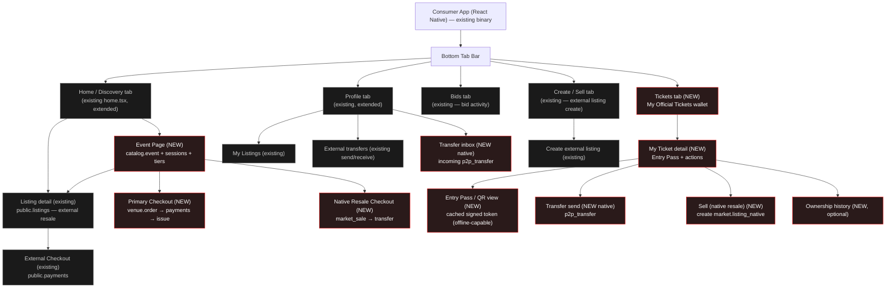

# Snatch It — Phase 2 React Native Product Spec (UI/UX, build-ready)

**Design-only.** Information architecture, flows, screens, navigation, and state. No component code, no JSX, no styling code. Another engineer must be able to build every surface from this file without inventing a flow.

**Binding inputs:** `SPEC_FOUNDATION.md` (shared vocabulary; §9 product language is a hard rule), `docs/architecture/SNATCH_IT_DOMAIN_ARCHITECTURE.md` (two rails, venue ops), `docs/architecture/SNATCH_IT_CANONICAL_DATA_MODEL.md` (object states), `docs/architecture/_superseded/PHASE_2_IMPLEMENTATION_ROADMAP.md` (build order), `docs/architecture/_superseded/PHASE_2_FINAL_ARCHITECTURE_AUDIT.md` (product findings). Companion deliverables: schema (1), migration (2), RLS (3), RPC (4), edge (5), this file (6), review (7).

**MVP scope (honest, do not exceed):** Miami-only, approved venues only, GA + `table` ticket types, **no re-entry** (C41), no international / multi-currency UI, no seat-map selection UI (seat/unit hedge is backend-only, C42). Social, waitlist, friends-attending, analytics dashboards are **placeholders only** — visible affordances that route to a "coming soon" state, never functional flows.

---

## 0. Product-language rule (restated — governs ALL screen copy)

The user NEVER sees architecture terms. Forbidden in any label, toast, empty-state, error, or push copy: **kernel, catalog, rail, ticket atom, SSCAS, credential_version, market_sale, ownership log, batch, shard, resale_state, cause-code.**

Approved user-facing vocabulary (SPEC_FOUNDATION §9):

| Backend concept (internal only) | User-facing word |
|---|---|
| native primary ticket (`kernel.tickets`, issued by venue) | **Official Ticket** |
| native resale listing (`market.listing_native`) | **Resale Ticket** |
| external listing (`public.listings`) | **Resale Ticket** (same word; treatment differs — see §3) |
| ownership move (`kernel.transfer_ticket_ownership` / `p2p_transfer`) | **Transfer** |
| a ticket the user owns (`kernel.tickets` owned) | **My Ticket** |
| `catalog.venue` | **Venue** |
| `catalog.event` / `event_session` | **Event** (session shown as date/time, not a separate noun) |
| `venue.ticket_type` | **Ticket Type** (shown as the tier name, e.g. "General Admission", "Table") |
| purchase | **Buy** |
| bid / auction offer | **Bid** |
| create resale listing | **Sell** |
| signed door credential | **Entry Pass** / **QR** (never "credential") |

**Every screen below names the canonical backend object it maps to for the engineer; that name must never reach the rendered copy.**

---

## 1. Design principles

1. **The existing marketplace keeps working, untouched.** The live external-rail marketplace (`public.listings`/`bids`/`transfers`) ships throughout Phase 2 (SPEC_FOUNDATION §2). Every existing tab, route, and flow in the current app (`app/(tabs)/home`, `create`, `bids`, `profile`; `app/listing`, `app/checkout`, `app/bid`, `app/transfer`, `app/my-listings`) continues to behave exactly as today. New native-ticketing surfaces slot **beside** them, never replace them. No existing screen's data source or semantics change.
2. **Never lie about custody.** Discovery and event pages mix native inventory the platform actually controls with external resale it does not. The UI must make custody legible at a glance (§3) without using the word "custody" or any architecture term.
3. **Native must feel native, not bolted on.** Official Tickets live in the same tabs, the same card system, the same theme (`src/theme`) as the existing marketplace. A fan should not perceive "two apps."
4. **One state is never overloaded.** Reuse the existing `ScreenState` discipline (loading / offline / error distinct; empty states screen-specific). Every screen declares its full state set (§10).
5. **Money-consequential truth is server-fresh.** Buy, resale eligibility, transfer eligibility, and Entry Pass validity are re-checked live at the decision point, never trusted from a stale list row (SPEC_FOUNDATION §8; audit C37). The UI shows a re-validation moment before any money or custody action.
6. **The app holds no signing key.** The Entry Pass QR is signed server-side by the `credential-sign` edge function (C33). The app only displays/caches the signed token it was handed. Offline display is showing a cached signed token — never minting one.
7. **Placeholders are honest.** Future surfaces (waitlist, friends-attending, social) render as clearly-labeled "coming soon" affordances, never as broken buttons.

---

## 2. Surface split decision (Consumer RN vs Web dashboard vs Scanner)

| Surface | Platform | Why |
|---|---|---|
| **Consumer app** (discovery, event, checkout, My Tickets, transfer, existing marketplace) | **React Native** (this app) | Fans are mobile-first; the Entry Pass must live on the phone; the existing marketplace is already RN. One consumer binary. |
| **Venue management** (event/tier/inventory setup, comps, guest list, promoter links, settlement/payout review, refunds, org & staff admin) | **Web dashboard** (separate, `web/`) | Data-dense, keyboard/multi-column, desktop back-office work done by venue staff, not on a phone. Building it into RN would bloat the consumer app and mismatch the workflow. Out of scope for THIS spec except where it hands work to admin (§8). |
| **Door scanning** (PIN login, manifest sync, scan) | **Dedicated mobile scanner mode** (separate lightweight surface / build target) | Door staff are not consumer accounts (loginless `door_pin`, C36); the scanner runs offline-first with a signed manifest and camera-first UX; it must be hardened, single-purpose, and installable on shared door devices. Bundling it into the consumer app would leak door capability onto every fan phone and complicate offline/security. Recommend a dedicated scanner surface (either a separate build target of this repo or a distinct app), specified in §7. |

**Recommendation (adopted):** Consumer = React Native · Venue management = Web · Door scanning = dedicated mobile/scanner mode. This spec fully specifies Consumer (§3–§6) and Scanner (§7); it specifies only the **minimum admin additions** (§8) and defers the full venue web dashboard to its own spec.

---

## 3. Information architecture + navigation map

New native surfaces slot into the **existing** tab bar (Home · Create · Bids · Profile) plus a new **Tickets** tab (the fan's wallet of Official Tickets). The existing marketplace routes are unchanged.

Custody legibility uses **three distinct visual treatments** (defined once, used everywhere a ticket/listing appears):

- **Official Ticket** — native primary inventory the platform issues and custodies (`kernel.tickets` via `market.listing_native` where `inventory_kind='native'` sold as primary). Treatment: primary accent border, a filled "Official" badge, venue name as issuer. Highest trust. Instant delivery on Buy.
- **Verified external inventory** — external listing whose seller/inventory the platform has verified but does NOT custody (external rail, elevated trust). Treatment: outlined "Verified" badge, muted accent. Delivery is a Transfer the seller performs (existing manual flow).
- **External resale** — ordinary external listing (`public.listings`), no custody, standard marketplace trust. Treatment: no badge (or neutral "Resale" chip), standard card. Delivery is the existing manual/off-platform transfer flow.

These three map **one-to-one** to the listing `inventory_kind` discriminator (canonical data model §1, C10): **`native` → Official Ticket · `external_verified` → Verified external inventory · `external` → External resale.** The unified discovery surface reads them together via the `market.listing_unified` bridge (SPEC_FOUNDATION §7). Because the trust tier is a real enum value, the UI's three treatments are backed by schema, not invented.

**Navigation rules:**
- The **Tickets tab** is new and only appears once the fan owns at least one Official Ticket OR always-visible with an empty state (recommend always-visible for discoverability of native inventory value). Existing users see it appear without disruption.
- **Home** gains an Events section (native) above/interleaved with the existing external resale feed — the existing feed query and filters are untouched; the Events section is an additive query.
- **Event Page** is the new hub that did not exist before (the old app had only listings, no event object).
- Deep links: `event/[id]`, `event/[id]/checkout`, `ticket/[id]`, `ticket/[id]/pass`, `transfer/native/send/[ticketId]`, `transfer/native/receive/[transferId]`. Existing deep links (`listing/[id]`, `checkout/[id]`, `bid/[id]`, `transfer/send`, `transfer/receive`) are unchanged.

---

## 4. Consumer flows & screens

Each screen: **purpose · key elements · data shown · actions · backend object.** Copy examples use product language only.

### 4.1 Home / Discovery (extends existing `app/(tabs)/home.tsx`)

- **Purpose:** one discovery surface showing native primary inventory and external resale together, honestly distinguished by custody treatment (§3).
- **Key elements:**
  - Existing quick-filter chips (All, Your Scene, GA, VIP, Buy Now, Auction), filters modal (neighborhood, price), realtime feed — **all unchanged.**
  - NEW: an **Events** section (horizontal rail or top block) surfacing upcoming approved-venue events with Official Tickets available. Each event card carries the venue name, date, and an "Official" badge.
  - Feed cards render one of the three custody treatments (§3) based on the unified-listing discriminator.
- **Data shown:** event title, venue, date/session time, lowest Official Ticket price ("from $X"), sold-out flag; for resale cards: price, tier name, Buy Now / auction end countdown (existing ticker), custody badge.
- **Actions:** tap event card → Event Page; tap resale card → existing Listing detail; filter/search (existing).
- **Backend:** Events section reads `catalog.event` + `catalog.event_session` + cheapest active `venue.ticket_type`/`inventory_batch` remaining. Feed reads `market.listing_unified` (bridge view) for the mixed native+external list; existing feed query for external stays as-is.
- **Honesty rule:** an Official Ticket card must say the venue issues it and delivery is instant; a resale card must not imply platform custody unless it is Verified.

### 4.2 Event Page (NEW)

- **Purpose:** the hub for a single event — buy Official Tickets, see native + external resale, understand what's on offer.
- **Key elements (top to bottom):**
  1. **Header:** event name, hero image, venue name (tappable → venue info), date + session time (single implicit session for one-night events shows as one date; A1/A3), city (Miami).
  2. **Official Tickets block:** one row per **Ticket Type** (tier). Each row: tier name (e.g. "General Admission", "Table"), price (all-in, using existing `allInFromDollars`/`PriceDisplay`), short description, availability state (Available / Low / Sold Out), Buy button. `table` tiers show "Table" with a note about party size / minimum where configured (balance handled off-app in MVP — C45 conceded; do not promise at-the-room settlement in-app).
  3. **Resale block:** Resale Tickets for this event — native resale (Resale Ticket, from the venue-governed native market) and external resale, each with its custody treatment. Sorted by price. Empty when none.
  4. **Sold-out state:** when all Official Tickets for a tier are gone, the tier row shows "Sold Out" and, if resale exists, a "See resale" affordance. If the whole event is sold out with no resale → sold-out empty state.
  5. **Waitlist (FUTURE placeholder):** a disabled "Join waitlist" affordance labeled "Coming soon" when a tier is sold out. Renders, does nothing (C44 deferred).
  6. **Friends going (FUTURE placeholder):** a "coming soon" strip. No social reads in MVP (Phase 3).
- **The three-object distinction, in product terms (must be legible, never named as architecture):**
  - **Ticket Type** = "the kind of ticket you can buy" (a tier: GA, Table). It is a *category with a price and availability*, not a thing you own yet. (`venue.ticket_type`)
  - **Listing** = "an offer to buy one" — either an Official Ticket offered by the venue or a Resale Ticket offered by a holder. (`market.listing_native` / `public.listings`)
  - **My Ticket** = "the actual ticket you own after buying," the one with an Entry Pass. (`kernel.tickets` — the ticket atom; NEVER call it an atom)
  - Copy guidance: the Event Page sells "Ticket Types"; the moment of Buy creates "your Ticket." Do not show the word listing to the user; show "Official Ticket" / "Resale Ticket."
- **Actions:** Buy (tier) → Primary Checkout; Buy (resale) → Native Resale Checkout or External Checkout by rail; Bid (auction resale) → existing bid flow; tap venue → venue info sheet.
- **Backend:** `catalog.event`, `catalog.event_session`, `venue.ticket_type`, `venue.inventory_batch.remaining` (C27 counter, live read for availability), `market.listing_unified` for resale rows, `catalog.resale_policy` for which resale modes are enabled (C11; default off → no resale block).

### 4.3 Checkout — three variants (keep rail differences understandable, no jargon)

All three share the existing checkout chrome (price breakdown via `PriceDisplay`, all-in pricing, Apple/Google Pay + card via the frozen Stripe path). The difference the fan perceives is **how the ticket arrives**, phrased plainly.

#### 4.3a Primary Checkout (NEW) — buying an Official Ticket
- **Purpose:** buy a brand-new Official Ticket from the venue.
- **Key elements:** tier name, quantity (respecting per-user cap C5), all-in price breakdown, hold timer ("We're holding your ticket for N:NN" — from `inventory_hold` server-max TTL), pay button.
- **Data shown:** live availability re-check on entry; hold countdown; total.
- **Actions:** confirm quantity → place hold → pay → on success, "Your ticket is ready" → deep-link to My Ticket.
- **Delivery copy:** "Delivered instantly to your Tickets." (native issuance is atomic.)
- **Backend:** `venue.inventory_hold` → `venue.order` (pending→paid) → frozen `public.payments` charge → `kernel.issue_ticket_atoms` (SSCAS #1) → `kernel.tickets` owned. Order state drives UI (see §10).

#### 4.3b Native Resale Checkout (NEW) — buying a Resale Ticket on the native rail
- **Purpose:** buy a resale Official Ticket from another holder, venue-governed.
- **Key elements:** tier, seller price + fees (all-in), venue royalty is invisible to the buyer (built into price), pay button. A short trust line: "This is a verified ticket. It transfers to you instantly when you pay."
- **Delivery copy:** "Transfers to you instantly." (atomic `transfer_ticket_ownership`, C8.)
- **Actions:** pay → ownership transfers → My Ticket. On the rare `paid_pending_transfer` window, show a brief "Finalizing your ticket…" state (C25 auto-compensation guarantees resolution — see §10).
- **Backend:** `market.listing_native` (active) → `public.payments` link → `market.market_sale` (pending→completed) + `kernel.transfer_ticket_ownership` (SSCAS #2). Kernel authorizes the buyer itself (C35) — UI passes no buyer id.

#### 4.3c External Checkout (EXISTING — unchanged)
- **Purpose:** buy an external resale ticket (current marketplace behavior).
- **Delivery copy (existing):** the seller transfers the ticket to you off-platform; you confirm receipt (existing manual flow with evidence + auto-release). **This flow, its copy, and its `public.payments`/`public.transfers` path are unchanged.**
- **Backend:** existing `public.listings` → `public.payments` → `public.transfers` manual flow.
- **Distinction made plain to the fan:** Primary/native resale say "instant"; external says "the seller will send it to you." No architecture words; the difference is expressed as delivery speed + who delivers.

### 4.4 Tickets tab / My Tickets (NEW)

- **Purpose:** the fan's wallet of Official Tickets they own.
- **Key elements:** list of My Ticket cards grouped by upcoming vs past. Each card: event name, venue, date/session, tier, status pill (see states), and a prominent "Show Entry Pass" affordance for upcoming.
- **Data shown:** owned `kernel.tickets` for `auth.uid()` (current owner = derived head). Past = event date elapsed or `scanned`.
- **Actions:** tap → My Ticket detail.
- **Backend:** `kernel.tickets` where current owner = user; state + resale_state drive pills.
- **Note:** external tickets the user bought via the marketplace remain in the existing surfaces (they are not Official Tickets and have no Entry Pass); do not merge them into this wallet — that would imply custody the platform doesn't have.

#### 4.4.1 My Ticket detail (NEW)
- **Purpose:** everything about one owned Official Ticket + its actions.
- **Key elements:** event header, tier, session date/time, venue + info, status pill, **Show Entry Pass** (primary), **Transfer**, **Sell** (if resale eligible), ownership history (optional, §4.4.3).
- **Actions (gated by state — §10):**
  - **Show Entry Pass** — always available while ticket is valid & upcoming.
  - **Transfer** — available when state allows (not locked/scanned/voided and not frozen by open door manifest — C43/C6). Copy: "Send this ticket to someone."
  - **Sell** — available only when the event's resale policy is not `off` and the ticket is resale-eligible. Otherwise the action is hidden or shown disabled with a plain reason ("Resale isn't available for this event").
- **Backend:** `kernel.tickets` (state, resale_state), `catalog.resale_policy` (mode), door-freeze flag (per-open-manifest, C43).

#### 4.4.2 Entry Pass / QR view (NEW) — credential display
- **Purpose:** show the scannable Entry Pass at the door.
- **Key elements:** large QR (the signed token), event/tier/name, a live "valid" indicator, brightness boost, and a freshness timestamp.
- **Offline behavior (explicit):** the app **displays a cached signed token** obtained earlier from the `credential-sign` edge function. It works offline because the token was fetched and cached while online; the app **never holds a signing key and never mints a token** (C33). If no cached token exists and the device is offline, show the offline-no-pass state (§10) with "Connect to load your Entry Pass." When online, the app refreshes the token so the displayed `credential_version` matches the current ownership head (never shown to the user as a number).
- **States:** valid · refreshing · offline-cached (works) · offline-no-pass (needs connection) · voided/refunded (not valid) · scanned (already used) · transferred-away (no longer yours). See §10.
- **Backend:** signed token from `credential-sign` edge fn; validity mirrors `kernel.tickets.state` + `credential_version`. Door verifies with the public key from its manifest — the app is display-only.

#### 4.4.3 Ownership history (NEW, optional/appropriate)
- **Purpose:** show provenance — where this ticket came from — to build trust in native resale.
- **Key elements:** a simple timeline: "Issued by [Venue]" → "Transferred to you" / "Bought resale on [date]." No prices of prior owners, no PII of prior owners (privacy), no internal cause-codes.
- **Show it** only for tickets that changed hands (resale/transfer); hide for freshly-issued to avoid clutter. Appropriate because it reinforces the anti-counterfeit value; keep it minimal.
- **Backend:** `kernel.ticket_ownership_log` for this atom, mapped to friendly phrases (cause-code → plain verb). Never expose cause-code strings.

### 4.5 Transfer UX (NEW native P2P)

Native transfer is **instant and atomic** — distinct from the existing external manual transfer (which stays as-is). Both coexist; native transfers live under the Tickets tab / My Ticket, external transfers stay under Profile/existing routes.

Screens & states:
1. **Send ticket (start):** from My Ticket detail → "Send this ticket." Elements: recipient search, confirmation, send button. Backend: `create_p2p_transfer` (SSCAS #7) locks the ticket.
2. **Recipient search:** find recipient by username/phone/email (existing profile search patterns). Shows a confirmable recipient card (name/avatar). Privacy: no bulk directory browsing; exact-match lookup only.
3. **Recipient confirmation:** "Send [Event] — [Tier] to [Recipient]?" Confirm/cancel. Warns it cannot be undone once accepted.
4. **Pending (sender view):** "Waiting for [Recipient] to accept." Ticket shows a **locked** pill; sender can **Cancel** while pending. A hard auto-unlock/expiry is enforced server-side (C43) — UI shows the expiry ("Expires in Xh").
5. **Cancel:** sender cancels a pending transfer → ticket unlocks, returns to normal. Confirmation required.
6. **Incoming / Transfer inbox (recipient view):** NEW surface (under Tickets or Profile) listing incoming pending transfers → Accept / Decline. Push-notified.
7. **Accepted:** ownership moves (SSCAS #7 `accept_p2p_transfer`), ticket appears in recipient's Tickets, disappears from sender's; both see confirmation. Recipient's Entry Pass refreshes to a new valid token; sender's old token is now invalid ("Transferred").
8. **Failed:** transfer could not complete (e.g. recipient ineligible, ticket became invalid). Both parties see a plain error; ticket returns to sender unlocked. Distinguish from Declined.
9. **Expired:** pending transfer not accepted before expiry → auto-cancels, ticket unlocks to sender, both notified.
- **Backend:** `market.p2p_transfer` (native). **Canonical physical enum (A5 — schema §4.5, migration 083):** `initiated → accepted → completed | declined | cancelled | expired`, + `reason_code`. UI mapping: "pending" = `initiated`/`accepted`-not-yet-`completed`; the ticket carries `resale_state=locked` while pending; **"Failed" = `cancelled` + `reason_code`** (not a separate state); `expired` is first-class (TTL sweep, C43 auto-unlock). Conceptual `requested` (data model §3.7) ≡ physical `initiated`. Distinct from `market.transfers` (external rail, unchanged: `pending → seller_sent → buyer_confirmed → released`).
- **Door-freeze interaction (C6/C43):** once a session's offline door manifest is open, native transfer/resale for that session's tickets is frozen. UI disables Transfer/Sell with copy "Transfers are closed while the event is underway" — never mentions manifests.

### 4.6 Sell (native resale create) (NEW)

- **Purpose:** list an owned Official Ticket for resale under the venue's policy.
- **Key elements:** price input constrained by policy (fixed cap shows max; face-value queue shows fixed price; buy-now vs auction vs offer per enabled modes), fee/payout preview (what you'll receive after venue royalty + platform fee), confirm.
- **Availability:** only when `catalog.resale_policy.mode != off` and ticket eligible. If policy is `transfers_only`, Sell is hidden and only Transfer is offered.
- **Actions:** set price/mode → confirm → ticket becomes a Resale Ticket (locked from transfer while listed), cancel-listing returns it.
- **Backend:** `create_listing` native (SSCAS #6) → `market.listing_native`, resale_policy snapshot captured (O3); `catalog.resale_policy` gates modes/caps.

---

## 5. (reserved)

*Consumer flows are §4; scanner is §7; admin is §8. This number intentionally left as a section break so the file's numbered anchors match the companion specs' cross-references.*

---

## 6. (reserved)

*See §7 Scanner, §8 Admin.*

---

## 7. Scanner UX (dedicated surface — door mode)

A separate, hardened, camera-first surface for door staff. Loginless via `door_pin` (C36), offline-first, single-purpose. Honors **C41: no re-entry in MVP — a second successful scan of the same ticket is a duplicate, not a re-admit.**

### 7.1 Flows & screens
1. **PIN login:** door staff enter the event/session-scoped expiring PIN (`venue.door_pin`). No account, no password. Elements: numeric PIN pad, venue/event name once resolved, error on invalid/expired PIN. Backend: `venue.door_pin` validate.
2. **Event/session select:** if the PIN maps to multiple sessions, choose the session; else auto-select. Shows event name, date, expected capacity.
3. **Manifest sync:** download the offline manifest (ticket public keys + valid ticket set for the session) — **contains no secret** (C33/C6). Shows sync progress, last-synced time, and count. Re-syncs when online.
4. **Scan (camera):** primary screen. Camera viewfinder, big result banner, running admitted count, online/offline indicator, manual-search fallback button.
5. **Manual search fallback:** search by name/order/ticket ref when a QR won't scan; same admit/deny result. Backend: manifest lookup / online kernel read.
6. **Guest list:** view the event's guest/comp list (`venue.guest_list`) for names admitted without a purchased ticket; mark arrived.
7. **Device status:** shows device id (`venue.scan_device`), manifest freshness, offline queue depth, online/offline, battery-friendly hints.

### 7.2 Scan result states (each is a distinct, unmistakable banner)
| Result | Meaning | Backend | Door action |
|---|---|---|---|
| **Success / Admit** | Valid ticket, first scan | `venue.scan` insert (`direction=in`), ticket `state`→`scanned` | Green, admit |
| **Duplicate (already used)** | Already scanned in (C41: 2nd `in` = duplicate) | existing `venue.scan` row for atom | Red/amber, deny, show first-scan time |
| **Voided** | Ticket voided/refunded | `kernel.tickets.state=voided` | Red, deny, "Refunded/void" |
| **Wrong session/event** | Valid ticket, not this session | ticket's `event_session_id` ≠ scanned session | Amber, deny, show correct session |
| **Already used** | (= duplicate; alias for staff clarity) | as duplicate | deny |
| **Offline pending** | Scanned while offline; recorded, not yet reconciled | `venue.scan.offline_pending=true` | Provisional admit per venue policy; flagged for reconcile |
| **Fraud / reconcile flag** | Reconciliation detected a conflict (e.g. two offline admits of one atom across devices) | `venue.scan.fraud_flag` | Escalate; do not silently admit |
| **Invalid / not recognized** | QR unreadable or not in manifest & offline | none | Deny; offer manual search |

- **Online vs offline state:** a persistent indicator. Online = live kernel recheck per scan (C37) → freshest truth. Offline = verify signature against manifest public key + local admitted set; record `offline_pending`; reconcile on reconnect, surfacing any conflicts into the **fraud/reconcile queue** (admin §8).
- **First-admit-wins (C41):** the local admitted set marks an atom admitted on first success; a second scan on the same or another synced device shows Duplicate. Cross-device offline collisions surface as fraud flags at reconcile.

### 7.3 Scanner state matrix — see §10 (scanner rows).

---

## 8. Admin UX — minimum Phase-2 additions to the existing internal admin plane

Only the smallest set beyond today's admin. All actions audited (`kernel.admin_audit`), scope-qualified roles (C36 `platform_admin|platform_support|platform_risk`), dual-control seam for high-risk (C11). Lives in the existing internal admin surface (web), not the consumer app.

| Admin surface | Purpose | Backend | Notes |
|---|---|---|---|
| **Venue approvals** | Approve/reject a venue before it can sell Official Tickets (Miami gate) | `catalog.venue.status` | Required for any native issuance. |
| **Org approvals** | Approve organizations (Stripe Connect payee) | `kernel.organization.status` | Payee must exist before payout. |
| **Ticket void** | Void an Official Ticket (invalidates Entry Pass) | `void_ticket_atom` (SSCAS #3) `refund_void` | Invalidates credential atomically; audited. |
| **Refund** | Refund a primary order / native sale | `refund_primary_order` → `kernel.refund` | Ticket → voided (no `refunded` terminal, D2). |
| **Held payout** | Review/release held venue payouts | `venue.settlement` → `kernel.payout` | Instant-payout risk gating (reserve, C29). |
| **Scan fraud / reconcile queue** | Adjudicate offline-scan conflicts & fraud flags | `venue.scan.fraud_flag`, reconcile job | The human end of offline reconciliation (C6/C23). |
| **Credential / key incident status** | View signing-key status (active/rotating/revoked) & incident state | `kernel.signing_key.status` | Read-mostly; rotation/compromise runbook lives in ops (C33). Surfaces whether Entry Passes are affected. |

Everything else (event/tier/inventory setup, comps, guest list, promoter links, settlement detail) is **venue web dashboard**, its own spec — not admin, not consumer.

---

## 9. (reserved for design principles — see §1 and §0)

*Product-language rule is §0; principles are §1. This section kept as an anchor for companion-spec cross-references.*

---

## 10. Front-end state matrix

Every major screen defines: **loading · empty · success · error · offline · permission-denied · expired · cancelled · refunded/voided · partially-unavailable.** Each maps to a backend state so RLS/RPC specs can be cross-checked. Cells marked **[NO BACKEND STATE?]** are UI states that may not yet have a schema/RPC home — the highest-value reconciliation targets (also listed in the return summary).

### 10.1 Consumer screens

| Screen | loading | empty | success | error | offline | permission-denied | expired | cancelled | refunded/voided | partially-unavailable |
|---|---|---|---|---|---|---|---|---|---|---|
| **Home/Discovery** | ScreenState loading | "No events near you yet" (Events); existing empty for feed | events + mixed feed render | ScreenState error | ScreenState offline (cached feed if any) | n/a (public) | past events hidden/greyed | n/a | voided listings excluded | some tiers "Sold Out" inline |
| **Event Page** | skeleton | "No tickets available" | tiers + resale render | error + retry | offline: show last-cached, disable Buy | n/a | event past → "This event has ended" | event cancelled → "Event cancelled" banner (`event.status`) | voided listings hidden | some tiers sold out; resale may be empty |
| **Primary Checkout** | loading tier/price | n/a | "Ticket ready" → My Ticket | payment/error; hold-lost error | offline blocks pay ("Reconnect to buy") | not signed in → auth gate | **hold expired** → "Your hold expired, try again" (`inventory_hold` TTL) | user cancels checkout | n/a (pre-purchase) | qty reduced: "Only N left" (`remaining`) |
| **Native Resale Checkout** | loading listing | n/a | "Transferred to you" → My Ticket | error; listing-gone error | offline blocks pay | not signed in → auth | listing expired/ended | listing cancelled by seller | ticket voided pre-purchase → "No longer available" | listing sold to someone else → "Just sold" |
| **External Checkout (existing)** | (existing) | (existing) | (existing) | (existing) | (existing) | (existing) | (existing) | (existing) | (existing) | (existing) |
| **Tickets tab / My Tickets** | loading | "No tickets yet — find an event" | ticket cards | error + retry | offline: show cached tickets | must be signed in | past tickets in "Past" group | n/a | voided ticket shows "Refunded" pill | n/a |
| **My Ticket detail** | loading | n/a | detail + actions | error | offline: cached detail; actions needing net disabled | not owner → 404/permission | event ended → Entry Pass shows "Ended" | transfer cancelled returns here | **voided** → "This ticket was refunded" (`state=voided`) | Sell hidden if resale unavailable |
| **Entry Pass / QR** | loading token | n/a | valid QR | error fetching token | **offline-cached (works)** / **offline-no-pass** ("Connect to load") | not owner | expired session → "Event ended" | n/a | **voided/refunded → "Not valid"** | refreshing token (transient) |
| **Ownership history** | loading | hidden if never transferred | timeline | error | offline: cached | not owner | n/a | n/a | shows "Refunded" as final event | n/a |
| **Transfer send / recipient** | loading | "No results" (search) | recipient confirmed → pending | error; recipient-ineligible | offline blocks send | not owner → blocked | n/a | n/a | can't transfer voided ticket → blocked | ticket became listed/locked → "Not available to send" |
| **Transfer pending (sender)** | loading | n/a | "Waiting for accept" + expiry | error | offline: cached, cancel needs net | not sender | **expired** → auto-cancel, unlock (C43) | sender cancels → unlocked | ticket voided mid-pending → cancelled | n/a |
| **Transfer inbox (recipient)** | loading | "No incoming transfers" | accept/decline list | error | offline: cached | not recipient | expired items drop off | sender cancelled → item removed | n/a | n/a |
| **Transfer accepted/failed** | loading | n/a | accepted → ticket moves | **failed** → plain error, ticket returns (`failed`) | offline retries on reconnect | n/a | n/a | declined ≠ failed (distinct copy) | n/a | n/a |
| **Sell (native resale create)** | loading policy | n/a | listed → Resale Ticket | error | offline blocks list | not owner | n/a | cancel listing → returns ticket | can't list voided | mode disabled by policy (`resale_policy`) |

### 10.2 Scanner screens

| Screen | loading | empty | success | error | offline | permission-denied | expired | cancelled | refunded/voided | partially-unavailable |
|---|---|---|---|---|---|---|---|---|---|---|
| **PIN login** | validating | n/a | PIN accepted → event select | invalid PIN | offline: cached PIN validation if previously synced | wrong-scope PIN rejected | **PIN expired** (`door_pin` TTL) → re-issue | n/a | n/a | n/a |
| **Manifest sync** | syncing | "Nothing to sync" | manifest ready + count | sync error + retry | offline: use last manifest, show staleness | n/a | manifest stale → warn, allow with flag | n/a | n/a | partial manifest → warn |
| **Scan** | camera init | no scans yet | **Admit** (green) | camera/decode error | offline mode banner + verify-vs-manifest | non-door role blocked | ticket for ended session → deny | n/a | **voided → deny "Refunded"** | wrong-session → deny w/ correct session |
| **Scan result: duplicate** | — | — | n/a | — | offline duplicate detected locally | — | — | — | — | first-admit-wins; show first time |
| **Scan result: fraud/reconcile** | — | — | n/a (escalate) | — | offline conflict → flag | — | — | — | — | cross-device collision at reconcile |
| **Guest list** | loading | "No guests listed" | guest rows + mark arrived | error | offline: cached list | non-door blocked | n/a | removed guest drops | n/a | n/a |
| **Device status** | loading | n/a | status + queue depth | error | shows offline + queue depth | n/a | manifest expiry shown | n/a | n/a | n/a |

### 10.3 Admin screens (state summary)

| Screen | loading | empty | success | error | offline | permission-denied | expired | cancelled | refunded/voided | partially-unavailable |
|---|---|---|---|---|---|---|---|---|---|---|
| **Venue/Org approvals** | loading | "No pending approvals" | approve/reject done (audited) | error | web (assume online) | non-platform role blocked | n/a | n/a | n/a | n/a |
| **Ticket void / Refund** | loading | n/a | voided/refunded (audited) | error; already-voided guard | online | needs `platform_admin` + dual-control | n/a | n/a | shows resulting `voided` | partial refund on multi-item order |
| **Held payout** | loading | "No held payouts" | released (audited) | error | online | `platform_risk`/dual-control | n/a | n/a | n/a | reserve-gated hold shown |
| **Scan fraud queue** | loading | "No flags" | adjudicated | error | online | `platform_risk` | n/a | n/a | n/a | conflicting evidence shown |
| **Credential/key incident** | loading | "All keys active" | status view | error | online | `platform_admin` | shows `not_after` | n/a | revoked keys listed | rotating state shown |

---

## 11. Backend state → UI reconciliation index

Every backend state the UI references, and where it lives (for reviewer cross-check against schema/RPC specs). Exact enum labels to be pinned against `docs/architecture/SNATCH_IT_CANONICAL_DATA_MODEL.md` §1.

| Object | Backend states referenced by UI | UI surface |
|---|---|---|
| `kernel.tickets.state` | `issued → active → scanned` (terminal) \| `voided` (terminal) \| `expired` (terminal) | My Tickets, Entry Pass, Transfer, Scan |
| `kernel.tickets.resale_state` (overlay) | `none` / `listed` / `locked` | Sell, My Ticket detail, Transfer pending |
| `venue.order` state | `pending → paid → partially_refunded → refunded \| cancelled` | Primary Checkout, refund |
| `market.market_sale` state | `pending → completed \| compensated` (C26); bounded transient `paid_pending_transfer` while ticket is `locked` | Native Resale Checkout ("Finalizing…") |
| `market.p2p_transfer` state (native) | **canonical physical:** `initiated → accepted → completed` \| `declined` \| `cancelled` \| `expired`, + `reason_code` (A5; conceptual `requested` ≡ `initiated`; UI "Failed" = `cancelled`+reason, never a separate state) | Transfer UX (UI "pending" = initiated/accepted) |
| `market.transfers` state (external, unchanged) | `pending → seller_sent → buyer_confirmed → released`; `disputed`, `expired`, `refunded` | External Checkout/transfer (existing) |
| listing state (`inventory_kind ∈ external\|external_verified\|native`) | `draft → active → reserved → sold` \| `cancelled` \| `expired` | Event Page resale, Sell, custody treatment |
| `venue.inventory_batch.remaining` (C27 counter) | available / low / sold-out (derived from capacity−held−sold) | Event Page, Primary Checkout partially-unavailable |
| `venue.inventory_hold` | `active → converted \| expired \| released` | Primary Checkout hold timer/expiry |
| `catalog.event.status` | `draft → announced → on_sale → live → completed \| cancelled` | Event Page (on_sale/live=buyable; completed=ended), Entry Pass |
| `catalog.resale_policy.mode` | `off / transfers_only / fixed_cap / face_value_queue / buy_now / auction / offer` | Event Page resale block, Sell |
| `venue.scan` | admitted (`direction=in`) / `offline_pending` / `fraud_flag` | Scanner |
| `venue.door_pin` | valid / expired (TTL) | Scanner PIN |
| `venue.scan_device` | manifest fresh / stale | Scanner device status |
| `kernel.signing_key.status` | `active / rotating / revoked` | Admin key incident (never shown to fan) |
| `kernel.refund` | ledger (no status enum); drives ticket `voided` (`refund_void`) | Admin refund, My Ticket "Refunded" |
| `kernel.payout` state | `scheduled → processing → paid \| failed`; `failed → scheduled` (retry); `paid → reversed` (clawback) | Admin held payout (hold = pre-schedule review gate, not a payout state) |
| `venue.settlement` state | `open → closed → paid` | Admin held payout, venue web (out of scope) |
| `catalog.venue.status` | `draft → active → archived` | Admin venue approvals |
| `kernel.organization.status` | `applied → approved → active → suspended → closed` | Admin org approvals |

---

## 12. UI states that may NOT yet have a backend state (reconciliation targets)

Flagged for the schema/RPC reviewers — these are UI needs that the frozen specs may not yet name:

1. **RESOLVED — Verified external inventory is modeled.** The three-way custody treatment (§3) is backed by `inventory_kind ∈ {native, external_verified, external}` (C10). No new attribute needed. Left here only to note the UI depends on `external_verified` actually being populated by the verification pipeline; if that pipeline isn't built in MVP, `external_verified` will simply never appear and the UI degrades gracefully to two treatments (Official vs Resale) with no code change.
2. **RESOLVED.** `market.get_market_sale_status(sale_id)` (RPC §1.4) is the pollable buyer/seller-scoped read — returns `{terminal_state, sale_state, paid_pending_since}` only, cause-code-free; the C25 sweep guarantees the bounded flip to `completed` or `compensated` (SLO named in the Edge/ops spec). The UI polls it for "Finalizing…" → success vs refund.
3. **RESOLVED (addendum A5 — schema §4.5, migration 083).** Canonical physical `market.p2p_transfer` states = `initiated → accepted → completed | declined | cancelled | expired`, plus `reason_code`. **`expired` is first-class** (TTL sweep-driven, tied to C43 auto-unlock). **`failed` is NOT a state:** a failed accept = `cancelled` + `reason_code`; the UI renders "Failed" vs "Declined" vs "Cancelled" from `(status, reason_code)`. Conceptual `requested` (data model §3.7) maps to physical `initiated`.
4. **RESOLVED — `resale_state` values confirmed** = `none | listed | locked` (data model §1). Sell button gates on: enabled when `resale_state=none` AND event `resale_policy.mode != off` AND ticket `state=active`; hidden/disabled when `listed` (show "Listed") or `locked` (in a transfer/sale). No open question; pinned here for the RPC spec to honor.
5. **RESOLVED (addenda A2/A3 — schema §2.3, migration 073).** Door-freeze = `catalog.event_session.door_open_at` read via the `kernel.is_transfer_frozen(ticket_atom_id)` helper — the UI consumes it as a plain owner-scoped eligibility boolean (Transfer/Sell disabled, copy "Transfers are closed while the event is underway"); RPCs recheck the same helper under lock, so the UI state can never disagree with authorization.
6. **RESOLVED.** The `credential-sign` edge contract (Edge spec §credential-sign) returns a cacheable signed token + `credential_version` + TTL; a custody transfer bumps `credential_version` so the cached token fails closed, and the client re-signs on reconnect. Online doors live-verify (C37).
7. **Waitlist / friends-going placeholders (§4.2).** Deliberately no backend (C44/Phase 3). Flagged so reviewers don't expect a home for them.
8. **RESOLVED.** `market.get_ticket_history(ticket_atom_id)` (RPC §1.2) is the purpose-built owner-scoped redacted read — plain verbs only, no cause-codes, no prior-owner PII; raw `kernel.ticket_ownership_log` is deny-all to clients (RLS §14.5).

---

*End of Phase 2 React Native Product Spec. All screen copy herein uses product language only (§0); every screen names its backend object for the engineer; the existing external-rail marketplace is untouched throughout (§1).*
