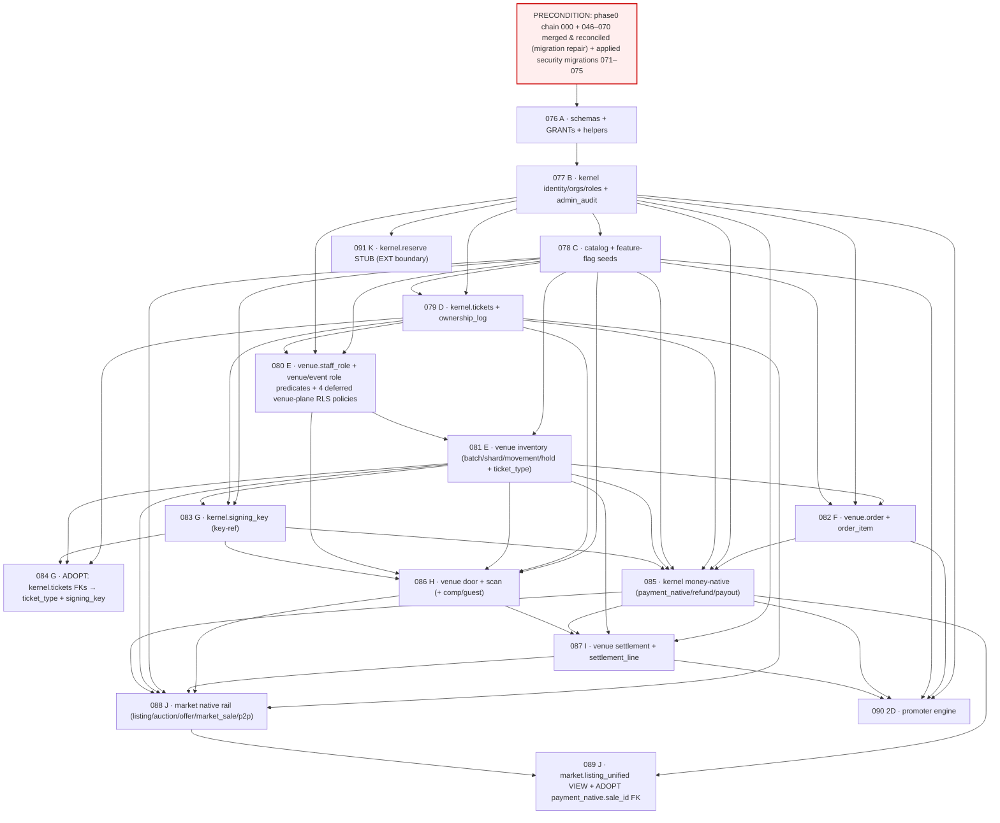

# Phase 2 — Supabase / Postgres Migration Plan

> ## Numbering ratification (consolidated, FINAL) — 2026-08-27
>
> **The 16 MVP packages are numbered `076`–`091`. Phase 2 implementation begins
> at `076_create_phase2_schemas_and_grants`.**
>
> **`071`–`075` are APPLIED PRODUCTION SECURITY MIGRATIONS, not Phase-2
> packages.** They consumed the numbers this plan originally reserved:
>
> | Applied migration | Closes | Applied |
> |---|---|---|
> | `071_fix_guard_proof_status` | DB-1 (HIGH) — `guard_proof_status()` keyed on the legacy singular `request.jwt.claim.role` GUC, which PostgREST never sets, so it evaluated NULL and fell through: any authenticated seller could self-approve their own ownership proof and clear the `PROOF_REJECTED` payout hold, by UPDATE **and** by INSERT. | 2026-08-27 |
> | `072_fix_listing_insert_guards` | H-1 (HIGH) — `public.listings` carried column custody on UPDATE only, so a seller could CREATE a listing already carrying `winner_user_id`, `winning_bid_amount`, `auction_status='ended'`, `bid_count`, `current_bid` and settlement timestamps, and `create-payment-intent` prices a real Stripe checkout from exactly those fields. | 2026-08-27 |
> | `073_storage_bucket_upload_constraints` | SEC-3 — storage bucket MIME/size constraints. | 2026-08-27 |
> | `074_privilege_cleanup` | SEC-1 + residual EXECUTE cleanup. | 2026-08-27 |
> | `075_replay_parity_storage_policies_and_cron` | SEC-4 + D-5 — replay parity for storage policies and cron. | 2026-08-27 |
>
> **Numbering history of the Phase-2 packages** (contents, dependencies,
> ordering relationships, architecture, implementation contracts and rollout
> gates were never touched by any of these shifts; no package was merged, split,
> added or removed):
>
> | Shift | Cause | Package range |
> |---|---|---|
> | original ratified plan | — | `071`–`086` |
> | +1 (2026-08-27) | `071` consumed by DB-1 | `072`–`087` |
> | +1 (2026-08-27) | `072` consumed by H-1 | `073`–`088` |
> | **+3 → FINAL (2026-08-27, owner-ratified)** | `073`/`074`/`075` consumed by SEC-3 / SEC-1 / SEC-4+D-5 | **`076`–`091`** |
>
> Net effect versus the original ratified plan: **+5**. This consolidation pass
> also **repaired** the internal inconsistencies the two earlier mechanical
> shifts explicitly left behind (§3 row 1 reading `071 | A`, §3 row 2's
> dependency column, §1 mapping two packages onto one version, the §5 section
> title, and the off-by-one rollback filenames). Every package number in this
> document was re-derived from **package identity**, not from arithmetic on the
> previous token.
>
> **Anti-collision reference:** `docs/architecture/PHASE_2_PACKAGE_REGISTRY.md`
> is the canonical machine-readable new↔old package map. Consult it before
> quoting any Phase-2 migration number.

**Status:** BUILD-READY MIGRATION SPECIFICATION. **Design-only — NO SQL, NO migration files, no code.**
This is the ordered plan an implementing engineer follows to author the Phase-2 migration chain from
`docs/architecture/PHASE_2_PHYSICAL_POSTGRES_SCHEMA_SPEC.md`. Every object, name, and decision is fixed here so the author
makes **no architectural decision** while writing DDL; where a real choice remained it is called out.

**Binding inputs (authority order):**
1. `docs/architecture/PHASE_2_SPEC_FOUNDATION.md` (committed copy of the session SPEC_FOUNDATION) — BINDING (§3 numbering baseline, §1 schemas, §6 table inventory,
   §4 Gate-P decisions, §5 SSCAS/lock order, §8 Phase-0 security invariants, §2 integrate-never-rewrite).
2. `docs/architecture/PHASE_2_PHYSICAL_POSTGRES_SCHEMA_SPEC.md` — the authoritative table/column set these migrations create.
3. `docs/architecture/SNATCH_IT_ENGINEERING_STANDARDS.md` §5/§6/§7/§8 + `docs/security/SNATCH_IT_PHASE_0_COMPLETION_REPORT.md`
   §3 (Gate-2), §5 (staging), §12 (governance) — CI fresh-bootstrap gate, reproducibility lesson,
   Supabase auto-deploy governance, staging discipline.
4. `docs/architecture/_superseded/PHASE_2_IMPLEMENTATION_ROADMAP.md` — phase order; "marketplace never stops shipping / money core never
   reopened"; the 15.A hard-stop gate.

---

## 0. Preconditions, global rules, and the three decisions this plan makes

### 0.1 PRECONDITION — the phase0 chain must be merged first (NOT a Phase-2 migration)
Phase-2 migrations are authored **assuming the phase0 chain is already merged to the integration branch and
present as the applied baseline**. Specifically:

- The authoritative applied chain is `000_baseline_schema.sql` + `046_*` … `070_reconcile_rls_policies_and_triggers.sql`
  (plus the four timestamped website-form files), living on `phase0/lockdown`.
- **This working tree (`mobile/profile-rpc-compat`) physically contains only migrations up to `045`** — it is
  missing `000_baseline` and `046–070`. **You cannot author or replay Phase-2 migrations against this tree as-is.**
  Merge/rebase the phase0 chain into the integration branch first, verify the fresh-bootstrap replays `000→070`
  cleanly (the Gate-2 test), and only then add `076_` (the applied security migrations `071`–`075` sit between
  them and must replay too).
- Merging the phase0 baseline is a **prerequisite, not a Phase-2 migration** — it is not numbered in this plan.
- **History reconciliation is also a precondition:** production `schema_migrations` records **timestamp**
  versions for `040–068` while repo files use `NNN_`. Run `supabase migration repair --status applied` to
  reconcile repo↔production **before** any gated `db push`, and keep **Supabase "Deploy to production" OFF**
  (Standards §6, Completion Report §12). Phase-2 migrations apply only via the approved gated path
  (manual migration-by-migration, or a `workflow_dispatch` job behind a GitHub Environment reviewer) — never
  via auto-deploy.

### 0.2 Numbering — continue the zero-padded version-prefix scheme (NOT timestamps)
- True applied max across the phase0 chain = **070**. Five **production security migrations** were then
  applied on top of it on 2026-08-27 — `071` (DB-1), `072` (H-1), `073` (SEC-3 storage bucket upload
  constraints), `074` (SEC-1 privilege cleanup), `075` (SEC-4 + D-5 replay parity / storage policies / cron)
  — so the **true applied max is now `075`**. **Phase-2 migrations begin at `076_` and continue the
  zero-padded `NNN_` version-prefix scheme** (consistent with 066–075), NOT Supabase `YYYYMMDDHHMMSS`
  timestamp prefixes.
- **The version-prefix-vs-timestamp trap (surface explicitly):**
  1. Supabase CLI / `migrations-guard` order migrations **lexicographically by the version string**.
     `"076"` … `"099"` … `"100"` all sort **before** the existing timestamped files (`"20260714190445"` …)
     because `'0'` < `'1'` < `'2'`. That is harmless here — the four timestamped files are unrelated
     `public` website-form tables with **zero dependency** on any Phase-2 object — but the author must not
     assume the timestamped files run before `076+`. They run after. No Phase-2 object may depend on them.
  2. Do **not** switch Phase-2 to timestamp prefixes "to be safe." Mixing schemes is exactly what made
     Supabase auto-deploy unsafe (Standards §5/§6). Stay on `NNN_`, three-digit, zero-padded, strictly
     monotonic after `075` (the `migrations-guard` job enforces monotonic + append-only ordering).
  3. Never edit/rename/renumber an applied migration. `071`–`075` are applied production security
     migrations (DB-1, H-1, SEC-3, SEC-1, SEC-4+D-5) and are **immovable** — fix forward with a new number
     (Standards §5). Phase-2 package numbers start above them, at `076`.

### 0.3 DECISION 1 — enum wire-form: **text + CHECK constraint** (native Postgres `ENUM` rejected)
The schema spec (§12) left the enum wire-form to this plan. **Decision: every enum-like column is
`text NOT NULL` with a `CHECK (col IN (...))` constraint** — applied **consistently** to all status/kind/
role/cause/mode/state/direction/scope columns across `kernel`/`catalog`/`venue`/`market`. **Native
`CREATE TYPE ... AS ENUM` is NOT used anywhere in Phase 2.** Rationale:

| Factor | text + CHECK (**chosen**) | native `ENUM` (rejected) |
|---|---|---|
| **Consistency with frozen core** | The entire `public.*` money core uses `text + CHECK (x in (...))` — **zero** native enums; `040` even documents *deliberately* not locking an enum "to avoid a migration per new type." Phase 2 matches the house style. | Would introduce a second, divergent convention beside the frozen core. |
| **Evolution (C18 "new causes by amendment"; A10 modes turned on incrementally; role sets)** | Add/loosen a value = `DROP CONSTRAINT` + `ADD CONSTRAINT` in one idempotent migration. | `ALTER TYPE ... ADD VALUE` cannot be reordered/removed; removing a value requires a full type recreation + column rewrite. |
| **Rollback (Standards §5 requires a rollback per migration)** | Constraint drop/re-add is trivially reversible. | `ADD VALUE` is **effectively irreversible** — you cannot drop an enum value; rollback means recreating the type and rewriting every dependent column/function. Fatal for the per-migration rollback rule. |
| **Idempotent fresh-bootstrap replay (Gate-2)** | `ADD CONSTRAINT ... IF NOT EXISTS`-style guards replay cleanly; CHECK sits inline in `CREATE TABLE`. | `CREATE TYPE` is not idempotent without a `pg_type` guard; enum + function interdependencies complicate the replay. |
| **Disjoint scope-qualified roles (C36)** | Achieved structurally by **separate CHECK sets per column** (`org_member.role IN (org_*)`, `staff_role.role IN (venue_*)`, `platform_role.role IN (platform_*)`) — disjoint by construction, no shared type to confuse. | A shared enum type would *undermine* disjointness; three separate enum types = three `CREATE TYPE`s with the rollback problem above. |
| **Type safety** | Slightly weaker (a bad literal is caught by CHECK at write, not by the type system). Acceptable — all writes go through `SECURITY DEFINER` RPCs that validate inputs anyway (C35). | Marginally stronger, not worth the evolution/rollback cost. |

**Consistency mandate:** the migration author MUST NOT introduce a native enum "just for this one column."
Every enum-like value set in the schema spec becomes a named `CHECK`. Where the same value set repeats
(e.g. the D3 cause registry on `ticket_ownership_log`, `inventory_movement`, `payout`, `settlement_line`),
each column carries its **own** inline `CHECK (cause IN (<D3 set>))` — the D3 set is copied verbatim, not
shared via a type. (A future single-source-of-truth lookup table is a Gate-L normalization, not now — same
disposition as CONFLICTS #7 neighborhood duplication.)

### 0.4 DECISION 2 — every package is expand → verify → adopt → contract; **no big-bang**
- **Expand:** create new schemas/tables/columns/constraints **additively**, beside the live system. Never
  alter a `public.*` money/custody table's semantics (SPEC_FOUNDATION §2). The only `public.*` interaction
  is **outbound FK references to `public.payments`/`auth.users`** and a **read-only VIEW** over
  `public.listings` — neither mutates nor locks a hot production row.
- **Verify:** each package is validated on staging (fresh-bootstrap replay + adversarial RLS) before any
  production apply; production apply is per-package with pre/post catalog verification (Standards §5/§6).
- **Adopt:** forward-reference FKs that cannot exist at a table's birth (e.g. `kernel.tickets` →
  `venue.ticket_type`/`kernel.signing_key`, `kernel.payment_native` → `market.market_sale`) are added by a
  **dedicated late-binding constraint package** once the target exists — using `ADD CONSTRAINT ... NOT VALID`
  then `VALIDATE CONSTRAINT` as the standing discipline (trivial on empty tables; the pattern is in place for
  when data exists). This is what lets each phase ship independently without reordering the mandated phases.
- **Contract:** there is **nothing to contract in the MVP** (no dual-write, no data migration off an old
  shape) because Phase 2 is purely additive. The "contract" step is reserved and documented for future
  seat-enablement (populate `venue.inventory_unit`, drop the "unit_row_id NULL" assumption) and re-entry
  (relax the `venue.scan` partial unique) — both named future changes, neither in MVP.

### 0.4b DECISION 3 — where a function is authored is **derived, not chosen** (SEAM-1 / SEAM-2)

Added by the delta-spec integration. See `PHASE_2_PHYSICAL_POSTGRES_SCHEMA_SPEC.md` §13.2 for the full
forward-reference sweep that motivated it.

> **SEAM-1 — CORRECTED by the replay-ordering pass (`R2B`). The `max()` is taken over the set the body
> can REACH, not the set it names in its own statements.** A function is authored in the package equal to
> **`max()` of the packages creating every table it *reads*, every table it *writes*, and every table it
> *reaches through a call*** — not the package of its schema, and not the package of its subject. **A
> called routine contributes its own package to the `max()` in its own right**, because `CREATE FUNCTION`
> resolves nothing: a `plpgsql` body naming a routine that does not exist yet **replays green** and raises
> `42883` the first time it runs. **A column is a table for this purpose** — a body writing a column that a
> later package `ADD COLUMN`s is the same `42703` failure with a different SQLSTATE.
>
> **SEAM-2.** Where an *earlier* artifact must be able to resolve the name (an RLS policy references it,
> or an earlier function calls it), the earlier package ships a **hook stub** returning the neutral
> result, and the later package `CREATE OR REPLACE`s **only that hook**. The caller is authored once and
> is never rewritten by another package.
>
> **SEAM-2a (NEW, binding — a hook's SIGNATURE is frozen at the stub).** A hook's **parameter list, its
> parameter NAMES, and its return type** are fixed by the package that creates the stub and may never be
> changed by the replacement; `CREATE OR REPLACE` may change **only the body**. This is a property of
> Postgres, not a convention: `CREATE OR REPLACE FUNCTION` **cannot add or remove a parameter** — it
> silently creates an **overload**, leaving the stub live and every existing call site bound to it — and
> it **cannot rename** an input parameter, which is a hard `42P13` at replay. Every hook below therefore
> states its full signature **once**, and the replacing package's verification asserts
> **`COUNT(*) = 1` over `pg_proc` for the hook's name** (the overload check) **and** that
> `proargnames`/`proargtypes`/`prorettype` are byte-identical to the stub's.

> **SEAM-4 (NEW, `R2B`, binding — the GRANT corollary).** A **`GRANT`** is authored in the package equal
> to `max()` of the package creating the **relation** and the package creating the **grantee role**. Unlike
> a routine body, a `GRANT` resolves its grantee **immediately**, so a role created later is a hard
> `42704` **at replay**. **The corollary, which is the operative half: a role that is owed a grant from
> package `N` must be created at or before `N`.** *(Standing rule with no current subject — its original
> subject, the `C115` `crm_export_builder` grant set, was retired by owner ruling `OR-1`.)* (`SEAM-3`, the RLS-policy
> counterpart, is stated in `PHASE_2_PACKAGE_REGISTRY.md` §2.2 and
> `PHASE_2_PHYSICAL_POSTGRES_SCHEMA_SPEC.md` §13.2 and is unchanged by this pass.)

**Acceptance property this creates, and which CI can assert:** *no function reads, writes, or reaches
through a call any table created in a later package.* A `pg_depend`/`pg_proc` walk after each package's
replay proves it mechanically — this is a Gate-2-class check, not a review convention. **The walk must be
transitive over `pg_depend`'s routine→routine edges**; a walk over a routine's direct table dependencies
alone cannot see a forward reference that is one call away, which is the whole `R2B` finding.

SEAM-2 is used **eight** times in the MVP chain — the enumeration is `kernel.settlement_royalty_lines`,
`kernel.settlement_commission_lines`, `market.on_atom_voided`, **`venue.on_payout_settled`**,
**`venue.append_door_manifest_delta`** (`R2B`, `C113`), **`venue.resolve_order_attribution`**
(`R2B`, `C111`), **`market.on_door_freeze_engaged`** and **`market.door_freeze_drain_preview`**
(`R2B`, `C110`). **It was four before `R2B` and the two
DDL-authoritative documents both said three.** The fourth was added by the unwritable-control pass (`MB-2b`, ratified row
**`C92`**) and reached the registry's machine-readable `hooks` array and §8's `085`/`087` rows while **this
table and its "exactly three" sentence were not updated** — so the corpus's own count of its seams was
wrong in the two DDL-authoritative documents and right only in the JSON. Each stub's neutral result is
chosen so that the pre-replacement behaviour is not merely inert but **correct at that point in the
chain**, and fails safe:

| Hook (full frozen signature — SEAM-2a) | Stub in | Neutral result | Replaced in |
|---|---|---|---|
| `kernel.settlement_royalty_lines(p_settlement_id uuid) RETURNS SETOF kernel.settlement_line_candidate` | `087` — returns zero rows | correct: no native sale can exist at `087` | `088` |
| `kernel.settlement_commission_lines(p_settlement_id uuid) RETURNS SETOF kernel.settlement_line_candidate` | `087` — returns zero rows | correct: no promoter can exist at `087` | `090` |
| `market.on_atom_voided(p_atom_id uuid, p_refund_id uuid, p_cause text) RETURNS void` | `085` — no-op | correct: no `market_sale` can exist at `085` | `088` |
| `venue.on_payout_settled(p_payout_id uuid) RETURNS void` | `085` — no-op | correct: no `venue.settlement` can exist at `085` | `087` |
| `venue.append_door_manifest_delta(p_session_id uuid, p_atoms uuid[], p_op text, p_cause_ref uuid) RETURNS void` | `083` — no-op | correct: `venue.door_manifest` does not exist at `083`, so **no episode can be open**, and *"if no episode is open the call is a silent no-op, never an error"* is the callee's own contracted behaviour (RPC §17.13, §6.3). The stub is the contracted degenerate case, not an approximation of it | `086` |
| `venue.resolve_order_attribution(p_order_id uuid) RETURNS void` | `085` — writes no `venue.attribution` row, and **never raises** | correct: `venue.promoter`, `promoter_code`, `promoter_code_scope`, `promoter_link` and `attribution` are all `090`, so *no attribution* is the true answer at `085`. **And the stub IS the contract**: RPC §17.14's cross-cutting rule is that *"every non-happy path resolves to 'no attribution row'"* and that the function **never raises**, *because "a raise here would roll back the money and the tickets"* | `090` |
| `market.on_door_freeze_engaged(p_event_session_id uuid, p_cause_ref uuid) RETURNS TABLE (drained_transfers integer, drained_listings integer, atoms_unlocked integer)` | `086` — drains nothing, returns `(0, 0, 0)` | correct: `market.p2p_transfer` and `market.listing_native` are `088`, so **no overlay can exist** — and none can be created either, since `kernel.lock_ticket`'s only callers are `market.create_listing`/`create_p2p_transfer` (`088`). Zero drained is the **true** count, not a placeholder | `088` |
| `market.door_freeze_drain_preview(p_event_session_id uuid) RETURNS TABLE (pending_transfers integer, active_listings integer, excluded_paid_pending integer, atoms_to_unlock integer)` | `086` — returns four zeroes | correct, by the same argument; it is the **read** counterpart the confirm dialog needs *before* the drain runs | `088` |

**The composite `kernel.settlement_line_candidate` is created by `087`, immediately before the two stubs
that return it** — see §8/`087`. It was the declared `RETURNS SETOF` type of both and **was created by
nothing anywhere in the corpus**, which is `42704` at `087` (`C116`).

**`market.on_atom_voided`'s canonical signature is the THREE-parameter form** `(p_atom_id, p_refund_id,
p_cause)` contracted by RPC **§20.11.3**, the document §8 itself designates as the signature authority.
This table and `PHASE_2_PHYSICAL_POSTGRES_SCHEMA_SPEC.md` §13.2 both carried a two-parameter summary
`(atom_id, refund_id)`; under `CREATE OR REPLACE` that divergence is not a documentation defect but a
**silent production failure** — see `C117` and §8/`085`.

A stub is **not** a placeholder to be forgotten: each replacing package's staging verification asserts
that the replaced body is in place and returns rows for a seeded fixture, **and asserts `COUNT(*) = 1`
over `pg_proc` for the hook name** (SEAM-2a) — because a silent overload leaves the stub live and every
value-based test of the stub's own behaviour still passes.

**Why the two `market.*` door hooks return `TABLE(…)` rather than a named composite, when `C116` argues the opposite for `settlement_line_candidate`.** The distinction is how many definitions must agree: `kernel.settlement_line_candidate` is the return shape of **four** routine definitions across **three** packages, so one object is the only thing that makes them agree; each door hook has exactly **two** definitions — the stub and its replacement — and `SEAM-2a`'s `prorettype`/`proallargtypes`/`proargnames` identity assertion already binds a pair. **No new type is created where a rule already binds the shape.**

**One hook's neutral result would be UNSAFE if it outlived its replacement, and it is named here rather
than left for a reader to notice.** `venue.append_door_manifest_delta`'s no-op is correct at `083`–`085`
**only because no manifest episode, no scanner and no offline window can exist before `086`**. A missed
`op='add'` delta fails **closed** (an offline scanner refuses a late-issued atom); a missed `op='revoke'`
delta fails **OPEN** — an offline scanner admits a voided atom, which is precisely the offline-revocation
leak the `085` void exemptions were granted around (RPC §12.4c). `086`'s verification therefore asserts the
replaced body is live **before** the door package is considered applied, and `086` is the first package in
the chain in which any of those conditions can obtain.

### 0.5 Global properties asserted by EVERY package (stated once; referenced per-package)
- **Additive-only: YES** for all MVP packages (076–091). No `public.*` semantic change; no destructive edit.
- **Marketplace behavior change: NO** for all packages — the external-rail marketplace and frozen money core
  keep running untouched throughout (roadmap operating rule #1). The market bridge (089) is a read-only
  UNION view; it adds native rows to *discovery* only when the native-resale flag is ON (default OFF).
- **CI fresh-bootstrap (Gate-2) reproducibility:** every migration is **defensively idempotent**
  (`create schema/table/index if not exists`, `create or replace function`, `add column if not exists`,
  guarded `add constraint`, `drop ... if exists`) so the chain replays cleanly on a fresh DB. **No
  out-of-band objects** — every object a package needs is created *by a migration in the chain* (the exact
  Gate-2 lesson: base tables, `sync_listing_current_bid`, and 14 web RLS policies had to be vendored as
  `000/066a/070` because they existed only in production). The CI `db` job replays `000→latest` on every PR;
  a Phase-2 package that references an object it did not create (or that an earlier package did not create)
  fails the gate. **Per-package note below: "Gate-2: replays clean; creates all its own objects."**
- **Security invariants preserved (SPEC_FOUNDATION §8, Standards §7/§8/§9):** deny-by-default RLS (RLS ON at
  table birth); no `USING(true)` on sensitive tables; money/custody tables = deny-all (RLS on, zero policies)
  **plus** `REVOKE ALL FROM anon, authenticated` (survives an accidental RLS disable); column-scoped grants;
  live-table recheck for money-consequential writes (never a stale JWT); `SECURITY DEFINER` functions owned
  by `postgres`, `search_path` pinned (066), explicit `REVOKE FROM anon, authenticated, public` then `GRANT`
  to intended roles only (067), `FOR UPDATE` on state transitions, `auth.uid()`-derived principal (C35),
  idempotent; `stripe-webhook` keeps `verify_jwt=false`; constant-time secret compare (door PINs).
- **Rollback:** each package ships a paired `supabase/rollbacks/0NN_*.sql` that DROPs the package's objects
  in reverse dependency order. **Rollback is clean while the object is empty / flag-OFF** (the MVP state).
  Once a package's tables carry production custody/money rows (post flag-flip), rollback becomes
  **forward-fix only** (Standards §5) — the rollback script then serves only the pre-go-live window and is
  annotated as such in its header.
- **Lock risk (general):** `CREATE TABLE` / `CREATE INDEX` on a **brand-new** table takes `AccessExclusive`
  **only on that new table, which nothing else references yet** → zero impact on live traffic. **No package
  performs a table rewrite, a lock on a hot `public.*` table, or a non-`CONCURRENTLY` index build on a
  populated table.** Indexes are built at `CREATE TABLE` time on empty tables (instant). Late-binding
  `ADD CONSTRAINT` uses `NOT VALID` + `VALIDATE` (no long lock). GRANT/REVOKE touch catalog only.
- **Backfill (general):** **NONE** for the MVP — every table is born empty and filled by product traffic.
  The only near-backfill is `kernel.identity_ext`, which is **lazily created per-identity on first write**
  (no bulk backfill of existing `auth.users`). Stated per-package where relevant.
- **Expected runtime (general):** **seconds** per package (DDL on empty tables). No package is a long
  migration. Stated per-package only where it differs.
- **Header discipline (Standards §5):** every migration file carries a header stating purpose, forward
  behavior, backwards-compat, expected locks/runtime, rollback location, and a verification query.

---

## 1. Phase → package map (076–091)

Rows marked **+Δ** carry objects added by the eight ratified delta specs; the binding placement record,
with the argument for every disagreement, is `PHASE_2_PHYSICAL_POSTGRES_SCHEMA_SPEC.md` **§13**.

| Phase (mandated) | Package(s) | Creates |
|---|---|---|
| **A** schema skeleton | `076` | 4 schemas + GRANT boundary + shared helper functions/triggers **+Δ** *(conditional: the event outbox table, §8 COND-A)* |
| **B** organizations + permissions | `077` | `kernel.identity_ext`, `organization`, `org_member`, `org_invite`, `platform_role`, `admin_audit` + org/platform role predicates **+Δ `kernel.approval_request`**, `identity_demographic(_erasure)`, `identity_contact_pref`, `org_customer_key`, `organization.payout_destination_set_by`, `identity_ext.locale` |
| **C** catalog | `078` | `catalog.venue`, `event`, `event_session`, `platform_config` (+ **all** feature-flag and config seeds), `resale_policy` **+Δ** `event` marketing columns, `event_session.session_version`, `effective_freeze_at()` |
| **D** ticket kernel | `079` | `kernel.tickets` (atom), `kernel.ticket_ownership_log` (custody ledger, C26) **+Δ `kernel.door_freeze_override`**, `is_transfer_frozen`, `lock_/unlock_ticket`, `mark_ticket_scanned`, `resale_state += refund_hold` |
| **E** inventory | `080`, `081` | `080`: `venue.staff_role` + venue/event/org-over-scope role predicates · `081`: `ticket_type`, `inventory_batch`, `inventory_batch_shard`, `inventory_movement`, `inventory_hold` **+Δ `catalog.publish_event` authored here** |
| **F** orders | `082` | `venue.order`, `venue.order_item` **+Δ `kernel.org_contact_consent`** **+`R2B` the two `venue.order` attribution-candidate columns and their freeze guard, moved from `090` (`C112`); `venue.finalize_primary_order` moved OUT to `085` (`C111`)** |
| **G** credential infrastructure | `083`, `084` | `083`: `kernel.signing_key` (key-ref, NO secret) **+Δ `kernel.pass_type_cert`, `wallet_pass`, `wallet_pass_device`, `wallet_pass_push_log`, the `.pkpass` bucket** **+`R2B` `kernel.issue_ticket_atoms` (moved from `081` — it reads `kernel.signing_key`; `C114`) + the `venue.append_door_manifest_delta` SEAM-2 stub (`C113`)** · `084`: **adopt** — `kernel.tickets` late-binding FKs → `ticket_type` + `signing_key`, **and nothing else** |
| *(F/I bridge)* kernel money-native | `085` | `kernel.payment_native`, `kernel.refund`, `kernel.payout` **+Δ `kernel.void_ticket_atom` + the `market.on_atom_voided` stub; the nine money-authority RPCs** |
| **H** scan infrastructure | `086` | `venue.door_pin`, **`venue.door_session`**, `scan_device`, `scan` (C41 hedge), `comp_allocation`, `guest_list`, `guest_entry` **+Δ `venue.door_manifest(_entry/_delta)`, `holder_mix_snapshot`, `holder_mix_bucket`, `scan.actor_identity_id`, `scan(_device).manifest_id`, `assert_door_session` (token-bearing — §8 `086`), the door-freeze-ledger trigger** |
| **I** settlement | `087` | `venue.settlement`, `venue.settlement_line` **+Δ `venue.export_job` + `crm-exports` bucket; `close_settlement` + its two hook stubs; `request_org_payout`** |
| **J** native marketplace bridge | `088`, `089` | `088`: `market.listing_native`, `auction`, `offer`, `market_sale` (C26 terminal SM), `p2p_transfer` **+Δ `transfer_ticket_ownership`, `catalog.cancel_event`, `CREATE OR REPLACE` of two hooks** · `089`: `market.listing_unified` VIEW + **adopt** `payment_native.sale_id` FK |
| *(2D)* promoter engine | `090` | `venue.promoter`, `promoter_link`, `attribution` **+Δ commercial-terms columns, `promoter_code`, `promoter_code_scope`, `attribution_review`, the cross-settlement commission unique** *(`payment_native.instrument_fingerprint` MOVED OUT to `085`, 2026-08-29, `C112` discipline)* **+`R2B` ADOPT of the two `venue.order` candidate FKs, whose columns are now born in `082` (`C112`)** (roadmap Phase 2D; modeled now, activated in the promoter phase) |
| **K** money-ledger extensions | `091` (stub only) + **documented-only** | `091`: `kernel.reserve` **stub** (empty shape, no writers). Full Gate-M double-entry ledger (`ledger_entry`/`clawback`/`receivable`), `market.bid`, and Gate-L `social`/`analytics`/`adapter`/multi-currency are **documented extension points, NOT scheduled** (see §5). **`notify` is no longer simply deferred — it is a marked conditional, §8 COND-B.** |

**Flag-gated OFF in production (§4):** `078` seeds `feature.native_issuance_enabled=false` and
`feature.native_resale_enabled=false` (and `feature.native_scanning_enabled=false`). The **issuance path**
(079/082/085 issue) stays inert until the **15.A gate** clears (end of Phase 2A); the **native resale path**
(088/089) and **native scanning** (086) stay inert until their gates clear (2B door gate; Gate-M reserve +
2C for resale). Tables exist and replay in CI; **no production traffic flows through them until the flag
flips**, and the flip is a separate, audited `catalog.set_platform_config` operation — not a migration.

---

## 2. Dependency DAG

**Seven edges added by the delta-spec integration** (schema §13.6), **plus one added by the final
reconciliation pass** (marked `†`), **plus two added by the K-2 repair** (marked `‡` — schema §13.6 `DAG-4`). Each precedes its dependent, so the graph is still a DAG and still
topologically ordered by package number — the property §3 relies on:

| Edge | Because |
|---|---|
| `079 → 083` | `kernel.wallet_pass.ticket_atom_id` FK → `kernel.tickets` (schema §13.5-C) |
| `083 → 086` | `venue.door_manifest_entry.signing_key_id` FK → `kernel.signing_key` |
| `079 → 085` | `kernel.refund_primary_order` drives `void_ticket_atom` → `kernel.tickets` (was an undeclared dependency) |
| `085 → 088` | `market.sweep_paid_pending_sales` writes `kernel.refund` (was an undeclared dependency) |
| `087 → 090` | `090` adds the cross-settlement commission unique on `venue.settlement_line` and replaces `settlement_commission_lines` |
| `085 → 090` | `090`'s resolver body READS `kernel.payment_native.instrument_fingerprint` *(the column moved to `085` 2026-08-29, `C112` discipline — `venue.finalize_primary_order` (`085`) writes it)* |
| `078 → 090` | `venue.promoter_code_scope.event_id` FK → `catalog.event` |
| **`086 → 087` `†`** | `venue.list_attendees` and `venue.build_export_rows` read **`venue.scan`** for the check-in columns. **Declaration-only correction: no reordering, no new object, no rollback change.** §8/`087`'s prose already named `086`; the *declared* sets (§3 seq 12, registry §2.1 and its JSON `depends_on`) did not, so the machine-readable dependency graph and the human one disagreed. This is the **third** instance of the shape SEAM-1 exists to catch — after `079 → 085` and `085 → 088`, both function-body reads, both resolved by declaring the edge. Resolved the same way, for the same reason: SEAM-1 places a function at `max()` of the packages creating every table it reads, so a package whose declared set omits one of those tables is under-declared even when the numbers happen to sort correctly. `086 < 087` already, so the edge is satisfied on the day it is written down. |

| **`077 → 082` `‡`** | **`kernel.org_contact_consent_event.org_id` FK → `kernel.organization`** — the table added to `082` by the K-2 repair (schema §1.15.2). **The pre-existing `kernel.org_contact_consent.org_id` and `venue.order.org_id` carry the identical FK and were already under-declared**, so the edge was owed before this repair and is merely *forced* by it. **Declaration-only:** `077 < 082` was always true, so no reordering, no new package, no rollback change. |
| **`078 → 082` `‡`** | **`venue.order.event_session_id` FK → `catalog.event_session`.** Pre-existing and named in **this section's own §8/`082` Dependencies prose** (*"`081` (ticket_type), `078`, `077`"*) while all four declared sets said `{081}`. Corrected in the same pass as `077 → 082` because fixing one half of a two-edge under-declaration and leaving the other is worse than fixing neither. **Declaration-only.** |

**These two are the fourth instance of the shape SEAM-1 exists to catch**, after `079 → 085`, `085 → 088`
and `086 → 087` — and they are resolved identically. Edge count `36 → 38` at that pass; the
reviewer-conditions pass then took it to **39** with `‡079 → 080` (`AUTHZ-PKG1`). **Still 16 packages, still
`076`–`091`, still acyclic, still topologically ordered by package number.**

---

**Edges added by the replay-ordering pass (`R2B`)**, marked **`§`** in §3 and in registry §2.1. Every one of
them is derived by the **corrected** SEAM-1 of §0.4b — `max()` over reads, writes **and calls** — and every
one strictly precedes its dependent, so the graph stays acyclic and topologically ordered by number.

| Edge | Because |
|---|---|
| **`081 → 083` `§`** | **`kernel.issue_ticket_atoms` moves from `081` to `083` (`C114`) and takes its inventory reads and writes with it.** The mint reads `kernel.signing_key` (`083`) as a precondition — *"an `active` `kernel.signing_key` resolves for the event scope"* (RPC §7.1) — and writes `venue.inventory_batch(_shard)` and `venue.inventory_movement` (`081`) and `kernel.tickets`/`ticket_ownership_log` (`079`), so `max(079, 081, 083) = 083`. **This is `FR-3`'s criterion, applied to the other kernel engine.** `FR-3` moved `kernel.transfer_ticket_ownership` out of `079` for reading the same table; the sibling engine was left where it was. `081 < 083`, so the edge is satisfied on the day it is written down. |
| **`083 → 085` `§`** | **`venue.finalize_primary_order` moves from `082` to `085` (`C111`) and calls `kernel.issue_ticket_atoms`, authored in `083` by `C114`.** A called routine contributes its own package to the `max()` in its own right (corrected SEAM-1, §0.4b) — this is the edge the uncorrected rule could not see, because `085`'s statement list names no `083` *table*. |
| **`081 → 085` `§`** | **`venue.finalize_primary_order` writes `venue.inventory_batch(_shard)` (`held -= q; sold += q`) and `venue.inventory_movement` (`issue`) — RPC §6.3's Writes row — and both are `081`.** They came with the function when `C111` moved it. |
| **`087 → 088` `§`** | **`088` `CREATE OR REPLACE`s `kernel.settlement_royalty_lines`, whose stub is created in `087` — and the edge was never declared** (`C118`). Pre-existing, surfaced by `R2B` rather than created by it, and it is the **sixth** instance of the under-declaration shape. **The consequence of leaving a stub-replacement edge undeclared is not a missing name, it is a silent inversion:** run `088` before `087` and the replacement is created first, then `087`'s `CREATE OR REPLACE … AS $$ zero rows $$` **overwrites the real royalty arm with the neutral one**, replay stays green, and every settlement closes with no royalty lines. **Declaration-only:** `087 < 088` was always true. |
| **`086 → 088` `§`** | **`088` `CREATE OR REPLACE`s two hooks whose names and signatures `086` creates** — `market.on_door_freeze_engaged` and `market.door_freeze_drain_preview` (`C110`). A replacement that runs **before** its stub does not fail; it is created first and the stub's `CREATE OR REPLACE` then **overwrites the real body with the neutral one**, silently. That is why the edge must be declared rather than left true by numbering. **The same shape already existed undeclared for `kernel.settlement_royalty_lines`** (stub `087`, replaced `088`) — see `087 → 088`, `C118`. |
| **`078 → 085` `§`** | **`catalog.platform_config` and `catalog.event_session` are read from `085` and were never declared** — a pre-existing under-declaration this pass surfaced rather than created, and the **fifth** instance of the shape after `079 → 085`, `085 → 088`, `086 → 087` and `077`/`078 → 082`. §8/`085`'s own **Feature flags** row already says *"Reads `refund.*`, `payout.*`, `authn.*` thresholds seeded in `078`"*, the money RPCs call `kernel.money_role_grant_matured` (authored in `078`), and `finalize_primary_order` takes its rank-1 Event/Session read on `catalog.event_session`. **Declaration-only:** `078 < 085` was always true. |

Edges into `public.*` (FK to `public.payments`, `auth.users`; VIEW over `public.listings`) are implicit and
one-directional — the frozen core references nothing upward (SPEC_FOUNDATION §2, schema spec §0.1).

---

## 3. Rollout sequence table

Apply strictly in this order. "Gate" = a product/security gate that must clear before the flag is flipped ON
(the table can be *applied* regardless — it is inert while OFF).

| Seq | Pkg | Phase | Depends on | Additive | Mkt change | Lock risk | Backfill | Runtime | Flag on-ramp |
|----|-----|-------|-----------|:---:|:---:|---|---|---|---|
| 1 | 076 | A | precond | Y | N | none (schema/grant) | none | s | — |
| 2 | 077 | B | 076 | Y | N | new-table only | lazy `identity_ext` | s | — |
| 3 | 078 | C | 077 | Y | N | new-table only | seeds config+flags | s | seeds all flags **OFF** |
| 4 | 079 | D | 077,078 | Y | N | new-table only | none | s | issuance gated by 15.A |
| 5 | 080 | E | 077,078,**079** | Y | N | new-table only + 4 deferred RLS policies (`AUTHZ-PKG1`) | none | s | — |
| 6 | 081 | E | 078,080 | Y | N | new-table only | none | s | — |
| 7 | 082 | F | **077**,**078**,081 | Y | N | new-table only | none | s | issuance gated by 15.A |
| 8 | 083 | G | 078,**079**,**§081** | Y | N | new-table only | none | s | wallet gated (`wallet.apple.enabled=false`) |
| 9 | 084 | G(adopt) | 079,081,083 | Y | N | ADD CONSTRAINT NOT VALID+VALIDATE (empty) | none | s | — |
| 10 | 085 | F/I | 077,**§078**,**079**,**§081**,082,**§083** | Y | N | new-table only | none | s | — |
| 11 | 086 | H | **078**,079,080,081,**083** | Y | N | new-table only | none | s | scanning gated (2B door gate) — `078` applied 2026-08-29 (`B-4`: `door_session` FKs → `event_session`/`venue`, both `078`; was recorded-not-declared) |
| 12 | 087 | I | 077,081,085,**086** | Y | N | new-table only + 1 storage bucket | none | s | — |
| 13 | 088 | J | 078,079,081,**085**,**§086**,**§087** | Y | N | new-table only | none | s | **native resale gated** (Gate-M+2C) |
| 14 | 089 | J | 085,088 | Y | N | VIEW create + ADD CONSTRAINT (empty) | none | s | resale gated; VIEW inert until flag |
| 15 | 090 | 2D | **077**,082,**078**,**085**,**087** | Y | N | new-table + ADD COLUMN on 3 empty tables | none | s | promoter phase — `077` applied 2026-08-29 (`B-4`: this row's own Dependencies cell in §8 recorded it; declared in none of the four surfaces) |
| 16 | 091 | K | 077 | Y | N | new-table only | none | s | **stub — no writers wired** |

**Per-package "does marketplace behavior change?" = NO for all 16.** **Additive-only = YES for all 16.**

---

## 4. Feature-flag gating — exactly where production stays OFF

Flags are **VALUES in `catalog.platform_config`** (A8: config is values, not code), seeded by `078`, read by
the engine RPCs (deliverable #4). The **tables ship inert**; the **RPCs refuse** while the flag is OFF.

| Flag key (seeded false by 078) | Guards | Stays OFF until | Flip mechanism |
|---|---|---|---|
| `feature.native_issuance_enabled` | `kernel.issue_ticket_atoms` (authored `083` after `R2B`/`C114`; issue path `079`/`083`/`085`); `venue.reserve_primary_inventory` (canonical name, A4 — alias `reserve_inventory`) real draws; `venue.create_inventory_hold` staff holds | **15.A gate** cleared (C1,C2,C3,C4,C5,C6-model,C9,C10) — end of Phase 2A | audited `catalog.set_platform_config` (dual-control seam, C11) — a runtime op, **never a migration** |
| `feature.native_scanning_enabled` | `venue.record_scan` (086) | Phase 2B door gate (C6 offline model adversarially tested) | same |
| `feature.native_resale_enabled` | `market.create_listing`/`transfer_ticket_ownership` via market (088/089); `market.listing_unified` native rows surfaced in discovery | **Gate-M** (reserve/double-entry ledger, §5) **+** Phase 2C conditions (O1/O3/O5) | same |

**Why flags, not "don't apply the migration":** applying the table additively (flag OFF) keeps the chain
monotonic and Gate-2-reproducible and lets staging exercise the full path with the flag ON, while production
stays safe. Deferring the *migration* instead would fork the chain. The migration is always applied; the
**behavior** is gated.

---

## 5. Migration packages (076–091) — full specification

Each block gives: **name · purpose · objects · dependencies · backwards-compat · lock risk · backfill ·
runtime · rollout · rollback/recovery · staging verify · production verify · additive? · marketplace change?**
Global properties from §0.5 are asserted once there and referenced as "per §0.5" rather than repeated.

> **§5 is the PRE-DELTA record. §8 is canonical.** The eight ratified delta specs added objects to twelve
> of these sixteen packages. §5's object lists, dependency bullets and verification steps are **not
> updated in place** — deliberately, so the pre-delta baseline stays legible and diffable. **Where §5 and
> §8 differ on what a package contains, §8 wins.** The name, number, phase, rollout position and rollback
> filename of every package are identical in both, and in §1, §2 and §3.

---

### PHASE A — schema skeleton

#### `076_create_phase2_schemas_and_grants`
- **Purpose:** stand up the four MVP schemas and the modular-monolith GRANT boundary + shared helper
  objects, additively beside `public` (roadmap Phase 2.0). No product tables yet.
- **Objects created:**
  - `CREATE SCHEMA IF NOT EXISTS kernel · catalog · venue · market`.
  - **GRANT boundary:** `REVOKE ALL ON SCHEMA kernel, venue, market FROM PUBLIC, anon, authenticated`;
    `GRANT USAGE ON SCHEMA catalog TO anon, authenticated` (catalog is public-read reference data);
    `GRANT USAGE ON SCHEMA kernel, venue, market TO authenticated` **for function EXECUTE only** (table
    access is deny-all + per-RPC). `service_role` = machine identity (056b/063), never a human grant target.
  - **Shared helpers (SECURITY DEFINER, owner `postgres`, `search_path` pinned per 066):**
    `kernel.set_updated_at()` (reuse the existing `set_updated_at` pattern for `updated_at` maintenance) and
    `kernel.raise_append_only()` (the guard trigger function that raises on UPDATE/DELETE for AO tables).
    Created once here; every AO/MUT table attaches them.
  - Default-privileges hygiene: `ALTER DEFAULT PRIVILEGES` in the three private schemas to `REVOKE` table
    rights from `anon/authenticated` so future tables are deny-by-default even before their RLS lands.
- **Dependencies:** precondition (phase0 baseline present).
- **Backwards compatibility:** total — nothing references these yet.
- **Production lock risk:** none beyond catalog-level `CREATE SCHEMA`/`GRANT` (metadata only).
- **Data backfill:** none.
- **Expected runtime:** < 1s.
- **Rollout:** first Phase-2 apply on staging; then gated production apply. No flag.
- **Rollback (`rollbacks/076_*`):** `DROP SCHEMA ... CASCADE` on the three private schemas + drop helpers.
  Clean (empty). Safe pre-go-live only.
- **Staging verification:** fresh-bootstrap replay `000→076` green; `\dn` shows 4 schemas; `has_schema_privilege('anon','kernel','USAGE')` = false; `catalog` USAGE = true.
- **Production verification:** post-apply catalog check: schemas exist; anon/authenticated have no table-level
  default privileges in kernel/venue/market; helper functions owned by `postgres` with pinned `search_path`.
- **Additive-only:** YES. **Marketplace change:** NO. **Gate-2:** replays clean; creates all its own objects (per §0.5).

---

### PHASE B — organizations + permissions

#### `077_kernel_identity_orgs_and_roles`
- **Purpose:** the tenant + identity-extension + scope-qualified role substrate (C36) and the privileged
  audit backbone, so every later table can express org/platform authz and write audit rows in-txn.
- **Objects created** (schema spec §1.1–1.4, §1.12):
  - `kernel.identity_ext` (PK `identity_id`→auth.users, `residency_region` default `'us-east'`, `kyc_ref`).
  - `kernel.organization` (`org_id` PK; `status` CHECK in `applied/approved/active/suspended/closed`;
    `stripe_connect_account_ref` unique-when-not-null — **reuses** existing Connect ids, not a new integration).
  - `kernel.org_member` (PK `(org_id,identity_id)`; `role` CHECK in **the canonical six** —
    `org_owner/org_admin/org_finance/org_marketing/org_promoter_manager/org_member`; **+`granted_at`**).
    *(This bullet named the superseded four until the M-5 fix — schema §1.3.1. §8 wins over §5 either way.)*
  - `kernel.platform_role` (PK `(identity_id,role)`; `role` CHECK in `platform_admin/platform_support/platform_risk`;
    **extends** `public.admin_users`, which is the bootstrap authority).
  - `kernel.admin_audit` (AO; `raise_append_only` trigger + `REVOKE UPDATE,DELETE`).
  - **`kernel.org_invite` (ADDENDUM A1 — schema §1.3b):** `invite_id` PK; `org_id` FK; `invitee_ref` +
    nullable `invitee_identity_id`; `role` CHECK in the org enum; `status` CHECK in
    `pending/accepted/declined/expired/revoked`; `invited_by` FK; `expires_at`; partial
    `UNIQUE(org_id, invitee_ref) WHERE status='pending'`; `UNIQUE(org_id, command_idempotency_key)`.
    RLS org-scoped (org_owner/org_admin) + addressed-invitee reads own; writes RPC-only
    (`invite_org_member`/`accept_org_invite`/revoke). Additive, no backfill.
  - **Role predicate helpers (SECURITY DEFINER, 066/067 discipline):** `kernel.has_org_role(org_id, role[])`,
    `kernel.is_platform(role[])`. (`has_venue_role`/`has_event_role` deferred to `080` — they need
    `venue.staff_role` + catalog.) All read the **live** membership table (never a JWT claim, C9), and
    **never permit a self-grant** (H-2 discipline).
  - RLS: `identity_ext` owner-scoped read; `organization`/`org_member` org-scoped; `platform_role`/`admin_audit`
    audit-only (`is_platform`). Money/authz writes RPC-only. Disjoint CHECK sets make cross-scope role
    confusion structurally impossible (C36).
- **Dependencies:** `076` (schemas/helpers). References `auth.users`, `public.admin_users` (read).
- **Backwards compatibility:** additive; `public.admin_users` unchanged (extended, not altered).
- **Lock risk:** new-table only.
- **Backfill:** none bulk. `identity_ext` rows are created **lazily on first write** per identity — no backfill
  of existing users.
- **Runtime:** seconds.
- **Rollout:** staging → gated prod. No flag (authz substrate is inert until orgs are created).
- **Rollback (`077_*`):** drop tables (reverse order: admin_audit, org_invite, platform_role, org_member,
  organization, identity_ext) + helpers. Clean while empty.
- **Staging verification:** replay green; adversarial RLS — anon/non-member cannot read an org row; a member
  can read own org; `has_org_role`/`is_platform` return correct booleans; a self-grant attempt via the (future)
  RPC is rejected; disjoint-role CHECK rejects an `org_*` label in `staff_role` and vice-versa.
- **Production verification:** tables + CHECKs + RLS enabled (0 policies on audit-only tables) + `REVOKE ALL`
  confirmed; helpers owned by `postgres`, `search_path` pinned.
- **Additive-only:** YES. **Marketplace change:** NO. **Gate-2:** per §0.5.

---

### PHASE C — catalog

#### `078_catalog_reference_data_and_flags`
- **Purpose:** kernel-owned, world-readable reference data (venues/events/sessions) + versioned config
  (fees/windows/policies) + the **feature-flag seeds** that gate native issuance/scanning/resale OFF.
- **Objects created** (schema spec §2.1–2.5):
  - `catalog.venue` (`venue_id` PK; `org_id` FK→kernel.organization; `approval_status` CHECK in
    `draft/pending/approved/archived`; `neighborhood` reuses the frozen `public.listings` check-set —
    duplicated by decision, CONFLICTS #7).
  - `catalog.event` (`event_id` PK; `venue_id`, `org_id` FKs; `status` CHECK in
    `draft/announced/on_sale/live/completed/cancelled`).
  - `catalog.event_session` (`session_id` PK; `event_id` FK; `status` CHECK in
    `scheduled/live/completed/cancelled`; `home_region` default `'us-east'`; **`door_open_at` timestamptz
    nullable — ADDENDUM A2/A3, schema §2.3: the canonical door-freeze signal**, set when the session's offline
    door manifest opens; distinct from informational `doors_at`) — **the toward-reference target
    for `kernel.tickets.event_session_id`** (A7/C7).
  - **`kernel.is_transfer_frozen(p_ticket_atom_id)` helper (ADDENDUM A3) — three corrections; §8 wins, and
    this bullet is now aligned with it rather than left as the pre-delta record.** `STABLE` SECURITY DEFINER,
    `search_path` pinned — true iff `door_open_at IS NOT NULL AND now() >= catalog.effective_freeze_at(session)`,
    subject to an active `kernel.door_freeze_override`. The ONLY freeze read for RPC rechecks, the RN
    eligibility boolean, and the edge layer (which never decides freeze independently).
    **(1) Scope is SESSION-WIDE, not per-open-manifest-ticket.** The C43 narrowing has no specified
    predicate and C43 is `RATIFIED-MODELED-ONLY(GATE-M)` — not MVP (schema §2.3.1, RPC §12.4b).
    **(2) It is authored in `079`, not here** — it reads `kernel.tickets` and `kernel.door_freeze_override`
    (§13.2 FR-7). **(3) The "tolerates a not-yet-existing atom id by returning false" escape hatch is
    WITHDRAWN — a predicate that silently returns `false` for an unknown atom FAILS OPEN on the transfer
    path and must not exist.** No stored `transfer_frozen` column exists.
  - `catalog.platform_config` (composite PK `(key, version)` — see UNDER-SPECIFIED note; AO-per-version;
    **`visibility`-split read: `public` keys world-readable, `restricted` keys — `refund.*`/`payout.*`/
    `authn.*`/`comp.*`/`crm.*`/`door.*` — platform-only, schema §2.4.1**).
  - `catalog.resale_policy` (`policy_id` PK; `mode` CHECK in
    `off/transfers_only/fixed_cap/face_value_queue/buy_now/auction/offer`, **default `off`** per C11; versioned).
  - **Seed rows:** `platform_config` seeds for `feature.native_issuance_enabled=false`,
    `feature.native_scanning_enabled=false`, `feature.native_resale_enabled=false` (all **OFF**), plus any
    fee/window baseline VALUES. Seeds are idempotent (`insert ... on conflict do nothing`) so replay is safe.
  - RLS: all `catalog` tables public-read (approved/announced rows) with draft/pending org-scoped + platform;
    writes RPC-only (`catalog.*` definer functions).
  - **RLS POLICY DEFERRAL — `AUTHZ-PKG1` (binding).** This package creates `_sel_anon`, `_sel_org`
    (`kernel.has_org_role`, `077`), `_sel_public`/`_sel_restricted` (`kernel.is_platform`, `077`) — **and
    NOT** `catalog_venue_sel_venue`, `catalog_event_sel_venue`, `catalog_event_session_sel_venue`. Those
    three call `kernel.has_venue_role` / `kernel.has_event_role`, which **do not exist until `080`**, and
    `RM-3` forbids re-inlining the join. **They are created in `080`;** their full `USING` clauses are in
    RLS **§16.10a**. Writing them here fails the replay with **`42883` (function does not exist)**. Between
    this package and `080` the venue plane cannot read these tables — **intended, fail-closed, and it closes
    one package later.**
  - **Seed rows, not a table: the two platform sentinel identities `SN-VOID` and `SN-SYSTEM`** (schema
    §1.16, defect `MB-5`) — `auth.users` + `public.profiles` + `kernel.identity_ext` for each, `ON CONFLICT DO
    NOTHING`, non-authenticable, and **distinct from the `019` anonymization sentinel, which must never appear
    in a custody column**. Without them the first refund and every custody sweep fail `23503` on a `NOT NULL`
    FK. **SEAM: `max(precondition, 077, 078) = 078`; no edge added.**
- **Dependencies:** `077` (org FK).
- **Backwards compatibility:** additive; frozen `public.listings` neighborhood set is read/copied, not altered.
- **Lock risk:** new-table only.
- **Backfill:** seed flag + config rows only (idempotent).
- **Runtime:** seconds.
- **Rollout:** staging → gated prod. **Seeds all native flags OFF** (this is the production-OFF anchor, §4).
- **Rollback (`078_*`):** drop resale_policy, platform_config, event_session, event, venue. Clean while empty.
- **Staging verification:** replay green; anon can `SELECT` an approved venue/event but NOT a draft;
  `platform_config` returns the three flags = false; `resale_policy` default mode = `off`; write as anon fails.
- **Production verification:** tables/CHECKs/RLS; the three feature flags present and **false**; public-read
  policy present on approved rows only.
- **Additive-only:** YES. **Marketplace change:** NO. **Gate-2:** per §0.5.

---

### PHASE D — ticket kernel

#### `079_kernel_ticket_atom_and_ownership_log`
- **Purpose:** the custody core — the ticket atom (SoT) and its append-only ownership ledger with the **fixed
  C26 idempotency**. The single hardest-to-change objects; built correct from the start (roadmap H1).
- **Objects created** (schema spec §1.5, §1.6):
  - `kernel.tickets` (`ticket_atom_id` PK; `event_session_id` FK→catalog.event_session; `org_id` FK→
    kernel.organization; `serial_no`; `current_owner_id` FK→auth.users [PROJ head]; `state` CHECK in
    `issued/active/scanned/voided/expired` — **no `refunded`**, D2; `resale_state` CHECK in `none/listed/locked`;
    `credential_version` default 0; `home_region` default `'us-east'`; **nullable** `seat_ref`, `unit_row_id`,
    `external_seat_ref` (C42/C17)). **Columns `ticket_type_id` and `signing_key_id` are present now, but their
    FK constraints are NOT added here** (targets `venue.ticket_type`/`kernel.signing_key` don't exist yet) —
    added by `084` (adopt). `unit_row_id` FK is EXT (target never built in MVP) — column stays a bare uuid.
    Unique `(event_session_id, serial_no)`; `external_seat_ref` unique-per-session-when-not-null.
  - `kernel.ticket_ownership_log` (PK `(ticket_atom_id, sequence)`; all columns per schema spec §1.6 incl.
    `cause` CHECK in the **D3 closed set**, `cause_ref`, `actor_identity`, `command_idempotency_key`,
    `credential_version_after`, `state_transition` jsonb). **The C26 constraints:**
    `UNIQUE(cause, cause_ref, ticket_atom_id)` (the fixed key — replaces the broken `UNIQUE(cause,cause_ref)`),
    `UNIQUE(ticket_atom_id, command_idempotency_key)` (C16), plus the PK. AO: `raise_append_only` trigger +
    `REVOKE UPDATE,DELETE`. CHECK: `sequence>=1`; `from_identity IS NULL iff (cause='issue' AND sequence=1)`.
  - Indexes per spec §1.5/§1.6 (owner, session, type, cause_ref, to_identity, resale_state partial).
  - RLS: money-custody-RPC-only on the log; `kernel.tickets` owner-scoped read (`kernel_tickets_sel_owner`)
    and platform read (`kernel_tickets_sel_platform`, `kernel.is_platform`, `077`); writes RPC-only.
  - **RLS POLICY DEFERRAL — `AUTHZ-PKG1` (binding).** **`kernel_tickets_sel_venue` is NOT created here.** It
    needs `kernel.has_event_role` (`080`) to resolve the atom's session to its venue — `kernel.tickets`
    carries `event_session_id` and `org_id` but **no `venue_id`**. **It is created in `080`** (`USING` clause
    in RLS §16.10a), which is why `080` now declares `‡079`.
  - **`kernel.tg_custody_head_is_ledger_tail`** — a `CONSTRAINT TRIGGER … DEFERRABLE INITIALLY DEFERRED`,
    `AFTER INSERT OR UPDATE FOR EACH ROW` on `kernel.tickets`, asserting at COMMIT that the atom's
    greatest-`sequence` log row exists and that its `to_identity`/`credential_version_after` equal the
    head's `current_owner_id`/`credential_version` (ADDED — schema §1.6.2, defect `MB-4`). **This is the
    *verify trigger* the frozen constitution names three times and no package built**; without it the
    head-of-ledger invariant is a convention (`AUTHZ-M1`). `state` is deliberately outside its clause
    set. **SEAM-1: `max(079, 079) = 079`.**
  - RLS: money-custody-RPC-only on the log; `kernel.tickets` owner-scoped + venue-scoped read; writes RPC-only.
  - **No issuance/transfer engine RPC bodies here** — those are deliverable #4 (RPC contracts). This package
    is the DDL substrate they write to. (If the team prefers to co-locate the engine functions with this
    migration, they are added as `create or replace function` in the same file; either way the flag in §4 keeps
    them inert.)
- **Dependencies:** `077` (org), `078` (event_session). **Forward FKs to this package's own siblings deferred to `084`.**
- **Backwards compatibility:** additive.
- **Lock risk:** new-table only (large index set, but all on an empty table → instant).
- **Backfill:** none.
- **Runtime:** seconds.
- **Rollout:** staging → gated prod. Issuance path stays behind `feature.native_issuance_enabled=false` (§4).
- **Rollback (`079_*`):** drop ownership_log then tickets. Clean while empty. **Post-go-live: forward-fix only**
  (custody ledger is permanent — never dropped once it holds real atoms).
- **Staging verification:** replay green; **C26 proof rig** (the schema spec §1.6.1 a/b/c/d exercised against
  the real constraints): (a) second insert of `(market_sale, sale_id, atom)` rejected; (b) N `(issue, order_id, atom_k)`
  all succeed; (c) N `(refund_void, refund_id, atom_k)` all succeed; (d) replayed `command_idempotency_key`
  rejected. AO guard: UPDATE/DELETE on the log raises. Adversarial RLS: non-owner cannot read an atom or its chain. **`kernel.tg_custody_head_is_ledger_tail` exists, is attached to `kernel.tickets`, and has `tgdeferrable`/`tginitdeferred` both true — a structural assertion over `pg_trigger`, because a dropped trigger and a trigger that never fires are indistinguishable to every value-based test.**
- **Production verification:** tables/CHECKs/uniques (esp. the three-column C26 unique) present; RLS enabled;
  `REVOKE` on the log confirmed; the `feature.native_issuance_enabled` flag still false.
- **Additive-only:** YES. **Marketplace change:** NO. **Gate-2:** per §0.5.

---

### PHASE E — inventory

#### `080_venue_staff_roles_and_predicates`
- **Purpose:** venue-scope roles (C36) + the remaining role predicates, so venue inventory/scan/settlement RLS
  can express `has_venue_role`/`has_event_role`.
- **Objects created** (schema spec §3.9):
  - `venue.staff_role` (PK `(venue_id, identity_id, role)`; `role` **`text` + CHECK in the SIX canonical
    venue labels — `venue_manager` · `venue_finance` · `venue_box_office` · `venue_marketing` ·
    `venue_promoter_manager` · `venue_scanner`** (schema §0.6, ROLE_MODEL §3.4) — **disjoint** from
    org/platform labels, C36; `venue_id` FK→catalog.venue, `identity_id` FK→auth.users).
    > **CORRECTED — defect `MN-2`.** This bullet previously enumerated the **superseded four**
    > (`venue_manager/venue_finance/venue_door/venue_promoter`) while **§8's table for the same package**
    > said *"the six canonical venue labels"* and *"the CHECK rejects `venue_door` and `venue_promoter`"* —
    > **the same document specifying opposite DDL for one constraint.** `venue_door` was **renamed**
    > `venue_scanner` and `venue_promoter` was **removed** (a promoter is a relationship, `venue.promoter`,
    > not a staff grant). §1024's precedence rule (*"where it differs from §5's original blocks, §8 wins"*)
    > resolved it for a reader who knows the rule; **a reader of §5 does not**, and §5 is where a DDL author
    > looking for "objects created" lands first. The precedence rule is a tie-breaker, not a substitute for
    > the two statements agreeing — so this bullet is corrected rather than left to be out-voted.
  - **Predicates (SECURITY DEFINER, 066/067):** `kernel.has_venue_role(venue_id, role[])` and
    `kernel.has_event_role(event_id, role[])` (event→venue resolution via catalog). Live-table recheck (C9);
    never self-grant (H-2).
  - RLS: venue-scoped read; grant/revoke RPC-only.
  - **THE FOUR DEFERRED VENUE-PLANE READ POLICIES — `AUTHZ-PKG1` (binding), created HERE, after the
    predicates above.** `catalog_venue_sel_venue` and `catalog_event_sel_venue` (on `078` tables),
    `catalog_event_session_sel_venue` (on a `078` table), `kernel_tickets_sel_venue` (on a **`079`** table —
    this is the reason for the `‡079` edge). **Full `USING` clauses: RLS §16.10a.** They are here and not in
    `078`/`079` because `has_venue_role` reads `venue.staff_role`, created in *this* package, so `SEAM-1`
    binds the helper here and `RM-3` leaves the policies no other implementation. **Verify these four exist
    before declaring this package green** — a silently skipped policy is denial (`I-1`), so the failure mode
    is an operator plane that reads zero rows, which presents as broken accounts rather than as a bad
    migration.
- **Dependencies:** `077` (predicates live in `kernel`), `078` (catalog.venue/event), **`079`
  (`kernel.tickets` — this package creates `kernel_tickets_sel_venue` on it; `AUTHZ-PKG1`)**.
- **Backwards compat:** additive. **Lock:** new-table only. **Backfill:** none. **Runtime:** seconds.
- **Rollout:** staging → gated prod. No flag.
- **Rollback (`080_*`):** drop the four `AUTHZ-PKG1` policies **first**, then the predicates, then
  `venue.staff_role`. Clean while empty. **Fails closed**: dropping the policies removes venue-plane read on
  four tables; it never leaves a table readable by a principal whose predicate has just been dropped.
- **Staging verification:** replay green; `has_venue_role`/`has_event_role` correct; disjoint CHECK rejects an
  `org_*`/`platform_*` label; non-staff cannot read the row. **Plus `AUTHZ-PKG1`: assert all four deferred
  policies exist by name** — `policies_are()` on `catalog.venue`, `catalog.event`, `catalog.event_session`
  and `kernel.tickets` (`T-RLS-POL-01` already owns this shape) — **and positively assert that a
  `venue_manager` reads its own venue's rows on all four.** Existence alone would pass against a policy whose
  predicate is wrong.
  `org_*`/`platform_*` label **and rejects the two superseded labels `venue_door` and `venue_promoter`**
  (`MN-2`); the full six-label enumeration matches ROLE_MODEL §3.4 exactly; non-staff cannot read the row.
- **Production verification:** table/CHECK/RLS; predicates owned by `postgres`, `search_path` pinned.
- **Additive-only:** YES. **Marketplace change:** NO. **Gate-2:** per §0.5.

#### `081_venue_inventory`
- **Purpose:** the priced product + the **authoritative capacity counter** (C27) with its sharding and audit
  ledger + holds — the oversell-safe substrate (C4/C5).
- **Objects created** (schema spec §3.1–3.5):
  - `venue.ticket_type` (`ticket_type_id` PK; `event_id` FK; `kind` CHECK in `admission/table`; `price_minor`
    server-authoritative snapshot; `currency` default `'USD'`; `visibility` CHECK in `hidden/public/door_only`).
  - `venue.inventory_batch` (`batch_id` PK; `ticket_type_id`,`event_session_id` FKs; `release_kind` CHECK in
    `public_sale/promoter_hold/comp/door/presale`; `capacity/held/sold`; `is_sharded`; **the oversell CHECK
    `held>=0 AND sold>=0 AND held+sold<=capacity`** — C4/C27, NOT a `sum=capacity` trigger). `remaining` is
    **computed** `capacity-held-sold` (generated-column or view expression), never a stored writable value.
  - `venue.inventory_batch_shard` (PK `(batch_id, shard_no)`; per-shard same oversell CHECK; `batch_id` FK
    **ON DELETE CASCADE** — shards are a decomposition, not independent facts).
  - `venue.inventory_movement` (AO audit ledger; `cause` CHECK in D3 set;
    `UNIQUE(cause, cause_ref, batch_id, movement_kind)` mirrors the C26 idempotency shape;
    `raise_append_only` + `REVOKE UPDATE,DELETE`).
  - `venue.inventory_hold` (`hold_id` PK; `expires_at` **server-max TTL**; `command_idempotency_key`;
    `UNIQUE(identity_id, command_idempotency_key)` C16; `status` CHECK in `active/converted/released/expired`).
  - **`venue.inventory_unit` is NOT created** (EXT / C42 — documented in §5).
  - Indexes per spec §3.2/§3.5 (availability `(event_session_id,ticket_type_id)`; hold-expiry partial;
    per-user `(identity_id,status)`). RLS: `remaining` public-read projection; counter writes
    money-custody-RPC-only; holds owner+venue scoped.
- **Dependencies:** `078` (event_session), `080` (has_venue_role for RLS). `ticket_type` unblocks `079`'s
  deferred FK (adopted in `084`).
- **Backwards compat:** additive. **Lock:** new-table only. **Backfill:** none. **Runtime:** seconds.
- **Rollout:** staging → gated prod. Real inventory draws gated by `feature.native_issuance_enabled` (§4).
- **Rollback (`081_*`):** drop hold, movement, shard, batch, ticket_type (reverse order; shard cascades with
  batch). Clean while empty.
- **Staging verification:** replay green; **oversell proof rig** (schema spec §3.3.1): concurrent decrements
  cannot drive `remaining<0` (CHECK + `FOR UPDATE` in the reserve RPC harness); sharded draw + last-unit
  single-shard fallback sells the final unit exactly once; movement ledger reconciles to the counter (the
  nightly-assert query returns `Σshards == batch`). AO guard on movement.
- **Production verification:** tables/CHECKs (esp. the oversell CHECK on batch and shard)/uniques/RLS;
  `remaining` computes correctly; `inventory_unit` absent (EXT).
- **Additive-only:** YES. **Marketplace change:** NO. **Gate-2:** per §0.5.

---

### PHASE F — orders

#### `082_venue_orders`
- **Purpose:** the primary-purchase container that, when paid, issues atoms atomically (SSCAS #1).
- **Objects created** (schema spec §3.7–3.8):
  - `venue.order` (`order_id` PK; `buyer_id`,`event_session_id`,`org_id` FKs; `status` CHECK in
    `pending/paid/partially_refunded/refunded/cancelled` — money-lifecycle on the *order*, distinct from the
    ticket's states, D2; `source` CHECK in `app/web/door/promoter_link`; `total_minor`,`currency`;
    `command_idempotency_key`; `UNIQUE(buyer_id, command_idempotency_key)` C16).
  - `venue.order_item` (`id` PK; `order_id`,`ticket_type_id` FKs; `quantity`,`unit_price_minor` snapshot;
    `UNIQUE(order_id, ticket_type_id)`; **IMM-after-issuance** guard trigger keyed on parent order = `paid`).
  - RLS: owner-scoped (buyer) + org/venue-scoped (issuer) + platform; money writes RPC-only.
- **Dependencies:** `081` (ticket_type), `078`, `077`. References `auth.users`.
- **Backwards compat:** additive. **Lock:** new-table only. **Backfill:** none. **Runtime:** seconds.
- **Rollout:** staging → gated prod. Issuance-on-paid gated by `feature.native_issuance_enabled` (§4).
- **Rollback (`082_*`):** drop order_item then order. Clean while empty.
- **Staging verification:** replay green; C16 replay (same buyer+key) rejected; `order_item` UPDATE after the
  order flips to `paid` raises (IMM guard); non-buyer cannot read the order.
- **Production verification:** tables/CHECKs/uniques/RLS; IMM trigger present.
- **Additive-only:** YES. **Marketplace change:** NO. **Gate-2:** per §0.5.

---

### PHASE G — credential infrastructure

#### `083_kernel_credential_infrastructure`
- **Purpose:** the DB-side **reference** to the asymmetric signing key — public key + KMS handle only,
  **NO private key material in any row** (C33/C1).
- **Objects created** (schema spec §1.7):
  - `kernel.signing_key` (`key_id` PK; `scope` CHECK in `per_event/per_venue/global` default `per_event`;
    nullable `event_id`/`venue_id` FKs→catalog; `public_key`; `kms_handle_ref` [opaque handle, **not** key
    material]; `status` CHECK in `active/rotating/revoked`; `not_before`/`not_after` validity window).
    **Partial uniques:** at most one `active` key per scope target (`UNIQUE(event_id) WHERE status='active'
    AND scope='per_event'`, and the per_venue/global analogues) — rotation flips old→`rotating`,
    new→`active` in one txn. CHECK: scope/target coherence; `not_after>not_before`.
  - RLS: `public_key` + validity window **world-readable projection** (safe — doors carry the verify key);
    `kms_handle_ref` + writes money-custody-RPC-only / `is_platform`.
  - **Signed tokens are NOT produced by Postgres** — the `credential-sign` Edge Function calls KMS
    (deliverable #5). This package only stores the reference metadata.
- **Dependencies:** `078` (catalog event/venue). Unblocks `079`'s deferred `signing_key_id` FK (adopted `084`).
- **Backwards compat:** additive. **Lock:** new-table only. **Backfill:** none. **Runtime:** seconds.
- **Rollout:** staging → gated prod. No flag (inert until a key is provisioned + issuance turns on).
- **Rollback (`083_*`):** drop `kernel.signing_key`. Clean while empty. Post-go-live: forward-fix only
  (revoked keys retained so old credentials remain verifiable).
- **Staging verification:** replay green; the active-per-scope partial unique rejects a second active
  per-event key; a rotation txn (old→rotating, new→active) succeeds; anon can read `public_key` but NOT
  `kms_handle_ref` (column-scoped); write as anon fails.
- **Production verification:** table/CHECKs/partial-uniques/RLS; `kms_handle_ref` not client-readable;
  confirm no column holds private-key material.
- **Additive-only:** YES. **Marketplace change:** NO. **Gate-2:** per §0.5.

#### `084_kernel_tickets_late_binding_fks` — **the ADOPT step for Phase D↔E↔G**
- **Purpose:** now that `venue.ticket_type` (081) and `kernel.signing_key` (083) exist, add the FK constraints
  that `kernel.tickets` (079) could not carry at birth — closing the forward-reference without reordering the
  mandated phases (§0.4 adopt).
- **Objects created:**
  - `ALTER TABLE kernel.tickets ADD CONSTRAINT fk_tickets_ticket_type FOREIGN KEY (ticket_type_id)
    REFERENCES venue.ticket_type(ticket_type_id) ON DELETE RESTRICT` — as `NOT VALID`, then
    `VALIDATE CONSTRAINT` (trivial on empty `kernel.tickets`; the pattern is the standing discipline for the
    populated case).
  - Same `NOT VALID`+`VALIDATE` pattern for `fk_tickets_signing_key (signing_key_id) → kernel.signing_key(key_id)`.
  - **`unit_row_id` FK is intentionally NOT added** (target `venue.inventory_unit` is EXT / not built — C42).
    A header note records that enabling seating later adds this FK as another adopt step.
- **Dependencies:** `079`, `081`, `083`.
- **Backwards compat:** additive constraint; no column/data change.
- **Lock risk:** `ADD CONSTRAINT ... NOT VALID` takes a brief `ShareRowExclusive` on `kernel.tickets`
  (empty → instant); `VALIDATE CONSTRAINT` takes only a `ShareUpdateExclusive` (non-blocking to reads/writes).
  No lock on `venue.ticket_type`/`kernel.signing_key` beyond a `RowShare` for the FK. Negligible on empty tables.
- **Backfill:** none. **Runtime:** < 1s.
- **Rollout:** staging → gated prod, immediately after `083`.
- **Rollback (`084_*`):** `ALTER TABLE kernel.tickets DROP CONSTRAINT` for both FKs. Fully reversible.
- **Staging verification:** replay green; both FKs present and `validated`; inserting a ticket with a bogus
  `ticket_type_id`/`signing_key_id` is rejected.
- **Production verification:** `pg_constraint` shows both FKs `convalidated=true`; `unit_row_id` has no FK.
- **Additive-only:** YES. **Marketplace change:** NO. **Gate-2:** per §0.5.

---

### (F/I bridge) kernel money-native

#### `085_kernel_money_native`
- **Purpose:** the additive money-native kernel tables that **link to** the frozen `public.payments`
  (never re-charge, C8/SPEC_FOUNDATION §2) and extend the service_role-only payout discipline.
- **Objects created** (schema spec §1.8–1.10):
  - `kernel.payment_native` (`id` PK; `payment_id` **FK→public.payments** unique [one native link per charge];
    `order_id` **FK→venue.order** [set now]; **`sale_id` column present, FK→market.market_sale DEFERRED to
    089** — target doesn't exist yet; CHECK **XOR(order_id, sale_id)**; `amount_minor>0`; `currency`).
  - `kernel.refund` (`refund_id` PK; `payment_id` FK→public.payments; `reason_code` CHECK in
    `buyer_request/event_cancelled/oversell_correction/dispute/admin_action/auto_compensation`; `status` CHECK
    in `pending/submitted/succeeded/failed`; `idempotency_key` unique).
  - `kernel.payout` (`payout_id` PK; `payee_kind` CHECK in `organization/identity`; nullable
    `payee_org_id`/`payee_identity_id` with a CHECK matching `payee_kind`; `cause` CHECK in the D3 set;
    `cause_ref` [soft ref — deliberately **not** a hard FK, so it can reference settlement_line/market_sale/
    attribution across schemas without an ordering cycle]; `status` CHECK in
    `pending/submitted/paid/failed/reversed` [**the Stripe-pipeline lifecycle ONLY — `held` is deliberately
    NOT a member of it; see the next clause and schema §1.9.1**]; **`hold_state` CHECK in
    `none/held/probation_hold`, NOT NULL DEFAULT `'none'`, plus `hold_reason_code`, `held_by`
    FK→auth.users, `held_at`, and the pairing CHECK `(hold_state = 'none') = (hold_reason_code IS NULL AND
    held_at IS NULL)`** [ADDED — defect **`MB-2a`**: the orthogonal risk gate, reproducing the shape of the
    frozen `public.transfers.payout_review_status` discipline (migration `039`) that `kernel.hold_payout` is
    contracted to *extend*. Overwriting `status` with `held` would destroy whether the payout was `pending`
    or `submitted` and make RPC §11.3's ratified release contract unimplementable — schema §1.9.1];
    `idempotency_key` **unique** [mirrors frozen payout idempotency]; `source_transaction_ref`;
    `stripe_transfer_ref` [written by `kernel.mark_payout_transfer_state`; it had no writer in any
    document — schema §1.9.2]).
  - All three: money-custody-RPC-only (deny-all RLS + `REVOKE ALL`); payee/buyer reads own via scoped RPC.
- **Dependencies:** `082` (order), `077` (org). References `public.payments` (FK — read/reference only, no
  lock on the hot table beyond the FK's `RowShare` at write time, which is inert now).
- **Backwards compat:** additive; `public.payments` unchanged. **Lock:** new-table only. **Backfill:** none.
- **Runtime:** seconds.
- **Rollout:** staging → gated prod. `sale_id` FK adopted in `089`.
- **Rollback (`085_*`):** drop payout, refund, payment_native. Clean while empty. Post-go-live: forward-fix
  (these are money ledgers).
- **Staging verification:** replay green; `payment_native` XOR CHECK rejects both-null and both-set;
  `payment_id` unique rejects a duplicate link; `payout`/`refund` idempotency_key uniques reject replays;
  anon cannot read any row.
- **Production verification:** tables/CHECKs/uniques/RLS + `REVOKE ALL` confirmed; FK to `public.payments`
  present; `payout.cause_ref` has no FK (by design).
- **Additive-only:** YES. **Marketplace change:** NO. **Gate-2:** per §0.5.

---

### PHASE H — scan infrastructure

#### `086_venue_door_and_scan`
- **Purpose:** offline-first door substrate (C6 model) + the append-only admission ledger with the C41
  re-entry hedge, + comp/guest admissions.
- **Objects created** (schema spec §3.10–3.12, §3.15–3.16):
  - `venue.door_pin` (`pin_id` PK; event/session-scoped; `pin_hash` [**hashed**, never plaintext;
    constant-time compare in the door path, Phase-0 §9]; `status` CHECK in `active/revoked`; `expires_at`).
  - **`venue.door_session`** (`door_session_id` PK — the non-secret selector; `token_hash` **hashed, never
    plaintext, never client-readable on any path**; `device_id` FK→`venue.scan_device`; `event_session_id`
    FK→`catalog.event_session`; `venue_id` FK; `pin_id` FK→`venue.door_pin`; `issued_at`/`expires_at`
    [**server-max TTL, never client-set**]; `last_seen_at`; `status` CHECK in `active/revoked/expired`;
    `revoked_at`/`revoked_reason`). **ADDED — schema §3.10a, defect H-3: `assert_door_session` was
    contracted as the door's entire authorization surface and had no session object to verify, so it
    proved provisioning rather than possession.** `UNIQUE(token_hash)` + partial
    `UNIQUE(device_id, event_session_id) WHERE status='active'`.
  - `venue.scan_device` (`device_id` PK; `manifest_version`; `device_boot_id`; `status` CHECK in `active/retired`).
  - `venue.scan` (AO; `scan_id` PK; `ticket_atom_id` FK→kernel.tickets; `event_session_id` FK; `direction`
    CHECK in `in/out` **default `in`** (C41 hedge); `scan_type` CHECK in `admission/re_entry/pass_out`;
    `result` CHECK in `admitted/duplicate/invalid/frozen/fraud_review`; `offline_pending`; `device_boot_id`/
    `scan_sequence` (C23 offline ordering); `fraud_flag`; `manifest_version`; `server_receipt_at`/`occurred_at`).
    **MVP no-re-entry enforcement = partial `UNIQUE(ticket_atom_id, event_session_id) WHERE result='admitted'
    AND direction='in'`** — first-in-wins; a second `in` is recorded as `duplicate`. `raise_append_only` +
    `REVOKE UPDATE,DELETE`.
  - `venue.comp_allocation` (`status` CHECK in `allocated/issued/revoked`; draws real capacity via a comp batch).
  - `venue.guest_list` + `venue.guest_entry` (`guest_entry.status` CHECK in `pending/arrived/no_show`;
    `guest_list_id` FK **ON DELETE CASCADE**).
  - RLS: venue-scoped (door/manager); writes RPC-only (`venue.record_scan` + door_pin path).
- **Dependencies:** `079` (kernel.tickets), `080` (has_venue_role), `081` (comp draws a batch), `078`.
- **Backwards compat:** additive. **Lock:** new-table only. **Backfill:** none. **Runtime:** seconds.
- **Rollout:** staging → gated prod. Scanning gated by `feature.native_scanning_enabled=false` until the 2B
  door gate (§4).
- **Rollback (`086_*`):** drop guest_entry, guest_list, comp_allocation, scan, **door_session** (before `door_pin`/`scan_device` — it FKs both), scan_device, door_pin. Clean
  while empty; scan ledger is forward-fix once it holds real admissions.
- **Staging verification:** replay green; **the C41 partial unique**: a second admitted `in` for the same
  atom/session is rejected by the unique → recorded as `duplicate` by the RPC (first-in-wins); `direction`/
  `scan_type` columns exist for the future re-entry relaxation; AO guard on `scan`; `pin_hash` never
  client-readable; non-staff cannot read scans; **`token_hash` never client-readable and absent from every
  projection (asserted over the column list); the door assert refuses a call with no session token.**
- **Production verification:** tables/CHECKs/partial-unique/RLS; `pin_hash` column-restricted; scan AO trigger.
- **Additive-only:** YES. **Marketplace change:** NO. **Gate-2:** per §0.5.

---

### PHASE I — settlement

#### `087_venue_settlement_and_export`
- **Purpose:** per-event/period money rollup → `kernel.payout` (SSCAS #4); **never touches ticket history**.
- **Objects created** (schema spec §3.13–3.14):
  - `venue.settlement` (`settlement_id` PK; `org_id`/`venue_id`/`event_id` FKs; `status` CHECK in
    `open/closed/paid`; `gross/fees/refunds/net_minor`; `currency`).
  - `venue.settlement_line` (AO; `id` PK; `settlement_id` FK; `cause` CHECK in D3; `cause_ref`; `amount_minor`
    signed; **`is_rounding_bearer`** boolean [C31 — the line that absorbs rounding residual; full double-entry
    balancing is Gate-M]; `UNIQUE(settlement_id, cause, cause_ref)`; `raise_append_only` + `REVOKE UPDATE,DELETE`).
  - RLS: org-scoped (org finance) + platform; writes RPC-only. Close-engine writes payout via `085`.
- **Dependencies:** `077` (org), `081` (venue), `085` (payout target). References catalog.
- **Backwards compat:** additive. **Lock:** new-table only. **Backfill:** none. **Runtime:** seconds.
- **Rollout:** staging → gated prod. No separate flag (activates with issuance/settlement operations).
- **Rollback (`087_*`):** drop settlement_line then settlement. Clean while empty; forward-fix once used.
- **Staging verification:** replay green; `settlement_line` unique per `(settlement, cause, cause_ref)`;
  AO guard; non-org-finance cannot read; a close writes a `kernel.payout` row (harness).
- **Production verification:** tables/CHECKs/unique/RLS; `is_rounding_bearer` present.
- **Additive-only:** YES. **Marketplace change:** NO. **Gate-2:** per §0.5.

---

### PHASE J — native marketplace bridge

#### `088_market_native_rail`
- **Purpose:** the native resale rail — listings that **lock a ticket atom**, auction/offer price discovery,
  and the consummation fact with the **C26 compensate-XOR-complete terminal state machine**, plus native P2P.
- **Objects created** (schema spec §4.1–4.5):
  - `market.listing_native` (`listing_id` PK; `ticket_atom_id` FK→kernel.tickets; `seller_id` FK→auth.users;
    `inventory_kind` CHECK = `native` (discriminator vs external rail); `resale_policy_id`/`resale_policy_version`
    **snapshot** (O3/C11); `status` CHECK in `draft/active/sold/cancelled/expired`; `command_idempotency_key`;
    **partial `UNIQUE(ticket_atom_id) WHERE status='active'`** [an atom listed once at a time];
    `UNIQUE(seller_id, command_idempotency_key)`).
  - `market.auction` (`auction_id` PK; `listing_id` FK; `UNIQUE(listing_id)`; `reserve_minor`,
    `min_increment_minor`, `anti_snipe_seconds`, `deposit_mode`, `current_highest_bid_minor` [PROJ head];
    `status` CHECK in `active/ended/cancelled`). **Bid storage:** MVP **reuses the existing external auction
    engine** (`public.bids` + `auto-finalize-auctions`) where a native listing mirrors into discovery; a
    native `market.bid` ledger is an **EXT** (CONFLICTS #6, §5) — **not created here**.
  - `market.offer` (`offer_id` PK; `listing_id`/`buyer_id` FKs; `status` CHECK in
    `pending/accepted/declined/expired/withdrawn`; `UNIQUE(buyer_id, command_idempotency_key)`).
  - `market.market_sale` (SoT; `sale_id` PK — the `cause_ref` for the ownership-log `market_sale` entry;
    `listing_id`/`ticket_atom_id` FKs; `buyer_id` [**server-verified**, C35]/`seller_id` FKs; split columns
    `platform_fee/venue_royalty/seller_proceeds_minor`; `payment_id` FK→public.payments;
    **`terminal_state` CHECK in `pending/completed/compensated`** [C26]; `sale_state` CHECK in
    `initiated/paid_pending_transfer/settled` [C6/C25]; `paid_pending_since`;
    `UNIQUE(buyer_id, command_idempotency_key)`). **The compensate-XOR-complete guard** is a one-way state
    machine `pending → {completed|compensated}` enforced under `FOR UPDATE` in the transfer/sweep engines
    (deliverable #4), backed by a CHECK making a single terminal reachable once (schema spec §4.4/§1.6.1).
    Partial index on `sale_state='paid_pending_transfer'` (the C25 sweep hot-path). AO on the sale *fact*.
  - `market.p2p_transfer` (`transfer_id` PK; distinct from `public.transfers`; **`status` CHECK in
    `initiated/accepted/completed/declined/cancelled/expired` — ADDENDUM A5, schema §4.5: `completed` is
    first-class; conceptual `requested` maps to physical `initiated`; there is NO `failed` state — a failed
    accept resolves to `cancelled` + `reason_code`**; `reason_code` text nullable; **partial
    `UNIQUE(ticket_atom_id) WHERE status='initiated'`**; `UNIQUE(from_identity, command_idempotency_key)`;
    `expired` is driven by the TTL sweep, never client-set).
  - RLS: public-read for active listings/auctions (discovery), owner-scoped for offers/sales/transfers/seller
    views; money-custody-RPC-only writes. **No `market` object mutates a `public.*` money/custody row** — it
    only references `public.payments` by id (SPEC_FOUNDATION §7).
- **Dependencies:** `079` (kernel.tickets), `078` (resale_policy), `081` (venue context). References
  `public.payments`, `public.listings`/`public.bids` (read/reuse).
- **Backwards compat:** additive; frozen external rail untouched. **Lock:** new-table only. **Backfill:** none.
- **Runtime:** seconds.
- **Rollout:** staging → gated prod. **Native resale gated by `feature.native_resale_enabled=false`** until
  Gate-M (reserve/ledger) + Phase 2C (§4).
- **Rollback (`088_*`):** drop p2p_transfer, market_sale, offer, auction, listing_native. Clean while empty;
  `market_sale` is forward-fix once it holds real sales.
- **Staging verification:** replay green; the two partial uniques (one active listing / one open p2p per atom)
  enforce single-lock; C16 uniques reject replays; the `market_sale` terminal state machine (harness): a sale
  reaches exactly one of `completed`/`compensated`, never both; `paid_pending_transfer` sweep hot-path index
  present; discovery RLS shows active native listings to anon **only when the flag is ON** (flag OFF in staging
  gate test → not surfaced).
- **Production verification:** tables/CHECKs/partial-uniques/RLS; `feature.native_resale_enabled` still false;
  no write path into `public.*` custody.
- **Additive-only:** YES. **Marketplace change:** NO (external rail unchanged; native rows hidden while flag OFF).
- **Gate-2:** per §0.5.

#### `089_market_bridge_view_and_late_fk` — the ADOPT step for Phase J
- **Purpose:** the read bridge that unifies external + native discovery **without rewriting `public.listings`**
  (SPEC_FOUNDATION §7), and the late-binding FK from `kernel.payment_native` to `market.market_sale`.
- **Objects created** (schema spec §4.6):
  - `market.listing_unified` **VIEW** — a UNION of `public.listings` (discriminator `rail='external'`/
    `external_verified`) and `market.listing_native` (`rail='native'`), projecting the common discovery
    column set (id, rail, event/session, price, seller, status, cover). **Native rows are filtered by the
    `feature.native_resale_enabled` flag** so they surface in discovery only when resale is ON. Checkout
    **routes by rail** (native → `kernel.transfer_ticket_ownership`; external → existing path).
  - `ALTER TABLE kernel.payment_native ADD CONSTRAINT fk_payment_native_sale FOREIGN KEY (sale_id)
    REFERENCES market.market_sale(sale_id) ON DELETE RESTRICT` — `NOT VALID` then `VALIDATE` (empty → instant).
    This closes the `085` deferred FK now that `market.market_sale` exists.
- **Dependencies:** `088` (market_sale + listing_native), `085` (payment_native).
- **Backwards compat:** additive; the VIEW only `SELECT`s from `public.listings` (**no lock, no mutation** on
  the hot external-rail table). **Lock:** `CREATE VIEW` (metadata) + `ADD CONSTRAINT` on empty payment_native.
- **Backfill:** none. **Runtime:** < 1s.
- **Rollout:** staging → gated prod. VIEW is inert for native rows until the resale flag flips.
- **Rollback (`089_*`):** `DROP VIEW market.listing_unified`; `DROP CONSTRAINT fk_payment_native_sale`.
  Fully reversible (the external rail is untouched, so dropping the view removes only the native union).
- **Staging verification:** replay green; the view returns external rows unchanged (parity vs querying
  `public.listings` directly) and native rows **only when the flag is ON**; the payment_native→market_sale FK
  is `validated`; no write path exists through the view (it is read-only).
- **Production verification:** view definition present; external-rail discovery results are byte-identical to
  the pre-existing path (the marketplace sees no change); FK `convalidated=true`; native rows absent from
  discovery while flag OFF.
- **Additive-only:** YES. **Marketplace change:** NO (external discovery unchanged; the view is a superset
  gated by the flag). **Gate-2:** per §0.5.

---

### (Phase 2D) promoter engine

#### `090_venue_promoter_engine`
- **Purpose:** the commissioned-selling substrate (roadmap Phase 2D). Modeled now for chain completeness;
  commissions flow through `kernel.payout` cause `promoter_commission` (SSCAS #5). Activated in the promoter
  phase, after the 2B milestone.
- **Objects created** (schema spec §3.17):
  - `venue.promoter` (`promoter_id` PK; `identity_id`/`org_id`/`event_id` FKs; `commission_bps`;
    `terms_version`; `status` CHECK in `active/inactive`).
  - `venue.promoter_link` (`link_id` PK; `promoter_id` FK; `slug` **globally unique**; IMM once created).
  - `venue.attribution` (AO; `id` PK; `link_id` FK; `order_id` FK→venue.order; `credited_amount_minor`;
    `UNIQUE(order_id)` [one attribution per order]; `raise_append_only`).
  - RLS: promoter reads **own** links/attributions/commission only (CDM §8 — not the back office);
    org-scoped for the org; writes RPC-only.
- **Dependencies:** `082` (order), `077`, `078`.
- **Backwards compat:** additive. **Lock:** new-table only. **Backfill:** none. **Runtime:** seconds.
- **Rollout:** staging → gated prod (Phase 2D; may be applied with the MVP chain and simply left unused).
- **Rollback (`090_*`):** drop attribution, promoter_link, promoter. Clean while empty; attribution
  forward-fix once used.
- **Staging verification:** replay green; `slug` global unique; `attribution` `UNIQUE(order_id)`; AO guard;
  a promoter cannot read another promoter's attributions.
- **Production verification:** tables/CHECKs/uniques/RLS.
- **Additive-only:** YES. **Marketplace change:** NO. **Gate-2:** per §0.5.

---

### PHASE K — money-ledger extensions (mostly documented-only)

#### `091_kernel_reserve_stub` — the ONLY Gate-K object built in MVP (as a stub)
- **Purpose:** create `kernel.reserve` as an **empty-shaped stub** so the extension point exists in the chain
  and RLS/grants are correct from day one, **with no writers, no reserve math, no clawback, no double-entry
  ledger** (schema spec §1.11; C29/C30/C31 = Gate-M).
- **Objects created:**
  - `kernel.reserve` (`reserve_id` PK; `org_id` FK; `balance_minor` default 0; `currency` default `'USD'`;
    timestamps). Money-custody-RPC-only (deny-all RLS + `REVOKE ALL`). **No RPC writes it in MVP.**
- **Dependencies:** `077` (org).
- **Backwards compat:** additive. **Lock:** new-table only. **Backfill:** none. **Runtime:** seconds.
- **Rollout:** staging → gated prod. **No writers wired** — remains empty until Gate-M.
- **Rollback (`091_*`):** drop `kernel.reserve`. Clean (always empty in MVP).
- **Staging verification:** replay green; table is deny-all (anon/authenticated cannot read/write); no RPC
  references it.
- **Production verification:** table present + deny-all + `REVOKE ALL`; empty.
- **Additive-only:** YES. **Marketplace change:** NO. **Gate-2:** per §0.5.

#### Gate-M / Gate-L — DOCUMENTED-ONLY (NOT scheduled into MVP; no `0NN_` assigned)
These slot in additively **later**, each as its own `0NN_` package continuing the scheme, gated behind the
resale/instant-payout/international gates. They are **not built now** (schema spec §11):
- **Gate-M (before native resale + instant payout):** `kernel.ledger_entry` + `kernel.clawback` +
  `kernel.receivable` + full `kernel.reserve` — the **double-entry money-ledger** beside the frozen Stripe
  core (funds instant payout / cancellation refunds / C25 auto-refund; represents chargeback/clawback
  liability; balances the royalty/rounding split). `market.bid` (native-only bid ledger, if native auctions
  stop mirroring the external engine — CONFLICTS #6). p2p `locked` hard auto-unlock (C43). **`native_resale`
  flag must not flip ON until this gate's objects exist and are adversarially tested.**
- **Gate-L (before international / erasure / enterprise):** `venue.inventory_unit` (C42 seat enablement — the
  future "contract" step: populate unit-rows + `seat_ref`, add the deferred `kernel.tickets.unit_row_id` FK);
  `social`/`analytics`/`notify`/`adapter` schemas (adapter with **zero EXECUTE on kernel issue/transfer** +
  egress-allowlisted `validation_callback`, C10/C40); multi-currency/FX (the `currency` columns already
  exist, USD-only); erasure crypto-shred / PII vault (C15); DR (C47); region hand-off saga (C14); re-entry
  enablement (relax the `venue.scan` partial unique — the other future "contract" step).

---

## 6. Cross-cutting migration disciplines (apply to the whole chain)

- **Idempotent + fresh-bootstrap safe (Gate-2 lesson):** every DDL uses `IF NOT EXISTS`/`CREATE OR REPLACE`/
  guarded `ADD CONSTRAINT`; seeds use `ON CONFLICT DO NOTHING`. The CI `db` job replays `000→latest` on every
  PR — the whole Phase-2 chain must pass with **no out-of-band objects** (nothing referenced that a prior
  migration didn't create). The three Gate-2 defect classes (base tables outside the chain; a function created
  out-of-band that a later `REVOKE` depended on; RLS policies applied via a side workstream) must not recur:
  **if the engine RPCs / edge-provisioned objects are needed by a later migration's `REVOKE`/`GRANT`, they
  must be created by an earlier migration in the chain, not out-of-band.**
- **`migrations-guard` (append-only + monotonic):** never edit/rename an applied migration — that includes the
  applied security migrations `071`–`075`; new work = new higher number (Phase 2 starts at `076`). Keep
  three-digit zero-padded prefixes; they stay lexicographically ahead of the timestamped
  website-form files (harmless, §0.2).
- **Staging-first (Standards §5/§6):** validate each package on the persistent staging branch/project
  (Stripe **TEST** mode only — never the live key; `payments.stripe_livemode` boundary assertion holds) with
  the fresh-bootstrap replay + adversarial RLS tests **before** any production apply. Production apply is the
  gated path (manual migration-by-migration with pre/post catalog capture, or `workflow_dispatch` behind a
  reviewer) — **Supabase auto-deploy stays OFF** until history is reconciled.
- **Rollbacks (Standards §5):** every `0NN_` ships a `rollbacks/0NN_*.sql`. The DROP-based rollbacks are valid
  only in the **empty / flag-OFF window**; each header states "forward-fix only once this table holds
  production custody/money rows."
- **Flag flips are runtime ops, not migrations:** turning `feature.native_*` ON is an audited
  `catalog.set_platform_config` call after the corresponding gate clears — **never** bundled into a migration.
- **No package reopens the money core or changes marketplace behavior** — the two roadmap invariants hold for
  every one of 076–091.

---

## 7. UNDER-SPECIFIED / assumptions made (flagged honestly)

- **`catalog.platform_config` PK shape** — this plan uses composite `(key, version)` (schema spec §12's
  primary option). A surrogate `config_id` uuid + `UNIQUE(key, version)` is an equivalent choice; either
  satisfies versioned config. Author's discretion, documented in the `078` header.
- **~~Engine RPC co-location~~ — NO LONGER AN AUTHOR CHOICE. Replaced by DECISION 3 (§0.4b).**
  This plan previously said *"whether the engine function bodies live in the same `0NN_` file as their
  tables or in dedicated function-migrations is an author choice."* **That discretion produced nine
  forward references** (schema §13.2 FR-1…FR-9), one of which — `kernel.close_settlement` reading
  `venue.attribution` — would have failed to apply. Function placement is now determined by SEAM-1, not
  chosen. Whether a function's *text* sits in the same physical `.sql` file as its tables or in a
  sibling file within the same package is still free; **which package it belongs to is not.**
- **`NOT VALID` + `VALIDATE` on empty tables** — technically a no-op distinction while tables are empty; used
  anyway as the standing discipline so the same migration text is safe if a table is ever pre-populated.
- **Precondition ownership** — this plan assumes a human/owner performs the phase0 merge, the `migration
  repair` reconciliation, and provisions persistent staging (Completion Report §12 owner actions) **before**
  `076` is applied. If the integration branch does not yet contain `000 + 046–070` (plus the applied security
  migrations `071`–`075`), **stop** — `076` cannot be authored or replayed against this tree
  (`mobile/profile-rpc-compat`) as-is.

---
---

## 8. THE FINAL PACKAGE TABLE — `076`–`091`, post-delta-integration

**Status: canonical.** This is the complete, per-package specification after the eight ratified delta
specs (door lifecycle · money authority · role model · demographics/privacy · promoter codes ·
notifications · CRM export · Apple Wallet) were integrated. Where it differs from §5's original blocks,
**§8 wins** and §5 is the pre-delta record. Placement arguments live in
`PHASE_2_PHYSICAL_POSTGRES_SCHEMA_SPEC.md` §13.

Global properties from §0.5 apply to every row and are not repeated: additive-only YES · marketplace
change NO · Gate-2 replays clean, creates all its own objects · defensively idempotent DDL · deny-by-default
RLS at table birth · `SECURITY DEFINER` owned by `postgres` with pinned `search_path` (066) ·
explicit REVOKE-then-GRANT (067) · expected runtime seconds · no backfill unless stated · every package
ships `supabase/rollbacks/<its own number>_*.sql`.

**§8's Functions row is what an implementer reads to know what a package builds — and it was a proper
subset of the authority model.** RPC §20's set-closure pass found **49 functions** that RLS §11 grants
EXECUTE on, or that this section schedules, and that carried **no contract anywhere in the corpus**.
**Nine of the twelve gaps that survived four integration passes were functions scheduled here as objects
with no signature anywhere** — an implementer opens the plan, sees the object, finds no signature, and
**invents one**. That is how an authority model gets quietly reinterpreted by whoever writes the SQL
first. Every one of the 49 now appears in the Functions row of the package SEAM-1 places it in, with the
RPC §20 section that contracts it. **Placement is derived, not chosen** (§0.4b): three of them do **not**
sit where their subject does, and each says so inline —

| Function | Naïve package | Authored in | Because |
|---|---|---|---|
| `catalog.update_event_session` | `078` (its table) | **`079`** | its time guard reads `kernel.tickets` (*"once any atom exists for the session"*) |
| `catalog.set_session_door_schedule` | `078` (its table) | **`086`** | same guard, plus the `door_open_at` boundary check against the manifest ledger |
| `kernel.pay_promoter_commission` | `087` (its caller) | **`090`** | it reads `venue.attribution`/`venue.promoter`; `close_settlement` reaches it through the SEAM-2 hook |

**One function is deliberately left unscheduled: `venue.get_dashboard_summary`** (RPC §20.10, `U-7`/
`G-18`). Nothing depends on it and home degrades to N queries rather than failing, **which is exactly why
it drifts** — it is recorded here so the owner takes the decision rather than inheriting it. **If
ratified, SEAM-1 floors it at `090`** (it aggregates money, door and attribution reads). Owner ruling
**R-10**.

---

### §8 acceptance property — **placement is re-derived, not inherited** (`R2B`/`D23`)

**This is the property that failed, and it failed as a method, not as seven independent oversights.**
`PHASE_2_PHYSICAL_POSTGRES_SCHEMA_SPEC.md` §13.2 ran what it called a complete sweep and found `FR-1`…`FR-9`;
`R2B` found seven more (`V1`…`V7`) in the same corpus. Four of the seven — `V1`, `V2`, `V4`, `V6` — were
invisible to that sweep for a **single structural reason**: it compared **contracted objects against their
placements** and never **re-derived `max()` over the Writes / Preconditions / calls lines of the contracts
themselves**. A function whose own object list scored clean still reached three packages ahead through one
call. `V3` was invisible for a second reason — the placement record checked the **FK targets** of two columns
and never asked who **writes** them. `V5` was invisible for a third — the rule was **applied to one of two
symmetric engines**, and a sweep that reads placements sees a placement, not an asymmetry. `V7` was invisible
because nothing swept **read** paths at all.

> **BINDING, and this is the checkable form.** A package's Functions row is **not** a statement of what the
> package owns. It is a **derived** set, and the derivation is: for every routine `f`, place `f` at
> **`max()` over the union of** — every table `f` **reads**, every table `f` **writes**, every **column** `f`
> writes that a later package would `ADD COLUMN`, and the package of **every routine `f` calls**, taken
> **transitively**. The `max()` is over the **reachable** set, not the **named** set. If the result exceeds
> the package the row sits in, exactly three repairs are admissible and one must be chosen **with its reason
> stated inline**: **move the routine** (`SEAM-1` — the default, admissible whenever no in-chain artifact
> earlier than the target calls it); **declare a `SEAM-2` hook** with a real frozen signature (`SEAM-2a`) and
> a named replacement package, admissible only when the stub's neutral result is **true at that point in the
> chain**, not merely inert; or **move the dependency earlier**, admissible when it does not renumber the
> band. **A `GRANT` follows `SEAM-4`; an RLS policy follows `SEAM-3`.**

**The three inputs the derivation must read, named so the next sweep cannot repeat this one's scope.** For
every routine: the RPC contract's **Reads** line, its **Writes** line, and its **Preconditions** line — the
last because a precondition is a read (`V5` lived entirely in one: *"an `active` `kernel.signing_key`
resolves for the event scope"*) — **plus** every function name appearing anywhere in the contract's prose,
because that is where a call hides (`V2`'s eight-package arm is the sentence *"this RPC calls
`venue.resolve_order_attribution`"*, and nothing in its Writes row names a `090` table).

**Mechanically checkable, in two forms, both of which must pass.** *(a)* **Post-replay, per package:** the
`pg_depend` walk §0.4b already mandates, **made transitive over routine→routine edges** — for each routine
created in package `N`, close over `pg_depend` from its `pg_proc` row through both `pg_class` (tables,
columns) and `pg_proc` (called routines), and assert every relation in the closure was created in a package
`≤ N`. **A non-transitive walk cannot see any of `V1`, `V2`, `V4` or `V6`**, which is why the un-widened
version passed. *(b)* **Pre-implementation, over this document:** for every routine named in a Functions row,
its RPC §20 / §17 contract's Reads/Writes/Preconditions/prose-call set must resolve to packages `≤` the row's
package, **or** the routine must carry an inline `SEAM-1 max(…) = NNN` derivation, **or** it must appear in
§0.4b's hook table. **Every function this pass moved or hooked carries that derivation inline** — that is
what makes the property auditable against the document rather than only against a database that does not
exist yet.

**A third check, one line long, that `C118` shows is not optional:** **for every hook, the edge
`stub_package → replacement_package` must be a DECLARED edge.** It is not implied by the numbering, and the
failure it prevents is silent rather than loud — `CREATE OR REPLACE` succeeds whether or not the routine
exists, so a replacement that ran before its stub would be **overwritten by the stub's neutral body**, with a
green replay and every value-based test of the stub still passing. **Verified for all eight hooks after this
pass:** `083 → 086`, `085 → 087`, `085 → 088` (×1), `085 → 090`, `086 → 088` (×2), `087 → 088`,
`087 → 090` — eight pairs, every one of them present in all four declared surfaces, two of them
(`086 → 088`, `087 → 088`) added by this pass.

**Reported to the schema-spec owner** (`R2B-3`): §13.2's sweep is that document's, and its method needs the
same widening — re-derive `max()` from the contracts rather than compare objects to placements, include
**calls** and **preconditions**, include **columns**, include **read**-only paths, and check both ends of a
column edge rather than only its FK target. The three rules `SEAM-2a`, `SEAM-4` and this property are stated
here and in `PHASE_2_PACKAGE_REGISTRY.md` §2.2 because those are the two documents `R2B` owns.

---

**Rollback posture vocabulary** (used in every row):
- **REVERSIBLE** — reversible unconditionally, forever, even with production rows present.
- **CLEAN-WHILE-EMPTY** — DROP-based rollback is valid only in the empty / flag-OFF window; once the
  package's tables carry production custody or money rows it is **forward-fix only** (Standards §5), and
  the rollback script's header says so.
- **FORWARD-FIX ONLY (from first row)** — a permanent ledger. The rollback exists for the pre-go-live
  window and nothing else.

---

### `076_create_phase2_schemas_and_grants`

| Field | Value |
|---|---|
| **Purpose** | Stand up the four MVP schemas and the modular-monolith GRANT boundary, plus the shared helper functions every later package attaches. No product tables. |
| **Tables** | none. *(COND-A: the event outbox lands here if ratified — §8-COND-A.)* |
| **Functions** | `kernel.set_updated_at()`; `kernel.raise_append_only()` (the AO guard trigger function). |
| **RLS** | n/a (no tables). `ALTER DEFAULT PRIVILEGES` in `kernel`/`venue`/`market` revokes table rights from `anon`/`authenticated` so future tables are deny-by-default **before** their own RLS lands. |
| **Triggers** | none created; the two trigger *functions* above are created here and attached by later packages. |
| **Indexes** | none. |
| **Grants** | `REVOKE ALL ON SCHEMA kernel, venue, market FROM PUBLIC, anon, authenticated`; `GRANT USAGE ON SCHEMA catalog TO anon, authenticated`; `GRANT USAGE ON SCHEMA kernel, venue, market TO authenticated` **for function EXECUTE only**. `service_role` is a machine identity, never a human grant target. |
| **OWNER RULING `OR-1` (`O17`/`MD-2`) — TAKEN 2026-08-28** | `MD-2` resolved **`postgres`-owned**: the `crm_export_builder` role is **not created**, the thirteen grants are **not authored**, and **zero** `_sel_svc_export` policies exist. `C115` reverted as one unit, exactly as the pre-authored branch specified — see `_governance/PHASE_2_RATIFICATION_RECORD.md` row `OR-1` and `_governance/O17_RULING_IMPACT_MAP.md`. The substitute `X-6` assurance is `_governance/X6_POSTGRES_OWNED_ASSURANCE_PLAN.md`. |
| **Feature flags** | none. |
| **Dependencies** | precondition only (phase0 chain `000` + `046`–`070`, plus applied `071`–`075`). |
| **Rollback** | **REVERSIBLE** — `DROP SCHEMA … CASCADE` ×3 + drop helpers. *(The former `DROP ROLE crm_export_builder` limb was removed by `OR-1` — the role is never created.)* |
| **Tests** | Replay `000→076` green. `\dn` shows four schemas. `has_schema_privilege('anon','kernel','USAGE') = false`; `catalog` USAGE `= true`. Helpers owned by `postgres` with pinned `search_path`. No default table privilege for `anon`/`authenticated` in the three private schemas. **`T-SCHEMA-GRANT-01` (`C115`, `R2B`): the role `crm_export_builder` exists after THIS package's replay** — `pg_roles`, not a grep — **and is `NOLOGIN` with no membership**, so the twelve grants it will accumulate are unusable by anyone until `MD-2` wires it to `build_export_rows`. **`-02`: it holds `SELECT` on exactly `(id, email)` of `auth.users` and on no other column of it** — asserted column-by-column, because a whole-table grant here reaches `encrypted_password` and the recovery tokens. **`-03` (the assertion that fails against the pre-fix chain): replay `000 → 077` and every `GRANT … TO crm_export_builder` in `077` succeeds** — run against a chain that creates the role in `087`, `077` aborts at `42704`. |

### `077_kernel_identity_orgs_and_roles`

| Field | Value |
|---|---|
| **Purpose** | The tenant + identity-extension + scope-qualified role substrate (C36), the privileged audit backbone, **and the generic dual-control object** — so every later package can express org/platform authz, write audit in-txn, and park an approval. |
| **Tables** | `kernel.identity_ext` (+`locale`, Δ-N2) · `organization` (+`payout_destination_set_by`) · `org_member` (**+`granted_at`**, **six** org labels) · `org_invite` (**six** org labels) · `platform_role` · `admin_audit` (AO) · **`approval_request`** (**+`required_approver_class`**) · `identity_demographic` · `identity_demographic_erasure` (AO) · `identity_contact_pref` · **`identity_contact_pref_event` (AO)** · `org_customer_key`. **Twelve tables, not eleven — `identity_contact_pref_event` was asserted by SPEC_FOUNDATION §6 (which even assigned it this package), by CRM §5.1/§11.1-5b, by RLS §6/§16.6/§16.10 and by RPC §20, and defined by nothing anywhere (defect `K-2`; schema §1.15.1).** |
| **Functions** | `has_org_role`, `is_platform`, `is_org_affiliate`; `get_my_demographics`, `set_my_demographics`, `clear_my_demographics`; `get_my_contact_prefs`, `set_my_contact_prefs`; **`kernel.create_organization`/`update_organization`, `set_org_status`, `set_org_connect_ref` (EDGE-FRONTED — the precondition for every payout in the system, wrapped by `connect-onboarding` and contracted nowhere until RPC §20.1.1), `upsert_identity_ext`, `grant_platform_role`, `revoke_platform_role`, `invite_org_member`, `accept_org_invite`, `grant_org_role`/`revoke_org_role`** (RPC §20.1, §2.2–§2.5). **`set_my_contact_prefs` appends one `kernel.identity_contact_pref_event` row in the SAME transaction as its current-state upsert — that append is the function's contract, not an optimization** (`AUTHZ-CRM1`; RPC §20.14 `R-7`). SEAM-1: `max(077, 077) = 077`. **Plus `kernel.revoke_org_invite`, `kernel.sweep_expired_org_invites` (RPC §20.1.6/§20.1.7, authored 2026-08-29 — SEAM-1: both touch only `kernel.org_invite` (`077`) [+`kernel.admin_audit` `077`]; the sweep carries its own explicit `cron.schedule` entry per `P0-1`), and `kernel.write_demographic_erasure_tombstone()` (§17.20a — the J-12 trigger function).** |
| **RLS** | `identity_ext` owner-scoped read · `organization`/`org_member`/`org_invite` org-scoped · `platform_role`/`admin_audit` audit-only · **`approval_request` money-custody-RPC-only** (deny-all + `REVOKE ALL`; org read only via `list_approval_requests`) · the five demographic/CRM tables **deny-all with an EMPTY grant set — not a reduced one**. **`identity_contact_pref_event` joins the §16.10 zero-policy register — zero policies (`OR-1`). `INFERENCE:` it inherits the current-state table's posture rather than a relaxed one on the grounds that it is 'just a log' — a column grant here to `authenticated` would publish a timestamped history of when a person changed their mind about being emailed, which is strictly worse than the row it derives from.** |
| **Triggers** | `raise_append_only` on `admin_audit`, `identity_demographic_erasure` **and `identity_contact_pref_event`**; `set_updated_at` on the MUT tables. **`identity_demographic` carries exactly TWO triggers — the `updated_at` maintainer and `kernel.tg_identity_demographic_erasure` (BEFORE DELETE FOR EACH ROW → §17.20a, append-many INSERT)** — *the previous "exactly one … and nothing else" actively denied the trigger four ratified documents require (`C64`/J-12); corrected 2026-08-29 when the shape derivation closed the UPSERT-vs-AO blocker* (no prior-value capture). |
| **Indexes** | `org_member(identity_id)`; `organization` partial on `status='active'`; `org_invite` partial unique + `(invitee_identity_id,status)`; `admin_audit(subject_kind,subject_id)`, `(actor_identity)`, `(occurred_at)`; **`approval_request`** `(org_id,state)`, partial on `expires_at WHERE state='pending'`, `(subject_kind,subject_id)`, **partial on `(required_approver_class, created_at) WHERE state='pending'`** — the platform-review queue carries `org_id IS NULL` and is invisible to the `(org_id,state)` index (schema §1.13). **`identity_contact_pref_event(identity_id, occurred_at DESC)`** — the consent gate's entire access path (*"latest row for this identity at or before `gate_as_of`"*), on the hot path of every page of every export build. |
| **Grants** | `REVOKE ALL` on all **twelve** from `PUBLIC, anon, authenticated`; **`REVOKE UPDATE, DELETE` additionally on `identity_contact_pref_event` (AO)**; EXECUTE granted only to the intended role per RPC. |
| **Feature flags** | none (the authz substrate is inert until an org exists). |
| **Dependencies** | `076`. References `auth.users`, `public.admin_users` (read). |
| **Rollback** | **CLEAN-WHILE-EMPTY.** Drop in reverse: **`identity_contact_pref_event`**, the contact/demographic tables, `approval_request`, `admin_audit`, `org_invite`, `platform_role`, `org_member`, `organization`, `identity_ext`, then helpers. `admin_audit` and `approval_request` become forward-fix once they hold real audit/adjudication rows. |
| **Tests** | Replay green. Adversarial RLS: anon and non-member cannot read an org row; a member can. `has_org_role`/`is_platform` correct. Self-grant rejected. **Disjoint-role CHECK rejects an `org_*` label in `staff_role` and vice-versa, and asserts the full 15-label enumeration matches ROLE_MODEL §3.4 exactly** — **`T-RLS-ROLE-01` must be read as covering all three role columns. Run against the pre-fix `077` it FAILS: `org_member.role` and `org_invite.role` enumerated four labels, so `org_marketing` and `org_promoter_manager` were unstorable and the package could only ever have held thirteen of the fifteen (schema §1.3.1, defect M-5). A grant at either label raised `23514` at write time, on both the grant and the invite path, with no workaround short of a migration.** **All three role columns are `text` + `CHECK`; `T-SCHEMA-ROLE-02` asserts `pg_type.typtype='e'` returns **zero** rows for the four Phase-2 schemas — no native enum exists anywhere in the model (§0.6.1).** **INV-NOFORCE: `pg_class.relforcerowsecurity = false` asserted positively for `org_member` and `platform_role`.** `approval_request` SoD CHECK rejects `approved_by = requested_by`; C16 unique rejects a replay. **`approval_request` (schema §1.13, defect C-1): `required_approver_class` is `NOT NULL` and admits exactly `org`/`platform`/`platform_admin` (`T-SCHEMA-APPR-01`); an `UPDATE … SET state='approved'` that leaves `approved_by` NULL **raises** — the SoD CHECK is vacuous without it (`T-SCHEMA-APPR-02`); every `action`/`subject_kind` pair outside the three legal combinations raises (`T-SCHEMA-APPR-05`); `action='config.set_money_key'` with any `required_approver_class` other than `platform_admin` raises — **`platform` is NOT enough: it would admit `platform_support` approving a raise of the very cap that bounds `platform_support`.** **`org_member.granted_at` is `NOT NULL` and advances on a promotion INTO a money role — asserted by changing a role and re-reading, because a column that silently keeps its INSERT value makes the maturity floor vacuous (`T-SCHEMA-APPR-07`).** Demographic tables: grant set is **empty** (not reduced); `get_my_demographics` has arity 0; `set_my_demographics` writes no value into any audit row. **`T-SCHEMA-CRM-01` (`K-2`): the relation `kernel.identity_contact_pref_event` EXISTS after replay — asserted by `has_table_privilege`/`to_regclass`, not by grepping a migration file, because the defect this closes was a `plpgsql` body referencing a relation the chain never created and `CREATE FUNCTION` not validating it. `T-SCHEMA-CRM-02`: an UPDATE or DELETE on it raises (AO guard). `T-SCHEMA-CRM-03`: one call to `set_my_contact_prefs` leaves exactly one new event row whose `venue_email_contact` equals the current-state value, in the same transaction; a second call with the same value is idempotent on the current-state row and STILL appends — the log records the assertion, not the diff. `T-SCHEMA-CRM-04` (`GATE-DEFAULT-1`): an identity with NO event row resolves as-of to `'allow'`, matching the current-state `DEFAULT` — because the master switch is a kill switch, not a consent (CRM §5.3), and the opposite convention suppresses every contact cell for every fan who never opened Settings.** |

### `078_catalog_reference_data_and_flags`

| Field | Value |
|---|---|
| **Purpose** | Kernel-owned world-readable reference data, versioned config, **and every seed row in the chain** — the single auditable answer to *"is every gate seeded and every flag OFF?"* |
| **Tables** | `catalog.venue` · `event` (+`description`, `hero_image_ref`, `category`, `genre_tags`) · `event_session` (+`door_open_at`, **+`session_version`**) · `platform_config` (**+`visibility`**, default `restricted` — schema §2.4.1) · `resale_policy`. **No new table is added by `MB-5`; the two platform sentinel identities are seed ROWS in `auth.users`/`public.profiles`/`kernel.identity_ext`, not a relation — schema §1.16.** |
| **Functions** | `catalog.create_venue`, `set_venue_approval`, `create_event`, `create_event_session`, `set_event_status`, `set_platform_config`, `set_resale_policy`; **`catalog.update_event`** (RPC §20.2.3, `U-9`/`G-12` — creation was contracted and editing was not, in any document); **`catalog.update_venue`** (RPC §3.3 — it carries the audited operatorship change); **`catalog.effective_freeze_at(session_id)`** (STABLE); **`kernel.money_role_grant_matured(p_org_id)`** (RPC **§1.1e**, `AUTHZ-C1B`/`AUTHZ-C1C` — `STABLE`, `SECURITY DEFINER`, `EXEC: authenticated`). **`kernel.` in the `catalog` package is deliberate and is SEAM-1 arithmetic, not a filing error:** the helper reads `kernel.org_member` (`077`) **and** `catalog.platform_config` together with its `authn.money_role_maturity_hours` seed row (**this** package), so `max(077, 078) = 078`. Authoring it in `077` beside `has_org_role` — which reads only `kernel.org_member` — would be a forward reference `077 → 078` to a table and a seed that do not exist yet, the same shape SEAM-1 caught at `079 → 085`, `085 → 088` and `086 → 087`. **`078` already depends on `077`, so no dependency edge is added and no package is added, renamed or renumbered** (band stays `076`–`091`). |
| **RLS** | All `catalog` tables public-read for approved/announced rows; draft/pending org-scoped + platform. Writes RPC-only. **`platform_config` is NOT blanket public-read (schema §2.4.1): `anon`/`authenticated` see only `visibility='public'`; the `restricted` set — `refund.*`, `payout.*`, `authn.*`, `comp.*`, `crm.*`, `door.*` — is readable by `is_platform([platform_admin, platform_risk])` and the definer RPCs that evaluate it, and by no org role.** |
| **Triggers** | `set_updated_at`. *(The door-freeze ledger-head trigger on `event_session` is created by `086` — it reads a `086` table; §13.2 FR-6.)* |
| **Indexes** | `venue(org_id)`, `(neighborhood)`, partial `approval_status='approved'`; `event(venue_id)`, `(org_id)`, partial `status IN ('on_sale','live')`; `event_session(event_id)`, `(starts_at)`; `platform_config(key)`, **partial on `key WHERE visibility='public'`**. |
| **Grants** | `GRANT SELECT` to `anon`/`authenticated` on the public-read projections; writes revoked. |
| **Feature flags** | **The production-OFF anchor.** Seeds `feature.native_issuance_enabled=false`, `feature.native_scanning_enabled=false`, `feature.native_resale_enabled=false`, `wallet.apple.enabled=false`, `notify.announcements_enabled` — **plus** `door.*` ×4, `credential.*`/`wallet.*` ×5, money `refund.*`/`payout.*`/`authn.*` **×15** (MONEY §7.2's fourteen **plus `authn.money_role_maturity_hours`** — schema §1.13.4, defect C-1c), **`comp.*` ×2** (`comp.per_staff_step_up_max_units`, `comp.per_staff_step_up_window_hours` — C39, cited in five documents with **no key anywhere**, so the comparison was against NULL and no comp at any quantity required step-up; RLS §17 X-12), `notify.*` ×4 thresholds, and the CRM limits/caps/retention/`constraint_set_version`. Seeds are idempotent (`ON CONFLICT DO NOTHING`). **Values seeded here; flips are never a migration (§4).** **Plus the two platform sentinel identities (ADDED — schema §1.16, defect `MB-5`): `SN-VOID` `00000000-…-0000000000f0` (`void@snatchit.internal`, label *Voided — returned to issuer*) and `SN-SYSTEM` `00000000-…-0000000000f1` (`system@snatchit.internal`, label *Snatch It (automated)*), each with its `auth.users`, `public.profiles` and `kernel.identity_ext` row, all `ON CONFLICT DO NOTHING`.** `kernel.ticket_ownership_log.to_identity` and `.actor_identity` are **`NOT NULL` FK→`auth.users`** and are relied on by `void_ticket_atom` and every custody sweep, and **no package seeded either row** — so the first refund failed `23503` on `to_identity` and every cron sweep failed on `actor_identity`. **SEAM: the seed touches `auth.users`/`public.profiles` (preconditions) and `kernel.identity_ext` (`077`) → `max(precondition, 077, 078) = 078`; `078 → 077` and `078 → 079` are already declared, so no edge is added.** **The `019` anonymization sentinel `00000000-…-000000000000` is NOT reusable for either** (schema §1.16): it means *a person who asked to be forgotten*, it carries a `profiles` row displaying **"Deleted User"** which would render on the dispute surface for every voided ticket, it is owned by a `public`-schema deletion path outside the kernel's write authority, and it is person-shaped (`role='authenticated'`, real profile) where a custody sink must be non-authenticable. **Namespace split (schema §2.4.1): every key seeded here carries a `visibility` of `public` or `restricted`, and the `restricted` set — `refund.*`, `payout.*`, `authn.*`, `comp.*`, `crm.*` caps, `door.*` — is **not** world-readable.** **FAIL-TO-SAFE (RLS §17 X-12): `authn.money_role_maturity_hours`, both `comp.*` keys and `refund.platform_support_max_minor` must be implemented so an absent or unparseable key means the RESTRICTIVE reading — *no grant is mature* / *every comp needs step-up* / *support may approve nothing* — never the permissive one. A comparison against NULL is neither true nor false, so an unseeded threshold does not fail loudly; the guard simply never fires. `comp.*` joins the money dual-control namespace of MONEY §7.3.** |
| **Dependencies** | `077` (org FK). |
| **Rollback** | **CLEAN-WHILE-EMPTY.** Drop `resale_policy`, `platform_config`, `event_session`, `event`, `venue`. |
| **Tests** | Replay green. Anon can `SELECT` an approved venue/event but **not** a draft; write as anon fails. All flags present and `false`. `resale_policy` default mode `off`. `session_version` defaults to 1 and is `NOT NULL`. **`kernel.money_role_grant_matured` exists here, is `SECURITY DEFINER`/`STABLE`/`search_path`-pinned, holds no `EXECUTE` for `anon`, and returns `false` for an `org_owner` with a year-old grant when `authn.money_role_maturity_hours` is DELETED from `platform_config` — deleted, not set to `0`, because a missing seed and a seeded zero behave identically only if the early return is actually there (`T-RPC-AUTHZ-18`).** **Cross-config invariant asserted over the seeded values: `credential.wallet_default_span + credential.wallet_exp_skew <= door.manifest_ttl_interval`** — a Wallet token may never outlive the offline window any manifest could authorise. **Config exposure (schema §2.4.1): an `anon` `SELECT *` over `platform_config` returns zero rows matching `refund.%`/`payout.%`/`authn.%`/`comp.%`/`crm.%`/`door.%`, and — the non-vacuity guard, without which a policy returning nothing at all would pass — the same read *does* return the five feature flags (`T-SCHEMA-CFG-01`); `visibility` is constant across every version of a key (`-02`); `set_platform_config` cannot change it (`-03`).** **Sentinels (`MB-5`, schema §1.16): after replay BOTH `auth.users` rows exist with their `profiles` and `identity_ext` rows — six row-existence assertions, not a grep of the migration file (`T-SCHEMA-SENTINEL-01`); a second replay leaves exactly two (`-02`); `is_platform`/`has_org_role`/`has_venue_role` all return **false** for both and neither holds a `platform_role` or `org_member` row (`-03`) — asserted positively, because an identity that appears in the audit ledger as an actor is exactly the one someone later 'fixes' by granting it a role so a query stops erroring; neither can authenticate — no password hash, `email_confirmed_at` NULL, `.internal` address (`-04`); **`-05`, the anti-shortcut assertion: `00000000-…-000000000000` appears in ZERO rows of `kernel.tickets.current_owner_id` and of every ownership-log identity column** — a standing invariant over the custody tables rather than a test of one function, because the shortcut is taken at whichever call site the implementer happens to be looking at; the three uuids are distinct (`-06`).** |

### `079_kernel_ticket_atom_and_ownership_log`

| Field | Value |
|---|---|
| **Purpose** | The custody core — the ticket atom (SoT) and its append-only ownership ledger with the fixed C26 idempotency — plus the complete input set of the transfer-freeze predicate, so no later package can make that predicate forward-reference anything. |
| **Tables** | `kernel.tickets` (`resale_state` label set **includes `refund_hold`**) · `kernel.ticket_ownership_log` (AO) · **`kernel.door_freeze_override`** (AO). |
| **Functions** | **`kernel.is_transfer_frozen(atom_id)`** (its complete, corrected body — no stub, no tolerance for an unknown atom) · `lock_ticket` / `unlock_ticket` · `mark_ticket_scanned`; **`catalog.update_event_session` (authored HERE, not `078` — SEAM-1: its time guard reads `kernel.tickets` (*"once any atom exists for the session"*, RPC §20.2.4), so `078` would be a forward reference. `catalog.update_event` stays in `078`, which reads no atom)**; **`kernel.sweep_expired_ticket_atoms(p_limit)`** (ADDED — schema §1.5.1, defect `MN-4`): `kernel.tickets.state='expired'` is in the enum, its transition is specified in schema §7.6, and **no function in any package wrote it** — the fifth instance of the `MB-2b` class. `DEF`/scheduler-only, re-entrant, bounded batch, actor `SN-SYSTEM`; it **appends no ownership-log row and bumps no `credential_version`** (an expiry is a lifecycle fact, not a custody move), which is exactly why `state` sits outside `kernel.tg_custody_head_is_ledger_tail`'s clause set. **It is presentational, not load-bearing** — `is_transfer_frozen` already freezes every atom of a session at doors, strictly before the session ends — so, per schema §4.3.1's rule stated a second time, **no path may trust `state <> 'expired'` because the tick was supposed to have run**. **SEAM-1: it reads `catalog.event_session` (`078`) and writes `kernel.tickets` (`079`) → `max(078, 079) = 079`; `078 → 079` is already declared, no edge added.** |
| **Scheduled ticks** | **`kernel.sweep_expired_ticket_atoms`** on the **2-minute `pg_cron` heartbeat — **P0-1 CORRECTION 2026-08-29: no shared 2-minute heartbeat EXISTS in production or any band package (the only 2-minute jobs are two single-purpose entries, `014`); each sweep requires an EXPLICIT per-package `cron.schedule` entry until the dispatcher-vs-per-job engineering choice (filed, RPC §20.14 `P0-1`) is taken** — that was claimed to already run** — the same schedule `081`'s `venue.sweep_expired_inventory_holds` uses. **No new cron entry, and not blocked on the `COND-A` outbox ruling** (it needs a *scheduler*, not the outbox *carrier*). Lateness is harmless by construction: the label is presentational and the transfer freeze is the enforcement. |
| **RLS** | Ownership log money-custody-RPC-only (deny-all). `kernel.tickets` owner-scoped + venue-scoped read; writes RPC-only. **`door_freeze_override` audit-only — RLS on, zero policies, `REVOKE ALL FROM anon, authenticated`.** |
| **Triggers** | `raise_append_only` on the ownership log and on `door_freeze_override` (whose only permitted UPDATE is the `revoked_at`/`revoked_by` forward transition). **Plus `kernel.tg_custody_head_is_ledger_tail` — a `CONSTRAINT TRIGGER … DEFERRABLE INITIALLY DEFERRED`, `AFTER INSERT OR UPDATE FOR EACH ROW` on `kernel.tickets` (ADDED — schema §1.6.2, defect `MB-4`).** This is the object `SNATCH_IT_DOMAIN_ARCHITECTURE.md` names **three times** — *"head-equals-log-tail **trigger**"*, *"single-writer fn + **verify trigger** + partial-unique on live custody"*, invariant #1 — and that door §7.6 cites when it claims enforcing at `kernel.transfer_ticket_ownership` makes bypass *"structurally impossible"*. **No package in the band built it**, while the corpus **did** build exactly this trigger for `door_open_at` (`086`, `catalog.tg_door_open_at_is_ledger_head`) after ruling O-5 found that column unwritten. It asserts at COMMIT that the atom's greatest-`sequence` ownership-log row exists and that its `to_identity` and `credential_version_after` equal the head's `current_owner_id` and `credential_version`. **Deferred, not immediate:** schema §1.6.1's engine appends the log row **before** the head write, so an `AFTER ROW` trigger would pass **because of statement order** — which is another convention. **`state` is deliberately NOT a clause**: a fourth clause over `state_transition` would raise on every admission and every expiry sweep, bricking the door to enforce a property the door does not violate. **SEAM-1: it reads `kernel.ticket_ownership_log` (`079`) and `kernel.tickets` (`079`) → `max(079, 079) = 079`; no edge is added, and no package is added, renamed or renumbered.** **Plus `set_updated_at` on `kernel.tickets` — added 2026-08-29 (`R-35`/RPC §20.16): the schema's global convention requires the maintainer wherever `updated_at` exists, and this row previously attached none.** |
| **Indexes** | Log: PK `(ticket_atom_id, sequence)`; **`UNIQUE(cause, cause_ref, ticket_atom_id)`** (the fixed C26 key); `UNIQUE(ticket_atom_id, command_idempotency_key)`; `(cause_ref)`; `(to_identity)`. Atom: `(current_owner_id)`, `(event_session_id)`, `(ticket_type_id)`, partial on `resale_state <> 'none'`, `(event_session_id, serial_no)` unique. Override: partial `(session_id) WHERE revoked_at IS NULL AND expires_at > now()`. |
| **Grants** | `REVOKE UPDATE, DELETE` on both AO tables; `REVOKE ALL` from `anon`/`authenticated` on all three. |
| **Feature flags** | Issuance path inert behind `feature.native_issuance_enabled=false`. |
| **Dependencies** | `077` (org), `078` (event_session, `effective_freeze_at`, config). **Forward FKs to its own siblings deferred to `084`.** |
| **Rollback** | **FORWARD-FIX ONLY (from first row).** The custody ledger is permanent and is never dropped once it holds real atoms. The DROP script serves only the pre-go-live window. |
| **Tests** | Replay green. **The C26 proof rig run against the real constraints** (schema §1.6.1 a/b/c/d): (a) a second `(market_sale, sale_id, atom)` is rejected; (b) N `(issue, order_id, atom_k)` all succeed; (c) N `(refund_void, refund_id, atom_k)` all succeed; (d) a replayed `command_idempotency_key` is rejected. AO guard raises on UPDATE/DELETE. Adversarial RLS: a non-owner cannot read an atom or its chain. **`is_transfer_frozen` returns TRUE for an unknown atom id** — the fail-open escape hatch the plan previously permitted is asserted absent. A `refund_hold` atom cannot be locked or scanned. **The freeze (schema §2.3.1): `kernel.mark_ticket_scanned`'s body references `is_transfer_frozen` NOWHERE — a structural assertion over `pg_proc.prosrc`, pinned because this is the defect a well-meaning engineer re-introduces by adding a check that looks prudent, and its blast radius is 100% of admissions from doors-open to end of night. And the predicate is SESSION-WIDE: every atom of a session is frozen once `now() >= effective_freeze_at(session)` — asserted over two atoms of the same session where only one appears in an open manifest, both frozen. The C43 per-open-manifest narrowing is `RATIFIED-MODELED-ONLY(GATE-M)` and has no specified predicate.** **Custody head = log tail (schema §1.6.2, defect `MB-4`): `T-SCHEMA-CUSTODY-01` — an `UPDATE kernel.tickets SET current_owner_id` with no matching log append **raises at COMMIT**, asserted as `postgres`, as `service_role` AND from inside a `SECURITY DEFINER` function, because the claim under test is that no privilege level bypasses it; **this is the assertion that fails against the pre-fix chain**. `-02`: the same update inside a correct transfer commits — asserted with the log append **both before and after** the head write, which is what proves the check is deferred rather than order-dependent. `-03`: a `credential_version` advance with no log append raises, and a log append whose `credential_version_after` disagrees with the head raises. `-04` (**non-vacuity**): writes touching only `resale_state`, only `state` (both `→ scanned` and `→ expired`) and only `signing_key_id` **commit** with no log row — without this, a trigger that raises on everything passes `-01` and bricks the door. `-05` (**structural**, the `signing_key_id` technique): the trigger exists, is attached to `kernel.tickets`, and has `tgdeferrable` AND `tginitdeferred` both true — asserted over `pg_trigger`/`pg_constraint`, not by observing a raise, because a dropped trigger and a trigger that never fires are indistinguishable to every value-based test, which is how this survived sixteen packages. `-06`: `void_ticket_atom` leaves `current_owner_id` **equal to the void sentinel** — an equality against the sentinel, not "not the buyer", because "not the buyer" also passes if the column went NULL (`S-18`). **`T-SCHEMA-EXPIRY-01` (defect `MN-4`, schema §1.5.1): `kernel.tickets.state='expired'` is reachable — `kernel.sweep_expired_ticket_atoms` moves an `active` atom of an ended session to `expired`, appends NO ownership-log row, and the custody trigger does not fire; a `scanned` or `voided` atom is left alone, and the sweep is re-entrant.** |

### `080_venue_staff_roles_and_predicates`

| Field | Value |
|---|---|
| **Purpose** | Venue-scope roles on the corrected six-label set, and the org-over-scope inheritance predicates, so every later venue package can express its RLS. |
| **Tables** | `venue.staff_role` (`role` **text + CHECK** in the six canonical venue labels). |
| **Functions** | `kernel.has_venue_role` (**reads `venue.staff_role` only** — the door-PIN branch is removed), `has_event_role`, **`has_org_role_over_venue`**, **`has_org_role_over_event`**; **`venue.grant_staff_role`, `venue.revoke_staff_role`** (RPC §20.4.1/§20.4.2, `G-13` — RLS §11 grants both and no document stated their signatures; a revoked scanner's next `record_scan` must raise **on the same JWT**). |
| **RLS** | venue-scoped read; grant/revoke RPC-only, never a self-grant (C9/H-2). |
| **Triggers** | none. |
| **Indexes** | PK `(venue_id, identity_id, role)`; `(identity_id)` ("my venues" — a navigation projection, never an authorization input); `(venue_id, role)`. |
| **Grants** | `REVOKE ALL`; EXECUTE on the four predicates to `authenticated`. |
| **Feature flags** | none. |
| **Dependencies** | `077` (predicates live in `kernel`), `078` (`catalog.venue`/`event`). |
| **Rollback** | **CLEAN-WHILE-EMPTY.** Drop the four predicates, then `venue.staff_role`. |
| **Tests** | Replay green. All four predicates correct. **The CHECK rejects `venue_door` and `venue_promoter`** (the superseded labels) and every `org_*`/`platform_*` label. **INV-NOFORCE asserted positively for `venue.staff_role`** — this is the table whose recursion hazard motivated the invariant. A non-staff principal cannot read the row. |

### `081_venue_inventory`

| Field | Value |
|---|---|
| **Purpose** | The priced product plus the authoritative capacity counter (C27) with its sharding and audit ledger and holds — the oversell-safe substrate (C4/C5). |
| **Tables** | `venue.ticket_type` · `inventory_batch` · `inventory_batch_shard` · `inventory_movement` (AO) · `inventory_hold`. **`venue.inventory_unit` is NOT created** (EXT/C42). |
| **Functions** | `venue.create_ticket_type`, `set_ticket_type_price`, `create_inventory_batch`, `reserve_primary_inventory`, `create_inventory_hold`, `release_inventory_hold`, **`venue.sweep_expired_inventory_holds(p_limit)`** (`EXEC: DEF`, scheduler-only — RPC §20.3.3, `G-24`; **ADDED: the partial index below was built for a sweep no package created, so held capacity never returned and every abandoned checkout removed inventory from sale permanently**), **`venue.set_batch_capacity`** (`U-8`, `G-12` — RPC §20.3.2); **`catalog.publish_event` (authored here — SEAM-1: it reads `ticket_type` + `inventory_batch`)**. **`kernel.issue_ticket_atoms` is NO LONGER authored here — it moves to `083` (`C114`, `R2B`; see §8/`083`).** Recorded in this row rather than silently deleted, because `081` is where an implementer looks for the mint: the batch counters it decrements are this package's, and the naïve placement is beside them. **The mint reads `kernel.signing_key` (`083`), which `081` cannot resolve** — `max(079, 081, 083) = 083`. This row's other functions are unaffected; nothing in `081` calls the mint. |
| **RLS** | `remaining` is a public-read projection; counter writes money-custody-RPC-only; holds owner + venue scoped. |
| **Triggers** | `raise_append_only` on `inventory_movement`; `set_updated_at`. |
| **Indexes** | `inventory_batch(event_session_id, ticket_type_id)` (checkout availability), `(ticket_type_id)`; shard PK `(batch_id, shard_no)`; movement `UNIQUE(cause, cause_ref, batch_id, movement_kind)`, `(batch_id)`, `(cause_ref)`; hold `UNIQUE(identity_id, command_idempotency_key)`, partial `expires_at WHERE status='active'`, `(identity_id, status)`. |
| **Grants** | `REVOKE UPDATE, DELETE` on `inventory_movement`; counters revoked from clients entirely. |
| **Feature flags** | Real draws gated by `feature.native_issuance_enabled`. |
| **Scheduled ticks** | **`venue.sweep_expired_inventory_holds`** on the **2-minute `pg_cron` heartbeat — **P0-1 CORRECTION 2026-08-29: no shared 2-minute heartbeat EXISTS in production or any band package (the only 2-minute jobs are two single-purpose entries, `014`); each sweep requires an EXPLICIT per-package `cron.schedule` entry until the dispatcher-vs-per-job engineering choice (filed, RPC §20.14 `P0-1`) is taken** — that was claimed to already run** — it needs a *scheduler*, not the outbox *carrier*, so it is **NOT** blocked on the COND-A ruling (§8 COND-A). `p_limit` default 500; each row its own transaction; `FOR UPDATE SKIP LOCKED`; ordered ascending `batch_id` then `hold_id`. **LOAD-BEARING** — `held` is a stored counter and nothing recomputes it, so a disabled tick is permanently lost capacity, not a lag (contrast `sweep_expired_door_overrides`/`sweep_expired_door_sessions`, which enforce nothing). |
| **Dependencies** | `078` (event_session), `080` (`has_venue_role` for RLS). Unblocks `079`'s deferred `ticket_type` FK, adopted in `084`. |
| **Rollback** | **CLEAN-WHILE-EMPTY.** Drop hold, movement, shard, batch, ticket_type (shard cascades with batch). |
| **Tests** | Replay green. **The oversell proof rig** (schema §3.3.1): concurrent decrements cannot drive `remaining < 0`; the sharded draw plus single-shard last-unit fallback sells the final unit **exactly once**; the movement ledger reconciles to the counter (`Σ shards == batch`). AO guard on movement. `publish_event` refuses an event with no ticket type or no batch. **The hold sweep (`G-24`): with the sweep DISABLED, `remaining` on a batch carrying an expired hold is provably wrong; with it enabled it returns to the pre-hold value (`T-RPC-INV-04`) — the disabled arm is what makes the assertion mean something. A hold that converts to a sale inside the sweep window is SKIPPED, not released, asserted under concurrency (`-05`), because releasing a converted hold returns capacity that was actually sold. A re-run over the same window releases nothing further (`-06`).** |

### `082_venue_orders`

| Field | Value |
|---|---|
| **Purpose** | The primary-purchase container **and its two attribution-candidate columns**, plus the per-org contact consent that a checkout captures. **The issue-on-paid engine itself (`venue.finalize_primary_order`, SSCAS #1) is authored in `085`** — `R2B`/`C111`; this package builds the container it locks, not the engine. |
| **Tables** | `venue.order` · `venue.order_item` · **`kernel.org_contact_consent`** · **`kernel.org_contact_consent_event` (AO)**. **Plus the two attribution-candidate columns on `venue.order` — `attribution_candidate_code_id` and `attribution_candidate_link_id`, both `uuid NULL`, MOVED HERE from `090` by `R2B`/`C112` (defect `V3`); their FK constraints are ADOPTED in `090`, see below.** **Four tables, not three — `org_contact_consent_event` was asserted by SPEC_FOUNDATION §6 (which even assigned it this package), by CRM §5.1/§11.1-5a, by RLS §6/§16.6/§16.10 and by RPC §20, and defined by nothing anywhere (defect `K-2`; schema §1.15.2).** |
| **Functions** | `venue.create_primary_checkout`; **`kernel.grant_org_contact_consent`, `withdraw_org_contact_consent`, `list_my_org_contact_consents`**. **`venue.finalize_primary_order` is NO LONGER authored here — it moves to `085` (`C111`, `R2B`; see §8/`085`).** Recorded rather than silently deleted, because `082` is the naïve home — it is the order's package and the function's subject is the order. **It writes `kernel.payment_native` (`085`) and calls `venue.resolve_order_attribution` (`090`)**: `max(078, 079, 081, 082, 083, 085) = 085`, with the `090` arm closed by a SEAM-2 hook rather than by an eight-package move. **`venue.create_primary_checkout` stays here, and `C112` is what makes that true (`R2B`, defect `V3`).** RPC §6.1's Writes row is *"`venue.order` (INSERT `pending`), `venue.order_item` … and — where a promoter code or link is presented — the **mutable candidate columns** `venue.order.attribution_candidate_code_id` / `_link_id`"*, and those two columns were scheduled in **`090`**. **A body writing a column a later package `ADD COLUMN`s is the same defect as one writing a later table, one SQLSTATE over (`42703`)** — and it is invisible to a placement check that compares FK targets, which is what `PHASE_2_PHYSICAL_POSTGRES_SCHEMA_SPEC.md` §13.2's record did here: its `090` row reads *"✓ — FK targets are `090`"*, correctly, about the wrong end of the edge. The **writer** was never asked. **Repair: move the dependency earlier, not the function.** The columns are born in `082` as plain `uuid NULL` with no FK; **`090` adopts both FK constraints** (`NOT VALID` then `VALIDATE`) — the identical construction `084` and `089` already use, and the discipline §0.4 names *adopt*. Moving `create_primary_checkout` to `090` instead would put checkout in the promoter package; leaving it where it is with the columns in `090` is the defect. **The corpus already argues the columns belong to the order:** RPC §6.1's own `SPEC CORRECTION` says *"the candidate is 1:1 with the order, has the order's exact lifetime, and dies with it — which is why it lives on the order row"*, and PROMOTER §1.7 repeats it. **`create_primary_checkout` reads no `090` relation** — RPC §6.1's Reads row is `venue.ticket_type`, `venue.inventory_hold`, `catalog.event_session`; the code is resolved authoritatively later, by `venue.resolve_order_attribution` at finalize — so with the columns here its `max()` is `082` and it needs no hook and no move. **No edge is added:** `090` already declares `082`. **`grant_` appends one `kernel.org_contact_consent_event(…, 'granted', …)` row and `withdraw_` appends one `(…, 'withdrawn', …)` row, each in the SAME transaction as its current-state write** (`AUTHZ-CRM1`; RPC §20.14 `R-7`). SEAM-1: `max(082 org_contact_consent, 082 org_contact_consent_event, 082 venue.order) = 082` — **the event log is floored at `082` independently of SPEC_FOUNDATION §6's assignment, because its `source_order_id` FK targets `venue.order`, which this package creates.** **Plus `venue.cancel_pending_order` (§20.7.9, authored 2026-08-29 — SEAM-1 `max(077,082)=082`, no edge added; webhook terminal-failure writer of `status='cancelled'`).** |
| **RLS** | Order owner-scoped (buyer) + org/venue-scoped (issuer) + platform; money writes RPC-only. **`org_contact_consent` and `org_contact_consent_event` both deny-all with an EMPTY grant set — not a reduced one**, reached only through the three RPCs and the export gate. **Both join the §16.10 zero-policy register — zero policies (`OR-1`).** |
| **Triggers** | `order_item` **IMM-after-issuance** guard keyed on the parent order reaching `paid`; `set_updated_at`; **`raise_append_only` on `org_contact_consent_event`**; **the `venue.order` candidate-freeze guard — MOVED HERE from `090` with the columns it guards (`R2B`/`C112`)**: it raises on any UPDATE of either candidate column once `OLD.status <> 'pending'`. **SEAM-1 puts it here and nowhere else: it reads `venue.order` and nothing else** (`max(082) = 082`), and a guard that lands five packages after the column it protects leaves the column unguarded for `083`–`089` — which is only harmless because the column could not previously exist there either. |
| **Indexes** | `order(buyer_id)`, `(event_session_id)`, `(org_id, status)`, `UNIQUE(buyer_id, command_idempotency_key)`; `order_item UNIQUE(order_id, ticket_type_id)`, `(order_id)`; **consent PK `(identity_id, org_id)` + `(org_id, state)`** (the export build-time gate). **`org_contact_consent_event`: PK `id`; `(org_id, identity_id, occurred_at DESC)` — the build-time gate is scoped to one `:job_org_id` and sweeps many identities, so `org_id` leads; `(identity_id, occurred_at DESC)` — the fan-side "which venues exported a list with you" pre-deletion screen (CRM §9.2 / §11.1 element 27) and `list_my_org_contact_consents`.** |
| **Grants** | `REVOKE ALL` on all **four**; **`REVOKE UPDATE, DELETE` additionally on `org_contact_consent_event` (AO)**; EXECUTE per RPC. |
| **Feature flags** | Issuance-on-paid gated by `feature.native_issuance_enabled`. |
| **Dependencies** | **`077`** (`kernel.organization` — `venue.order.org_id`, `org_contact_consent.org_id` and now `org_contact_consent_event.org_id`), **`078`** (`catalog.event_session` — `venue.order.event_session_id`), **`081`** (`venue.ticket_type`). References `auth.users`. **All three were named in this row's prose and omitted from every declared set** (§2 mermaid, §3 seq 7, registry §2.1 and its JSON `depends_on`, which all said `{081}`) — the fourth instance of the shape SEAM-1 exists to catch, after `079 → 085`, `085 → 088` and `086 → 087`. **Promoted to declared edges — §2 `‡`. Declaration-only: `077 < 078 < 081 < 082`, so ordering was never wrong.** |
| **Rollback** | **CLEAN-WHILE-EMPTY.** Drop the candidate-freeze trigger and the two `venue.order` candidate columns, then `org_contact_consent_event`, `org_contact_consent`, `order_item`, `order`. **`090`'s rollback must run first** — it drops the two FK constraints it adopted onto these columns. |
| **Tests** | Replay green. C16 replay (same buyer + key) rejected. `order_item` UPDATE after the order flips to `paid` raises. A non-buyer cannot read the order. **Consent: withdrawal is a state change, never a row deletion; `(state='withdrawn') = (withdrawn_at IS NOT NULL)` holds; the FK cascades from `auth.users` and `delete_account_cleanup` (020) does not repoint it to the anonymized sentinel** — a sentinel row holding "consent granted to 40 orgs" would be an accumulating grant belonging to nobody, and the §5.1 email gate would evaluate it. **`T-SCHEMA-CRM-05` (`K-2`): the relation `kernel.org_contact_consent_event` EXISTS after replay — asserted by `to_regclass`, not by grepping a migration, because the defect this closes was a `plpgsql` body referencing a relation the chain never created. `T-SCHEMA-CRM-06`: an UPDATE or DELETE on it raises. `T-SCHEMA-CRM-07`: grant-then-withdraw leaves TWO rows, not one edited row, and the current-state row's `state` matches the later event. `T-SCHEMA-CRM-08`: an `event='granted'` row with NULL `notice_version` raises, and an `event='withdrawn'` row carrying a `source_order_id` raises. `T-SCHEMA-CRM-09` (`GATE-DEFAULT-1`, and the one that matters): an identity with NO event row for an org resolves as-of to NOT granted — the OPPOSITE default from the master switch, because this table records consent and that one records a kill switch. A build evaluated at `gate_as_of` over a fixture of one granted and one withdrawn consent emits exactly one contact cell and suppresses exactly one — asserting only that the export succeeded would pass on the all-blank output, which is precisely how this defect reaches production (RLS `T-RLS-CRM-04`).**  **`T-SCHEMA-ATTR-CAND-01` (`C112`, `R2B`/`V3`): both candidate columns EXIST on `venue.order` after THIS package's replay** — asserted over `information_schema.columns`, at `082`, which is the point the pre-fix chain could not satisfy and the point `venue.create_primary_checkout` writes them. **`-02`: neither carries a FK constraint at `082` and BOTH do after `090`, `convalidated = true`** — both halves, because a column born without its constraint and never adopted is the failure mode the split invites. **`-03`: the freeze guard is attached HERE — an UPDATE of either candidate column on an order whose `status <> 'pending'` raises at `082`**, asserted before `090` exists, because a guard that arrives with `090` leaves the column writable for seven packages. **`-04` (non-vacuity): the same UPDATE on a `pending` order succeeds.** |

### `083_kernel_credential_infrastructure`

*(renamed from `083_kernel_signing_key` — it now carries the whole credential-artifact set; schema §13.5-C)*

| Field | Value |
|---|---|
| **Purpose** | Phase G's credential substrate, complete: the DB-side **references** to both signing identities (C33 signer, Apple Pass Type ID) and the Wallet pass/device registries. **No private key material in any row.** |
| **Tables** | `kernel.signing_key` · **`kernel.pass_type_cert`** · **`kernel.wallet_pass`** · **`kernel.wallet_pass_device`** · **`kernel.wallet_pass_push_log`** (AO) · the private `.pkpass` **storage bucket** (`public=false`, signed URLs only, short TTL). |
| **Functions** | `provision_/rotate_/revoke_signing_key`; `provision_/rotate_/revoke_pass_type_cert`; `mint_wallet_pass`, `supersede_wallet_passes_for_atom`, `touch_wallet_pass`, `revoke_wallet_pass`, `get_wallet_pass_build_context`, `register_/unregister_wallet_pass_device`, `list_updated_wallet_passes`, `record_wallet_push_result`, `sweep_wallet_pass_lifecycle`; **`kernel.issue_ticket_atoms` (authored HERE, not `081` — `C114`/`R2B`, defect `V5`)**; **plus the `venue.append_door_manifest_delta` SEAM-2 hook stub (`C113`/`R2B`, defect `V4`+`V6`)**. **`kernel.issue_ticket_atoms` — the derivation, stated because the naïve placement is `081` beside the counters it decrements.** SEAM-1 over its complete reachable set: it writes `kernel.tickets` + `kernel.ticket_ownership_log` (`079`), writes `venue.inventory_batch(_shard)` + `venue.inventory_movement` (`081`), reads `catalog.event_session` (`078`), and **reads `kernel.signing_key` (`083`)** — RPC §7.1's precondition *"an `active` `kernel.signing_key` resolves for the event scope"*, and the `signing_key_id` it pins on every minted atom — so **`max(078, 079, 081, 083) = 083`**. **This is the criterion `FR-3` already decided, applied to the other kernel engine:** `FR-3` moved `kernel.transfer_ticket_ownership` out of `079` because it *reads `kernel.signing_key` (`083`)*, among two other later tables; the sibling mint engine reads the same table and was left in `081`. Applying one document's own rule to one of two symmetric engines is how a rule becomes a case. **SEAM-2 was considered and is INADMISSIBLE here:** a `kernel.resolve_active_signing_key` hook stubbed in `081` would have to return *no key* as its neutral result, and that is not correct at `081` in either direction — fail-open mints a credential-less atom (a security defect), fail-closed makes the mint impossible, and neither is *"the true answer at that point in the chain"* SEAM-2 requires. **Moving the table instead of the function was also rejected:** `kernel.signing_key` cannot move to `≤081` without changing `084`'s object list, and `084` is a protected shape (registry rule §6.7) whose unconditional reversibility rests on it. **New declared edge `081 → 083` (`§`)** — the only one this move creates; `081 < 083`, declaration and ordering agree on the day it is written. **The stub — `venue.append_door_manifest_delta(p_session_id uuid, p_atoms uuid[], p_op text, p_cause_ref uuid) RETURNS void`, no-op, signature frozen here by SEAM-2a, `CREATE OR REPLACE`d in `086`.** It is created in **this** package because SEAM-2 puts a stub in the package of the **earliest caller**, and the earliest caller is `kernel.issue_ticket_atoms` in this row (RPC §6.3: *"where an open manifest episode exists for the session, `kernel.issue_ticket_atoms` calls `venue.append_door_manifest_delta(…, p_op := 'add')`"*). The stub's body touches no relation, so it adds **no** edge of its own and `083` gains nothing from `086`. |
| **RLS** | `signing_key.public_key` + validity window world-readable (doors carry the verify key); `kms_handle_ref` platform-only. **`pass_type_cert`: no client access at all** — doors never verify the Apple signature. **`wallet_pass`: audit-only for `auth_token_enc`/`auth_token_hash`/`serial_no_opaque`; the owner reads only `{wallet_pass_id, ticket_atom_id, status, built_at, last_updated_at}` for their own atoms, via RPC. No venue or org role reads this table at all.** `wallet_pass_device` and `wallet_pass_push_log` audit-only, zero policies. |
| **Triggers** | Guard triggers enforcing IMM identity columns and forward-only `status` on `signing_key`, `pass_type_cert`, `wallet_pass`, `wallet_pass_device`; `raise_append_only` on `wallet_pass_push_log`. **Plus `set_updated_at` on `signing_key`, `wallet_pass`, `pass_type_cert` (`R-35` census, 2026-08-29).** |
| **Indexes** | `signing_key`: partial unique one-active-per-scope ×3; `(event_id,status)`, `(venue_id,status)`. `pass_type_cert`: **partial `UNIQUE(pass_type_identifier) WHERE status='active'`**; `(status, not_after)` (the expiry monitor). `wallet_pass`: `UNIQUE(ticket_atom_id, generation)`, `UNIQUE(serial_no_opaque)`, `UNIQUE(holder_identity_id, command_idempotency_key)`, **partial `UNIQUE(ticket_atom_id) WHERE status='issued'`**, `(ticket_atom_id)`, `(status, last_updated_at)`. `wallet_pass_device`: `UNIQUE(wallet_pass_id, device_library_identifier)`, partial `(wallet_pass_id) WHERE unregistered_at IS NULL`. `push_log`: `UNIQUE(wallet_pass_id, trigger_kind, cause_ref, registration_id)`. |
| **Grants** | `REVOKE ALL` from `anon`/`authenticated` on `pass_type_cert`, `wallet_pass_device`, `wallet_pass_push_log`; column-scoped SELECT on `signing_key`; **the secret columns are granted to no role but `service_role`, and no RPC returns them.** Zero storage policies on the `.pkpass` bucket. |
| **Feature flags** | `wallet.apple.enabled=false` — a kill switch that is **not role-bypassable** (a `platform_admin` mint attempt fails while it is off). |
| **Dependencies** | `078` (catalog event/venue, config), **`079`** (`wallet_pass.ticket_atom_id` FK), **`081` `§`** (`kernel.issue_ticket_atoms`, authored here by `C114`, writes `venue.inventory_batch(_shard)` and `venue.inventory_movement`). Unblocks `079`'s deferred `signing_key_id` FK, adopted in `084`. |
| **Rollback** | **CLEAN-WHILE-EMPTY**, then forward-fix — revoked keys and certs are retained so historical credentials stay verifiable and explicable. **Also drops `kernel.issue_ticket_atoms` and the `venue.append_door_manifest_delta` stub** (`R2B`). **The stub's drop is order-sensitive in one direction only:** rolling back `083` while `086` is applied would remove the *replaced* body along with the name, so `086`'s rollback must run first — which the reverse-order rollout already guarantees, and which is stated here because the object's name is created in one package and its body in another. |
| **Tests** | Replay green. The active-per-scope partial unique rejects a second active per-event key; a rotation txn (old→`rotating`, new→`active`) succeeds. Anon reads `public_key` but **not** `kms_handle_ref`. **No column anywhere holds private-key material** (asserted, plus the CI scan that fails the build on any tracked `*.p12`/`*.p8`/`*.cer`/`*.pkpass`/`*.mobileprovision` or `BEGIN … PRIVATE KEY`). **`UNIQUE(ticket_atom_id) WHERE status='issued'` rejects a second live pass for one atom** — the structural half of the Wallet non-negotiable. `mint_wallet_pass` appends no ownership-log row and bumps no `credential_version`. With the kill switch off, every caller including `platform_admin` gets `precondition_failed('wallet_disabled')`. **`T-SCHEMA-MINT-01` (`C114`, `R2B`/`V5`): `kernel.issue_ticket_atoms` exists after THIS package's replay and did not exist after `082`'s** — asserted over `to_regprocedure` at both points, because a function that merely moved is indistinguishable from one that did not by any test run only at the end of the chain. **`-02` (the assertion that fails against the pre-fix chain): a mint with no `active` `kernel.signing_key` for the event scope RAISES**, and the atom's `signing_key_id` is non-NULL on every successful mint — run against `081` this test cannot even be authored, because the table it reads does not exist there. **`T-SCHEMA-DELTA-01` (`C113`, `R2B`/`V4`+`V6`): `venue.append_door_manifest_delta` exists after this package with `proargnames = {p_session_id, p_atoms, p_op, p_cause_ref}` and is a no-op** — a call with any argument set returns without error and writes nothing, asserted **before** `venue.door_manifest` exists, which is the whole point of the stub. |

### `084_kernel_tickets_late_binding_fks` — the ADOPT step, and **nothing else**

| Field | Value |
|---|---|
| **Purpose** | Add the two FK constraints `kernel.tickets` could not carry at birth, closing the forward reference without reordering the mandated phases. **This package deliberately contains no tables, no functions, no RLS and no grants** — that purity is what makes its rollback unconditionally reversible, and it is the only package in the chain with that property. Nothing may be added to it. |
| **Tables** | none. |
| **Functions** | none. |
| **RLS / Triggers / Indexes / Grants / Flags** | none. |
| **Objects** | `ADD CONSTRAINT fk_tickets_ticket_type (ticket_type_id) → venue.ticket_type` and `fk_tickets_signing_key (signing_key_id) → kernel.signing_key`, each `NOT VALID` then `VALIDATE CONSTRAINT`. **`unit_row_id` gets no FK** (target is EXT/C42); a header note records that enabling seating later adds it as another adopt step. |
| **Dependencies** | `079`, `081`, `083`. |
| **Rollback** | **REVERSIBLE.** `DROP CONSTRAINT` ×2 — valid forever, including with production rows present. |
| **Tests** | Replay green; both FKs present and `convalidated = true`; a ticket with a bogus `ticket_type_id`/`signing_key_id` is rejected; `unit_row_id` has no FK. **Assert the package creates zero relations and zero routines** — the guard against it being used as a dumping ground. |

### `085_kernel_money_native`

| Field | Value |
|---|---|
| **Purpose** | The additive money-native kernel tables that **link to** the frozen `public.payments` (never re-charge), extend the service_role-only payout discipline, and carry the money-authority control set. |
| **Tables** | `kernel.payment_native` **(incl. `instrument_fingerprint text NULL` — moved from `090` 2026-08-29 under the `C112` column-follows-writer discipline: `venue.finalize_primary_order`, authored HERE, writes it; RPC §6.3, schema §1.8)** · `kernel.refund` · `kernel.payout`. |
| **Functions** | `refund_primary_order`, `admin_refund`, `force_void_ticket`, `hold_payout`, `release_payout`. **`R2B`/`V6` — the three voiding paths in this package call `venue.append_door_manifest_delta`, whose NAME is created by the `083` stub and whose BODY is created by `086`.** RPC §12.4c: *"Every exempt path that voids an atom MUST write a `revoke` delta … Omitting it re-opens the offline-revocation leak the exemptions were granted around"*, binding `kernel.void_ticket_atom` on any exempt path, `kernel.force_void_ticket` and `kernel.admin_refund` (`T-RPC-MONEY-15`). **`venue.door_manifest_delta` is created in `086` and this is `085`**, so the pre-`R2B` chain reached a `086` table from a `085` body on the refund path; with the stub in `083` the name resolves, the call is a correct no-op for the packages in which no episode can exist, and **no `085 → 086` edge is created — which is what makes the repair admissible at all**, since `085 < 086` and the reverse edge would be a cycle. |
| **Functions (`R2B`/`C111`, defect `V2`)** | **`venue.finalize_primary_order` (authored HERE, not `082`)** — **SSCAS member #1, the function that mints every atom in the system.** SEAM-1 over its complete reachable set: it reads `venue.order`/`order_item` (`082`) and `public.payments` (precondition), takes its rank-1 Event/Session read on `catalog.event_session` (`078`), writes `venue.inventory_batch(_shard)` and `venue.inventory_movement` (`081`), **writes `kernel.payment_native` (`085`)** — RPC §6.3's Writes row, *"link order↔`public.payments`"* — **calls `kernel.issue_ticket_atoms` (`083` after `C114`)** and **calls `venue.resolve_order_attribution` (`090`)**. `max(078, 079, 081, 082, 083, 085, 090) = 090` if the last arm is taken literally, which is why it is not: **an eight-package move would author the primary purchase path inside the promoter package.** The `090` arm is closed by SEAM-2 instead (below), leaving **`max(…, 085) = 085`**. **Why moving rather than a second hook for the `kernel.payment_native` write:** SEAM-2 exists for *"where an EARLIER artifact must be able to resolve the name"*, and **nothing in `082`, `083` or `084` calls this function** — its only caller is the `confirm_primary_payment_server_side` **edge function**, and `FR-9` already rules that an edge function is deployed, not migrated, and is therefore not a DDL forward reference. With no earlier in-chain caller, SEAM-1 applies unmodified and the function moves. **`085` is not an arbitrary landing spot:** this package is *"the F/I bridge"*, and `FR-4` already authored `kernel.void_ticket_atom` here *"with `kernel.refund`, which its signature takes"* — `finalize_primary_order` is that decision's mirror on the money-**in** side, its signature takes `p_payment_id`, and the row it writes is this package's. **New declared edges `081 → 085`, `083 → 085` and `078 → 085`** (`§`; the last was already owed before this pass — see §2). **Plus the `venue.resolve_order_attribution(p_order_id uuid) RETURNS void` SEAM-2 hook stub** — no-op, writes no `venue.attribution` row, **never raises**, signature frozen here by SEAM-2a, `CREATE OR REPLACE`d in `090`. **The neutral result is not chosen, it is transcribed from the callee's own contract:** RPC §17.14 rules that *"no attribution condition — unknown code, deactivated code, out-of-scope code, malformed input, missing promoter, rate-limited preview, or resolver error — may abort a checkout"* and that the function **never raises**, *"because this function runs inside `finalize_primary_order`, a raise here would roll back the money and the tickets."* **That rule is precisely what the pre-`R2B` chain violated in the worst available way**: a call to a routine that does not exist yet is `42883`, an unhandled exception, and it rolls back the money and the tickets on **every** primary purchase between `085` and `090`. **No `085 → 090` edge is added and none may be** — it would run backwards; the hook is what makes the repair admissible. |
| **Functions — the money kernel** | **`kernel.void_ticket_atom`** (SEAM-1: it writes `kernel.refund`) **+ the `market.on_atom_voided(p_atom_id uuid, p_refund_id uuid, p_cause text) RETURNS void` no-op stub** (SEAM-2, replaced in `088`) — **THREE parameters, `p_`-prefixed, frozen here by SEAM-2a (`C117`, defect `S2-B`).** RPC **§20.11.3** contracts the three-parameter form; §0.4b's hook table and `PHASE_2_PHYSICAL_POSTGRES_SCHEMA_SPEC.md` §13.2 (in **two** places — the `FR-4` row and the SEAM-2 table) carried a two-parameter `(atom_id, refund_id)` summary, and the prescribed mechanism is `CREATE OR REPLACE`. **Neither half of that divergence is a documentation defect.** Stub at two, replacement at three: `CREATE OR REPLACE` **cannot add a parameter**, so `088` creates a **second, overloaded** function and the two-argument no-op stays live — every call site inside `kernel.void_ticket_atom` still binds to it, replay is green, `T-RPC-SEAM-03`'s own fixture passes if it calls the three-argument form directly, and **the C26 compensate arm is dead in production on every refunded resold ticket**: `market_sale.terminal_state` is never set to `compensated`, so a sale that was compensated reads as still open forever and the compensate-XOR-complete invariant is unenforced in the one direction it exists to enforce. Stub and replacement at the same arity but different parameter *names* (`atom_id` vs `p_atom_id`) is the other half: `42P13 cannot change name of input parameter` — a **hard `088` replay failure**, which is the better outcome only because it is loud. **Canonical: RPC §20.11.3's three-parameter form**, on §8's own stated rule that RPC §20 is the section that contracts a scheduled function's signature. **`p_cause`'s admissible value set and its effect on the body are contracted in no document** — filed to the RPC owner as `R2B-1`; the parameter list is frozen either way, so a ruling that drops `p_cause` must be taken **before `085` is authored**, not after; and the nine money-authority RPCs — `request_order_refund`, `approve_refund_request`, `cancel_refund_request`, **`sweep_expired_refund_requests`**, `list_org_payouts`, `list_org_refunds`, `list_approval_requests`, `record_money_denial`, `set_org_payout_destination`. **Plus the two objects the payout state machine had no writer for (schema §1.9.2, defect `MB-2b`): `kernel.mark_payout_transfer_state(p_payout_id, p_new_status, p_stripe_transfer_ref, p_failure_code, p_command_key)`** — `service_role` only, no human path, forward-only under `FOR UPDATE`, writes `kernel.admin_audit` (`payout.state_sync`) in-txn, and **raises rather than advancing a row whose `hold_state <> 'none'`** (a held payout Stripe reports as paid is a reconciliation incident, not a transition; silently clearing the hold would defeat Control 4 by webhook). SEAM-1: it writes `kernel.payout` (`085`) and `kernel.admin_audit` (`077`) → **`max(077, 085) = 085`**; the edge `077 → 085` is already declared, **no edge is added**. **And `venue.on_payout_settled(p_payout_id)` — a SEAM-2 no-op hook stub created HERE and `CREATE OR REPLACE`d in `087`**, whose real body advances `venue.settlement` `closed → paid`; SEAM-1 on that body is `max(085, 087) = 087`, which is why it is a hook and not a function — the identical construction as `market.on_atom_voided` (stub `085`, replaced `088`) beside it. **Before this, three of `kernel.payout.status`'s five labels (`paid`/`failed`/`reversed`), `stripe_transfer_ref`, and `venue.settlement.status='paid'` had no writer in any document, and the edge spec routed the Stripe events to a placeholder naming no function.** **And `kernel.mark_refund_state(p_refund_id, p_new_status, p_stripe_refund_ref, p_failure_code, p_command_key)` — added 2026-08-29 under `S-24` (schema §1.10.1, defect `R1-1`; ratifications `C101`/`C102`; contract RPC §20.7.7), the refund table's exact sibling of `mark_payout_transfer_state` one column over:** `service_role` only, no human path, forward-only under `FOR UPDATE`, writes `kernel.admin_audit` (`refund.state_sync`) in-txn; it moves no money and touches no `public.*` table — it records what the executor or the webhook observed. **SEAM-1: it writes `kernel.refund` (`085`) and `kernel.admin_audit` (`077`) → `max(077, 085) = 085`; the edge `077 → 085` is already declared, no edge is added.** *This entry is package-plan transcription of a placement the schema spec had already settled — the function was contracted, granted an assignment, and built by nothing (`RC-5`/`S-24`); no semantics change here.* |
| **RLS** | All three money-custody-RPC-only (deny-all + `REVOKE ALL`); payee/buyer read own via scoped RPC only. `kernel.payout` retains **no** direct table SELECT grant to `authenticated`. |
| **Triggers** | `set_updated_at`; state transitions guarded in-function under `FOR UPDATE`, not by trigger. |
| **Scheduled ticks** | **`kernel.sweep_expired_refund_requests()` — an explicit `cron.schedule` entry created by THIS package, 2-minute cadence** *(added 2026-08-29, red-team `P0-1`: the sweep is contracted "not optional" (§17.4) — a `refund_hold` with no tick is a bricked ticket on a paying customer — and it appeared in NO Scheduled-ticks row anywhere; no shared heartbeat exists to ride)*. |
| **Indexes** | `payment_native`: `UNIQUE(payment_id)`, `(order_id)`, `(sale_id)`. `refund`: `UNIQUE(idempotency_key)`, `(payment_id)`. `payout`: `UNIQUE(idempotency_key)`, `(payee_org_id,status)`, `(payee_identity_id,status)`, `(cause_ref)`, **partial `(hold_state, created_at) WHERE hold_state <> 'none'`** — the platform risk queue Control 5 escalates into, which is a small slice of a large table and is invisible to the two `(payee, status)` indexes. **`refund` (`S-24`): partial `UNIQUE (stripe_refund_ref) WHERE stripe_refund_ref IS NOT NULL` + `CHECK (status = 'pending' OR stripe_refund_ref IS NOT NULL)`** — a refund that left our database for Stripe carries the `re_…` it was accepted under, and the never-attempted/attempted-and-rejected distinction is unstorable-wrong rather than merely wrong (schema §1.10.1). |
| **Grants** | `REVOKE ALL` from `anon`/`authenticated` on all three. |
| **Feature flags** | Reads `refund.*`, `payout.*`, `authn.*` thresholds seeded in `078`; the tiers are config, not code. |
| **Dependencies** | `077` (org, `approval_request`), **`§078`** (`catalog.platform_config` thresholds + `kernel.money_role_grant_matured`; `catalog.event_session` for `finalize_primary_order`'s rank-1 read — **already owed before `R2B`**), **`079`** (`void_ticket_atom` → `kernel.tickets`), **`§081`** (`finalize_primary_order` writes `venue.inventory_batch(_shard)`/`inventory_movement`), `082` (order), **`§083`** (`finalize_primary_order` calls `kernel.issue_ticket_atoms`). References `public.payments`. |
| **Rollback** | **FORWARD-FIX ONLY (from first row)** — these are money ledgers. Drop order while empty: payout, refund, payment_native. **Also drops `venue.finalize_primary_order` and the `venue.resolve_order_attribution` stub** (`R2B`). As with `083`'s door-delta stub, the `resolve_order_attribution` name is created here and its body in `090`, so `090`'s rollback (which restores the stub body) must run first — guaranteed by reverse-order rollout, stated because the object spans two packages. |
| **Tests** | Replay green. **`T-SCHEMA-REFUND-01`…`-04` (`S-24`): every `kernel.refund.status` label is reachable — a completeness sweep asserting a NAMED function in the chain writes each of `pending`/`submitted`/`succeeded`/`failed` (the assertion that fails against the pre-`S-24` chain); forward-only both directions; a second, different `stripe_refund_ref` raises while an equal one is a `noop_replay` writing no second audit row; the pairing CHECK rejects a non-`pending` row with no `re_…`.** `payment_native` XOR CHECK rejects both-null and both-set; `UNIQUE(payment_id)` rejects a duplicate link; both `idempotency_key` uniques reject replays; anon reads nothing. `payout.cause_ref` has **no** FK (by design — it points across schemas without an ordering cycle). **`sweep_expired_refund_requests` exists, is scheduler-only, and releases every `refund_hold` overlay — asserted, because a hold with no sweep is a bricked ticket on a paying customer.** `approve_refund_request` re-derives the payload and moves a drifted request to `stale` rather than executing it. `set_org_payout_destination` writes `payout_destination_set_by`, and `request_org_payout` then rejects that identity with `sod_violation`. **Payout hold + terminal states (schema §1.9.1/§1.9.2, defects `MB-2a`/`MB-2b`): `hold_state` is `NOT NULL DEFAULT 'none'` and admits exactly three labels (`T-SCHEMA-PAYOUT-01`); a payout held while `submitted` and then released is **still `submitted`** — asserted as an equality against the pre-hold value, not against a literal, because the defect this closes is a release that has to guess (`-02`); the pairing CHECK rejects a `none` row carrying a reason and a `probation_hold` row carrying a `held_by` (`-03`); the risk-queue partial index is used (`-04`). **`T-SCHEMA-PAYOUT-05` is a completeness sweep, not five transition tests: for EVERY one of the five `status` labels there is a named function in the chain whose contract writes it — this is the assertion that fails against the pre-fix corpus, and it is written as a sweep because the defect was an absence.** `mark_payout_transfer_state` on a `hold_state='held'` row raises **and** leaves both columns unchanged — both halves, because the first passes if the function merely returned early after clearing the hold (`-06`); `status` is forward-only, `paid → submitted` raises (`-07`). **`record_money_denial` (schema §1.12.1, defect `MB-3`): it writes a row whose `actor_identity` equals the caller's `auth.uid()`, and it RAISES when `auth.uid()` is NULL — asserted by invoking it on a `service_role` connection, which is how it was contracted and is the call that cannot satisfy `actor_identity NOT NULL` (`T-SCHEMA-AUDIT-01`); no parameter of it can set the actor, asserted structurally over the signature (`-02`).** **`T-SCHEMA-ISSUE-01` (`C111`, `R2B`/`V2`): `venue.finalize_primary_order` exists after THIS package's replay and did NOT exist after `084`'s** — asserted over `to_regprocedure` at both points, because a moved function is indistinguishable from an unmoved one by any test run only at the end of the chain. **`-02` (the assertion that fails against the pre-fix chain): a full primary purchase — verified payment → inventory draw → N atoms minted → `kernel.payment_native` link → attribution resolved — COMMITS**, replayed with the chain applied to `085` and **`090` not applied**, which is the exact state in which the pre-fix design raised `42883` and rolled back the money and the tickets. **`-03` (non-vacuity, and the half that makes `-02` mean anything): the same purchase leaves ZERO `venue.attribution` rows and raises nothing** — the stub's *"never raises, writes no row"* contract asserted rather than assumed; re-run after `090` with a seeded promoter code, exactly one attribution row appears. |

### `086_venue_door_and_scan`

| Field | Value |
|---|---|
| **Purpose** | The offline-first door substrate (C6 model), the append-only admission ledger with the C41 re-entry hedge, the door-manifest episode ledger that gives the offline door a staleness check, comp/guest admissions, and the per-session audience-composition projection. |
| **Tables** | `venue.door_pin` · **`door_session`** (**ADDED — schema §3.10a, defect H-3**) · `scan_device` (+`manifest_id`) · `scan` (AO; **+`actor_identity_id`**, **+`manifest_id`**) · `comp_allocation` · `guest_list` · `guest_entry` · **`door_manifest`** (AO+1 forward transition) · **`door_manifest_entry`** (AO; **+`ticket_type_id`**, `MP-1`) · **`door_manifest_delta`** (AO; **+`ticket_state`, +`resale_state`, +`ticket_type_id`**, `MP-1`) · **`holder_mix_snapshot`** · **`holder_mix_bucket`**. |
| **Functions** | `venue.issue_/revoke_door_pin`, `register_scan_device`, **`sync_scan_device_manifest`** (RPC §20.4.4 — RLS §11 granted it as the unnamed *"manifest-sync"*, `G-13`), **`set_scan_device_status`** (schema §3.11.1 — `retired` had no writer, and with `door_session` it is the kill switch for a lost or stolen scanner), `record_scan`, `reconcile_offline_scans`, `validate_ticket_online`, `allocate_comp`, `issue_comp`, **`create_guest_list`, `upsert_guest_entry`, `remove_guest_entry`, `check_in_guest_entry`** (RPC §20.5.3–§20.5.6, `G-10`/`G-9` — their authority lives in RLS §9.16's per-table matrix, which §11 never rolled up), **`preview_door_open_impact`** (`U-5`/`G-16`), **`get_live_device_count`** (`U-6`/`G-17` — answerable from `venue.door_session` as a **presence** fact rather than from `scan_device.last_sync_at`, which reports a poll), **`set_event_security_config`** (`G-14`; overrides may only ever be MORE restrictive than the platform value — **BLOCKED: it writes "the per-event door-config rows" and no such table exists in any package. Schema §13.7 S-13: either schedule `catalog.event_security_config` into `078` or rule the function out. Do not build it against an invented table**), **`catalog.set_session_door_schedule`** (see below); **`open_/close_door_manifest`, `get_door_manifest`, **`CREATE OR REPLACE venue.append_door_manifest_delta`** — **body-only; the name and the signature `(p_session_id uuid, p_atoms uuid[], p_op text, p_cause_ref uuid) RETURNS void` are created by the `083` stub and frozen there by SEAM-2a (`C113`/`R2B`)**. This package writes the real body, which appends to `venue.door_manifest_delta` (this package). **It is a hook and not a plain function because it has callers in FOUR packages, three of them earlier than this one:** `kernel.issue_ticket_atoms` (`083`, the `op='add'` supplement — RPC §6.3), `kernel.void_ticket_atom`/`kernel.admin_refund`/`kernel.force_void_ticket` (`085`, the mandatory `op='revoke'` obligation on every freeze-exempt void — RPC §12.4c), `venue.issue_comp` and the manifest RPCs (this package), and `catalog.cancel_event` + `market.sweep_paid_pending_sales`'s compensate branch (`088`). **Under the old placement all four earlier call sites replayed green and raised `42P01`/`42883` on first use** — and the `085` ones do so on the void path, inside a refund transaction. `catalog.engage_door_freeze`, **`kernel.assert_door_session(p_device_id, p_session_id, p_door_session_id, p_session_token)` — the token-bearing signature (schema §3.10a.2, defect H-3); the two-parameter form proves provisioning, not possession**, **`venue.mint_door_session`, `venue.revoke_door_session`, `venue.sweep_expired_door_sessions` (NOT load-bearing — expiry is arithmetic inside the predicate; it keeps `status` truthful for the console)**, **the two `market.*` SEAM-2 hook stubs `market.on_door_freeze_engaged(p_event_session_id uuid, p_cause_ref uuid) RETURNS TABLE (drained_transfers integer, drained_listings integer, atoms_unlocked integer)` and `market.door_freeze_drain_preview(p_event_session_id uuid) RETURNS TABLE (pending_transfers integer, active_listings integer, excluded_paid_pending integer, atoms_to_unlock integer)`** — **both no-ops returning zeroes, signatures frozen here by SEAM-2a, `CREATE OR REPLACE`d in `088` (`C110`, `R2B`; defects `V1` and `V7`)**. **`venue.open_door_manifest` reaches the drain through the first, and `venue.preview_door_open_impact` reaches the counts through the second — neither touches a `market` relation directly any more.** `kernel.grant_/revoke_door_freeze_override`, `sweep_expired_door_overrides`, `catalog.sweep_implicit_door_freezes`, `venue.refresh_holder_mix`, `venue.get_holder_mix`**. **Plus `venue.unpublish_holder_mix`, `venue.unpublish_all_holder_mix`, `venue.reconcile_holder_mix` (RPC §17.20; `R-7a`, 2026-08-29 — the §5.5 kill switch's only writers and the nightly reconciliation; SEAM-1: the pair writes `holder_mix_snapshot` (086) + `kernel.admin_audit` (077) → max=086, reconcile reads only 086 relations; no edge added — package-plan transcription of contracts already granted at §17.20, `RC-5`).** |
| **RLS** | Venue-scoped (door/manager); writes RPC-only. `pin_hash` never client-readable. **`door_session` deny-all + `REVOKE ALL`; `token_hash` never client-readable on any path for any role including `platform_admin` — there is no legitimate reader of a verifier. The non-secret projection (`door_session_id`, `device_id`, `event_session_id`, `issued_at`, `expires_at`, `status`, `last_seen_at`) is readable by `has_venue_role(venue,[venue_manager])`.** `door_manifest_entry`/`_delta` carry **no identity column by construction**. **`holder_mix_snapshot`/`_bucket` deny-all with an empty grant set** — read only through `get_holder_mix`. |
| **Triggers** | `raise_append_only` on `scan`, `door_manifest_entry`, `door_manifest_delta`; a guard on `door_manifest` permitting **only** the single `open → closed` transition; **`catalog.tg_door_open_at_is_ledger_head` created here and attached to `catalog.event_session`** (it reads `venue.door_manifest`, so it cannot be created in `078` — §13.2 FR-6): `door_open_at` may never be cleared, never moved once set, and must equal `MIN(door_manifest.opened_at)`. **Plus `set_updated_at` on `scan_device`, `comp_allocation`, `guest_list`, `guest_entry` (`R-35` census, 2026-08-29).** |
| **Indexes** | `scan`: **partial `UNIQUE(ticket_atom_id, event_session_id) WHERE result='admitted' AND direction='in'`** (first-in-wins), `(event_session_id, server_receipt_at)`, `(ticket_atom_id)`. `door_manifest`: **partial `UNIQUE(session_id) WHERE status='open'`** (at most one open episode per session, enforced by the database not the RPC), `UNIQUE(session_id, manifest_version)`, `UNIQUE(session_id, command_idempotency_key)`, `(session_id, opened_at)`, `(venue_id, status)`. **`door_session`: `UNIQUE(token_hash)`, partial `UNIQUE(device_id, event_session_id) WHERE status='active'` (at most one live session per device per session — enforced by the database, which is what makes a revoke TOTAL rather than closing one door and leaving another open), `(event_session_id, status)`, `(pin_id)` (the RV-1 cascade), partial on `expires_at WHERE status='active'`.** `door_manifest_entry`: PK `(manifest_id, ticket_atom_id)`, `(ticket_atom_id)`. `door_manifest_delta`: PK `(manifest_id, seq)` (doubles as the `seq > p_since_delta_seq` sync scan), `UNIQUE(manifest_id, ticket_atom_id, op)`, `(ticket_atom_id)`. `holder_mix_snapshot`: `UNIQUE(event_session_id, dimension, as_of)` + a partial unique enforcing **at most one published snapshot per (session, dimension)**. |
| **Grants** | `REVOKE ALL` throughout; the door's bulk read is the projected column set of `get_door_manifest` and nothing else. |
| **Feature flags** | Scanning gated by `feature.native_scanning_enabled=false` until the 2B door gate. |
| **`set_door_open_at` — RULED OUT** | **`venue.set_door_open_at` is NOT built, in either grant class** (RPC §20.6.5, `G-14`). RLS §11.4 grants EXECUTE on it to three **human** role classes; ruling **O-5** makes `catalog.engage_door_freeze` the **sole writer** of `catalog.event_session.door_open_at`. Both cannot be true. **As a caller-authorized function it is unimplementable** — `catalog.tg_door_open_at_is_ledger_head` (created in this package) raises unless `door_open_at = MIN(door_manifest.opened_at)`, so a human-granted version could only ever succeed by first inserting a manifest episode, which **is** `venue.open_door_manifest`; the remaining behaviour is a function that always raises. **As a definer-only function it destroys the property it implements** — a *sole-writer* property with two writers is a contradiction, and sole-writer is what makes *"cannot move backwards"* arithmetic rather than a rule someone has to remember. **The capability O4-3 was reaching for is real and is re-homed as `catalog.set_session_door_schedule`**, which writes `doors_at` — **a schedule** — and never references `door_open_at` — **a ledger head**. **The old EXEC row conflated the two.** Filed to the RLS owner as schema §13.7 **S-7**, because §11.4 is the authority table and is the last place the stale row survives. |
| **`R2B`/`C110` — the open-doors drain and its preview reached the native resale rail (`088`) from `086`** | **`V1`.** `venue.open_door_manifest`'s Writes row (RPC §17.10) is *"`venue.door_manifest` (INSERT), `venue.door_manifest_entry` (INSERT N), `catalog.event_session.door_open_at` … **`market.p2p_transfer` / `market.listing_native` (drained → `cancelled`, `reason_code='door_freeze'`)**, `kernel.tickets.resale_state` (→ `none`, via `kernel.unlock_ticket`)"*, and its lock order takes those two at rank 4. **Both tables are created in `088`.** The failure lands in the worst available place: the drain runs **inside the transaction that engages the session's terminal transfer-freeze** — *"the snapshot and the boundary are ONE transaction"* — so the first "Open doors" of the first event raises `42P01`, the freeze does not engage, `door_open_at` is not written, and the operator is told nothing except that the door will not open. **`V7` — found by this pass and not previously filed:** `venue.preview_door_open_impact` (RPC §20.6.3) returns `{pending_transfers, active_listings, excluded_paid_pending, atoms_to_unlock, …}`, which are counts over `market.p2p_transfer`, `market.listing_native` and `market.market_sale.sale_state='paid_pending_transfer'` — **three `088` relations read from `086`** — and it is the confirm dialog's prerequisite, so it raises **before** the open the operator is trying to reach. **Repair: two SEAM-2 hooks, both `market`-owned, stubbed here and `CREATE OR REPLACE`d in `088`.** **Moving `venue.open_door_manifest` to `088` was rejected on three grounds**, any one of them sufficient: (1) it would make the **Phase-2B door gate depend on the native-resale rail**, which §4 gates behind **Gate-M + Phase 2C** — doors could not open until a strictly later gate's package applied, inverting the ratified phase order; (2) `close_door_manifest`, `get_door_manifest`, `preview_door_open_impact`, `sync_scan_device_manifest` and `catalog.tg_door_open_at_is_ledger_head` are all `086` and are meaningless without the open that creates the episode they read; (3) **the hook is not a workaround, it is the construction the corpus already mandates** — §0.7 forbids one schema writing another's tables and RPC §17.12 names the sanctioned form, *"the owning schema exposes a definer primitive and the calling schema invokes it in the same transaction"*, citing `venue.record_scan → kernel.mark_ticket_scanned` and `venue.open_door_manifest → catalog.engage_door_freeze` as the precedents. **A `venue` function writing `market.p2p_transfer` directly was already a modular-monolith violation before it was an ordering one**, and `market.on_atom_voided` is the same construction one direction over. **Lock order is unchanged**: the hook runs in the caller's transaction and takes rank 4 inside the caller's rank-1 session lock, exactly as `on_atom_voided` takes rank 4 inside `void_ticket_atom`'s span; the SSCAS classification (*"a bounded batch of the existing members #6-reverse and #7-reverse"*) is untouched and **no sixteenth member is created**. **One new declared edge, `086 → 088` (`§`)** — and it is required, not cosmetic: a `CREATE OR REPLACE` that ran before its stub would be silently **overwritten** by the stub's neutral body. |
| **Dependencies** | `079` (`kernel.tickets`), `080` (`has_venue_role`), `081` (comp draws a batch, **and `door_manifest_entry`/`_delta`.`ticket_type_id` FK → `venue.ticket_type` — `MP-1` adds no edge; the dependency was already declared**), **`083`** (`door_manifest_entry`/`_delta`.`signing_key_id` FK), `078`. |
| **Rollback** | **CLEAN-WHILE-EMPTY**, then forward-fix — the scan ledger and the manifest episodes are permanent evidence once they hold real admissions. Drop the `catalog.event_session` trigger first, then the manifest tables, then guest/comp/scan, **then `door_session` (before `door_pin` and `scan_device` — it FKs both)**, then device/pin, then the holder-mix pair, **then the two `market.*` door hooks and the `venue.append_door_manifest_delta` body** (`R2B`). **`088`'s rollback must run first for all three** — it holds the replaced bodies; the reverse-order rollout guarantees it, and it is stated because each of those three objects has its name in one package and its live body in another. |
| **Tests** | Replay green. **The C41 partial unique**: a second admitted `in` for the same atom/session is rejected and recorded as `duplicate`. AO guards. `pin_hash` never client-readable. **The non-anonymous-admission CHECK rejects a scan row with both `device_id` and `actor_identity_id` NULL** — without it a staff scan records who admitted nobody. **The `door_manifest` open-episode partial unique rejects a second open episode.** **Door session (schema §3.10a, defect H-3) — the regression is written as a NEGATIVE, because the call it rejects is the call that SUCCEEDED before the fix: a request carrying a valid `device_id` and `event_session_id` but no session token, or a wrong one, **raises** (`T-SCHEMA-DOOR-30`); a token minted for device A is refused for device B and one minted for session S1 for S2, with the same error and the same timing as an unknown token (`-31`); revoking the PIN makes the next call fail AND leaves no `status='active'` session row behind — both halves, the second being what the operator console depends on (`-32`); the partial unique rejects a second active session (`-33`); `token_hash` is absent from every projection, asserted structurally over the column list rather than by a sample read (`-34`); a scan whose actor-device parameter disagrees with `door_session.device_id` raises, asserted against BOTH `record_scan` and `reconcile_offline_scans` (`-35`).** **`door_open_at` cannot be cleared, cannot be moved once set, and must equal `MIN(opened_at)`** — three separate raises. **`door_manifest_entry.resale_state` CHECK admits all four overlay labels including `refund_hold`.** `door_manifest_delta`'s `op='add' ⇒ credential_version = 0` CHECK holds (a supplemented atom is by construction newly minted, so a post-freeze custody move is structurally impossible). **`MP-1` — the `op='add'` payload CHECKs (DOOR §10.3a): an `add` delta with `ticket_state <> 'active'` or `resale_state <> 'none'` is rejected; an `add` delta with any of `ticket_state`/`resale_state`/`serial_no`/`ticket_type_id`/`signing_key_id` NULL is rejected; a `revoke` delta with any of them NON-NULL is rejected — so the row an offline device receives is a straight column read in both branches and the projection synthesizes no constant. **And the acceptance property, asserted structurally over the column list rather than over a sampled row** (DOOR §15 assertions 77–83, RPC `T-RPC-DOOR-33`/`-34`): every field the `OFFLINE-VERIFY-v1` predicate reads appears in `get_door_manifest`'s entry projection and in its `op='add'` delta projection, with the compared read set **derived from the fenced block** so the assertion cannot pass against a stale hard-coded list. A missing column is invisible to every value-based test, which is how `MP-1` survived four documents.** Holder mix: **`CHECK (holder_count >= 5)` makes a sub-floor bucket physically unstorable**, not merely hidden; `prefer_not_to_say` is not a legal bucket; `holders_responded <= holders_total`; the grant set is empty. **`T-SCHEMA-DELTA-02` (`C113`, `R2B`, SEAM-2a): after this package `SELECT count(*) FROM pg_proc WHERE proname='append_door_manifest_delta'` returns exactly `1`**, its `proargnames` are byte-identical to the `083` stub's, and — the behavioural half — a `op='revoke'` call against a session with an OPEN episode appends exactly one delta row, **asserted from a `085` call site (`kernel.admin_refund`) rather than by calling the hook directly**, because the defect is a call site bound to the wrong routine and a direct call cannot see it. **`-03` (non-vacuity): the same call with no open episode still writes nothing and does not raise** — the stub's contract survives the replacement, which is what lets `083`-`085` call it unconditionally. |

### `087_venue_settlement_and_export`

*(renamed from `087_venue_settlement` — it now also carries the CRM export machinery)*

| Field | Value |
|---|---|
| **Purpose** | The per-event/period money rollup → `kernel.payout` (SSCAS #4, never touching ticket history), and the venue's attendee-read + CRM-export surface. |
| **Tables** | `venue.settlement` · `venue.settlement_line` (AO) · **`venue.export_job`** — **including the purge substrate `artifact_state` (`NOT NULL`, `CHECK IN ('absent','present','delete_pending','deleted')`, DEFAULT `'absent'`), `purge_lease_until` (the `064` claim lease for the purge route, DISTINCT from `lease_until`, which is the build's) and `purge_attempts` (`NOT NULL DEFAULT 0`; > 3 raises a `platform_risk` signal). Schema §3.18.** · the private **`crm-exports`** storage bucket. |
| **Types** | **`kernel.settlement_line_candidate`** — a composite type, `CREATE TYPE … AS (cause text, cause_ref uuid, amount_minor bigint, currency text, payee_kind text, payee_id uuid)`, **created by this package immediately before the two hook stubs that return it** (`C116`, defect `S2-A`). RPC **§20.11.1** declares it as the `RETURNS SETOF` type of `kernel.settlement_royalty_lines` and §20.11.2 inherits it for `kernel.settlement_commission_lines`, and **it appeared exactly once in the entire repository — in that one signature line — and was created by nothing**: no package's Tables row, no `CREATE TYPE` anywhere, no schema-spec section. `087` therefore fails at `42704` on the first stub. **Why a named composite and not two hand-written `RETURNS TABLE(…)` lists:** the type is the return shape of **four** routine definitions in **three** packages (stub ×2 in `087`, replacement in `088`, replacement in `090`), `CREATE OR REPLACE` **cannot change a return type**, and the failure mode of four independently maintained column lists is *"cannot change return type of existing function"* at `088`/`090` replay. A single object makes the divergence physically impossible instead of asserted. **Placement is SEAM-1, not choice:** the type is reached by `kernel.close_settlement` (`087`) and by both hooks, and it depends on no relation, so `max()` over its dependents' floors is `087` — the earliest package in which any consumer exists. **The physical definition (column names, types, nullability) is filed to the schema-spec owner as `S2-A`;** the column list above is transcribed verbatim from RPC §20.11.1 and must not be re-derived. **No edge, no package, no renumbering.** |
| **Functions** | `venue.open_settlement`; **`kernel.close_settlement` (authored once, here)** plus its two SEAM-2 hook stubs **`kernel.settlement_royalty_lines(p_settlement_id uuid) RETURNS SETOF kernel.settlement_line_candidate`** (replaced in `088`) and **`kernel.settlement_commission_lines(p_settlement_id uuid) RETURNS SETOF kernel.settlement_line_candidate`** (replaced in `090`) — **both signatures frozen here by SEAM-2a; `088` and `090` may change only the body**; `kernel.request_org_payout` (with the probation hold, the SoD-1 destination-setter exclusion, the step-up predicate and the above-threshold approval branch); **`venue.list_attendees`, `lookup_attendee`, `request_export`, `build_export_rows`, `finalize_export`, `authorize_export_download`, `revoke_export`, `list_export_jobs`, `sweep_expired_exports`**, plus the three purge-agent definers **`venue.claim_artifacts_for_purge`, `venue.confirm_artifact_purged`, `venue.reconcile_export_orphans`** (`service_role` only — CRM §11.1 element 19a / §11.4; **they were contracted there and absent here, and a contracted function absent from §8 is a function nobody builds**), and **`venue.assert_may_request(p_actor, p_scope_kind, p_scope_id, p_template_id, p_raise boolean DEFAULT true) RETURNS boolean` *(five-parameter form transcribed 2026-08-29 per `R-29`/`S-26`; class `DEF` per `OR-10`)*** — **one function called by BOTH `request_export` and `authorize_export_download`** (RPC §17.22, §20; `AUTHZ-CRM2`), named by RPC §20.14 `R-7` in the same breath as the three definers and **still absent from this row until now: two independent implementations of one authorization predicate is how a download outlives the authority that granted it**. SEAM-1 for all four: every relation they touch is `venue.export_job` (`087`), `kernel.admin_audit` (`077`) and `storage.objects` (a precondition relation), so **`max(087, 077) = 087`** — placement confirmed by the rule, and `087` already declares `077`, so **no edge is created**. **Plus the `CREATE OR REPLACE` of `venue.on_payout_settled(p_payout_id)` — the SEAM-2 hook stubbed in `085` (schema §1.9.2, defect `MB-2b`).** Its real body advances `venue.settlement` `closed → paid` when every `cause='settlement'` payout of that settlement has reached `paid`; **SEAM-1: it reads `kernel.payout` (`085`) and writes `venue.settlement` (`087`) → `max(085, 087) = 087`**, which is precisely why `085` ships a no-op stub rather than the function. `085 → 087` is already declared; **no edge is added**. **`venue.settlement.status='paid'` had no writer at `734c814`** — `close_settlement` writes only `→ closed`. |
| **RLS** | Settlement org-scoped (org finance) + platform; writes RPC-only. **`export_job` deny-all with an EMPTY grant set — zero policies (`OR-1`)**; **zero storage policies of any verb** for `anon`/`authenticated` on `crm-exports`. `build_export_rows` is **`postgres`-owned `SECURITY DEFINER`** per RPC §0.1 (`OR-1`); the `X-6` demographic prohibition is enforced by the structural/catalog assertions and behavioural fixtures of `_governance/X6_POSTGRES_OWNED_ASSURANCE_PLAN.md`. |
| **Triggers** | `raise_append_only` on `settlement_line`; `set_updated_at`. |
| **Indexes** | `settlement`: `(org_id, status)`, `(event_id)`. `settlement_line`: `UNIQUE(settlement_id, cause, cause_ref)`, `(settlement_id)`, `(cause_ref)`. *(The cross-settlement commission unique is added by `090` — §8/`090`.)* `export_job`: `UNIQUE(requested_by, command_key)`, `(state, requested_at)` (the `/build` cron drain, every minute), **`(artifact_state, expires_at)` — the purge claim, every 15 minutes. This is `claim_artifacts_for_purge`'s ONLY access path; it is specified by CRM §11.2 and was absent from this row, so the one agent in the design that deletes bytes was scheduled to seq-scan the job table forever** (schema §3.18) —, `(org_id, requested_at)` (the history panel). |
| **Edge functions** | **TWO deployed functions, both `verify_jwt: true`** — CRM §11.5, edge §3.7 (`EDGE-2`). **`crm-export`** (actor): one route, `POST /download`; Class A; re-derives the caller via `auth.getUser` and re-authorizes live through `venue.authorize_export_download`. **`crm-export-worker`** (worker): `POST /build` + `POST /purge`; Class B; no human caller exists and none may. The worker's second factor is **`CRM_EXPORT_WORKER_SECRET` in the dedicated header `X-Crm-Export-Worker`**, constant-time compared, **never** compared against `SUPABASE_SERVICE_ROLE_KEY` (edge `EDGE-3`: the runtime env value and the key `pg_cron` sends are different strings, so that comparison is always false). **Two structural absences, not conventions:** the actor deployment does not carry the worker secret, and the worker bundle contains no download handler and no `createSignedUrl`. *(Deploy artifacts, not SQL — listed here because this package's cron schedules target them.)* |
| **Scheduled ticks** | **Two `pg_cron` + `pg_net` schedules, both targeting `crm-export-worker` and both sending `X-Crm-Export-Worker`** — the same `cron.schedule(... net.http_post(...))` pattern `VERIFIED:` migrations `014`/`032`/`034` already use, **not** the 2-minute in-database heartbeat: `POST /build` **every minute** (drain of `state='queued'`, the `(state, requested_at)` index above is its hot path) and `POST /purge` **every 15 minutes** (claims `artifact_state='delete_pending'` under the lease, deletes the bytes, and once per day runs the orphan reconciliation pass). **A schedule left pointing at `crm-export`, or sent without the header, is a 404/403 every cycle — and the purge schedule is the only agent in the design that deletes a customer-contact CSV.** `venue.sweep_expired_exports` is a state-transition-only tick and moves no bytes. |
| **Grants** | `REVOKE ALL` on both new tables; the bucket is created **with its constraints in the same statement and a raising `DO $$ … $$` self-verification block — no `ON CONFLICT DO NOTHING`**: `public=false`, `file_size_limit=33554432`, `allowed_mime_types={text/csv}` exactly. |
| **Feature flags** | Reads the CRM limits/caps/retention and `crm_export.constraint_set_version` seeded in `078`. |
| **Dependencies** | `077` (org), `081` (venue context), `085` (payout target), **`086`** (`venue.scan` — `venue.list_attendees` and `venue.build_export_rows` read it for the check-in columns). References catalog. **`086` was named in this row's prose but omitted from every declared set** (§3 seq 12, registry §2.1/JSON) — the third instance of the shape SEAM-1 exists to catch. Ordering was never wrong (`086 < 087`); the *declaration* was incomplete. Promoted to a declared edge — §2. |
| **Rollback** | **CLEAN-WHILE-EMPTY**, then forward-fix once the ledger holds real lines. Drop `export_job` and the bucket, then `settlement_line`, then `settlement`, then the three settlement functions, **then `DROP TYPE kernel.settlement_line_candidate`** — last, because the two hooks return it and `DROP TYPE` fails while any routine's signature depends on it (`C116`). |
| **Tests** | Replay green. `settlement_line` unique per `(settlement, cause, cause_ref)`; AO guard; a non-`org_finance` principal cannot read; a close writes a `kernel.payout` row. **Both hook stubs exist and return zero rows** (so a close at `087` is arithmetically complete without them). **`T-SCHEMA-SEAM-01` (`C116`, `S2-A`): `to_regtype('kernel.settlement_line_candidate')` is NOT NULL after replay** — asserted over the catalog, not by grepping a migration, because the defect this closes is a type named in a signature and created by nothing, and a `CREATE FUNCTION … RETURNS SETOF <missing type>` fails at `42704` **at replay** rather than at first call. **`-02`: both hooks' `prorettype` resolves to that type and their `proargnames` are exactly `{p_settlement_id}`** — pinned here because `088` and `090` may only `CREATE OR REPLACE` the body and a renamed parameter is a hard `42P13` in *their* replay, not in this one (SEAM-2a). **`venue.settlement.status='paid'` is reachable, and is reached ONLY when every settlement-caused payout of that settlement is `paid` — asserted with two payouts, one still `submitted` (`T-SCHEMA-SETTLE-01`), because a hook that fires on the first payout is the bug this label's absence was hiding.** `export_job.scope_kind` CHECK has **no `'all'` member**. `emitted + suppressed = holder row count` on every `ready` job — that pair is the only evidence a later auditor has that the consent gate actually ran. The export builder's SQL contains **zero references to any of the four demographic objects** — CI-checked, not grep-of-a-file-that-may-not-exist. Every `export_job` state transition has a `kernel.admin_audit` row in the **same** transaction. The bucket's three property assertions pass. **The purge chain is asserted as a SEQUENCE, not as three independent calls (`K-3`): `revoke_export` leaves `state='revoked'` AND `artifact_state='delete_pending'` in one transaction while the object still exists; one `/purge` cycle later the object is absent and `artifact_state='deleted'`. `T-SCHEMA-PURGE-01`: two concurrent `claim_artifacts_for_purge` calls claim DISJOINT row sets — the `purge_lease_until` lease is what makes that true, and it must not be satisfiable by `lease_until`. `T-SCHEMA-PURGE-02`: a 404 from Storage is SUCCESS, not an error — `confirm_artifact_purged` reaches `deleted` on it, because the object being gone is the goal. `T-SCHEMA-PURGE-03`: a failed delete leaves the row `delete_pending` with the lease expired and `purge_attempts` incremented, so the next cycle retries; past three attempts a `platform_risk` signal is raised. `T-SCHEMA-PURGE-04` (the orphan pass, both directions): an object with no job row is deleted with `reason_code='orphan_no_job'`; an object whose job says `artifact_state='deleted'` is deleted with `'orphan_state_mismatch'`; an object whose job is `ready` and inside retention is LEFT; a job claiming an artifact with no object is set `'deleted'` and alarms if still `ready`. `T-SCHEMA-PURGE-05`: `sweep_expired_exports` moves ZERO bytes — it is the producer of the purge queue, never its consumer.** |

### `088_market_native_rail`

| Field | Value |
|---|---|
| **Purpose** | The native resale rail — listings that lock a ticket atom, auction/offer price discovery, the consummation fact with the C26 compensate-XOR-complete terminal state machine, native P2P — and the custody engine that only becomes authorable here. |
| **Tables** | `market.listing_native` · `auction` · `offer` · `market_sale` · `p2p_transfer`. `market.bid` is **EXT, not created**. |
| **Functions** | `market.create_listing`, `cancel_listing`, `create_auction`, **`market.place_bid`** (RPC §20.13 names it — RLS §11 granted it as the unnamed *"bid RPC"*; **its ledger's home is OPEN, owner ruling R-9** — either native-only auctions are not offered in MVP, or the EXT `market.bid` ledger is scheduled into `088`. An implementer facing that silence creates a table no package specifies, and a bid ledger invented at build time is a money surface with no review), `make_offer`, `respond_offer`, `create_/accept_/cancel_p2p_transfer`, `sweep_expired_p2p_transfers`, `sweep_paid_pending_sales`; **`kernel.transfer_ticket_ownership` (SEAM-1: it reads `listing_native` and writes `payment_native`)**; **`catalog.cancel_event` (SEAM-1: it writes across `079`/`081`/`085`/`088`)**; **`CREATE OR REPLACE kernel.settlement_royalty_lines`** (adds the `market_sale` royalty arm) and **`CREATE OR REPLACE market.on_atom_voided`** (sets `market_sale.terminal_state := 'compensated'`); **plus `CREATE OR REPLACE market.on_door_freeze_engaged` and `CREATE OR REPLACE market.door_freeze_drain_preview`** — the two door-drain hooks stubbed in `086` (`C110`, `R2B`). **`on_door_freeze_engaged`'s real body is the drain `venue.open_door_manifest` performs before it takes the snapshot**: `initiated` `market.p2p_transfer` rows → `cancelled` with `reason_code='door_freeze'` (atom unlocked back to the **sender**, which C43 exempts because owner and `credential_version` do not change) and `active` `market.listing_native` rows → `cancelled`, **excluding any listing whose sale is `paid_pending_transfer`** — money is already taken and the C25 sweep owns that row (RPC §12.4c, `T-RPC-DOOR-12`). It unlocks through `kernel.unlock_ticket` (`079`), **appends no ownership-log row and bumps no `credential_version`**, so the Door Safety Theorem is unaffected. **`door_freeze_drain_preview`'s real body is the same predicate as a count**, and `excluded_paid_pending` is returned separately so the preview's numbers and the open's returned counts reconcile. **All four replacements are body-only (SEAM-2a).** `settlement_royalty_lines` keeps `(p_settlement_id uuid) RETURNS SETOF kernel.settlement_line_candidate` verbatim from `087`; `on_atom_voided` keeps `(p_atom_id uuid, p_refund_id uuid, p_cause text) RETURNS void` verbatim from `085`. **A changed parameter list here does not fail — it creates an overload and leaves the `085` stub bound to every existing call site (`C117`).** **Plus `market.mark_sale_paid_state` (§20.8.7, authored 2026-08-29 — SEAM-1 `max(077,088)=088`, no edge added; dormant pair with edge §4 until `R-37`).** |
| **RLS** | Public-read for active listings/auctions (flag-gated); owner-scoped for offers/sales/transfers; money-custody-RPC-only writes. **No `market` object mutates a `public.*` money/custody row** — it only references `public.payments` by id. |
| **Triggers** | `set_updated_at`; the terminal state machine is enforced in-function under `FOR UPDATE`, backed by a CHECK making a single terminal reachable once. |
| **Indexes** | `listing_native`: **partial `UNIQUE(ticket_atom_id) WHERE status='active'`**, `UNIQUE(seller_id, command_idempotency_key)`, `(event_session_id)`, `(seller_id, status)`. `auction`: `UNIQUE(listing_id)`, `(status, ends_at)`. `offer`: `UNIQUE(buyer_id, command_idempotency_key)`, `(listing_id,status)`, `(buyer_id,status)`. `market_sale`: `UNIQUE(buyer_id, command_idempotency_key)`, `(listing_id)`, `(ticket_atom_id)`, `(seller_id)`, `(buyer_id)`, **partial on `sale_state='paid_pending_transfer'`** (the C25 sweep hot-path). `p2p_transfer`: **partial `UNIQUE(ticket_atom_id) WHERE status='initiated'`**, `UNIQUE(from_identity, command_idempotency_key)`, `(to_identity,status)`, `(from_identity,status)`. |
| **Grants** | `REVOKE ALL`; discovery SELECT only on the flag-gated projections. |
| **Feature flags** | **Native resale gated by `feature.native_resale_enabled=false`** until Gate-M (reserve/ledger) + Phase 2C. |
| **Scheduled ticks** | The `088` sweep tick — **an EXPLICIT `cron.schedule` entry created BY THIS PACKAGE, 2-minute cadence (`P0-1` correction 2026-08-29: no pre-existing heartbeat exists to ride)**: `market.sweep_expired_p2p_transfers` (recon #1) · `market.sweep_paid_pending_sales` (C25 auto-compensation) · **`market.offer` expiry — FOLDED IN HERE, not a new function** (schema §4.3.1, RPC §20.14 R-12). `market.offer.status='expired'` had no writer. **Presentational only, and the distinction from `081`'s sweep is the point** — an offer holds nothing: no counter decremented, no atom locked, no money captured. **The enforcement is arithmetic in `market.respond_offer`, which must reject an offer past `expires_at` regardless of its stored `status`.** An accept path that trusts `status='pending'` because a sweep was supposed to have run consummates an expired offer every time the tick is late — and a late tick is the ordinary condition of cron. |
| **Dependencies** | `078` (resale_policy), `079` (`kernel.tickets`), `081` (venue context), **`085`** (`sweep_paid_pending_sales` writes `kernel.refund`; `transfer_ticket_ownership` writes `payment_native`; and this package `CREATE OR REPLACE`s `market.on_atom_voided`, stubbed there), **`§086`** (`CREATE OR REPLACE` of `market.on_door_freeze_engaged` and `market.door_freeze_drain_preview`, stubbed there — `C110`), **`§087`** (`CREATE OR REPLACE` of `kernel.settlement_royalty_lines`, stubbed there — `C118`; **pre-existing and undeclared before `R2B`**). Also calls `venue.append_door_manifest_delta` (name from `083`, body from `086`) on `catalog.cancel_event` and the C25 compensate branch. |
| **Rollback** | **CLEAN-WHILE-EMPTY**, then forward-fix for `market_sale`. Drop p2p_transfer, market_sale, offer, auction, listing_native; **restore the two hook stubs to their `087`/`085` bodies** — a rollback of `088` must not leave `settlement_royalty_lines` reading a dropped table. |
| **Tests** | Replay green. The two partial uniques enforce single-lock (one active listing / one open p2p per atom); C16 uniques reject replays. **The `market_sale` terminal state machine: a sale reaches exactly one of `completed`/`compensated`, never both.** The `paid_pending_transfer` sweep index is present. Discovery RLS surfaces native listings to anon **only when the flag is ON** (with the flag OFF in the gate test, not surfaced). **`settlement_royalty_lines` now returns rows for a seeded native sale** (the stub was replaced, not merely present). **`T-SCHEMA-SEAM-03` (`C117`, SEAM-2a — the assertion that fails against the pre-fix corpus): after this package, `SELECT count(*) FROM pg_proc WHERE proname = 'on_atom_voided'` returns exactly `1`, and the same for `settlement_royalty_lines`** — an **overload count**, not a behaviour test, because a `CREATE OR REPLACE` that added a parameter leaves both routines present and every value-based test of the new one still passes while the old one stays bound to `kernel.void_ticket_atom`'s call site. `proargnames`/`proargtypes`/`prorettype` are additionally asserted byte-identical to the stub's. **`on_atom_voided` flips a seeded sale to `compensated`, and — the ordering assertion (schema §0.9 / RPC §20.12) — it is invoked BEFORE the rank-5 atom lock, since its `088` body writes `market_sale` at rank 4 and calling it after the atom lock is a 5→4 inversion in the one path where the model walks backwards.** **`respond_offer` on an offer past `expires_at` whose stored `status` is still `pending` RAISES — asserted with the tick DISABLED (`T-SCHEMA-OFFER-01`), because with the tick running the test passes for the wrong reason and proves nothing.** No write path into `public.*` custody. |

### `089_market_bridge_view_and_late_fk` — the ADOPT step for Phase J

| Field | Value |
|---|---|
| **Purpose** | The read bridge unifying external + native discovery without rewriting `public.listings`, and the late-binding FK from `kernel.payment_native` to `market.market_sale`. |
| **Tables** | none. **VIEW** `market.listing_unified` — a UNION of `public.listings` (`rail='external'`/`external_verified`) and `market.listing_native` (`rail='native'`), projecting the common discovery column set. Native rows are filtered by `feature.native_resale_enabled`. |
| **Functions** | none. |
| **RLS** | The view inherits the underlying tables' public-read discovery policies. It is read-only; there is no write path through it. |
| **Triggers / Indexes** | none. |
| **Grants** | `GRANT SELECT` on the view to `anon`/`authenticated`. |
| **Feature flags** | Resale gated; the VIEW is inert for native rows until the flag flips. |
| **Objects** | `ADD CONSTRAINT fk_payment_native_sale (sale_id) → market.market_sale(sale_id)`, `NOT VALID` then `VALIDATE`. |
| **Dependencies** | `085` (payment_native), `088` (market_sale + listing_native). |
| **Rollback** | **REVERSIBLE.** `DROP VIEW` + `DROP CONSTRAINT`. The external rail is untouched, so dropping the view removes only the native union. |
| **Tests** | Replay green. The view returns external rows **byte-identical** to querying `public.listings` directly (marketplace parity), and native rows **only when the flag is ON**. The FK is `convalidated = true`. No write path exists through the view. |

### `090_venue_promoter_engine`

| Field | Value |
|---|---|
| **Purpose** | The commissioned-selling substrate (roadmap Phase 2D), complete with the commercial terms DA §1.7 ratified and the money constraint that makes double-payment structurally impossible. Applied inert; activated in the promoter phase. |
| **Tables** | `venue.promoter` (+`tier`, `party_kind`, `commission_kind`, `commission_flat_minor`, `currency`) · `promoter_link` (**+`status`, `status_changed_at`, `status_changed_by`** — schema §3.17.2, RPC §20.14 R-5: `set_promoter_link_status` was contracted BLOCKED against a column that did not exist) · `attribution` (+15 columns incl. the denormalized **`promoter_id`/`org_id`/`event_id`** RLS §9.17's corrected predicate reads directly — RLS §17 X-13; `link_id` becomes **nullable**, which is exactly why the join through it is unwritable and the column must be stored) · **`promoter_code`** · **`promoter_code_scope`** · **`attribution_review`** (AO). Columns on earlier packages' tables: `kernel.payment_native.instrument_fingerprint`. **The two `venue.order` candidate columns are NO LONGER added here — they are born in `082` (`R2B`/`C112`, defect `V3`), because `venue.create_primary_checkout` (`082`) writes them.** What this package still contributes for them is the **ADOPT step**: `ADD CONSTRAINT fk_order_attr_cand_code (attribution_candidate_code_id) → venue.promoter_code ON DELETE RESTRICT` and `fk_order_attr_cand_link (attribution_candidate_link_id) → venue.promoter_link ON DELETE RESTRICT`, each **`NOT VALID` then `VALIDATE CONSTRAINT`** — the same construction `084` uses for `kernel.tickets`' two late FKs and `089` for `payment_native.sale_id`, and the §0.4 *adopt* discipline by name. |
| **Functions** | **`venue.normalize_promoter_code(text)`** (IMMUTABLE, STRICT — **frozen once `090` applies with live codes**); `create_promoter_code`, `create_promoter_codes_bulk`, `set_promoter_code_status`, `set_promoter_code_scope`, `set_promoter_code_window`, `preview_promoter_code`, `bind_order_attribution`, `review_attribution_flag`, **`CREATE OR REPLACE venue.resolve_order_attribution`** (internal, never client-callable) — **body-only; the name and the signature `(p_order_id uuid) RETURNS void` are created by the `085` stub and frozen there by SEAM-2a (`C111`/`R2B`)**. `venue.finalize_primary_order` (`085`) calls it inside the paid transaction, so the name must resolve five packages before the promoter tables exist; `T-SCHEMA-SEAM-03`'s `COUNT(*) = 1` overload assertion applies here, `get_my_promoter_summary`, `list_my_attributions`, `list_promoter_attributions`, **`create_promoter`, `update_promoter`, `create_promoter_link`, `set_promoter_link_status`** (unblocked by `promoter_link.status` — schema §3.17.2), **`check_promoter_slug_available`** (RPC §20.9, `U-3`/`U-4`/`G-11`); **`kernel.pay_promoter_commission` (authored HERE, not `087` — SEAM-1: it reads `venue.attribution` and `venue.promoter`, both `090`. `kernel.close_settlement` stays authored once in `087` and reaches it only through the `kernel.settlement_commission_lines` SEAM-2 hook, which is stubbed there and replaced here — authoring it in `087` would be a forward reference `087 → 090`)**; `kernel.is_promoter_for_event`; **`CREATE OR REPLACE kernel.settlement_commission_lines`** (adds the `venue.attribution` arm) — **body-only; the signature `(p_settlement_id uuid) RETURNS SETOF kernel.settlement_line_candidate` is frozen at `087` by SEAM-2a, and `T-SCHEMA-SEAM-03`'s overload count applies here too.** |
| **RLS** | A promoter reads **own** links/attributions/commission only — never the back office; org-scoped for the org; writes RPC-only. `instrument_fingerprint` is never exposed to a promoter, a venue role, or any client. |
| **Triggers** | `raise_append_only` on `attribution` and `attribution_review`; `promoter_code` immutability guard on `promoter_id`/`code_display`/`code_normalized`/`kind`/`org_id`; **a `promoter_link` immutability guard enforcing PL-1 — `promoter_id` and `slug` stay IMM and `status` is the ONLY mutable column (schema §3.17.2). A trigger, not a convention: "IMM except one column" is exactly the rule an implementer relaxes to "MUT" when the next column is needed, and the next column is the one that restates frozen attribution;** org-consistency assertions on `promoter_code` and `promoter_code_scope`; `attribution` org_id/event_id consistency against the order. **The `venue.order` candidate-freeze guard is NO LONGER created here — it moves to `082` with the columns it guards (`R2B`/`C112`); it reads `venue.order` and nothing else, so `max(082) = 082`.** **Plus `set_updated_at` on `promoter`, `promoter_link` (`R-35` census, 2026-08-29).** |
| **Indexes** | `promoter_link UNIQUE(slug)` (global), **partial `(promoter_id) WHERE status='active'`** (the dashboard's live-links read). `attribution`: `UNIQUE(order_id)`, `(promoter_id, order_paid_at DESC, id DESC)`, `(org_id, event_id, order_paid_at DESC)`, partial `(code_id)`, partial `(link_id)`, partial `(org_id) WHERE self_deal_flag`. `promoter_code`: **`UNIQUE(code_normalized)` (global — the only index on the checkout hot path)**, `(promoter_id,status)`, `(org_id,status,created_at DESC)`, `(code_normalized text_pattern_ops)` for the issue-time confusable warning. `promoter_code_scope` PK `(code_id,event_id)` + `(event_id)`. `attribution_review UNIQUE(attribution_id, seq)`. **And the money constraint: `CREATE UNIQUE INDEX ON venue.settlement_line (cause_ref) WHERE cause = 'promoter_commission'`.** |
| **Grants** | `REVOKE ALL`; `resolve_order_attribution` has EXECUTE revoked from `anon` and `authenticated`. |
| **Feature flags** | Promoter phase; the package may be applied with the MVP chain and simply left unused. |
| **Dependencies** | `077`, **`078`** (`promoter_code_scope.event_id` FK), `082` (order), **`085`** (`payment_native` column), **`087`** (`settlement_line` index + the commission hook). |
| **Rollback** | **CLEAN-WHILE-EMPTY**, then forward-fix for `attribution`. Drop the settlement-line index, **the two adopted `venue.order` FK constraints** (the columns themselves now belong to `082` and are dropped by *its* rollback — `R2B`/`C112`), the `payment_native` column, `attribution_review`, `promoter_code_scope`, `promoter_code`, `attribution`, `promoter_link`, `promoter`, `normalize_promoter_code`; **restore `settlement_commission_lines` to its `087` stub body.** The promoter spec's insistence that the feature not be split across packages is honoured: it reverts as one unit. |
| **Tests** | Replay green. `slug` globally unique; `attribution UNIQUE(order_id)`; AO guards; a promoter cannot read another promoter's attributions. **The commercial-terms XOR CHECK: `commission_kind='bps'` requires `commission_bps` and forbids `commission_flat_minor`, and vice-versa — a promoter with no terms at all is rejected.** `tier` and `party_kind` accept only their ratified label sets. **`UNIQUE(code_normalized)` rejects a second code differing only by Crockford-confusable characters** (`O`/`0`, `I`/`L`/`1`) after normalization. The `venue.order` candidate-freeze trigger raises once the order leaves `pending` — **asserted here as a regression on the trigger `082` creates, not as a new object (`R2B`/`C112`)**; that it exists *at `082`* is `T-SCHEMA-ATTR-CAND-03`. **The cross-settlement commission unique rejects lining the same attribution into a second settlement** — the constraint whose absence made double-payment possible (schema §3.14.1). `settlement_commission_lines` now returns a row for a seeded attribution. **`promoter_link.status` (schema §3.17.2): an UPDATE touching `promoter_id` or `slug` raises and one touching only `status` succeeds — PL-1 asserted in BOTH directions (`T-SCHEMA-PROMO-01`); deactivating a link leaves every existing `attribution` row untouched including `credited_amount_minor`, because a deactivation that reached backwards would be a silent clawback on an append-only ledger (`-02`); an inactive link attracts no new attribution, asserted through `resolve_order_attribution` rather than by reading the column (`-03`).** **`T-SCHEMA-SEAM-04` (`C111`, SEAM-2a): after this package `SELECT count(*) FROM pg_proc WHERE proname = 'resolve_order_attribution'` returns exactly `1`** and its `proargnames` equal the `085` stub's — and the behavioural half is asserted **through `venue.finalize_primary_order`'s call site**, not by calling the resolver directly, because the defect an overload produces is a call site still bound to the no-op. |

### `091_kernel_reserve_stub` — the ONLY Gate-K object built in MVP

| Field | Value |
|---|---|
| **Purpose** | Create `kernel.reserve` as an empty-shaped stub so the extension point exists in the chain and its RLS/grants are correct from day one — **with no writers, no reserve math, no clawback, no double-entry ledger.** Its defining property is that it is always empty and always droppable; nothing may be added to it. |
| **Tables** | `kernel.reserve` (`reserve_id` PK; `org_id` FK; `balance_minor` default 0; `currency` default `'USD'`; timestamps). |
| **Functions** | none. **No RPC writes it in MVP.** |
| **RLS** | Money-custody-RPC-only: RLS on, zero policies, `REVOKE ALL`. |
| **Triggers / Indexes** | `set_updated_at`; PK only. |
| **Grants** | `REVOKE ALL` from `anon`/`authenticated`. |
| **Feature flags** | none — the stub has no behaviour to gate. |
| **Dependencies** | `077` (org). |
| **Rollback** | **REVERSIBLE.** `DROP TABLE kernel.reserve` — always valid, because the table is always empty in MVP. |
| **Tests** | Replay green; deny-all confirmed (anon and authenticated can neither read nor write); **the table is empty and no routine in the database references it** — asserted, so "stub" is a checked property rather than an intention. |

---

### §8 COND-A — the event outbox. **CONDITIONAL: specified, not scheduled.**

`SNATCH_IT_DOMAIN_ARCHITECTURE.md:1253` promises that *"the only new infrastructure Phase 2 introduces is
one outbox table and a drainer on the cron that already runs"*, and DA §6.1 classifies every notification,
rollup, commission accrual and transfer-expiry as Async/outbox. **No implementation spec schedules one.**

**If ratified:** the table lands in **`076`** — it has zero FK dependencies (`aggregate_kind`/`aggregate_id`
are polymorphic by design), so it is born with the schemas and no producer package gains a dependency
edge. Schema home is `notify.outbox` if COND-B is Gate P, `kernel.event_outbox` if not. The drainer is one
`SECURITY DEFINER` RPC on the **2-minute `pg_cron` heartbeat — **P0-1 CORRECTION 2026-08-29: no shared 2-minute heartbeat EXISTS in production or any band package (the only 2-minute jobs are two single-purpose entries, `014`); each sweep requires an EXPLICIT per-package `cron.schedule` entry until the dispatcher-vs-per-job engineering choice (filed, RPC §20.14 `P0-1`) is taken** — that was claimed to already run**, using
`pg_try_advisory_xact_lock` + `FOR UPDATE SKIP LOCKED`; under SEAM-1 it lands with the last consumer it
must reach. Rollback posture **CLEAN-WHILE-EMPTY**. Full column list, uniques and the lock-order rule
(*the outbox row is written last in its transaction, after every money/custody row*) are in schema §13.3.

**Unimplementable without it:** the entire Apple Wallet push path (supersession runs in the outbox
consumer precisely so Wallet can never block or roll back a transfer — the two alternatives are both
prohibited); the door-manifest open transaction as specified (DOOR §6 steps 5–11 are all-or-nothing and
step 11 inserts the envelopes); scanner push-to-sync; every notification.
**Not affected:** CRM export (`pg_cron` + `pg_net` + claim-lease), demographics, money *("promoter codes" struck 2026-08-29 — falsified by `OR-3`: `#31` KEEP and `#32` CARRIER-RELEVANT make two promoter events outbox-relevant; `B-5`)*, and
authority. **Owner ruling required.**

### §8 COND-B — the `notify` schema. **CONDITIONAL: specified, not scheduled.**

Ratified row **C7 is Gate P / MVP and names `notify`**; all four implementation specs place it at Gate L /
do-not-build. Both readings are defensible and neither disposes of the venue dashboard's binding
dependency on the notification plane.

**If Gate L:** not built. `kernel.identity_ext.locale` (`077`) and `catalog.event_session.session_version`
(`078`) are added anyway — cheap, additive, and unrecoverable later without a data-bearing migration.
**If Gate P:** the nine `notify.*` tables land as **a new package `092`**, not folded into `091` (which is
a droppable stub — the same argument that keeps `084` pure) and not earlier, because `notify.drain_outbox`
reads `venue.promoter_link` (`090`) and SEAM-1 therefore floors it at `090`. **That makes the chain 17
packages, `076`–`092`, and falsifies the registry's "16 packages … no gaps, no duplicates" assertion — a
structural change requiring re-ratification.**

**The two conditionals are coupled.** Outbox-in / `notify`-out is coherent. `notify`-in / outbox-out is
not: NOTIFICATIONS §4 *is* the outbox pipeline. **Owner ruling required, on both together.**

---

*End of docs/architecture/PHASE_2_SUPABASE_MIGRATION_PLAN.md. Design-only — no SQL, no migration files. Companion deliverables
per SPEC_FOUNDATION §10: schema spec (#1, authored), RLS/permission spec (#3), RPC contracts (#4), edge
spec (#5), RN product spec (#6), implementation review (#7).*
