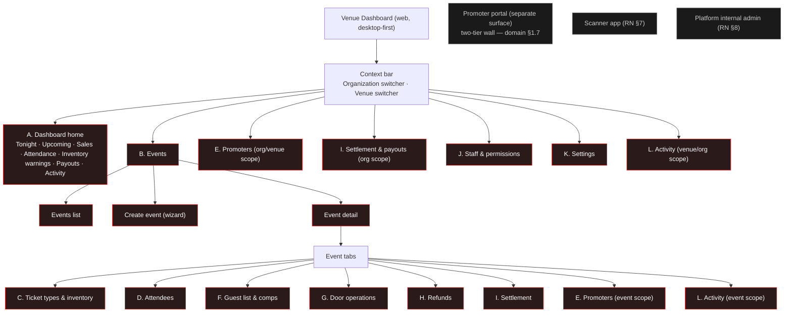

# Snatch It — Phase 2 Venue Dashboard Product Spec (UI/UX, build-ready)

**Design-only.** Information architecture, surfaces, states, permissions, and reads. No component code, no JSX, no SQL, no styling code. Another engineer must be able to build every surface in this file without inventing a product decision.

**Binding inputs (authoritative; `docs/architecture/_superseded/` is NOT):**
`docs/architecture/SNATCH_IT_DOMAIN_ARCHITECTURE.md` (venue-ops depth §5/Part 1, roles Part 7, admin plane Part 12) ·
`docs/architecture/PHASE_2_PHYSICAL_POSTGRES_SCHEMA_SPEC.md` (the `kernel.*` / `catalog.*` / `venue.*` objects this UI sits over) ·
`docs/architecture/PHASE_2_RLS_PERMISSION_SPEC.md` (**§9.x is the binding role matrix — nothing in this file may contradict it**) ·
`docs/architecture/PHASE_2_RPC_FUNCTION_CONTRACTS.md` (the only write paths) ·
`docs/architecture/PHASE_2_REACT_NATIVE_PRODUCT_SPEC.md` (companion consumer/scanner spec; house style, §2 surface split, §8 admin boundary) ·
`docs/architecture/PHASE_2_SPEC_FOUNDATION.md` (§4 Gate-P decisions, §6 table inventory, §8 Phase-0 invariants).

Companion deliverables: schema (1), migration (2), RLS (3), RPC (4), edge (5), RN product (6), **this file (8 — venue dashboard)**.

Citations in this file use the short forms **schema §x**, **RLS §x**, **RPC §x**, **domain §x**, **RN §x**, **foundation §x**.

---

## 0. Scope, honesty, and what actually exists today

### 0.1 Production reality (state this before anyone builds)

Every `kernel.*`, `catalog.*`, `venue.*`, and `market.*` object referenced in this file is **specification-only**. Production today runs the frozen Phase-0 system: **27 `public.*` tables** (`admin_users`, `ambassador_applications`, `auth_audit_sweep_state`, `bids`, `dispute_resolutions`, `disputes`, `investor_leads`, `listings`, `notification_preferences`, `notifications`, `payments`, `payout_decisions`, `payout_policy`, `profiles`, `push_tokens`, `rate_limits`, `reports`, `saved_listings`, `seller_flags`, `seller_risk_scores`, `stripe_connect_archive`, `stripe_webhook_events`, `transfer_notifications`, `transfers`, `user_blocks`, `venue_partnership_inquiries`, `webhook_retries` — verified by enumerating `CREATE TABLE` across `supabase/migrations/` on this branch). There is **no venue schema in production**, no `catalog.event`, no `venue.order`. This dashboard cannot be built against production; it is built against Phase-2 migrations `076–091` (foundation §3, migration plan; canonical map in `docs/architecture/PHASE_2_PACKAGE_REGISTRY.md`).

Consequence for planning: **nothing in this file is a "wire up the existing tables" task.** Every surface here is gated on its migration package landing first.

### 0.2 MVP scope (honest — do not exceed)

Miami-only, approved venues only. `venue.ticket_type.kind` is **`admission` | `table` only** (schema §3.1, C11) — no bundles, no add-ons, no tier-ladder object, no seat maps (C42 is backend-only). **No re-entry** (C41). No multi-currency. No analytics platform: this dashboard reports **operational counters the venue needs tonight**, not cohorts, funnels, conversion rates, retention, or forecasts. Where a Phase-3 capability would be expected and is absent, the surface says so plainly rather than shipping a hollow chart.

### 0.3 Evidence discipline used throughout

- A table, column, RPC, enum value, or role is named **only** where a binding input contains it, with the citation.
- **`INFERENCE:`** marks a product conclusion I drew from the specs but that no spec states.
- **`UNVERIFIED:`** marks something a sibling architect (A–D) asked for that is **not** in the frozen specs — it is their delta, not mine, and I do not claim it exists.
- Anything the dashboard needs that no one has requested appears **only** in §21 (delta request), never asserted as existing.

---

## 1. Operator product language

The venue dashboard is **operational software for professionals**, so — unlike the consumer app (RN §0) — operators legitimately see domain nouns: *event*, *session*, *ticket type*, *inventory batch*, *hold*, *order*, *settlement*, *payout*, *comp*, *guest list*, *scan*. Precision here prevents door mistakes.

**Still forbidden in every operator label, tooltip, toast, empty state, and error** (architecture leakage, foundation §9):
**kernel · catalog · rail · ticket atom · atom · SSCAS · credential_version · resale_state · market_sale · ownership log · cause-code · shard · RLS · definer.**

| Backend object (internal) | Operator-facing word |
|---|---|
| `kernel.organization` | **Organization** |
| `catalog.venue` | **Venue** |
| `catalog.event` | **Event** |
| `catalog.event_session` | **Session** (a one-night event shows one session as its date, not as a second noun) |
| `venue.ticket_type` | **Ticket type** |
| `venue.inventory_batch` | **Inventory** / a named **release** (Public sale · Promoter hold · Comps · Door · Presale) |
| `venue.inventory_batch_shard` | *(never shown — internal decomposition, RLS §9.3 note 25)* |
| `venue.inventory_hold` | **Hold** |
| `venue.order` / `order_item` | **Order** / **Order line** |
| `kernel.tickets` | **Ticket** (never "atom") |
| `kernel.tickets.state = voided` | **Voided** (never "refunded" — D2: the ticket has no refunded terminal) |
| `venue.scan` | **Scan** / **Check-in** |
| `catalog.event_session.door_open_at` | **Door manifest open** (and its consequence: "Transfers closed") |
| `venue.settlement` / `settlement_line` | **Settlement** / **Settlement line** |
| `kernel.payout` | **Payout** |
| `venue.promoter_link` | **Promoter link** |
| promoter code (Agent C) | **Promoter code** |
| `venue.comp_allocation` | **Comp** |
| `kernel.admin_audit` | *(never shown as such — see §17)* |

**Rule:** every surface below names its backend object for the engineer; that name must not reach rendered copy except where the table above maps it.

---

## 2. Design principles

1. **The dashboard is a client of the RPC surface, never of the tables' write side.** GP-1 (RLS §1.3) makes direct client `INSERT`/`UPDATE`/`DELETE` deny-everywhere on every Phase-2 table. Every button in this file resolves to exactly one named RPC. If a surface has no RPC, it is read-only or it is in §21.
2. **Authority is re-checked at the action, not at render.** A hidden button is a courtesy; the RPC's in-body live-table predicate re-check is the security (RLS §2.2, §11; RPC §0.1). The UI never sends a role or an org id it "knows"; it sends the scope id and lets the server decide. A demoted user's still-open tab fails at the click, and the UI renders that as a permission-denied state, not as a crash.
3. **Cross-organization access is impossible by construction** (§4.4). There is no route, no read, and no aggregate anywhere in this IA that spans organizations.
4. **Never show a number the venue will mistake for money it is owed.** Home shows *gross*; only Settlement shows *net*. Every gross figure carries the disclaimer inline, not in a tooltip.
5. **Capacity truth is one number, computed.** `remaining = capacity − held − sold` (schema §3.2, C27). The dashboard never offers an editable "remaining" field and never displays a second, differently-derived availability number anywhere.
6. **Free is not free.** Comps and guest-list conversions draw real capacity from a real `comp` batch (domain §1.6, A4). Any comp surface that could imply otherwise is wrong.
7. **Destructive and money actions state their blast radius before confirming.** Cancel event, refund, close settlement, open the door manifest, revoke a PIN — each shows what it will do, in counts, before the confirm is enabled.
8. **The door is a different job.** Door surfaces are large-target, high-contrast, one-decision-per-screen, and usable one-handed on a phone at 1 a.m. Back-office surfaces are dense and keyboard-driven. They do not share a layout system beyond tokens.
9. **The dashboard does not go offline.** It is an online back-office surface that *reports* device offline state. Offline-first belongs to the scanner (RN §7). No surface here caches a write.
10. **Honest absence.** Where MVP lacks a capability an operator expects (scheduled on-sale, tier ladders, per-type purchase limits, table-spend tracking, bot defense), the surface says what MVP does instead. No disabled control that implies a coming feature without labeling it.

---

## 3. Platform decision and responsiveness contract

### 3.1 Surface split (adopted from RN §2, unchanged)

| Surface | Platform | Owner spec |
|---|---|---|
| Consumer (discovery, checkout, wallet, transfer) | React Native | RN spec §3–§6 |
| **Venue dashboard** (this file) | **Web, desktop-first** | this file |
| Door scanning | Dedicated mobile scanner mode | RN spec §7 |
| Platform internal admin | Separate internal plane | RN spec §8 |

**The venue dashboard is NOT duplicated inside the consumer React Native app.** No venue surface ships in the fan binary. A venue manager who is also a fan uses two products with one identity (domain §8.3).

### 3.2 Breakpoints

| Token | Width | Intent |
|---|---|---|
| `xl` | ≥ 1280 | Primary target. Persistent left nav, multi-column, dense tables, keyboard shortcuts. |
| `lg` | 1024–1279 | Nav collapses to icons; tables drop the least-load-bearing columns; side panels become drawers. |
| `md` | 768–1023 | Tablet. Nav becomes a top drawer. The **five mobile-critical surfaces** (§3.3) are fully functional; every other surface is **read-only** with an "Open on a larger screen to edit" banner. |
| `sm` | < 768 | Phone web. Only the five mobile-critical surfaces render as first-class. All others render a summary card plus the same banner. |

**Rule:** below `md`, no surface that can move money, change capacity, change price, change roles, or cancel an event is editable. Those are `lg`+ only. This is a deliberate blast-radius decision, not a layout limitation. `INFERENCE:` no spec mandates this; it follows from principle 7 plus the fact that every one of those actions is money-consequential or custody-consequential.

### 3.3 The five surfaces that must be genuinely usable on tablet and phone

These five are worked at the door, on the floor, or on the way to the venue. Each specifies what changes per breakpoint.

**1. Attendees (§9)**
- `xl`: full table — name · ticket type · qty · order status · check-in · source · promoter · refund state · order ref. Filter rail pinned left. Row click opens a right drawer.
- `lg`: drops `order ref` and `source` into the drawer. Filter rail collapses to a filter button with a count badge.
- `md`: table becomes a **card list**: line 1 name + check-in pill, line 2 ticket type · qty, line 3 order status · refund state. Search is the primary control and is sticky at the top. Filters in a bottom sheet, same closed enumerated set (Agent B).
- `sm`: same card list, single column, 56px minimum row height, search sticky. **Export is hidden below `lg`** — an export is a considered, audited act, not a thing you fire from a phone in a queue.

**2. Door operations (§12)**
- `xl`: three-pane — sessions list · live scan board (counters + stream) · device/PIN panel.
- `lg`: two-pane, device/PIN panel becomes a drawer.
- `md`/`sm`: **single-column, counter-first.** Top: one session, admitted / issued, big. Then per-device status rows (online, manifest age, queue depth). Then manual lookup as a full-width control. Then the flag queue as a count with a tap-through. Manifest open/close stays available at `md` and above; at `sm` it is **read-only status** (it freezes transfers for the whole session — not a phone-in-a-crowd action).

**3. Guest list (§11)**
- `xl`: table with inline check-in toggles and bulk add.
- `lg`: same, bulk add moves to a modal.
- `md`/`sm`: **check-in-optimized card list** — guest name large, party size as a chip, a single full-width Arrived / Not arrived toggle per card, search sticky, list default-filtered to "Not arrived". Add-guest stays available (single entry only; paste-many is `lg`+). Comp allocation is `lg`+ only (it draws capacity and carries a step-up seam, C39).

**4. Inventory status (§8)**
- `xl`: matrix — ticket types down, batches across, counters in cells, holds panel beside.
- `lg`: one table per ticket type.
- `md`/`sm`: **read-only status cards**, one per ticket type: name, price, and a capacity bar segmented `sold | held | remaining` with the three numbers written out. Warnings (low, sold out, door batch untouched, holds expiring) list beneath. **No capacity edits, no price edits, no batch creation below `lg`.** Releasing a specific expired hold IS allowed at `md` (it is a reversal, not a capacity change).

**5. Promoter performance (§10)**
- `xl`: promoter table with per-promoter sales, gross attributed, commission accrued/paid, plus the attribution detail drawer.
- `lg`: drops commission-paid into the drawer.
- `md`/`sm`: **read-only leaderboard cards** — promoter name, tickets attributed, gross attributed, commission accrued, status pill. Attribution detail opens full-screen and keeps `method`, `touch_corroborated`, `self_deal_flag` visible (Agent C requires the dispute-defence view to be complete wherever it renders). Issuing codes/links and the self-deal queue are `lg`+ only.

---

## 4. Information architecture

### 4.1 Navigation map

### 4.2 The two scope axes

Everything in this dashboard hangs off exactly one of two scopes, and the UI never blends them:

- **Organization scope** — money and people: settlement, payouts, payout destination, org members. Tested with `kernel.has_org_role(org_id, …)` (RLS §2.2).
- **Venue scope** — the room and the night: events, ticket types, inventory, guest lists, comps, door, venue staff. Tested with `kernel.has_venue_role(venue_id, …)`, or `kernel.has_event_role(event_id, …)` which resolves event → venue (RPC §1.1).

The org and venue **role label sets are disjoint by construction** (C36, RLS §2.1). The Staff section (§15) therefore renders **two separate rosters**, never one merged "Team" list — merging them is precisely the confusion C36 exists to make impossible.

`INFERENCE:` where an org role needs venue-grain authority (an `org_owner` editing an event), that inheritance lives inside the write RPCs (RLS §2.4), so the UI shows the control based on the same OR-predicate the RPC uses — it does not widen any read.

### 4.3 Context switching

The context bar's organization list is read from `kernel.org_member` for `auth.uid()` (RLS §7.3: "own org roster"); the venue list from `venue.staff_role` for `auth.uid()` (schema §3.9, index on `identity_id`, "my venues") **plus** venues of orgs where the user holds `org_owner`/`org_admin` (RLS §9.9: "venues of own org"). There is no "all organizations" or "all venues" read for any non-platform principal anywhere in this IA.

### 4.4 Why cross-organization access is impossible by construction

1. **No unscoped route exists.** Every dashboard route carries an org id, venue id, or event id, and every read behind it is a scoped read RPC or an RLS-filtered select. There is no route whose result set is "all".
2. **Scope ids are untrusted params.** RPC §0.1 makes every RPC re-check its scope predicate in-body against live tables. A tampered id in the URL returns `insufficient_privilege`, never another org's rows.
3. **No cross-org aggregate is ever computed.** A person operating three organizations sees three separate contexts and switches between them. There is deliberately **no "all my organizations" revenue tile, no combined attendee list, no combined payout view** — such a view would need a read that spans orgs, and no such read is specified or requested here.
4. **The switcher cannot enumerate what the user is not in.** Both switcher reads are keyed to `auth.uid()`.
5. **Deep links fail closed.** A pasted link to another org's event renders the standard permission-denied state (§18) with no partial content, no title, no count — a denial must not leak the existence or shape of the object.
6. **No impersonation.** This dashboard has no "view as venue" mode for platform staff. Platform roles reach venue data through the internal admin plane (RN §8) under `kernel.admin_audit`, not by borrowing a venue context here.

---

## 5. Role × surface access matrix

Consistent with **RLS §9.x** (venue schema), **§7.2/§7.3/§7.3b** (org tables), **§11** (EXEC authority). Columns are the RLS §1.1 principals that can reach this dashboard. `anon` and `fan` (no org/venue/platform role) have **no dashboard at all** — the route set is unreachable and returns the signed-out or denied state.

**Legend:** ● full (read + all writes the surface offers) · ◐ scoped subset (see note) · ○ read-only · — denied (surface not rendered; direct link → permission-denied state).

Platform columns record what RLS permits; **platform staff reach these objects through the internal admin plane (RN §8), not through this dashboard** — they are shown so the matrix is complete and so no one builds a venue-side control that platform is supposed to own.

| # | Surface | o_mbr | o_own | o_adm | o_fin | v_mgr | v_fin | v_door | promo | p_sup | p_rsk | p_adm |
|---|---|:--:|:--:|:--:|:--:|:--:|:--:|:--:|:--:|:--:|:--:|:--:|
| 1 | A. Home — Tonight & upcoming | ◐¹ | ● | ● | ◐² | ● | ◐² | ◐³ | — | ○ | ○ | ● |
| 2 | A. Home — Sales & gross revenue | — | ● | ● | ● | ● | ○ | ◐³ | — | ○ | ○ | ● |
| 3 | A. Home — Attendance / check-in | — | ○ | ○ | — | ● | — | ◐³ | — | ○ | ● | ● |
| 4 | A. Home — Inventory warnings | ◐⁴ | ● | ● | ○ | ● | ○ | ◐³ | ◐⁴ | ○ | ○ | ● |
| 5 | A. Home — Payout status | — | ○⁵ | — | ● | — | — | — | — | ○ | ○ | ● |
| 6 | A. Home — Recent activity | — | ● | ● | ◐⁶ | ● | ◐⁶ | — | — | ○ | ○ | ● |
| 7 | B. Events — list & detail (read) | ○ | ● | ● | ○ | ● | ○ | ◐³ | ○⁷ | ○ | ○ | ● |
| 8 | B. Events — create / edit draft / add session | — | ● | ● | — | ● | — | — | — | — | — | ● |
| 9 | B. Events — publish / status change | — | ● | ● | — | ● | — | — | — | — | — | ● |
| 10 | B. Events — cancel event | — | ● | ● | — | ● | — | — | — | — | — | ● |
| 11 | B. Events — resale policy | — | ● | ● | ○ | ● | ○ | — | — | ○ | ○ | ● |
| 12 | C. Ticket types — read | ○ | ● | ● | ○ | ● | ○ | ◐⁸ | ○⁷ | ○ | ○ | ● |
| 13 | C. Ticket types — create | — | ● | ● | — | ● | — | — | — | — | — | ● |
| 14 | C. Ticket type — price / visibility change | — | ● | ● | — | ● | — | — | — | — | — | ● |
| 15 | C. Inventory — counters (full) | ◐⁴ | ● | ● | ○ | ● | ○ | ◐⁴ | ◐⁴ | ○ | ○ | ● |
| 16 | C. Inventory — create batch / capacity change | — | ● | ● | — | ● | — | — | — | — | — | ● |
| 17 | C. Holds — list & release | — | ◐⁹ | ◐⁹ | ○ | ● | ○ | ◐³ | — | ○ | ○ | ● |
| 18 | D. Attendees — list & detail | — | ● | ● | ◐¹⁰ | ● | ◐¹⁰ | —¹¹ | — | ○ | ○ | ● |
| 19 | D. Ticket holder mix (aggregate) | — | ○ | ○ | ○ | ○ | ○ | — | — | — | — | ○ |
| 20 | D. CRM export | —¹² | ● | ● | —¹² | ● | —¹² | —¹² | —¹² | —¹² | —¹³ | —¹³ |
| 21 | E. Promoters — list & manage | — | ● | ● | ○ | ● | ○ | — | ◐¹⁴ | ○ | ○ | ● |
| 22 | E. Promoter links & codes — issue / switch | — | ● | ● | — | ● | — | — | — | — | — | ● |
| 23 | E. Attribution & performance | — | ● | ● | ● | ● | ○ | — | ◐¹⁴ | ○ | ○ | ● |
| 24 | E. Self-deal flag queue — review | — | ● | ● | — | ● | — | — | — | — | ● | ● |
| 25 | F. Guest list — read | — | ● | ● | — | ● | — | ◐³ | — | ○ | ○ | ● |
| 26 | F. Guest list — manage entries | — | ● | ● | — | ● | — | — | — | — | — | ● |
| 27 | F. Guest list — door check-in | — | ● | ● | — | ● | — | ◐¹⁵ | — | — | — | ● |
| 28 | F. Comps — allocate / issue | — | ● | ● | ○ | ●¹⁶ | ○ | ◐³ | — | ○ | ○ | ● |
| 29 | G. Door PINs — issue / revoke | — | ● | ● | — | ● | — | ○¹⁷ | — | ○¹⁷ | ○¹⁷ | ● |
| 30 | G. Devices & manifest | — | ● | ● | — | ● | — | ◐¹⁸ | — | ○ | ○ | ● |
| 31 | G. Live scan board & totals | — | ○ | ○ | — | ● | — | ◐³ | — | ○ | ● | ● |
| 32 | G. Manual attendee lookup | — | ● | ● | — | ● | — | ●³ | — | ○ | ○ | ● |
| 33 | G. Flag / duplicate queue — view & escalate | — | ○ | ○ | — | ○ | — | ◐³ | — | ○ | ● | ● |
| 34 | G. Flag adjudication (resolve) | — | — | — | — | —¹⁹ | — | — | — | — | ● | ● |
| 35 | H. Refunds — order list | — | ● | ● | ● | ● | ○ | ◐³ | — | ○ | ○ | ● |
| 36 | H. Refund — initiate | — | —²⁰ | — | ● | —²⁰ | —²⁰ | — | — | ◐²¹ | ● | ● |
| 37 | I. Settlement — read header + lines | — | ● | ● | ● | ● | ● | — | — | ○ | ○ | ● |
| 38 | I. Settlement — open | — | ● | — | ● | ● | ● | — | — | — | — | ● |
| 39 | I. Settlement — close (→ payout) | — | — | — | ● | — | ● | — | — | — | — | ● |
| 40 | I. Payouts — status & history | — | ○⁵ | — | ● | — | — | — | — | ○ | ○ | ● |
| 41 | I. Payout — request disbursement | — | ● | — | ● | — | — | — | — | — | — | ● |
| 42 | J. Org members & invites — read | ○ | ● | ● | ○ | — | — | — | — | ○ | ○ | ● |
| 43 | J. Org invite / role change / remove | — | ● | ◐²² | — | — | — | — | — | — | — | ● |
| 44 | J. Venue staff roster — read | — | ● | ● | — | ● | ○²³ | ○²³ | ○²³ | ○ | ○ | ● |
| 45 | J. Venue staff — grant / revoke | — | ● | ● | — | ● | — | — | — | — | — | ● |
| 46 | K. Org & venue profile | ◐²⁴ | ● | ◐²⁴ | ◐²⁴ | ◐²⁵ | — | — | — | ○ | ○ | ● |
| 47 | K. Payout destination | — | ●²⁶ | — | ○ | — | — | — | — | ○ | ○ | ● |
| 48 | K. Notification preferences | ● | ● | ● | ● | ● | ● | ● | — | — | — | ● |
| 49 | L. Operational activity log | — | ● | ● | ◐⁶ | ● | ◐⁶ | — | — | ○ | ○ | ● |

**Notes**

1. `org_member` reads events/sessions (public-read, RLS §8.2/§8.3) and `remaining` only — it gets a catalogue view, not an operations view. `org_member` is deliberately the emptiest dashboard in the product.
2. `org_finance` / `venue_finance` are `D` on `venue.scan` (RLS §9.12) — their Tonight card shows sold and gross, **no attendance figures**.
3. `venue_door` is session-scoped and only for sessions its grant or PIN covers (RLS §1.1 row 9; §9.7 "own session orders", §9.12 "own session"). It sees no other session, no other event, no other venue.
4. Only the computed `remaining` projection is world-readable; raw `capacity`/`held`/`sold` are staff-scoped (RLS §9.2 note 23). `org_member` and `promoter` therefore see availability, never the counters.
5. **Flagged conflict (§22.3):** `kernel.request_org_payout` grants `org_owner` the request authority (RPC §10.3) but `kernel.payout`'s read authority names only "payee + org finance + platform" (schema §1.9). Shown as `○` on the read pending resolution.
6. Finance roles see the finance-relevant subset of the activity feed (settlement, payout, refund, price change) — see §17.3.
7. `promoter` reads public-visibility ticket types and `remaining` (RLS §9.1, §9.2) — but **inside the promoter portal, not this dashboard** (note 14).
8. `venue_door` reads `door_only` + `public` visibility ticket types for its own session (RLS §9.1).
9. `org_owner`/`org_admin` may `release_hold` for venue ops (RLS §9.5) but are `D` on `INSERT` there — they can release, not create, a hold from this surface.
10. Finance roles see money columns; **no contact PII** (domain §7.6 "View buyer PII: ◐(limited)"). See §9.3.
11. **Hard rule:** door staff never receive a bulk attendee list (domain §7.2, Door "Cannot list attendees in bulk"). Door gets single-record manual lookup only (row 32).
12. Agent B's CRM-export constraint denies `venue_door`, `venue_finance`, `org_finance`, `promoter`, `org_member` explicitly.
13. Agent B's allow-list is `venue_manager`, `org_owner`, `org_admin` only; `platform_risk`/`platform_admin` are not on it, so the venue export surface does not render for them. Platform data access runs through the internal admin plane. `UNVERIFIED:` no frozen spec covers CRM export at all.
14. Promoters see only their own promoter row, own links, own attributions (RLS §9.17 note 40) — **in the separate promoter portal** (domain §1.7 two-tier wall). They never load this dashboard.
15. Door may update `status`/`checked_in_at` on guest entries for its session only (RLS §9.16 note 39).
16. Comp issuance beyond a per-staff threshold requires step-up + live grant re-check + reason code (C39; domain §7.5).
17. `pin_hash` is stripped from every client grant and is never returned to any client (RLS §9.10 note 32). Everyone's "read" excludes it.
18. Door updates only its own device's `last_sync_at`/`manifest_version` via the sync RPC (RLS §9.11 note 33).
19. `venue_manager` reads flagged scans (RLS §9.12 `A(own-venue)`) but has **no `INSERT`/EXEC for fraud-review actions** — only `platform_risk`/`platform_admin` do. The venue's action is *escalate*, not *resolve* (§12.7).
20. **Flagged conflict (§22.1):** RLS §11 grants `kernel.refund_primary_order` to `has_org_role([org_finance])` only among org roles; domain §7.2/§7.6 shows Org Owner with refund authority under dual control. This spec follows RLS (binding).
21. `platform_support` holds a *capped* refund authority whose ceiling is explicitly deferred to policy (RPC §16.3).
22. `org_admin` cannot invite or grant at `org_owner` tier (schema §1.3b; RLS §7.3b).
23. Venue staff see their own venue's roster (RLS §9.9 "own-venue roster") — read-only, no grants.
24. `org_member`/`org_admin` see `display_name` + `status` only; `legal_name`, Connect ref, and the payout lock are column-scoped to `org_owner`/`org_finance`/platform (RLS §7.2 note 4).
25. Venue profile (name, neighborhood, address, `capacity_hint`) is venue-manager editable via `catalog.update_venue` (RPC §3.3); `approval_status` is platform-set and read-only here.
26. `kernel.set_org_payout_destination` is `org_owner` only, dual-control seam, and triggers the `payout_destination_locked_until` cool-down (RLS §11; schema §1.2).

---

## 6. (A) Dashboard home

**Route:** `/o/{org}/v/{venue}` · **Purpose:** answer "what do I need to do about tonight, and did I get paid?" in one screen, with nothing on it that a Phase-3 analytics product would own.

### 6.1 Zones (top to bottom, desktop)

**1 · Tonight**
One card per session whose `starts_at` is today or whose `status = 'live'` (schema §2.3 indexes `starts_at` for exactly this). Each card: event title · doors time · **sold / capacity** · **admitted count** · door manifest state (Closed / **Open — transfers frozen**) · devices online / registered · guest list arrived / total.
Empty: *"Nothing on tonight."* Never fabricate an empty card row.

**2 · Upcoming**
Next N sessions (default 10) by `starts_at`. Per row: event · date · status pill (`draft` · `announced` · `on_sale` · `live` · `completed` · `cancelled`, schema §2.2) · sold / capacity · days to doors · a warning chip if any inventory warning applies.
Empty: *"No upcoming events. Create one to start selling."* with the create action if the role has it.

**3 · Tickets sold**
Count and gross for the selected window (Today · 7 days · 30 days · This event). Source: `paid` `venue.order` + `venue.order_item`. One sparkline of sold-per-day for the current window — **this is the only chart on this page.**

**4 · Revenue (gross)**
Gross for the window, in USD from integer minor units (schema §0.3). Rendered with a permanent inline caption, not a tooltip:
> *"Gross, before fees and refunds. What you'll actually be paid is in Settlement."*
Hidden entirely for roles without order money read (matrix row 2).

**5 · Attendance / check-in**
For live and completed sessions: **admitted / issued**, percentage, last scan time, plus the non-admitted counts (`duplicate`, `invalid`, `frozen`, `fraud_review` — the `venue.scan.result` enum, schema §3.12). Hidden for `org_finance`/`venue_finance` (note 2 above).

**6 · Inventory warnings**
One row per condition, each naming the ticket type and the release:
- *Low* — `remaining` below the configured threshold for that batch.
- *Sold out* — `remaining = 0` **and** `sold` accounts for it.
- *All held, none sold* — `remaining = 0` because `held` consumed it. These two look identical to a fan and are completely different to an operator; never collapse them.
- *Door stock untouched* — a `door` release_kind batch with `sold = 0` while the session is live.
- *Holds expiring* — active `venue.inventory_hold` rows with `expires_at` inside the next hour.
**One row per (batch, threshold)** and it does not re-fire on the same pair — deliberately identical to Agent D's low-inventory notification rule, so the banner and the notification never disagree.

**7 · Payout status**
Latest settlement per recently-closed event with its payout state (`pending` · `submitted` · `paid` · `failed` · `reversed`, schema §1.9). **A `failed` payout pins to the top of the page and is not dismissible** for `org_finance` and `org_owner` — matching Agent D's non-opt-out routing for payout failure, so the alert channel and the dashboard agree.

**8 · Recent activity**
Last 20 rows of §17's operational feed, with a "See all" link. Never security events (§17.2).

### 6.2 What home deliberately does NOT have

No conversion rate, no funnel, no cohort, no repeat-buyer rate, no channel attribution beyond the promoter counts in §10, no forecast, no benchmark against other venues, no year-over-year, no heat map. If an operator asks, the answer is Phase 3. Shipping a hollow version of any of these is worse than not shipping it.

### 6.3 States

- **Loading:** zone-level skeletons; zones resolve independently (Tonight must not wait on Settlement).
- **Empty:** per zone, specific copy above. Never one page-level "no data".
- **Error:** per zone error card with retry; one zone failing never blanks the page.
- **Permission-denied:** zones the role cannot read are **absent**, not greyed. A role that can read no zone at all (e.g. `org_member` with no venue role) gets the catalogue-only home plus *"Your access covers event details only. Ask an organization owner or admin for more."*
- **Offline:** the browser-offline banner; the page is stale-labelled with last-loaded time. No writes queue.

**Reads:** §20 rows A1–A8.

---

## 7. (B) Events

### 7.1 Events list — `/o/{org}/v/{venue}/events`

Columns: title · venue · next session date · status pill · sold / capacity · resale mode · promoter count.
Filters (closed set): status, venue, date range. Search: title substring.
Sort: next session (default), title, sold.
**Reads:** `catalog.event` (RLS §8.2 — public-read for `announced`+, org/venue-scoped for `draft`), `catalog.event_session`, `venue.inventory_batch.remaining`, `catalog.resale_policy`.
States — loading: table skeleton · empty: *"No events yet."* + Create (role-gated) · error: retry · denied: standard denial.

### 7.2 Create event — 3-step wizard

Ends in `draft`. Steps:
1. **Basics** — title, venue (pre-filled from context), first session `starts_at`, optional `doors_at`, optional `session_label`. → `catalog.create_event` (RPC §4.1), which **auto-creates the implicit first session** (A1). Precondition surfaced by the UI: the venue must be `approved` (RPC §4.1) — if not, the wizard blocks at step 1 with *"This venue isn't approved to sell yet. Snatch It has to approve it first."*
2. **First ticket type** — kind (`admission` | `table`), name, price, visibility. → `venue.create_ticket_type` (RPC §5.1).
3. **First inventory release** — release kind, capacity, session. → `venue.create_inventory_batch` (RPC §5.2).

Step 2 and 3 are part of the wizard because **publishing requires at least one ticket type with a batch** (RPC §4.2 precondition, "no empty on-sale"). Doing it later is allowed; doing it never means the event can never go on sale, and the wizard should not let someone discover that a week later.

### 7.3 Edit draft

Editable while `draft`: title; session `starts_at`/`doors_at`/`ends_at`/`label`; ticket types; batches; resale policy.
Once `on_sale`, price and capacity edits become **confirmed operations** with an explicit warning (schema §3.1 "on-sale edits confirmed"; §2.3 "`starts_at` change on an on-sale session is a confirmed operation").

### 7.4 Publish / announce / status

One control: **Advance status**, offering only the next legal forward transition from `draft → announced → on_sale → live → completed` (RPC §4.2 validates the transition server-side; the UI must not offer a jump it will reject).
- `announced` — visible publicly, not buyable.
- `on_sale` — buyable. **Blocked** unless ≥1 ticket type with a batch exists; the UI pre-checks and, when blocked, names what's missing rather than showing a dead button.
- `live` — the night itself.
- `completed` — terminal for sales.
There is **no reverse transition** in the contract. The UI must say so before the confirm: *"You can't move an event backwards."*

**MVP on-sale configuration is manual.** There is no `announce_at`/`on_sale_at` column in `catalog.event` (schema §2.2) and no scheduler in the RPC contract. The surface states: *"On-sale starts when you set it to On sale. Scheduling isn't available yet."* → delta §21.6.

### 7.5 Event image, description, lineup

**Not modeled.** `catalog.event` has `event_id`, `venue_id`, `org_id`, `title`, `status`, timestamps — nothing else (schema §2.2). Domain §1.3 describes lineup/media/visibility as event attributes, but the *physical* Phase-2 schema does not carry them. MVP renders a venue-derived placeholder and does **not** ship an uploader against a column that does not exist. → delta §21.5.

### 7.6 Sessions

List of `catalog.event_session` for the event: label, `starts_at`, `doors_at`, `ends_at`, `status` (`scheduled` · `live` · `completed` · `cancelled`), and — read-only — **door manifest state** (`door_open_at`).
Add session → `catalog.create_event_session` (RPC §4.3); label must be unique per event.
Capacity is **per session**, expressed through the batches attached to it (domain §1.3) — the UI must never show an event-level capacity number, because oversell is checked per session and an event-level figure is the exact lie that causes a residency to oversell one night.

### 7.7 Resale policy

Per event (or inherited from the venue-scope policy). Fields from `catalog.resale_policy` (schema §2.5): `mode` ∈ `off` · `transfers_only` · `fixed_cap` · `face_value_queue` · `buy_now` · `auction` · `offer`; `price_cap_bps` (for `fixed_cap`); `royalty_bps`.
**Default is `off`** (C11) and the UI says so: *"Resale is off unless you turn it on."*
Changing the policy **creates a new version, never an edit** (schema §2.5, AO per version). The surface shows the in-force version and `effective_from`, and warns: *"Tickets already listed keep the policy they were listed under."* (listings snapshot `policy_id` + `version`, schema §2.5).
Write: `catalog.set_resale_policy` (RPC/RLS §11) — `org_owner`/`org_admin`/`venue_manager`.

### 7.8 Cancel event

The most destructive control in the product. Route: event detail → danger zone.
Pre-confirm panel shows the **blast radius as counts**, read live: sessions to cancel · tickets to void · orders to refund · open listings and transfers to cancel. Reason code required (closed set).
Confirm requires typing the event title. Step-up applies (domain §7.5, ownership/refund class).
Write: `catalog.cancel_event` (RPC §4.4) — cascades sessions, cancels open native listings/auctions/p2p, voids every issued ticket, and records refund intents; Stripe refunds execute edge-side, so the result screen shows a **progress state**, not a completed one.
Copy rule: never say "delete". Nothing is deleted (GP-2, RLS §1.3).
States: loading blast radius · blast-radius-unavailable → **block the action** (never cancel blind) · in-progress · partial (some refunds still executing) · error.

### 7.9 Event detail

Header: title, venue, next session, status pill, quick counters (sold / capacity, gross, admitted when live).
Tabs: Overview · Ticket types · Attendees · Guest list · Promoters · Door · Refunds · Settlement · Activity. Tabs the role cannot read are absent (not disabled).

---

## 8. (C) Ticket types & inventory

### 8.1 Ticket types list

Per event. Columns: name · kind (`admission` | `table`) · price · visibility (`hidden` | `public` | `door_only`) · releases · sold / remaining.
**Reads:** `venue.ticket_type` (RLS §9.1), `venue.inventory_batch` (RLS §9.2).

### 8.2 Create ticket type

Fields: kind, name (unique per event, schema §3.1), price (minor units, > 0), visibility.
Write: `venue.create_ticket_type` (RPC §5.1).
Blocked when the event is `completed`/`cancelled` (RPC §5.1 precondition) — stated, not silently failed.

**What MVP does not have, said plainly on this surface:**
- **No tier ladder object.** Domain §1.4 describes `tier_group`/`tier_rank` and `sell_out_unlocks_next`; the physical schema has neither (schema §3.1). MVP expresses tiers as **separate ticket types** whose visibility the operator flips by hand. The surface says: *"Tiers are separate ticket types today. Turn the next one public when the first sells out."*
- **No bundles, no add-ons.** `kind` is `admission | table` only (C11).
- **No table spend tracking.** A `table` type records a price; the running minimum-spend balance and its at-the-room settlement are **not modeled** (C45, domain §1.4). No surface may imply the platform tracks table spend. Copy: *"Snatch It handles the deposit. The balance at the table settles with you, off-platform."*

### 8.3 Price / visibility change

Money-consequential → live-table recheck (C9, schema §3.1, RLS §9.1 note 22). The UI:
1. Shows current price and the new price.
2. Warns when the event is `on_sale` or `live`: *"This event is selling. The new price applies to purchases from now on. Tickets already sold keep the price they were sold at."* (order items snapshot price, schema §3.8.)
3. Requires confirm; the change is audited.
Write: `venue.set_ticket_type_price` (RPC §5.1 companion).

### 8.4 Inventory: releases (batches)

One batch per (ticket type × session × `release_kind`). `release_kind` ∈ `public_sale` · `promoter_hold` · `comp` · `door` · `presale` (schema §3.2), shown with operator names: **Public sale · Promoter hold · Comps · Door · Presale**.

Matrix cell per batch: `capacity` · `held` · `sold` · **`remaining` (computed, never editable)** · a segmented bar.
Create batch → `venue.create_inventory_batch` (RPC §5.2): capacity > 0, type and session in the same event. Shard count is an internal optimization — **do not expose it**; the create form has no shard field, and the operator never sees shard rows (RLS §9.3 note 25). `INFERENCE:` sharding is chosen by ops policy, not by the venue.
Capacity change: audited, guarded, and refused if it would drop capacity below `held + sold` (the CHECK, schema §3.2). The UI computes and shows the floor: *"You can't go below 240 — that's what's already held or sold."*

### 8.5 Door vs public inventory

The `door` release is stock deliberately withheld from online sale so the box office has something to sell at 1 a.m. (domain §1.5). The surface states it as one line per session:
> **Held back for the door: 40 of 500** — and, when the session is live and that batch has `sold = 0`, an inventory warning (§6.1 zone 6).

### 8.6 Sale windows and quantity limits

**Not modeled per ticket type.** `venue.ticket_type` carries no sale window and no per-order min/max (schema §3.1). The per-user cap is a **global platform value** read from `catalog.platform_config` inside `venue.reserve_primary_inventory` (RPC §5.3). The surface therefore shows the cap **read-only** with *"Purchase limit: N per person (set by Snatch It)."* and offers no per-type override. → delta §21.7.

### 8.7 Holds

List of `venue.inventory_hold` for the event: holder, quantity, kind, `status` (`active` · `converted` · `released` · `expired`), `expires_at` countdown.
Action: **Release** → `venue.release_inventory_hold` (RPC §5.5) — idempotent; double-release is a no-op, so the UI never needs a "did that work?" retry loop.
Copy for staff/promoter holds: *"Releasing this puts the tickets back on sale immediately."*

### 8.8 Sold out vs held out

Two distinct states, never merged:
- **Sold out** — `remaining = 0`, driven by `sold`. Copy: *"Sold out."*
- **All held** — `remaining = 0`, driven by `held`. Copy: *"Nothing available — everything is on hold. Release holds to put tickets back on sale."*

### 8.9 States (all inventory surfaces)

Loading: matrix skeleton · Empty: *"No ticket types yet"* / *"No releases yet — add one so this type can sell."* · Error: retry, and **counters never render stale-optimistic** (an inventory number the operator can't trust is worse than a spinner) · Denied: standard · Partial: a batch whose counters fail to load renders as *"Couldn't load"* — never as zero.

---

## 9. (D) Attendees

**Grain: the session.** Attendees are listed per `catalog.event_session`, because that is the admission grain (domain §1.3) and a residency's Friday list is not its Saturday list.

### 9.1 List

Columns (`xl`): name · ticket type · qty · order status · check-in status · source · promoter · refund state · order ref.
- **Name** — from the buyer's `public.profiles` record via `venue.order.buyer_id`. `INFERENCE:` no spec names the display field; the existing profile display name is the obvious source.
- **Order status** — `pending` · `paid` · `partially_refunded` · `refunded` · `cancelled` (schema §3.7).
- **Check-in status** — derived from `venue.scan` for the session: not scanned · admitted (+ time) · duplicate attempt · other non-admit result.
- **Source** — `venue.order.source` ∈ `app` · `web` · `door` · `promoter_link` (schema §3.7).
- **Promoter** — the attributed promoter via `venue.attribution` → `venue.promoter_link` (schema §3.17).
- **Refund state** — derived from order status plus ticket `voided` (D2: a refunded ticket is `voided`, never "refunded").

### 9.2 Search and filters

- **Search:** name (substring), order ref (exact), email (**exact match only**). No email substring search — substring search over emails is a directory-harvesting affordance and this surface will not have one. `INFERENCE:` mirrors the consumer-side exact-match recipient lookup rule (RN §4.5.2).
- **Filters — a closed enumerated set** (Agent B): session · ticket type · order status · check-in status · source · promoter · refund state. **No SQL box, no arbitrary column picker, no free-form query builder** anywhere in this product.

### 9.3 What each role sees in this list

- `venue_manager`, `org_owner`, `org_admin` — the full list including buyer name.
- `org_finance`, `venue_finance` — money columns and counts; **no buyer contact detail** (domain §7.6 "View buyer PII: ◐(limited)").
- **`venue_door` — never.** Bulk attendee listing is denied to door staff (domain §7.2). Door uses §12.6 manual lookup, which returns one record at a time. A door principal hitting this route gets the permission-denied state.
- `promoter` — never, from any surface (RLS §9.17 note 40; domain §1.7).

### 9.4 Attendee detail drawer

Order timeline (created → paid → refunded), order lines with snapshot prices, the tickets in the order with their state, scan result and time, attribution (method + promoter), and role-gated refund actions (§13).
Ticket history uses **`kernel.get_ticket_custody_chain`** (RPC §1.3) — the staff read, with counterpart PII still redacted. It never reads `kernel.ticket_ownership_log` directly (deny-all to clients, RLS §7.6), and it is **not** `market.get_ticket_history`, which is owner-only (RPC §1.2).

### 9.5 Ticket holder mix — the aggregate breakdown card (Agent B, binding)

Placement: **Attendees tab, per event, below the list.** Not on Dashboard home. Never inside the table. Never in the detail drawer.

> **Rendered copy is only what appears in blockquotes and quoted strings below.** This section's own heading and prose are engineering description, not card text — do not lift them into the UI.

- **Card title is exactly "Ticket holder mix."** The words **"attendee", "audience", and "demographics" are banned from this card** — title, subtitle, axis labels, tooltips, legend, and empty state.
- **Aggregate only.** No individual's value is ever shown, and no value ever appears beside a name. There is no drill-down, no row-level join, no "show me who".
- **Suppression:** rendered only when **≥ 25 responses** for the event (k = 25), with a **per-bucket floor of 5** — buckets below 5 are merged into an "Other" bucket or the whole card suppresses if merging cannot preserve the floor.
- **One dimension at a time.** No crossing with ticket type, promoter, price, or time. The dimension selector offers one choice; there is no second axis control to build.
- **Subtitle, always rendered:**
  > *"Based on N of M ticket holders who shared this. One person can hold more than one ticket, so this counts people, not tickets."*
- **Suppressed state copy (exact):**
  > *"Not enough responses to show a breakdown for this event. We show this only when at least 25 ticket holders have shared it."*
- **Footnote, always rendered:**
  > *"Snatch It never shows you who answered what."*
- **Export:** the mix is **not** an exportable object and does not appear in the CRM export (§9.6). It is a read on screen.

`UNVERIFIED:` no frozen spec models demographic responses at all — `kernel.identity_ext` carries only `residency_region` and `kyc_ref` (schema §1.1). The storage, the collection surface, and the aggregation read are **Agent B's**; this section specifies only how the dashboard renders what Agent B provides.

### 9.6 CRM export (Agent B, binding)

**Asynchronous job**, never a synchronous download.

- **Lifecycle:** `queued → running → ready → failed`, plus `revoked`, `expired`, `purged`. The UI renders each as a distinct state with its own copy; `ready` is the only state with a download control.
- **Download:** a **300-second signed URL**, **re-authorized live at download time** — the click re-checks authority server-side before the URL is honoured. An export prepared while the user held `venue_manager` and downloaded after revocation must fail.
- **Audit:** every **request, generate, download, revoke** is audited. The export history panel shows who requested, when, what filters, and what happened to it — and is itself part of the venue activity feed (§17).
- **Authorized:** `venue_manager`, `org_owner`, `org_admin`.
  **Explicitly denied:** `venue_door`, `venue_finance`, `org_finance`, `promoter`, `org_member`, `platform_support`.
- **Phone is never exportable.** Not as a column, not as a filter, not as a hash.
- **Email only where a per-order, per-org opt-in was given.** Non-opted rows export an empty email cell, and the UI **explains why** rather than leaving it blank: an inline legend — *"Email is blank when the buyer didn't agree to share it with this organization."* — plus a count of suppressed cells in the export summary.
- **Filters are the same closed enumerated set as §9.2.** No SQL box. No arbitrary column picker. The column set is fixed per export type.
- **Revoke** is available on any `ready` export and takes effect immediately.
- **Availability:** `lg`+ only (§3.3).

`UNVERIFIED:` the export job, its lifecycle table, and the opt-in record are Agent B's delta; no frozen spec contains them.

### 9.7 States

| State | Copy / behaviour |
|---|---|
| Loading | Table skeleton, filters interactive immediately. |
| Empty (no sales) | *"No tickets sold for this session yet."* |
| Empty (filtered) | *"No attendees match these filters."* + Clear filters. **Distinct from no-sales** — collapsing them makes an operator think the event failed. |
| Error | Retry; filters preserved. |
| Permission-denied | Standard denial; for `venue_door`, the denial names the alternative: *"Door access uses ticket lookup, not the attendee list."* with a link to §12.6. |
| Partial | Attribution or check-in column fails → that column shows *"—"* with a hover explanation; the list still renders. |

---

## 10. (E) Promoters

Scope: org and venue level, plus an event-scoped view inside the event tabs.

### 10.1 The two-tier wall (structural, not a toggle)

Promoters **do not use this dashboard.** They use a separate promoter portal showing their own links, codes, attributed sales, commission, and payout — and nothing else (domain §1.7; RLS §9.17 note 40). Promoters never see buyer PII, other promoters' data, the venue back office, or aggregate finance. This dashboard's promoter section is the **venue's view of promoters**; the portal is the promoter's view of themselves. Two surfaces, one attribution ledger.

### 10.2 Promoter list

Columns: name · status (`active` | `inactive`, schema §3.17) · commission_bps · terms_version · links · codes · tickets attributed · gross attributed · commission accrued.
Write authority: `org_owner`/`org_admin`/`venue_manager` (RLS §9.17).

### 10.3 Invite / assign a promoter

Creates a `venue.promoter` row for (identity, org, optional event) with `commission_bps` and `terms_version`. Commission terms are **versioned** — changing them creates a new terms version and the surface shows which version each attribution was earned under, because a commission dispute is always about which terms were in force.

### 10.4 Links

`venue.promoter_link`: `slug` is **globally unique** and the link row is **immutable once created** (schema §3.17). The UI therefore:
- Offers **create** and **status change**, never "edit slug".
- Runs a live availability check on the slug before enabling create.
- States the permanence before create: *"A link's address can't be changed once it exists. You can switch it off, but the address is permanent."*

### 10.5 Codes (Agent C, binding)

- **Globally unique; eligibility is event-scoped.** The issuing form checks availability **live** against the global namespace, and separately shows which events the code is eligible for.
- **Confusable warning.** Before issuing, the form warns on visually confusable strings — **`J0RDY` is the same code as `JORDY`** — and requires an explicit acknowledgement. The warning shows the colliding form, not a generic message.
- **No reassignment.** There is **no UI affordance anywhere** to move a code from one person to another. Not a disabled button, not a hidden menu item, not an admin escape hatch. The RPC rejects it, and this surface does not offer it. Where an operator asks for it, the answer on screen is: *"Codes belong to the person they were issued to. Switch this one off and issue a new one."*
- **Three independent switches, each preserving history:**
  1. **Promoter status** — `active` / `inactive` on the person.
  2. **Link status** — on the link.
  3. **Code status** — on the code.
  Turning any of the three off **never deletes attribution already earned** and never rewrites history. The UI states the scope of each switch before confirming, because "switch off the promoter" and "switch off one code" are different acts an operator will confuse.

`UNVERIFIED:` the promoter **code** object does not exist in the frozen schema — schema §3.17 models `venue.promoter_link.slug` only. Codes, their uniqueness index, their event-scoped eligibility, and their status column are **Agent C's delta**.

### 10.6 Attribution view (must be sufficient to defend a dispute without engineering)

One row per attributed order. Columns:
`when` · `order ref` · `ticket type` · `qty` · `gross attributed` · `commission` · **`method` (link | code)** · **`touch_corroborated`** · **`self_deal_flag`** · terms version.

Design requirement from Agent C: this view alone must settle a commission argument. That means:
- `method` is always shown, never inferred from context.
- `touch_corroborated` renders as an explicit yes/no with a one-line plain explanation on hover, not a raw boolean chip.
- `self_deal_flag` renders as a visible flag with its reason, and flagged rows remain in the list (never hidden).
- The row is exportable **only** through the audited export path (§9.6) and only for roles on that allow-list.
- **No buyer PII appears in this view** — the promoter dimension never becomes a back door into the attendee list.

`venue.attribution` is **append-only** with `UNIQUE(order_id)` (schema §3.17), so the view is a straight read; nothing here is editable.

`UNVERIFIED:` `touch_corroborated` and `self_deal_flag` are not columns in schema §3.17 as written — they are Agent C's delta.

### 10.7 Self-deal flag queue

Rows where `self_deal_flag` is set. Actions: **Release** (credit the commission) or **Deny** (do not credit), each requiring a reason code. Both outcomes stay visible in the queue's history — a denied flag is not removed, it is resolved.
Reviewers: `org_owner`, `org_admin`, `venue_manager` (and `platform_risk` from the internal admin plane).
Copy for the operator: *"A promoter buying for their own guests is normal. This flag is for you to look at, not an accusation."* (domain §1.7 — self-purchases are flagged to the venue, not silently blocked.)

**Conflict, surfaced (§22.4):** attribution is append-only, so Release/Deny cannot be a mutation of the attribution row. It needs its own decision record and its own write path. The storage shape is Agent C's; the dashboard's requirement is only that a decision exists, is attributable, carries a reason code, and is visible in history. → delta §21.4 (RPC only).

### 10.8 Performance

Per promoter, per event: tickets attributed · gross attributed · commission accrued · commission paid (from `kernel.payout` cause `promoter_commission`, schema §1.9). Ranked list, no charts beyond a bar per row.
**Not here:** click counts, link CTR, conversion rate, time-to-purchase. Those are Phase-3 analytics and none of them have a home in the frozen schema.

### 10.9 States

Loading: skeleton · Empty: *"No promoters yet."* / *"No attributed sales yet."* / *"No flags to review."* (three distinct empties) · Error: retry · Denied: standard · Partial: commission-paid column unavailable renders *"—"*, never zero (a zero here reads as "we didn't pay you").

---

## 11. (F) Guest list & comps

### 11.1 The distinction that must be on screen

A **guest-list entry is a name, not a ticket.** It has no Entry Pass until it is converted into a comp admission, which draws real capacity from a `comp` release (domain §1.6, A4). This is the single most common door confusion in nightlife, and the surface must state it, not assume it:
> *"A name on the guest list isn't a ticket. Give them a comp if they need one that scans."*

### 11.2 Guest lists

Per session. A list header (`venue.guest_list`: name, created_by) with entries (`venue.guest_entry`: `guest_name`, `party_size`, `status` ∈ `pending` · `arrived` · `no_show`, `checked_in_at`) — schema §3.16.
Actions: create list · add guest (single; paste-many at `lg`+) · remove entry (via the parent list RPC only — **no client delete anywhere**, GP-2) · mark arrived.
`INFERENCE:` "Maya's list" (domain §1.6, a promoter's list) is expressed in MVP through the list `name` plus `created_by`; there is no promoter FK on `venue.guest_list` (schema §3.16). → delta §21.9 (low priority).

### 11.3 Comp allocation

`venue.comp_allocation` (schema §3.15): granted to an identity or a name, quantity, `status` ∈ `allocated` · `issued` · `revoked`, `granted_by`.
Flow: **Allocate** (`venue.allocate_comp`) → **Issue** (`venue.issue_comp`, which routes through `kernel.issue_ticket_atoms` with cause `comp`).

**Hard requirements on this surface:**
- The comp batch's `remaining` is shown **before** the quantity field, and allocation is refused when the batch is exhausted. Comps never bypass capacity (A4) and the UI must never let an operator believe otherwise.
- Beyond a per-staff threshold, issuance requires **step-up + live grant re-check + reason code** (C39, domain §7.5). The UI presents the step-up as a normal part of the flow, not an error.
- Copy: *"Comps come out of your room's capacity. They're free to the guest, not free to the night."*

### 11.4 Comp accountability

Per event: comps by staff member (granted_by), quantity, status, and the running total against the comp release capacity. Per-staff totals are visible to `venue_manager` and above — this is the insider-fraud control surface, and hiding it defeats it.

### 11.5 Door state

Guest entries show live `status` and `checked_in_at`. Door staff (`venue_door`) may update **only** `status` and `checked_in_at`, and **only** for their session (RLS §9.16 note 39). They cannot add, remove, or rename a guest.

### 11.6 States

Loading: list skeleton · Empty (no list): *"No guest list for this session yet."* · Empty (list exists, no entries): *"No guests added yet."* · Empty (filtered to not-arrived, all arrived): *"Everyone on the list has arrived."* · Error: retry; check-in toggles disabled while the write path is unhealthy (never optimistic — a false "arrived" at the door is a real-world failure) · Denied: standard · Comp batch exhausted: allocation blocked with the remaining count named.

---

## 12. (G) Door operations

### 12.1 What this surface is and is not

This is the **venue's view of the door**, on the web. The scanning itself happens in the dedicated scanner surface (RN §7). This surface configures the door, watches it, and reconciles it. **It never goes offline** and never queues a write (§2.9).

### 12.2 Door staff and PINs

- **Staff:** who holds `venue_door` at this venue (`venue.staff_role`, schema §3.9).
- **PINs** (`venue.door_pin`, schema §3.10): label ("Main door iPad"), session, `expires_at`, `status` (`active` | `revoked`).
- **Issue** → `venue.create_door_pin` (RPC §9.1). The RPC stores only `pin_hash` and **never returns it** (RLS §9.10 note 32). Therefore the plaintext PIN is displayed **exactly once**, at creation, with:
  > *"Write this down now. We can't show it again — we don't keep a copy you can read."*
  A "resend PIN" affordance must not exist; it would be a lie.
- **Revoke** → `venue.revoke_door_pin` (RPC §9.2). One tap, confirm, immediate.
- PINs are event/session-scoped and expiring **by design** — that weakness is the security model (domain §1.8: blast radius = one event, one night). The surface says so rather than letting an operator ask for a permanent PIN.
- **A door PIN can never authorize a refund** (C46, domain §1.8). No refund control appears on any door surface, for any principal, ever.

### 12.3 Devices

`venue.scan_device` (schema §3.11): label, `manifest_version`, `last_sync_at`, `status` (`active` | `retired`).
Register → `venue.register_scan_device` (RLS §11). Door staff can sync their own device only (RLS §9.11 note 33).
Status board per device: **online / offline** · **manifest age** (from `last_sync_at`) · **offline queue depth** (device-reported) · last scan time.
Manifest staleness is rendered as a duration with a threshold chip, not a raw version number — *"Synced 4 minutes ago"* not *"manifest_version 17"*.

### 12.4 Manifest status — and the transfer freeze

The session's **door manifest open** state is `catalog.event_session.door_open_at` (schema §2.3), and it is the **canonical door-freeze signal**: once open, native transfers and resale for that session's tickets are frozen, enforced by `kernel.is_transfer_frozen` re-checked under lock in every custody RPC (RPC §12.4, C43).

The dashboard must state that consequence **before** the operator opens it, in operator words:
> *"Opening the door manifest stops ticket holders sending or reselling tickets for this session. Do it when doors open."*

After opening, the session card everywhere in the dashboard shows **"Door open — transfers closed."**

**Gap:** no RPC in the frozen contract sets `door_open_at`. Schema §2.3 and RPC §12.4 both make it canonical but neither names a writer, and it does not appear in the RLS §11 EXEC table. → delta §21.1. Until that lands, the manifest state is **read-only** on this surface and the freeze cannot be operated from the dashboard.

### 12.5 Live scan board

Per live session, live counters from `venue.scan` (schema §3.12):
**Admitted** · **Duplicate** · **Invalid** · **Frozen** · **Fraud review** — the exact `result` enum, with operator labels: Admitted · Already used · Not recognised · Blocked (door manifest) · Needs review.
Plus: **admitted / issued**, arrivals per 5 minutes (a bar, the only chart here), last scan time, and per-device contribution.

**Door reject reasons (Agent A, binding)** — the five reasons a pass is refused, each with its operator copy:

| Reason (Agent A) | Pre-check `reason` (RPC §9.3) | Recorded `result` (schema §3.12) | Operator copy |
|---|---|---|---|
| `version_stale` | `version_stale` | `invalid` | *"This pass is out of date. Ask them to open the Snatch It app."* |
| `voided` | `voided` | `invalid` | *"This ticket was refunded or cancelled."* |
| `listed_locked` | `listed_locked` | `invalid` | *"This ticket is listed for resale or mid-transfer."* |
| `duplicate` | `already_scanned` | `duplicate` | *"Already used"* + the first-admit time. |
| `wrong_session` | `wrong_session` | `invalid` | *"Right event, wrong night."* + the correct session. |

**Wallet staleness (Agent A):** every door surface carries the standing note *"A pass shown from a wallet can be out of date. The Snatch It app screen is the one that counts."* — it appears on the manual-lookup result and beside the `version_stale` reason, not buried in help.

**Naming reconciliation (not a conflict):** `venue.validate_ticket_online` returns `already_scanned` as its pre-check reason (RPC §9.3) while the recorded `venue.scan.result` enum uses `duplicate` (schema §3.12). Agent A's vocabulary is `duplicate`. The dashboard uses `duplicate` in copy and maps both backend values to it. Flagged in §22.5 so the RPC and schema authors can align the label if they want to.

### 12.6 Manual lookup

Search by guest name, order ref, or ticket ref → **one record** with its admit/deny reason, ticket type, session, and check-in history.
This is **the door's only attendee read** (§9.3). It returns single records; it has no list mode, no pagination, no export, and no empty-query "show all".
Backed by `venue.validate_ticket_online` (RPC §9.3) for the admissibility answer — a read that does **not** record admission — plus the scoped attendee read for the identifying detail.

### 12.7 Reconciliation and the flag queue

- **Reconciliation:** offline batches ingested per device (`venue.reconcile_offline_scans`, RPC §9.5), with counts of `admitted` / `duplicates` / `conflicts`, plus scans still `offline_pending`.
- **Flag queue:** rows with `fraud_flag` or `result IN (duplicate, fraud_review)`.
- **The venue can see and escalate. The venue cannot resolve.** Only `platform_risk`/`platform_admin` hold the fraud-review write path on `venue.scan` (RLS §9.12). The surface says so:
  > *"Snatch It reviews these. Add what you saw at the door and we'll pick it up."*
  and offers **Escalate with a note**, not "Resolve". Building a Resolve button here would be a control the RLS spec will reject at runtime.

### 12.8 Offline

The dashboard reports device offline state; it is not itself offline-capable. When the *browser* is offline, the door page shows the standard offline banner and stamps the counters with their last-loaded time — because a stale admitted count read as live is an operational error.

### 12.9 States

| Surface | Loading | Empty | Error | Denied | Notable |
|---|---|---|---|---|---|
| PINs | skeleton | *"No PINs for this session."* | retry | standard | Plaintext shown once; no resend. |
| Devices | skeleton | *"No devices registered."* | retry | standard | Offline device ≠ error. |
| Manifest | skeleton | n/a | retry | standard | Read-only until §21.1 lands. |
| Scan board | skeleton | *"No scans yet — doors haven't opened."* | retry; counters marked stale, never zeroed | standard | Counters never optimistic. |
| Manual lookup | inline spinner | *"No ticket matches that."* | retry | standard | Single record only. |
| Flag queue | skeleton | *"Nothing flagged."* | retry | standard | Escalate, never Resolve. |

---

## 13. (H) Refunds

### 13.1 Orders list

Per event/session or venue-wide. Columns: buyer · total · status · items · refunded to date · payment ref.
**Reads:** `venue.order` (RLS §9.7), `venue.order_item` (RLS §9.8).

### 13.2 Eligibility

An order is refundable when `status ∈ {paid, partially_refunded}` and the requested amount keeps `sum(refunds) ≤ payment.total` — re-validated server-side under `FOR UPDATE` on the payment (RPC §11.4). The UI shows the **maximum refundable amount**, computed from what it can read, and treats the server as the authority: an amount the UI thinks is fine but the server rejects renders as a plain `precondition_failed` message, not a crash.

### 13.3 Authority — and the surprise it contains

Among venue-side roles, **only `org_finance` can initiate a refund** (`kernel.refund_primary_order`, RLS §11). `venue_manager` and `venue_finance` **cannot**. This will surprise venue operators, so the surface does not hide it:
> *"Refunds are handled by your organization's finance role. Ask them, or ask Snatch It support."*
The refund control renders in a **permission-explained** state for `venue_manager`/`venue_finance` rather than being invisible — invisibility here produces support tickets.

**Flagged conflict (§22.1):** domain §7.2/§7.6 gives Org Owner refund authority under dual control; RLS §11 does not list `org_owner`. This spec follows RLS.

### 13.4 Initiating a refund

Fields: amount (full or partial, pre-filled full) · **reason code** · confirmation.
Reason codes offered on this surface: **`buyer_request`** and **`oversell_correction`** only. `event_cancelled` is produced by `catalog.cancel_event` (§7.8); `dispute`, `admin_action`, and `auto_compensation` are platform/system causes (schema §1.10) and must not be selectable by a venue.
Above the configured threshold: **step-up + dual control** (domain §7.5). The UI presents dual control as a **pending-approval state**, not a failure: *"Sent for a second approval."*

**Pre-confirm, mandatory:**
> *"This will stop their ticket working at the door."*
Because a refund voids the covered tickets in the same transaction (`kernel.void_ticket_atom`, cause `refund_void` — RPC §11.4), and the Entry Pass stops working immediately.

### 13.5 Status and the void state

- **Refund status:** `pending` · `submitted` · `succeeded` · `failed` (schema §1.10). The Stripe reversal executes **edge-side** (RPC §13), so the UI polls and shows a progress state — it must never declare "Refunded" on RPC return.
- **Ticket state:** the covered tickets become **`voided`**. There is **no `refunded` ticket state** (D2). The attendee row's refund column therefore reads *"Refunded"* for the order and *"Voided"* for the ticket, and the two are not the same word by accident.
- **Inventory:** the void returns capacity to the batch (`void_return`, RPC §11.4) — the inventory surface reflects it without any operator action.

### 13.6 States

Loading · Empty: *"No orders yet."* / *"No refunds for this event."* · Error: retry; failed refund shows the failure with the reason and a re-initiate path · **Permission-explained** (§13.3) · Pending dual approval · Partial: an order whose payment link fails to resolve shows *"Couldn't load payment detail"* and disables refund rather than guessing.

---

## 14. (I) Settlement & payouts

**Scope: organization.** Settlement rolls up to the org because the org is the legal payee (domain §1.2). A venue-scoped settlement view exists for `venue_finance`/`venue_manager` (RLS §9.13 grants own-venue read), but the payout is the org's.

### 14.1 Settlement list

Per org: event or period · `status` (`open` · `closed` · `paid`) · gross · fees · refunds · net · currency.
**Reads:** `venue.settlement` (RLS §9.13).

### 14.2 Open a settlement

`venue.open_settlement` (RPC §10.1) — `org_owner`, `org_finance`, `venue_manager`, `venue_finance` (RLS §9.13 INS).
Fields: org, venue, event (optional), period start/end.

### 14.3 Settlement detail

Immutable lines (`venue.settlement_line`, AO — schema §3.14), one per cause, each linked to its source object. Causes come from the D3 registry (foundation §4): `primary_sale`, `market_sale`, `auction_sale`, `refund_void`, `promoter_commission`, `chargeback`, `settlement`, etc.
- **Resale royalty** appears as its own line, sourced from `market.market_sale` at close (RPC §10.2) — this is the "your sold-out event keeps earning" number (domain §1.9), and it is labelled as such.
- **The rounding-bearer line is marked** (`is_rounding_bearer`, schema §3.14, C31), because in a three-way split someone absorbs the residual cent and an operator reconciling to their bank needs to see which line it landed on.
- **Waterfall display:** gross → fees → refunds → royalties → commissions → **net**. Net is derived from lines, never typed.

### 14.4 Close a settlement

`kernel.close_settlement` (RPC §10.2) — **`org_finance` or `venue_finance` only** (RLS §9.13 UPD note 36; §11).
Close generates the payout(s), including the promoter-commission payout line. It is **irreversible** — lines are append-only and the header advances `open → closed`. The confirm dialog says so and shows the net figure that will be paid.
`org_owner` and `org_admin` can open and read but **not close**. Shown as permission-explained, not hidden.

### 14.5 Payouts

`kernel.payout` (schema §1.9): `status` ∈ `pending` · `submitted` · `paid` · `failed` · `reversed`; cause ∈ `settlement` · `promoter_commission` · `market_sale` · `refund_void`; `stripe_transfer_ref`.
- **Request disbursement** → `kernel.request_org_payout` (RPC §10.3) — `org_finance` or `org_owner`. Preconditions: settlement `closed`, payout `pending`, **destination not locked**.
- **Destination cool-down:** when `payout_destination_locked_until` is in the future (schema §1.2 — the cool-down after a bank change), the request is blocked. The UI **names the unlock time**: *"Payouts are paused until 14 Mar, 6:12 PM — that's the safety window after your bank details changed."* A greyed button with no explanation here is the difference between a calm operator and a support call.
- **Failed payout:** pinned, non-dismissible for `org_finance` and `org_owner` (Agent D routing), with the failure reason and the honest next step. `kernel.release_payout` is `platform_risk`/`platform_admin` only (RPC §11.3), so for a **held** payout the venue's action is *contact Snatch It*; for a **failed** payout the retry runs through the payout executor. The UI must distinguish held from failed — they look the same to an operator and have completely different remedies.
- **History:** all payouts for the org with cause, amount, status, and date.

**No reserve, no clawback, no instant payout in MVP** (Gate M, C29/C31, schema §1.11). No surface may imply an instant-payout capability.

### 14.6 States

| State | Behaviour |
|---|---|
| Loading | Skeleton per section; lines load after header. |
| Empty | *"No settlements yet. Open one when an event is finished."* / *"No payouts yet."* |
| Error | Retry. A settlement whose lines fail to load shows the header and blocks Close — never close a settlement whose lines you cannot see. |
| Permission-denied | Standard; Close is permission-explained for `org_owner`/`org_admin`. |
| Blocked (cool-down) | Named unlock time (§14.5). |
| Failed payout | Pinned banner, non-dismissible for finance + owner. |
| Held payout | Distinct from failed; "contact Snatch It" path. |
| Partial | A missing royalty source renders the line as *"Couldn't load"* and blocks Close. |

---

## 15. (J) Staff & permissions

**Two rosters, never merged** (§4.2, C36).

### 15.1 Organization members

`kernel.org_member` (schema §1.3): role ∈ `org_owner` · `org_admin` · `org_finance` · `org_member`; `granted_by`.
- **Read:** any org member sees the roster (RLS §7.3).
- **Invite** → `kernel.invite_org_member` → `kernel.org_invite` (schema §1.3b): `invitee_ref`, role, `expires_at`. Statuses: `pending` · `accepted` · `declined` · `expired` · `revoked`. One open invite per invitee per org.
  - `org_admin` **cannot invite at `org_owner` tier** (RLS §7.3b) — the role selector omits it, and the server enforces it.
- **Change role** / **Remove** → `kernel.grant_org_role` / `kernel.revoke_org_role`.
- **Guards the UI must render, not just obey:**
  - **≥1 `org_owner` at all times** — removing the last owner is refused: *"An organization always needs at least one owner."*
  - **No self-grant** (I-11) — a person cannot raise their own tier. The control is absent on your own row.
  - Every grant/revoke is audited and appears in §17.

### 15.2 Venue staff

`venue.staff_role` (schema §3.9): role ∈ `venue_manager` · `venue_finance` · `venue_door` · `venue_promoter`; PK `(venue_id, identity_id, role)` — **a person may hold several venue roles**, so the UI is a multi-select of roles per person, not a single-role dropdown.
Grant/revoke → `venue.grant_staff_role` / `venue.revoke_staff_role` (RLS §9.9; §11): `venue_manager`, or `org_owner`/`org_admin` by inheritance. **No self-grant.**
Read: every venue staff member sees their own venue's roster (RLS §9.9).

### 15.3 Scope: what MVP does not have

Domain §7.3 requires **event-scoped grants that auto-expire** for temp staff hired at 9 p.m. The physical `venue.staff_role` has **no `event_id` and no `expires_at`** (schema §3.9). MVP's answer is the **door PIN** — session-scoped, expiring, revocable, loginless (domain §1.8) — which is the intended mechanism for exactly that person anyway. The Staff surface states it:
> *"For one-night door staff, issue a door PIN instead of a staff role. PINs expire on their own."*
→ delta §21.8 for the general case.

Likewise `scan_scopes` (per-ticket-type door narrowing, domain §7.3) is **not modeled** in schema §3.10/§3.11. A door PIN admits every ticket type for its session. No surface may imply a VIP-only door.

### 15.4 Finance permissions, written out

Because the finance split surprises people, the Staff page carries a short, factual capability panel:

| Capability | Who |
|---|---|
| Open a settlement | `org_owner`, `org_finance`, `venue_manager`, `venue_finance` |
| Close a settlement (creates the payout) | `org_finance`, `venue_finance` |
| Request a payout | `org_finance`, `org_owner` |
| Change the payout bank destination | `org_owner` only (dual control + cool-down) |
| Issue a refund | `org_finance` |
| Change a ticket price | `venue_manager`, `org_owner`, `org_admin` |
| Issue comps | `venue_manager`, `org_owner`, `org_admin` (step-up above threshold) |

### 15.5 States

Loading · Empty: *"You're the only member."* / *"No venue staff yet."* / *"No pending invites."* · Error: retry · Denied: standard · Guard-blocked: last-owner and self-grant refusals render as explanations, never as generic errors · Invite expired: shown in the list as `expired` with a re-invite action.

---

## 16. (K) Settings

### 16.1 Organization

`kernel.organization` (schema §1.2). Editable: `display_name` (and benign profile fields — `org_admin` per RLS §7.2). Read-only: `status` (`applied` · `approved` · `active` · `suspended` · `closed`, platform-set), `home_region`.
**Column-scoped:** `legal_name`, `stripe_connect_account_ref`, and the payout lock are visible only to `org_owner`/`org_finance`/platform (RLS §7.2 note 4). `org_member`/`org_admin` see `display_name` + `status` only — the UI must not render an empty field where the column is not granted; it renders **nothing**, because an empty box implies "unset" rather than "not yours to see".

### 16.2 Venue

`catalog.venue` (schema §2.1) via `catalog.update_venue` (RPC §3.3): `name`, `neighborhood`, `address`, `capacity_hint`.
`approval_status` (`draft` · `pending` · `approved` · `archived`) is **platform-set and read-only** here.
**`capacity_hint` must be labelled as informational**: *"Reference only — this doesn't limit sales. Sales capacity comes from each event's inventory."* (schema §2.1 says so explicitly, and an operator who thinks otherwise will oversell.)
Legal occupancy is a distinct attribute that MVP does **not** track (C46, domain §1.3) — no surface may present `capacity_hint` as a fire-code number.

### 16.3 Payout account

- Connect account shown **masked**.
- **Change destination** → `kernel.set_org_payout_destination` — **`org_owner` only**, step-up, dual-control seam (RLS §11).
- The consequence is stated **before** the change, not after:
  > *"Changing your bank details pauses payouts for a safety window. You'll see exactly when they resume."*
  (`payout_destination_locked_until`, schema §1.2; domain §7.4 SoD-1: the canonical fraud primitive is redirect-then-release.)
- SoD is visible: the same person cannot change the destination and approve a payout to it. The UI shows the pending-approval state rather than failing.

### 16.4 Branding

**Not in MVP.** No branding columns exist on `kernel.organization` or `catalog.venue` (schema §1.2, §2.1). The section renders a single honest line rather than a disabled uploader: *"Custom branding isn't available yet."* → optional delta §21.10.

### 16.5 Notification preferences (Agent D, binding)

- Conceptually per-`(user, venue)`. **MVP ships a single global toggle per user** — the surface says so: *"This applies to every venue you work at. Per-venue settings are coming."*
- **Never per-sale push to staff.** Sales arrive as a **daily digest**. The preferences copy states the cadence so nobody waits for a ping that will not come: *"Sales come as one daily summary, not one message per ticket."*
- **Low inventory fires once per (batch, threshold)** — matching the dashboard warning rule (§6.1 zone 6), so the banner and the alert never disagree.
- **Payout failure routes to finance and owner and is not opt-out.** It renders in the list as an always-on row with an explanation, not as a toggle that does nothing: *"Payout problems always reach your finance and owner contacts."*
- **Door anomaly goes to on-duty door staff only, and only while a session is live.** Shown as such.

`UNVERIFIED:` no frozen Phase-2 spec models staff notification preferences; `public.notification_preferences` exists in the frozen consumer system but is not a venue-staff object. This is Agent D's delta.

### 16.6 CRM / export controls

Mirrors §9.6: who may export (the three-role allow-list), export history with status and audit trail, and **revoke** for any `ready` export. This is the only place an outstanding export can be killed, so it is not buried inside the attendee tab.

### 16.7 Venue-scope resale default

`catalog.set_resale_policy` with `scope_kind = 'venue'` (schema §2.5) — the default an event inherits. Same versioning rules as §7.7.

### 16.8 States

Loading · Empty: n/a (settings always have content) · Error: per-section retry · Denied: sections the role cannot read are absent; column-scoped fields are absent rather than blank (§16.1) · Blocked: destination change during an open dual-control request shows the pending state.

---

## 17. (L) Operational activity

### 17.1 What this is

A **venue/org-scoped operational history** — who did what to this venue's objects. It exists so a manager can answer "who changed that price?" and "who comped 40 people?" without asking Snatch It.

### 17.2 What this is explicitly NOT

**No raw security logs.** This surface never renders:
- `kernel.admin_audit` in raw form. That table is **readable only by `is_platform`** (schema §1.12; RLS §7.12) — a venue principal cannot read it and must not be given a view that pretends otherwise.
- Authentication events, session events, MFA/step-up events, RLS denials, rate-limit hits.
- Signing-key provisioning, rotation, or revocation (`kernel.signing_key`) — key state is a platform incident surface (RN §8).
- Platform overrides, fraud adjudications, or risk actions taken by Snatch It.
- Anything belonging to another org or venue, ever.
- `before`/`after` payload blobs. Rows render a plain sentence, not a diff of internal state.

### 17.3 What it shows

One row per operational act, each: **when · who (display name) · what (plain verb) · which object (deep link) · reason code, where the action carries one.**

Covered actions (each already writes `kernel.admin_audit` in-transaction per its RPC contract):
event created / status changed / cancelled · session created · ticket type created / price changed / visibility changed · inventory batch created / capacity changed · hold released · comp allocated / issued · guest list created / entry added / entry removed · door PIN issued / revoked · scan device registered · staff granted / revoked · org member invited / role changed / removed · settlement opened / closed · payout requested · refund issued · resale policy changed · promoter created · link created · code issued / switched · export requested / generated / downloaded / revoked.

Filters (closed set): object type · actor · date range. Search: object name. **No free-text query, no SQL.**

**Role scoping:** `org_finance`/`venue_finance` see the finance-relevant subset (settlement, payout, refund, price change, comp) — not the full operational feed.

### 17.4 Export

**Activity is viewable, not exportable, in MVP.** Keeping exactly one audited export path in the product (§9.6) is worth more than a second convenience. Stated on the surface.

### 17.5 Retention

The venue view is windowed (current + previous season by default) even though `kernel.admin_audit` is permanent and tamper-evident (schema §1.12). The window is a product choice, and the surface says so rather than implying history stops.

### 17.6 Reads

There is **no venue-readable path to this data today** — `kernel.admin_audit` is platform-only. This surface requires the delta RPC in §21.2 and cannot ship before it.

### 17.7 States

Loading: row skeletons · Empty: *"Nothing has happened here yet."* / filtered: *"No activity matches these filters."* (distinct) · Error: retry · Denied: standard · Partial: an actor whose profile can't resolve renders as *"A team member"*, never as a raw id.

---

## 18. Global state matrix

Every major surface declares **loading · empty · error · permission-denied · offline · partial/degraded**. Cells marked **[NO BACKEND PATH]** are surfaces whose read or write does not exist in the frozen specs — these are the §21 delta items and cannot ship before them.

| Surface | Loading | Empty | Error | Permission-denied | Offline (browser) | Partial / degraded |
|---|---|---|---|---|---|---|
| **A. Home** | Per-zone skeletons, independent | Per-zone specific copy | Per-zone card + retry | Unreadable zones absent; catalogue-only fallback for `org_member` | Stale banner + last-loaded time | One zone failing never blanks the page |
| **B. Events list** | Table skeleton | *"No events yet"* + Create (role-gated) | Retry | Standard denial | Stale banner, writes blocked | Sold/capacity unavailable → *"—"*, never 0 |
| **B. Create event** | Step spinner | n/a | Field-level + RPC error | Wizard not offered | Blocked with *"You need a connection to create an event"* | Venue-not-approved blocks step 1 with the reason |
| **B. Publish / status** | Inline | n/a | `precondition_failed` rendered as the missing requirement | Control absent | Blocked | Blocked when no ticket type + batch, with what's missing named |
| **B. Cancel event** | Blast-radius loading | n/a | Retry | Control absent | Blocked | **Blast radius unavailable → action blocked** (never cancel blind) |
| **C. Ticket types** | Table skeleton | *"No ticket types yet"* | Retry | Standard | Read-only | Price change blocked while price read is stale |
| **C. Inventory** | Matrix skeleton | *"No releases yet"* | Retry; counters marked stale | Staff-only counters absent; `remaining` still shown | Read-only, stale-stamped | A batch that fails to load renders *"Couldn't load"*, never 0 |
| **C. Holds** | Skeleton | *"No active holds"* | Retry | Release control absent | Blocked | Expired-during-view row updates in place |
| **D. Attendees** | Table skeleton, filters live | No-sales vs no-match are **distinct** | Retry, filters preserved | Standard; door denial names manual lookup | Read-only, stale-stamped | Attribution/check-in column *"—"* with explanation |
| **D. Ticket holder mix** | Card skeleton | n/a | Retry | Card absent | Read-only | **Suppressed** (k<25 or bucket<5) → Agent B's exact copy |
| **D. CRM export** | Job status polling | *"No exports yet"* | `failed` state with reason + re-request | Absent for denied roles (§5 note 12) | Request blocked | `expired` / `revoked` / `purged` each render distinctly |
| **E. Promoters** | Skeleton | *"No promoters yet"* | Retry | Standard | Read-only | Commission-paid *"—"*, never 0 |
| **E. Codes** | Availability spinner | n/a | Availability check failure blocks issue | Absent | Blocked | Confusable warning requires acknowledgement before issue |
| **E. Attribution** | Skeleton | *"No attributed sales yet"* | Retry | Standard | Read-only | Missing corroboration renders *"Unknown"*, never *"No"* |
| **E. Self-deal queue** | Skeleton | *"Nothing flagged"* | Retry | Absent | Blocked | **[NO BACKEND PATH]** for Release/Deny → §21.4 |
| **F. Guest list** | Skeleton | 3 distinct empties (§11.6) | Retry; check-in disabled if write path unhealthy | Standard; door sees check-in only | Check-in **blocked, never optimistic** | Comp batch exhausted blocks allocation with the count |
| **F. Comps** | Skeleton | *"No comps issued"* | Retry | Standard | Blocked | Step-up required renders as a normal step, not an error |
| **G. Door PINs** | Skeleton | *"No PINs for this session"* | Retry | Standard | Blocked | Plaintext once; **no resend affordance exists** |
| **G. Devices** | Skeleton | *"No devices registered"* | Retry | Standard | Read-only | Device offline is a **status**, not an error |
| **G. Manifest** | Skeleton | n/a | Retry | Standard | Read-only | **[NO BACKEND PATH]** to open/close → §21.1 |
| **G. Scan board** | Skeleton | *"No scans yet"* | Retry; counters stale-marked | Standard | Stale-stamped | Counters never optimistic, never zeroed on error |
| **G. Manual lookup** | Inline spinner | *"No ticket matches that"* | Retry | Standard | Blocked | Single record; wallet-staleness note always present |
| **G. Flag queue** | Skeleton | *"Nothing flagged"* | Retry | Standard | Read-only | **Escalate only** — no Resolve control for venue roles |
| **H. Orders** | Table skeleton | *"No orders yet"* | Retry | Standard | Read-only | Payment link unresolved → refund disabled, reason shown |
| **H. Refund** | Inline | n/a | `precondition_failed` shown plainly | **Permission-explained** for `venue_manager`/`venue_finance` (§13.3) | Blocked | Above threshold → pending dual approval, not failure |
| **I. Settlement** | Header then lines | *"No settlements yet"* | Retry; **Close blocked if lines unreadable** | Close permission-explained for owner/admin | Read-only | Missing royalty line → *"Couldn't load"* + Close blocked |
| **I. Payouts** | Skeleton | *"No payouts yet"* | Retry | Standard | Read-only | **Held ≠ failed** (different remedies); cool-down names its unlock time |
| **J. Org members** | Skeleton | *"You're the only member"* | Retry | Standard | Read-only | Last-owner and self-grant refusals are explanations |
| **J. Venue staff** | Skeleton | *"No venue staff yet"* | Retry | Standard | Read-only | Multi-role person renders as multi-select, not one dropdown |
| **K. Settings** | Section skeletons | n/a | Per-section retry | Sections absent; **column-scoped fields absent, not blank** | Read-only | Destination change pending dual control shows pending |
| **K. Notifications** | Skeleton | n/a | Retry | n/a (self) | Read-only | Non-opt-out rows render as always-on with an explanation |
| **L. Activity** | Row skeletons | No-activity vs no-match distinct | Retry | Standard | Read-only | Unresolvable actor → *"A team member"*, never a raw id · **[NO BACKEND PATH]** → §21.2 |

**Standard permission-denied state (used everywhere):** the object's existence, name, and counts are **not** revealed. Copy: *"You don't have access to this."* plus, where a role-appropriate alternative exists, a link to it. Never a partial render, never a title with an empty body.

---

## 19. Cross-cutting UI rules

1. **Money.** All amounts are integer minor units server-side (schema §0.3), formatted client-side as USD. No client-side arithmetic on money except display formatting of a server-supplied total. No currency selector (C13).
2. **Time.** All timestamps are `timestamptz` (schema §0.4). The dashboard renders in the **venue's local time** with the zone named on any time an operator will act on (door times especially). Relative times ("4 minutes ago") only for freshness indicators, never for a door time.
3. **Idempotency.** Every write control generates a `command_idempotency_key` once per user intent and reuses it across retries (C16, RPC §0.2). A double-click, a flaky network retry, and a refresh-and-resubmit must not produce two orders, two comps, or two batches.
4. **Confirmations.** Money-consequential, capacity-consequential, and custody-consequential actions require an explicit confirm that names the effect in counts. Reversible operational actions do not.
5. **Audit visibility.** Any action that writes `kernel.admin_audit` shows a one-line "this will be recorded" note on its confirm — staff behave better when the audit is visible, and it is not a secret.
6. **Never optimistic where the physical world disagrees.** Check-ins, scan counters, inventory counters, and refund results are server-confirmed before render. Optimistic UI is fine for a filter chip; it is not fine for "admitted".
7. **Errors carry the server's reason.** `oversell_rejected`, `precondition_failed`, `insufficient_privilege`, `idempotency_replay` (RPC §0.5) each map to specific operator copy. No generic "Something went wrong" on any money or capacity path.
8. **No impersonation, anywhere** (§4.4 rule 6).

---

## 20. Read index — what each view reads

For Agent F to check the RPC surface covers the dashboard. **R** = read RPC · **T** = RLS-filtered table read · **W** = write RPC · **Δ** = requires a §21 delta.

| # | View | Reads | Writes |
|---|---|---|---|
| A1 | Home — Tonight | T `catalog.event_session` (idx `starts_at`), `catalog.event`, `venue.inventory_batch`, `venue.scan`, `venue.scan_device`, `venue.guest_entry` · **Δ§21.3** for a single-call summary | — |
| A2 | Home — Upcoming | T `catalog.event`, `catalog.event_session`, `venue.inventory_batch` | — |
| A3 | Home — Tickets sold | T `venue.order` (`paid`), `venue.order_item` | — |
| A4 | Home — Revenue (gross) | T `venue.order`, `venue.order_item` | — |
| A5 | Home — Attendance | T `venue.scan`, `kernel.tickets` (issued count via order items) | — |
| A6 | Home — Inventory warnings | T `venue.inventory_batch`, `venue.inventory_hold`; thresholds from `catalog.platform_config` | — |
| A7 | Home — Payout status | **Δ§21.3** (no client read path to `kernel.payout` is contracted) | — |
| A8 | Home — Recent activity | **Δ§21.2** | — |
| B1 | Events list | T `catalog.event`, `catalog.event_session`, `venue.inventory_batch`, `catalog.resale_policy` | — |
| B2 | Create event | T `catalog.venue` (approval) | W `catalog.create_event` (RPC §4.1) |
| B3 | Add session | T `catalog.event` | W `catalog.create_event_session` (§4.3) |
| B4 | Publish / status | T `catalog.event`, `venue.ticket_type`, `venue.inventory_batch` | W `catalog.publish_event` (§4.2) |
| B5 | Cancel event | T `catalog.event`, `catalog.event_session`, `kernel.tickets`, `market.listing_native` (blast radius) | W `catalog.cancel_event` (§4.4) |
| B6 | Resale policy | T `catalog.resale_policy` | W `catalog.set_resale_policy` (§11) |
| C1 | Ticket types | T `venue.ticket_type`, `venue.inventory_batch` | W `venue.create_ticket_type` (§5.1) |
| C2 | Price / visibility | T `venue.ticket_type` | W `venue.set_ticket_type_price` (§5.1) |
| C3 | Inventory matrix | T `venue.inventory_batch` (counters staff-scoped; `remaining` public) · **Δ§21.3** for the per-event roll-up | W `venue.create_inventory_batch` (§5.2) |
| C4 | Holds | T `venue.inventory_hold` | W `venue.release_inventory_hold` (§5.5) |
| D1 | Attendees list | **Δ§21.3** — no contracted read joins order + item + ticket + scan + attribution at venue scope | — |
| D2 | Attendee detail | R `kernel.get_ticket_custody_chain` (§1.3); T `venue.order`, `venue.order_item` | (refund → H2) |
| D3 | Ticket holder mix | **Agent B's aggregate read** (`UNVERIFIED`) | — |
| D4 | CRM export | **Agent B's export job** (`UNVERIFIED`) | Agent B's request/revoke |
| E1 | Promoter list | T `venue.promoter`, `venue.promoter_link`, `venue.attribution` | W promoter CRUD (RLS §9.17) |
| E2 | Codes | **Agent C's code object** (`UNVERIFIED`) | Agent C's issue/switch |
| E3 | Attribution | T `venue.attribution` (+ Agent C's `touch_corroborated` / `self_deal_flag`) | — |
| E4 | Self-deal queue | T `venue.attribution` | **Δ§21.4** |
| E5 | Performance | T `venue.attribution`, `kernel.payout` (cause `promoter_commission`) — **Δ§21.3** for the payout read | — |
| F1 | Guest list | T `venue.guest_list`, `venue.guest_entry` | W guest-list RPCs (RLS §9.16) |
| F2 | Door check-in | T `venue.guest_entry` | W check-in RPC (`status→arrived`, RLS §9.16 note 39) |
| F3 | Comps | T `venue.comp_allocation`, `venue.inventory_batch` (comp batch remaining) | W `venue.allocate_comp` / `venue.issue_comp` (§11) |
| G1 | Door PINs | T `venue.door_pin` (**never** `pin_hash`) | W `venue.create_door_pin` / `venue.revoke_door_pin` (§9.1/§9.2) |
| G2 | Devices | T `venue.scan_device` | W `venue.register_scan_device`; manifest-sync RPC (RLS §11) |
| G3 | Manifest state | T `catalog.event_session.door_open_at` | **Δ§21.1** |
| G4 | Scan board | T `venue.scan` | — |
| G5 | Manual lookup | R `venue.validate_ticket_online` (§9.3); scoped attendee read (**Δ§21.3**) | — |
| G6 | Reconciliation | T `venue.scan`, `venue.scan_device` | W `venue.reconcile_offline_scans` (§9.5) — door/manager |
| G7 | Flag queue | T `venue.scan` (`fraud_flag`) | — (adjudication is `platform_risk`, RLS §9.12) |
| H1 | Orders list | T `venue.order`, `venue.order_item` | — |
| H2 | Refund | T `venue.order`, `kernel.payment_native`, `kernel.refund` | W `kernel.refund_primary_order` (§11.4) |
| I1 | Settlement list | T `venue.settlement` | W `venue.open_settlement` (§10.1) |
| I2 | Settlement detail | T `venue.settlement_line` | W `kernel.close_settlement` (§10.2) |
| I3 | Payouts | **Δ§21.3** | W `kernel.request_org_payout` (§10.3) |
| J1 | Org members | T `kernel.org_member`, `kernel.org_invite` | W `kernel.invite_org_member` / `grant_org_role` / `revoke_org_role` |
| J2 | Venue staff | T `venue.staff_role` | W `venue.grant_staff_role` / `venue.revoke_staff_role` |
| K1 | Org settings | T `kernel.organization` (column-scoped) | W `kernel.set_org_payout_destination` (owner only) |
| K2 | Venue settings | T `catalog.venue` | W `catalog.update_venue` (§3.3) |
| K3 | Notifications | **Agent D's preference object** (`UNVERIFIED`) | Agent D's toggle |
| L1 | Activity | **Δ§21.2** | — |

---

## 21. Delta request

Only what the dashboard needs and no sibling architect (A–D) has asked for. Every item reuses an existing table or adds a column to one — **no new tables are proposed.** Ordered by whether a surface can ship without it.

**Δ1 — `NEW RPC: venue.open_door_manifest(p_session_id, p_command_key)` and `venue.close_door_manifest(p_session_id, p_command_key)`**
*Blocks §12.4.* `catalog.event_session.door_open_at` is the canonical door-freeze signal (schema §2.3; RPC §12.4, C43) and `kernel.is_transfer_frozen` reads it — but **no RPC in the frozen contract writes it**, and it appears in no EXEC row of RLS §11. Something must open the manifest at doors. Role: `has_venue_role([venue_manager, venue_door])` OR `has_org_role([org_owner, org_admin])`. Audited (`session.door_open` / `session.door_close`). Idempotent on the session's current state. Without it, the freeze is unreachable from any operator surface.

**Δ2 — `NEW RPC: venue.list_activity(p_scope_kind, p_scope_id, p_filters, p_cursor)`**
*Blocks §17 entirely.* `kernel.admin_audit` is readable only by `is_platform` (schema §1.12; RLS §7.12), so a venue principal has **no** path to its own operational history. Needs a definer read that (a) restricts to audit rows whose subject resolves to the caller's venue/org, (b) **excludes the security plane** — key rotation, platform overrides, risk actions, auth events, RLS denials, (c) returns plain verbs with no `before`/`after` payloads, (d) scopes the finance subset for `org_finance`/`venue_finance`. Role: `has_venue_role([venue_manager])` OR `has_org_role([org_owner, org_admin, org_finance])`.

**Δ3 — `NEW RPC:` three scoped venue read RPCs (no new storage)**
*Blocks §6, §9.1, §12.6, §14.5.* Every write path is contracted; the **operator read paths are not.** Three definer reads, each taking its scope id as an untrusted param and re-checking the predicate in-body (RPC §0.1):
- `venue.get_dashboard_summary(p_venue_id, p_window)` → the §6 tiles in one round trip (sessions tonight/upcoming, sold/gross, admitted, inventory warnings, latest payout state), each field omitted for roles that cannot read its source.
- `venue.list_attendees(p_session_id, p_filters, p_cursor)` → the §9 join across `venue.order` + `order_item` + `kernel.tickets` + `venue.scan` + `venue.attribution`, **column-scoped by role** (finance roles get money columns without contact detail; `venue_door` is refused outright), filters restricted to the closed enumerated set.
- `kernel.list_org_payouts(p_org_id, p_filters)` → `kernel.payout` is money-custody-RPC-only and schema §1.9 names "payee reads own via scoped RPC", but **no such RPC is contracted** — §14.5 and the home payout tile have no read today.

**Δ4 — `NEW RPC: venue.review_attribution_flag(p_attribution_id, p_decision, p_reason_code, p_command_key)`**
*Blocks §10.7.* Agent C requires a Release/Deny queue for flagged self-deals, but `venue.attribution` is **append-only** (schema §3.17), so the decision cannot be a mutation of the attribution row. The dashboard needs a write path that records an attributable, reason-coded decision and leaves it visible in history. **The storage shape is Agent C's call** — this delta asks only that a decision RPC exist. Role: `has_venue_role([venue_manager])` OR `has_org_role([org_owner, org_admin])`; `platform_risk` from the admin plane.

**Δ5 — `NEW COLUMN: catalog.event.description`, `catalog.event.hero_image_ref`**
*Degrades §7.5.* `catalog.event` carries only `title` and `status` (schema §2.2), while domain §1.3 treats the event as the marketing object. Without these, a venue cannot describe or illustrate its own event and the consumer Event Page (RN §4.2) has no hero to render. `hero_image_ref` as an opaque storage reference, not a blob.

**Δ6 — `NEW COLUMN: catalog.event.announce_at`, `catalog.event.on_sale_at`**
*Degrades §7.4.* MVP on-sale is a manual status flip, so a midnight drop requires a human awake at midnight. Two nullable timestamps plus a sweep that advances `status` would make scheduled on-sale possible without changing the lifecycle enum. **Deliberately paired with the C44 caveat:** this schedules an on-sale; it does **not** provide a virtual queue or bot defence, and no surface may claim otherwise.

**Δ7 — `NEW COLUMN: venue.ticket_type.sales_start_at`, `sales_end_at`, `min_per_order`, `max_per_order`**
*Degrades §8.6.* Per-order limits are the type-level anti-scalping control every operator expects (domain §1.4), and the only cap MVP has is a **global** platform value read inside `venue.reserve_primary_inventory` (RPC §5.3). "Tables sell 1 per order" is currently unexpressible. Sale windows likewise have no home.

**Δ8 — `NEW COLUMN: venue.staff_role.event_id (nullable)`, `venue.staff_role.expires_at (nullable)`**
*Degrades §15.3.* Domain §7.3 requires event-scoped, auto-expiring grants for the 9 p.m. temp doorman; the physical table has neither (schema §3.9), so MVP's only answer is the door PIN. The PIN is right for a loginless scanner, but a temp box-office lead who does need an account currently gets a **permanent venue-wide grant** — the exact over-provisioning §7.3 warns against. `expires_at` also needs a sweep, and the PK becomes `(venue_id, identity_id, role, event_id)`.

**Δ9 — `NEW COLUMN: venue.guest_list.promoter_id (nullable, FK→venue.promoter)`**
*Low priority; degrades §11.2.* Domain §1.6's canonical case is "Maya's list". MVP expresses it through the list `name` and `created_by`, which works but makes per-promoter guest-list accountability a string-matching exercise.

**Δ10 — `NEW COLUMN: kernel.organization.brand_logo_ref`, `catalog.venue.brand_logo_ref`** *(optional)*
*Degrades §16.4.* Only if venue branding is a product commitment. Otherwise §16.4's honest "not available yet" is the correct MVP answer and this delta should be dropped.

**Domain events — deferred to Agent D, not requested here.** Agent D's notification rules imply emitters for *low inventory crossed a threshold for a (batch, threshold) pair*, *daily sales digest window closed*, *payout failed*, and *door anomaly during a live session*. Those emitters belong to Agent D's notification design, and the dashboard consumes the same conditions directly from `venue.inventory_batch`, `kernel.payout.status`, and `venue.scan`. **`NEW DOMAIN EVENT:` — none requested by this spec.** If Agent D did not request the four emitters above, they become deltas on that spec, not this one.

---

## 22. Unresolved, and where sibling constraints collide

**§22.1 — Refund authority: RLS contradicts the domain architecture.**
RLS §11 grants `kernel.refund_primary_order` to `has_org_role([org_finance])` only among org roles. Domain §7.2 says Organization Owner "inherits Org Admin, Org Finance", and the §7.6 matrix shows Org Owner with `✔ᴰ✱` on "Issue refund (> micro)". But C36 makes `kernel.org_member.role` **single-valued** (schema §1.3), so there is no mechanism by which an `org_owner` row satisfies `has_org_role([org_finance])` — the inheritance in domain §7.2 is prose, not a predicate. **This spec follows RLS** (binding) and renders refund as `org_finance`-only with a permission-explained state. **Needs a ruling:** either add `org_owner` to the refund EXEC row, or state in the domain doc that org-role inheritance is not implemented for money actions.

**§22.2 — Venue roles: the domain catalog is wider than the physical enum.**
Domain §7.2 defines Venue Staff — Box Office, Venue Staff — Marketing, and Promoter Manager. The C36 physical enum is exactly `venue_manager | venue_finance | venue_door | venue_promoter` (schema §3.9; foundation §4). This spec uses only the four physical labels. Consequences the product must accept: a box-office seller must be granted `venue_manager` (over-provisioned) or work from a door PIN (under-provisioned for selling); there is no marketing role, so event-page editing is bundled into `venue_manager`; and "Promoter Manager" is `venue_manager`. `scan_scopes` (per-ticket-type door narrowing, domain §7.3) is not modeled at all. **Needs a ruling** on whether MVP accepts the four-role model as-is — this spec assumes it does.

**§22.3 — `org_owner` can request a payout it cannot read.**
`kernel.request_org_payout` is granted to `has_org_role([org_finance, org_owner])` (RPC §10.3), but `kernel.payout`'s read authority is "payee + org finance + platform" (schema §1.9). An owner can therefore fire a disbursement whose status they have no path to see. Matrix row 5/40 shows `○` pending resolution; Δ3's `kernel.list_org_payouts` should settle it by naming `org_owner` in its role set.

**§22.4 — Agent C's self-deal queue vs. append-only attribution.**
Release/Deny is a mutable adjudication state; `venue.attribution` is append-only with `UNIQUE(order_id)` (schema §3.17). The two cannot both be true of one row. Resolution belongs to Agent C (a decision record alongside the ledger); the dashboard's requirement is only §21.4's RPC. Flagged as a genuine collision between a sibling constraint and the frozen schema.

**§22.5 — Door reject vocabulary: three names for one thing.**
Agent A specifies `duplicate`; `venue.validate_ticket_online` returns `already_scanned` (RPC §9.3); `venue.scan.result` records `duplicate` (schema §3.12). The dashboard maps all three to **"Already used"** and uses `duplicate` internally (§12.5). Not a behavioural conflict — a label reconciliation for the RPC author.

**§22.6 — Agent B's export allow-list vs. `platform_support`'s read grants.**
RLS gives `platform_support` `V` (scoped read) on `venue.order` and related objects, but Agent B explicitly denies it CRM export. This spec treats **read ≠ export** and honours Agent B: support can look, not extract. Also noted: Agent B's allow-list does not include `platform_risk` or `platform_admin`, so the venue export surface renders for neither. If platform staff need bulk extraction it must be a separately audited platform path, not this one.

**§22.7 — Unresolved: which principal opens the door manifest.**
Δ1 asks for the RPC but does not settle the authority. A `venue_manager` is often not at the door at 11 p.m.; a `venue_door` PIN principal is, but it is a deliberately weak, loginless device identity (domain §1.8) and opening the manifest freezes custody platform-wide for that session. `INFERENCE:` the door principal is the operationally correct actor and the freeze is a bounded, reversible operational act — but this is a security decision I should not make alone.

**§22.8 — Unresolved: inventory warning thresholds.**
§6.1 and Agent D's low-inventory rule both need a threshold per (batch, threshold) pair. `catalog.platform_config` holds fee/window/policy values (schema §2.4) and is the obvious home, but no key is named and no per-venue override exists. Left unresolved rather than invented.

**§22.9 — Unresolved: attendee display name source.**
§9.1 renders a buyer name from `public.profiles` via `venue.order.buyer_id`. No Phase-2 spec names the field, and `public.profiles` is frozen (foundation §2). Flagged so Δ3's `venue.list_attendees` contract pins it rather than leaving each client to choose.

---

*End of Phase 2 Venue Dashboard Product Spec. Desktop-first operational software; every surface names its backend object for the engineer and its permission for the reviewer; the role × surface matrix (§5) is derived from RLS §9.x and does not extend it; cross-organization access is impossible by construction (§4.4); every capability the dashboard needs and does not have is in §21, never asserted as existing.*
